> [!info] 版本基线
> 本课程基于 **Docker 27.x + Compose V2**，BuildKit 为默认构建器（Docker 23.0 起默认开启，无需设置 `DOCKER_BUILDKIT=1`）。
> 镜像体积口径：笔记中提到的镜像大小均为**未压缩**口径（`docker images` 显示的大小）；实际**拉取/推送**时传输的是压缩后的层，体积明显更小。
>
> 🔄 **2026-09 版本口径**：Docker Engine 当前已到 **29.x**——containerd 镜像存储成为新安装默认、最低支持 API 版本升至 1.44（部分依赖旧 API 的第三方工具受影响）。本课程的命令、Compose V2、BuildKit 内容在 29.x 上照常可用；生产环境升级 29 前先确认周边工具兼容性。

## 📋 课程清单

| #   | 笔记                                | 核心内容                                                 | 建议学时 | 阶段    |
| --- | --------------------------------- | ---------------------------------------------------- | ---- | ----- |
| 1   | [[01-初识 Docker：从安装到运行你的第一个容器]]    | 什么是 Docker、安装、hello-world、运行 Nginx、容器 vs 虚拟机         | 1.5h | 🟢 会用 |
| 2   | [[02-容器管理：查看、停止、调试与端口映射]]         | 容器生命周期、ps/logs/exec、端口映射、命名与重启策略                     | 2h   | 🟢 会用 |
| 3   | [[03-构建你的第一个镜像]]                  | Dockerfile 入门、FROM/COPY/RUN/CMD、docker build、镜像标签    | 2h   | 🟢 会用 |
| 4   | [[04-镜像分层原理：为什么构建这么快]]            | UnionFS/OverlayFS、层缓存机制、.dockerignore、docker history | 1.5h | 🟡 理解 |
| 5   | [[05-容器隔离原理：Namespace 与 Cgroups]] | 六大 Namespace、Cgroups 资源限制、动手验证隔离效果                   | 2h   | 🟡 理解 |
| 6   | [[06-容器网络与存储]]                    | bridge 网络、端口映射原理、Volume/Bind Mount、数据持久化             | 2.5h | 🟡 理解 |
| 7   | [[07-Docker Compose 多容器编排]]       | compose.yaml 语法、服务依赖、健康检查、环境变量、热更新                   | 2.5h | 🟡 编排 |
| 8   | [[08-镜像优化：多阶段构建与瘦身]]              | 多阶段构建、alpine/slim 选择、构建缓存、BuildKit 加速                | 2h   | 🔴 优化 |
| 9   | [[09-生产安全加固]]                     | 非 root 用户、Trivy 扫描、资源限制、只读文件系统、capabilities          | 2h   | 🔴 生产 |
| 10  | [[01-学习/DockerNew/10-业务场景实战合集]]   | 10 大场景：开发环境、CI/CD、日志、数据库、缓存、静态站点等                    | 3h   | 🔴 实战 |
| 11  | [[11-面试高频 20 问]]                  | 20 道面试题逐题解析 + 黄金三段式 + 生产经验加分                         | 速查用  | 🔴 闭环 |

---

## 🗺️ 与旧版的核心区别

> 旧版第一章把 Namespace、Cgroups、UnionFS、引擎架构、CLI 全解全部塞在一起，初学者一看就懵了。新版拆成 5 篇笔记，**先用起来，再理解原理**。

**新版设计哲学：先用 → 再理解 → 再编排 → 再优化 → 再上生产**

```mermaid
flowchart LR
    subgraph "阶段一：会用（笔记 1-3）"
        A1["01-初识 Docker<br/>跑起来就是胜利"] --> A2["02-容器管理<br/>像操作进程一样操作容器"]
        A2 --> A3["03-构建镜像<br/>把你的代码打包成镜像"]
    end

    subgraph "阶段二：理解（笔记 4-6）"
        B1["04-镜像分层<br/>解开「为什么这么快」的谜"] --> B2["05-容器隔离<br/>亲手验证隔离效果"]
        B2 --> B3["06-网络与存储<br/>让容器不再是孤岛"]
    end

    subgraph "阶段三：编排与优化（笔记 7-8）"
        C1["07-Compose 编排<br/>一条命令启动整个应用"] --> C2["08-镜像优化<br/>从 1GB 瘦到 15MB"]
    end

    subgraph "阶段四：生产与闭环（笔记 9-11）"
        D1["09-安全加固<br/>让容器经得起生产考验"] --> D2["10-场景实战<br/>10 个真实场景开箱即用"]
        D2 --> D3["11-面试 20 问<br/>学完就能面"]
    end

    A3 --> B1
    B3 --> C1
    C2 --> D1
```



---

## 🎯 推荐学习路线

| 阶段 | 目标 | 检验标准 | 时间 |
|------|------|---------|------|
| **阶段一** | 能把应用跑在 Docker 里 | 独立写出 Dockerfile、构建镜像、运行容器 | 第 1-2 天 |
| **阶段二** | 理解 Docker 底层原理 | 能解释分层缓存、Namespace 隔离、网络模式 | 第 3-4 天 |
| **阶段三** | 能编排多容器应用 | 用 Compose 编排 Web+DB+Cache，镜像 < 50MB | 第 5-6 天 |
| **阶段四** | 能应对生产环境和面试 | 安全加固、场景实战、面试对答 | 第 7 天 |

---

## 📖 每章统一结构

每篇笔记包含以下模块，确保学习闭环：

| 模块 | 说明 |
|------|------|
| 🔗 **上章回顾** | 上一章学了什么，本章如何衔接 |
| 📖 **核心内容** | 知识点 + 代码示例 + mermaid 图 |
| 🎯 **实践练习** | 3-5 个可操作的练习，附注释 |
| 💡 **要点注释** | 练习中的关键理解和常见坑 |
| 🔄 **可选迭代** | 学有余力时的进阶方向 |
| ⚠️ **常见易错点** | 每篇 3-5 个，含错误原因和解决方案 |
| 🎯 **学完自检** | 🟢🟡🔴 三级自检 |

---

## 📦 环境准备

```bash
# Windows / macOS：安装 Docker Desktop（含 Compose V2、BuildKit）
# 下载：https://www.docker.com/products/docker-desktop/

# Linux（Ubuntu/Debian）
curl -fsSL https://get.docker.com | sudo sh
sudo usermod -aG docker $USER
newgrp docker

# 验证安装
docker --version
docker compose version
docker run --rm hello-world
```

> [!important] 版本说明
> 本课程基于 **Docker 27.x + Compose V2 + BuildKit**。Compose V2 使用 `docker compose`（无横杠）命令。BuildKit 默认开启，无需显式设置 `DOCKER_BUILDKIT=1`。

---

## 🔗 相关笔记

- ➡️ 后续：[[01-初识 Docker：从安装到运行你的第一个容器]] — 开始学习
- 📝 关联：[[Docker 交互式测验]] — 全 11 章间隔重复自测卡片
- 🧪 实践：`labs/` 动手实验室 — lab-01（对应第 01 章）、lab-03（对应第 03 章）、lab-07（对应第 07 章）、lab-08（对应第 08 章）
- 🔗 关联：[[跨技术栈学习路径总览]] — 跨技术栈学习规划
- 🔗 关联：[[K8SLearningByDocker/00-K8S 总览索引（Docker 迁移版）]] — 学完 Docker 后进阶 K8S

---

*最后更新：2026-07-28*
