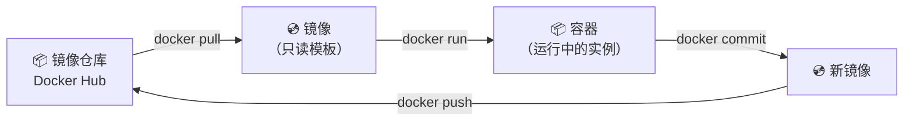

## 🔗 上章回顾

> 这是整个学习路径的第一篇笔记，没有前置内容。
>
> 如果你还没有安装 Docker，请先根据 [[00-Docker 总览索引#📦 环境准备]] 完成安装。本章目标只有一个：**让你亲手把 Docker 跑起来**。暂时不需要懂原理，先用起来。

---

## 📖 核心内容

### 1. Docker 是什么——一句话就够了

翻到任何一本 Docker 教程，第一章都会讲 Namespace、Cgroups、UnionFS、引擎架构……**但你现在不需要这些**。

现在你只需要知道：

> [!important] Docker 一句话定义
> Docker 让你把应用打包成一个"集装箱"（镜像），在任何地方一键运行，不需要手动装依赖、配环境。**"在我机器上能跑啊"——Docker 就是这句话的终结者。**

```bash
# 传统方式运行 Nginx（想想有多麻烦）：
# 1. 安装 Nginx（apt-get / yum / brew）
# 2. 修改配置文件
# 3. 启动 systemd 服务
# 4. 解决端口冲突
# 5. 版本升级时各种依赖冲突……

# Docker 方式运行 Nginx：
docker run -d -p 8080:80 --name my-nginx nginx:alpine
# 一条命令，完成。不需要任何安装。
```

### 2. 容器 vs 虚拟机——先感受，再理解

你现在不需要记这张表。但我希望你**先跑一个容器，感受一下它有多快**，然后再回来看：

| 维度 | 容器 | 虚拟机 |
|------|------|--------|
| 启动速度 | **秒级**（进程启动） | 分钟级（OS 启动） |
| 资源开销 | MB 级 | GB 级 |
| 镜像大小 | 几十 MB | 几 GB |
| 我能干什么 | 运行一个应用 | 运行一个完整 OS |

> [!tip] 你先记住这一条就够了
> 容器 = 轻量级的进程隔离，像一台"精装公寓"。虚拟机 = 重量级的硬件虚拟，像一栋"独栋别墅"。**容器比虚拟机快 100 倍，轻 100 倍。**
>
> 底层原理（Namespace/Cgroups/UnionFS）会在 [[04-镜像分层原理：为什么构建这么快]] 和 [[05-容器隔离原理：Namespace 与 Cgroups]] 中深入讲解。现在你只需要知道：**容器是隔离的进程，不是轻量虚拟机。**

### 3. 核心概念：镜像、容器、仓库

这是你唯一需要知道的三个概念：



| 概念 | 类比 | 命令 |
|------|------|------|
| **镜像（Image）** | 应用程序的安装包 / 光盘 | `docker pull` / `docker images` |
| **容器（Container）** | 安装包运行后的实例 / 正在播放的 DVD | `docker run` / `docker ps` |
| **仓库（Registry）** | 应用商店 / Docker Hub | `docker push` / `docker pull` |

> [!important] 镜像和容器的关系
> 一个镜像可以启动无数个容器，就像一张光盘可以同时在多台 DVD 机上播放。每个容器之间互相隔离，各自有独立的文件系统。

---

## 🎯 实践练习

### 练习 1：验证 Docker 安装

```bash
# 先确认 Docker 已正确安装
docker --version
# 输出示例：Docker version 27.3.1, build xxxxxx

docker compose version
# 输出示例：Docker Compose version v2.29.1

# 运行官方测试镜像
docker run --rm hello-world
# 如果看到 "Hello from Docker!" 的欢迎信息，说明安装成功！
```

> 💡 **注释**：
> `--rm` 参数表示容器退出后自动删除，不留垃圾。
> `hello-world` 是 Docker 官方提供的测试镜像，只有 13KB，专门用来验证安装。

**验证标准**：终端输出 "Hello from Docker!" 即为通过。

### 练习 2：运行你的第一个实用容器——Nginx

```bash
# 1. 启动 Nginx 容器
docker run -d -p 8080:80 --name my-nginx nginx:alpine

# 2. 验证：浏览器打开 http://localhost:8080
# 你应该看到 Nginx 的欢迎页面！

# 3. 查看运行中的容器
docker ps
# CONTAINER ID   IMAGE          COMMAND                  STATUS         PORTS
# abc123def456   nginx:alpine   "/docker-entrypoint.…"   Up 10 seconds   0.0.0.0:8080->80/tcp

# 4. 停止容器
docker stop my-nginx

# 5. 重新启动
docker start my-nginx

# 6. 清理（停止并删除容器）
docker stop my-nginx && docker rm my-nginx
```

> 💡 **参数解释**：
> - `-d`：后台运行（detached），不占用终端
> - `-p 8080:80`：把宿主机的 8080 端口映射到容器的 80 端口（方向：宿主→容器）
> - `--name my-nginx`：给容器起个名字，方便后续操作
> - `nginx:alpine`：镜像名，`alpine` 是精简版（只有 ~7MB，标准版 190MB）
> - `docker start`：重新启动已停止的容器（容器数据还在）
> - `docker run`：创建并启动一个**新**容器（每次 run 都是新容器）

**验证标准**：浏览器访问 `http://localhost:8080` 能看到 Nginx 欢迎页。

### 练习 3：感受容器的秒级启动

```bash
# 用 time 命令感受容器启动有多快
# Windows PowerShell:
Measure-Command { docker run --rm alpine echo "hello" }

# Linux / macOS:
time docker run --rm alpine echo "hello"
# 输出：real 0m0.5s —— 不到 1 秒！

# 对比：启动一个虚拟机通常需要 30 秒到 2 分钟
```

> 💡 **注释**：
> `alpine` 是超轻量 Linux 发行版，只有 7MB。`echo "hello"` 执行完就退出，容器自动删除（因为加了 `--rm`）。这个练习让你直观感受容器和虚拟机的速度差距。

### 练习 4：试一个交互式容器

```bash
# 进入 Alpine 容器的 shell
docker run -it --rm alpine sh

# 在容器内执行一些命令：
ls /              # 查看文件系统结构
cat /etc/os-release  # 查看操作系统信息
hostname          # 容器内的主机名（是一串随机 ID）
exit              # 退出容器，--rm 会自动删除它
```

> 💡 **注释**：
> `-i`：保持 STDIN 打开（能输入），`-t`：分配伪终端（有命令行提示符）。两个合起来 `-it` 才能让你像操作本地终端一样操作容器内部。

### 练习 5：同时运行两个 Nginx 容器

```bash
# 启动两个 Nginx，映射到不同端口
docker run -d -p 8080:80 --name nginx1 nginx:alpine
docker run -d -p 8081:80 --name nginx2 nginx:alpine

# 分别访问：
# http://localhost:8080 → Nginx 1 的欢迎页
# http://localhost:8081 → Nginx 2 的欢迎页

# 修改 Nginx 2 的首页
docker exec nginx2 sh -c "echo '<h1>Nginx 2</h1>' > /usr/share/nginx/html/index.html"

# 刷新 http://localhost:8081，看到 "Nginx 2"
# 而 http://localhost:8080 仍然是默认欢迎页
# 证明了两个容器完全隔离！

# 清理
docker stop nginx1 nginx2 && docker rm nginx1 nginx2
```

> 💡 **注释**：
> 这个练习同时验证了两件事：端口映射的灵活性（同一镜像跑多个容器只需换端口）和容器隔离性（两个容器互不影响）。

---

## 💡 要点注释

1. **`docker run` 每次都会创建新容器**
   ```bash
   docker run --name test nginx:alpine   # 第一次，成功
   docker run --name test nginx:alpine   # 第二次，报错！容器名冲突
   # 原因是第一次创建的容器还在（已停止但没有删除）
   docker rm test                         # 删除旧容器
   docker run --name test nginx:alpine   # 现在可以了
   ```

2. **`docker run` vs `docker start`**
   - `docker run` = 创建新容器 + 启动。每次都生成一个全新的容器。
   - `docker start` = 重新启动一个**已存在**的容器，保留之前的所有数据。

3. **镜像的 tag 很重要**
   - `nginx:alpine` = 指定用 alpine 精简版
   - `nginx:latest` = 默认用最新版（**不推荐**，版本不固定）
   - `nginx:1.27.3-alpine` = 精确指定版本（生产环境必须这样）

4. **端口映射方向**：`-p 8080:80` 中左边是宿主机端口，右边是容器端口。记忆方式：**"宿主→容器"**，从外向内。

---

## 🔄 可选迭代

如果你学有余力，可以尝试：

| 方向 | 内容 |
|------|------|
| 换个镜像跑 | `docker run --rm redis:7-alpine`（缓存数据库） |
| 查看本地镜像 | `docker images` 看看本地缓存了哪些镜像 |
| 探索 Docker Desktop | 打开 Dashboard 界面，浏览 Containers / Images / Volumes 标签页 |
| Docker Hub 探索 | 访问 https://hub.docker.com/ 搜索 `redis`、`postgres`、`busybox` |
| 资源监控 | `docker stats` 实时查看容器的 CPU、内存使用 |

---

## ⚠️ 常见易错点

> [!warning] **坑 1：端口被占用**
> ```bash
> docker run -p 8080:80 nginx:alpine
> # Error: port is already allocated
> ```
> **为什么错**：宿主机的 8080 端口已被其他程序占用。
> **解决方案**：换个端口，比如 `-p 8081:80`，或用 `netstat -ano | findstr 8080`（Windows）/ `lsof -i :8080`（Linux/Mac）查看占用进程。

> [!warning] **坑 2：容器名冲突**
> ```bash
> docker run --name my-nginx nginx:alpine
> # Error: Conflict. The container name "/my-nginx" is already in use
> ```
> **为什么错**：之前用 `docker run` 创建过同名容器，虽然停止了但没删除。
> **解决方案**：`docker rm my-nginx` 删除旧容器，或给新容器换个名字。

> [!warning] **坑 3：`docker run` 后容器立即退出**
> ```bash
> docker run --name test alpine echo "done"
> docker ps
> # 看不到 test 容器
> ```
> **为什么错**：容器的生命周期绑定在主进程。`echo "done"` 执行完就退出，容器也退出了。
> **解决方案**：`docker ps -a` 可以看到所有容器（包括已停止的）。

> [!warning] **坑 4：Docker Desktop 没启动**
> ```bash
> docker ps
> # Error: Docker daemon is not running
> ```
> **为什么错**：Docker Desktop 没有在后台运行。
> **解决方案**：启动 Docker Desktop 应用程序，等待状态栏图标变绿。

> [!warning] **坑 5：使用 `:latest` 标签**
> ```bash
> # ❌ latest 是可变标签，今天拉的和明天可能不同
> docker pull nginx:latest
> # ✅ 指定具体版本
> docker pull nginx:1.27.3-alpine
> ```
> **为什么错**：`latest` 不保证指向同一镜像，导致环境不一致。
> **解决方案**：始终指定具体版本标签。

---

## 🎯 本文学完自检

| 层次 | 检查项 |
|------|--------|
| 🟢 基础 | 能运行 `docker run --rm hello-world` 看到欢迎信息；能启动 Nginx 容器并通过浏览器访问 |
| 🟡 进阶 | 能解释镜像、容器、仓库三者的关系；能区分 `docker run`、`docker start`、`docker stop`、`docker rm` |
| 🔴 挑战 | 能运行 3 个不同的容器（Nginx + Redis + Alpine），用 `docker ps` 查看状态，最后全部清理干净 |

---

## 🔗 相关笔记

- ⬅️ 前置：[[00-Docker 总览索引]] — 回到课程总览
- ➡️ 后续：[[02-容器管理：查看、停止、调试与端口映射]] — 学会管理容器的生命周期
- 🔗 关联：[[跨技术栈学习路径总览]] — 跨技术栈学习规划

---

*最后更新：2026-07-28*