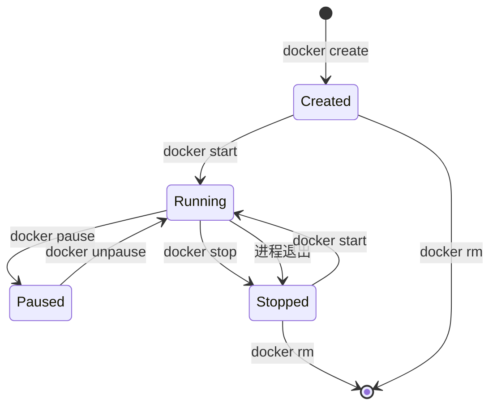

## 🔗 上章回顾

> 在 [[01-初识 Docker：从安装到运行你的第一个容器|上一章]] 中，你学会了：
> - Docker 是什么（应用打包 + 一键运行）
> - 镜像、容器、仓库三个核心概念
> - 用 `docker run` 启动了人生第一个 Nginx 容器
>
> 但你只是"跑起来"了。本章我们聚焦于 **容器管理**——容器跑起来之后，怎么查看、怎么停止、怎么重启、怎么进去调试、怎么配置端口映射。**从"会跑"到"会管"。**

---

## 📖 核心内容

### 1. 容器生命周期——一张图就够了



你不需要记住所有状态。日常使用中，你只需要关注四个操作：

| 我想做… | 用什么命令 |
|---------|-----------|
| 创建并启动一个新容器 | `docker run` |
| 停止一个运行中的容器 | `docker stop` |
| 重新启动一个已停止的容器 | `docker start` |
| 删除一个已停止的容器 | `docker rm` |

> [!tip] `docker start` 和 `docker run` 的区别
> `docker run` = 创建新容器 + 启动。每次都生成一个全新的容器。
> `docker start` = 重新启动一个**已存在**的容器，保留之前的所有数据。

### 2. 查看容器——`docker ps` 是你的眼睛

```bash
# 查看运行中的容器
docker ps
# CONTAINER ID   IMAGE          STATUS         PORTS                  NAMES
# abc123def456   nginx:alpine   Up 2 hours     0.0.0.0:8080->80/tcp   my-nginx

# 查看所有容器（包括已停止的）
docker ps -a

# 只显示容器 ID（用于脚本）
docker ps -q

# 查看最近创建的 3 个容器
docker ps -n 3

# 格式化输出（更清爽，适合写脚本时用）
docker ps --format "table {{.ID}}\t{{.Image}}\t{{.Status}}\t{{.Ports}}"
```

### 3. 查看日志——`docker logs` 是你的耳朵

```bash
# 查看全部日志
docker logs my-nginx

# 实时跟踪日志（类似 tail -f）
docker logs -f my-nginx

# 查看最后 50 行
docker logs --tail 50 my-nginx

# 查看最近 10 分钟的日志
docker logs --since 10m my-nginx

# 查看某时间段内的日志
docker logs --since 2026-07-28T08:00:00 --until 2026-07-28T09:00:00 my-nginx
```

> [!tip] 日志是排查问题的第一手资料
> 如果应用起不来，先看 `docker logs <container>`。90% 的启动失败都能从日志中找到原因。

### 4. 进入容器内部——`docker exec` 是你的双手

```bash
# 进入运行中的容器，打开一个交互式 shell
docker exec -it my-nginx sh

# 进入后，你可以：
# ls /etc/nginx/           # 查看 Nginx 配置目录
# cat /etc/nginx/nginx.conf  # 查看配置文件
# whoami                   # 看到 root（注意安全！）
# cat /etc/os-release       # 查看操作系统信息
# exit                      # 退出容器（容器继续运行）

# 在容器内执行单条命令（不进入 shell）
docker exec my-nginx cat /etc/nginx/nginx.conf
docker exec my-nginx ls /usr/share/nginx/html/
```

> [!tip] `-it` 参数的含义
> `-i`：保持 STDIN 打开（能输入）
> `-t`：分配一个伪终端（有命令行提示符）
> 两个合起来 `-it` 才能让你像操作本地终端一样操作容器内部。
> 如果不加 `-it`，`docker exec my-nginx sh` 会一闪而过就退出。

### 5. 端口映射——让外界访问容器

在上一章你用了 `-p 8080:80`，现在来理解它到底做了什么：


```bash
# 格式：-p 宿主机端口:容器端口
docker run -d -p 8080:80 nginx:alpine           # 所有网络接口可访问
docker run -d -p 127.0.0.1:8080:80 nginx:alpine  # 仅本机可访问
docker run -d -p 80 nginx:alpine                  # 随机分配宿主机端口

# 查看端口映射
docker port my-nginx
# 80/tcp -> 0.0.0.0:8080
```

### 6. 重启策略——容器挂了怎么办

```bash
docker run --restart=no nginx              # 默认，不自动重启
docker run --restart=on-failure nginx      # 非 0 退出码时重启
docker run --restart=on-failure:5 nginx    # 最多重启 5 次
docker run --restart=always nginx          # 永远重启（含正常退出）
docker run --restart=unless-stopped nginx  # 除非手动停止，否则总重启
```

> [!tip] 日常开发用 `--restart=no`，生产环境用 `--restart=unless-stopped`
> `always` 和 `unless-stopped` 的区别：手动 `docker stop` 后，Docker 重启时 `always` 会自动启动该容器，而 `unless-stopped` 不会。

---

## 🎯 实践练习

### 练习 1：容器生命周期管理

```bash
# 1. 启动一个容器
docker run -d --name lifecycle-test nginx:alpine

# 2. 查看运行状态
docker ps | grep lifecycle-test

# 3. 停止容器
docker stop lifecycle-test

# 4. 确认已停止
docker ps -a | grep lifecycle-test
# STATUS 列显示 "Exited (0)"

# 5. 重新启动
docker start lifecycle-test

# 6. 暂停容器（冻结进程）
docker pause lifecycle-test

# 7. 恢复
docker unpause lifecycle-test

# 8. 强制杀死（不优雅，生产环境慎用）
docker kill lifecycle-test

# 9. 删除容器
docker rm lifecycle-test
```

> 💡 **注释**：
> `docker pause` 和 `docker stop` 的区别：
> - `pause`：冻结进程（SIGSTOP），不释放资源，`unpause` 后恢复
> - `stop`：发 SIGTERM 优雅终止，10 秒后如果还没退出则发 SIGKILL
> `stop` 后再 `start`，容器数据完好无损。只有 `rm` 才会清除数据。

### 练习 2：日志调试实战

```bash
# 1. 启动一个会持续输出日志的容器
docker run -d --name log-test alpine sh -c "while true; do date; sleep 2; done"

# 2. 实时查看日志
docker logs -f log-test
# 每 2 秒输出一行时间戳，Ctrl+C 退出

# 3. 查看最后 5 条
docker logs --tail 5 log-test

# 4. 清理
docker stop log-test && docker rm log-test
```

> 💡 **注释**：
> `sh -c "while true; do date; sleep 2; done"` 是一个简单的循环脚本，每 2 秒输出当前时间。容器的主进程就是这个脚本，只要脚本在跑，容器就在跑。

### 练习 3：进入容器内部调试

```bash
# 1. 启动 Nginx
docker run -d -p 8080:80 --name debug-test nginx:alpine

# 2. 进入容器
docker exec -it debug-test sh

# 3. 在容器内执行以下命令（逐行输入）：
#    whoami                     # 看到 root（注意安全！）
#    cat /etc/os-release        # 查看操作系统信息
#    ls /usr/share/nginx/html/  # 查看 Nginx 网站目录
#    echo "Hello Docker" > /usr/share/nginx/html/index.html  # 修改首页
#    exit                       # 退出

# 4. 浏览器访问 http://localhost:8080
# 页面内容变成了 "Hello Docker"！

# 5. 不进入容器，直接执行命令
docker exec debug-test cat /usr/share/nginx/html/index.html

# 6. 清理
docker stop debug-test && docker rm debug-test
```

> 💡 **注释**：
> 在容器内修改文件是一个**反模式**！容器重建后所有手动修改都会丢失。正确的做法是修改 Dockerfile 或挂载外部配置文件。但作为调试手段，`docker exec` 非常有用。这个概念叫做"不可变基础设施"——后面会反复强调。

### 练习 4：体验重启策略

```bash
# 1. 创建一个会自动重启的容器
docker run -d --restart=always --name auto-nginx -p 8081:80 nginx:alpine

# 2. 手动停止
docker stop auto-nginx

# 3. 查看状态——虽然手动停止了，但 --restart=always 会在 Docker 重启时自动拉起
docker ps -a | grep auto-nginx

# 4. 清理
docker rm -f auto-nginx
```

> 💡 **注释**：
> `--restart=always` 会让容器在 Docker 守护进程重启后自动启动。但手动 `docker stop` 后，容器不会立即被重新拉起（只在 Docker 重启时触发）。生产环境推荐 `unless-stopped`，避免意外启动。

---

## 💡 要点注释

1. **`docker stop` 是优雅的，`docker kill` 是暴力的**
   - `stop` = 发 SIGTERM，给应用 10 秒清理资源
   - `kill` = 直接 SIGKILL，不给应用任何机会
   - 日常用 `stop`，紧急情况才用 `kill`

2. **容器的主进程退出 = 容器退出**
   - 容器绑定在主进程的生命周期上
   - 如果 CMD 是 `echo "hello"`，hello 执行完容器就退出

3. **`docker ps -a` 是诊断利器**
   - 遇到"容器启动就退出"的问题，先看 `docker ps -a` 的 STATUS 列
   - `Exited (0)` = 正常退出
   - `Exited (1)` = 异常退出（应用挂了）

4. **容器是临时的**
   - 容器删除后，里面新增的数据会丢失（后面会学 Volume 解决）
   - 不要把重要数据直接存在容器里

---

## 🔄 可选迭代

1. **尝试 `docker stats`**：实时查看容器的 CPU、内存、网络使用
2. **尝试 `docker top my-nginx`**：查看容器内的进程列表
3. **尝试 `docker inspect my-nginx`**：查看容器的完整配置信息（JSON 格式）
4. **用 `docker run --rm` 跑一个临时容器**：`docker run --rm -it alpine sh`，exit 后自动删除
5. **批量清理**：`docker container prune` 删除所有已停止的容器

---

## ⚠️ 常见易错点

> [!warning] **坑 1：`docker stop` 后 `docker start`，数据还在**
> 很多人以为 `docker stop` 会清空容器数据。实际上，stop 只是暂停，start 重新启动后数据完好无损。只有 `docker rm` 才会清除数据。

> [!warning] **坑 2：`docker exec` 进去改配置，重建后丢失**
> ```bash
> docker exec -it prod-nginx vi /etc/nginx/nginx.conf
> docker restart prod-nginx  # 配置生效了...但下次重建容器就没了
> ```
> **为什么错**：修改运行中的容器违背了"基础设施即代码"的原则。
> **解决方案**：把配置写进 Dockerfile 或外部挂载，用 `docker compose up -d` 重建。

> [!warning] **坑 3：端口冲突**
> 两个容器不能映射到同一个宿主机端口。如果 8080 被占了，用 `netstat -ano | findstr 8080`（Windows）或 `lsof -i :8080`（Linux/Mac）查看占用进程。

> [!warning] **坑 4：忘记 `-it` 参数**
> `docker exec my-nginx sh` 会一闪而过就退出。必须加 `-it`（`docker exec -it my-nginx sh`）才能进入交互式 shell。

> [!warning] **坑 5：`docker logs` 看到大量日志撑爆磁盘**
> 默认 Docker 不限制日志大小。生产环境用 `--log-opt max-size=10m --log-opt max-file=3` 限制日志。

---

## 🎯 本文学完自检

| 层次 | 检查项 |
|------|--------|
| 🟢 基础 | 能用 `docker ps`、`docker logs`、`docker exec` 查看和管理容器；能正确配置端口映射 |
| 🟡 进阶 | 能解释容器生命周期（Created→Running→Stopped）；能区分 `docker stop` 和 `docker kill`；能配置重启策略 |
| 🔴 挑战 | 能通过 `docker logs` 和 `docker exec` 排查一个容器启动失败的问题；能同时运行 3 个不同端口的 Nginx 容器并管理它们 |

---

## 🔗 相关笔记

- ⬅️ 前置：[[01-初识 Docker：从安装到运行你的第一个容器]] — 上一章
- ➡️ 后续：[[03-构建你的第一个镜像]] — 学会把自己的代码打包成镜像
- 🔗 关联：[[00-Docker 总览索引]] — 回到课程总览

---

*最后更新：2026-07-28*