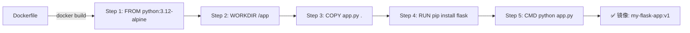

## 🔗 上章回顾

> 在 [[02-容器管理：查看、停止、调试与端口映射|上一章]] 中，你学会了：
> - 用 `docker ps`、`docker logs`、`docker exec` 管理容器
> - 配置端口映射让外界访问容器
> - 理解容器生命周期和重启策略
>
> 但你一直在用**别人的镜像**（nginx、alpine、redis）。**本章你将学会把自己的代码打包成镜像——从消费者变成生产者。**

---

## 📖 核心内容

### 1. Dockerfile 是什么——一句话

Dockerfile 是一个文本文件，里面写的是"构建镜像的步骤"。就像菜谱告诉你"先放什么、再放什么"一样，Dockerfile 告诉 Docker "怎么组装这个镜像"。

```dockerfile
# 这就是一个最简单的 Dockerfile
FROM python:3.12-alpine            # 1. 以 Python 镜像为基础
COPY app.py /app/                  # 2. 把你的代码复制进去
WORKDIR /app                       # 3. 设置工作目录
RUN pip install flask              # 4. 安装依赖
CMD ["python", "app.py"]           # 5. 指定启动命令
```

### 2. 五个核心指令——先学会这 5 个就够了

| 指令 | 作用 | 类比 | 示例 |
|------|------|------|------|
| `FROM` | 指定基础镜像 | 选地基 | `FROM python:3.12-alpine` |
| `COPY` | 把文件复制进镜像 | 搬家具 | `COPY app.py /app/` |
| `RUN` | 在构建时执行命令 | 装修 | `RUN pip install flask` |
| `WORKDIR` | 设置工作目录 | 指定房间 | `WORKDIR /app` |
| `CMD` | 容器启动时默认命令 | 按开关 | `CMD ["python", "app.py"]` |

> [!important] 先学会这 5 个就够了
> Dockerfile 有十几条指令，但 **FROM + COPY + RUN + WORKDIR + CMD** 这 5 个覆盖了 80% 的场景。其他指令（ENTRYPOINT、ENV、ARG、USER、HEALTHCHECK）等你遇到具体需求时再学。

### 3. 基础镜像的选择

| 基础镜像 | 大小 | 适用场景 |
|---------|------|---------|
| `python:3.12` | ~1GB | 开发调试（含所有工具） |
| `python:3.12-slim` | ~150MB | 生产（精简，去掉编译工具） |
| `python:3.12-alpine` | ~65MB | 极致精简（基于 Alpine Linux） |
| `nginx:alpine` | ~7MB | 静态站点 |

> [!tip] 开发时用完整版，生产时用 slim 或 alpine
> 这和后面镜像优化章节直接相关——基础镜像越小，最终镜像越小。

### 4. 你的第一个 Dockerfile

```dockerfile
# Dockerfile
FROM python:3.12-alpine

WORKDIR /app

COPY app.py .

RUN pip install flask

CMD ["python", "app.py"]
```

```python
# app.py（放在 Dockerfile 同一目录下）
from flask import Flask

app = Flask(__name__)

@app.route('/')
def hello():
    return '<h1>Hello from my Docker container!</h1>'

if __name__ == '__main__':
    app.run(host='0.0.0.0', port=5000)
```

### 5. 构建镜像——`docker build`

```bash
# 在 Dockerfile 所在目录执行
docker build -t my-flask-app:v1 .

# 参数解释：
# -t my-flask-app:v1  → 给镜像起名 + 版本标签
# .                   → 构建上下文（当前目录）
```



### 6. 运行你的镜像

```bash
# 从你的镜像启动容器
docker run -d -p 5000:5000 --name my-flask my-flask-app:v1

# 浏览器访问 http://localhost:5000
# 看到 "Hello from my Docker container!"
```

### 7. 镜像标签管理

```bash
# 查看本地镜像
docker images
# REPOSITORY       TAG       SIZE
# my-flask-app     v1        65MB

# 给镜像打多个标签（标签只是别名，指向同一个镜像 ID）
docker tag my-flask-app:v1 my-flask-app:latest
docker tag my-flask-app:v1 my-flask-app:stable

# 删除标签
docker rmi my-flask-app:latest

# 删除镜像（如果没有容器在使用）
docker rmi my-flask-app:v1
```

> [!important] 生产环境不要用 `latest`
> `latest` 是可变标签，今天构建的和明天可能不同。生产环境必须用具体版本，如 `my-flask-app:v1.0.0`。

---

## 🎯 实践练习

### 练习 1：构建你的第一个镜像

```bash
# 1. 创建项目目录
mkdir my-first-docker-image
cd my-first-docker-image

# 2. 创建 app.py（复制上面的 Python 代码）
# 3. 创建 Dockerfile（复制上面的内容）

# 4. 构建镜像
docker build -t my-flask-app:v1 .

# 5. 查看构建结果
docker images | grep my-flask-app

# 6. 运行
docker run -d -p 5000:5000 --name my-flask my-flask-app:v1

# 7. 验证
curl http://localhost:5000
# 或在浏览器中打开 http://localhost:5000

# 8. 清理
docker stop my-flask && docker rm my-flask
```

> 💡 **注释**：
> 构建时如果看到 `Step 1/5`、`Step 2/5`……说明 Docker 正在按顺序执行 Dockerfile 的每条指令。每条指令会生成一个"层"（layer），后面会详细讲。

**验证标准**：浏览器访问 `http://localhost:5000` 看到 "Hello from my Docker container!"。

### 练习 2：修改代码后重新构建

```bash
# 1. 修改 app.py 的返回内容
# 把 "Hello from my Docker container!" 改成 "Hello Docker! Version 2"

# 2. 重新构建（注意观察哪些 Step 显示 CACHED——这就是构建缓存）
docker build -t my-flask-app:v2 .

# 3. 运行新版本
docker run -d -p 5001:5000 --name my-flask-v2 my-flask-app:v2

# 4. 验证新内容
curl http://localhost:5001

# 5. 看两个版本的镜像
docker images | grep my-flask-app
# my-flask-app   v2   65MB
# my-flask-app   v1   65MB
```

> 💡 **注释**：
> 镜像标签让你可以同时保留多个版本。v1 和 v2 是两个独立镜像，互不影响。注意 `5001:5000` 用了新的宿主机端口，避免和 v1 的 `5000` 冲突。

### 练习 3：尝试不同的基础镜像

```bash
# 1. 用 nginx 基础镜像构建一个静态网站
# 创建 Dockerfile：
# FROM nginx:alpine
# COPY index.html /usr/share/nginx/html/index.html

# 创建 index.html：
# <h1>My Static Site</h1>

# 2. 构建并运行
docker build -t my-static-site:v1 .
docker run -d -p 8080:80 --name my-site my-static-site:v1

# 3. 浏览器访问 http://localhost:8080
```

> 💡 **注释**：
> 这个练习让你体会：**同样的 Dockerfile 结构，换不同的基础镜像，就能构建不同类型的应用。** 这就是 Dockerfile 的通用性。

### 练习 4：查看镜像构建历史

```bash
# 查看镜像的分层结构
docker image history my-flask-app:v1
# IMAGE          CREATED       SIZE    COMMENT
# <sha256>       ...           0B      CMD ["python" "app.py"]
# <sha256>       ...           2.1MB   RUN pip install flask
# <sha256>       ...           1.2kB   COPY app.py .
# <sha256>       ...           0B      WORKDIR /app
# <sha256>       ...           50MB    FROM python:3.12-alpine  ← 基础层
```

> 💡 **注释**：
> 每条 Dockerfile 指令都会生成一个层。这是理解镜像分层的入口——下一章会深入讲解为什么分层很重要。

---

## 💡 要点注释

1. **`COPY` 和 `ADD` 的区别**
   - `COPY`：只做复制，行为明确，推荐使用
   - `ADD`：额外支持 URL 下载和自动解压 tar，容易出意外，**尽量避免**

2. **构建上下文（`.`）**
   - `docker build -t myapp .` 中的 `.` 是构建上下文目录
   - Docker 会把整个目录发送给 Docker 引擎
   - 如果目录里有 `node_modules`（几百 MB），构建会很慢！后面会讲 `.dockerignore` 解决这个问题

3. **`COPY` 的顺序很重要**
   ```dockerfile
   # ✅ 缓存友好——先 COPY 依赖文件，再 COPY 代码
   COPY requirements.txt .
   RUN pip install -r requirements.txt
   COPY . .  # 代码变更只影响这一层

   # ❌ 缓存不友好——每次代码变更都重装依赖
   COPY . .
   RUN pip install -r requirements.txt
   ```
   原因：某层变化后，该层及后续所有层缓存失效。把最常变的放在最后。这会在 [[04-镜像分层原理：为什么构建这么快]] 中深入讲解。

4. **`CMD` 的两种格式**
   ```dockerfile
   # exec 格式（推荐）：PID 1 是应用本身
   CMD ["python", "app.py"]

   # shell 格式（不推荐）：PID 1 是 /bin/sh，不转发 SIGTERM
   CMD python app.py
   ```
   **目前先记住用 exec 格式就好，原因后面会讲。**

---

## 🔄 可选迭代

1. **尝试 `docker build --no-cache`**：强制不使用缓存重新构建，对比速度差异
2. **尝试构建一个 Node.js 镜像**：`FROM node:20-alpine`，用 `npm init -y && npm install express` 做一个小应用
3. **给镜像打多个标签**：`docker tag my-flask-app:v1 my-flask-app:stable`
4. **探索 `EXPOSE` 指令**：在 Dockerfile 中加 `EXPOSE 5000`，它声明端口但不实际开放——运行时仍需 `-p`

---

## ⚠️ 常见易错点

> [!warning] **坑 1：文件路径不对**
> ```dockerfile
> COPY app.py .
> # 如果 app.py 不在 Dockerfile 同级目录，构建失败
> ```
> **为什么错**：`COPY` 的源路径是相对于**构建上下文**（`docker build` 命令中的 `.`）的，不是相对 Dockerfile 的。
> **解决方案**：确保要复制的文件在构建上下文中。

> [!warning] **坑 2：`docker build` 忘记 `.`**
> ```bash
> docker build -t myapp   # ❌ 缺少构建上下文
> docker build -t myapp . # ✅ 正确
> ```

> [!warning] **坑 3：容器启动后立即退出**
> ```bash
> docker run my-flask-app:v1
> docker ps  # 看不到容器
> ```
> **为什么错**：可能是应用代码有 bug，启动就崩溃了。
> **解决方案**：`docker ps -a` 看退出状态，`docker logs <container>` 看错误日志。

> [!warning] **坑 4：Dockerfile 文件名大小写**
> Docker 默认找 `Dockerfile`（首字母大写 D），不是 `dockerfile`。如果文件名不对，`docker build` 会报错找不到 Dockerfile。

> [!warning] **坑 5：CMD 用 shell 格式导致无法优雅停止**
> ```dockerfile
> CMD python app.py        # PID 1 是 sh，不转发 SIGTERM
> CMD ["python", "app.py"] # PID 1 是 python，能优雅停止
> ```
> **解决方案**：始终使用 exec 格式的 CMD。

---

## 🎯 本文学完自检

| 层次 | 检查项 |
|------|--------|
| 🟢 基础 | 能写出包含 FROM + COPY + RUN + CMD 的 Dockerfile；能构建镜像并运行容器 |
| 🟡 进阶 | 能解释 Dockerfile 中每条指令的作用；能使用镜像标签管理多个版本；能用不同基础镜像构建不同类型的应用 |
| 🔴 挑战 | 能为一个已有的 Python 项目（比如你的 Side Project）编写 Dockerfile，构建镜像并成功运行，过程中排查并修复至少 2 个构建或运行错误 |

---

## 🔗 相关笔记

- ⬅️ 前置：[[02-容器管理：查看、停止、调试与端口映射]] — 上一章
- ➡️ 后续：[[04-镜像分层原理：为什么构建这么快]] — 解开构建缓存的秘密
- 🔗 关联：[[00-Docker 总览索引]] — 回到课程总览
- 🔗 关联：[[08-镜像优化：多阶段构建与瘦身]] — 进阶优化 Dockerfile

---

*最后更新：2026-07-28*