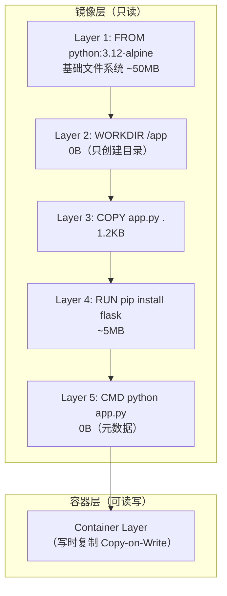
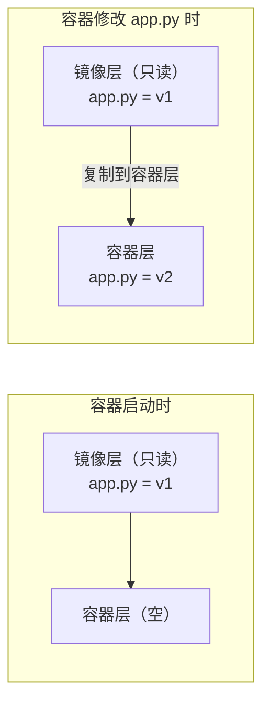
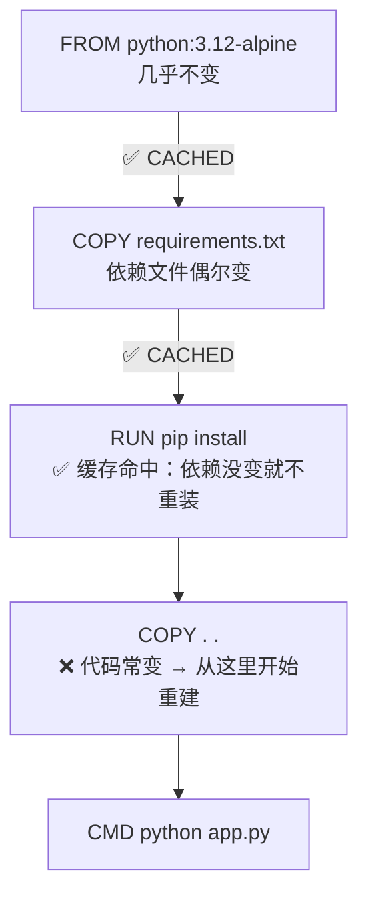

## 🔗 上章回顾

> 在 [[03-构建你的第一个镜像|上一章]] 中，你学会了：
> - 写 Dockerfile（FROM + COPY + RUN + CMD）
> - 用 `docker build` 构建镜像
> - 用 `docker image history` 查看镜像分层
>
> 你一定注意到了一个现象：**第二次构建时，有些 Step 显示 `CACHED`，瞬间完成**。为什么？这背后就是镜像分层和构建缓存机制。
>
> 本章的目标是揭开这个谜底。你已经用过 Docker 了，现在是时候理解它底层的"魔法"了。

---

## 📖 核心内容

### 1. 镜像是分层的——像千层蛋糕

Docker 镜像不是一整块文件，而是由多个**只读层**叠加而成。每条 Dockerfile 指令生成一个新层：



```bash
# 亲眼看看你的镜像有哪些层
docker image history my-flask-app:v1
# IMAGE          CREATED       SIZE      COMMENT
# abcd1234       10 min ago    0B        CMD ["python" "app.py"]
# efgh5678       10 min ago    5.1MB     RUN pip install flask
# ijkl9012       10 min ago    1.2kB     COPY app.py .
# mnop3456       10 min ago    0B        WORKDIR /app
# qrst7890       2 days ago    50MB      FROM python:3.12-alpine
```

> [!important] 分层的核心概念
> Docker 镜像由**只读层**叠加而成。**每条 Dockerfile 指令生成一个新层**。容器启动时，在上面加一个可读写层（容器层）。
>
> 分层的三个好处：
> 1. **共享基础层**：10 个 Python 容器用同一个基础镜像，磁盘只存一份
> 2. **增量构建**：修改只重建变化层，未变层用缓存
> 3. **写时复制（Copy-on-Write）**：容器修改文件时从镜像层复制到容器层，不影响镜像

### 2. 写时复制（Copy-on-Write）——容器修改文件的原理



```bash
# 验证：容器修改文件不影响镜像
docker run -d --name cow-test nginx:alpine
docker exec cow-test sh -c "echo 'modified' > /usr/share/nginx/html/index.html"
# 容器内首页被修改了

# 但删除容器、重新从同一镜像启动：
docker stop cow-test && docker rm cow-test
docker run -d --name cow-test2 nginx:alpine
docker exec cow-test2 cat /usr/share/nginx/html/index.html
# 还是原始内容！修改只存在于旧容器的容器层中
docker rm -f cow-test2
```

> [!tip] 写时复制是容器"用完即弃"的基础
> 正因为修改只存在于容器层，删除容器 = 清除所有修改。这就是为什么我们说"容器是临时的"——数据持久化需要 Volume（[[06-容器网络与存储|下一章之后]] 会讲）。

### 3. 构建缓存——为什么第二次构建秒级完成



> [!important] 缓存黄金法则
> **某层变化后，该层及后续所有层缓存全部失效。**
> 所以：**把最常变的放在最后，最不常变的放在最前。**

```dockerfile
# ❌ 缓存不友好——每次代码变更都重装依赖
FROM python:3.12-alpine
COPY . .                         # 代码常变 → 缓存失效
RUN pip install -r requirements.txt  # 代码变了就重装！

# ✅ 缓存友好——依赖和代码分离
FROM python:3.12-alpine
COPY requirements.txt .          # 依赖文件很少变
RUN pip install -r requirements.txt  # ✅ 缓存命中！
COPY . .                         # 代码常变，只影响这一层
```

```bash
# 查看构建日志确认缓存使用情况
docker build -t myapp . --progress=plain 2>&1 | grep "CACHED"

# 强制不使用缓存
docker build --no-cache -t myapp .
```

### 4. `.dockerignore`——不把垃圾打进镜像

```dockerignore
# .dockerignore
.git
.gitignore
node_modules
__pycache__
*.pyc
.venv
venv
.env
.env.*
.vscode
.idea
*.md
docs/
dist
build
Dockerfile*
docker-compose*.yml
.dockerignore
tests/
coverage/
```

> [!important] `.dockerignore` 的三个作用
> 1. **减小上下文**：不传 `node_modules`（几百 MB），构建更快
> 2. **防止缓存失效**：不传 `.git`（每次 commit 变化），避免缓存无故失效
> 3. **防止泄露**：不传 `.env` 中的密钥

### 5. UnionFS/OverlayFS——分层的底层技术

镜像分层基于 Linux 的 **UnionFS（联合文件系统）**，Docker 默认使用 **OverlayFS**：

| 概念 | 含义 |
|------|------|
| Lowerdir | 底层只读目录（镜像层） |
| Upperdir | 上层可写目录（容器层） |
| Merged | 合并后的视图，容器内看到的就是它 |

> [!tip] 你不需要懂 OverlayFS 的所有细节
> 本节的目标是让你理解：**镜像为什么分层、缓存为什么有效**。底层 UnionFS 的具体实现可以等实际排查问题时再深入学习。

---

## 🎯 实践练习

### 练习 1：观察构建缓存

```bash
# 1. 在上一个练习的项目目录中，第一次构建
docker build -t cache-test:v1 . --progress=plain

# 2. 不改任何文件，第二次构建——观察 CACHED
docker build -t cache-test:v2 . --progress=plain
# Step 2/5: FROM python:3.12-alpine  → CACHED
# Step 3/5: WORKDIR /app             → CACHED
# Step 4/5: COPY app.py .            → CACHED  ← app.py 没变
# Step 5/5: RUN pip install flask    → CACHED

# 3. 修改 app.py（加一行注释），第三次构建——观察哪一层重建
docker build -t cache-test:v3 . --progress=plain
# Step 4/5: COPY app.py .            → 重建！（app.py 变了）
# Step 5/5: RUN pip install flask    → 重建！（上一层变了，后续全部失效）
```

> 💡 **注释**：
> 这个练习让你亲眼看到缓存机制：只要某层变化，后续所有层都重建。这就是为什么要把最常变的 `COPY . .` 放在 Dockerfile 最后。

### 练习 2：体验写时复制

```bash
# 1. 启动两个相同镜像的容器
docker run -d --name cow1 nginx:alpine
docker run -d --name cow2 nginx:alpine

# 2. 在 cow1 中修改首页
docker exec cow1 sh -c "echo 'Cow1 was here' > /usr/share/nginx/html/index.html"

# 3. 验证 cow2 不受影响
docker exec cow2 cat /usr/share/nginx/html/index.html
# 输出默认的 Nginx 欢迎页内容——两个容器完全隔离！

# 4. 删除 cow1 并重新创建
docker stop cow1 && docker rm cow1
docker run -d --name cow1-new nginx:alpine
docker exec cow1-new cat /usr/share/nginx/html/index.html
# 还是默认内容！修改只存在于旧容器的容器层中

# 5. 清理
docker rm -f cow1-new cow2
```

> 💡 **注释**：
> 这个练习证明了：容器间互相隔离，且容器层的修改不持久——删除容器即丢失。这就是为什么需要 Volume 来持久化数据。

### 练习 3：使用 `.dockerignore` 优化构建上下文

```bash
# 1. 在项目目录创建一些"垃圾文件"
mkdir -p .git && echo "fake git data" > .git/data
mkdir -p __pycache__ && echo "cache" > __pycache__/app.cpython-312.pyc
echo "SECRET_KEY=topsecret" > .env

# 2. 不用 .dockerignore 构建——观察上下文大小
docker build -t no-ignore:v1 . --progress=plain
# 输出：transferring context: 2.5MB

# 3. 创建 .dockerignore
cat > .dockerignore << 'EOF'
.git
__pycache__
*.pyc
.env
EOF

# 4. 用 .dockerignore 构建——对比上下文大小
docker build -t with-ignore:v1 . --progress=plain
# 输出：transferring context: 1.2KB
```

> 💡 **注释**：
> 构建上下文从 2.5MB 降到 1.2KB。更关键的是，`.env` 被排除了，防止密钥泄露到镜像中。

### 练习 4：查看镜像分层（dive 工具）

```bash
# 1. 查看你构建的镜像分层
docker image history my-flask-app:v1

# 2. 安装 dive 工具（可选，但强烈推荐）
# macOS: brew install dive
# Linux: https://github.com/wagoodman/dive/releases
# Windows: choco install dive

# 3. 用 dive 可视化查看
dive my-flask-app:v1
# 交互式地查看每一层添加了什么文件、哪些文件被修改了
```

> 💡 **注释**：
> `docker image history` 显示每层的基本信息。`dive` 工具更强大，能可视化展示每一层具体添加、修改、删除了哪些文件，是镜像优化利器。

---

## 💡 要点注释

1. **层的粒度**：每条 Dockerfile 指令 = 一层。`RUN apt-get install A B C` 是一层，拆成 3 条 `RUN` 是三层。合并 RUN 可以减少层数。

2. **缓存的双刃剑**：缓存让构建快，但 `apt-get update` 被缓存后，`install` 可能装到过期包。解决方案：合并为一条指令。
   ```dockerfile
   RUN apt-get update && apt-get install -y --no-install-recommends curl && rm -rf /var/lib/apt/lists/*
   ```

3. **`.dockerignore` 不是 `.gitignore`**：两者作用类似但场景不同。`.dockerignore` 排除的是**构建上下文**中的文件，即 `docker build` 发送给引擎的文件。

4. **基础镜像层是共享的**：你构建 5 个基于 `python:3.12-alpine` 的镜像，基础层（~50MB）在磁盘上只存一份。

---

## 🔄 可选迭代

1. **合并 RUN 指令减少层数**：
   ```dockerfile
   # ❌ 3 层
   RUN apt-get update
   RUN apt-get install -y curl
   RUN rm -rf /var/lib/apt/lists/*

   # ✅ 1 层
   RUN apt-get update && apt-get install -y --no-install-recommends curl && rm -rf /var/lib/apt/lists/*
   ```

2. **尝试 `--no-cache` 构建对比**：`docker build --no-cache -t myapp .`

3. **探索 BuildKit 缓存挂载**：`RUN --mount=type=cache,target=/root/.cache/pip pip install -r requirements.txt`——跨构建复用 pip 缓存，[[08-镜像优化：多阶段构建与瘦身]] 会详细讲

4. **用 dive 分析官方镜像**：`dive nginx:alpine`，看看官方镜像是怎么构建的

---

## ⚠️ 常见易错点

> [!warning] **坑 1：`COPY . .` 把整个项目打进镜像**
> 没有 `.dockerignore`，`node_modules`、`.git`、`.env` 全进去，镜像膨胀 + 泄露密钥。
> **解决方案**：永远先写 `.dockerignore`。

> [!warning] **坑 2：`apt-get update` 和 `install` 分开写**
> ```dockerfile
> # ❌ update 被缓存，install 可能装过期包
> RUN apt-get update
> RUN apt-get install -y curl
> # ✅ 合并
> RUN apt-get update && apt-get install -y --no-install-recommends curl && rm -rf /var/lib/apt/lists/*
> ```

> [!warning] **坑 3：修改容器内文件后以为镜像也变了**
> 容器修改只存在于容器层（写时复制）。删除容器后修改消失，镜像不变。要修改镜像必须改 Dockerfile 后重建。

> [!warning] **坑 4：修改 Dockerfile 中某一行，后续全部重建**
> 这是缓存失效的正常行为。解决方案：把最常变的放在最后（如代码 COPY），最少变的放在最前。

> [!warning] **坑 5：清理缓存后还期望命中**
> ```bash
> docker system prune -a  # 清理所有未使用数据
> ```
> 清理后本地没有缓存了，下次构建会从零开始。CI/CD 中需保留外部缓存。

---

## 🎯 本文学完自检

| 层次 | 检查项 |
|------|--------|
| 🟢 基础 | 能用 `docker image history` 查看镜像分层；能解释为什么第二次构建更快（缓存命中） |
| 🟡 进阶 | 能写出缓存友好的 Dockerfile（先 COPY 依赖文件、后 COPY 代码）；能配置 `.dockerignore` 排除无关文件 |
| 🔴 挑战 | 能用 `dive` 工具分析镜像分层，找出镜像中最大的层并提出优化方案；能解释写时复制的原理 |

---

## 🔗 相关笔记

- ⬅️ 前置：[[03-构建你的第一个镜像]] — 理解 Dockerfile 是本章的前提
- ➡️ 后续：[[05-容器隔离原理：Namespace 与 Cgroups]] — 理解容器是如何隔离的
- 🔗 关联：[[08-镜像优化：多阶段构建与瘦身]] — 进阶镜像优化技巧
- 🔗 关联：[[00-Docker 总览索引]] — 回到课程总览

---

*最后更新：2026-07-28*