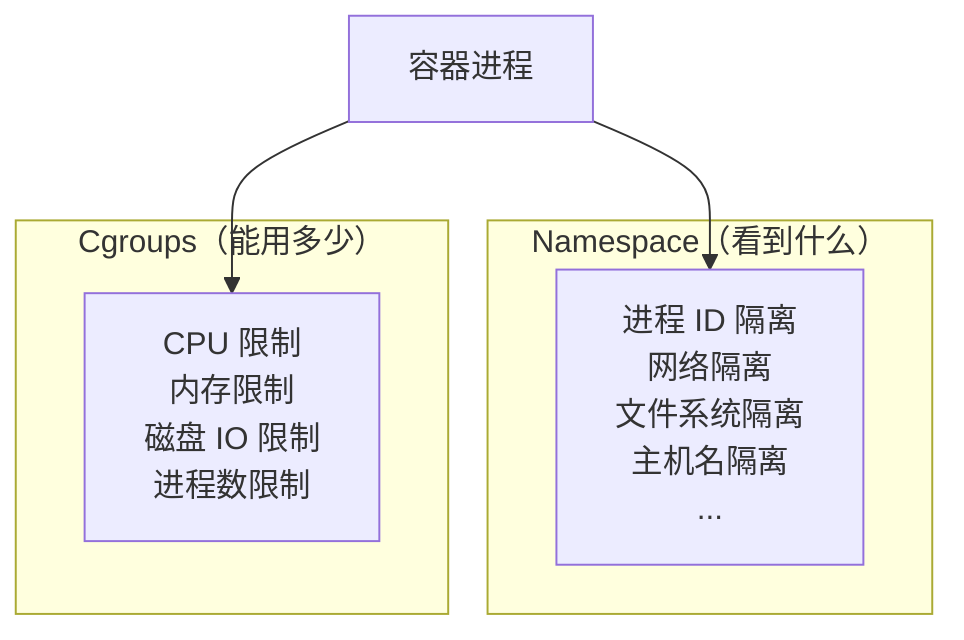
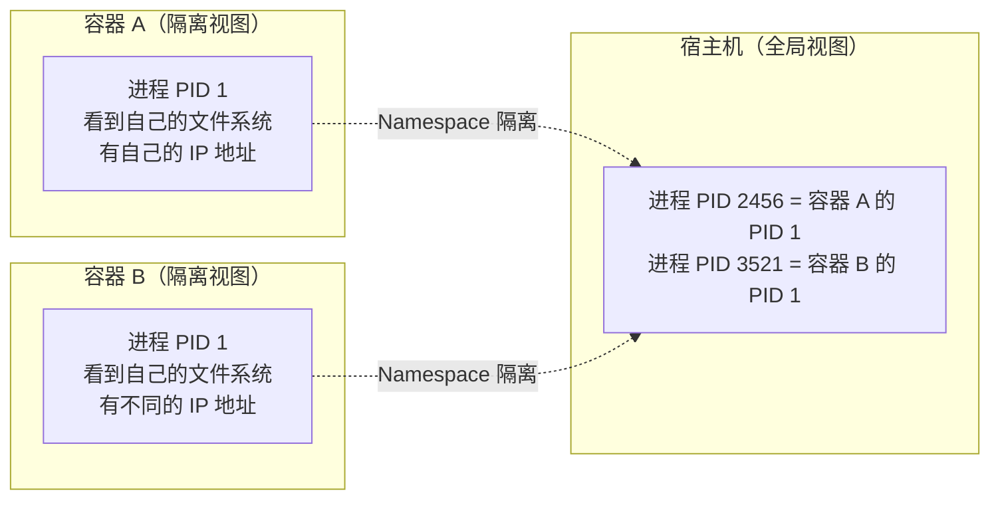
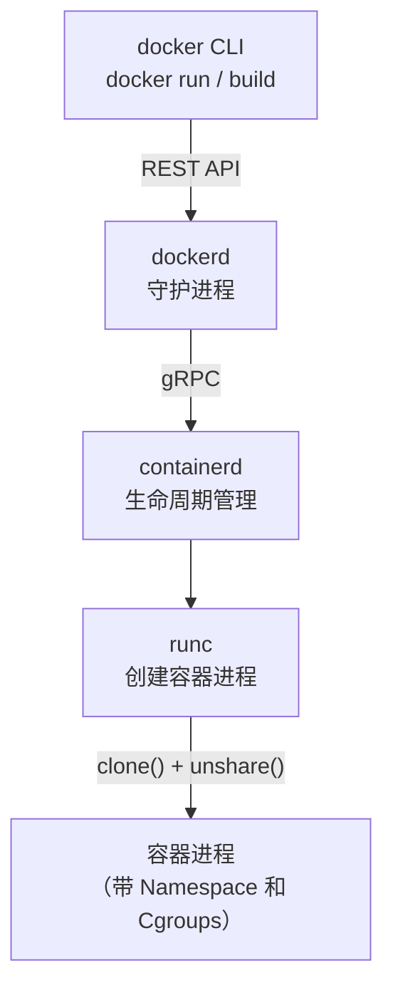

## 🔗 上章回顾

> 在 [[04-镜像分层原理：为什么构建这么快|上一章]] 中，你理解了：
> - 镜像分层（UnionFS/OverlayFS）让构建变快
> - 构建缓存的工作原理
> - 写时复制（Copy-on-Write）让容器共享镜像
>
> 现在你已经用了 4 章 Docker，亲手跑过容器、构建过镜像。**是时候揭开底层原理了——容器到底是怎么隔离开的？** 旧版教程第一章就讲这些，你当时肯定看不懂。现在你有了实践经验，再来看原理，会有"原来如此"的顿悟。

---

## 📖 核心内容

### 1. 隔离的两大支柱——一张图看懂



> [!important] 两大支柱的分工
> - **Namespace**：隔离**看到什么**——容器看到自己的进程 ID、网络、文件系统
> - **Cgroups**：限制**能用多少**——容器最多用多少 CPU、内存、IO

### 2. 容器的本质——隔离的进程，不是轻量虚拟机



> [!important] 从"魔法"到"机制"
> 你之前用 `docker run` 启动容器，感觉像魔法一样——容器有自己的文件系统、自己的 IP、自己的进程。现在你知道，这背后是 Linux 内核的 **Namespace** 和 **Cgroups**。

### 3. 六大 Namespace

| Namespace | 隔离内容 | 容器中的效果 |
|-----------|---------|------------|
| **PID** | 进程 ID 空间 | 容器内 PID 1 是自己的启动进程，看不到宿主进程 |
| **NET** | 网络栈 | 容器有自己的网卡、IP、端口空间 |
| **MNT** | 挂载点 | 容器只看到自己的文件系统（rootfs） |
| **UTS** | 主机名和域名 | 容器可以有自己的 hostname |
| **IPC** | 进程间通信 | 容器内的共享内存、信号量独立 |
| **USER** | 用户和组 ID | 容器内 root 不一定等于宿主 root（依赖 user ns） |

> [!tip] 不需要死记硬背
> 你只需要理解一个核心概念：**每个 Namespace 隔离一个维度，六个维度合起来，让容器觉得自己是独立机器。** 刚开始只需记住 PID、NET、MNT 三大核心。

### 4. Cgroups——资源限制

| Cgroup 子系统 | 限制内容 | Docker 参数 | 什么时候用 |
|---------------|---------|------------|------------|
| cpu | CPU 时间片 | `--cpus="1.5"` | 防止容器吃光 CPU |
| memory | 内存上限 | `--memory="256m"` | 防止容器 OOM |
| blkio | 磁盘 IO | `--device-read-bps` | 限制磁盘读写速度 |
| pids | 进程数 | `--pids-limit=100` | 防止 fork 炸弹 |

> [!warning] 没有 Cgroups 限制的后果
> 一个容器跑死循环可以吃光所有 CPU；内存泄漏可以把宿主 OOM Kill。**生产环境必须给每个容器设置资源限制。** 这会在 [[09-生产安全加固]] 中详细展开。

### 5. Docker 引擎架构（简版）



| 组件 | 职责 | 类比 |
|------|------|------|
| docker CLI | 用户交互入口 | 前台接待 |
| dockerd | 管理镜像、容器、网络 | 总管家 |
| containerd | 容器生命周期管理 | 工头 |
| runc | 创建和运行容器进程 | 工人 |

> [!tip] 你不需要深入了解每个组件
> 这个架构图让你知道 Docker 不是铁板一块，而是分层的。日常使用中，你只和 `docker CLI` 打交道。只有在排查底层问题或学习 K8S（K8S 直接用 containerd）时才需要了解 containerd 和 runc。

---

## 🎯 实践练习

### 练习 1：验证 PID Namespace 隔离

```bash
# 1. 在容器内查看进程
docker run --rm alpine ps aux
# PID   USER     TIME  COMMAND
#     1 root      0:00 ps aux
# 容器里只看到自己的进程，PID 1 是 ps 命令本身！

# 2. 启动一个容器运行 sleep
docker run -d --name pid-test alpine sleep 3600

# 3. 进入容器查看进程
docker exec -it pid-test ps aux
# PID   USER     TIME  COMMAND
#     1 root      0:00 sleep 3600    ← 只有 1 个进程
#     7 root      0:00 ps aux

# 4. 在宿主机上找到容器进程的真实 PID
docker top pid-test
# 或：docker inspect pid-test --format '{{.State.Pid}}'
# 输出的 PID 是宿主机视角的大数字，和容器内的 PID 1 完全不同

# 5. 清理
docker stop pid-test && docker rm pid-test
```

> 💡 **注释**：
> 容器内看到的 PID 1 和宿主机上看到的 PID 完全不同。这就是 PID Namespace 的作用——给容器一个独立的进程 ID 空间。容器内永远看不到宿主机的进程。

### 练习 2：验证 NET Namespace 隔离

```bash
# 1. 查看容器内的网络接口
docker run --rm alpine ip addr
# 看到 eth0 和 lo，IP 地址和宿主机不同

# 2. 两个容器可以绑定相同的端口
docker run -d --name net1 -p 8080:80 nginx:alpine
docker run -d --name net2 -p 8081:80 nginx:alpine
# 两个容器内部都监听 80 端口，互不冲突
# 因为各自有独立的 NET Namespace！

# 3. 清理
docker rm -f net1 net2
```

> 💡 **注释**：
> 这就是为什么你可以在同一台机器上跑 10 个 Nginx 而不会端口冲突——每个容器有自己的 IP 和端口空间。宿主机通过端口映射（`-p`）连接到不同的容器。

### 练习 3：验证 MNT Namespace 隔离

```bash
# 1. 查看容器内的文件系统
docker run --rm alpine ls /
# bin dev etc home lib media mnt opt proc root run sbin srv sys tmp usr var

# 2. 在容器内创建一个文件
docker run --rm alpine sh -c "echo 'I am in container' > /tmp/test.txt && cat /tmp/test.txt"
# I am in container

# 3. 再次启动同一镜像，文件不存在
docker run --rm alpine cat /tmp/test.txt
# cat: can't open '/tmp/test.txt': No such file or directory
# 因为每个容器有自己的文件系统（MNT Namespace）
```

> 💡 **注释**：
> 每个容器有自己的文件系统视图。你在容器 A 里创建的文件，容器 B 看不到。这就是为什么容器删除后数据会丢失——要持久化数据需要 Volume。

### 练习 4：用 Cgroups 限制 CPU

```bash
# 1. 启动一个会跑满 CPU 的容器（不限资源）
docker run -d --name cpu-eater --rm alpine sh -c "while :; do :; done"

# 2. 观察 CPU 使用
docker stats cpu-eater --no-stream
# 你会看到它占用了接近 100% 的一个 CPU 核心

# 3. 删掉它
docker stop cpu-eater

# 4. 重新启动，限制只能用 0.5 个 CPU
docker run -d --name limited-cpu --cpus="0.5" --rm alpine sh -c "while :; do :; done"

# 5. 观察 CPU 使用
docker stats limited-cpu --no-stream
# 现在只能使用 50% 的 CPU

# 6. 清理
docker stop limited-cpu
```

> 💡 **注释**：
> `--cpus="0.5"` 限制容器最多使用 0.5 个 CPU 核心。即使容器内的程序想跑满 CPU，Cgroups 也会把它限制在 50%。这在多租户环境中非常重要。

### 练习 5：模拟 OOM（内存耗尽）

```bash
# ⚠️ 这个练习会触发 OOM Kill，注意清理

# 1. 启动一个内存限制为 50MB 的容器
docker run -d --memory=50m --name oom-test alpine sh -c "while true; do dd if=/dev/zero of=/tmp/fill bs=1M count=100; sleep 1; done"

# 2. 等待几秒，查看容器状态
docker ps -a | grep oom-test
# STATUS 显示 "Exited (137)" —— 137 = 128 + 9 = SIGKILL（OOM Killer 杀的）

# 3. 查看事件日志
docker inspect oom-test | grep -i oom
# "OOMKilled": true  ← 确认是被 OOM Killer 杀死的

# 4. 清理
docker rm oom-test
```

> 💡 **注释**：
> `Exited (137)` 是 OOM Kill 的标志。137 = 128 + 9（SIGKILL 信号）。容器试图用超过 50MB 的内存，被 Cgroups 限制后内核 OOM Killer 强制杀死了进程。这就是为什么生产环境必须设置 `--memory`。

---

## 💡 要点注释

1. **容器不是轻量级虚拟机**
   - 虚拟机：虚拟硬件，有独立内核
   - 容器：隔离的进程，共享宿主机内核
   - 容器隔离性比虚拟机弱，但启动更快、开销更小

2. **PID 1 的重要性**
   - 容器内 PID 1 是容器的主进程
   - PID 1 退出，容器就退出
   - 所以 CMD 必须是长期运行的前台进程

3. **USER Namespace 默认未启用**
   - 默认情况下，容器内 root（UID 0）就是宿主机 root
   - 这是容器安全的最大隐患之一
   - 生产环境需用非 root 用户（[[09-生产安全加固]] 会讲）

4. **Cgroups 限制的是"上限"不是"预留"**
   - `--memory=256m` 意思是"最多用 256MB"，不是"预留 256MB"
   - 多个容器可以超卖（总和大于宿主内存），但触发 OOM 时内核会杀进程

---

## 🔄 可选迭代

1. **在 Linux 宿主机上找到容器的 Namespace**：
   ```bash
   PID=$(docker inspect -f '{{.State.Pid}}' my-nginx)
   ls -l /proc/$PID/ns/
   ```

2. **使用 `docker run --user` 切换用户**：
   ```bash
   docker run --rm -u 1000:1000 alpine id
   # 输出 uid=1000 gid=1000
   ```

3. **尝试 `--cap-drop ALL`**：删除容器所有 capabilities，最小权限运行

4. **阅读 `docker inspect` 的完整输出**：里面有容器的完整配置，包括 Namespace、Cgroups、网络、存储等所有信息

---

## ⚠️ 常见易错点

> [!warning] **坑 1：以为容器是"轻量虚拟机"**
> 容器是隔离的进程，不是虚拟机。它共享宿主内核，没有独立的 OS。理解这一点是区分容器和 VM 的关键。

> [!warning] **坑 2：容器内用 root 运行**
> 默认容器内 UID 0 等于宿主机 UID 0。容器逃逸 = 宿主机沦陷。生产环境必须用非 root 用户。

> [!warning] **坑 3：不设资源限制导致"吵闹邻居"**
> 一个容器失控吃光 CPU/内存，拖垮整台宿主机。**生产环境必须设置 `--memory` 和 `--cpus`。**

> [!warning] **坑 4：混淆 --memory 和 --memory-swap**
> `-m 256m` 只限制物理内存，不限制 swap。容器可能大量使用 swap，导致性能极差。
> **解决方案**：设置 `--memory-swap="256m"` 等于 `--memory` 的值，禁止 swap。

> [!warning] **坑 5：Windows/Mac 上的 Namespace 验证**
> Docker Desktop 运行在 Linux 虚拟机中，你不能直接在 Windows/Mac 宿主机上 `ls /proc/<pid>/ns/`。需要在容器内验证，或进入 Docker Desktop 的 VM。

---

## 🎯 本文学完自检

| 层次 | 检查项 |
|------|--------|
| 🟢 基础 | 能说出 Namespace 和 Cgroups 各自解决什么问题；能用 `docker stats` 查看容器资源使用 |
| 🟡 进阶 | 能通过 `docker exec` 验证 PID、NET、MNT 三种 Namespace 的隔离效果；能用 `--memory` 和 `--cpus` 限制容器资源 |
| 🔴 挑战 | 能在 Linux 宿主机上找到某个运行中容器的 PID Namespace 和 Cgroup 路径，并验证其资源限制；能解释每个隔离维度的作用 |

---

## 🔗 相关笔记

- ⬅️ 前置：[[04-镜像分层原理：为什么构建这么快]] — 镜像层面的原理
- ➡️ 后续：[[06-容器网络与存储]] — 隔离之后，容器之间如何通信
- 🔗 关联：[[09-生产安全加固]] — 安全加固实战
- 🔗 关联：[[00-Docker 总览索引]] — 回到课程总览

---

*最后更新：2026-07-28*