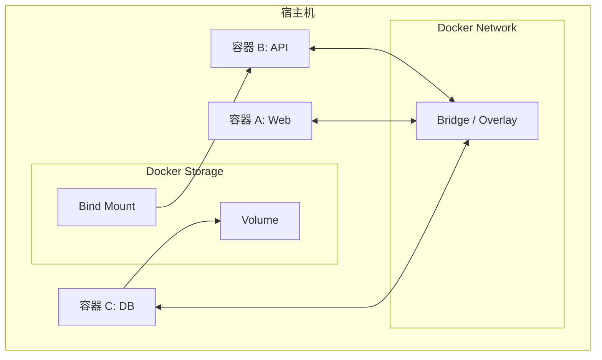

## 🔗 上章回顾

> 在 [[05-容器隔离原理：Namespace 与 Cgroups|上一章]] 中，你理解了：
> - 容器是隔离的进程（Namespace + Cgroups）
> - 容器之间互相看不到对方的进程、网络、文件系统
>
> 但隔离只是一个方面。真实应用需要容器之间通信，也需要数据持久化——容器删除后数据还得在。**本章解决两个核心问题：容器怎么通信？数据怎么不丢？**

---

## 📖 核心内容

### 1. 为什么需要网络和存储



> [!important] 容器的两大核心问题
> 1. **通信问题**：Web、API、DB 三个容器需要互相访问
> 2. **数据问题**：容器删除后，数据库数据不能丢失

### 2. Docker 网络模式

| 模式 | 说明 | 典型场景 |
|------|------|---------|
| **bridge** | 默认，容器通过 docker0 网桥通信 | 单机多容器 |
| **host** | 容器共享宿主机网络栈 | 性能敏感 |
| **none** | 容器无网络接口 | 安全隔离 |
| **container** | 与另一个容器共享网络 | sidecar 模式 |
| **overlay** | 跨主机网络（Swarm/K8s） | 多机集群 |

> [!tip] 先学会 bridge 就够了
> 日常开发 95% 只用 bridge 网络。host 和 overlay 在特定场景才需要，Swarm 集群章节会深入 overlay。

### 3. 默认 Bridge vs 自定义 Bridge

```bash
# 查看 Docker 网络
docker network ls
# NAME      DRIVER    SCOPE
# bridge    bridge    local   ← 默认网络
# host      host      local
# none      null      local

# 创建自定义 bridge 网络
docker network create my-net

# 启动容器加入自定义网络
docker run -d --name web --network my-net nginx:alpine
docker run -d --name api --network my-net nginx:alpine

# 同一网络内容器可通过容器名互访
docker exec api ping web  # ✅ 自定义 bridge 支持 DNS！
```

> [!important] 为什么推荐自定义 bridge？
> 1. **DNS 解析**：自定义 bridge 中容器可以通过**容器名**互相访问，默认 bridge 不支持
> 2. **更好的隔离**：不同网络的容器默认不能通信
> 3. **灵活配置**：可以指定子网、网关、IP 范围

### 4. 端口映射——从外界访问容器


```bash
# -p 宿主机端口:容器端口
docker run -d -p 8080:80 nginx:alpine           # 所有接口可访问
docker run -d -p 127.0.0.1:8080:80 nginx:alpine   # 仅本机可访问
docker run -d -p 80 nginx:alpine                  # 随机分配宿主机端口

# 查看端口映射
docker port my-nginx
```

### 5. 三种存储方式

| 方式 | 管理 | 持久化 | 适用场景 |
|------|------|--------|---------|
| **Volume** | Docker 管理 | ✅ | **数据库存储、生产环境** |
| **Bind Mount** | 用户管理 | ✅ | 开发环境代码挂载 |
| **tmpfs** | 内存中 | ❌ | 敏感临时数据、缓存 |

> [!important] 记住这个口诀
> **开发用 Bind Mount，生产用 Volume。**

### 6. Volume——生产环境首选

```bash
# 创建 Volume
docker volume create db-data

# 查看
docker volume ls
docker volume inspect db-data
# Mountpoint: /var/lib/docker/volumes/db-data/_data

# 启动容器时挂载
# 注意：mysql:8 必须设置 root 密码，否则容器拒绝启动
docker run -d -v db-data:/var/lib/mysql -e MYSQL_ROOT_PASSWORD=example --name mysql mysql:8

# 删除 Volume
docker volume rm db-data

# 清理未使用的 Volume
docker volume prune
```

### 7. Bind Mount——开发环境首选

```bash
# 把宿主机目录挂载到容器内（代码实时同步）
docker run -d -v $(pwd)/src:/app/src:ro --name web nginx:alpine
# :ro 只读，防止容器修改宿主机代码
# :rw 读写（默认）

# 推荐用 --mount 语法（更明确）
docker run -d --mount type=bind,source=$(pwd)/src,target=/app/src nginx:alpine
```

### 8. 数据备份和恢复

```bash
# 1. 备份 Volume 数据
docker run --rm \
  -v db-data:/data:ro \
  -v $(pwd)/backup:/backup \
  alpine tar cvf /backup/backup.tar -C /data .

# 2. 从备份恢复
docker run --rm \
  -v db-data:/data \
  -v $(pwd)/backup:/backup:ro \
  alpine sh -c "cd /data && tar xvf /backup/backup.tar"
```

---

## 🎯 实践练习

### 练习 1：创建自定义网络，体验容器名互访

```bash
# 1. 创建自定义网络
docker network create app-net

# 2. 启动两个容器加入同一网络
docker run -d --name web --network app-net nginx:alpine
docker run -d --name api --network app-net alpine sleep 3600

# 3. 从 api 容器 ping web 容器（用容器名！）
docker exec api ping -c 3 web
# PING web (172.18.0.2): 56 data bytes
# 64 bytes from 172.18.0.2: seq=0 ttl=64 time=0.5 ms
# ✅ 容器名 DNS 解析生效！

# 4. 对比：用默认 bridge 网络
docker run -d --name default-web nginx:alpine
docker run --rm alpine ping -c 2 default-web
# ping: bad address 'default-web'  ← 默认 bridge 不支持 DNS！

# 5. 清理
docker rm -f web api default-web
docker network rm app-net
```

> 💡 **注释**：
> 自定义 bridge 网络内置了 DNS 服务器，自动把容器名解析为 IP。这就是为什么多容器应用（如 Web + DB）可以用容器名互访，而不需要硬编码 IP。默认 bridge 没有这个功能。

### 练习 2：Volume 持久化实战

```bash
# 1. 创建 Volume
docker volume create my-data

# 2. 第一个容器写入数据
docker run --rm -v my-data:/data alpine sh -c "echo 'persistent data' > /data/file.txt"

# 3. 容器已删除，但数据还在！
docker run --rm -v my-data:/data alpine cat /data/file.txt
# persistent data
# ✅ 数据持久化成功！

# 4. 验证：不挂载 Volume 的容器看不到数据
docker run --rm alpine ls /data 2>/dev/null || echo "No /data directory"
# No /data directory

# 5. 清理
docker volume rm my-data
```

> 💡 **注释**：
> Volume 的生命周期独立于容器。容器删除后，Volume 中的数据完好无损。这就是数据库容器化能做到数据不丢失的关键。

### 练习 3：Bind Mount 代码热更新

```bash
# 1. 创建本地目录
mkdir ~/nginx-test
echo "<h1>Hello from Bind Mount!</h1>" > ~/nginx-test/index.html

# 2. 挂载到 Nginx 的网站目录
docker run -d -p 8080:80 -v ~/nginx-test:/usr/share/nginx/html:ro --name bind-test nginx:alpine

# 3. 浏览器访问 http://localhost:8080
# 看到 "Hello from Bind Mount!"

# 4. 修改本地文件
echo "<h1>Updated!</h1>" > ~/nginx-test/index.html

# 5. 刷新浏览器——立刻看到更新！
# 不需要重启容器，不需要重建镜像

# 6. 清理
docker rm -f bind-test
rm -rf ~/nginx-test
```

> 💡 **注释**：
> Bind Mount 把宿主机目录直接映射到容器内。修改本地文件，容器内立刻生效。这就是开发环境热更新的基础——你改代码，容器内立刻看到变化。

### 练习 4：网络隔离验证

```bash
# 1. 创建两个隔离的网络
docker network create front-net
docker network create back-net

# 2. Web 服务加入 front-net
docker run -d --name web --network front-net nginx:alpine

# 3. DB 服务加入 back-net
docker run -d --name db --network back-net alpine sleep 3600

# 4. Web 无法 ping DB（不同网络隔离）
docker exec web ping -c 2 db
# ping: bad address 'db' → 网络隔离成功！

# 5. 清理
docker rm -f web db
docker network rm front-net back-net
```

> 💡 **注释**：
> 不同网络的容器默认无法通信。这是网络隔离的基础——你可以把 Web 放在前端网络，DB 放在后端网络，只让需要通信的服务在同一个网络。

### 练习 5：Volume 数据备份与恢复

```bash
# 1. 创建 volume 并写入数据
docker volume create db-backup
docker run --rm -v db-backup:/data alpine sh -c "echo 'important data' > /data/db.sql"

# 2. 备份到宿主机当前目录
docker run --rm \
  -v db-backup:/data:ro \
  -v $(pwd):/backup \
  alpine tar cvf /backup/db-backup.tar -C /data .

# 3. 删除原 Volume
docker volume rm db-backup

# 4. 创建新 Volume 并恢复
docker volume create db-restored
docker run --rm \
  -v db-restored:/data \
  -v $(pwd):/backup:ro \
  alpine tar xvf /backup/db-backup.tar -C /data

# 5. 验证恢复
docker run --rm -v db-restored:/data alpine cat /data/db.sql
# important data

# 6. 清理
docker volume rm db-restored
rm db-backup.tar
```

> 💡 **注释**：
> 这个练习展示了 Volume 数据迁移的标准做法：用 `tar` 打包，通过 Bind Mount 把数据倒到宿主机，再恢复到新 Volume。生产环境中数据库备份迁移经常用这种方式。

---

## 💡 要点注释

1. **端口映射不是网络的全部**
   - `-p 8080:80` 让外部访问容器
   - 但容器之间的通信（Web→API→DB）靠的是 Docker 网络
   - 多容器应用优先使用自定义网络，而不是端口映射

2. **Volume 的备份很重要**
   - Volume 不是备份！定期用 `docker run --rm -v vol:/data alpine tar cvf` 做离线备份
   - 备份文件存到安全位置（如 S3、NAS）

3. **Bind Mount 的权限问题**
   - 容器内进程 UID 可能和宿主机文件属主不一致，导致写入失败
   - 解决方案：`docker run -u $(id -u):$(id -g)` 或 `chown` 调整权限

4. **Volume 的生命周期**
   - Volume 独立于容器
   - `docker rm` 不会删除 Volume
   - `docker volume prune` 可以清理未使用的 Volume（注意：会丢失数据！）

---

## 🔄 可选迭代

1. **尝试 host 网络模式**：`docker run --network host nginx:alpine`，注意 Docker Desktop for Windows/Mac 的 host 模式是在 VM 内
2. **尝试 tmpfs**：`docker run --tmpfs /tmp:size=64m nginx`，把 `/tmp` 放在内存中
3. **尝试端口映射到 localhost**：`docker run -p 127.0.0.1:8080:80 nginx`，只允许本机访问
4. **探索网络详情**：`docker network inspect my-net` 查看子网、网关、连接容器等信息
5. **探索 Overlay 网络**：预习 Swarm 集群的跨主机网络（需要多台机器）

---

## ⚠️ 常见易错点

> [!warning] **坑 1：默认 bridge 不能用容器名互访**
> ```bash
> docker run --name web -d nginx
> docker run --rm alpine ping web  # ❌ 失败
> ```
> **解决方案**：创建自定义 bridge 网络。

> [!warning] **坑 2：Volume 数据残留占满磁盘**
> 删除容器时不删 Volume，磁盘悄悄被占满。定期 `docker volume prune` 清理。

> [!warning] **坑 3：Bind Mount 路径不存在时自动创建**
> Docker 会以 root 身份创建目录，可能导致权限问题。

> [!warning] **坑 4：端口映射到 0.0.0.0 导致外网可访问**
> 生产环境内部服务用 `-p 127.0.0.1:8080:80` 只绑定本地。

> [!warning] **坑 5：容器删除后数据丢失**
> 把数据存在容器可写层里，容器删除就丢了。
> **解决方案**：需要持久化的数据用 Volume 或 Bind Mount。

---

## 🎯 本文学完自检

| 层次 | 检查项 |
|------|--------|
| 🟢 基础 | 能创建自定义 bridge 网络，用容器名互访；能创建 Volume 并挂载实现数据持久化 |
| 🟡 进阶 | 能解释 bridge/host 网络区别；能区分 Volume 和 Bind Mount 的使用场景；能配置端口映射 |
| 🔴 挑战 | 能设计一个 Web + DB 的容器化方案：Web 和 DB 通过自定义网络通信，DB 数据用 Volume 持久化，Web 代码用 Bind Mount 热更新，并画出数据流图 |

---

## 🔗 相关笔记

- ⬅️ 前置：[[05-容器隔离原理：Namespace 与 Cgroups]] — 上一章
- ➡️ 后续：[[07-Docker Compose 多容器编排]] — 多容器应用的统一管理
- 🔗 关联：[[09-生产安全加固]] — 网络隔离和安全加固
- 🔗 关联：[[00-Docker 总览索引]] — 回到课程总览

---

*最后更新：2026-07-28*