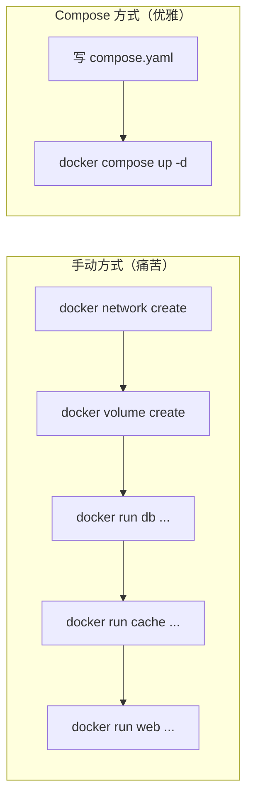

## 🔗 上章回顾

> 在 [[06-容器网络与存储|上一章]] 中，你学会了：
> - 创建自定义 bridge 网络让容器通过容器名互访
> - 用 Volume 持久化数据、用 Bind Mount 实现代码热更新
>
> 但手动启动多个容器需要敲一堆 `docker run` 命令——网络、Volume、端口、依赖顺序……全靠记参数。**本章用 Docker Compose 把这些命令变成一份声明式 YAML 文件，一条命令启动整个应用。**

---

## 📖 核心内容

### 1. 从手动到声明式——为什么需要 Compose



```bash
# 手动启动一个三服务应用的命令有多长：
docker network create app-net
docker run -d --name db --network app-net -v db-data:/var/lib/postgresql/data \
  -e POSTGRES_PASSWORD=secret postgres:15-alpine
docker run -d --name cache --network app-net redis:7-alpine
docker run -d --name web --network app-net -p 5000:5000 \
  -e DB_URL=postgres://user:pass@db:5432/mydb myapp:v1

# 换成 Compose：一个 YAML 文件 + 一条命令
docker compose up -d
```

> [!important] Compose 的定位
> - **单机多容器编排**：开发环境、CI、小型生产
> - **声明式配置**：compose.yaml 就是应用的"基础设施即代码"
> - **V2 版本**：使用 `docker compose`（无连字符），内置在 Docker Desktop

### 2. compose.yaml 核心结构

```yaml
# compose.yaml
services:                  # 定义所有服务
  web:                     # 服务名（也是容器 DNS 名）
    build: .               # 从当前目录的 Dockerfile 构建
    ports:
      - "5000:5000"
    environment:
      - DB_URL=postgres://user:pass@db:5432/mydb
    depends_on:
      db:
        condition: service_healthy   # 等数据库就绪再启动
    networks:
      - backend
    restart: unless-stopped

  db:
    image: postgres:15-alpine
    environment:
      POSTGRES_USER: user
      POSTGRES_PASSWORD: pass
      POSTGRES_DB: mydb
    volumes:
      - db-data:/var/lib/postgresql/data
    networks:
      - backend
    healthcheck:
      test: ["CMD-SHELL", "pg_isready -U user -d mydb"]
      interval: 10s
      timeout: 5s
      retries: 5

  cache:
    image: redis:7-alpine
    networks:
      - backend
    healthcheck:
      test: ["CMD", "redis-cli", "ping"]
      interval: 5s
      timeout: 3s
      retries: 3

volumes:                   # 声明命名卷
  db-data:

networks:                  # 声明网络
  backend:
    driver: bridge
```

### 3. 常用命令

```bash
# 启动全部服务（后台）
docker compose up -d

# 构建镜像后启动
docker compose up -d --build

# 只启动某个服务
docker compose up -d web

# 查看日志
docker compose logs -f          # 所有服务
docker compose logs -f web       # 只看 web
docker compose logs --tail 50 web

# 停止服务（保留容器和卷）
docker compose stop

# 删除容器（保留卷）
docker compose down

# 删除容器 + 卷 + 网络（⚠️ 数据丢失）
docker compose down -v

# 重启某个服务
docker compose restart web

# 进入容器
docker compose exec web sh

# 拉取最新镜像
docker compose pull

# 查看解析后的最终配置（调试利器）
docker compose config
```

### 4. 服务依赖和健康检查

`depends_on` 默认只等容器启动，不保证服务可用。要真正等待服务就绪，必须配 `condition`：

```yaml
services:
  web:
    build: .
    depends_on:
      db:
        condition: service_healthy    # 等待 DB 健康检查通过
      cache:
        condition: service_healthy

  db:
    image: postgres:15-alpine
    healthcheck:
      test: ["CMD-SHELL", "pg_isready -U postgres"]
      interval: 10s
      timeout: 5s
      retries: 5

  cache:
    image: redis:7-alpine
    healthcheck:
      test: ["CMD", "redis-cli", "ping"]
      interval: 5s
      timeout: 3s
      retries: 3
```

| condition 值 | 含义 |
|-------------|------|
| `service_started` | 默认，容器启动即可 |
| `service_healthy` | 等待 healthcheck 通过 |
| `service_completed` | 等待容器正常退出（适合初始化任务） |

> [!important] 服务依赖的真相
> `depends_on` 只保证容器启动顺序，**不保证服务可用**。真实环境中必须配 `healthcheck` + `service_healthy`，否则 Web 可能在 DB 还没准备好接受连接时就启动了，导致连接失败。

### 5. 环境变量管理

```yaml
# 方式 1：compose.yaml 内直接写
services:
  web:
    environment:
      - DEBUG=1
      - DB_URL=postgres://user:pass@db:5432/mydb

# 方式 2：env_file 引用外部文件
services:
  web:
    env_file:
      - .env
      - .env.prod

# 方式 3：.env 文件插值
# .env 文件
DEBUG=1
APP_VERSION=1.2.3

# compose.yaml 中用 ${VAR}
services:
  web:
    image: myapp:${APP_VERSION:-latest}
    environment:
      - DEBUG=${DEBUG}
```

> [!important] `.env` vs `env_file` 的区别
> - `.env`：在 compose.yaml 中做**变量插值**（构建时替换 `${VAR}`）
> - `env_file`：把文件内容作为**容器环境变量**注入（运行时）

### 6. 多环境配置

```
project/
├── compose.yaml          # 基础配置
├── compose.dev.yaml      # 开发覆盖
├── compose.prod.yaml     # 生产覆盖
└── .env
```

```yaml
# compose.yaml（基础）
services:
  web:
    image: myapp:${APP_VERSION}
    ports:
      - "5000:5000"
```

```yaml
# compose.dev.yaml（开发覆盖）
services:
  web:
    build: .                      # 开发用 build 而非 image
    volumes:
      - ./src:/app/src            # 热更新
    environment:
      - DEBUG=1
    command: npm run dev
```

```yaml
# compose.prod.yaml（生产覆盖）
services:
  web:
    restart: always
    environment:
      - DEBUG=0
    deploy:
      replicas: 3
```

```bash
# 开发环境
docker compose -f compose.yaml -f compose.dev.yaml up -d

# 生产环境
docker compose -f compose.yaml -f compose.prod.yaml up -d
```

### 7. Compose Watch — 开发热更新

Compose V2.22+ 支持 Watch 模式，文件变化时自动同步到容器：

```yaml
services:
  web:
    build: .
    develop:
      watch:
        - action: sync
          path: ./src
          target: /app/src
        - action: rebuild
          path: ./requirements.txt
        - action: sync+restart
          path: ./config
          target: /app/config
```

```bash
docker compose watch
# 文件变化自动同步到容器，无需重建镜像
```

| action | 效果 |
|--------|------|
| `sync` | 只同步文件，不重启 |
| `rebuild` | 重建镜像并重启 |
| `sync+restart` | 同步文件并重启服务 |

---

## 🎯 实践练习

### 练习 1：编写你的第一个 compose.yaml

```bash
# 1. 创建项目目录
mkdir compose-demo && cd compose-demo

# 2. 创建 compose.yaml
cat > compose.yaml << 'EOF'
services:
  web:
    image: nginx:alpine
    ports:
      - "8080:80"
    volumes:
      - ./html:/usr/share/nginx/html:ro
    depends_on:
      db:
        condition: service_healthy
    networks:
      - frontend
      - backend

  db:
    image: postgres:15-alpine
    environment:
      POSTGRES_USER: app
      POSTGRES_PASSWORD: devpass
      POSTGRES_DB: appdb
    volumes:
      - db-data:/var/lib/postgresql/data
    networks:
      - backend
    healthcheck:
      test: ["CMD-SHELL", "pg_isready -U app -d appdb"]
      interval: 5s
      timeout: 3s
      retries: 5

  cache:
    image: redis:7-alpine
    networks:
      - backend
    healthcheck:
      test: ["CMD", "redis-cli", "ping"]
      interval: 5s
      timeout: 3s
      retries: 3

volumes:
  db-data:

networks:
  frontend:
    driver: bridge
  backend:
    driver: bridge
EOF

# 3. 创建 html 目录和首页
mkdir html
echo "<h1>Compose App Running!</h1>" > html/index.html

# 4. 一键启动
docker compose up -d

# 5. 查看服务状态
docker compose ps
# NAME   IMAGE              STATUS              PORTS
# web    nginx:alpine       Up                  0.0.0.0:8080->80/tcp
# db     postgres:15-alpine Up (healthy)        5432/tcp
# cache  redis:7-alpine     Up (healthy)        6379/tcp
# 注：web 没定义 healthcheck，状态是 Up（不会显示 healthy）

# 6. 浏览器访问 http://localhost:8080

# 7. 清理
docker compose down
```

> 💡 **注释**：
> 一条 `docker compose up -d` 就自动创建了网络、Volume，启动了三个服务，配置了健康检查和依赖关系。对比上一章手动敲 `docker run`，这就是编排的威力。Compose 自动用目录名作为项目前缀，容器名格式为 `compose-demo-web-1`。

**验证标准**：`docker compose ps` 显示 web 为 `Up`（未定义 healthcheck），db/cache 为 `Up (healthy)`，浏览器能访问 `http://localhost:8080`。

### 练习 2：体验健康检查和依赖顺序

```bash
# 1. 启动上面的 Compose 应用
docker compose up -d

# 2. 观察启动日志——web 等待 db 和 cache 就绪
docker compose logs -f
# 你会看到 db 和 cache 先启动，web 等待它们的 healthcheck 通过后才启动

# 3. 模拟 DB 故障
docker compose stop db

# 4. 查看服务状态
docker compose ps
# web 没定义 healthcheck，状态仍是 Up；db 显示 Exited

# 5. 恢复 DB
docker compose start db

# 6. 等 healthcheck 恢复
docker compose ps
# db/cache 恢复 Up (healthy)，web 保持 Up

# 7. 清理
docker compose down
```

> 💡 **注释**：
> `depends_on` + `healthcheck` 保证了启动顺序。如果 DB 没有就绪，web 会等待，不会盲目启动失败。这是多容器应用可靠启动的关键——避免了"DB 还没好，Web 就启动然后报连接失败"的竞态条件。

### 练习 3：环境变量管理

```bash
# 1. 创建 .env 文件
cat > .env << 'EOF'
APP_PORT=8080
DB_USER=devuser
DB_PASS=devpass
DB_NAME=devdb
EOF

# 2. 在 compose.yaml 中使用变量
cat > compose.yaml << 'EOF'
services:
  web:
    image: nginx:alpine
    ports:
      - "${APP_PORT}:80"
    depends_on: [db]

  db:
    image: postgres:15-alpine
    environment:
      POSTGRES_USER: ${DB_USER}
      POSTGRES_PASSWORD: ${DB_PASS}
      POSTGRES_DB: ${DB_NAME}
    volumes:
      - db-data:/var/lib/postgresql/data

volumes:
  db-data:
EOF

# 3. 验证变量插值
docker compose config
# 你会看到 ${APP_PORT} 被替换成了 8080

# 4. 启动
docker compose up -d

# 5. 换端口测试
APP_PORT=9090 docker compose up -d
# web 现在监听 9090

# 6. 清理
docker compose down -v
rm .env compose.yaml
```

> 💡 **注释**：
> `.env` 文件让你不用修改 compose.yaml 就能切换配置。开发环境用一套变量，生产环境用另一套。注意：`.env` 不要提交到 Git，里面可能有密码。

### 练习 4：多环境配置

```bash
# 1. 基础配置
cat > compose.yaml << 'EOF'
services:
  web:
    image: myapp:${APP_VERSION:-latest}
    ports:
      - "5000:5000"
EOF

# 2. 开发覆盖
cat > compose.dev.yaml << 'EOF'
services:
  web:
    build: .
    volumes:
      - ./src:/app/src
    environment:
      - DEBUG=1
    command: npm run dev
EOF

# 3. 生产覆盖
cat > compose.prod.yaml << 'EOF'
services:
  web:
    restart: always
    environment:
      - DEBUG=0
    deploy:
      replicas: 3
EOF

# 4. 开发环境启动
docker compose -f compose.yaml -f compose.dev.yaml up -d

# 5. 查看合并后的配置
docker compose -f compose.yaml -f compose.prod.yaml config

# 6. 清理
docker compose -f compose.yaml -f compose.dev.yaml down
rm compose.yaml compose.dev.yaml compose.prod.yaml
```

> 💡 **注释**：
> 基础文件定义通用配置，覆盖文件只修改差异部分。Compose 会智能合并：后面的文件覆盖前面的。这就是"基础设施即代码"的精髓——同一套代码，不同环境。

---

## 💡 要点注释

1. **`depends_on` 不等于"服务就绪"**
   - 默认只等容器启动，不等服务可用
   - 必须配 `condition: service_healthy` + healthcheck 才能真正等待

2. **`docker compose down` 默认保留 Volume**
   - `down` 删除容器和网络，但保留 Volume
   - 加 `-v` 才删除 Volume（⚠️ 数据丢失）

3. **Compose 网络自动创建**
   - Compose 会自动创建一个默认网络，所有服务默认加入
   - 同一 Compose 项目内的容器可以用服务名互访（DNS）

4. **项目名很重要**
   - Compose 默认用目录名作为项目名
   - 同一个目录改名字，会创建新的容器和网络
   - 可用 `-p project-name` 显式指定

5. **生产环境慎用 Compose**
   - Compose 适合开发、测试、CI
   - 生产环境需要 Swarm 或 K8S 提供自愈、扩缩容能力

---

## 🔄 可选迭代

1. **添加 Nginx 反向代理**：在 compose.yaml 中加 Nginx 服务，转发到 web
2. **尝试 Compose Watch**：加 `develop.watch` 配置实现代码热更新
3. **尝试 `docker compose profiles`**：用 profiles 管理可选服务（如仅开发时启动的调试工具）
4. **尝试 `docker compose exec web sh`**：进入 Compose 管理的容器
5. **尝试 Swarm Stack**：`docker stack deploy -c compose.yaml myapp`——同一文件可以用于 Swarm 部署

---

## ⚠️ 常见易错点

> [!warning] **坑 1：`depends_on` 不等待服务就绪**
> 默认 `depends_on: - db` 只等容器启动，不等数据库可用。
> **解决方案**：配 `condition: service_healthy` + healthcheck。

> [!warning] **坑 2：环境变量未生效**
> 变量名拼写错误，或 `.env` 文件位置不对。
> **解决方案**：用 `docker compose config` 查看最终解析后的配置。

> [!warning] **坑 3：`docker compose down` 不删卷**
> 默认保留卷，磁盘被悄悄占满。需要删卷时加 `-v`（生产环境慎用）。

> [!warning] **坑 4：端口冲突**
> 多个 Compose 项目用同一宿主机端口。用 `${PORT:-5000}` 动态配置端口。

> [!warning] **坑 5：`build` 和 `image` 同时写**
> 两者同时存在时，Compose 会 build 后 tag 为 image 名，不是直接拉取。

---

## 🎯 本文学完自检

| 层次 | 检查项 |
|------|--------|
| 🟢 基础 | 能写出包含 Web + DB + Cache 的 compose.yaml 并一键启动 |
| 🟡 进阶 | 能配置 healthcheck + `service_healthy` 保证服务启动顺序；能用 .env 和多环境覆盖文件管理配置 |
| 🔴 挑战 | 能为团队设计开发/测试/生产的多环境 Compose 方案，并集成 Compose Watch 热更新和 Nginx 反向代理 |

---

## 🔗 相关笔记

- ⬅️ 前置：[[06-容器网络与存储]] — 网络和存储是 Compose 的基础
- ➡️ 后续：[[08-镜像优化：多阶段构建与瘦身]] — Compose 中各服务的镜像需要优化
- 🔗 关联：[[01-学习/DockerNew/10-业务场景实战合集]] — 大量场景基于 Compose
- 🔗 关联：[[00-Docker 总览索引]] — 回到课程总览

---

*最后更新：2026-07-28*