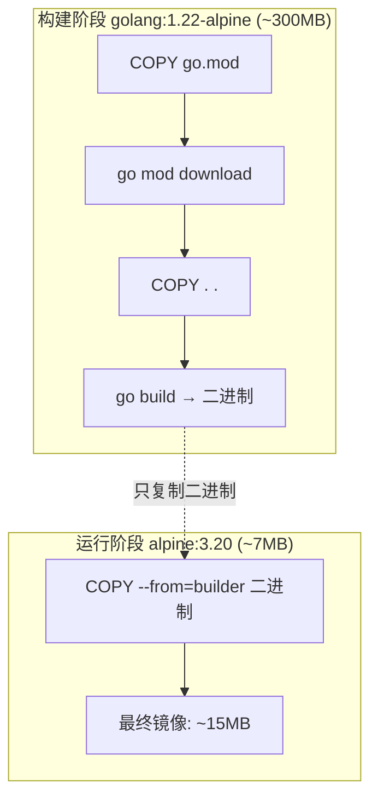

## 🔗 上章回顾

> 在 [[07-Docker Compose 多容器编排|上一章]] 中，你学会了用 Compose 编排多容器应用。但你的镜像可能还是 500MB 到 1GB——太大了。**本章的目标是把镜像从 1GB 压缩到 15MB，同时让它更安全。** 关键技术：**多阶段构建**——整个 Docker 学习路径中最重要的优化技术之一。

---

## 📖 核心内容

### 1. 问题：传统构建产物臃肿

```dockerfile
# ❌ 单阶段构建：编译器、源码、devDependencies 全留在镜像里
FROM golang:1.22
COPY . .
RUN go build -o server .
CMD ["./server"]
# 镜像大小：~1GB（包含了整个 Go 工具链和源码）
```

Go 编译器（~500MB）、源码、中间文件……全部打包进了最终镜像。但运行时只需要一个二进制文件！

### 2. 解决：多阶段构建

```dockerfile
# ===== 构建阶段 =====
FROM golang:1.22-alpine AS builder
WORKDIR /app
COPY go.mod go.sum ./
RUN go mod download
COPY . .
RUN CGO_ENABLED=0 GOOS=linux go build -ldflags="-s -w" -o /app/server .

# ===== 运行阶段：只复制二进制 =====
FROM alpine:3.20
RUN apk add --no-cache ca-certificates
COPY --from=builder /app/server /usr/local/bin/server
USER 65532:65532
ENTRYPOINT ["server"]
# 镜像大小：~15MB（从 1GB 瘦到 15MB！）
```



| 对比 | 单阶段 | 多阶段 |
|------|--------|--------|
| 镜像大小 | ~1GB | ~15MB |
| 包含编译器 | 是 | 否 |
| 包含源码 | 是 | 否 |
| 安全性 | 低 | 高 |

> [!important] 多阶段构建的核心思想
> **构建阶段可以很大（含编译器、源码），最终镜像只保留运行必需的二进制产物。** 通过 `COPY --from=builder` 只把最终产物复制过来。编译工具、源码、devDependencies 全部不进最终镜像。

### 3. 不同语言的多阶段构建

**Python 多阶段**：

```dockerfile
FROM python:3.12-slim AS builder
COPY requirements.txt .
RUN pip install --user --no-cache-dir -r requirements.txt

FROM python:3.12-slim
COPY --from=builder /root/.local /root/.local
COPY . .
ENV PATH=/root/.local/bin:$PATH
CMD ["python", "app.py"]
```

**前端多阶段**：

```dockerfile
FROM node:20-alpine AS builder
WORKDIR /app
COPY package*.json ./
RUN npm ci
COPY . .
RUN npm run build

FROM nginx:alpine
COPY --from=builder /app/dist /usr/share/nginx/html
COPY nginx.conf /etc/nginx/conf.d/default.conf
EXPOSE 80
# 镜像 ~20MB
```

### 4. 基础镜像选择

| 基础镜像 | 大小 | 安全 | 适用场景 |
|---------|------|------|---------|
| `scratch` | 0MB | 极高 | 静态编译的 Go/Rust 二进制 |
| `alpine:3.20` | ~7MB | 中 | 通用，极致瘦身 |
| `distroless` | ~20MB | 高 | 生产级安全（无 shell） |
| `debian:bookworm-slim` | ~74MB | 中 | 需要 glibc 的场景 |
| `python:3.12-alpine` | ~65MB | 中 | Python 轻量版 |
| `python:3.12-slim` | ~150MB | 中 | Python 精简版 |
| `python:3.12` | ~1GB | 低 | 开发调试 |

> [!tip] 选基础镜像的原则
> 1. 开发时用完整版（方便调试）
> 2. 生产时用 slim 或 alpine
> 3. 安全要求高用 distroless（无 shell，攻击面最小）
> 4. 静态编译语言用 scratch（零基础镜像）

### 5. 构建缓存的黄金法则（回顾）

```dockerfile
# ❌ 缓存不友好——每次代码变更都重装依赖
FROM python:3.12-slim
COPY . .
RUN pip install -r requirements.txt

# ✅ 缓存友好——依赖和代码分离
FROM python:3.12-slim
COPY requirements.txt .
RUN pip install --no-cache-dir -r requirements.txt
COPY . .  # 代码变更只影响这一层
```

### 6. BuildKit — 现代构建引擎

Docker 23+ 默认启用 BuildKit，核心特性：

```dockerfile
# syntax=docker/dockerfile:1.7

# 缓存挂载：pip 下载的包跨构建复用
RUN --mount=type=cache,target=/root/.cache/pip \
    pip install -r requirements.txt

# Secret 挂载：密钥只在构建时存在，不进镜像层
RUN --mount=type=secret,id=npmrc,target=/root/.npmrc \
    npm install
```

| 特性 | 说明 |
|------|------|
| 并行构建 | 无依赖的层自动并行执行 |
| 缓存挂载 | 跨构建复用 pip/npm 缓存 |
| Secret 挂载 | 安全使用密钥，不进镜像 |
| 多架构构建 | `--platform linux/amd64,linux/arm64` |

### 7. 镜像瘦身清单

| 技巧 | 效果 | 说明 |
|------|------|------|
| 选 alpine/slim 基础镜像 | 减少 50%-90% | ubuntu(78MB) → alpine(7MB) |
| 多阶段构建 | 减少 80%-95% | 不包含编译工具 |
| 合并 RUN 指令 | 减少 10%-30% | 减少层数 |
| `--no-install-recommends` | 减少 20%-40% | debian 不装推荐包 |
| 清理包管理器缓存 | 减少 10%-50% | `apt-get clean` / `apk --no-cache` |
| `.dockerignore` | 减少 10%-80% | 排除无关文件 |

---

## 🎯 实践练习

### 练习 1：对比单阶段 vs 多阶段构建（Go）

```bash
# 1. 创建 Go 项目
mkdir go-multistage && cd go-multistage

cat > main.go << 'EOF'
package main
import ("fmt"; "net/http")
func main() {
    http.HandleFunc("/", func(w http.ResponseWriter, r *http.Request) {
        fmt.Fprintf(w, "Hello from multi-stage build!")
    })
    http.ListenAndServe(":8080", nil)
}
EOF

cat > go.mod << 'EOF'
module myapp
go 1.22
EOF

# 2. 单阶段 Dockerfile
cat > Dockerfile.single << 'EOF'
FROM golang:1.22
WORKDIR /app
COPY . .
RUN go build -o server .
CMD ["./server"]
EOF

# 3. 多阶段 Dockerfile
cat > Dockerfile.multi << 'EOF'
FROM golang:1.22-alpine AS builder
WORKDIR /app
COPY go.mod .
COPY . .
RUN CGO_ENABLED=0 go build -ldflags="-s -w" -o server .

FROM alpine:3.20
COPY --from=builder /app/server /usr/local/bin/server
ENTRYPOINT ["server"]
EOF

# 4. 分别构建并对比大小
docker build -t go-single:v1 -f Dockerfile.single .
docker build -t go-multi:v1 -f Dockerfile.multi .

# 5. 查看大小差异
docker images | grep go-
# go-single   v1   ~850MB
# go-multi    v1   ~15MB   ← 少了 98%！

# 6. 运行多阶段版本验证
docker run -d -p 8080:8080 --name ms-test go-multi:v1
curl http://localhost:8080
# Hello from multi-stage build!

# 7. 清理
docker rm -f ms-test
docker rmi go-single:v1 go-multi:v1
cd .. && rm -rf go-multistage
```

> 💡 **注释**：
> 同样的应用，单阶段 850MB，多阶段 15MB——差异在于编译器、源码、Go 工具链全部留在了单阶段镜像里。多阶段只保留最终二进制文件。`-ldflags="-s -w"` 去掉调试信息，进一步减小二进制大小 ~30%。

### 练习 2：Python 镜像瘦身三步走

```bash
# 1. 创建项目
mkdir py-slim-test && cd py-slim-test

cat > app.py << 'EOF'
from flask import Flask
app = Flask(__name__)
@app.route('/')
def hello(): return 'Hello from slim Python!'
app.run(host='0.0.0.0', port=5000)
EOF

echo "flask" > requirements.txt

# 2. v1：未优化（~1.2GB）
cat > Dockerfile.v1 << 'EOF'
FROM python:3.12
COPY . .
RUN pip install flask
CMD ["python", "app.py"]
EOF

# 3. v2：slim 基础（~200MB）
cat > Dockerfile.v2 << 'EOF'
FROM python:3.12-slim
COPY requirements.txt .
RUN pip install --no-cache-dir -r requirements.txt
COPY . .
CMD ["python", "app.py"]
EOF

# 4. v3：alpine + 多阶段（~70MB）
cat > Dockerfile.v3 << 'EOF'
FROM python:3.12-alpine AS builder
COPY requirements.txt .
RUN pip install --user --no-cache-dir -r requirements.txt

FROM python:3.12-alpine
COPY --from=builder /root/.local /root/.local
COPY . .
ENV PATH=/root/.local/bin:$PATH
CMD ["python", "app.py"]
EOF

# 5. 分别构建并对比
docker build -t myapp:v1 -f Dockerfile.v1 .
docker build -t myapp:v2 -f Dockerfile.v2 .
docker build -t myapp:v3 -f Dockerfile.v3 .

docker images myapp
# REPOSITORY  TAG  SIZE
# myapp       v1   1.2GB
# myapp       v2   200MB
# myapp       v3   70MB

# 6. 清理
docker rmi myapp:v1 myapp:v2 myapp:v3
cd .. && rm -rf py-slim-test
```

> 💡 **注释**：
> 三步优化：换基础镜像（v1→v2 减少 80%），多阶段构建（v2→v3 再减少 65%）。最终镜像只有原始大小的 6%。v1 用完整版 Python（含编译工具、文档），v2 换 slim，v3 用 alpine + 多阶段隔离 pip 缓存。

### 练习 3：合并 RUN 指令

```dockerfile
# ❌ 多个 RUN = 多层
FROM alpine:3.20
RUN apk update
RUN apk add curl
RUN apk add git
RUN rm -rf /var/cache/apk/*
# 4 层，每层都留有中间状态

# ✅ 合并为一个 RUN = 一层
FROM alpine:3.20
RUN apk update && \
    apk add --no-cache curl git && \
    rm -rf /var/cache/apk/*
# 1 层，更小更干净
```

```bash
# 1. 把上面两个对照 Dockerfile 落盘
cat > Dockerfile.bad << 'EOF'
FROM alpine:3.20
RUN apk update
RUN apk add curl
RUN apk add git
RUN rm -rf /var/cache/apk/*
EOF

cat > Dockerfile.good << 'EOF'
FROM alpine:3.20
RUN apk update && \
    apk add --no-cache curl git && \
    rm -rf /var/cache/apk/*
EOF

# 2. 分别构建并验证层数差异
docker build -t multi-run -f Dockerfile.bad .
docker build -t single-run -f Dockerfile.good .
docker image history multi-run | wc -l    # 行数更多：每条 RUN 各占一层
docker image history single-run | wc -l   # 行数更少：合并后只有一层
```

> 💡 **注释**：
> 每条 `RUN` 指令生成一个层。合并 RUN 可以减少层数、减小镜像。但不要过度合并——把逻辑相关的操作合并，不相关的分开。

### 练习 4：用 dive 分析镜像分层

```bash
# 1. 安装 dive（如果还没装）
# macOS: brew install dive
# Windows: choco install dive
# Linux: https://github.com/wagoodman/dive/releases

# 2. 分析你的镜像
dive go-multi:v1
# 交互式界面，显示每一层添加了什么文件
# 你会发现最终镜像只有二进制文件 + alpine 基础层
```

> 💡 **注释**：
> `dive` 是镜像优化利器。它让你看到每一层具体添加、修改、删除了哪些文件，帮助找出不必要的文件。`docker image history` 只显示指令和大小，`dive` 更详细。建议你养成构建后 `dive` 一下的习惯。

---

## 💡 要点注释

1. **`COPY --from=builder` 可以引用任意阶段**
   ```dockerfile
   FROM golang:1.22 AS backend
   FROM node:20 AS frontend
   FROM alpine:3.20
   COPY --from=backend /app/server /usr/local/bin/
   COPY --from=frontend /app/dist /var/www/
   ```
   可以有多个构建阶段，最终阶段从每个阶段复制需要的产物。

2. **`-ldflags="-s -w"` 去掉调试信息**
   Go 编译时加上这两个 flag 可以减小二进制大小 ~30%。`-s` 去掉符号表，`-w` 去掉 DWARF 调试信息。

3. **alpine 的坑：musl libc**
   alpine 使用 musl libc 而不是 glibc。某些 Python C 扩展（如 lxml、numpy、Pillow）在 alpine 上可能编译失败。如果遇到问题，换用 `slim`。

4. **BuildKit 缓存挂载是跨构建的**
   `RUN --mount=type=cache,target=/root/.cache/pip` 让 pip 下载的包跨构建复用。第一次构建下载的包，第二次构建直接用缓存。

5. **distroless 是无 shell 的镜像**
   更安全：攻击者无法 `docker exec` 进去。更难调试：`docker exec` 不能用。适合生产环境，不适合开发。

---

## 🔄 可选迭代

1. **尝试 distroless 基础镜像**：
   ```dockerfile
   FROM gcr.io/distroless/static-debian12
   COPY --from=builder /app/server /server
   ENTRYPOINT ["/server"]
   ```

2. **尝试 BuildKit 多架构构建**：
   ```bash
   docker buildx create --name multiarch --driver docker-container --use
   docker buildx build --platform linux/amd64,linux/arm64 -t myrepo/app:v1 --push .
   ```

3. **尝试 BuildKit Secret 安全传递密钥**：
   ```bash
   docker buildx build --secret id=npm_token,src=$HOME/.npmrc -t myapp .
   ```

4. **用 dive 分析官方镜像**：`dive nginx:alpine`，看看官方镜像是怎么构建的

5. **镜像安全扫描**：用 Trivy 扫描优化后的镜像（[[09-生产安全加固]] 会讲）

---

## ⚠️ 常见易错点

> [!warning] **坑 1：多阶段构建中 COPY 路径写错**
> `COPY --from=builder /app/server /usr/local/bin/server` 中，源路径是构建阶段的工作目录，不是最终镜像的工作目录。路径错误会导致构建失败。

> [!warning] **坑 2：alpine 缺少 glibc 导致程序跑不了**
> 如果你的二进制依赖 glibc，放到 alpine 上会报 `not found`。静态编译或换 debian-slim。

> [!warning] **坑 3：忽略 .dockerignore 导致镜像变大**
> `COPY . .` 前没有 `.dockerignore`，把 `.git`、`node_modules`、`.env` 全打进镜像。

> [!warning] **坑 4：把 Secret 写在 Dockerfile 里**
> ```dockerfile
> ENV DATABASE_PASSWORD=secret  # ❌ 密码留在镜像层
> ```
> **解决方案**：用 BuildKit `--mount=type=secret` 或运行时注入。

> [!warning] **坑 5：生产镜像装了 devDependencies**
> ```dockerfile
> RUN npm install           # ❌ 包含 devDependencies
> RUN npm ci --omit=dev     # ✅ 只装生产依赖
> ```

---

## 🎯 本文学完自检

| 层次 | 检查项 |
|------|--------|
| 🟢 基础 | 能写出多阶段构建的 Dockerfile（Go 或 Python），把镜像从 500MB 瘦身到 50MB 以下 |
| 🟡 进阶 | 能为不同语言（Go/Python/前端）选择合适的瘦身策略；能用 dive 分析镜像分层并找出优化点 |
| 🔴 挑战 | 能设计生产级 Dockerfile（多阶段 + distroless + BuildKit 缓存 + 非 root），镜像 < 20MB 且通过 Trivy 安全扫描 |

---

## 🔗 相关笔记

- ⬅️ 前置：[[07-Docker Compose 多容器编排]] — Compose 中的镜像需要优化
- ⬅️ 前置：[[04-镜像分层原理：为什么构建这么快]] — 分层原理是优化的基础
- ➡️ 后续：[[09-生产安全加固]] — 镜像变小了，还要更安全
- 🔗 关联：[[00-Docker 总览索引]] — 回到课程总览

---

*最后更新：2026-07-28*