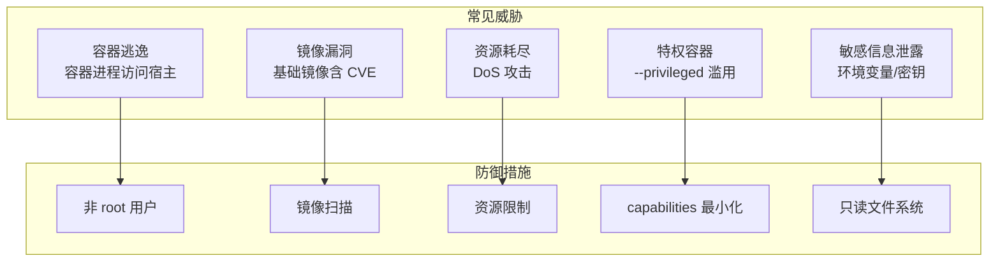

## 🔗 上章回顾

> 在 [[08-镜像优化：多阶段构建与瘦身|上一章]] 中，你把镜像从 1GB 瘦到了 15MB。但小 ≠ 安全。**本章补上安全这一课——镜像扫描、非 root 用户、资源限制、只读文件系统、capabilities 最小化。** 这是从"能用"到"生产可用"的最后一步。

---

## 📖 核心内容

### 1. 容器不是安全沙箱——先认清现实



> [!important] 安全三原则
> 1. **最小权限**：容器只需要最少的权限（非 root、capabilities 最小化）
> 2. **最小攻击面**：镜像只包含运行时必需的文件（多阶段构建、distroless）
> 3. **纵深防御**：多层防御叠加（镜像扫描 + 资源限制 + 只读文件系统）

### 2. 非 root 用户——最基本的安全措施

```dockerfile
# ❌ 默认 root 运行
CMD ["python", "app.py"]

# ✅ 创建并切换到非 root 用户
RUN groupadd -r app && useradd -r -g app -u 1000 app && \
    chown -R app:app /app
USER app
CMD ["python", "app.py"]
```

```bash
# 运行时指定用户
docker run -d -u 1000:1000 myapp

# 验证
docker exec -it myapp id
# uid=1000(app) gid=1000(app)
```

> [!warning] 容器内 root 的危险
> 默认情况下，容器内 UID 0 就是宿主机 UID 0。容器逃逸时，攻击者直接获得宿主机 root 权限。**生产环境必须用非 root 用户。**

### 3. 镜像漏洞扫描——Trivy

```bash
# 安装 Trivy
# macOS: brew install trivy
# Linux: apt install trivy

# 扫描镜像
trivy image nginx:1.27-alpine

# 只看 CRITICAL 和 HIGH
trivy image --severity CRITICAL,HIGH myapp:v1

# 生成 JSON 报告
trivy image --format json -o report.json myapp:v1

# CI 中用作质量门禁（发现 CRITICAL 漏洞时退出非 0）
trivy image --exit-code 1 --severity CRITICAL myapp:v1
```

| 工具 | 特点 | 推荐 |
|------|------|------|
| **Trivy** | 速度快、免费、CVE 数据库全 | ⭐ 首选 |
| **Grype** | Anchore 出品 | 备选 |
| **Snyk** | 商业、漏洞修复建议 | 企业级 |
| **Docker Scout** | Docker 官方内置 | Docker Desktop 用户 |

### 4. 资源限制——防止"吵闹邻居"

关键参数说明：

- `--memory-swap="256m"`：与 `--memory` 相等，表示禁止 swap
- `--cpus="0.5"`：最多用 0.5 个 CPU
- `--pids-limit=100`：限制最大进程数，防 fork 炸弹
- `--ulimit nofile=1024:1024`：文件描述符限制
- `--read-only` + `--tmpfs /tmp:size=64m,mode=1777`：只读根文件系统，仅 /tmp 可写
- `--cap-drop=ALL` + `--cap-add=NET_BIND_SERVICE`：删除所有能力，只保留绑定低端口的能力
- `--security-opt no-new-privileges`：禁止提升权限
- `-u 1000:1000`：非 root 用户运行

```bash
# 生产级安全运行配置
docker run -d \
  --name secure-app \
  --memory="256m" \
  --memory-swap="256m" \
  --cpus="0.5" \
  --pids-limit=100 \
  --ulimit nofile=1024:1024 \
  --restart=on-failure:5 \
  --read-only \
  --tmpfs /tmp:size=64m,mode=1777 \
  --cap-drop=ALL \
  --cap-add=NET_BIND_SERVICE \
  --security-opt no-new-privileges \
  -u 1000:1000 \
  myapp:1.0
```

| 资源 | 推荐值 | 说明 |
|------|--------|------|
| `--memory` | 应用需求的 1.5 倍 | 留缓冲，避免 OOM Kill |
| `--memory-swap` | 等于 memory | 禁用 swap |
| `--cpus` | 0.5-2 | Web 应用 0.5-1，计算密集 2-4 |
| `--pids-limit` | 100-500 | 防 fork 炸弹 |
| `--ulimit nofile` | 1024-65536 | 防文件描述符耗尽 |

### 5. 只读文件系统——防止运行时篡改

需要持久化的数据用 Volume（`-v app-data:/data`）挂载，其余需要写入的目录用 `--tmpfs` 显式开放。

```bash
# 只读根文件系统 + 临时可写目录
docker run -d \
  --read-only \
  --tmpfs /tmp:size=64m \
  --tmpfs /var/cache:size=64m \
  --tmpfs /var/run:size=16m \
  -v app-data:/data \
  myapp:1.0
```

| 优点 | 缺点 |
|------|------|
| 攻击者无法修改二进制文件 | 应用可能不兼容（需改造） |
| 防止恶意脚本植入 | 需要明确列出可写路径 |
| 强制不可变基础设施 | — |

### 6. Capabilities——最小化权限

```bash
# Docker 默认给容器一组 capabilities
# 安全敏感场景应 drop all，再按需 add

# 完全禁用所有 capabilities（最安全）
docker run --cap-drop ALL myapp

# 只加必需的 capability
docker run --cap-drop ALL --cap-add NET_BIND_SERVICE myapp

# 禁止权限提升
docker run --security-opt no-new-privileges myapp
```

| 常用 Capabilities | 说明 |
|-------------------|------|
| `NET_BIND_SERVICE` | 绑定 1024 以下端口 |
| `CHOWN` | 改文件所有者 |
| `SETUID` / `SETGID` | 切换 UID/GID |
| `DAC_OVERRIDE` | 绕过文件权限检查 |
| `NET_ADMIN` | 网络配置（iptables 等） |

> [!warning] 永远不要用 `--privileged`
> `--privileged` 等于给容器几乎所有内核权限。容器逃逸 = 宿主机 root。仅在调试场景短期使用。

### 7. Secrets 管理——密钥不进镜像

```dockerfile
# ❌ 密钥留在镜像层，docker history 可见
ENV DATABASE_PASSWORD=super_secret

# ✅ BuildKit Secret（构建时用，不进镜像）
RUN --mount=type=secret,id=npm_token,target=/root/.npmrc \
    npm install
```

```bash
# 构建时传入 secret
docker buildx build --secret id=npm_token,src=$HOME/.npmrc -t myapp .
```

### 8. Dockerfile 安全清单

```markdown
- [ ] 使用精确版本 tag（非 latest）
- [ ] 基础镜像来自可信源（官方 / distroless）
- [ ] 使用非 root 用户（USER 指令）
- [ ] 不在 Dockerfile 中写密钥
- [ ] 多阶段构建，只保留运行时必需
- [ ] 最小化 RUN 指令中的安装
- [ ] 清理包管理器缓存
- [ ] 使用 .dockerignore 排除敏感文件
- [ ] 使用 HEALTHCHECK
- [ ] 使用 exec 格式 CMD
```

### 9. 运行时加固清单

```markdown
- [ ] 设置资源限制（--memory / --cpus）
- [ ] 使用 --read-only 只读文件系统
- [ ] 使用非 root 用户（-u 1000:1000）
- [ ] 禁止特权模式（不用 --privileged）
- [ ] 禁止权限提升（--security-opt no-new-privileges）
- [ ] 限制 capabilities（--cap-drop ALL --cap-add NET_BIND_SERVICE）
- [ ] 限制进程数（--pids-limit 200）
- [ ] 设置 ulimit（--ulimit nofile=1024:1024）
- [ ] 使用网络隔离（自定义 network）
- [ ] 配置日志限制（--log-opt max-size=10m）
```

---

## 🎯 实践练习

### 练习 1：非 root 用户运行

```bash
# 1. 创建 Dockerfile
cat > Dockerfile << 'EOF'
FROM python:3.12-alpine
RUN addgroup -S app && adduser -S app -G app
WORKDIR /app
COPY app.py .
RUN pip install flask
USER app
CMD ["python", "app.py"]
EOF

# 2. 构建并运行
docker build -t secure-app:v1 .
docker run -d --name secure-test secure-app:v1

# 3. 验证用户身份
docker exec secure-test id
# uid=100(app) gid=100(app)  ← 非 root！

# 4. 对比：默认 root 运行
docker run --rm nginx:alpine id
# uid=0(root) gid=0(root)  ← root！

# 5. 清理
docker rm -f secure-test
```

> 💡 **注释**：
> `addgroup -S` 和 `adduser -S` 创建系统用户（无登录 shell）。`USER app` 之后所有 CMD 都以 app 用户运行。这是最基本的安全措施——容器逃逸时攻击者只拿到 app 用户权限，而不是 root。

### 练习 2：Trivy 镜像扫描

```bash
# 1. 安装 Trivy（略，见上文）

# 2. 扫描你自己的镜像
trivy image my-flask-app:v1

# 3. 只看高危漏洞
trivy image --severity CRITICAL,HIGH my-flask-app:v1

# 4. 对比 nginx:alpine 和 nginx:latest 的漏洞数量
trivy image --severity CRITICAL,HIGH nginx:alpine
trivy image --severity CRITICAL,HIGH nginx:latest
# alpine 版通常漏洞更少
```

> 💡 **注释**：
> 生产环境应在 CI/CD 流程中集成 `trivy image --exit-code 1 --severity CRITICAL`，发现致命漏洞时阻止发布。`--exit-code 1` 表示发现 CRITICAL 漏洞时返回非 0 退出码，CI 流水线会因此失败。

### 练习 3：只读文件系统 + 资源限制

```bash
# 启动一个安全加固的容器
# 用 alpine + sleep 演示：它在 --read-only、非 root 下必然能跑通
docker run -d \
  --name locked-down \
  --memory="128m" \
  --cpus="0.5" \
  --read-only \
  --tmpfs /tmp:size=32m,mode=1777 \
  --cap-drop ALL \
  --security-opt no-new-privileges \
  -u 1000:1000 \
  alpine:3.20 sleep 3600

# 验证：尝试在容器内修改文件
docker exec locked-down sh -c "echo test > /etc/test"
# Read-only file system → 修改被阻止！

# 但 /tmp 可以写
docker exec locked-down sh -c "echo test > /tmp/test && cat /tmp/test"
# test → /tmp 可写（tmpfs）

# 清理
docker rm -f locked-down
```

> 💡 **注释**：
> `--read-only` 让容器根文件系统只读，攻击者无法植入恶意脚本。需要写入的目录用 `--tmpfs` 单独开放。这是纵深防御的一层——即使攻击者获得了容器内执行权限，也无法修改文件。注意：nginx 官方镜像默认以 root 运行，且需要写 `/var/run/nginx.pid`、`/var/cache/nginx`，直接 `--read-only` + `-u` 非 root 会启动失败；生产中可改用 `nginxinc/nginx-unprivileged` 镜像，或用 tmpfs 显式开放对应目录。

### 练习 4：对比安全等级

```bash
# 1. 最不安全：特权 + root + 无限制
docker run -d --name insecure --privileged nginx:alpine
# 危险！仅用于理解反面教材

# 2. 中等安全：非 root + 资源限制
docker run -d --name medium \
  --memory="256m" --cpus="1" \
  -u 1000:1000 \
  nginx:alpine

# 3. 最高安全：全加固
# 注意：这里和练习 3 一致用 alpine sleep 演示——nginx:alpine 在全只读 + 非 root 下
# 必然启动失败（它要写 /var/run/nginx.pid、/var/cache/nginx，见练习 3 的警告）。
# 真要跑 nginx：换 nginxinc/nginx-unprivileged 镜像，或为上述两个目录补 --tmpfs。
docker run -d --name secure \
  --memory="256m" --memory-swap="256m" \
  --cpus="0.5" --pids-limit=100 \
  --read-only --tmpfs /tmp:size=64m,mode=1777 \
  --cap-drop ALL --cap-add NET_BIND_SERVICE \
  --security-opt no-new-privileges \
  -u 1000:1000 \
  alpine:3.20 sleep 3600

# 对比三个容器的配置
docker inspect insecure | grep -A5 '"Privileged"'
docker inspect medium | grep -A5 '"Memory"'
docker inspect secure | grep -A5 '"Memory"'

# 清理
docker rm -f insecure medium secure
```

> 💡 **注释**：
> 这个练习让你直观对比三个安全等级。`--privileged` 是最危险的配置，等于把宿主机钥匙交给了容器。生产环境应该用第三个配置——多层防御叠加。第三个容器改用 `alpine sleep`（同练习 3）：nginx:alpine 在 `--read-only` + 非 root 下必然启动失败——它需要写 `/var/run/nginx.pid` 和 `/var/cache/nginx`；生产中要跑 nginx 请换 `nginxinc/nginx-unprivileged` 镜像，或为这两个目录补 `--tmpfs`。`--cap-add NET_BIND_SERVICE` 仅在需要绑定 <1024 低端口时才有必要。

---

## 💡 要点注释

1. **非 root 用户是最基本的安全措施**
   - 默认容器内 UID 0 = 宿主机 UID 0
   - 容器逃逸时，root 容器 = 宿主机沦陷
   - 非 root 用户大幅降低逃逸后的影响

2. **`USER` 指令要放在 `COPY` 之后**
   ```dockerfile
   # ❌ COPY 文件属主是 root
   USER app
   COPY . .
   # ✅ 先 COPY 再 USER
   COPY --chown=app:app . .
   USER app
   ```

3. **资源限制是"上限"不是"预留"**
   - `--memory=256m` 意思是"最多用 256MB"
   - 多个容器可以超卖（总和大于宿主内存），但触发 OOM 时内核会杀进程

4. **Rootless 模式是终极安全方案**
   Docker 20.10+ 支持以普通用户运行守护进程，容器即使逃逸也拿不到 root。适合高安全要求场景。

---

## 🔄 可选迭代

1. **GitHub Actions 集成 Trivy**：
   ```yaml
   name: Security Scan
   on: [push, pull_request]
   jobs:
     trivy:
       runs-on: ubuntu-latest
       steps:
         - uses: actions/checkout@v4
         - name: Build image
           uses: docker/build-push-action@v5
           with: { context: ., load: true, tags: myapp:scan }
         - name: Run Trivy
           uses: aquasecurity/trivy-action@master
           with:
             image-ref: myapp:scan
             severity: CRITICAL,HIGH
             exit-code: 1
   ```

2. **尝试 Rootless Docker**：`dockerd-rootless-setuptool.sh install`

3. **尝试 cosign 镜像签名**：
   ```bash
   cosign sign --key cosign.key myrepo/app:v1.0
   cosign verify --key cosign.pub myrepo/app:v1.0
   ```

4. **用 BuildKit Secret 安全传递密钥**（[[08-镜像优化：多阶段构建与瘦身]] 已介绍）

5. **编写安全基线脚本**：用 shell 脚本批量检查所有容器的安全配置

---

## ⚠️ 常见易错点

> [!warning] **坑 1：容器用 root 运行**
> 容器逃逸时，容器内 root = 宿主机 root。生产环境必须用非 root 用户。

> [!warning] **坑 2：镜像未经扫描就部署**
> 基础镜像可能包含已知 CVE。用 trivy 在 CI 中自动扫描。

> [!warning] **坑 3：无资源限制导致"吵闹邻居"**
> 一个容器 OOM 可能拖垮整台宿主机。生产环境必须设置 `--memory` 和 `--cpus`。

> [!warning] **坑 4：Secret 写在 Dockerfile 里**
> 密码进入镜像层，`docker history` 可见。用 BuildKit `--mount=type=secret`。

> [!warning] **坑 5：`--privileged` 调试后忘记去掉**
> 等于给容器 root 权限。用 `--cap-add` 按需加 capabilities，绝不 `--privileged`。

---

## 🎯 本文学完自检

| 层次 | 检查项 |
|------|--------|
| 🟢 基础 | 能在 Dockerfile 中配置非 root 用户；能给容器设置 `--memory` 和 `--cpus` 资源限制 |
| 🟡 进阶 | 能用 Trivy 扫描镜像并修复所有 CRITICAL 漏洞；能配置只读文件系统和 capabilities 最小化 |
| 🔴 挑战 | 能设计完整安全方案（非 root + 资源限制 + 只读 + cap-drop + 镜像签名），集成到 CI/CD 门禁，并通过安全团队审计 |

---

## 🔗 相关笔记

- ⬅️ 前置：[[08-镜像优化：多阶段构建与瘦身]] — 安全从 Dockerfile 开始
- ⬅️ 前置：[[05-容器隔离原理：Namespace 与 Cgroups]] — 理解容器隔离后再学安全加固
- ➡️ 后续：[[01-学习/DockerNew/10-业务场景实战合集]] — 安全实践落地到具体场景
- 🔗 关联：[[00-Docker 总览索引]] — 回到课程总览

---

*最后更新：2026-07-28*