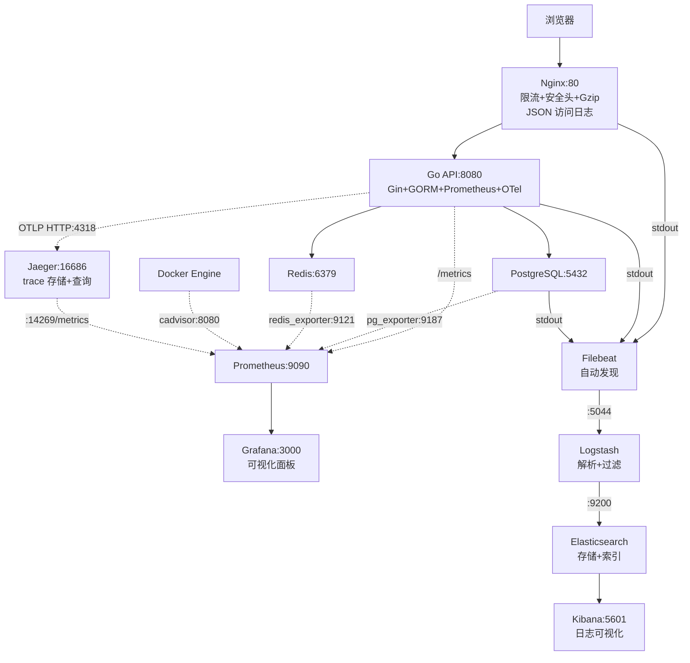
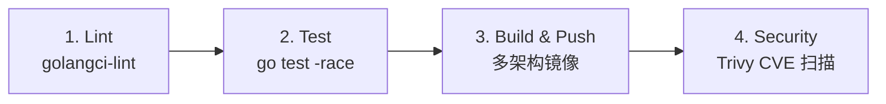

# 🐹 Go + Docker 综合实战项目

> **跨路径联动**：本项目整合了 [[GoLearningByPython/00-Go 总览索引（Python 迁移版）|Go 学习路径]] + DockerNew 全 11 章知识 + [[K8SLearningByDocker/00-K8S 总览索引（Docker 迁移版）|K8S 迁移路径]]，是三条学习路径的综合检验。

---

## 📋 项目概览

**项目名**：go-todo-api — 一个生产级 TODO REST API

| 维度 | 技术选型 | 对应学习路径 |
|------|---------|-------------|
| 语言 | Go 1.22 + Gin 框架 | Go学习路径 01-06 |
| 数据库 | PostgreSQL 16 | DockerNew 06（Volume 持久化）|
| 缓存 | Redis 7 | DockerNew 06（网络通信）|
| 反向代理 | Nginx 1.27（限流 + 安全头 + JSON 日志） | DockerNew 10（反向代理）|
| 指标监控 | Prometheus + Grafana | DockerNew 10（容器监控）|
| 数据库/缓存指标 | postgres-exporter + redis-exporter | DockerNew 10（数据库监控）|
| 容器资源监控 | cAdvisor | DockerNew 10（容器资源监控）|
| 链路追踪 | Jaeger + OpenTelemetry（OTLP HTTP） | DockerNew 10（分布式追踪）|
| 日志收集 | ELK（Filebeat + Logstash + Elasticsearch + Kibana） | DockerNew 10（日志收集）|
| 镜像构建 | 多阶段 Dockerfile（~15MB） | DockerNew 03 + 08 |
| 编排 | Docker Compose（6 层叠加覆盖） | DockerNew 07 |
| 安全 | 非 root + 资源限制 + 只读文件系统 + 健康检查 | DockerNew 09 |
| CI/CD | GitHub Actions（lint → test → build → push → Trivy） | DockerNew 10（CI/CD）|
| K8S 迁移 | Helm Chart（Bitnami 子 chart + ServiceMonitor） | K8SLearningByDocker |

---

## 🚀 快速开始

### 方式一：纯开发环境（3 服务，热更新）

```bash
cd "D:/Obsidian/My-First-Obsidian/01-学习/DockerNew/Go+Docker综合项目"
docker compose -f compose.yaml -f compose.dev.yaml up -d --build
curl http://localhost:8080/health
```

### 方式二：完整监控环境（9 服务，含 Exporter + cAdvisor）

```bash
docker compose -f compose.yaml -f compose.monitoring.yaml up -d --build
# API(经Nginx) http://localhost | Prometheus http://localhost:9090
# Grafana http://localhost:3000 (admin/admin) | cAdvisor http://localhost:8081
```

### 方式三：全栈可观测（14 服务，含追踪 + 日志）

```bash
docker compose -f compose.yaml -f compose.monitoring.yaml \
  -f compose.tracing.yaml -f compose.logging.yaml up -d --build
# + Jaeger UI http://localhost:16686 | Kibana http://localhost:5601
#   Elasticsearch http://localhost:9200
```

### 方式四：生产环境（安全加固 + Nginx）

```bash
APP_VERSION=latest docker compose -f compose.yaml -f compose.prod.yaml up -d
```

### 方式五：K8S 部署（Helm Chart）

```bash
cd helm/go-todo-api
helm dependency update
helm install go-todo-api . -f values-prod.yaml
kubectl port-forward svc/go-todo-api 8080:8080
```

---

## 🔗 Compose 文件叠加指南

| 场景 | 命令 | 服务数 |
|------|------|--------|
| 纯开发 | `-f compose.yaml -f compose.dev.yaml` | 3 |
| 开发+监控 | `-f compose.yaml -f compose.dev.yaml -f compose.monitoring.yaml` | 9 |
| 全栈可观测 | `-f compose.yaml -f compose.monitoring.yaml -f compose.tracing.yaml -f compose.logging.yaml` | 14 |
| 生产 | `-f compose.yaml -f compose.prod.yaml` | 4 |

---

## 📁 项目结构（GitHub Repo）

```
go-todo-api/
├── .github/
│   ├── workflows/
│   │   ├── ci.yml                    # CI: lint→test→build→push→scan
│   │   └── release.yml               # Release: tag 触发自动发布
│   ├── ISSUE_TEMPLATE/
│   │   ├── bug_report.md
│   │   └── feature_request.md
│   └── PULL_REQUEST_TEMPLATE.md
├── nginx/
│   └── nginx.conf                     # 反向代理 + 限流 + 安全头 + JSON 日志
├── prometheus/
│   └── prometheus.yml                 # 指标抓取（6 个目标）
├── grafana/
│   ├── provisioning/
│   │   ├── datasources/prometheus.yml
│   │   └── dashboards/dashboards.yml
│   └── dashboards/go-api-dashboard.json
├── elk/
│   ├── filebeat/filebeat.yml          # 容器日志自动采集
│   └── logstash/
│       ├── config/logstash.yml
│       └── pipeline/logstash.conf     # 日志解析（JSON + Grok + 容器名标签）
├── jaeger/
│   └── jaeger-config.yaml             # 生产环境配置参考
├── helm/go-todo-api/
│   ├── Chart.yaml                     # Bitnami 子 chart 依赖
│   ├── values.yaml                    # 默认配置
│   ├── values-dev.yaml                # 开发覆盖
│   ├── values-prod.yaml               # 生产覆盖
│   ├── README.md                      # Helm 使用指南 + Docker→K8S 对照表
│   └── templates/
│       ├── _helpers.tpl               # 模板函数
│       ├── NOTES.txt                  # 安装后提示
│       ├── deployment.yaml            # 非 root + 只读 + 健康检查 + 资源限制
│       ├── service.yaml               # ClusterIP
│       ├── ingress.yaml               # Nginx 入口 + TLS
│       ├── hpa.yaml                   # CPU + 内存双指标
│       ├── configmap.yaml             # 非敏感环境变量
│       ├── secret.yaml                # DB DSN / Redis URL
│       ├── serviceaccount.yaml
│       └── servicemonitor.yaml        # Prometheus Operator 自动发现
├── main.go                            # Go API（Gin+GORM+Redis+Prometheus+OTel）
├── go.mod
├── Dockerfile                         # 多阶段构建（生产级 ~15MB）
├── Dockerfile.dev                     # 开发用（air 热更新）
├── compose.yaml                       # 基础（api + db + cache）
├── compose.dev.yaml                   # 开发覆盖（热更新 + 调试端口）
├── compose.prod.yaml                  # 生产覆盖（安全加固 + Nginx）
├── compose.monitoring.yaml            # 监控覆盖（Nginx + Prometheus + Grafana + 3 exporter + cAdvisor）
├── compose.tracing.yaml               # 追踪覆盖（Jaeger + OTel 环境变量注入）
├── compose.logging.yaml               # 日志覆盖（ELK 四件套）
├── .dockerignore / .gitignore / .env.example
├── init.sql                           # PostgreSQL 种子数据
├── LICENSE / CHANGELOG.md / CONTRIBUTING.md
└── README.md
```

---

## 🏗️ 全栈可观测架构图（14 服务）



---

## 📊 监控与可观测性

### Prometheus 抓取目标（6 个 job）

| job_name | 目标 | 核心指标 |
|----------|------|---------|
| go-api | api:8080 | HTTP 请求速率、延迟分布、DB 操作计数 |
| prometheus | localhost:9090 | Prometheus 自身指标 |
| postgres | postgres-exporter:9187 | 连接数、事务速率、缓存命中率、表大小 |
| redis | redis-exporter:9121 | 内存使用、键数、命中率、命令速率 |
| cadvisor | cadvisor:8080 | 容器 CPU/内存/网络/文件系统 |
| jaeger | jaeger:14269 | trace 吞吐量、延迟 |

### Grafana 仪表盘面板（http://localhost:3000，admin/admin）

| 面板 | 指标 | 说明 |
|------|------|------|
| HTTP 请求速率 | `rate(http_requests_total[1m])` | 按方法/路径/状态码分组 |
| P95/P50 延迟 | `histogram_quantile(0.95, ...)` | 95 分位和 50 分位延迟 |
| 数据库操作速率 | `rate(db_operations_total[1m])` | CRUD 操作频率 |
| API 状态 | `up{job="go-api"}` | 1=健康 0=故障 |
| 请求总量 | `sum(increase(http_requests_total[1h]))` | 过去 1 小时总请求数 |

### Prometheus 查询示例

```promql
# API 请求速率（QPS）
rate(http_requests_total[1m])

# P95 延迟
histogram_quantile(0.95, rate(http_request_duration_seconds_bucket[5m]))

# PostgreSQL 活跃连接数
pg_stat_database_numbackends{datname="appdb"}

# Redis 缓存命中率
redis_keyspace_hits_total / (redis_keyspace_hits_total + redis_keyspace_misses_total)

# 容器 CPU 使用率
rate(container_cpu_usage_seconds_total{container_label_com_docker_compose_service="api"}[1m])
```

---

## 🔗 链路追踪（Jaeger + OpenTelemetry）

启动含追踪的环境后，每个 API 请求的完整调用链自动记录：

```bash
# 发送请求
curl http://localhost/api/todos

# 打开 Jaeger UI 查看 trace
# http://localhost:16686
# Service 下拉选 go-todo-api → Find Traces
# 每个请求显示 span 树（Gin 中间件 → DB 查询 → Redis 操作）
```

> [!important] 追踪降级容错
> 如果 Jaeger 不可用（`OTEL_EXPORTER_OTLP_ENDPOINT` 未设置或 Jaeger 未启动），`initTracer()` 函数会跳过初始化，API 正常启动不受影响。这保证了追踪是"可选增强"而非"硬依赖"。

**生产环境注意事项**：
- 当前使用 Jaeger all-in-one（内存存储，重启丢失），适合开发
- 生产应使用 Jaeger Collector + Elasticsearch 后端存储（参考 `jaeger/jaeger-config.yaml`）
- 建议将 `AlwaysSample` 改为 `TraceIDRatioBased(0.1)` 降低采样率

---

## 📋 日志收集（ELK Stack）

```bash
# 启动日志收集环境
docker compose -f compose.yaml -f compose.monitoring.yaml -f compose.logging.yaml up -d

# 打开 Kibana
# http://localhost:5601
# 首次使用: Stack Management → Index Patterns → 创建 go-todo-api-logs-*
```

### 日志管道

```
容器 stdout/stderr
  → Filebeat（Docker 自动发现，采集容器日志）
  → Logstash（解析 JSON + Grok，添加 service 标签）
  → Elasticsearch（按天索引 go-todo-api-logs-YYYY.MM.dd）
  → Kibana（可视化搜索）
```

| 服务 | 日志格式 | 说明 |
|------|---------|------|
| Nginx | JSON 访问日志（`json_combined` 格式） | 含请求方法、URI、状态码、响应时间、upstream 延迟 |
| Go API | 标准 Go log 格式 | 经 Logstash Grok 解析时间戳和日志级别 |
| PostgreSQL | 标准输出 | 含查询日志和错误信息 |
| Redis | 标准输出 | 含连接信息和持久化状态 |

---

## ⚓ Helm Chart（K8S 迁移）

```bash
cd helm/go-todo-api
helm dependency update    # 下载 Bitnami postgresql + redis 子 chart
helm install go-todo-api . -f values-dev.yaml
```

### Docker Compose → K8S 对照表

| Docker Compose | Kubernetes | 说明 |
|---------------|-----------|------|
| `compose.yaml` | `values.yaml` + `deployment.yaml` | 基础配置 |
| `compose.dev.yaml` | `values-dev.yaml` | 开发覆盖 |
| `compose.prod.yaml` | `values-prod.yaml` | 生产覆盖 |
| Nginx 反向代理 | `ingress.yaml`（Ingress + annotations） | 端口收敛 → 域名入口 |
| Docker healthcheck | `livenessProbe` + `readinessProbe` | 健康检查探针 |
| `--memory` / `--cpus` | `resources.limits` | 资源限制 |
| `--read-only` | `readOnlyRootFilesystem: true` | 只读文件系统 |
| `--user 1000:1000` | `runAsUser` / `runAsGroup` | 非 root |
| `cap_drop: ALL` | `capabilities.drop: [ALL]` | capabilities 最小化 |
| 无 | HPA（CPU + 内存双指标） | K8S 独有的自动扩缩容 |
| Volume | PersistentVolumeClaim（子 chart 管理） | 持久化存储 |
| `depends_on` | `initContainer` 或 readinessProbe | 依赖管理 |

---

## 🔧 CI/CD 流水线

### CI 工作流（`.github/workflows/ci.yml`）

触发条件：push 到 main、PR 到 main



### Release 工作流（`.github/workflows/release.yml`）

```bash
git tag v1.0.0
git push origin v1.0.0
# → 自动构建多架构镜像 + 创建 GitHub Release + 生成 Changelog
```

---

## 🔧 关键设计决策

| 决策 | 选择 | 原因 |
|------|------|------|
| 链路追踪协议 | OTLP HTTP (jaeger:4318) | 比 gRPC 更简单，无额外依赖，Jaeger 原生支持 |
| 追踪 SDK | OTel SDK + otelgin.Middleware | 官方 Gin 插桩，一条中间件注入所有 HTTP span |
| 追踪失败处理 | init 函数防 panic，失败降级 | 不因 Jaeger 不可用而阻塞应用启动 |
| 日志采集 | Filebeat Docker 自动发现 | 无需修改应用代码，自动采集所有容器 stdout |
| 日志格式 | Nginx JSON 访问日志 | 结构化日志，Logstash 直接解析，无需 Grok 正则 |
| K8S 部署 | Helm Chart + Bitnami 子 chart | 社区标准，含 PG/Redis 依赖管理 |
| Compose 分层 | 6 个独立 overlay 文件 | 按需组合，避免单文件过大 |

---

## 📖 知识点映射

| 文件 | 对应章节 | 知识点 |
|------|---------|--------|
| `main.go` | Go 路径 + DockerNew 10 | Prometheus 指标 + OTel 链路追踪 |
| `Dockerfile` | 03 + 08 + 09 | 多阶段构建 + 非 root + alpine |
| `compose.yaml` | 06 + 07 | 网络 + Volume + 健康检查 + 依赖 |
| `compose.dev.yaml` | 07 | Watch 热更新 + Bind Mount |
| `compose.prod.yaml` | 09 + 10 | 资源限制 + 只读 + cap-drop + Nginx |
| `compose.monitoring.yaml` | 10 | Nginx + Prometheus + Grafana + 3 exporter + cAdvisor |
| `compose.tracing.yaml` | 10 | Jaeger + OTel 环境变量注入 |
| `compose.logging.yaml` | 10 | Filebeat + Logstash + Elasticsearch + Kibana |
| `nginx/nginx.conf` | 10 | 反向代理 + 限流 + 安全头 + JSON 日志 |
| `prometheus/prometheus.yml` | 10 | 6 个抓取目标 |
| `elk/` | 10 | 日志采集 + 解析管道 + 容器自动发现 |
| `helm/` | K8SLearningByDocker | Docker Compose → K8S 迁移 |
| `.github/workflows/` | 10 | CI/CD 流水线 |
| `.dockerignore` | 04 | 构建上下文优化 |
| `init.sql` | 06 | 数据库初始化 |

---

## 🎯 实践任务

### 任务 1：启动并验证（DockerNew 01-02）
- [ ] 启动开发环境，验证三个服务 healthy
- [ ] 用 curl 测试 CRUD API

### 任务 2：多阶段构建（DockerNew 03+08）
- [ ] 对比 `Dockerfile` 和 `Dockerfile.dev` 的差异
- [ ] 构建后用 `docker images` 查看大小（应 < 20MB）

### 任务 3：网络与存储（DockerNew 06）
- [ ] 用 `docker network inspect` 查看自定义网络
- [ ] 删除容器后重启，验证 Volume 数据持久化

### 任务 4：安全加固（DockerNew 09）
- [ ] 启动生产环境，验证非 root 用户
- [ ] 用 `trivy image` 扫描镜像

### 任务 5：Nginx + 监控（DockerNew 10）
- [ ] 验证 Nginx 限流（快速发 30 个请求观察 429）
- [ ] 打开 Grafana 查看仪表盘面板
- [ ] 在 Prometheus 查询 PG 连接数和 Redis 命中率
- [ ] 打开 cAdvisor http://localhost:8081，查看容器资源面板

### 任务 6：链路追踪（DockerNew 10）
- [ ] 启动追踪环境，打开 Jaeger UI http://localhost:16686
- [ ] 发送 API 请求，在 Jaeger 查看 trace span 树
- [ ] 观察 `otelgin.Middleware` 记录的 span 信息（方法、路径、状态码）
- [ ] 停止 Jaeger，验证 API 仍正常启动（tracing 降级容错）

### 任务 7：日志收集（DockerNew 10）
- [ ] 启动 ELK 环境，打开 Kibana http://localhost:5601
- [ ] 创建 Index Pattern `go-todo-api-logs-*`
- [ ] 按 `service: nginx` 筛选 Nginx 访问日志（JSON 格式）
- [ ] 按 `service: go-api` 筛选 Go API 日志
- [ ] 查询特定状态码（如 `status: 500`）或错误日志

### 任务 8：CI/CD 流水线（DockerNew 10）
- [ ] 推送代码到 GitHub，观察 Actions 运行
- [ ] 在 GitHub Security 标签页查看 Trivy 扫描结果
- [ ] 创建一个 tag，触发 Release 自动发布

### 任务 9：K8S 迁移（K8SLearningByDocker）
- [ ] 阅读 Helm Chart 的 `values.yaml` 和 `templates/deployment.yaml`
- [ ] 对比 `deployment.yaml` 和 `compose.prod.yaml` 的对应关系
- [ ] `helm dependency update` + `helm install go-todo-api . -f values-dev.yaml`
- [ ] `kubectl get pods` / `kubectl port-forward svc/go-todo-api 8080:8080`
- [ ] 尝试修改 values 并 `helm upgrade`

---

## 🔄 后续可选迭代

| 方向 | 说明 | 状态 |
|------|------|------|
| postgres-exporter | 监控 PG 内部指标（连接数、缓存命中率） | ✅ 已完成 |
| redis-exporter | 监控 Redis 内部指标（内存、命中率） | ✅ 已完成 |
| cAdvisor | 容器资源监控（CPU/内存/网络） | ✅ 已完成 |
| Jaeger + OpenTelemetry | 分布式链路追踪 | ✅ 已完成 |
| ELK 日志栈 | 集中日志收集 | ✅ 已完成 |
| Helm Chart | K8S 迁移 | ✅ 已完成 |
| Alertmanager | 告警规则（延迟 > 1s、错误率 > 5%） | ❌ 待实现 |
| Loki | 轻量级日志收集（替代 ELK） | ❌ 待实现 |
| Istio | 服务网格（零侵入流量管理 + mTLS） | ❌ 待实现 |

---

*最后更新：2026-07-28*
