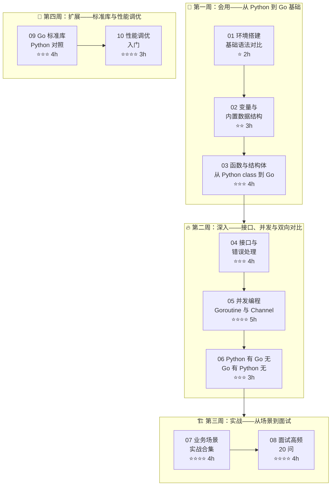

> [!info] 版本基线
> 本学习路径基于 **Go ≥ 1.22**，涉及两个 1.22 新特性：`for i := range n`（range-over-int，直接迭代 0 到 n-1）；for 循环变量**每轮迭代新建**（1.22 前所有迭代共享同一个变量，闭包捕获易踩坑）。
> 术语约定：Go 调度模型统一写作 **GMP**（G=goroutine，M=OS 线程，P=逻辑处理器）。
>
> **🔄 2026-09 版本差异**：现行 stable 已到 **Go 1.27**（2026-08 发布，1.27.1 于 2026-09-01）。与本路径相关的变化：**泛型方法已支持引入新的类型参数**（11 篇的"坑 3"在 1.27+ 下不再成立，1.22～1.26 仍需遵守）；新增实验性 `encoding/json/v2` 与标准库 `uuid` 包。教学基线保持 1.22+ 不变，升级环境后正文示例无需改动。
>
> **版本口径**：教学基线 Go 1.22+ ｜ 环境安装推荐 Go 1.27+ ｜ 正文示例在 1.22–1.27 均可运行。另：Python 3.13/3.14 已提供 free-threaded（无 GIL）官方构建，但**非默认且尚未普及**——本路径各篇"GIL 使 Python 无法真并行"的对比表述在默认构建下仍然成立。

> 📌 **本学习路径基于 [[../../03-AI工具/AI协作方法论/技术学习路径创建方法论]] 和 [[../../03-AI工具/AI协作方法论/迁移式学习路径创建方法论]] 的方法论构建**，专为**有 Python 经验的开发者**设计。以 Python 为锚点，逐篇映射 Python 概念到 Go 等价物，辅以 Python 有 Go 无 / Go 有 Python 无的双向对比，由浅入深完成迁移。

---

## 📖 学习路径概览

---

## 🧭 角色导航

| 角色 | 背景 | 推荐路线 | 预计学时 |
|------|------|---------|---------|
| 🐍 **Python 后端** | 熟悉 Flask/FastAPI，了解多线程 | 01→02→03→04→05→06→07→08（全部） | 29h |
| 🔄 **Python 全栈** | 用过 Django/Flask 全栈，有异步编程经验 | 01 速览→02 速览→03→04→05 重点→06 速览→07→08 | 22-26h |
| 🚀 **Python 数据科学** | 主要是 NumPy/Pandas/PyTorch | 全部学习路径，重点 05 并发编程和 04 接口设计 | 29h |
| ⚡ **Python DevOps** | 熟悉脚本编写、系统运维 | 01→03→04→07（CLI/微服务场景） | 12-15h |

### 🚀 背景速查：Python 经验可跳过的内容

| 可快速浏览的内容 | 原因 | 何时需要深读 |
|-------------|------|-------------|
| 01 if/for/switch 基本语法 | 概念与 Python 高度一致 | 遇到 Go 无 `while` 循环、`for range` 语法时 |
| 02 slice/map 基本操作 | 类似 Python 的 list/dict | 遇到 slice 底层原理、cap 扩容机制时 |
| 03 函数基础（参数、返回值） | 与 Python 函数概念一致 | 遇到多返回值、命名返回值、defer 时 |
| 04 基础接口定义 | 类似 Python 的 Protocol | 遇到隐式实现、空接口、类型断言时 |
| 05 并发概念 | 有 Python asyncio 基础 | 遇到 goroutine 调度、channel 通信模式时 |

---

## 📊 阶段总览

| 阶段 | 笔记数 | 预计学时 | 难度 | 核心目标 |
|------|--------|---------|------|---------|
| 第一周 | 3 篇 | 9h | ⭐→⭐⭐⭐ | 建立 Python→Go 概念映射，理解 Go 的 struct 替代 class 的哲学 |
| 第二周 | 3 篇 | 12h | ⭐⭐⭐→⭐⭐⭐⭐ | 掌握接口隐式实现、错误处理模式、goroutine/channel 并发模型 |
| 第三周 | 2 篇 | 8h | ⭐⭐⭐⭐ | 10 大场景实战，面试对答如流 |
| 第四周 | 5 篇 | 13h | ⭐⭐⭐→⭐⭐⭐⭐⭐ | 标准库、性能调优、泛型、FFI、benchmark |

> **总学时**：约 29h（核心笔记 01-08）+ 13h（扩展篇 09-13）+ 19h（毕业项目）= 约 61h

---

## 📋 笔记索引

### 第一周：会用

| 序号 | 笔记 | 难度 | 学时 | Python 锚点 |
|------|------|------|------|------------|
| 01 | [[01-环境搭建与基础语法对比]] | ⭐ | 2h | pip→go mod, Python 语法→Go 语法 |
| 02 | [[02-变量与内置数据结构对比]] | ⭐⭐ | 3h | Python list/dict→Go slice/map, 零值语义 |
| 03 | [[03-函数与结构体-从Python class到Go]] | ⭐⭐⭐ | 4h | Python 函数/类→Go 函数/method/struct |

### 第二周：深入

| 序号 | 笔记 | 难度 | 学时 | Python 锚点 |
|------|------|------|------|------------|
| 04 | [[04-接口与错误处理-Go的设计哲学]] | ⭐⭐⭐ | 4h | try/except→error 返回值, Protocol→隐式接口 |
| 05 | [[05-并发编程-Goroutine与Channel]] | ⭐⭐⭐⭐ | 5h | asyncio→goroutine, Queue→channel |
| 06 | [[06-Python有Go无与Go有Python无]] | ⭐⭐⭐ | 3h | 双向特性全景对比 |

### 第三周：实战

| 序号 | 笔记 | 难度 | 学时 | Python 锚点 |
|------|------|------|------|------------|
| 07 | [[01-学习/GoLearningByPython/07-业务场景实战合集|07-业务场景实战合集]] | ⭐⭐⭐⭐ | 4h | 10 大场景 Python→Go 迁移 |
| 08 | [[01-学习/GoLearningByPython/08-面试高频20问-Python背景版|08-面试高频20问-Python背景版]] | ⭐⭐⭐⭐ | 4h | 每问带 Python 对比视角 |

### 第四周：扩展

| 序号 | 笔记 | 难度 | 学时 | Python 锚点 |
|------|------|------|------|------------|
| 09 | [[09-Go标准库实战-Python对照]] | ⭐⭐⭐ | 4h | Flask/requests/json → net/http |
| 10 | [[10-Go性能调优入门-Python对照]] | ⭐⭐⭐⭐ | 3h | cProfile → pprof，pytest-benchmark → go test -bench |
| 11 | [[11-Go泛型与Python TypeVar对比]] | ⭐⭐⭐⭐ | 2h | TypeVar → [T any]，bound → 接口约束 |
| 12 | [[12-Go与Python FFI互调]] | ⭐⭐⭐⭐⭐ | 3h | ctypes/cgo/gRPC 跨语言通信 |
| 13 | [[13-Python vs Go Benchmark实测]] | ⭐⭐⭐ | 1h | 实测性能对比，用数据说话 |

---

## 🗺️ Python → Go 核心概念映射速查

| Python 概念 | Go 等价 | 差异说明 |
|------------|---------|---------|
| `str` | `string` | 基本一致，Go 中用 `len` 获取字节数，`utf8.RuneCountInString` 获取字符数 |
| `int` | `int`, `int8`, `int16`, `int32`, `int64` | Go 有明确位宽，`int` 根据平台为 32/64 位 |
| `float` | `float32`, `float64` | 无 `float` 统一类型，需显式指定精度 |
| `bool` | `bool` | 一致 |
| `None` | `nil` | Go 的 `nil` 有类型，不能直接赋值给不同 nil 类型 |
| `list` | `[]T` (slice) | Go 有 array 和 slice 之分，slice 是动态的 |
| `tuple` | 无直接等价 | 用 struct 或多返回值替代 |
| `dict` | `map[K]V` | Go 的 map 是无序的，range 遍历顺序随机 |
| `set` | `map[T]struct{}` | Go 无内置 set，用 map 模拟 |
| `Optional[T]` | `*T` 或 `, ok` 模式 | Go 用指针或 ok 模式表达可选 |
| `Union[T1, T2]` | `interface{}` + 类型断言 | Go 无联合类型，用空接口 |
| `class` | `struct` + 方法 | Go 无继承，用组合（embedding）替代 |
| `ABC` / `abstractmethod` | `interface` | Go 接口是核心，鸭子类型，隐式实现 |
| `@dataclass` | `struct` | Go struct 本身就很轻量，字段首字母大写=公开 |
| `Enum` | `iota` 常量组 | Go 用 iota 生成枚举值 |
| `__init__` | 构造函数约定 `NewXxx()` | Go 无内置构造函数，用工厂函数命名约定 |
| `self` | 接收者（receiver） | Go 方法定义在 struct 外部，用接收者关联 |
| `@classmethod` | 无直接等价 | 可以用包级函数替代 |
| `@staticmethod` | 包级函数 | 定义在包内而非 struct 上的函数 |
| `@property` | 无 | 用 getter/setter 方法（GetXxx/SetXxx） |
| `try/except` | `if err != nil` | Go 用显式错误返回值，无异常机制 |
| `with` 上下文管理器 | `defer` | Go 的 `defer` 确保资源释放，语义不同 |
| `yield` / 生成器 | `channel` + goroutine | 完全不同，channel 是并发通信机制 |
| `asyncio` / `await` | goroutine + channel | Go 的并发模型是语言级的，无需 async/await |
| `threading` | `goroutine` | goroutine 比线程轻量，由 Go 调度器管理 |
| `GIL` | 无 GIL | Go 原生支持真并行 |
| `multiprocessing` | goroutine / `runtime.GOMAXPROCS` | Go 通常不需要多进程 |
| `pip install` | `go get` / `go mod download` | Go 用 go.mod 管理依赖 |
| `venv` | `go mod`（项目级隔离） | Go 模块天然隔离，无需虚拟环境 |
| `pyproject.toml` | `go.mod` + `go.sum` | 两个文件负责依赖管理 |
| `pytest` | `go test`（标准库） | Go 内置测试框架，无需第三方 |
| `FastAPI` | `net/http` + `gin` / `echo` / `fiber` | Web 框架生态不同 |
| `pandas` | 无直接等价 | 数据处理需第三方库或手写 |
| `NumPy` | 无直接等价 | 数值计算有 `gonum` 但生态远不如 NumPy |
| 多重继承 | 无 | 用 struct embedding（组合） |
| 元类（metaclass） | 无 | Go 无运行时元编程 |
| 装饰器 | 无 | Go 用函数组合或中间件模式 |
| 列表推导式 | 无 | 用 `for` 循环 + `append` |
| `**kwargs` | 无 | 用 struct 或 `map[string]interface{}` |
| 猴子补丁（Monkey Patching） | 无 | Go 是编译型语言，无法运行时替换 |
| 运算符重载 | 无 | 用方法（如 `a.Add(b)`） |
| `__name__ == "__main__"` | `package main` + `func main()` | Go 显式 main 包 |

---

## 📋 复习检查点索引

| 检查点 | 覆盖篇 | 难度 | 学时 | 核心练习 |
|--------|--------|------|------|----------|
| [[01-学习/GoLearningByPython/99-第一周复习检查点|99-第一周复习检查点]] | 01-03 | ⭐⭐ | 2h | struct 设计、方法接收者、slice 操作 |
| [[01-学习/GoLearningByPython/99-第二周复习检查点|99-第二周复习检查点]] | 04-06 | ⭐⭐⭐ | 2h | 接口设计、goroutine 通信、双向对比 |
| [[01-学习/GoLearningByPython/99-第三周复习检查点|99-第三周复习检查点]] | 07-08 | ⭐⭐⭐⭐ | 2h | HTTP 服务迁移、模拟面试、完整项目实战 |

---

## 🚀 毕业项目：Go 任务调度器 v1→v5

| 版本 | 名称 | 难度 | 学时 | 核心改造 | Python 锚点 |
|------|------|------|------|----------|------------|
| v1 | [[毕业项目-Go任务调度器/v1-基础语法迁移版]] | ⭐⭐ | 2h | 纯语法迁移，改成 Go 语法 | Python 动态类型→Go 静态类型 |
| v2 | [[毕业项目-Go任务调度器/v2-struct与方法版]] | ⭐⭐⭐ | 3h | struct 替代 class + 方法设计 | Python class→Go struct |
| v3 | [[毕业项目-Go任务调度器/v3-接口与错误处理版]] | ⭐⭐⭐ | 3h | 接口抽象 + 显式错误处理 | try/except→error 返回值 |
| v4 | [[毕业项目-Go任务调度器/v4-并发与Channel版]] | ⭐⭐⭐⭐ | 4h | goroutine 并发 + channel 通信 | asyncio→goroutine |
| v5 | [[毕业项目-Go任务调度器/v5-测试与部署版]] | ⭐⭐⭐⭐ | 4h | go test + 交叉编译 + 发布 | pytest→go test |
| v6 | [[毕业项目-Go任务调度器/v6-Docker部署版]] | ⭐⭐⭐⭐ | 3h | Docker 多阶段构建 + K8S | 与 [[../K8SLearningByDocker/00-K8S 总览索引（Docker 迁移版）|K8S 学习路径]] 联动 |

> **毕业项目总学时**：约 19h | **版本递进哲学**：每个版本只改一个维度，逐步从"能编译"到"可部署"

---

## 📐 质量审查报告

本学习路径的三维审查报告存放于 `reviews/` 目录：

| 报告 | 审查维度 | 文件 |
|------|----------|------|
| 结构审查 | 完整性、顺序、递进、引用、冗余 | [[reviews/01-结构审查报告]] |
| 技术校验 | API 一致性、代码可运行性、概念对齐 | [[reviews/02-技术校验报告]] |
| 体验优化 | 练习设计、巩固机制、差异化路径 | [[reviews/03-体验优化报告]] |

---

## 🛠️ 环境准备

| 工具 | 用途 | 安装命令 |
|------|------|---------|
| Go >= 1.27（1.22+ 兼容） | 编译器 + 工具链 | [go.dev/dl](https://go.dev/dl/) 或 `winget install GoLang.Go` |
| VS Code + Go 插件 | 编辑器 | https://code.visualstudio.com/ |
| GoLand（可选） | JetBrains IDE | https://www.jetbrains.com/go/ |
| `gopls` | 语言服务器 | VS Code 插件自动安装 |
| `dlv` | 调试器 | `go install github.com/go-delve/delve/cmd/dlv@latest` |
| `golangci-lint` | 静态检查 | `go install github.com/golangci/golangci-lint/cmd/golangci-lint@latest` |

> [!tip] Go 的工具链体验比 Python 更统一
> Go 的标准库非常完整，内置 `go test`、`go fmt`、`go vet`、`go doc`，不需要像 Python 那样安装 pytest、black、flake8、mypy 等多个第三方工具。对于习惯了 `python script.py` 的 Python 开发者，`go run main.go` 是最接近的体验。

---

## 🔗 相关笔记

- [[../../03-AI工具/AI协作方法论/技术学习路径创建方法论]] — 本学习路径的方法论基础
- [[../../03-AI工具/AI协作方法论/迁移式学习路径创建方法论]] — 迁移式路径的专属方法论
- [[../../03-AI工具/AI协作方法论/技术学习路径审查与优化方法论]] — 配套审查方法论
- [[../TypeScriptLearningByPython/00-TypeScript 总览索引（Python 迁移版）]] — 姐妹路径（Python→TS）
- [[../跨技术栈学习路径总览]] — 跨技术栈学习全景

---

*最后更新：2026-07-24*

---

## 附：Anki 间隔复习卡片

**Anki 间隔复习卡片 CSV（待生成，文件尚未创建）**：
- 文件名：`GoLearningByPython-Anki-间隔复习卡片.csv`
- 卡片数量：24 张（规划）
- 覆盖章节：并发、接口与错误、函数与结构体、变量与数据结构、双向对比、性能调优
- 导入方式：Anki → 文件 → 导入 → 选择 CSV，字段映射：正面→front，背面→back，难度→difficulty，章节→chapter
- 建议学习节奏：每天 10-15 张新卡片，配合 [[01-学习/GoLearningByPython/99-第一周复习检查点|99-第一周复习检查点]] 等检查点使用