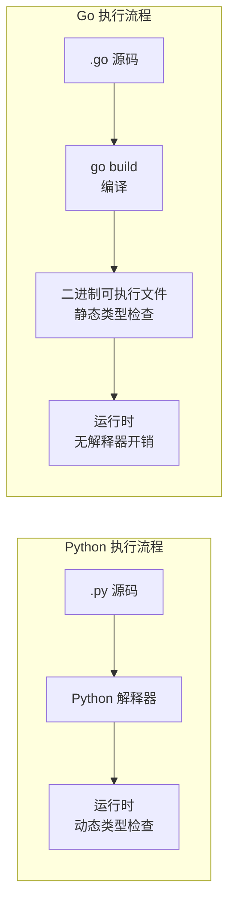

## 前置知识：为什么 Python 开发者学 Go 有优势

Python 是**解释型、动态类型**语言，Go 是**编译型、静态类型**语言。作为 Python 开发者，你已经具备编程基础概念（变量、控制流、函数、数据结构），Go 的学习核心是：

1. **理解编译型语言的工作流**：代码必须先编译成二进制，再运行
2. **适应静态类型的约束**：变量类型在编译时确定，不能随意改变
3. **掌握 Go 的极简哲学**：没有类、没有继承、没有异常——用更少的语言特性做更多事



> [!important] 核心认知
> - Python 是**解释型**：直接运行 `.py` 文件，开发快但运行慢
> - Go 是**编译型**：先 `go build` 编译成二进制，再运行，开发稍慢但运行快
> - 对于 Python 开发者，`go run main.go` 是最接近 `python main.py` 的体验（编译+运行一步完成）

---

## 1. 环境搭建：从 Python 生态映射到 Go 生态

### 1.1 工具链对比

| Python 工具 | Go 等价 | 差异说明 |
|------------|---------|---------|
| `python` / `python3` | `go` | Python 解释器 vs Go 编译器+工具链 |
| `pip install` | `go get` / `go install` | Go 命令集成依赖管理和安装 |
| `venv` / `virtualenv` | 无（`go mod` 项目级隔离） | Go 模块天然隔离，无需虚拟环境 |
| `pyproject.toml` | `go.mod` | 模块定义文件 |
| `poetry.lock` / `Pipfile.lock` | `go.sum` | 依赖校验文件，确保可重复构建 |
| `pytest` | `go test`（标准库） | Go 内置测试框架，无需第三方 |
| `black` / `ruff` | `gofmt` / `goimports` | 官方格式化工具 |
| `flake8` / `mypy` | `go vet` + `golangci-lint` | 静态分析和类型检查 |
| `python script.py` | `go run main.go` | 直接运行 |
| `python setup.py install` | `go install` | 安装可执行文件 |

### 1.2 安装 Go

```bash
# ===== Windows（推荐 winget）=====
winget install GoLang.Go

# ===== macOS（Homebrew）=====
brew install go

# ===== Linux（官方二进制包）=====
sudo tar -C /usr/local -xzf go1.22.linux-amd64.tar.gz
export PATH=$PATH:/usr/local/go/bin

# ===== 验证安装 =====
go version  # 应输出 go version go1.22.x ...
```

> [!tip] Go 的安装比 Python 更简单
> Go 是单个二进制文件分发，没有 Python 那种"系统 Python vs 用户 Python"、"PATH 冲突"、"多版本共存"的问题。安装后直接可用。

### 1.3 初始化项目（对比 Python）

```bash
# ===== Python 做法 =====
mkdir my-project && cd my-project
python -m venv .venv
source .venv/bin/activate    # Linux/Mac
# .venv\Scripts\activate     # Windows
pip install requests flask
# 创建 pyproject.toml 或 requirements.txt

# ===== Go 做法 =====
mkdir my-go-project && cd my-go-project
go mod init github.com/yourname/my-go-project  # 生成 go.mod（等价 pyproject.toml）
go get github.com/gin-gonic/gin               # 安装依赖（等价 pip install）
# 无需虚拟环境！go mod 自动隔离
```

### 1.4 动手实践：从零初始化 Go 项目

> [!exercise] 实践练习：初始化你的第一个 Go 项目
>
> **目标**：从零创建一个 Go 项目，理解 `go.mod` 的作用，对比 Python 的项目初始化。
>
> **步骤**：
> ```bash
> # 1. 创建项目目录
> mkdir hello-go && cd hello-go
>
> # 2. 初始化 Go 模块（生成 go.mod）
> # 对比 Python: python -m venv .venv + 创建 pyproject.toml
> go mod init github.com/yourname/hello-go
> # 输出: go: creating new go.mod: module github.com/yourname/hello-go
> # 查看 go.mod 内容
> cat go.mod
> # module github.com/yourname/hello-go
> # go 1.22
>
> # 3. 创建 main.go（对比 Python 的 main.py）
> # 在目录下创建 main.go 文件，写入以下代码：
> ```
>
> ```go
> // main.go —— 你的第一个 Go 程序
> package main  // 声明为可执行程序的入口包
>
> import "fmt"  // 导入标准库（对比 Python 的 import）
>
> // main 函数是程序入口（对比 Python 的 if __name__ == "__main__":）
> func main() {
>     fmt.Println("Hello, Go!")  // 对比 Python 的 print("Hello, Go!")
> }
> ```
>
> ```bash
> # 4. 运行程序
> go run main.go
> # 输出: Hello, Go!
>
> # 5. 编译成二进制（对比 Python：无等价物，Python 无法编译成独立二进制）
> go build -o hello-go.exe main.go  # Windows
> go build -o hello-go main.go      # Linux/Mac
> ./hello-go.exe  # 运行二进制（不需要 Go 环境！）
>
> # 6. 添加第三方依赖（对比 pip install）
> go get github.com/fatih/color  # 彩色输出库
> # 查看 go.mod 变化：新增 require 块
> cat go.mod
> ```
>
> **检查清单**：
> - [ ] `go.mod` 文件已生成
> - [ ] `go run main.go` 输出 "Hello, Go!"
> - [ ] `go build` 生成了二进制文件
> - [ ] 能解释 `go.mod` 的作用（对比 `pyproject.toml`）
> - [ ] 能解释为什么 Go 不需要虚拟环境

### 1.5 go.mod 最小配置（对比 pyproject.toml）

```go
// go.mod
module github.com/yourname/my-go-project

go 1.22

require (
    github.com/gin-gonic/gin v1.9.1
)
```

```toml
# pyproject.toml（对比）
[project]
name = "my-python-project"
version = "0.1.0"
dependencies = [
    "requests>=2.31.0",
    "flask>=3.0.0",
]
```

| 对比维度 | Python pyproject.toml | Go go.mod |
|---------|----------------------|-----------|
| 项目名 | `name = "..."` | `module github.com/...` |
| 依赖声明 | `dependencies = [...]` | `require (...)` |
| 版本锁定 | 需额外 `pip freeze` | 自动生成 `go.sum` |
| 虚拟环境 | 需手动 `python -m venv` | 无需，天然隔离 |

---

## 2. Hello World：第一个 Go 程序

### 2.1 Python vs Go

```python
# Python: hello.py
print("Hello, World!")
# 运行：python hello.py
```

```go
// Go: main.go
package main  // 每个 Go 文件第一行必须声明所属包

import "fmt"  // 导入标准库 fmt 包（格式化输出）

func main() {  // main 包的入口函数
    fmt.Println("Hello, World!")
}
// 运行：go run main.go（编译+运行一步完成，等价 python hello.py）
// 或：go build main.go && ./main（先编译成二进制，再运行）
```

> [!important] Go 的 package 和 import
> - 每个 Go 文件必须以 `package xxx` 开头，声明所属包
> - `package main` 是特殊包，表示可执行程序（必须有 `func main()`）
> - `import "fmt"` 导入标准库的 `fmt` 包（等价 Python 的 `import`）

### 2.2 变量声明

```python
# Python: 动态类型，无需声明
name = "Alice"
age = 30
is_active = True
name = 123  # ✅ 合法，name 从 str 变成 int
```

```go
// Go: 静态类型，必须声明（但可以用 := 简写）
package main

import "fmt"

func main() {
    // 方式 1：显式声明类型
    var name string = "Alice"
    var age int = 30
    var isActive bool = true

    // 方式 2：类型推断（推荐，只能在函数内使用）
    name2 := "Bob"
    age2 := 25
    active2 := false

    // ❌ 错误：不能改变变量类型
    // name = 123  // 编译错误！

    fmt.Println(name, age, isActive, name2, age2, active2)
}
```

| 对比维度 | Python | Go |
|---------|--------|-----|
| 变量声明 | 直接赋值 `x = 1` | `var x int = 1` 或 `x := 1` |
| 类型推断 | 运行时动态推断 | 编译时静态推断 |
| 类型变更 | ✅ 允许 | ❌ 禁止 |
| 常量 | 命名约定 `PI = 3.14` | `const Pi = 3.14`（关键字 `const`） |
| 多变量赋值 | `a, b = 1, 2` | `a, b := 1, 2` |

---

## 3. 基础语法对比：if / for / switch

### 3.1 if 语句

```python
# Python: if / elif / else
x = 10
if x > 10:
    print("大于 10")
elif x == 10:
    print("等于 10")
else:
    print("小于 10")

# Python: 三元表达式
result = "even" if x % 2 == 0 else "odd"
```

```go
// Go: if / else if / else（语法类似，但用花括号）
x := 10
if x > 10 {
    fmt.Println("大于 10")
} else if x == 10 {
    fmt.Println("等于 10")
} else {
    fmt.Println("小于 10")
}

// Go 无三元表达式，用 if-else 替代
var result string
if x%2 == 0 {
    result = "even"
} else {
    result = "odd"
}

// Go 的 if 支持初始化语句（Python 无此特性）
if y := x * 2; y > 20 {  // y 的作用域仅限 if 块内
    fmt.Println("y 大于 20")
}
```

> [!tip] Go 的 if 初始化语句
> Go 的 `if` 支持在条件前执行一个语句：`if init; condition { ... }`。这是 Python 没有的特性，常用于错误处理：`if err := doSomething(); err != nil { ... }`

### 3.2 for 循环

```python
# Python: for + while 两种循环
for i in range(5):
    print(i)

for item in ["a", "b", "c"]:
    print(item)

i = 0
while i < 5:
    print(i)
    i += 1
```

```go
// Go: 只有 for，通过不同语法模拟 while
// 1. 基础 for 循环（等价 Python for i in range(5)）
for i := 0; i < 5; i++ {
    fmt.Println(i)
}

// 2. 遍历 slice（等价 Python for item in list）
items := []string{"a", "b", "c"}
for _, item := range items {  // range 返回（索引, 值），_ 忽略索引
    fmt.Println(item)
}

// 3. 遍历 map（等价 Python for k, v in dict.items()）
m := map[string]int{"a": 1, "b": 2}
for key, value := range m {
    fmt.Printf("%s: %d\n", key, value)
}

// 4. while 风格（Go 用 for 模拟 while）
i := 0
for i < 5 {
    fmt.Println(i)
    i++
}

// 5. 无限循环（等价 Python while True）
for {
    break  // 需要 break 或 return 退出
}
```

> [!warning] Go 的 for range 返回索引和值
> Python 的 `for item in list` 只返回值，Go 的 `for _, item := range slice` 返回**索引和值**。如果不需要索引，用 `_` 忽略。这是 Python 开发者最容易忽略的细节。

### 3.3 switch 语句

```python
# Python: 3.10+ 的 match/case（类似 switch）
match x:
    case 1:
        print("one")
    case 2:
        print("two")
    case _:
        print("other")
```

```go
// Go: switch（更强大，支持多值、无条件、fallthrough）
// 基础 switch（默认自动 break，无需显式写）
switch x {
case 1:
    fmt.Println("one")
case 2:
    fmt.Println("two")
default:
    fmt.Println("other")
}

// 多值 case
switch x {
case 1, 2, 3:
    fmt.Println("small")
case 4, 5, 6:
    fmt.Println("medium")
}

// 无条件 switch（等价 if-else 链）
switch {
case x < 0:
    fmt.Println("negative")
case x == 0:
    fmt.Println("zero")
case x > 0:
    fmt.Println("positive")
}

// fallthrough（强制执行下一个 case，慎用）
switch x {
case 2:
    fmt.Println("two")
    fallthrough  // 即使 x != 3，也会执行下一行
case 3:
    fmt.Println("three")
}
```

| 对比维度 | Python match/case | Go switch |
|---------|-------------------|-----------|
| 自动 break | ✅ case 自动终止，无需 break | ✅ case 自动终止，无需 break；差异是 Go 另有 `fallthrough` 关键字 |
| 多值 case | `case 1 \| 2:` | `case 1, 2:` |
| 无条件 switch | 不支持 | ✅ 支持（等价 if-else 链） |
| fallthrough | 不支持 | ✅ `fallthrough` 关键字 |

---

## 4. 包与可见性

### 4.1 Python 模块 vs Go 包

```python
# Python: utils.py
def helper():
    return "help"

# main.py
from utils import helper
print(helper())
```

```go
// utils/utils.go
package utils

func Helper() string {  // 首字母大写 = 公开（等价 Python 无下划线前缀）
    return "help"
}

func internal() string {  // 首字母小写 = 包私有（等价 Python 的 _前缀）
    return "private"
}

// main.go
package main

import (
    "fmt"
    "github.com/yourname/my-go-project/utils"
)

func main() {
    fmt.Println(utils.Helper())  // ✅ 可访问
    // fmt.Println(utils.internal())  // ❌ 编译错误：不可访问
}
```

| 对比点 | Python | Go |
|--------|--------|----|
| 可见性 | `_private` 约定 | 首字母大写 = 公开，小写 = 包私有 |
| 导入 | `from module import func` | `import "path/to/package"` |
| 包名 | 通常与目录名一致 | 必须与文件第一行的 `package` 一致 |

### 4.2 常量与枚举

```python
# Python 常量约定（无真正常量）
MAX_SIZE = 100

# Python 枚举
from enum import Enum
class Color(Enum):
    RED = 1
    GREEN = 2
    BLUE = 3
```

```go
// Go 常量与 iota 枚举
const MaxSize = 100  // 编译期常量，不可修改

// iota 枚举：从 0 开始，每行自增
const (
    Red = iota    // 0
    Green         // 1（iota 自动继承）
    Blue          // 2
)
```

---

## 常见易错点

> [!warning] **易错 1：忘记 `package main` 或 `func main()`**
> Go 要求每个可执行程序必须有 `package main` 和 `func main()`。Python 没有这个约束——任意 `.py` 文件都可以直接运行。

> [!warning] **易错 2：在函数外用 `:=`**
> ```go
> // ❌ 编译错误：:= 只能在函数内使用
> x := 10
>
> // ✅ 函数外用 var
> var x = 10
> ```

> [!warning] **易错 3：for range 的索引和值**
> ```go
> // ❌ 只写一个变量，Go 认为它是索引
> for item := range items {
>     fmt.Println(item)  // 输出 0, 1, 2（不是 "a", "b", "c"）
> }
>
> // ✅ 用 _, item 忽略索引
> for _, item := range items {
>     fmt.Println(item)  // 输出 "a", "b", "c"
> }
> ```

> [!warning] **易错 4：switch 默认不 fallthrough**
> Go 的 switch 默认自动 break，Python 3.10+ 的 match/case 同样自动终止 case，两者都无需显式 break。只有需要强制穿透时才用 `fallthrough`。

> [!warning] **易错 5：未使用的变量和导入会编译报错**
> ```go
> // ❌ 编译错误：x declared but not used
> x := 10
>
> // ✅ 使用它或用 _ 忽略
> _ = x
> ```
> Go 编译器严格要求所有变量和导入必须被使用。Python 允许未使用的变量和导入。

> [!warning] **易错 6：字符串拼接不能直接 `+` 数字**
> ```go
> // ❌ 编译错误：cannot use age (type int) as type string
> msg := "Age: " + 30
>
> // ✅ 用 fmt.Sprintf 或 strconv.Itoa
> msg := fmt.Sprintf("Age: %d", 30)
> ```
> Go 是强类型语言，不会自动将 `int` 转成 `string`。Python 同样不会——`"Age: " + 30` 也会抛 `TypeError`（会隐式转换的是 JavaScript）。两种语言都需要显式转换：Go 用 `strconv.Itoa(30)` 或 `fmt.Sprintf`，Python 用 `str(30)` 或 f-string。

> [!warning] **易错 7：Go 没有 `while` 关键字**
> Python 有 `while`，Go 只有 `for`。用 `for condition { }` 模拟 `while`。

---

## 🧪 实践练习

### 练习 1：温度转换器

**目标**：编写 Go 程序，实现摄氏度和华氏度互转。

```go
package main

import "fmt"

// celsiusToFahrenheit 摄氏度转华氏度
// 公式：F = C * 9/5 + 32
func celsiusToFahrenheit(c float64) float64 {
    return c*9/5 + 32
}

// fahrenheitToCelsius 华氏度转摄氏度
// 公式：C = (F - 32) * 5/9
func fahrenheitToCelsius(f float64) float64 {
    return (f - 32) * 5 / 9
}

func main() {
    // 测试：25°C 应该约等于 77°F
    fmt.Printf("%.1f°C = %.1f°F\n", 25.0, celsiusToFahrenheit(25.0))
    // 测试：98.6°F 应该约等于 37.0°C
    fmt.Printf("%.1f°F = %.1f°C\n", 98.6, fahrenheitToCelsius(98.6))
}
```

**注释**：这个练习帮助你熟悉 Go 的函数声明语法（`func 名称(参数 类型) 返回类型`）。注意 Go 的类型写在变量名后面，和 Python 的 `def f(c: float) -> float` 位置类似但无箭头。

---

### 练习 2：判断闰年

**目标**：编写函数判断闰年，打印 2000-2020 年的所有闰年。

```go
package main

import "fmt"

// isLeapYear 判断是否为闰年
// 规则：能被4整除但不能被100整除，或者能被400整除
func isLeapYear(year int) bool {
    return (year%4 == 0 && year%100 != 0) || (year%400 == 0)
}

func main() {
    // 遍历 2000-2020 年，打印闰年
    // Go 只有 for 循环，用 for i := start; i <= end; i++ 模拟 Python 的 range
    for year := 2000; year <= 2020; year++ {
        if isLeapYear(year) {
            fmt.Printf("%d 是闰年\n", year)
        }
    }
}
```

**注释**：这个练习对比了 Go 的 `for` 和 Python 的 `for i in range(2000, 2021)`。Go 1.22 起支持 `for i := range n`（迭代 0 到 n-1），但任意起点/终点仍需 `for i := start; i <= end; i++` 的 C 风格循环。注意 Go 的 `%` 取模运算和 Python 一致。

---

### 练习 3：命令行问候程序

**目标**：用 Go 实现接收名字参数并打印问候语的程序，对比 Python 的 `sys.argv`。

```go
package main

import (
    "fmt"
    "os"  // os.Args 等价 Python 的 sys.argv
)

func main() {
    // os.Args[0] 是程序名，os.Args[1:] 是传入的参数
    // 这和 Python 的 sys.argv 完全一致
    if len(os.Args) < 2 {
        fmt.Println("用法: go run main.go <名字>")
        return  // Go 的 return 等价 Python 的 return（退出函数）
    }
    name := os.Args[1]
    fmt.Printf("你好, %s!\n", name)
}
// 运行：go run main.go Alice → 输出：你好, Alice!
```

**注释**：`os.Args` 是一个字符串 slice（等价 Python 的 list），`os.Args[0]` 是程序本身路径，`os.Args[1]` 是第一个参数。`len(os.Args)` 获取参数个数，等价 Python 的 `len(sys.argv)`。注意 Go 用 `return` 退出函数，没有 Python 的 `sys.exit()` 那种直接退出进程的方式（需要 `os.Exit(1)`）。

---

## 🚨 Python 程序员写 Go 的常见错误

> [!warning] **坑 1：忘了 `go mod init` 就写代码**
> Python 不需要显式初始化项目就能跑 `.py` 文件。Go 必须先 `go mod init <module-path>` 生成 `go.mod`，否则 `go run` 会报错。养成习惯：新建目录后第一件事就是 `go mod init`。

> [!warning] **坑 2：变量声明后未使用会编译失败**
> Python 允许声明变量后不用。Go 的**编译器会报错**：`declared and not used`。未使用的变量用 `_` 忽略，或注释掉。

> [!warning] **坑 3：`:=` 只能在函数内使用**
> Python 的变量赋值在任何位置都一样。Go 的 `:=` 短声明只能在函数体内使用，包级别的变量必须用 `var`。

> [!warning] **坑 4：import 的包未使用也会编译失败**
> Python 允许 import 不用的模块。Go 的编译器**直接报错**：`imported and not used`。这强制代码整洁。

> [!warning] **坑 5：大括号必须在行尾**
> Python 用缩进表示代码块，不关心花括号。Go 的编译器**强制要求 `{` 在行尾**，不能换行放：
> ```go
> // ❌ 编译错误
> func main()
> {
>     fmt.Println("hello")
> }
> // ✅ 正确
> func main() {
>     fmt.Println("hello")
> }
> ```

---

## 🎯 本文学完自检

| 层次 | 检查项 |
|------|--------|
| 🟢 基础 | 能安装 Go，用 `go mod init` 初始化项目，用 `go run` 运行程序 |
| 🟢 基础 | 能写出 Go 的变量声明（`var` 和 `:=`），理解静态类型约束 |
| 🟢 基础 | 能写出 Go 的 `if`、`for`、`switch` 语句 |
| 🟡 进阶 | 能解释 `for range` 返回索引和值的语义，正确使用 `_` 忽略 |
| 🟡 进阶 | 能说明 Go 的 switch 与 Python match/case 的三个关键差异 |
| 🔴 挑战 | 能独立完成一个包含变量、控制流、多分支判断的 Go 程序，无编译错误 |

---

## 相关笔记

- ⬅️ 前置：[[00-Go 总览索引（Python 迁移版）]] — 路径总览和角色导航
- ➡️ 后续：[[02-变量与内置数据结构对比]] — slice、map、零值语义
- 🔗 关联：[[../TypeScriptLearningByPython/01-环境搭建与基础类型对比]] — 姐妹路径环境对比

---

*最后更新：2026-07-24*