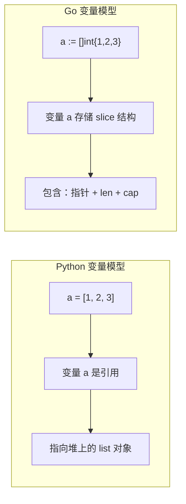

## 前置知识：从动态类型到静态类型

Python 的变量是**名字标签**，指向堆上的对象。Go 的变量是**命名的内存位置**，类型和大小在编译时就已确定。



> [!important] 核心认知
> - Go 是**值类型优先**的语言，默认拷贝整个值（包括 struct）
> - Go 的 `nil` 有类型，不能混用（`nil` for `int` 和 `nil` for `string` 不同）
> - Go 没有 Python 的 `None`，所有类型都有**零值**

---

## 1. 变量与零值

### 1.1 Python 的 None vs Go 的零值

```python
# Python: None 表示"没有值"
def get_name():
    return None  # 显式返回 None

name = get_name()
if name is None:
    print("没有名字")
```

```go
// Go: 所有类型都有零值，不需要 None
func getName() string {
    return ""  // 返回零值（空字符串）
}

name := getName()
if name == "" {  // 用零值判断"没有值"
    fmt.Println("没有名字")
}
```

Go 各类型零值速查：

| 类型 | 零值 | Python 等价 |
|------|------|------------|
| `int`, `float64` | `0`, `0.0` | 无（Python 无零值概念） |
| `bool` | `false` | 无 |
| `string` | `""` | `None` 或 `""` |
| 指针 `*T` | `nil` | `None` |
| slice `[]T` | `nil` | `None` |
| map `map[K]V` | `nil` | `None` |
| channel | `nil` | 无 |
| interface | `nil` | `None` |
| struct | 各字段零值 | 无（Python 的对象无零值） |

### 1.2 值类型 vs 引用类型

```python
# Python: 变量是引用
a = [1, 2, 3]
b = a        # b 和 a 指向同一个 list
b.append(4)
print(a)     # [1, 2, 3, 4]  ← a 也变了！
```

```go
// Go: slice 是引用类型，但机制更微妙
a := []int{1, 2, 3}
b := a                      // b 拷贝了 slice 结构（指针+len+cap）
b = append(b, 4)           // append 可能分配新底层数组
fmt.Println(a)              // [1 2 3]  ← a 可能不变
fmt.Println(b)              // [1 2 3 4]
```

> [!warning] append 的陷阱
> `append` 可能返回新的底层数组，所以通常要 `a = append(a, x)`。如果容量足够，`b := a; append(b, x)` 可能影响 `a`。这是 Python 开发者最容易踩的坑。

---

## 2. Array 与 Slice

### 2.1 Python list vs Go array/slice

```python
# Python list：动态长度
numbers = [1, 2, 3]
numbers.append(4)
numbers[0] = 10
```

```go
// Go array：固定长度（很少直接使用）
var arr [3]int = [3]int{1, 2, 3}

// Go slice：动态长度（更接近 Python list，日常开发用这个）
numbers := []int{1, 2, 3}
numbers = append(numbers, 4)  // 追加元素
numbers[0] = 10               // 修改元素
```

| 特性 | Python list | Go array | Go slice |
|------|------------|----------|----------|
| 长度 | 动态 | 固定 | 动态 |
| 类型声明 | `list[int]` | `[5]int` | `[]int` |
| 追加 | `append()` | 不可 | `append()` |
| 底层 | 动态数组 | 连续内存 | 描述符（指针+len+cap） |
| 值语义 | 引用 | 值（拷贝） | 引用（共享底层数组） |

### 2.2 Slice 操作详解

```go
package main

import "fmt"

func main() {
    // 创建 slice
    s := []int{1, 2, 3, 4, 5}

    // 切片（共享底层数组，类似 Python 的 list 切片）
    sub := s[1:3]  // [2, 3]
    fmt.Println(sub)

    // 长度和容量
    fmt.Println(len(s), cap(s))  // 5 5

    // 追加
    s = append(s, 6)
    fmt.Println(s)  // [1 2 3 4 5 6]

    // make 创建指定长度和容量的 slice
    nums := make([]int, 3, 10)  // len=3, cap=10
    fmt.Println(nums)  // [0 0 0]
}
```

### 2.3 切片共享底层数组

```go
package main

import "fmt"

func main() {
    a := []int{1, 2, 3, 4, 5}
    b := a[1:3]  // [2, 3]，b 和 a 共享底层数组
    b[0] = 100   // 修改 b 会影响 a

    fmt.Println(a)  // [1 100 3 4 5]  ← a[1] 变成了 100
    fmt.Println(b)  // [100 3]
}
```

> [!warning] Python 的切片创建副本，Go 的切片共享底层数组
> Python `b = a[1:3]` 创建新 list，修改 `b` 不影响 `a`。Go `b := a[1:3]` 共享底层数组，修改 `b` 会影响 `a`。如果需要独立副本，用 `b := make([]int, len(a[1:3])); copy(b, a[1:3])`。

---

## 3. Map

### 3.1 Python dict vs Go map

```python
# Python dict
scores = {"Alice": 90, "Bob": 85}
print(scores["Alice"])      # 90

# 安全获取（不存在时返回默认值）
print(scores.get("Charlie", 0))  # 0
```

```go
// Go map
scores := map[string]int{
    "Alice": 90,
    "Bob":   85,
}

// 直接访问
fmt.Println(scores["Alice"])  // 90

// 安全访问：使用 ok 模式（Go 特色）
if score, ok := scores["Charlie"]; ok {
    fmt.Println("找到:", score)
} else {
    fmt.Println("Charlie 不存在，默认值:", scores["Charlie"])  // 0
}
```

| 特性 | Python dict | Go map |
|------|------------|--------|
| 初始化 | `{}` | `map[K]V{}` 或 `make(map[K]V)` |
| 访问不存在 key | 抛出 `KeyError` | 返回零值（不报错） |
| 安全访问 | `.get(key, default)` | `v, ok := m[key]`（ok 模式） |
| 遍历顺序 | Python 3.7+ 有序 | **随机顺序** |

### 3.2 Map 增删改查

```go
package main

import "fmt"

func main() {
    m := make(map[string]int)

    // 增
    m["apple"] = 5

    // 改
    m["apple"] = 10

    // 查（ok 模式）
    if count, ok := m["apple"]; ok {
        fmt.Println("apple:", count)  // apple: 10
    }

    // 删
    delete(m, "apple")

    // 遍历（顺序随机！每次运行可能不同）
    m["banana"] = 3
    m["cherry"] = 7
    for k, v := range m {
        fmt.Printf("%s: %d\n", k, v)
    }
}
```

---

## 4. 字符串

### 4.1 Python str vs Go string

```python
# Python: 字符串是 Unicode 字符序列
s = "你好"
print(len(s))  # 2（字符数）
print(s[0])    # '你'（一个字符）

# 字符串不可变
# s[0] = 'a'  # ❌ TypeError
```

```go
// Go: 字符串是 UTF-8 字节序列
s := "你好"
fmt.Println(len(s))  // 6（字节数，不是字符数！）

// 获取字符数需要用 utf8 包
fmt.Println(utf8.RuneCountInString(s))  // 2（字符数）

// 索引访问的是字节，不是字符
fmt.Println(s[0])  // 228（'你' 的 UTF-8 第一字节）

// 遍历字符（用 range）
for i, r := range s {
    fmt.Printf("%d: %c\n", i, r)  // 0: 你, 3: 好
}
```

| 特性 | Python str | Go string |
|------|-----------|-----------|
| 编码 | Unicode | UTF-8 |
| 索引 | 按字符 | 按字节 |
| `len()` | 字符数 | 字节数 |
| 不可变 | 是 | 是 |
| 字符类型 | `str`（元素仍是 str） | `rune`（int32 别名） |

### 4.2 string 和 []byte 转换

```go
// string → []byte
s := "hello"
b := []byte(s)
fmt.Println(b)  // [104 101 108 108 111]

// []byte → string
s2 := string(b)
fmt.Println(s2)  // hello

// 注意：每次转换都会拷贝数据，有性能开销
// 高性能场景用 unsafe 或 strings.Builder
```

---

## 5. 综合对比表

| 特性 | Python | Go |
|------|--------|----|
| 变量模型 | 名字绑定到对象 | 命名的内存位置 |
| 空值 | `None` | `nil`（按类型区分） |
| 零值 | 无统一概念 | 所有类型都有零值 |
| 动态数组 | `list` | `slice` |
| 固定数组 | 无 | `array`（`[N]T`） |
| 字典 | `dict` | `map[K]V` |
| 集合 | `set` | `map[T]struct{}` |
| 字符串长度 | 字符数 | 字节数 |
| 字符类型 | `str` | `rune` / `byte` |
| 切片 | 创建副本 | 共享底层数组 |

---

## 常见易错点

> [!warning] **易错 1：slice 共享底层数组导致意外修改**
> ```go
> a := []int{1, 2, 3, 4, 5}
> b := a[:3]
> b[0] = 100
> fmt.Println(a)  // [100 2 3 4 5]  ← a 也被修改了
> ```
> Python 的切片 `b = a[:3]` 创建副本，Go 的切片共享底层数组。

> [!warning] **易错 2：append 后需要重新赋值**
> ```go
> // ❌ a 没有变化
> append(a, 4)
>
> // ✅ 必须重新赋值
> a = append(a, 4)
> ```

> [!warning] **易错 3：中文字符串的 len 不是字符数**
> ```go
> s := "你好"
> len(s)  // 6，不是 2
> // ✅ 用 utf8.RuneCountInString(s) 获取字符数
> ```

> [!warning] **易错 4：map 不能直接比较**
> ```go
> // ❌ 编译错误
> if m1 == m2 {}
>
> // ✅ 手动比较键值对，或用 reflect.DeepEqual
> ```

> [!warning] **易错 5：map 的零值访问返回零值，不报错**
> ```go
> m := map[string]int{"Alice": 0}
> v := m["Bob"]  // v == 0，但 Bob 不存在
> // ✅ 用 v, ok := m["Bob"] 区分"值为0"和"不存在"
> ```

> [!warning] **易错 6：nil slice 可以 append，nil map 不行**
> ```go
> var s []int
> s = append(s, 1)  // ✅ 可以
>
> var m map[string]int
> m["a"] = 1  // ❌ panic: assignment to entry in nil map
> // ✅ 必须先 make
> m = make(map[string]int)
> m["a"] = 1
> ```

> [!warning] **易错 7：Go 没有 Python 的推导式**
> ```python
> # Python
> squares = [x**2 for x in range(10)]
> evens = [x for x in range(20) if x % 2 == 0]
> ```
> ```go
> // Go 必须用 for 循环 + append
> var squares []int
> for i := 0; i < 10; i++ {
>     squares = append(squares, i*i)
> }
> ```

---

## 🧪 实践练习

### 练习 1：Slice 去重

**目标**：实现一个函数，对 `[]int` 去重并保持原始顺序。

```go
package main

import "fmt"

// unique 对 slice 去重并保持原始顺序
// 思路：用 map 记录已见过的值，只追加未见过的
func unique(nums []int) []int {
    seen := make(map[int]bool)  // 用 map 模拟 set
    result := make([]int, 0)     // 初始化空 slice

    for _, n := range nums {
        if !seen[n] {  // 如果之前没见过这个值
            seen[n] = true
            result = append(result, n)
        }
    }
    return result
}

func main() {
    nums := []int{1, 2, 2, 3, 4, 4, 5}
    fmt.Println(unique(nums))  // [1 2 3 4 5]
}
```

**注释**：Python 中你可能用 `list(set(nums))` 或 `dict.fromkeys()` 一行去重，但 Go 没有内置 set，需要用 `map[int]bool` 模拟。注意 `make([]int, 0)` 创建空 slice，第二个参数 0 表示初始长度为 0。

---

### 练习 2：词频统计

**目标**：统计文本中每个单词出现次数，打印 top 3。

```go
package main

import (
    "fmt"
    "sort"
    "strings"
)

func main() {
    text := "go go python python go go rust"

    // strings.Fields 按空白分割字符串，等价 Python 的 text.split()
    words := strings.Fields(text)

    // 统计词频
    freq := make(map[string]int)
    for _, word := range words {
        freq[word]++  // Go 的 map 零值是 0，直接 ++ 即可（Python 需用 defaultdict）
    }

    // 排序输出 top 3
    // Go 的 map 是无序的，需要转成 slice 再排序
    type pair struct {
        word  string
        count int
    }
    var pairs []pair
    for w, c := range freq {
        pairs = append(pairs, pair{w, c})
    }

    // sort.Slice 自定义排序（等价 Python 的 sorted(key=lambda)）
    sort.Slice(pairs, func(i, j int) bool {
        return pairs[i].count > pairs[j].count  // 降序
    })

    // 打印 top 3
    limit := 3
    if len(pairs) < limit {
        limit = len(pairs)
    }
    for _, p := range pairs[:limit] {
        fmt.Printf("%s: %d\n", p.word, p.count)
    }
}
// 输出：
// go: 4
// python: 2
// rust: 1
```

**注释**：Python 中你会用 `collections.Counter(text.split()).most_common(3)` 一行搞定。Go 需要手动统计、转成 slice、自定义排序。注意 Go 的 `freq[word]++` 利用了零值特性：不存在的 key 返回 0，`0++` 变成 1。Python 需要先用 `defaultdict(int)` 或 `Counter`。

---

### 练习 3：实现 Set

**目标**：用 `map[T]struct{}` 实现一个字符串集合。

```go
package main

import "fmt"

// StringSet 用 map 模拟 set
// struct{} 不占内存，是 Go 中表示"只需要 key 不需要 value"的标准做法
type StringSet map[string]struct{}

// NewStringSet 创建空集合（工厂函数，等价 Python 的 set()）
func NewStringSet() StringSet {
    return make(map[string]struct{})
}

// Add 添加元素
func (s StringSet) Add(item string) {
    s[item] = struct{}{}  // struct{}{} 是空结构体值
}

// Remove 删除元素
func (s StringSet) Remove(item string) {
    delete(s, item)  // delete 是内置函数，等价 Python 的 del/set.discard
}

// Contains 判断元素是否存在
func (s StringSet) Contains(item string) bool {
    _, ok := s[item]  // ok 模式判断 key 是否存在
    return ok
}

// Size 返回集合大小
func (s StringSet) Size() int {
    return len(s)
}

func main() {
    set := NewStringSet()
    set.Add("go")
    set.Add("python")
    set.Add("go")  // 重复添加不会增加

    fmt.Println(set.Contains("go"))     // true
    fmt.Println(set.Contains("java"))   // false
    fmt.Println(set.Size())              // 2

    set.Remove("python")
    fmt.Println(set.Contains("python"))  // false
}
```

**注释**：Python 有内置 `set` 类型，Go 没有。标准做法是用 `map[T]struct{}` 模拟——`struct{}` 是空结构体，不占内存，比 `map[T]bool` 更省空间。注意 `struct{}{}` 这个语法：第一个 `{}` 是类型，第二个 `{}` 是值（空结构体的唯一实例）。

---

## 🚨 Python 程序员写 Go 的常见错误

> [!warning] **坑 1：向 nil map 赋值会 panic**
> Python 空字典可直接 `d["key"] = val`，Go 的 nil map **会 panic**。必须先 `make()`：
> ```go
> var m map[string]int  // nil map
> // m["a"] = 1  // panic: assignment to entry in nil map
> m = make(map[string]int)  // ✅ 先初始化
> m["a"] = 1
> ```

> [!warning] **坑 2：append 超容时创建新底层数组**
> Python list.append 始终原地修改。Go 的 `append` 超容量时分配新数组，原 slice 不变：
> ```go
> a := make([]int, 2, 2)  // len=2, cap=2
> b := append(a, 3)       // a 仍是 [0,0]，b 是 [0,0,3]（新数组）
> ```

> [!warning] **坑 3：len("中文") 返回字节数不是字符数**
> Python `len("中文")` == 2。Go `len("中文")` == 6（UTF-8 字节数）。用 `utf8.RuneCountInString("中文")` 获取字符数。

> [!warning] **坑 4：struct 赋值是值拷贝**
> Python 对象赋值是引用。Go 的 struct 赋值是**完整复制**，修改副本不影响原对象。要共享需用指针 `&`。

> [!warning] **坑 5：copy() 返回复制数量，不自动扩容**
> Go 的 `copy(dst, src)` 返回 min(len(dst), len(src))，不会自动扩容 dst slice。Python 无等价物。

---

## 🎯 本文学完自检

| 层次 | 检查项 |
|------|--------|
| 🟢 基础 | 能解释 Go 的零值概念，列举 5 种常见类型的零值 |
| 🟢 基础 | 能用 slice 和 map 完成增删改查 |
| 🟡 进阶 | 能解释 slice 的底层结构（指针+长度+容量），避免 append 陷阱 |
| 🟡 进阶 | 能正确处理中文字符串的长度和遍历 |
| 🔴 挑战 | 能对比 Python 引用语义和 Go 值语义，解释为什么 Go 默认拷贝 struct |

---

## 相关笔记

- ⬅️ 前置：[[01-环境搭建与基础语法对比]] — 环境、基本语法、函数
- ➡️ 后续：[[03-函数与结构体-从Python class到Go]] — struct、method、组合
- 🔗 关联：[[../TypeScriptLearningByPython/02-函数与面向对象对比]] — Python→TS OOP 差异

---

*最后更新：2026-07-24*