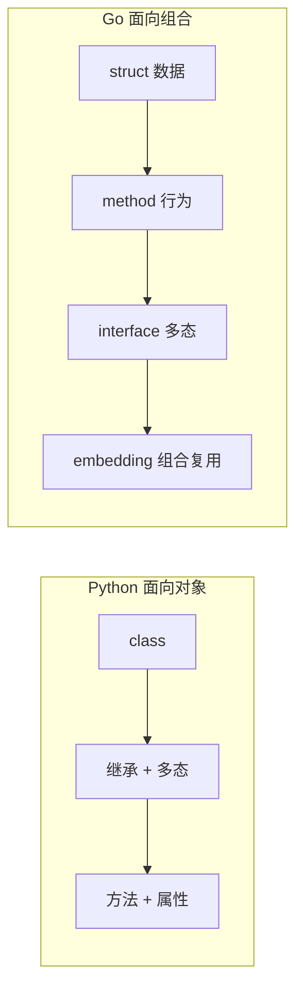

## 前置知识：Go 没有 class

在 Python 中，**class** 是面向对象的核心：属性、方法、继承、多态都围绕它展开。在 Go 中，对应的核心是 **struct + method + interface + composition**。



> [!important] 核心认知
> - Go 没有 `class` 关键字，用 `struct` 定义数据结构
> - Go 没有继承，用 **struct embedding**（嵌套组合）替代
> - Go 的方法定义在类型**外部**，通过 **receiver**（接收者）关联
> - Go 没有 `self`，用接收者变量名（通常缩写为类型首字母）

---

## 1. 函数进阶

### 1.1 多返回值

```python
# Python: 通常返回 tuple
def divide(a, b):
    if b == 0:
        return None, "cannot divide by zero"
    return a / b, None

result, error = divide(10, 0)
if error:
    print(error)
```

```go
// Go: 多返回值是核心设计模式
func divide(a, b float64) (float64, error) {
    if b == 0 {
        return 0, fmt.Errorf("cannot divide by zero")
    }
    return a / b, nil
}

result, err := divide(10, 0)
if err != nil {
    fmt.Println("错误:", err)
    return
}
fmt.Println(result)
```

> [!important] Go 的多返回值 vs Python 的 tuple
> Python 返回多个值本质是返回一个 tuple，需要解包。Go 的多返回值是语言级特性，每个返回值都有独立类型。Go 的 `error` 返回值是整个错误处理体系的基础。

### 1.2 命名返回值

```go
// countWords 返回单词数和错误（命名返回值）
// 命名返回值在函数开始时初始化为零值，return 时自动返回
func countWords(text string) (count int, err error) {
    if text == "" {
        err = fmt.Errorf("empty text")
        return  // 裸 return，自动返回 count 和 err 的当前值
    }
    count = len(strings.Fields(text))
    return
}

// 调用
c, err := countWords("hello world")
```

### 1.3 变长参数

```python
# Python: *args
def sum_all(*args):
    return sum(args)

print(sum_all(1, 2, 3, 4))  # 10
```

```go
// Go: 变长参数 ...T
func sumAll(nums ...int) int {
    total := 0
    for _, n := range nums {
        total += n
    }
    return total
}

fmt.Println(sumAll(1, 2, 3, 4))  // 10

// 展开 slice 传入（等价 Python 的 sum_all(*nums)）
nums := []int{1, 2, 3, 4}
fmt.Println(sumAll(nums...))  // 10
```

| 特性 | Python | Go |
|------|--------|----|
| 变长位置参数 | `*args` | `...T` |
| 变长关键字参数 | `**kwargs` | ❌ 不支持 |
| 默认参数 | `def f(x=1)` | ❌ 不支持 |
| 展开传入 | `f(*list)` | `f(slice...)` |

---

## 2. Struct：Go 的数据结构

### 2.1 Python dataclass vs Go struct

```python
# Python dataclass
from dataclasses import dataclass

@dataclass
class User:
    name: str
    age: int = 0  # 支持默认值

user = User(name="Alice", age=30)
print(user.name, user.age)
```

```go
// Go struct
type User struct {
    Name string  // 首字母大写 = 公开（等价 Python 无下划线前缀）
    Age  int     // 零值为 0，无需显式设置默认值
}

func main() {
    // 方式 1：按字段名赋值（推荐）
    u1 := User{
        Name: "Alice",
        Age:  30,
    }

    // 方式 2：按字段顺序赋值
    u2 := User{"Bob", 25}

    // 方式 3：取地址 & 返回指针（等价 new(User) 后赋值）
    u3 := &User{Name: "Charlie", Age: 35}

    fmt.Println(u1, u2, u3)
}
```

| 特性 | Python dataclass | Go struct |
|------|-----------------|-----------|
| 定义位置 | 类内部 | 包级类型 |
| 构造函数 | 自动生成 `__init__` | 手动写工厂函数 |
| 默认字段值 | `field(default=...)` | 用零值 |
| 公开/私有 | 命名约定 `_` | 首字母大小写 |
| 方法 | 类内部定义 | 类型外部定义 |

### 2.2 构造函数约定

Go 没有内置构造函数，用工厂函数命名约定 `NewXxx()` 替代：

```go
// User 结构体
type User struct {
    Name string
    Age  int
}

// NewUser 是构造函数约定（等价 Python 的 __init__）
// 返回指针避免大 struct 拷贝
func NewUser(name string, age int) *User {
    return &User{
        Name: name,
        Age:  age,
    }
}

// 使用
u := NewUser("Alice", 30)
fmt.Println(u.Name)  // Alice
```

> [!tip] Go 的构造函数约定
> Go 没有 `__init__`，社区约定用 `NewXxx()` 工厂函数。返回指针还是值取决于 struct 大小：小 struct 返回值，大 struct 返回指针。

---

## 3. Method：Go 的方法

### 3.1 值接收者 vs 指针接收者

```python
# Python: 方法定义在 class 内部，self 是隐式参数
class Counter:
    def __init__(self):
        self.value = 0

    def increment(self):  # self 是隐式参数
        self.value += 1

    def get_value(self):
        return self.value
```

```go
// Go: 方法定义在 struct 外部，用 receiver 关联
type Counter struct {
    value int  // 首字母小写 = 包私有
}

// 值接收者：只读方法（不修改原对象）
// (c Counter) 是接收者，c 类似 Python 的 self
func (c Counter) GetValue() int {
    return c.value
}

// 指针接收者：可写方法（会修改原对象）
// (c *Counter) 接收指针，修改的是原对象
func (c *Counter) Increment() {
    c.value++
}

func main() {
    c := &Counter{}    // 创建指针
    c.Increment()      // 调用指针接收者方法
    fmt.Println(c.GetValue())  // 1
}
```

| 接收者类型 | Python 等价 | 是否修改原对象 | 适用场景 |
|-----------|------------|------------|--------|
| 值接收者 `(c Counter)` | `def f(self)` | 否（拷贝） | 只读方法、小 struct |
| 指针接收者 `(c *Counter)` | `def f(self)`（引用语义） | 是 | 修改状态、大 struct |

> [!important] 接收者选择原则
> - 如果方法需要**修改**接收者的状态 → 用指针接收者
> - 如果 struct **较大**（拷贝开销大） → 用指针接收者
> - 如果**一致性**：一个方法用了指针接收者，建议所有方法都用指针接收者
> - Go 的方法接收者不像 Python 的 `self` 那样总是引用语义——值接收者会拷贝整个 struct

### 3.2 方法 vs 函数

```go
// 函数：独立定义，不属于任何类型
func add(a, b int) int {
    return a + b
}

// 方法：通过接收者关联到类型
type Calculator struct{}

func (calc Calculator) Add(a, b int) int {
    return a + b
}

// 调用
fmt.Println(add(1, 2))           // 函数调用
calc := Calculator{}
fmt.Println(calc.Add(1, 2))      // 方法调用
```

### 3.3 Getter / Setter 约定

```python
# Python: @property 装饰器
class Temperature:
    def __init__(self, celsius=0):
        self._celsius = celsius

    @property
    def fahrenheit(self):
        return self._celsius * 9/5 + 32

    @fahrenheit.setter
    def fahrenheit(self, f):
        self._celsius = (f - 32) * 5/9
```

```go
// Go: GetXxx / SetXxx 约定
type Temperature struct {
    celsius float64  // 小写 = 包私有
}

// Getter：GetXxx（Go 约定：如果字段名大写则不需要 Getter）
func (t Temperature) Fahrenheit() float64 {
    return t.celsius * 9/5 + 32
}

// Setter：SetXxx（指针接收者，因为要修改）
func (t *Temperature) SetFahrenheit(f float64) {
    t.celsius = (f - 32) * 5 / 9
}

// 使用
t := &Temperature{celsius: 25}
fmt.Println(t.Fahrenheit())  // 77
t.SetFahrenheit(100)
fmt.Println(t.celsius)  // 37.77...
```

> [!tip] Go 的 Getter/Setter 命名约定
> Go 不用 `get` 前缀（`GetFahrenheit`），直接用 `Fahrenheit()`。Setter 用 `SetXxx()`。这是 Go 社区的约定，和 Python 的 `@property` 哲学不同。

---

## 4. Struct Embedding：Go 的组合

### 4.1 Python 继承 vs Go 嵌套

```python
# Python: 继承
class Animal:
    def __init__(self, name):
        self.name = name

    def eat(self):
        print(f"{self.name} is eating")

class Dog(Animal):  # 继承 Animal
    def bark(self):
        print(f"{self.name} is barking")

dog = Dog("Rex")
dog.eat()   # 继承自 Animal
dog.bark()  # 自己的方法
```

```go
// Go: struct embedding（组合替代继承）
type Animal struct {
    Name string
}

func (a Animal) Eat() {
    fmt.Printf("%s is eating\n", a.Name)
}

// Dog 嵌套 Animal（注意：只有类型名，无字段名）
type Dog struct {
    Animal  // 匿名嵌入：Dog "继承"了 Animal 的字段和方法
    Breed string
}

func (d Dog) Bark() {
    fmt.Printf("%s is barking\n", d.Name)  // 直接访问 d.Name（提升自 Animal）
}

func main() {
    dog := Dog{
        Animal: Animal{Name: "Rex"},
        Breed:  "Labrador",
    }
    dog.Eat()   // 提升自 Animal（等价 dog.Animal.Eat()）
    dog.Bark()  // Dog 自己的方法
}
```

| 特性 | Python 继承 | Go Embedding |
|------|------------|---------------|
| 语法 | `class Dog(Animal)` | `Animal` 嵌入字段 |
| 方法提升 | 自动继承 | 自动提升（可直接调用） |
| 字段提升 | 自动继承 | 自动提升 |
| 多重继承 | `class C(A, B)` | 嵌入多个 struct |
| is-a 关系 | 是 | 否（has-a 关系） |
| 方法重写 | `override` | 同名方法覆盖嵌入方法 |

### 4.2 多重嵌入

```go
// Go: 多重嵌入（替代 Python 多重继承）
type Flyable struct{}

func (f Flyable) Fly() {
    fmt.Println("flying")
}

type Swimmable struct{}

func (s Swimmable) Swim() {
    fmt.Println("swimming")
}

// Duck 同时嵌入 Flyable 和 Swimmable
type Duck struct {
    Flyable
    Swimmable
    Name string
}

func main() {
    d := Duck{Name: "Donald"}
    d.Fly()   // 提升自 Flyable
    d.Swim()  // 提升自 Swimmable
}
```

> [!tip] Go 的嵌入 vs Python 的多重继承
> Go 的嵌入比 Python 多重继承更安全：没有 MRO（方法解析顺序）问题，没有钻石继承冲突。如果两个嵌入类型有同名方法，编译器会要求显式指定 `d.Flyable.Fly()`。

### 4.3 嵌入 interface

```go
// 嵌入 interface（实现装饰器/中间件模式）
type Logger interface {
    Log(msg string)
}

type ConsoleLogger struct{}

func (l ConsoleLogger) Log(msg string) {
    fmt.Println("[LOG]", msg)
}

// Service 嵌入 Logger interface
type Service struct {
    Logger  // 嵌入接口，Service 满足 Logger 接口
}

func (s Service) DoWork() {
    s.Log("starting work")  // 调用嵌入的 Logger 方法
    // ...
}

func main() {
    s := Service{Logger: ConsoleLogger{}}
    s.DoWork()  // [LOG] starting work
}
```

---

## 5. defer：Go 的资源清理

### 5.1 Python with vs Go defer

```python
# Python: with 上下文管理器
def read_file(path):
    with open(path, "r") as f:
        return f.read()
    # 离开 with 块时自动关闭文件
```

```go
// Go: defer 延迟执行
func readFile(path string) (string, error) {
    f, err := os.Open(path)
    if err != nil {
        return "", err
    }
    defer f.Close()  // 函数返回时自动关闭文件

    data, err := io.ReadAll(f)
    if err != nil {
        return "", err
    }
    return string(data), nil
}
```

> [!important] defer 的三个关键特性
> 1. **LIFO 顺序**：多个 defer 按"后进先出"执行
> 2. **参数立即求值**：defer 语句中的参数在 defer 时就求值，不是执行时
> 3. **用于资源清理**：文件关闭、锁释放、连接关闭

```go
// defer LIFO 示例
func main() {
    defer fmt.Println("1")  // 最后执行
    defer fmt.Println("2")  // 倒数第二执行
    defer fmt.Println("3")  // 最先执行
}
// 输出：3, 2, 1
```

---

## 6. 综合对比表

| 特性 | Python | Go |
|------|--------|----|
| 数据封装 | `class` | `struct` |
| 方法定义 | 类内部 `def method(self)` | 类型外部 `func (r Type) method()` |
| `self` | 隐式第一参数 | 显式接收者 `(r Type)` |
| 继承 | `class Child(Parent)` | struct embedding |
| 多重继承 | `class C(A, B)` | 多重嵌入 |
| 构造函数 | `__init__` | `NewXxx()` 约定 |
| 属性 | `@property` | `GetXxx()` / `SetXxx()` |
| 魔术方法 | `__str__`, `__eq__` 等 | 无（用普通方法替代） |
| 资源管理 | `with` 语句 | `defer` |
| 异常处理 | `try/except` | 多返回值 + error（下篇详讲） |

---

## 常见易错点

> [!warning] **易错 1：值接收者不修改原对象**
> ```go
> func (c Counter) Increment() {
>     c.value++  // 修改的是副本！原对象不变
> }
> // ✅ 指针接收者才能修改
> func (c *Counter) Increment() {
>     c.value++  // 修改原对象
> }
> ```

> [!warning] **易错 2：Go 没有 `__init__`，忘记写构造函数**
> Go 不会自动生成构造函数。需要手动写 `NewXxx()` 函数，否则只能用 `Type{字段: 值}` 字面量初始化。

> [!warning] **易错 3：嵌入类型的方法冲突**
> ```go
> type A struct{}
> func (A) Hello() {}
>
> type B struct{ A }
> func (B) Hello() {}  // B 的 Hello 覆盖了 A 的 Hello
>
> // 如果 C 同时嵌入 A 和 A（两个同名嵌入），编译错误
> ```

> [!warning] **易错 4：Go 没有 `__str__`，但可以用 Stringer 接口**
> ```go
> // 等价 Python 的 __str__
> func (u User) String() string {
>     return fmt.Sprintf("User{Name: %s, Age: %d}", u.Name, u.Age)
> }
> // 实现 fmt.Stringer 接口后，fmt.Println(u) 自动调用 String()
> ```

> [!warning] **易错 5：Go 没有运算符重载**
> Python 可以 `def __add__(self, other)`，Go 不行。必须用方法：`func (p Point) Add(other Point) Point`。

> [!warning] **易错 6：defer 参数立即求值**
> ```go
> i := 1
> defer fmt.Println(i)  // 输出 1，不是 2
> i = 2
> // ✅ 如果要输出 2，用闭包
> defer func() { fmt.Println(i) }()  // 输出 2
> ```

> [!warning] **易错 7：Go 方法不能继承"私有"字段**
> 如果嵌入的 struct 在另一个包中，小写字段无法直接访问。这是 Go 的包级可见性约束。

---

## 🧪 实践练习

### 练习 1：银行账户 struct

**目标**：用 Go struct + method 实现银行账户，支持存款、取款、查询余额。

```go
package main

import (
    "errors"
    "fmt"
)

// Account 银行账户结构体
type Account struct {
    owner   string  // 小写 = 包私有
    balance float64
}

// NewAccount 构造函数（等价 Python 的 __init__）
func NewAccount(owner string, initialDeposit float64) *Account {
    return &Account{
        owner:   owner,
        balance: initialDeposit,
    }
}

// Deposit 存款（指针接收者，因为要修改 balance）
func (a *Account) Deposit(amount float64) {
    if amount <= 0 {
        return  // Go 的错误处理在下篇详讲，这里先简单返回
    }
    a.balance += amount
}

// Withdraw 取款（返回 error 是 Go 的错误处理约定）
func (a *Account) Withdraw(amount float64) error {
    if amount <= 0 {
        return errors.New("取款金额必须大于 0")
    }
    if amount > a.balance {
        return errors.New("余额不足")
    }
    a.balance -= amount
    return nil  // nil 表示无错误
}

// Balance 查询余额（值接收者，只读方法）
func (a Account) Balance() float64 {
    return a.balance
}

// String 实现 fmt.Stringer 接口（等价 Python 的 __str__）
func (a Account) String() string {
    return fmt.Sprintf("Account{owner: %s, balance: %.2f}", a.owner, a.balance)
}

func main() {
    acc := NewAccount("Alice", 1000)
    fmt.Println(acc)  // Account{owner: Alice, balance: 1000.00}

    acc.Deposit(500)
    fmt.Println(acc.Balance())  // 1500

    err := acc.Withdraw(200)
    if err != nil {
        fmt.Println("取款失败:", err)
    }
    fmt.Println(acc.Balance())  // 1300

    err = acc.Withdraw(2000)
    if err != nil {
        fmt.Println("取款失败:", err)  // 余额不足
    }
}
```

**注释**：这个练习展示了 Go OOP 的核心模式：struct 定义数据、NewXxx 构造函数、指针接收者修改状态、值接收者只读方法、String() 实现 Stringer 接口。对比 Python 的 class，Go 把数据和方法的定义分开了，但通过 receiver 关联。注意 `Withdraw` 返回 `error`，这是 Go 错误处理的核心约定——下篇详讲。

---

### 练习 2：struct embedding 实现动物类层级

**目标**：用 Go 的 struct embedding 替代 Python 继承，实现 Animal → Dog → GuideDog 层级。

```go
package main

import "fmt"

// Animal 基础动物类
type Animal struct {
    Name string
    Age  int
}

// Eat 动物的通用方法
func (a Animal) Eat() {
    fmt.Printf("%s is eating\n", a.Name)
}

// Sleep 动物的通用方法
func (a Animal) Sleep() {
    fmt.Printf("%s is sleeping\n", a.Name)
}

// Dog 嵌入 Animal（替代 Python 的 class Dog(Animal)）
type Dog struct {
    Animal   // 匿名嵌入：Dog 获得 Animal 的字段和方法
    Breed string
}

// Bark Dog 特有的方法
func (d Dog) Bark() {
    fmt.Printf("%s (a %s) is barking: Woof!\n", d.Name, d.Breed)
}

// GuideDog 嵌入 Dog（多层组合）
type GuideDog struct {
    Dog          // 继续嵌入
    Handler string
}

// Guide 引导犬特有方法
func (g GuideDog) Guide() {
    fmt.Printf("%s is guiding %s\n", g.Name, g.Handler)
}

func main() {
    // 创建导盲犬
    g := GuideDog{
        Dog: Dog{
            Animal: Animal{Name: "Rex", Age: 3},
            Breed:  "Labrador",
        },
        Handler: "John",
    }

    // 调用提升自 Animal 的方法
    g.Eat()    // Rex is eating
    g.Sleep()  // Rex is sleeping

    // 调用提升自 Dog 的方法
    g.Bark()   // Rex (a Labrador) is barking: Woof!

    // 调用 GuideDog 自己的方法
    g.Guide()  // Rex is guiding John

    // 直接访问提升的字段
    fmt.Printf("%s is %d years old\n", g.Name, g.Age)
}
```

**注释**：这个练习对比了 Python 的多重继承 `class GuideDog(Dog)` 和 Go 的多层 embedding。Go 的 embedding 通过"字段提升"实现了类似继承的效果：`g.Name` 实际访问的是 `g.Dog.Animal.Name`。注意 Go 的 embedding 是组合而非继承——GuideDog "拥有"一个 Dog，而非 GuideDog "是一个" Dog。如果需要 is-a 关系，配合 interface（下篇详讲）。

---

### 练习 3：defer 实现资源清理

**目标**：用 defer 实现文件读取的安全资源管理，对比 Python 的 with 语句。

```go
package main

import (
    "fmt"
    "os"
)

// readFile 用 defer 确保文件关闭（等价 Python 的 with open()）
func readFile(path string) (string, error) {
    // 打开文件
    f, err := os.Open(path)
    if err != nil {
        return "", fmt.Errorf("无法打开文件: %w", err)
    }

    // defer 确保函数返回时关闭文件
    // 无论后续代码是否出错，f.Close() 都会执行
    // 等价 Python 的 with open(path) as f:
    defer f.Close()

    // 读取文件内容
    data := make([]byte, 1024)
    n, err := f.Read(data)
    if err != nil {
        return "", fmt.Errorf("读取失败: %w", err)
    }

    return string(data[:n]), nil
}

func main() {
    // 先创建一个测试文件
    os.WriteFile("test.txt", []byte("Hello from Go!"), 0644)

    // 读取文件
    content, err := readFile("test.txt")
    if err != nil {
        fmt.Println("错误:", err)
        return
    }
    fmt.Println("文件内容:", content)

    // 清理
    os.Remove("test.txt")
}
```

**注释**：Python 用 `with open(path) as f:` 确保资源释放，Go 用 `defer f.Close()`。defer 的优势是可以紧跟在资源打开之后立即声明，不需要像 Python 那样缩进到 with 块内。注意 defer 是 LIFO（后进先出）——如果打开了多个资源，最后 defer 的最先关闭。`%w` 是 Go 1.13+ 的错误包装语法，保留原始错误链（等价 Python 的 `raise ... from ...`）。

---

## 🚨 Python 程序员写 Go 的常见错误

> [!warning] **坑 1：混淆指针接收者和值接收者**
> Python 的 self 始终是引用。Go 中值接收者**复制 struct**，修改不影响原对象。需要修改状态时用指针接收者 `func (t *Task) Run()`。

> [!warning] **坑 2：struct embedding 不是继承**
> Python 子类可重写父类方法并调用 `super()`。Go 的嵌入类型方法提升是**组合不是继承**，嵌入类型无法访问外层 struct 的字段。

> [!warning] **坑 3：defer 参数立即求值**
> Python 的 finally 在退出时求值。Go 的 defer **参数在 defer 语句时立即求值**：
> ```go
> i := 1
> defer fmt.Println(i)  // 打印 1，不是 2
> i = 2
> ```

> [!warning] **坑 4：构造函数不返回 error 的陷阱**
> Go 约定 `NewXxx()` 返回 `*T`，但如果可能失败应返回 `(*T, error)`。忘记返回 error 会导致 nil 指针 panic。

> [!warning] **坑 5：nil 指针调用方法不 panic（如果方法不访问字段）**
> Python 的 `None.method()` 立即报错。Go 的 nil 指针调用方法，如果方法不访问字段则不会 panic——这是灵活性也是陷阱。

---

## 🎯 本文学完自检

| 层次 | 检查项 |
|------|--------|
| 🟢 基础 | 能定义 struct，用 `NewXxx()` 工厂函数创建实例 |
| 🟢 基础 | 能区分值接收者和指针接收者，知道何时用哪个 |
| 🟡 进阶 | 能用 struct embedding 替代 Python 继承，解释"组合优于继承" |
| 🟡 进阶 | 能用 defer 管理资源，理解 LIFO 顺序和参数立即求值 |
| 🔴 挑战 | 能将一个 Python class 完整迁移为 Go struct + method + constructor |

---

## 相关笔记

- ⬅️ 前置：[[01-环境搭建与基础语法对比]] — 环境和基础语法
- ⬅️ 前置：[[02-变量与内置数据结构对比]] — 变量、slice、map
- ➡️ 后续：[[04-接口与错误处理-Go的设计哲学]] — 接口、error、panic/recover
- 🔗 关联：[[../TypeScriptLearningByPython/02-函数与面向对象对比]] — Python→TS OOP 差异

---

*最后更新：2026-07-24*