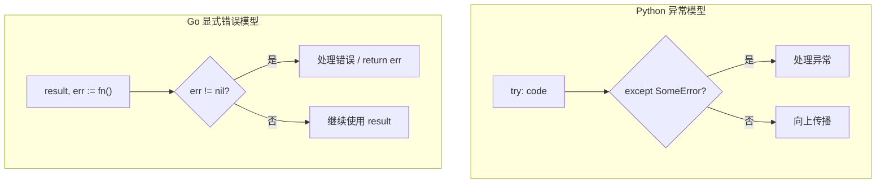

## 前置知识：Go 的错误处理哲学

Python 用**异常**（try/except）处理错误，Go 用**显式错误返回值**（error）。



> [!important] 核心认知
> - Go 的接口是**隐式实现**的：不需要 `implements` 关键字，只要类型拥有接口要求的方法，就自动实现了该接口
> - Go 的错误处理是**显式**的：每个可能出错的函数返回 `(result, error)`，调用方必须显式检查 `err != nil`
> - Go 的接口是**鸭子类型 + 编译时检查**：比 Python 的运行时鸭子检查更安全

---

## 1. 接口（Interface）

### 1.1 Python Protocol vs Go interface

```python
# Python: Protocol（PEP 544）或 ABC 定义接口
from typing import Protocol

class Writer(Protocol):
    def write(self, data: str) -> None: ...

class ConsoleWriter:
    def write(self, data: str) -> None:
        print(data)

# ConsoleWriter 满足 Writer 接口（运行时检查，mypy 静态检查）
```

```go
// Go: interface 定义行为契约
type Writer interface {
    Write(data []byte) (int, error)
}

// ConsoleWriter 不需要显式声明 implements Writer
// 只要拥有 Write 方法，就自动实现了 Writer 接口
type ConsoleWriter struct{}

func (c ConsoleWriter) Write(data []byte) (int, error) {
    n, err := fmt.Print(string(data))
    return n, err
}

// 使用：ConsoleWriter 可以直接赋值给 Writer 类型
var w Writer = ConsoleWriter{}
w.Write([]byte("Hello"))
```

### 1.2 隐式实现 vs 显式实现

| 特性 | Python (Protocol) | TypeScript (implements) | Go (隐式) |
|------|-------------------|------------------------|-----------|
| 声明方式 | `class X(Protocol)` | `class X implements Y` | 无需声明，方法匹配即可 |
| 检查时机 | 运行时 / mypy 静态 | 编译时 | 编译时 |
| 鸭子类型 | 运行时 | 否 | 编译时鸭子类型 |
| 灵活性 | 最高 | 中等 | 高 |

> [!important] Go 隐式接口的核心优势
> 1. **解耦**：实现者不需要知道接口的存在
> 2. **后向兼容**：可以事后为已有类型定义接口
> 3. **测试友好**：mock 实现超级简单

### 1.3 空接口 interface{}

```python
# Python: Any 类型，可以接受任何值
from typing import Any
def debug(value: Any) -> None:
    print(f"DEBUG: {value}")
```

```go
// Go: interface{} 或 any（Go 1.18+），可以接受任何值
func debug(value interface{}) {
    fmt.Printf("DEBUG: %v\n", value)
}

// Go 1.18+ any 是 interface{} 的别名
func debug2(value any) {
    fmt.Printf("DEBUG: %v\n", value)
}

// 使用时需要类型断言才能取回原始类型
func main() {
    var x interface{} = "hello"
    s, ok := x.(string)  // 类型断言
    if ok {
        fmt.Println(s)  // hello
    }
}
```

### 1.4 类型断言与类型 switch

```go
// 类型断言：x.(T)
func describe(i interface{}) {
    // 类型 switch（等价 Python 的 isinstance 检查）
    switch v := i.(type) {
    case string:
        fmt.Printf("string: %s\n", v)
    case int:
        fmt.Printf("int: %d\n", v)
    case bool:
        fmt.Printf("bool: %t\n", v)
    default:
        fmt.Printf("unknown type: %T\n", v)
    }
}

func main() {
    describe("hello")  // string: hello
    describe(42)        // int: 42
    describe(true)      // bool: true
    describe(3.14)      // unknown type: float64
}
```

### 1.5 常用标准库接口

```go
// io.Reader: 读取数据（Python 的 file.read()）
type Reader interface {
    Read(p []byte) (n int, err error)
}

// io.Writer: 写入数据（Python 的 file.write()）
type Writer interface {
    Write(p []byte) (n int, err error)
}

// fmt.Stringer: 字符串表示（Python 的 __str__）
type Stringer interface {
    String() string
}

// error: 错误接口（Python 的 Exception）
type error interface {
    Error() string
}
```

---

## 2. 错误处理

### 2.1 Python try/except vs Go error

```python
# Python: 异常处理
def divide(a, b):
    if b == 0:
        raise ValueError("cannot divide by zero")
    return a / b

def read_config(path):
    try:
        data = open(path).read()
        return json.loads(data)
    except FileNotFoundError:
        return {"default": True}
    except json.JSONDecodeError:
        return {"error": "invalid JSON"}
```

```go
// Go: 显式错误返回值
func divide(a, b float64) (float64, error) {
    if b == 0 {
        return 0, fmt.Errorf("cannot divide by zero")
    }
    return a / b, nil
}

func readConfig(path string) (map[string]interface{}, error) {
    data, err := os.ReadFile(path)
    if err != nil {
        return nil, fmt.Errorf("读取配置文件失败: %w", err)
    }

    var config map[string]interface{}
    if err := json.Unmarshal(data, &config); err != nil {
        return nil, fmt.Errorf("解析 JSON 失败: %w", err)
    }
    return config, nil
}
```

### 2.2 错误包装与解包

```go
import (
    "errors"
    "fmt"
)

// 创建错误
var ErrNotFound = errors.New("item not found")
var ErrPermission = errors.New("permission denied")

// 包装错误（Go 1.13+ %w）
func loadUser(id int) (string, error) {
    return "", fmt.Errorf("loadUser(%d): %w", id, ErrNotFound)
}

// 错误检查
func main() {
    _, err := loadUser(42)
    if err != nil {
        // errors.Is 检查错误链中是否包含特定错误
        if errors.Is(err, ErrNotFound) {
            fmt.Println("用户不存在")
        }
        // 查看原始错误
        fmt.Println(err)  // loadUser(42): item not found
    }
}
```

### 2.3 自定义错误类型

```go
// 自定义错误类型（等价 Python 的 class MyError(Exception)）
type ValidationError struct {
    Field string
    Value interface{}
    Reason string
}

// Error 实现 error 接口
func (e *ValidationError) Error() string {
    return fmt.Sprintf("validation error: field=%s value=%v reason=%s",
        e.Field, e.Value, e.Reason)
}

// 使用
func validate(age int) error {
    if age < 0 {
        return &ValidationError{
            Field:  "age",
            Value:  age,
            Reason: "must be non-negative",
        }
    }
    return nil
}
```

| 错误处理对比 | Python | Go |
|-------------|--------|----|
| 错误类型 | 异常类 `class MyError(Exception)` | 接口 `error` |
| 抛出错误 | `raise SomeError()` | `return ..., SomeError` |
| 捕获错误 | `try/except` | `if err != nil` |
| 错误包装 | `raise ... from ...` | `fmt.Errorf("...: %w", err)` |
| 错误检查 | `isinstance(e, SomeError)` | `errors.Is(err, ErrX)` |
| 匹配错误类型 | `except SomeError as e` | `errors.As(err, &target)` |

---

## 3. Panic 与 Recover

### 3.1 何时用 panic

```go
// panic 用于不可恢复的程序错误，不用于业务错误处理
// 等价 Python 的 SystemExit 或未捕获的异常

// ❌ 错误：用 panic 处理业务错误
func divide(a, b float64) float64 {
    if b == 0 {
        panic("cannot divide by zero")  // 不要这样做！
    }
    return a / b
}

// ✅ 正确：用 panic 处理不可恢复的程序错误
func mustCompileRegex(pattern string) *regexp.Regexp {
    re, err := regexp.Compile(pattern)
    if err != nil {
        panic(err)  // 正则解析失败是程序 bug，可以 panic
    }
    return re
}
```

### 3.2 recover 捕获 panic

```go
// recover 只在 defer 函数中有效
func safeCall() {
    defer func() {
        if r := recover(); r != nil {
            fmt.Println("Recovered from:", r)
        }
    }()
    panic("something went wrong")
    fmt.Println("This line never executes")
}

func main() {
    safeCall()
    fmt.Println("Program continues")  // 这一行会执行
}
```

> [!warning] 不要用 panic/recover 模拟 try/except
> Go 的 panic/recover 是用于处理不可恢复错误的，不是异常处理机制。业务错误始终用 `return error`。

---

## 4. 综合对比：Python try/except → Go error

```python
# Python: 分层异常处理
def process_order(order_id):
    try:
        order = load_order(order_id)
        validate(order)
        charge(order)
        ship(order)
    except OrderNotFoundError:
        return {"error": "order not found"}
    except ValidationError as e:
        return {"error": f"validation failed: {e}"}
    except PaymentError as e:
        return {"error": f"payment failed: {e}"}
    return {"success": True}
```

```go
// Go: 逐层错误检查
func processOrder(orderID int) (map[string]interface{}, error) {
    order, err := loadOrder(orderID)
    if err != nil {
        if errors.Is(err, ErrOrderNotFound) {
            return nil, fmt.Errorf("order not found: %w", err)
        }
        return nil, err
    }

    if err := validate(order); err != nil {
        return nil, fmt.Errorf("validation failed: %w", err)
    }

    if err := charge(order); err != nil {
        return nil, fmt.Errorf("payment failed: %w", err)
    }

    if err := ship(order); err != nil {
        return nil, fmt.Errorf("shipping failed: %w", err)
    }

    return map[string]interface{}{"success": true}, nil
}
```

---

## 常见易错点

> [!warning] **易错 1：忘记检查 error**
> ```go
> data, _ := os.ReadFile("config.json")  // ❌ 忽略 error！
> // ✅ 必须检查
> data, err := os.ReadFile("config.json")
> if err != nil { ... }
> ```

> [!warning] **易错 2：nil interface ≠ nil 具体类型**
> ```go
> var w io.Writer  // nil interface
> fmt.Println(w == nil)  // true
>
> var cw *ConsoleWriter = nil
> w = cw  // w 的 type 是 *ConsoleWriter，value 是 nil
> fmt.Println(w == nil)  // false！interface 有类型信息，!= nil
> ```

> [!warning] **易错 3：error 字符串不该大写开头**
> Go 约定错误字符串小写开头，因为错误通常被包装在其他字符串中：`"failed: " + err.Error()`。

> [!warning] **易错 4：errors.Is 检查的是值，不是类型**
> ```go
> var ErrNot = errors.New("not found")
> // ✅ 用 errors.Is 检查错误值
> errors.Is(err, ErrNot)
> // ✅ 用 errors.As 检查错误类型
> var ve *ValidationError
> errors.As(err, &ve)
> ```

> [!warning] **易错 5：空接口和类型断言忘记检查 ok**
> ```go
> var x interface{} = "hello"
> s := x.(string)  // ❌ 如果 x 不是 string，panic！
> s, ok := x.(string)  // ✅ 安全断言
> ```

> [!warning] **易错 6：Go 的 error 只是接口，不需要 panic**
> Python 开发者的习惯是在错误时抛出异常，Go 中错误是普通返回值。不要为了"像 Python 那样"而滥用 panic。

> [!warning] **易错 7：接口定义过大**
> Go 的接口应该小而精，1-3 个方法最佳。不要像 Java 那样定义大接口。标准库的 `io.Reader` 只有一个方法，`io.Writer` 也只有一个方法。

---

## 🧪 实践练习

### 练习 1：实现自定义错误处理

**目标**：用 Go 接口实现一个函数，处理多种错误类型。

```go
package main

import (
    "errors"
    "fmt"
)

// 定义错误哨兵值（Sentinel Error）
var (
    ErrDivisionByZero = errors.New("division by zero")
    ErrNegativeValue  = errors.New("negative value not allowed")
)

// validateDivide 验证除法参数
func validateDivide(a, b float64) error {
    if b == 0 {
        return ErrDivisionByZero
    }
    if a < 0 || b < 0 {
        return fmt.Errorf("validate: %w", ErrNegativeValue)
    }
    return nil
}

// safeDivide 安全除法（返回 error 而非 panic）
func safeDivide(a, b float64) (float64, error) {
    if err := validateDivide(a, b); err != nil {
        return 0, fmt.Errorf("safeDivide(%.1f, %.1f): %w", a, b, err)
    }
    return a / b, nil
}

func main() {
    // 测试 1：正常除法
    if result, err := safeDivide(10, 2); err != nil {
        fmt.Println("错误:", err)
    } else {
        fmt.Println("10/2 =", result)  // 10/2 = 5
    }

    // 测试 2：除零
    if _, err := safeDivide(5, 0); err != nil {
        if errors.Is(err, ErrDivisionByZero) {
            fmt.Println("不能除以零!")
        }
    }

    // 测试 3：负数
    if _, err := safeDivide(-1, 2); err != nil {
        if errors.Is(err, ErrNegativeValue) {
            fmt.Println("不能使用负数!")
        }
    }
}
```

**注释**：这个练习展示了 Go 错误处理的核心模式：错误哨兵值（`var ErrX = errors.New(...)`）、`errors.Is` 检查错误链、`fmt.Errorf` 包装错误。对比 Python 的 `try/except ValueError`，Go 的 `errors.Is(err, ErrDivisionByZero)` 在语义上等价，但更显式。

---

### 练习 2：接口实现日志系统

**目标**：用 Go 接口实现可切换的日志系统。

```go
package main

import (
    "fmt"
    "os"
    "time"
)

// Logger 接口定义（小而精，只有 1 个方法）
type Logger interface {
    Log(level, msg string)
}

// ConsoleLogger 控制台日志实现
type ConsoleLogger struct{}

func (l ConsoleLogger) Log(level, msg string) {
    fmt.Printf("[%s][%s] %s\n", time.Now().Format("15:04:05"), level, msg)
}

// FileLogger 文件日志实现
type FileLogger struct {
    file *os.File
}

func NewFileLogger(path string) (*FileLogger, error) {
    f, err := os.OpenFile(path, os.O_CREATE|os.O_APPEND|os.O_WRONLY, 0644)
    if err != nil {
        return nil, fmt.Errorf("创建日志文件失败: %w", err)
    }
    return &FileLogger{file: f}, nil
}

func (l *FileLogger) Log(level, msg string) {
    fmt.Fprintf(l.file, "[%s][%s] %s\n", time.Now().Format("15:04:05"), level, msg)
}

func (l *FileLogger) Close() error {
    return l.file.Close()
}

// App 使用 Logger 接口（不关心具体实现）
type App struct {
    logger Logger  // 接口类型，可以是任何 Logger 实现
}

func (a *App) Run() {
    a.logger.Log("INFO", "App started")
    a.logger.Log("WARN", "Low memory")
    a.logger.Log("ERROR", "Something went wrong")
}

func main() {
    // 使用控制台日志
    app1 := &App{logger: ConsoleLogger{}}
    app1.Run()

    // 使用文件日志
    fileLogger, err := NewFileLogger("app.log")
    if err != nil {
        fmt.Println("创建日志文件失败:", err)
        return
    }
    defer fileLogger.Close()

    app2 := &App{logger: fileLogger}
    app2.Run()

    fmt.Println("日志已写入 app.log")
}
```

**注释**：这个练习展示了 Go 的**隐式接口**优势：`ConsoleLogger` 和 `FileLogger` 都不需要声明 `implements Logger`，只要它们有 `Log(string, string)` 方法就自动实现了接口。`App` 依赖接口而非具体实现，可以轻松切换日志后端。这比 Python 需要显式导入 `from typing import Protocol` 更简洁。

---

### 练习 3：errors.Is 和 errors.As 实战

**目标**：实现错误类型判断系统。

```go
package main

import (
    "errors"
    "fmt"
)

// 自定义错误类型
type NetworkError struct {
    URL     string
    Message string
}

func (e *NetworkError) Error() string {
    return fmt.Sprintf("network error for %s: %s", e.URL, e.Message)
}

// 错误哨兵
var ErrTimeout = errors.New("timeout")

// 模拟网络请求
func fetch(url string) error {
    // 模拟超时
    if url == "timeout" {
        return fmt.Errorf("fetch(%s): %w", url, ErrTimeout)
    }
    // 模拟网络错误
    return &NetworkError{URL: url, Message: "connection refused"}
}

func main() {
    for _, url := range []string{"timeout", "https://example.com", "https://ok.com"} {
        err := fetch(url)
        if err == nil {
            fmt.Println(url, "成功")
            continue
        }

        // errors.Is：检查错误链中是否包含特定错误
        if errors.Is(err, ErrTimeout) {
            fmt.Println(url, "超时，重试...")
            continue
        }

        // errors.As：检查错误类型
        var ne *NetworkError
        if errors.As(err, &ne) {
            fmt.Printf("网络错误: URL=%s, 原因=%s\n", ne.URL, ne.Message)
            continue
        }

        fmt.Println("未知错误:", err)
    }
}
```

**注释**：`errors.Is` 检查错误链中是否包含特定的错误值（等价 Python 的 `except SpecificError`）。`errors.As` 提取特定类型的错误（等价 Python 的 `except NetworkError as e`）。Go 的 `%w` 格式动词创建错误链，`errors.Is` 和 `errors.As` 都会遍历整个错误链。

---

## 🚨 Python 程序员写 Go 的常见错误

> [!warning] **坑 1：nil interface 不等于持有 nil 值的 interface**
> Go 中 `var i interface{} = nil`（interface 本身为 nil）和 `var p *T = nil; var i interface{} = p`（interface 持有 nil 指针）**行为不同**——后者 `i != nil`！这是 Go 最经典的 bug。

> [!warning] **坑 2：隐式接口可能意外实现**
> Python 的 Protocol 需要显式声明。Go 的接口是隐式的——你的 struct 恰好有相同方法签名就算实现了接口，即使你没打算实现。

> [!warning] **坑 3：panic 不是 raise**
> Python 用 raise 抛出业务错误。Go 的 panic 是**致命错误**，正常业务错误用 `return error`。滥用 panic 会导致程序崩溃。

> [!warning] **坑 4：错误比较用 == 而非 errors.Is**
> Python 用 `except SpecificError` 捕获特定异常。Go 的错误可能被 `%w` 包装多层，用 `==` 比较会漏掉包装层。始终用 `errors.Is()` 遍历错误链。

> [!warning] **坑 5：忘记 %w 包装错误会丢失上下文**
> `fmt.Errorf("failed: %v", err)` 只打印错误信息，**不保留错误链**。用 `%w` 才能让 `errors.Is`/`errors.As` 遍历：`fmt.Errorf("failed: %w", err)`。

---

## 🎯 本文学完自检

| 层次 | 检查项 |
|------|--------|
| 🟢 基础 | 能理解 Go 的隐式接口实现，定义接口并用多个类型实现它 |
| 🟢 基础 | 能用 `if err != nil` 处理错误，理解 error 是接口 |
| 🟡 进阶 | 能用 `errors.Is` 和 `errors.As` 区分错误类型 |
| 🟡 进阶 | 能用 `fmt.Errorf("...: %w", err)` 包装错误 |
| 🔴 挑战 | 能对比 Python try/except 和 Go error 的设计哲学，解释为什么 Go 选择显式错误 |

---

## 相关笔记

- ⬅️ 前置：[[03-函数与结构体-从Python class到Go]] — struct 和 method
- ➡️ 后续：[[05-并发编程-Goroutine与Channel]] — Go 的并发模型
- ➡️ 后续：[[06-Python有Go无与Go有Python无]] — 双向特性对比
- 🔗 关联：[[../TypeScriptLearningByPython/04-异步编程与并发模型对比]] — Python→TS 异步差异

---

*最后更新：2026-07-24*