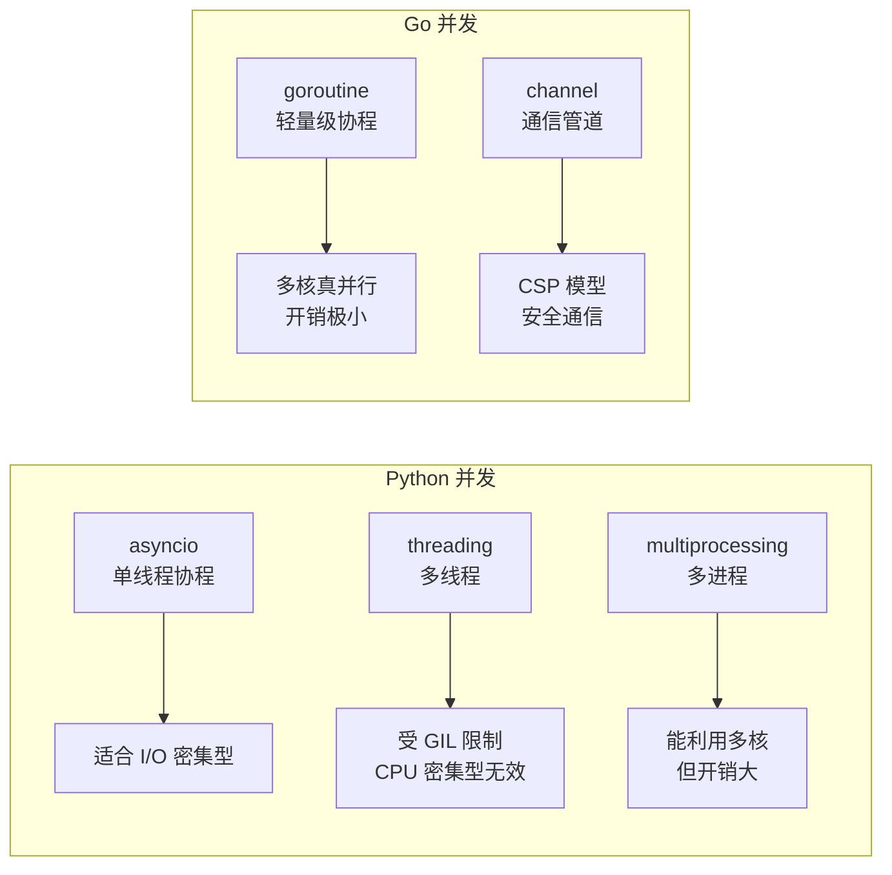
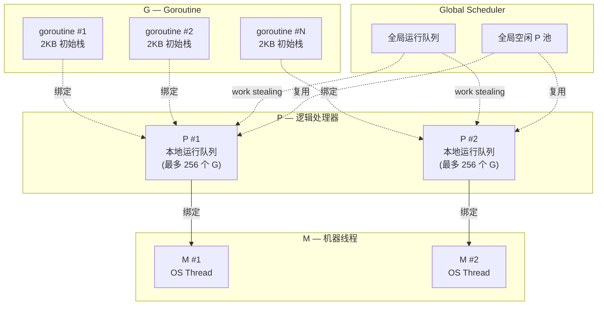

## 前置知识：Go 的并发是语言级的

Python 的并发受限于 GIL（全局解释器锁），无法真正并行。Go 的 goroutine 是**轻量级用户态线程**，由 Go 运行时调度，可以充分利用多核 CPU。



> [!important] 核心认知
> - Go 说 "Don't communicate by sharing memory; share memory by communicating"（不要通过共享内存来通信，而是通过通信来共享内存）
> - goroutine 是 Go 的"杀手级特性"，也是 Python 开发者最需要掌握的新能力
> - Python 的 `asyncio` 是单线程协作式调度，goroutine 是多核抢占式调度——完全不同

---

## 0. Go 的 GMP 调度模型图解



> [!tip] 对比 Python asyncio
> Python asyncio 是**单线程事件循环**——所有协程在一个线程上轮流执行，无法利用多核。Go 的 GMP 模型将 goroutine 分发到多个 M（OS 线程）上**真正并行**执行。P 是逻辑处理器，数量 = `GOMAXPROCS`（默认 = CPU 核心数）。当某个 P 的本地队列空了，会从全局队列或其他 P **偷取**（work stealing）goroutine。

---

## 1. Goroutine：轻量级协程

### 1.1 Python async/await vs Go goroutine

```python
# Python: asyncio 协程
import asyncio

async def fetch(url):
    print(f"fetching {url}")
    await asyncio.sleep(1)  # 模拟 I/O
    print(f"done {url}")

async def main():
    await asyncio.gather(
        fetch("url1"),
        fetch("url2"),
        fetch("url3"),
    )

asyncio.run(main())
```

```go
// Go: goroutine
package main

import (
    "fmt"
    "time"
)

func fetch(url string) {
    fmt.Println("fetching", url)
    time.Sleep(1 * time.Second)  // 模拟 I/O
    fmt.Println("done", url)
}

func main() {
    // go 关键字启动 goroutine
    go fetch("url1")
    go fetch("url2")
    go fetch("url3")

    // 等待 goroutine 完成（简单方式：sleep）
    time.Sleep(2 * time.Second)
    fmt.Println("all done")
}
```

| 对比维度 | Python asyncio | Go goroutine |
|---------|----------------|-------------|
| 关键字 | `async def` / `await` | `go` |
| 调度模型 | 事件循环（单线程） | 运行时调度器（多线程） |
| 多核利用 | 否（单线程） | 是（真并行） |
| 创建开销 | 低 | 极低（约 2KB 栈） |
| 并发数量 | 数千 | 数万到数十万 |
| 通信方式 | `asyncio.Queue` | channel |
| GIL | 受限制 | 无 GIL |

### 1.2 goroutine 原理

```go
// 每个 goroutine 初始栈约 2KB，可动态增长
// 一个 Go 程序可以轻松创建数十万个 goroutine

func main() {
    for i := 0; i < 100000; i++ {
        go func(n int) {
            time.Sleep(time.Second)
        }(i)
    }
    fmt.Println("100k goroutines started")
    time.Sleep(2 * time.Second)
}
```

> [!tip] Python 中的对比
> Python 创建 10 万个线程是不可能的（每个线程约 8MB 栈）。goroutine 的轻量性使得 Go 非常适合高并发场景。

---

## 2. Channel：goroutine 间的通信管道

### 2.1 Python Queue vs Go channel

```python
# Python: asyncio.Queue
import asyncio

async def producer(q):
    for i in range(3):
        await q.put(i)

async def consumer(q):
    while True:
        item = await q.get()
        print(item)
```

```go
// Go: channel
func producer(ch chan int) {
    for i := 0; i < 3; i++ {
        ch <- i  // 发送数据到 channel
    }
    close(ch)   // 关闭 channel，通知消费者没有更多数据
}

func consumer(ch chan int) {
    // range 循环自动从 channel 读取，直到 close
    for item := range ch {
        fmt.Println(item)
    }
}

func main() {
    ch := make(chan int)  // 创建无缓冲 channel
    go producer(ch)
    consumer(ch)
}
```

### 2.2 无缓冲 channel vs 有缓冲 channel

```go
// 无缓冲 channel：发送和接收必须同时准备好
ch := make(chan int)        // 无缓冲
// ch <- 1  // 阻塞，直到有 goroutine 从 ch 读取

// 有缓冲 channel：可以缓存一定数量的值
ch := make(chan int, 3)     // 缓冲区大小为 3
ch <- 1  // 不阻塞（缓冲区未满）
ch <- 2
ch <- 3
// ch <- 4  // 阻塞！缓冲区满了
```

| 类型 | 创建 | 行为 | 使用场景 |
|------|------|------|---------|
| 无缓冲 | `make(chan T)` | 同步：发送方等待接收方 | 同步信号、确认 |
| 有缓冲 | `make(chan T, n)` | 异步：缓冲满之前不阻塞 | 生产者-消费者、限流 |

### 2.3 单向 channel

```go
// 单向 channel 用于函数签名，明确 channel 的方向
func send(ch chan<- int) {  // 只能发送
    ch <- 42
}

func receive(ch <-chan int) {  // 只能接收
    v := <-ch
    fmt.Println(v)
}

func main() {
    ch := make(chan int)
    go send(ch)
    receive(ch)
}
```

---

## 3. Select：多路复用

### 3.1 select 基础

```go
// select 等价 Python 的 asyncio.wait() 或 asyncio.gather()
// 同时等待多个 channel 操作
func main() {
    ch1 := make(chan string)
    ch2 := make(chan string)

    go func() {
        time.Sleep(1 * time.Second)
        ch1 <- "from ch1"
    }()

    go func() {
        time.Sleep(2 * time.Second)
        ch2 <- "from ch2"
    }()

    // select 选择第一个就绪的 channel
    for i := 0; i < 2; i++ {
        select {
        case msg := <-ch1:
            fmt.Println("收到:", msg)
        case msg := <-ch2:
            fmt.Println("收到:", msg)
        }
    }
}
```

### 3.2 select 超时与 default

> [!warning] default 与超时互斥
> 同一个 `select` 里**不能同时用 `default` 和 `time.After`**：有 `default` 时 select 永不阻塞，没有 case 就绪就立即走 `default` 分支，超时分支成了永远不会执行的死代码。超时和轮询必须写成两个独立的 select。

```go
// 示例 1：超时等待（无 default）——最多等 1 秒
func main() {
    ch := make(chan string)

    select {
    case msg := <-ch:
        fmt.Println("收到:", msg)
    case <-time.After(1 * time.Second):  // 1 秒内没等到数据，走超时分支
        fmt.Println("超时了！")
    }
}
```

```go
// 示例 2：非阻塞轮询（有 default，此时不能再配 time.After）
func main() {
    ch := make(chan string)

    select {
    case msg := <-ch:
        fmt.Println("收到:", msg)
    default:  // ch 没有数据时立即执行 default，绝不等待
        fmt.Println("没有消息")
    }
}
```

| select 组合 | 语义 |
|------------|------|
| 只有 case 分支 | **阻塞等待**：任一 case 就绪才继续，否则一直阻塞 |
| 带 `default` | **非阻塞轮询**：没有 case 就绪就立即走 default |
| 带 `time.After` | **限时等待**：没有 case 就绪就等到超时为止 |

### 3.3 select 常见模式

```go
// 超时控制
func fetchWithTimeout(url string) (string, error) {
    result := make(chan string)
    go func() {
        // 模拟耗时操作
        time.Sleep(2 * time.Second)
        result <- "data from " + url
    }()

    select {
    case data := <-result:
        return data, nil
    case <-time.After(1 * time.Second):
        return "", fmt.Errorf("超时: %s", url)
    }
}

// 优雅退出
func worker(done <-chan struct{}) {
    for {
        select {
        case <-done:
            fmt.Println("收到退出信号")
            return
        default:
            // 执行工作
            time.Sleep(100 * time.Millisecond)
        }
    }
}
```

---

## 4. sync 同步原语

### 4.1 sync.WaitGroup

```go
// sync.WaitGroup：等待一组 goroutine 完成
// 等价 Python 的 asyncio.gather()
func main() {
    var wg sync.WaitGroup

    for i := 0; i < 5; i++ {
        wg.Add(1)  // 增加计数
        go func(n int) {
            defer wg.Done()  // 完成时减少计数
            fmt.Printf("worker %d done\n", n)
        }(i)
    }

    wg.Wait()  // 阻塞直到所有 goroutine 完成
    fmt.Println("all workers done")
}
```

### 4.2 sync.Mutex

```go
// sync.Mutex：互斥锁（等价 Python 的 threading.Lock）
type Counter struct {
    mu    sync.Mutex
    value int
}

func (c *Counter) Increment() {
    c.mu.Lock()
    defer c.mu.Unlock()  // 确保解锁
    c.value++
}

func (c *Counter) Value() int {
    c.mu.Lock()
    defer c.mu.Unlock()
    return c.value
}
```

### 4.3 sync.Once

```go
// sync.Once：确保函数只执行一次（等价 Python 的单例模式）
var once sync.Once
var instance *Database

func GetDatabase() *Database {
    once.Do(func() {
        fmt.Println("初始化数据库连接...")
        instance = &Database{}
    })
    return instance
}
```

---

## 5. 并发模式实战

### 5.1 扇出-扇入模式

```go
// 扇出：一个 goroutine 发送到多个 worker
// 扇入：多个 worker 的结果合并到一个 channel
func fanOutFanIn() {
    jobs := make(chan int, 10)
    results := make(chan int, 10)

    // 扇出：启动 3 个 worker
    for w := 0; w < 3; w++ {
        go func(id int) {
            for job := range jobs {
                fmt.Printf("worker %d processing job %d\n", id, job)
                results <- job * 2
            }
        }(w)
    }

    // 发送任务
    for j := 0; j < 5; j++ {
        jobs <- j
    }
    close(jobs)

    // 扇入：收集结果
    for r := 0; r < 5; r++ {
        fmt.Println("result:", <-results)
    }
}
```

### 5.2 管道模式

```go
// 管道：多个 goroutine 串联处理
func gen(nums ...int) <-chan int {
    out := make(chan int)
    go func() {
        for _, n := range nums {
            out <- n
        }
        close(out)
    }()
    return out
}

func sq(in <-chan int) <-chan int {
    out := make(chan int)
    go func() {
        for n := range in {
            out <- n * n
        }
        close(out)
    }()
    return out
}

func main() {
    // 管道：gen → sq → 打印
    for n := range sq(gen(1, 2, 3, 4, 5)) {
        fmt.Println(n)  // 1, 4, 9, 16, 25
    }
}
```

---

## 常见易错点

> [!warning] **易错 1：goroutine 泄漏**
> ```go
> ch := make(chan int)
> go func() { ch <- 1 }()  // 永远阻塞，goroutine 泄漏！
> // ✅ 确保有对应的接收者
> ```

> [!warning] **易错 2：在已关闭的 channel 上发送**
> ```go
> close(ch)
> ch <- 1  // ❌ panic: send on closed channel
> ```
> Go 无法在发送前检测 channel 是否已关闭（没有 `isClosed` 之类的 API）。正确做法：**由发送方负责 close**，绝不从接收方关闭；有多个发送者时不要由其中一方直接 close，用单独的 `done` channel 或 `sync.Once` 协调，等所有发送者都退出后再关闭。

> [!warning] **易错 3：range channel 不手动 close**
> ```go
> ch := make(chan int)
> go func() {
>     for i := 0; i < 3; i++ { ch <- i }
>     // close(ch)  // ❌ 忘记关闭！range 永远阻塞
> }()
> for v := range ch { ... }  // 死锁！
> ```

> [!warning] **易错 4：sync.WaitGroup 按值传递**
> ```go
> func worker(wg sync.WaitGroup) {  // ❌ 拷贝！
>     defer wg.Done()
> }
> // ✅ 传指针
> func worker(wg *sync.WaitGroup) { ... }
> ```

> [!warning] **易错 5：select 中的 nil channel**
> ```go
> var ch chan int  // nil channel
> select {
> case <-ch:  // 永远阻塞！nil channel 上的操作永远阻塞
> default:
>     fmt.Println("fallback")  // 总是执行 default
> }
> ```

> [!warning] **易错 6：死锁**
> ```go
> ch := make(chan int)
> ch <- 1  // 死锁！没有 goroutine 来接收
> // ✅ 要么用 buffered channel，要么在 goroutine 中发送
> ch := make(chan int, 1)
> ch <- 1  // OK
> ```

> [!warning] **易错 7：Python 的 asyncio 思维误区**
> Python 的 `asyncio` 是单线程协作式——一个协程不 `await` 就不会让出执行权。goroutine 是抢占式调度——Go 运行时自动切换，不需要显式 `await`。这是 Python 开发者最容易混淆的概念。

---

## 🧪 实践练习

### 练习 1：并发下载器

**目标**：用 goroutine 并发下载多个 URL 的内容长度。

```go
package main

import (
    "fmt"
    "io"
    "net/http"
    "sync"
)

// fetchSize 获取 URL 的内容长度（goroutine 版本）
func fetchSize(url string, wg *sync.WaitGroup, results chan<- string) {
    defer wg.Done()  // 确保 goroutine 退出时通知 WaitGroup

    resp, err := http.Get(url)
    if err != nil {
        results <- fmt.Sprintf("❌ %s: %v", url, err)
        return
    }
    defer resp.Body.Close()

    body, _ := io.ReadAll(resp.Body)
    results <- fmt.Sprintf("✅ %s: %d bytes", url, len(body))
}

func main() {
    urls := []string{
        "https://www.google.com",
        "https://www.github.com",
        "https://www.stackoverflow.com",
    }

    var wg sync.WaitGroup
    results := make(chan string, len(urls))  // 缓冲 channel，避免阻塞

    // 启动多个 goroutine 并发下载
    for _, url := range urls {
        wg.Add(1)
        go fetchSize(url, &wg, results)
    }

    // 等待所有 goroutine 完成
    wg.Wait()
    close(results)  // 关闭 channel，通知 range 结束

    // 收集结果
    for result := range results {
        fmt.Println(result)
    }
}
```

**注释**：对比 Python 的 `asyncio.gather(*[fetch(url) for url in urls])`，Go 用 `sync.WaitGroup` 等待所有 goroutine 完成。`results` 是缓冲 channel，确保发送不阻塞。注意 `close(results)` 是必须的，否则 `range results` 会永远阻塞。`defer` 确保资源释放（`wg.Done()` 和 `resp.Body.Close()`）。

---

### 练习 2：生产者-消费者模式

**目标**：用 channel 实现生产者-消费者模式。

```go
package main

import (
    "fmt"
    "math/rand"
    "time"
)

// produce 生产者：生成数据并发送到 channel
func produce(id int, jobs chan<- int, done chan<- bool) {
    for i := 0; i < 3; i++ {
        // 模拟生产耗时
        time.Sleep(time.Duration(rand.Intn(500)) * time.Millisecond)
        job := id*10 + i
        fmt.Printf("生产者 %d 生产了 %d\n", id, job)
        jobs <- job  // 发送到 channel
    }
    done <- true  // 通知完成
}

// consume 消费者：从 channel 读取数据并处理
func consume(id int, jobs <-chan int) {
    // range 自动从 channel 读取，直到 close
    for job := range jobs {
        fmt.Printf("消费者 %d 处理了 %d\n", id, job)
        time.Sleep(time.Duration(rand.Intn(300)) * time.Millisecond)
    }
}

func main() {
    jobs := make(chan int, 5)   // 缓冲 channel
    done := make(chan bool, 3)  // 生产者完成信号

    // 启动 3 个生产者
    for i := 0; i < 3; i++ {
        go produce(i, jobs, done)
    }

    // 启动消费者（在 goroutine 中消费）
    go consume(1, jobs)

    // 等待所有生产者完成
    for i := 0; i < 3; i++ {
        <-done  // 阻塞等待每个生产者完成
    }
    close(jobs)  // 所有生产者完成，关闭 channel
    fmt.Println("所有生产者已完成")

    // 等待消费者处理完
    time.Sleep(1 * time.Second)
    fmt.Println("程序结束")
}
```

**注释**：这个练习展示了 `channel` 作为 goroutine 间通信的核心机制。`jobs` 是生产者-消费者共享的管道，`done` 是同步信号。注意 `close(jobs)` 是在所有生产者完成后调用的，通知消费者"没有更多数据了"。Python 的 `asyncio.Queue` 有 `task_done()` 和 `join()` 方法，Go 用 `close(channel)` 实现类似语义。

---

### 练习 3：带超时的并发任务

**目标**：用 select + context 实现超时控制。

```go
package main

import (
    "context"
    "fmt"
    "time"
)

// slowTask 模拟耗时任务
func slowTask(id int, duration time.Duration) string {
    time.Sleep(duration)
    return fmt.Sprintf("task %d completed after %v", id, duration)
}

// runWithTimeout 带超时执行任务
func runWithTimeout(ctx context.Context, task func() string) (string, error) {
    result := make(chan string, 1)

    // 在 goroutine 中执行任务
    go func() {
        result <- task()
    }()

    // select 等待结果或超时
    select {
    case res := <-result:
        return res, nil
    case <-ctx.Done():
        return "", fmt.Errorf("任务超时: %v", ctx.Err())
    }
}

func main() {
    // 创建 1 秒超时的 context
    ctx, cancel := context.WithTimeout(context.Background(), 1*time.Second)
    defer cancel()  // 确保释放资源

    // 任务 1：0.5 秒，应该成功
    result, err := runWithTimeout(ctx, func() string {
        return slowTask(1, 500*time.Millisecond)
    })
    if err != nil {
        fmt.Println("任务 1 失败:", err)
    } else {
        fmt.Println("任务 1 成功:", result)
    }

    // 任务 2：2 秒，应该超时
    result, err = runWithTimeout(ctx, func() string {
        return slowTask(2, 2*time.Second)
    })
    if err != nil {
        fmt.Println("任务 2 失败:", err)
    } else {
        fmt.Println("任务 2 成功:", result)
    }
}
```

**注释**：`context.Context` 是 Go 中传递截止时间、取消信号的标准方式（等价 Python 的 `asyncio.timeout` 或 `asyncio.wait_for`）。`select` 同时监听 `result` channel 和 `ctx.Done()` channel，哪个先就绪就执行哪个。`defer cancel()` 是 Go 的惯例——即使任务成功完成也要调用 cancel 释放 context 资源。

---

## 🚨 Python 程序员写 Go 的常见错误

> [!warning] **坑 1：goroutine 泄漏——没有退出机制**
> Python 的 asyncio 任务可以通过 `task.cancel()` 取消。Go 的 goroutine 如果没有 channel/context 的退出机制，会永远阻塞造成泄漏。始终用 `context.Context` + `select` + `ctx.Done()`。

> [!warning] **坑 2：向已关闭的 channel 发送数据会 panic**
> Python 的 Queue 没有此问题。Go 的 `close(ch)` 后再向 `ch` 发送数据会 **panic: send on closed channel**。只有发送方关闭 channel。

> [!warning] **坑 3：并发写 map 会 panic**
> Python 的 dict 有 GIL 保护。Go 的 map **不是并发安全的**，多个 goroutine 同时写会 panic。用 `sync.Mutex` 或 `sync.Map`。

> [!warning] **坑 4：WaitGroup.Add 必须在 goroutine 外调用**
> Python 的 `asyncio.gather` 自动管理任务计数。Go 的 `wg.Add(1)` 必须在 `go func()` 之前调用，否则 Wait 可能在 Add 之前执行。

> [!warning] **坑 5：循环变量捕获（Go 1.22 前的陷阱）**
> Python 的闭包捕获变量引用。Go 1.22 前，`for _, v := range items` 中的 v 在所有 goroutine 中共享同一个变量。Go 1.22+ 已修复，但旧代码仍需注意。

---

## 🎯 本文学完自检

| 层次 | 检查项 |
|------|--------|
| 🟢 基础 | 能用 `go` 关键字启动 goroutine，用 channel 在 goroutine 间通信 |
| 🟢 基础 | 能用 `sync.WaitGroup` 等待一组 goroutine 完成 |
| 🟡 进阶 | 能用 `select` 实现多路复用和超时控制 |
| 🟡 进阶 | 能解释 goroutine 和 Python asyncio 协程的本质区别 |
| 🔴 挑战 | 能实现扇出-扇入并发模式，正确使用 `close(channel)` 避免死锁 |

---

## 相关笔记

- ⬅️ 前置：[[04-接口与错误处理-Go的设计哲学]] — 接口和 error 处理
- ➡️ 后续：[[06-Python有Go无与Go有Python无]] — 双向特性对比
- ➡️ 后续：[[01-学习/GoLearningByPython/07-业务场景实战合集|07-业务场景实战合集]] — 并发场景实战
- 🔗 关联：[[../TypeScriptLearningByPython/04-异步编程与并发模型对比]] — Python→TS 异步差异

---

*最后更新：2026-07-24*