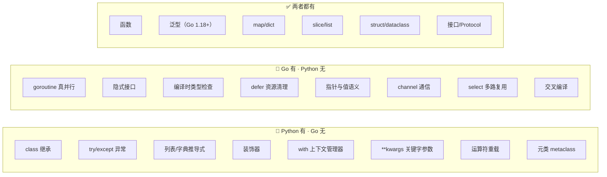

## 前置知识：差异是设计哲学的取舍

Python 强调**开发效率与运行时灵活性**，Go 强调**编译时安全与运行时性能**。本篇帮助有 Python 背景的开发者：

1. 快速识别哪些 Python 习惯**不能直接迁移**
2. 理解哪些 Go 特性是**全新的武器**
3. 避免在 Go 里寻找"Python 等价物"而不得的挫败感



> [!important] 迁移心态
> - **不要抱怨 Go 缺少 Python 特性** — 这是设计哲学不同
> - **学习 Go 独有的并发和编译时特性** — 这是 Python 做不到的
> - **掌握双向对比** — 面试高频考点

---

## 0. Python vs Go 设计哲学对比

| 维度 | Python | Go | 设计取舍 |
|------|--------|-----|--------|
| 性能 | ⭐⭐ | ⭐⭐⭐⭐⭐ | 解释执行 vs 编译为二进制 |
| 并发 | ⭐⭐ | ⭐⭐⭐⭐⭐ | GIL 单线程 vs GMP 多核真并行 |
| 编译安全 | ⭐ | ⭐⭐⭐⭐⭐ | 运行时类型 vs 编译时类型检查 |
| 部署便捷 | ⭐⭐ | ⭐⭐⭐⭐⭐ | 依赖运行时 vs 单二进制文件 |
| 开发速度 | ⭐⭐⭐⭐⭐ | ⭐⭐⭐ | 动态类型 vs 静态类型 |
| 运行时灵活 | ⭐⭐⭐⭐⭐ | ⭐⭐ | 猴子补丁 vs 静态编译 |
| 生态丰富 | ⭐⭐⭐⭐⭐ | ⭐⭐⭐ | PyPI 海量包 vs Go modules 精简 |

> [!tip] 设计哲学差异
> - **Python** 追求开发速度和运行时灵活性，牺牲了性能和编译安全
> - **Go** 追求性能和编译安全，牺牲了部分灵活性和语法糖
> - 没有对错——是不同场景下的最优选择

---

## 第一板块：Python 有、Go 没有的 12 个核心特性

### 1. 类继承（Class Inheritance）

```python
# Python: 继承
class Animal:
    def eat(self): print("eating")

class Dog(Animal):  # 继承
    def bark(self): print("barking")

dog = Dog()
dog.eat()   # 继承自 Animal
dog.bark()  # 自己的方法
```

```go
// Go: struct embedding（组合）
type Animal struct{ Name string }

func (a Animal) Eat() { fmt.Println("eating") }

type Dog struct {
    Animal  // 嵌入（组合）
    Breed string
}

func (d Dog) Bark() { fmt.Println("barking") }

dog := Dog{Animal: Animal{Name: "Rex"}}
dog.Eat()   // 提升自 Animal
dog.Bark()  // Dog 自己的方法
```

| 维度 | Python 继承 | Go Embedding |
|------|------------|-------------|
| 语法 | `class Child(Parent)` | `Parent` 嵌入字段 |
| 多重继承 | 支持（MRO） | 支持多重嵌入 |
| is-a 关系 | 是 | 否（has-a 关系） |
| 方法重写 | `override` | 同名方法覆盖 |

> [!tip] 迁移建议
> Go 用组合替代继承。如果 Python 代码中用了多重继承，在 Go 中改为多重 struct embedding + interface。

### 2. try/except 异常处理

```python
# Python: 异常处理
try:
    result = 10 / 0
except ZeroDivisionError:
    print("不能除以零")
except Exception as e:
    print(f"错误: {e}")
finally:
    print("清理资源")
```

```go
// Go: 显式错误返回值
result, err := divide(10, 0)
if err != nil {
    fmt.Println("不能除以零")
}
// 没有 finally，用 defer 替代
defer fmt.Println("清理资源")
```

| 维度 | Python try/except | Go error |
|------|-------------------|----------|
| 错误传播 | 向上抛出异常 | 显式返回 error |
| 错误检查 | `except` 捕获 | `if err != nil` |
| 保证执行 | `finally` | `defer` |
| 自定义错误 | `class MyError(Exception)` | `type MyError struct` + 实现 `error` 接口 |

### 3. 列表/字典/集合推导式

```python
# Python: 推导式一行搞定
squares = [x**2 for x in range(10)]
evens = [x for x in range(20) if x % 2 == 0]
word_len = {w: len(w) for w in ["hello", "world"]}
unique = {x for x in [1, 2, 2, 3, 3, 3]}
```

```go
// Go: 用 for 循环 + append
var squares []int
for i := 0; i < 10; i++ {
    squares = append(squares, i*i)
}

var evens []int
for i := 0; i < 20; i++ {
    if i%2 == 0 {
        evens = append(evens, i)
    }
}
```

| 维度 | Python 推导式 | Go for 循环 |
|------|-------------|------------|
| 语法 | `[expr for x in iter if cond]` | `for + append` |
| 可读性 | 简洁 | 显式 |
| 字典推导 | `{k: v for ...}` | 手动构建 map |

### 4. 装饰器（Decorator）

```python
# Python: 装饰器
import time

def timer(func):
    def wrapper(*args, **kwargs):
        start = time.time()
        result = func(*args, **kwargs)
        print(f"{func.__name__}: {time.time() - start:.2f}s")
        return result
    return wrapper

@timer
def slow_function():
    time.sleep(1)
```

```go
// Go: 函数组合或中间件模式
// ❌ Go 没有装饰器语法
// ✅ 替代方案 1：高阶函数
func timer(fn func()) func() {
    return func() {
        start := time.Now()
        fn()
        fmt.Printf("耗时: %v\n", time.Since(start))
    }
}

// ✅ 替代方案 2：HTTP 中间件模式
func loggingMiddleware(next http.Handler) http.Handler {
    return http.HandlerFunc(func(w http.ResponseWriter, r *http.Request) {
        start := time.Now()
        next.ServeHTTP(w, r)
        fmt.Printf("%s %s %v\n", r.Method, r.URL.Path, time.Since(start))
    })
}
```

### 5. with 上下文管理器

```python
# Python: with 语句自动管理资源
with open("file.txt", "r") as f:
    data = f.read()
# 自动关闭文件

from contextlib import contextmanager
@contextmanager
def timer(name):
    start = time.time()
    yield
    print(f"{name}: {time.time() - start:.2f}s")
```

```go
// Go: defer 延迟执行
f, err := os.Open("file.txt")
if err != nil { return }
defer f.Close()  // 函数返回时自动关闭

data, err := io.ReadAll(f)

// 高阶函数方案（最接近 with 语义）
func withTimer(name string, fn func()) {
    start := time.Now()
    defer fmt.Printf("%s: %v\n", name, time.Since(start))
    fn()
}
```

### 6. **kwargs 关键字参数

```python
# Python: **kwargs
def log(level, **kwargs):
    print(f"[{level}]", kwargs)

log("info", user="alice", action="login")
```

```go
// Go: 用 struct 或 map[string]interface{}
type LogOptions struct {
    User   string
    Action string
}

func log(level string, opts LogOptions) {
    fmt.Printf("[%s] %+v\n", level, opts)
}

log("info", LogOptions{User: "alice", Action: "login"})
```

### 7. 运算符重载

```python
# Python: 运算符重载
class Point:
    def __init__(self, x, y): self.x, self.y = x, y
    def __add__(self, other): return Point(self.x + other.x, self.y + other.y)
    def __eq__(self, other): return self.x == other.x and self.y == other.y

p3 = Point(1, 2) + Point(3, 4)  # ✅
```

```go
// Go: 用方法替代
type Point struct{ X, Y float64 }

func (p Point) Add(other Point) Point {
    return Point{p.X + other.X, p.Y + other.Y}
}

func (p Point) Equals(other Point) bool {
    return p.X == other.X && p.Y == other.Y
}

p3 := Point{1, 2}.Add(Point{3, 4})  // ✅
```

### 8. 元类（Metaclass）

```python
# Python: 元类在类创建时修改类
class SingletonMeta(type):
    _instances = {}
    def __call__(cls, *args, **kwargs):
        if cls not in cls._instances:
            cls._instances[cls] = super().__call__(*args, **kwargs)
        return cls._instances[cls]

class Database(metaclass=SingletonMeta):
    def __init__(self, url): self.url = url
```

```go
// Go: 用 sync.Once 或包级变量
var (
    once     sync.Once
    instance *Database
)

type Database struct{ URL string }

func GetDatabase(url string) *Database {
    once.Do(func() {
        instance = &Database{URL: url}
    })
    return instance
}
```

> [!important] 元类是 Python 独有的运行时元编程能力
> Go 是编译型语言，类型信息在编译时处理，运行时无法像 Python 那样动态修改类行为。`sync.Once` 和包级变量是 Go 中实现单例等元类常用模式的标准方式。

### 9. 猴子补丁（Monkey Patching）

```python
# Python: 运行时替换方法
import requests
original_get = requests.get
def patched_get(*args, **kwargs):
    print("PATCHED!")
    return original_get(*args, **kwargs)
requests.get = patched_get  # 运行时替换！
```

```go
// ❌ Go 无法运行时替换
// ✅ 替代方案：接口 + 依赖注入
type HTTPClient interface {
    Get(url string) (*http.Response, error)
}

// 测试时注入 mock 实现
```

### 10. 内置标准库广度

```python
# Python 的"电池已含"标准库
import itertools, functools, collections, dataclasses
import pathlib, decimal, datetime, re, json
```

```go
// Go 标准库相对精简
// 但核心功能齐全：net/http, encoding/json, database/sql, testing
// 数据处理需要第三方库或手写

import "net/http"
import "encoding/json"
// 没有 itertools、functools、collections、dataclasses 的等价物
```

| Python 标准库 | Go 对应 | 差异 |
|--------------|---------|------|
| `itertools` | 无原生 | 需手写 |
| `functools` | 无原生 | 部分功能用高阶函数替代 |
| `collections` | 无原生 | 需手写 |
| `dataclasses` | struct | 无自动生成 `__init__` |
| `pathlib` | `path/filepath` | 功能类似 |
| `decimal` | `math/big` | 高精度用 `big.Float` |
| `datetime` | `time` | Go 的 time 包功能齐全 |

### 11. 运行时反射（广泛使用）

```python
# Python: 丰富的运行时反射
u = User("Alice")
print(u.__dict__)           # {'name': 'Alice'}
print(u.__class__.__name__) # User
setattr(u, "age", 25)       # 运行时添加属性
```

```go
// Go: 有限的反射，编译时类型信息不保留
// reflect 包可以使用，但性能差，不推荐滥用
u := User{Name: "Alice"}
t := reflect.TypeOf(u)
fmt.Println(t.Name())  // User
// 不能运行时添加字段
```

### 12. 可变默认参数（⚠️ Python 陷阱，非优势）

```python
# Python 经典陷阱：默认参数只初始化一次
def append_one(items=[]):
    items.append(1)
    return items

print(append_one())  # [1]
print(append_one())  # [1, 1] ← 第二个调用继承了第一个调用的 []！
```

```go
// Go 没有这个问题！每次调用都创建新的默认值
func appendOne(items []int) []int {
    return append(items, 1)
}
// 每次调用都是独立的
```

> [!tip] 这是 Go 比 Python 更安全的点
> Go 的默认值（通过零值）每次调用都是新的，没有 Python 的可变默认参数陷阱。

---

## 第二板块：Go 有、Python 没有的 15 个核心特性

> 这些特性是 Go 的"杀手锏"，也是 Python 开发者迁移后最该掌握的新能力。

### 1. Goroutine 真并行（核心差异）

```go
// Go: goroutine 是多核真并行，无 GIL
func main() {
    runtime.GOMAXPROCS(runtime.NumCPU())  // 利用所有 CPU 核心
    for i := 0; i < 100000; i++ {
        go func() { /* 并发任务 */ }()
    }
}
```

```python
# Python: 受 GIL 限制，无法真正并行
# asyncio 是单线程协作式调度
# threading 受 GIL 限制
# multiprocessing 开销大
```

| 维度 | Python | Go |
|------|--------|----|
| 并发模型 | 协程（asyncio）/ 线程（threading） | goroutine |
| GIL | 有 | 无 |
| 多核并行 | 否（需 multiprocessing） | 是 |
| 并发数 | 数千 | 数十万 |

### 2. 隐式接口（鸭子类型的安全版）

```go
// Go: 不需要声明 implements，方法匹配即可
type Writer interface {
    Write([]byte) (int, error)
}

// File 自动实现 Writer——不需要 "implements Writer"
type File struct{}

func (f *File) Write(data []byte) (int, error) {
    // 实现细节
    return len(data), nil
}

var w Writer = &File{}  // ✅ 编译时类型安全
```

> **Python 对比**：Python 的 Protocol 需要显式继承或 mypy 检查，Go 的隐式接口不需要任何声明，降低了耦合。

### 3. 编译时类型检查

```go
// Go: 编译时发现类型错误
func add(a, b int) int { return a + b }
// add("hello", "world")  // ❌ 编译错误！
```

```python
# Python: 运行时才发现类型错误
def add(a, b): return a + b
# add("hello", "world")  # 运行时才报错
```

### 4. defer 资源清理

```go
// Go: defer 确保资源释放
func readFile(path string) error {
    f, err := os.Open(path)
    if err != nil { return err }
    defer f.Close()  // 无论函数如何退出，都会执行

    // 处理文件...
    return nil
}
```

> **Python 对比**：Python 的 `with` 语句需要 `__enter__`/`__exit__` 协议，Go 的 `defer` 更灵活——可以用于任何资源，不限于实现了特定协议的类。

### 5. 指针与值语义

```go
// Go: 值语义 + 指针
func modify(p *int) {  // 显式指针
    *p = 100
}

func copyValue(x int) {  // 值拷贝
    x = 200  // 不影响外部
}

func main() {
    n := 42
    modify(&n)      // 传地址
    fmt.Println(n)  // 100
    copyValue(n)    // 传值
    fmt.Println(n)  // 100（不变）
}
```

> **Python 对比**：Python 一切都是引用，没有"值拷贝"和"指针"的概念。Go 控制内存布局的能力比 Python 强得多。

### 6. Channel 通信原语

```go
// Go: channel 是语言级通信原语
ch := make(chan int)
go func() { ch <- 42 }()  // 发送
v := <-ch                  // 接收
```

> **Python 对比**：Python 的 `asyncio.Queue` 是库级实现，Go 的 channel 是语言级特性，与 goroutine 深度集成。

### 7. select 多路复用

```go
// Go: select 同时等待多个 channel
select {
case msg := <-ch1:
    fmt.Println("ch1:", msg)
case msg := <-ch2:
    fmt.Println("ch2:", msg)
case <-time.After(1 * time.Second):
    fmt.Println("超时")
}
```

> **Python 对比**：Python 的 `asyncio.wait()` 或 `asyncio.gather()` 可以等待多个协程，但不如 Go 的 `select` 灵活——select 可以同时等待 channel 操作和超时。

### 8. 交叉编译

```bash
# Go: 一行命令交叉编译到不同平台
GOOS=linux GOARCH=amd64 go build -o app-linux main.go
GOOS=windows GOARCH=amd64 go build -o app.exe main.go
GOOS=darwin GOARCH=arm64 go build -o app-mac main.go
```

> **Python 对比**：Python 交叉编译是噩梦（需要 PyInstaller + 对应平台的 Python）。Go 的交叉编译是内置功能，一行命令搞定。

### 9. 零值语义

```go
// Go: 所有类型都有零值，不需要显式初始化
var i int        // 0
var s string     // ""
var b bool       // false
var p *int       // nil
var sl []int     // nil（但可以 append）
```

> **Python 对比**：Python 没有零值概念，需要 `None` 作为"未初始化"标记。Go 的零值让代码更简洁、更安全。

### 10. 多返回值（语言级）

```go
// Go: 多返回值是语言级特性
func divide(a, b float64) (float64, error) {
    if b == 0 { return 0, errors.New("zero") }
    return a / b, nil
}
```

> **Python 对比**：Python 的多返回值本质是返回 tuple，Go 的每个返回值有独立类型，编译时检查。

### 11. 内置测试框架

```go
// Go: go test 是标准库的一部分
func TestAdd(t *testing.T) {
    if got := add(1, 2); got != 3 {
        t.Errorf("add(1,2) = %d; want 3", got)
    }
}
// 运行：go test
```

> **Python 对比**：Python 内置的 `unittest` 可用但写法繁琐，社区主流是第三方的 `pytest`；Go 的 `go test` 是内置的，零配置。

### 12. 静态编译

```go
// Go: 编译成单个静态二进制文件
// go build -o myapp
// 生成的 myapp 不依赖任何外部库，可以直接部署
```

> **Python 对比**：Python 部署需要解释器环境和所有依赖，Go 编译成一个二进制文件，部署简单得多。

### 13. 工具链统一

```go
// Go: 一个 go 命令完成所有事情
go build     // 编译
go test      // 测试
go fmt       // 格式化
go vet       // 静态分析
go doc       // 文档
go mod       // 依赖管理
go run       // 运行
```

> **Python 对比**：Python 需要 `pip`、`pytest`、`black`、`flake8`、`mypy`、`sphinx` 等多个工具，Go 一个命令全部搞定。

### 14. 命名返回值

```go
// Go: 命名返回值
func split(sum int) (x, y int) {
    x = sum * 4 / 9
    y = sum - x
    return  // 裸 return，自动返回 x 和 y
}
```

### 15. 包级 init 函数

```go
// Go: 包初始化时自动执行的函数
func init() {
    fmt.Println("包初始化完成")
}
```

---

## 第三板块：迁移策略矩阵

| Python 习惯 | Go 对应方案 | 难度 |
|------------|------------|------|
| 类继承 | struct embedding + interface | ⭐⭐ |
| try/except | `if err != nil` 模式 | ⭐⭐ |
| 列表推导式 | for 循环 + append | ⭐ |
| 装饰器 | 高阶函数 / 中间件模式 | ⭐⭐⭐ |
| with 上下文管理器 | defer | ⭐⭐ |
| **kwargs | struct 参数 | ⭐ |
| 运算符重载 | 方法（`a.Add(b)`） | ⭐ |
| 元类 | sync.Once / 包级变量 | ⭐⭐⭐ |
| 猴子补丁 | 接口 + 依赖注入 | ⭐⭐ |
| 运行时反射 | 有限反射 / 代码生成 | ⭐⭐⭐ |
| `async def` / `await` | goroutine + channel | ⭐⭐⭐⭐ |
| `threading.Thread` | goroutine | ⭐⭐⭐ |
| `multiprocessing` | goroutine（通常不需要） | ⭐⭐⭐⭐ |
| `isinstance(x, int)` | 类型 switch / 类型断言 | ⭐ |
| `or` 默认值（`x or default`） | 不可用（`x` 不是 falsy） | ⭐ |

---

## 第四板块：你会特别想 Python 的地方

| 场景 | Python 方案 | Go 生态现状 |
|------|------------|------------|
| 数据处理 | `pandas` 一行搞定 | 无原生 |
| 数值计算 | `numpy` 矩阵运算 | `gonum`（生态远不如 numpy） |
| 机器学习 | `pytorch` / `scikit-learn` | 无原生 |
| 快速原型 | 动态类型快速试错 | 类型标注有额外开销 |
| 科学计算 | `scipy` / `matplotlib` | 无原生 |
| 字符串处理 | 内置方法丰富 | 较简单 |
| 文件处理 | `pathlib` 优雅 | `filepath` 较繁琐 |
| 正则表达式 | `re` 模块 | `regexp` 包 |
| 调试 | `pdb` / `breakpoint()` | `dlv`（Delve 调试器） |
| 列表推导 | 一行搞定 | 需要 for 循环 |
| `decimal` 精确小数 | `decimal` 模块 | `math/big` |
| 快速脚本 | `python script.py` | `go run main.go` |
| 交互式开发 | `python -i` / IPython | 无原生 REPL |

---

## 常见易错点

> [!warning] **坑 1：Python 的 `or` 默认值 ≠ Go 的 `||`**
> ```python
> # Python: 0 or "default" → "default"（0 是 falsy）
> ```
> ```go
> // Go 无 falsy 概念，0 不是 false
> // 需要显式判断
> if x == 0 { x = default }
> ```

> [!warning] **坑 2：Python 的 `for item in list` ≠ Go 的 `for _, item := range`**
> ```python
> # for item in [1,2,3] → 遍历值
> ```
> ```go
> // for _, item := range slice → 遍历值（注意 _ 忽略索引）
> // for i := range slice → 遍历索引！
> ```

> [!warning] **坑 3：Go 没有 `while` 循环**
> ```go
> // ✅ Go 用 for 模拟 while
> for condition {
>     // 等价 while condition
> }
> ```

> [!warning] **坑 4：Go 的 `==` 不能比较 slice 和 map**
> ```go
> // ❌ 编译错误
> // s1 == s2  // slice 不能用 == 比较
> // ✅ 手动比较或 reflect.DeepEqual
> ```

> [!warning] **坑 5：Go 没有 `pass` 关键字**
> Python 的空函数体用 `pass`，Go 用空的花括号 `{}`。

> [!warning] **坑 6：Go 的 `nil` 有类型**
> `var p *int = nil` 和 `var s []int = nil` 的 `nil` 类型不同。不能把 `nil` slice 赋值给 `nil` 指针。

> [!warning] **坑 7：Python 的 `raise` 没有 Go 等价物**
> Go 的 `panic` 不等于 Python 的 `raise`。`panic` 是程序致命错误，正常错误用 `return error`。

---

## 📋 迁移策略矩阵

> [!tip] 迁移策略速查表
> 从 Python 迁移到 Go 时，每个特性都应提前了解其 Go 替代方案和迁移难度。

| Python 特性 | Go 替代方案 | 迁移难度 | 策略建议 |
|------------|-----------|---------|--------|
| 多重继承 | struct embedding + 接口组合 | ⭐⭐⭐ | 改用组合模式，不要寻找等价继承 |
| 异常 try/except | `if err != nil` + errors.Is/As | ⭐⭐⭐ | 忘掉异常，每个返回值检查错误 |
| class __init__ | `NewXxx()` 工厂函数 | ⭐⭐ | 函数名约定，返回指针 |
| class __str__ | `String()` 实现 Stringer 接口 | ⭐⭐ | 隐式实现 fmt.Stringer 接口 |
| @dataclass | struct + 字段标签 | ⭐⭐ | Go struct 本身就是数据容器 |
| 装饰器 @ | 无直接等价（Go 2 可能引入） | ⭐⭐⭐⭐ | 用函数包装、中间件模式替代 |
| 列表推导式 | `for` 循环 + `append` | ⭐⭐ | Go 无语法糖，显式循环更清晰 |
| 字典推导式 | `for` 循环 + `map[k]=v` | ⭐⭐ | 同上，显式构建 |
| with 上下文管理器 | `defer resource.Close()` | ⭐⭐ | defer 在打开资源后立即声明 |
| yield 生成器 | channel + goroutine | ⭐⭐⭐⭐ | 思维方式完全不同，用 channel 流式产出 |
| *args/**kwargs | variadic `...T` / struct 参数 | ⭐⭐⭐ | Go 不支持关键字参数，用 struct 封装可选参数 |
| 元组 tuple | struct 或多返回值 | ⭐ | Go 原生支持多返回值 |
| async/await | goroutine + channel | ⭐⭐⭐⭐ | 模型完全不同，CSP vs 事件循环 |
| GIL | 无 GIL，用 sync.Mutex | ⭐⭐⭐ | Go 天然多线程，需手动保护共享数据 |
| 猴子补丁 | 不支持（静态编译） | ⭐⭐⭐⭐ | 无法运行时修改，在编译时确定一切 |

| Go 特性 | Python 等价物 | 学习难度 | 价值说明 |
|---------|------------|---------|--------|
| goroutine + channel | asyncio + Queue | ⭐⭐⭐⭐ | Go 的核心武器，CSP 并发模型 |
| 隐式接口 | Protocol（typing） | ⭐⭐⭐ | 鸭子类型但编译时检查 |
| 显式错误返回 | 无等价物 | ⭐⭐ | 错误处理更显式，可追溯 |
| struct embedding | 无直接等价 | ⭐⭐ | 组合优于继承的设计哲学 |
| 指针 | 无（一切是引用） | ⭐⭐⭐ | 需理解值语义 vs 引用语义 |
| 交叉编译 | 无等价物 | ⭐ | 一行命令编译到任意平台 |
| go test 内置测试 | pytest | ⭐⭐ | 标准库自带，无需第三方 |
| gofmt 格式化 | black/ruff format | ⭐ | 官方统一，无风格之争 |
| go vet 静态检查 | flake8/mypy | ⭐⭐ | 编译器内置检查 |
| go modules | pip + venv | ⭐⭐ | 项目级隔离，无需虚拟环境 |
| go build 产物 | 无等价物 | ⭐ | 单一静态二进制，无运行时依赖 |
| context 包 | asyncio.timeout | ⭐⭐⭐⭐ | Go 独有，取消传播的标准方式 |
| sync 包 | threading.Lock | ⭐⭐⭐ | 更丰富的并发原语（Mutex/RWMutex/Once/Pool） |

---

## 🎯 本文学完自检

| 层次 | 检查项 |
|------|--------|
| 🟢 基础 | 能列出 5 个 Python 有但 Go 没有的特性，给出 Go 替代方案 |
| 🟢 基础 | 能列出 5 个 Go 有但 Python 没有的特性，解释其价值 |
| 🟡 进阶 | 能对比 Python 继承与 Go embedding 的优劣，选择合适场景 |
| 🟡 进阶 | 能解释为什么 Go 选择显式错误返回而非异常 |
| 🔴 挑战 | 能完整画出 Python→Go 迁移心智模型对比图 |

---

## 相关笔记

- ⬅️ 前置：[[01-环境搭建与基础语法对比]] — 基础语法差异
- ⬅️ 前置：[[02-变量与内置数据结构对比]] — 数据结构差异
- ⬅️ 前置：[[03-函数与结构体-从Python class到Go]] — 函数与 OOP 差异
- ⬅️ 前置：[[04-接口与错误处理-Go的设计哲学]] — 接口与错误处理差异
- ⬅️ 前置：[[05-并发编程-Goroutine与Channel]] — 并发模型差异
- ➡️ 后续：[[01-学习/GoLearningByPython/07-业务场景实战合集|07-业务场景实战合集]] — 实战中应用双向对比
- ➡️ 后续：[[01-学习/GoLearningByPython/08-面试高频20问-Python背景版|08-面试高频20问-Python背景版]] — 高频对比题
- 🔗 关联：[[../TypeScriptLearningByPython/06-Python有TS无与TS有Python无]] — 姐妹路径双向对比

---

*最后更新：2026-07-24*