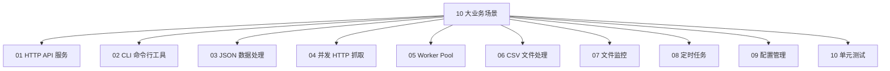

## 前置知识：从 Python 脚本到 Go 服务

Python 开发者习惯写脚本式代码——一个文件、顺序执行、快速验证。Go 需要你转变思维——**先编译、再运行、类型安全**。本篇 10 大场景覆盖了 Python 日常开发中 80% 的需求，每个场景都给出 Python 和 Go 的等价实现。



> [!important] 迁移思维
> - 不要机械地把 Python 代码逐行翻译，而是**用 Go 的最佳实践重写**
> - 重点关注：错误处理（`if err != nil`）、并发模型（goroutine）、资源管理（defer）

---

## 场景 01：HTTP API 服务

### Python（FastAPI）

```python
from fastapi import FastAPI, HTTPException
from pydantic import BaseModel

app = FastAPI()

class User(BaseModel):
    name: str
    age: int

users = {}

@app.get("/users/{name}")
def get_user(name: str):
    if name not in users:
        raise HTTPException(status_code=404, detail="not found")
    return users[name]

@app.post("/users/{name}")
def create_user(name: str, user: User):
    users[name] = user
    return {"name": name, **user.dict()}
```

### Go（标准库 net/http）

```go
package main

import (
    "encoding/json"
    "fmt"
    "log"
    "net/http"
    "strings"
    "sync"
)

// User 用户结构体（等价 Python 的 Pydantic BaseModel）
type User struct {
    Name string `json:"name"`
    Age  int    `json:"age"`
}

// 用户存储——sync.RWMutex 保证并发安全（Go 没有 GIL，需要显式加锁）
var (
    users = make(map[string]User)
    mu    sync.RWMutex
)

func userHandler(w http.ResponseWriter, r *http.Request) {
    // 解析 URL 路径 /users/alice → name = "alice"
    name := strings.TrimPrefix(r.URL.Path, "/users/")
    if name == "" {
        http.Error(w, "name required", http.StatusBadRequest)
        return
    }

    switch r.Method {
    case http.MethodGet:
        // 读锁（允许多个并发读）
        mu.RLock()
        defer mu.RUnlock()
        user, ok := users[name]
        if !ok {
            http.Error(w, "not found", http.StatusNotFound)
            return
        }
        w.Header().Set("Content-Type", "application/json")
        json.NewEncoder(w).Encode(user)

    case http.MethodPost:
        // 写锁（独占访问）
        mu.Lock()
        defer mu.Unlock()
        var user User
        // json.NewDecoder 从请求体解析 JSON（等价 FastAPI 的自动解析）
        if err := json.NewDecoder(r.Body).Decode(&user); err != nil {
            http.Error(w, "invalid JSON", http.StatusBadRequest)
            return
        }
        user.Name = name
        users[name] = user
        w.WriteHeader(http.StatusCreated)
        json.NewEncoder(w).Encode(user)

    default:
        http.Error(w, "method not allowed", http.StatusMethodNotAllowed)
    }
}

func main() {
    http.HandleFunc("/users/", userHandler)
    log.Println("Server running on :8080")
    log.Fatal(http.ListenAndServe(":8080", nil))
}
```

| 对比维度 | Python FastAPI | Go net/http |
|---------|---------------|-------------|
| 框架依赖 | 需要 `fastapi` | 标准库，零依赖 |
| 路由 | 装饰器 `@app.get()` | `http.HandleFunc()` |
| JSON 解析 | Pydantic 自动校验 | `json.NewDecoder().Decode()` |
| 并发安全 | asyncio 协程（单线程） | `sync.RWMutex`（多核真并行） |
| 错误处理 | `raise HTTPException` | `http.Error()` |
| 部署 | 需要 Python 环境 | 单个二进制文件 |

> [!tip] 生产环境推荐 Gin
> 标准库 `net/http` 功能完整但路由简单。生产环境推荐 `github.com/gin-gonic/gin`（类似 Python 的 Flask），支持中间件、路由组、自动绑定等。

---

## 场景 02：CLI 命令行工具

### Python（argparse）

```python
import argparse
from pathlib import Path

parser = argparse.ArgumentParser(description="文件统计工具")
parser.add_argument("directory", help="搜索目录")
parser.add_argument("-e", "--ext", default=".py", help="文件扩展名")
parser.add_argument("-n", "--limit", type=int, default=10, help="结果数量限制")
args = parser.parse_args()

count = 0
for f in Path(args.directory).rglob(f"*{args.ext}"):
    print(f)
    count += 1
    if count >= args.limit:
        break
```

### Go（flag 包）

```go
package main

import (
    "flag"
    "fmt"
    "os"
    "path/filepath"
    "strings"
)

func main() {
    // flag 包等价 Python 的 argparse
    ext := flag.String("e", ".go", "文件扩展名")
    limit := flag.Int("n", 10, "结果数量限制")
    flag.Parse()

    // flag.Arg(0) 获取非标志参数（等价 Python 的位置参数）
    if flag.NArg() == 0 {
        fmt.Println("用法: filecount <目录> [-e .go] [-n 10]")
        os.Exit(1)
    }
    dir := flag.Arg(0)

    count := 0
    // filepath.Walk 递归遍历目录（等价 Python 的 Path.rglob）
    filepath.Walk(dir, func(path string, info os.FileInfo, err error) error {
        if err != nil {
            return nil  // 跳过无权限的目录
        }
        if !info.IsDir() && strings.HasSuffix(path, *ext) {
            fmt.Println(path)
            count++
            if count >= *limit {
                return filepath.SkipDir  // 提前退出
            }
        }
        return nil
    })
    fmt.Printf("共找到 %d 个 %s 文件\n", count, *ext)
}
```

| 对比维度 | Python argparse | Go flag |
|---------|----------------|---------|
| 参数解析 | `add_argument` | `flag.String/Int` |
| 文件遍历 | `Path.rglob` | `filepath.Walk` |
| 编译 | 解释运行 | 编译成二进制 |
| 分发 | 需要 Python 环境 | 单个可执行文件 |

> [!tip] Go 是编写 CLI 工具的最佳选择
> Go 编译成单个二进制文件，分发极其简单。这就是为什么 Docker、Kubernetes、Terraform、Hugo 等工具都用 Go 编写。复杂 CLI 推荐用 `cobra` 库。

---

## 场景 03：JSON 数据处理

### Python

```python
import json

# 解析 JSON
data = json.loads('{"name": "Alice", "age": 30, "tags": ["go", "python"]}')
print(data["name"])

# 序列化
user = {"name": "Bob", "age": 25}
json_str = json.dumps(user, indent=2)
```

### Go

```go
package main

import (
    "encoding/json"
    "fmt"
)

// 结构体标签指定 JSON 字段名和选项
type User struct {
    Name string   `json:"name"`
    Age  int      `json:"age"`
    Tags []string `json:"tags,omitempty"`  // omitempty: 零值时忽略
}

func main() {
    // 解析 JSON（等价 json.loads）
    jsonStr := `{"name": "Alice", "age": 30, "tags": ["go", "python"]}`
    var user User
    // 注意：必须传指针 &user，否则不会修改原变量
    json.Unmarshal([]byte(jsonStr), &user)
    fmt.Println(user.Name)  // Alice

    // 序列化 JSON（等价 json.dumps with indent）
    user2 := User{Name: "Bob", Age: 25}
    data, _ := json.MarshalIndent(user2, "", "  ")
    fmt.Println(string(data))
}
```

> [!tip] Go 的 struct tags 比 Python 更精确
> `` `json:"name,omitempty"` `` 控制字段名和空值行为，比 Python 的 `json.dumps(default=...)` 更细粒度。

---

## 场景 04：并发 HTTP 抓取

### Python（asyncio + aiohttp）

```python
import asyncio
import aiohttp

async def fetch(session, url):
    async with session.get(url) as resp:
        return await resp.text()

async def main():
    urls = ["https://example.com/1", "https://example.com/2", "https://example.com/3"]
    async with aiohttp.ClientSession() as session:
        tasks = [fetch(session, url) for url in urls]
        results = await asyncio.gather(*tasks)
        for url, result in zip(urls, results):
            print(f"{url}: {len(result)} bytes")

asyncio.run(main())
```

### Go（goroutine + sync.WaitGroup）

```go
package main

import (
    "fmt"
    "io"
    "net/http"
    "sync"
)

func fetch(url string, wg *sync.WaitGroup, results chan<- string) {
    defer wg.Done()  // 确保退出时通知 WaitGroup

    resp, err := http.Get(url)
    if err != nil {
        results <- fmt.Sprintf("❌ %s: %v", url, err)
        return
    }
    defer resp.Body.Close()  // 确保关闭响应体

    body, _ := io.ReadAll(resp.Body)
    results <- fmt.Sprintf("✅ %s: %d bytes", url, len(body))
}

func main() {
    urls := []string{
        "https://example.com/1",
        "https://example.com/2",
        "https://example.com/3",
    }

    var wg sync.WaitGroup
    // 缓冲 channel：大小 = 任务数，避免发送阻塞
    results := make(chan string, len(urls))

    // 启动多个 goroutine 并发抓取（等价 asyncio.gather）
    for _, url := range urls {
        wg.Add(1)
        go fetch(url, &wg, results)
    }

    // 等待所有 goroutine 完成（等价 await asyncio.gather）
    wg.Wait()
    close(results)  // 关闭 channel，通知 range 结束

    // 收集结果
    for r := range results {
        fmt.Println(r)
    }
}
```

| 对比维度 | Python asyncio | Go goroutine |
|---------|----------------|-------------|
| 启动并发 | `asyncio.gather(*tasks)` | `go func()` + `WaitGroup` |
| 等待完成 | `await tasks` | `wg.Wait()` |
| 结果收集 | 返回值列表 | channel |
| 多核并行 | 否（单线程） | 是（真并行） |
| 错误处理 | `try/except` | `if err != nil` |

---

## 场景 05：Worker Pool 模式

### Python（concurrent.futures）

```python
from concurrent.futures import ThreadPoolExecutor
import time

def worker(task_id):
    time.sleep(1)
    return f"task {task_id} done"

with ThreadPoolExecutor(max_workers=3) as executor:
    futures = [executor.submit(worker, i) for i in range(10)]
    for future in futures:
        print(future.result())
```

### Go（goroutine + channel）

```go
package main

import (
    "fmt"
    "sync"
    "time"
)

func worker(id int, jobs <-chan int, results chan<- string, wg *sync.WaitGroup) {
    defer wg.Done()
    // range channel：自动从 jobs 读取，直到 close(jobs)
    for job := range jobs {
        time.Sleep(time.Second)  // 模拟耗时
        results <- fmt.Sprintf("worker %d processed job %d", id, job)
    }
}

func main() {
    jobs := make(chan int, 10)
    results := make(chan string, 10)
    var wg sync.WaitGroup

    // 启动 3 个 worker（等价 max_workers=3）
    for w := 0; w < 3; w++ {
        wg.Add(1)
        go worker(w, jobs, results, &wg)
    }

    // 发送 10 个任务
    for j := 0; j < 10; j++ {
        jobs <- j
    }
    close(jobs)  // 关闭 channel，通知 worker 没有更多任务

    // 等待所有 worker 完成
    wg.Wait()
    close(results)

    for r := range results {
        fmt.Println(r)
    }
}
```

> [!tip] Worker Pool 是 Go 并发的经典模式
> `jobs` channel 分发任务，`results` channel 收集结果，`close(jobs)` 通知退出。比 Python 的 `ThreadPoolExecutor` 更灵活，因为可以精确控制任务流。

---

## 场景 06：CSV 文件处理

### Python

```python
import csv

with open("data.csv", "r", encoding="utf-8") as f:
    reader = csv.DictReader(f)
    for row in reader:
        print(row["name"], row["age"])

with open("output.csv", "w", encoding="utf-8", newline="") as f:
    writer = csv.DictWriter(f, fieldnames=["name", "age"])
    writer.writeheader()
    writer.writerow({"name": "Alice", "age": 30})
```

### Go

```go
package main

import (
    "encoding/csv"
    "fmt"
    "os"
)

func main() {
    // 读取 CSV
    f, _ := os.Open("data.csv")
    defer f.Close()  // defer 确保关闭（等价 Python with）

    reader := csv.NewReader(f)
    records, _ := reader.ReadAll()
    for i, row := range records {
        if i == 0 {
            continue  // 跳过表头
        }
        fmt.Println(row[0], row[1])  // name, age
    }

    // 写入 CSV
    outFile, _ := os.Create("output.csv")
    defer outFile.Close()

    writer := csv.NewWriter(outFile)
    defer writer.Flush()  // 确保刷入磁盘

    writer.Write([]string{"name", "age"})  // 表头
    writer.Write([]string{"Alice", "30"})
}
```

---

## 场景 07：文件监控（Watch）

### Python（watchdog）

```python
from watchdog.observers import Observer
from watchdog.events import FileSystemEventHandler

class Handler(FileSystemEventHandler):
    def on_modified(self, event):
        print(f"Modified: {event.src_path}")

observer = Observer()
observer.schedule(Handler(), path=".", recursive=True)
observer.start()
# ...阻塞等待...
```

### Go（fsnotify）

```go
package main

import (
    "fmt"
    "log"

    "github.com/fsnotify/fsnotify"
)

func main() {
    watcher, err := fsnotify.NewWatcher()
    if err != nil {
        log.Fatal(err)
    }
    defer watcher.Close()

    // goroutine 监听事件（Go 的并发模型核心）
    go func() {
        for {
            select {
            case event, ok := <-watcher.Events:
                if !ok {
                    return
                }
                if event.Op&fsnotify.Write == fsnotify.Write {
                    fmt.Println("Modified:", event.Name)
                }
            case err, ok := <-watcher.Errors:
                if !ok {
                    return
                }
                log.Println("Error:", err)
            }
        }
    }()

    watcher.Add(".")
    select {}  // 阻塞主 goroutine
}
```

---

## 场景 08：定时任务

### Python（schedule）

```python
import schedule
import time

def job():
    print("Tick!")

schedule.every(10).seconds.do(job)

while True:
    schedule.run_pending()
    time.sleep(1)
```

### Go（time.Ticker）

```go
package main

import (
    "fmt"
    "time"
)

func main() {
    // time.Ticker 定时触发（等价 schedule.every(10).seconds）
    ticker := time.NewTicker(10 * time.Second)
    defer ticker.Stop()  // 确保释放资源

    // 用 select 实现优雅退出
    done := make(chan bool)

    go func() {
        for {
            select {
            case t := <-ticker.C:
                fmt.Println("Tick!", t)
            case <-done:
                return
            }
        }
    }()

    time.Sleep(35 * time.Second)
    done <- true
    fmt.Println("定时任务退出")
}
```

---

## 场景 09：配置管理

### Python

```python
import json
import os

class Config:
    def __init__(self, path="config.json"):
        with open(path) as f:
            data = json.load(f)
        self.host = data.get("host", "localhost")
        self.port = data.get("port", 8080)
        self.debug = os.getenv("DEBUG", "false") == "true"
```

### Go

```go
package main

import (
    "encoding/json"
    "fmt"
    "os"
)

type Config struct {
    Host  string `json:"host"`
    Port  int    `json:"port"`
    Debug bool   `json:"debug"`
}

// DefaultConfig 零值即默认值（Go 特色）
func DefaultConfig() *Config {
    return &Config{Host: "localhost", Port: 8080}
}

func LoadConfig(path string) (*Config, error) {
    cfg := DefaultConfig()

    data, err := os.ReadFile(path)
    if err != nil {
        return nil, fmt.Errorf("读取配置失败: %w", err)
    }

    // json.Unmarshal 会合并到已有 struct 上（零值充当默认值）
    if err := json.Unmarshal(data, cfg); err != nil {
        return nil, fmt.Errorf("解析配置失败: %w", err)
    }

    // 环境变量覆盖
    if os.Getenv("DEBUG") == "true" {
        cfg.Debug = true
    }
    return cfg, nil
}
```

---

## 场景 10：单元测试

### Python（pytest）

```python
def add(a, b):
    return a + b

def test_add():
    assert add(1, 2) == 3
    assert add(-1, 1) == 0
    assert add(0, 0) == 0

# 运行：pytest test_calc.py
```

### Go（go test 标准库）

```go
package main

import "testing"

func Add(a, b int) int {
    return a + b
}

func TestAdd(t *testing.T) {
    // 表格驱动测试（Go 社区推荐模式）
    tests := []struct {
        name     string
        a, b     int
        expected int
    }{
        {"正数", 1, 2, 3},
        {"负数", -1, 1, 0},
        {"零", 0, 0, 0},
    }

    for _, tt := range tests {
        t.Run(tt.name, func(t *testing.T) {
            got := Add(tt.a, tt.b)
            if got != tt.expected {
                t.Errorf("Add(%d,%d) = %d; want %d", tt.a, tt.b, got, tt.expected)
            }
        })
    }
}
// 运行：go test
// 覆盖率：go test -cover
// 竞争检测：go test -race
```

---

## 常见易错点

> [!warning] **易错 1：并发 map 写入 panic**
> Go 的 map 不是线程安全的，并发写入会 panic。需要用 `sync.RWMutex` 保护或用 `sync.Map`。

> [!warning] **易错 2：忘记 close channel 导致死锁**
> 如果 `range channel` 的消费者没有收到 `close` 信号，会永远阻塞。生产者完成后必须 `close(results)`。

> [!warning] **易错 3：defer 在循环中累积**
> ```go
> for i := 0; i < 100; i++ {
>     f, _ := os.Open(...)
>     defer f.Close()  // 100 个 defer 在函数退出时才执行！
> }
> // ✅ 把循环体提取为函数，或手动关闭
> ```

> [!warning] **易错 4：json.Unmarshal 需要传指针**
> ```go
> // ❌ 传值，不会修改原变量
> json.Unmarshal(data, user)
> // ✅ 传指针
> json.Unmarshal(data, &user)
> ```

> [!warning] **易错 5：HTTP 响应体未关闭**
> 每次 `http.Get` 后必须 `defer resp.Body.Close()`，否则连接不会归还连接池。

> [!warning] **易错 6：JSON 只序列化导出字段**
> Go 的 JSON 序列化只处理**导出字段**（首字母大写）。小写开头的未导出字段即使加了 `` `json:"xxx"` `` tag 也会被**静默忽略**——加 tag 并不能让私有字段输出。正确做法：字段首字母大写，再用 tag 指定 JSON 名（如 `` `json:"name"` ``）。

> [!warning] **易错 7：测试文件命名错误**
> Go 测试文件必须以 `_test.go` 结尾，测试函数以 `Test` 开头，否则 `go test` 不会发现。

---

## 🧪 实践练习

### 练习 1：并发文件下载器（限流版）

**目标**：用 goroutine + channel 实现限流并发下载，对比 Python 的 `asyncio.Semaphore`。

```go
package main

import (
    "fmt"
    "io"
    "net/http"
    "os"
    "sync"
    "time"
)

// downloadFile 下载文件到本地
func downloadFile(url, dest string, wg *sync.WaitGroup, results chan<- string, sem chan struct{}) {
    defer wg.Done()

    // 信号量模式：获取令牌（限流）
    // 等价 Python 的 async with semaphore:
    sem <- struct{}{}
    defer func() { <-sem }()  // 归还令牌

    resp, err := http.Get(url)
    if err != nil {
        results <- fmt.Sprintf("❌ %s: %v", url, err)
        return
    }
    defer resp.Body.Close()

    out, err := os.Create(dest)
    if err != nil {
        results <- fmt.Sprintf("❌ %s: %v", dest, err)
        return
    }
    defer out.Close()

    io.Copy(out, resp.Body)
    results <- fmt.Sprintf("✅ %s → %s", url, dest)
}

func main() {
    urls := map[string]string{
        "https://httpbin.org/json": "test1.json",
        "https://httpbin.org/html": "test2.html",
        "https://httpbin.org/xml":  "test3.xml",
    }

    var wg sync.WaitGroup
    results := make(chan string, len(urls))

    // 信号量：最多同时 2 个下载
    // 用 chan struct{} 模拟，struct{} 不占内存
    sem := make(chan struct{}, 2)

    start := time.Now()
    for url, dest := range urls {
        wg.Add(1)
        go downloadFile(url, dest, &wg, results, sem)
    }

    wg.Wait()
    close(results)

    for r := range results {
        fmt.Println(r)
    }
    fmt.Printf("总耗时: %v\n", time.Since(start))
}
```

**注释**：信号量模式（`chan struct{}`）是 Go 中实现并发限流的标准方式。`sem <- struct{}{}` 获取令牌，`<-sem` 归还令牌。对比 Python 的 `asyncio.Semaphore`，Go 的信号量用 channel 实现更简洁。`struct{}{}` 是空结构体值——第一个 `{}` 是类型，第二个 `{}` 是实例，不占任何内存。

---

### 练习 2：REST API CRUD 服务

**目标**：用 Go 标准库实现完整的 Todo CRUD API，对比 Python 的 FastAPI。

```go
package main

import (
    "encoding/json"
    "net/http"
    "strconv"
    "strings"
    "sync"
)

// Todo 待办事项结构体
type Todo struct {
    ID    int    `json:"id"`
    Title string `json:"title"`
    Done  bool   `json:"done"`
}

// TodoStore 线程安全的存储
type TodoStore struct {
    sync.RWMutex
    todos  map[int]Todo
    nextID int
}

func NewTodoStore() *TodoStore {
    return &TodoStore{todos: make(map[int]Todo), nextID: 1}
}

func main() {
    store := NewTodoStore()
    mux := http.NewServeMux()

    // GET/POST /todos
    mux.HandleFunc("/todos", func(w http.ResponseWriter, r *http.Request) {
        switch r.Method {
        case http.MethodGet:
            store.RLock()
            defer store.RUnlock()
            list := make([]Todo, 0, len(store.todos))
            for _, t := range store.todos {
                list = append(list, t)
            }
            json.NewEncoder(w).Encode(list)

        case http.MethodPost:
            var todo Todo
            if err := json.NewDecoder(r.Body).Decode(&todo); err != nil {
                http.Error(w, err.Error(), http.StatusBadRequest)
                return
            }
            store.Lock()
            todo.ID = store.nextID
            store.nextID++
            store.todos[todo.ID] = todo
            store.Unlock()
            w.WriteHeader(http.StatusCreated)
            json.NewEncoder(w).Encode(todo)
        }
    })

    // GET/PUT/DELETE /todos/{id}
    mux.HandleFunc("/todos/", func(w http.ResponseWriter, r *http.Request) {
        idStr := strings.TrimPrefix(r.URL.Path, "/todos/")
        id, err := strconv.Atoi(idStr)
        if err != nil {
            http.Error(w, "invalid id", http.StatusBadRequest)
            return
        }

        switch r.Method {
        case http.MethodGet:
            store.RLock()
            defer store.RUnlock()
            todo, ok := store.todos[id]
            if !ok {
                http.NotFound(w, r)
                return
            }
            json.NewEncoder(w).Encode(todo)

        case http.MethodDelete:
            store.Lock()
            defer store.Unlock()
            delete(store.todos, id)
            w.WriteHeader(http.StatusNoContent)
        }
    })

    http.ListenAndServe(":8080", mux)
}
```

**注释**：纯标准库实现的 REST API，无需第三方框架。`sync.RWMutex` 保护并发 map 访问（读多写少场景用 RLock）。对比 Python 的 FastAPI，Go 的代码更冗长但性能更高、部署更简单（一个二进制文件）。`make([]Todo, 0, len)` 预分配容量避免 append 时的数组重分配。

---

### 练习 3：并发 CSV 处理

**目标**：用 goroutine 并发处理多个 CSV 文件，合并行数统计。

```go
package main

import (
    "encoding/csv"
    "fmt"
    "os"
    "path/filepath"
    "sync"
)

// processCSV 读取 CSV 文件并返回行数
func processCSV(path string, wg *sync.WaitGroup, results chan<- string) {
    defer wg.Done()

    f, err := os.Open(path)
    if err != nil {
        results <- fmt.Sprintf("❌ %s: %v", path, err)
        return
    }
    defer f.Close()

    reader := csv.NewReader(f)
    records, err := reader.ReadAll()
    if err != nil {
        results <- fmt.Sprintf("❌ %s: %v", path, err)
        return
    }

    results <- fmt.Sprintf("✅ %s: %d 行", path, len(records))
}

func main() {
    // 查找当前目录下所有 CSV 文件
    var csvFiles []string
    filepath.Walk(".", func(path string, info os.FileInfo, err error) error {
        if err != nil {
            return nil
        }
        if !info.IsDir() && filepath.Ext(path) == ".csv" {
            csvFiles = append(csvFiles, path)
        }
        return nil
    })

    if len(csvFiles) == 0 {
        fmt.Println("没有找到 CSV 文件")
        return
    }

    var wg sync.WaitGroup
    results := make(chan string, len(csvFiles))

    // 并发处理每个 CSV 文件
    for _, f := range csvFiles {
        wg.Add(1)
        go processCSV(f, &wg, results)
    }

    wg.Wait()
    close(results)

    for r := range results {
        fmt.Println(r)
    }
}
```

**注释**：这个练习结合了文件遍历（`filepath.Walk`）、goroutine 并发（`go processCSV`）、`sync.WaitGroup` 等待、channel 收集结果。对比 Python 的 `concurrent.futures.ThreadPoolExecutor`，Go 的模式更显式但也更灵活。注意 `filepath.Walk` 的回调函数签名是固定的，返回 `error` 可以控制遍历行为（如 `filepath.SkipDir` 提前退出）。

---

## 🚨 Python 程序员写 Go 的常见错误

> [!warning] **坑 1：HTTP handler 忘记读取和关闭 Body**
> Python 的 requests 自动管理 Body。Go 的 `http.Response.Body` 必须手动关闭，否则连接不会回池，最终耗尽连接数。用 `defer resp.Body.Close()`。

> [!warning] **坑 2：JSON 序列化字段名不匹配**
> Python 的 `@dataclass` 默认用字段名。Go 的 struct 字段需要 `json:"fieldName"` 标签指定 JSON 名称，否则用 Go 的 PascalCase 导出名。

> [!warning] **坑 3：并发 HTTP 请求忘记 WaitGroup**
> Python 的 `asyncio.gather(*tasks)` 自动等待。Go 需要手动管理 `sync.WaitGroup`——忘记 `wg.Wait()` 会导致主 goroutine 提前退出。

> [!warning] **坑 4：context 忘记 cancel 导致资源泄漏**
> Python 的 `asyncio.timeout` 自动清理。Go 的 `context.WithTimeout` 返回的 cancel 函数**必须调用**，否则 context 资源不会释放。用 `defer cancel()`。

> [!warning] **坑 5：错误处理中忘记包含上下文信息**
> Python 的 `raise ValueError(f"failed for {item}")` 自带上下文。Go 习惯用 `fmt.Errorf("processing %s: %w", item, err)` 包装错误。

---

## 🎯 本文学完自检

| 层次 | 检查项 |
|------|--------|
| 🟢 基础 | 能用 `net/http` 写出带 JSON 的 HTTP API |
| 🟢 基础 | 能用 `flag` 写 CLI 工具，用 `encoding/json` 处理 JSON |
| 🟡 进阶 | 能用 goroutine + channel 实现并发抓取和 Worker Pool |
| 🟡 进阶 | 能用 `go test` 编写表格驱动测试 |
| 🔴 挑战 | 能将一个完整的 Python 项目迁移为 Go 实现，正确处理错误和并发 |

---

## 相关笔记

- ⬅️ 前置：[[05-并发编程-Goroutine与Channel]] — 并发基础
- ⬅️ 前置：[[06-Python有Go无与Go有Python无]] — 双向对比
- ➡️ 后续：[[01-学习/GoLearningByPython/08-面试高频20问-Python背景版|08-面试高频20问-Python背景版]] — 面试准备
- 🔗 关联：[[../TypeScriptLearningByPython/07-业务场景实战合集]] — 姐妹路径业务场景

---

*最后更新：2026-07-24*