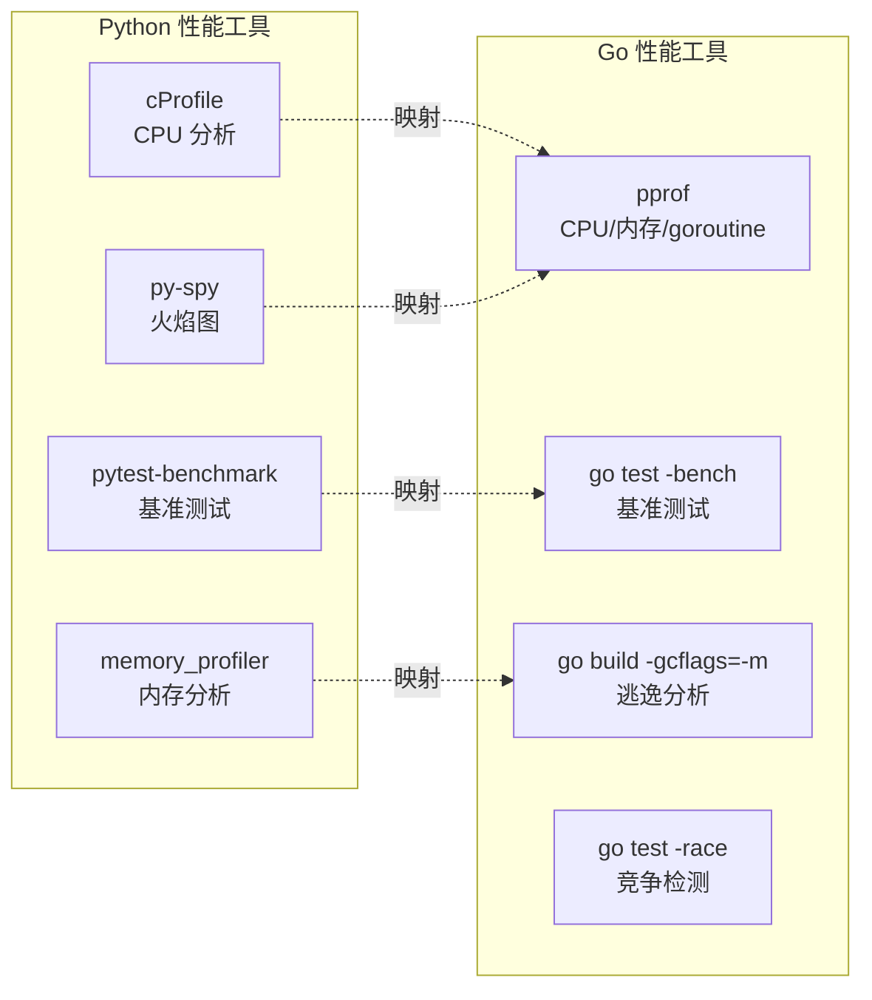

## 前置知识：Go 性能调优的核心思路

Python 性能调优用 `cProfile` 和 `memory_profiler`，Go 有更强大的**内置**工具链：



> [!important] Go 性能工具的优势
> - `pprof` 是**标准库自带**的，不需要安装第三方工具
> - `go test -bench` 将基准测试**集成到测试流程**中
> - `go test -race` 是竞争检测器（编译期插桩、**运行时检测**），Python 无等价物
> - 逃逸分析帮助理解**栈 vs 堆分配**，Python 无此概念

---

## 1. 基准测试：pytest-benchmark → go test -bench

### Python（pytest-benchmark）

```python
def test_sum(benchmark):
    result = benchmark(lambda: sum(range(1000)))
    assert result == 499500
```

### Go（go test -bench）

```go
package main

import "testing"

func Sum(n int) int {
    total := 0
    for i := 0; i < n; i++ {
        total += i
    }
    return total
}

// 基准测试：函数名必须以 Benchmark 开头
func BenchmarkSum(b *testing.B) {
    // b.N 由测试框架自动调整
    for i := 0; i < b.N; i++ {
        Sum(1000)
    }
}
```

```bash
go test -bench=. -benchmem
# 输出：
# BenchmarkSum-8    2000000    600 ns/op    0 B/op    0 allocs/op
```

**注释**：`b.N` 是 Go 测试框架自动调整的迭代次数——先跑 1 次，再 100 次，再 10000 次，直到统计稳定。`ns/op` 是每次操作纳秒数，`B/op` 是每次分配字节数，`allocs/op` 是每次分配次数。Python 的 pytest-benchmark 需要第三方安装，Go 是标准库自带。

### 对比不同实现

```go
// ❌ 不预分配
func BenchmarkSliceAppend(b *testing.B) {
    for i := 0; i < b.N; i++ {
        var s []int
        for j := 0; j < 10000; j++ {
            s = append(s, j*j)
        }
    }
}

// ✅ 预分配容量
func BenchmarkSlicePrealloc(b *testing.B) {
    for i := 0; i < b.N; i++ {
        s := make([]int, 0, 10000)  // 预分配
        for j := 0; j < 10000; j++ {
            s = append(s, j*j)
        }
    }
}
```

```bash
# BenchmarkSliceAppend-8    1000    1234567 ns/op    262144 B/op    20 allocs/op
# BenchmarkSlicePrealloc-8  2000     654321 ns/op     80000 B/op     1 allocs/op
```

**结论**：预分配容量减少 80% 内存分配，性能提升 50%。

---

## 2. CPU 分析：cProfile → pprof

### Python（cProfile）

```python
import cProfile
cProfile.run('slow_function()')
# 输出：函数调用次数、总耗时、每次调用耗时
```

### Go（pprof）

```go
package main

import (
    "os"
    "runtime/pprof"
)

func slowFunction() int {
    total := 0
    for i := 0; i < 1000000; i++ {
        total += i * i
    }
    return total
}

func main() {
    f, _ := os.Create("cpu.prof")
    defer f.Close()
    pprof.StartCPUProfile(f)
    defer pprof.StopCPUProfile()

    slowFunction()
}
```

```bash
# 交互式分析
go tool pprof cpu.prof
# (pprof) top          # 显示耗时最多的函数
# (pprof) list main    # 显示函数级别耗时
# (pprof) web          # 浏览器可视化火焰图

# HTTP 版 pprof（生产环境友好）
import _ "net/http/pprof"
# 访问 http://localhost:6060/debug/pprof/profile?seconds=30
```

**注释**：Go 的 pprof 是**采样式分析**（每 10ms 采样），对运行时性能影响极小。Python 的 cProfile 是全量统计，对性能影响较大。

---

## 3. 逃逸分析——Go 独有的性能武器

Python 中一切对象都在堆上，由 GC 管理。Go 编译器会做**逃逸分析**——如果变量的生命周期不超出函数，就分配在栈上（几乎零成本）；如果引用逃逸到函数外，就分配在堆上（需要 GC 回收）。

```go
// 不逃逸——栈分配（快）
func noEscape() int {
    x := 42
    return x  // x 没有逃逸出函数
}

// 逃逸——堆分配（慢，需要 GC）
func escapes() *int {
    x := 42
    return &x  // x 逃逸到堆上（返回了指针）
}

// interface 导致逃逸
func ifaceEscape() interface{} {
    x := 42
    return x  // x 逃逸（装箱为 interface{}）
}
```

```bash
# 运行逃逸分析
go build -gcflags="-m" main.go
# 输出：
# ./main.go:6:9: x does not escape       ← 留在栈
# ./main.go:12:9: moved to heap: x       ← 逃逸到堆
# ./main.go:18:9: x escapes to heap      ← 逃逸到堆
```

**注释**：`-gcflags="-m"` 启用逃逸分析报告。减少堆分配可以显著降低 GC 压力。Python 没有逃逸分析——一切在堆上。

---

## 4. sync.Pool 对象池

```go
// sync.Pool 缓存临时对象，减少 GC 压力
// Python 无标准库等价物
var bufferPool = sync.Pool{
    New: func() interface{} {
        return make([]byte, 1024)
    },
}

func processWithPool() {
    buf := bufferPool.Get().([]byte)
    defer bufferPool.Put(buf)  // 用完归还
    // 使用 buf...
}
```

**注释**：`sync.Pool` 是对象复用池，减少 GC 压力——对象从池中取出用完放回，不会成为垃圾。Python 无标准库等价物。

---

## 5. go test -race——Python 无等价物

```go
func TestConcurrentAccess(t *testing.T) {
    counter := 0
    for i := 0; i < 100; i++ {
        go func() {
            counter++  // 数据竞争！
        }()
    }
}
// 运行：go test -race
// 输出：WARNING: DATA RACE
```

**注释**：Go 的竞争检测器在**编译时**插入检测代码，运行时如果发现两个 goroutine 同时访问同一变量且至少一个是写操作，就会报告。Python 靠 GIL 避免了大部分数据竞争，但也牺牲了多核性能。

---

## 6. 性能优化检查清单

| 优化项 | 工具 | 效果 |
|-------|------|------|
| 减少堆分配 | `-gcflags="-m"` 逃逸分析 | 降低 GC 压力 |
| 预分配 slice 容量 | `make([]T, 0, cap)` | 避免多次扩容 |
| 使用 strings.Builder | `strings.Builder` | 替代 `+` 拼接 |
| 避免 interface 装箱 | 具体类型替代 `interface{}` | 减少堆分配 |
| 使用 sync.Pool | `sync.Pool` | 复用临时对象 |
| 使用指针接收者 | `func (t *T) Method()` | 避免大 struct 复制 |
| 字节 slice vs 字符串 | `[]byte` 替代 `string` | 减少复制 |

---

## 🚨 Python 程序员写 Go 的常见错误

> [!warning] **坑 1：过度优化——先跑 pprof 再优化**
> Python 程序员可能习惯凭直觉优化。Go 有 pprof，**先用数据定位瓶颈**，不要猜测。90% 的性能问题在 10% 的代码中。

> [!warning] **坑 2：在热路径中分配内存**
> Python 的 GC 可以处理大量小对象。Go 虽然也有 GC，但减少堆分配能显著降低 GC 压力。在循环中避免 `make()` 和 `append`。

> [!warning] **坑 3：忘记 -race 标志**
> Python 没有竞争检测器。Go 的 `go test -race` 是开发时工具——生产环境不要开 -race（性能下降 10 倍），但 CI/CD 中必须开。

> [!warning] **坑 4：用 Python 思维做基准测试**
> Python 的 `timeit` 只测一次。Go 的 `testing.B` 会自动调整 `b.N` 跑多次。不要在 Go 中用 `time.Now()` 手动计时做基准测试。

> [!warning] **坑 5：忽略逃逸分析**
> Python 一切在堆上。Go 的逃逸分析能帮你理解哪些变量在栈上（零成本）。用 `go build -gcflags="-m"` 定期检查。

---

## 🎯 练习

### 练习 1：pprof 分析

编写一个 CPU 密集型 Go 程序，用 `pprof` 找出瓶颈函数。在注释中对比 Go pprof 和 Python cProfile 的使用方式差异。

### 练习 2：基准测试对比

将 Python 列表推导式和 Go 的 `for + append` 在相同逻辑下做基准测试。在注释中对比 `B/op` 和 `allocs/op` 的含义。

### 练习 3：逃逸分析

写 3 个函数：一个变量不逃逸，一个返回指针逃逸，一个通过 interface 逃逸。用 `go build -gcflags="-m"` 验证，注释解释每种情况。

---

## 🎯 本文学完自检

| 层次 | 检查项 |
|------|--------|
| 🟢 基础 | 能用 `go test -bench` 运行基准测试，理解 ns/op 和 B/op |
| 🟢 基础 | 能用 `go test -race` 检测数据竞争 |
| 🟡 进阶 | 能用 `pprof` 分析 CPU 和内存瓶颈 |
| 🟡 进阶 | 能用 `go build -gcflags="-m"` 查看逃逸分析结果 |
| 🔴 挑战 | 能对比 Python cProfile 和 Go pprof 的分析深度差异 |

---

## 相关笔记

- ⬅️ 前置：[[09-Go标准库实战-Python对照]] — 标准库是性能的基础
- ⬅️ 前置：[[05-并发编程-Goroutine与Channel]] — 并发是 Go 性能的核心
- 🔗 关联：[[毕业项目-Go任务调度器/v5-测试与部署版]] — 基准测试实战

---

*最后更新：2026-07-24*
