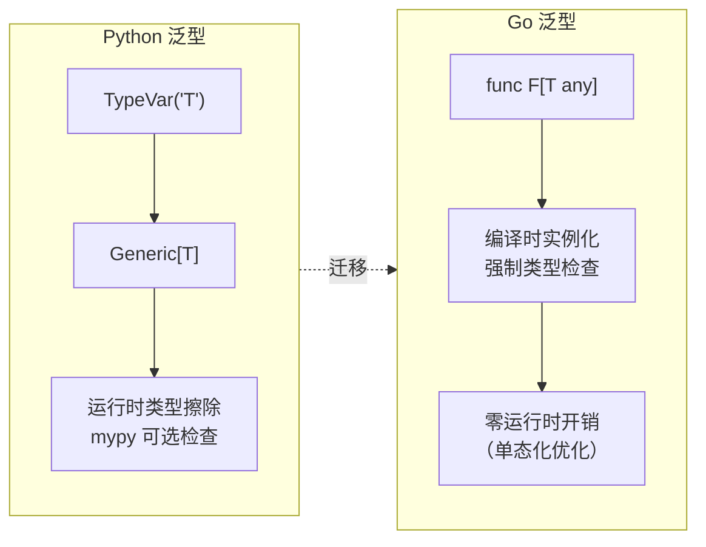

## 前置知识：泛型的两种世界

Python 的泛型是**运行时**的（`TypeVar` + `Generic`），Go 1.18+ 的泛型是**编译时**的（类型参数 + 约束）。



> [!important] 核心认知
> - Python 的 `TypeVar` 是给 `mypy` 看的，运行时不生效
> - Go 的 `[T any]` 是编译时实例化，类型错误编译阶段就报错
> - Go 泛型的约束系统比 Python 更强大

---

## 1. 泛型函数：TypeVar → [T any]

### Python

```python
from typing import TypeVar

T = TypeVar('T')

def first(items: list[T]) -> T | None:
    return items[0] if items else None

print(first([1, 2, 3]))     # 1
print(first(["a", "b"]))    # "a"
```

### Go

```go
// [T any] 等价 Python 的 TypeVar('T')
// any 是 interface{} 的别名
func First[T any](items []T) (T, bool) {
    if len(items) == 0 {
        var zero T  // 零值，等价 Python None
        return zero, false
    }
    return items[0], true
}

func main() {
    if val, ok := First([]int{1, 2, 3}); ok {
        fmt.Println(val)  // 1
    }
    if val, ok := First([]string{"a", "b"}); ok {
        fmt.Println(val)  // "a"
    }
}
```

**注释**：Go 的 `[T any]` 在函数名后声明类型参数。`any` 是 `interface{}` 的别名。Go 用 `(T, bool)` 返回模式表示可选值，Python 用 `| None`。

---

## 2. 类型约束：TypeVar(bound=...) → 接口约束

### Python

```python
from typing import TypeVar

# 约束：T 必须支持 __lt__ 比较
T = TypeVar('T', bound='Comparable')

def max_item(items: list[T]) -> T | None:
    if not items:
        return None
    result = items[0]
    for item in items[1:]:
        if item > result:  # 需要 __lt__
            result = item
    return result
```

### Go

```go
// 定义比较约束接口
type Ordered interface {
    ~int | ~int8 | ~int16 | ~int32 | ~int64 |
    ~uint | ~uint8 | ~uint16 | ~uint32 | ~uint64 |
    ~float32 | ~float64 | ~string
}

// comparable 是内置约束，支持 == 比较
func Contains[T comparable](items []T, target T) bool {
    for _, item := range items {
        if item == target {
            return true
        }
    }
    return false
}

// 自定义约束
func MaxOf[T Ordered](a, b T) T {
    if a > b {
        return a
    }
    return b
}
```

**注释**：Go 的泛型约束通过**接口定义**，`~int` 表示 int 及其底层类型（如 `type MyInt int`）。Python 的 `bound` 更宽松但运行时报错，Go 在编译时保护。

---

## 3. 泛型类型（struct）

### Python

```python
from typing import Generic, TypeVar

K = TypeVar('K')
V = TypeVar('V')

class HashMap(Generic[K, V]):
    def __init__(self):
        self._data: dict[K, V] = {}
    def set(self, key: K, value: V) -> None:
        self._data[key] = value
    def get(self, key: K) -> V | None:
        return self._data.get(key)
```

### Go

```go
// 泛型 struct
type HashMap[K comparable, V any] struct {
    data map[K]V
}

func NewHashMap[K comparable, V any]() *HashMap[K, V] {
    return &HashMap[K, V]{data: make(map[K]V)}
}

func (m *HashMap[K, V]) Set(key K, value V) {
    m.data[key] = value
}

func (m *HashMap[K, V]) Get(key K) (V, bool) {
    v, ok := m.data[key]
    return v, ok
}

// 使用
m := NewHashMap[string, int]()
m.Set("Alice", 30)
age, ok := m.Get("Alice")  // age 是 int 类型，编译时保证
```

**注释**：Go 泛型 struct 的方法也需要声明类型参数。`comparable` 约束 K（因为 map 的 key 需要 `==` 比较）。

---

## 4. Go 泛型独有特性（Python 无等价物）

### 4.1 类型集（Type Sets）

```go
// 用 | 联合类型作为约束
type Number interface {
    int | int64 | float32 | float64
}

func Sum[T Number](values []T) T {
    var total T
    for _, v := range values {
        total += v
    }
    return total
}
```

**注释**：`int | float64` 是类型集联合，Python 的 `Union[int, float]` 是值联合，语义不同。

### 4.2 类型推断

```go
// Go 编译器能自动推断类型参数
func Map[T, U any](items []T, fn func(T) U) []U {
    result := make([]U, len(items))
    for i, v := range items {
        result[i] = fn(v)
    }
    return result
}

// 调用时无需指定 T 和 U
nums := []int{1, 2, 3}
strings := Map(nums, func(n int) string {
    return fmt.Sprintf("%d", n)
})  // 自动推断 T=int, U=string
```

---

## 5. 泛型 vs 接口——何时用哪个

| 维度 | 泛型 | interface |
|------|------|-----------|
| 类型安全 | 编译时保证 | 运行时断言 |
| 性能 | 零开销（单态化） | interface 装箱开销 |
| 灵活性 | 类型参数约束 | 鸭子类型 |
| 适用场景 | 容器、算法、工具函数 | 多态、依赖注入、插件 |

> [!tip] 经验法则
> 如果不同类型的实现逻辑**完全相同**，用泛型。如果不同类型有**不同的实现**，用 interface。

---

## 6. Python vs Go 泛型对比

| 维度 | Python TypeVar | Go 泛型 |
|------|---------------|---------|
| 引入版本 | 3.5+ | 1.18+ |
| 类型检查时机 | 运行时（mypy 静态检查） | 编译时 |
| 类型擦除 | 运行时保留 | 运行时擦除 |
| 约束表达 | `bound` + `Protocol` | 接口约束 + 类型集 |
| 性能 | 运行时开销 | 编译时单态化/GCShape |

---

## 🚨 Python 程序员写 Go 的常见错误

> [!warning] **坑 1：不能用 any 替代所有约束**
> Python 的 TypeVar 可以不加 bound。Go 的 `[T any]` 不能做比较（`>` `<`）和 map key。需要比较用 `comparable` 或 `constraints.Ordered`。

> [!warning] **坑 2：~ 和 | 只能在接口约束中**
> `~int | ~float64` 只能作为接口约束，不能作为普通类型使用。Go 泛型不支持 Python 的 `Union[int, float]` 直接使用。

> [!warning] **坑 3：泛型方法不能引入额外类型参数**
> Go 1.22 的泛型方法不能引入新的类型参数（只能用 struct 的类型参数）。Python 的 Generic 方法可以引入新的 TypeVar。
>
> 🔄 **2026-09 更新**：Go 1.27 已支持泛型方法引入新的类型参数，本坑在 **1.27+ 环境不再成立**；1.22～1.26 环境仍需遵守。

---

## 🎯 练习

### 练习 1：泛型 Map 函数

实现 `Map[T, U any](items []T, fn func(T) U) []U`，对比 Python 的 `map()` 函数。注释说明类型参数推断。

### 练习 2：泛型 Filter

实现 `Filter[T any](items []T, fn func(T) bool) []T`，用 `comparable` 约束支持去重。对比 Python 的 `filter()` 和列表推导式。

### 练习 3：Set 泛型实现

用泛型实现 `Set[T comparable]`，支持 Add/Remove/Contains。对比 Python 的内置 `set`。

---

## 🎯 本文学完自检

| 层次 | 检查项 |
|------|--------|
| 🟢 基础 | 能声明泛型函数 `func F[T any]()`，理解类型参数 |
| 🟢 基础 | 能用 `comparable` 和 `any` 约束 |
| 🟡 进阶 | 能定义泛型 struct 和方法 |
| 🟡 进阶 | 能对比 Python TypeVar 和 Go 泛型的本质差异 |
| 🔴 挑战 | 能设计自定义约束（类型集），理解单态化 |

---

## 相关笔记

- ⬅️ 前置：[[03-函数与结构体-从Python class到Go]] — struct 和方法基础
- ⬅️ 前置：[[04-接口与错误处理-Go的设计哲学]] — interface 基础
- 🔗 关联：[[06-Python有Go无与Go有Python无]] — Python TypeVar 是 Go 泛型的锚点
- 🔗 关联：[[09-Go标准库实战-Python对照]] — 标准库中的泛型应用

---

*最后更新：2026-07-24*
