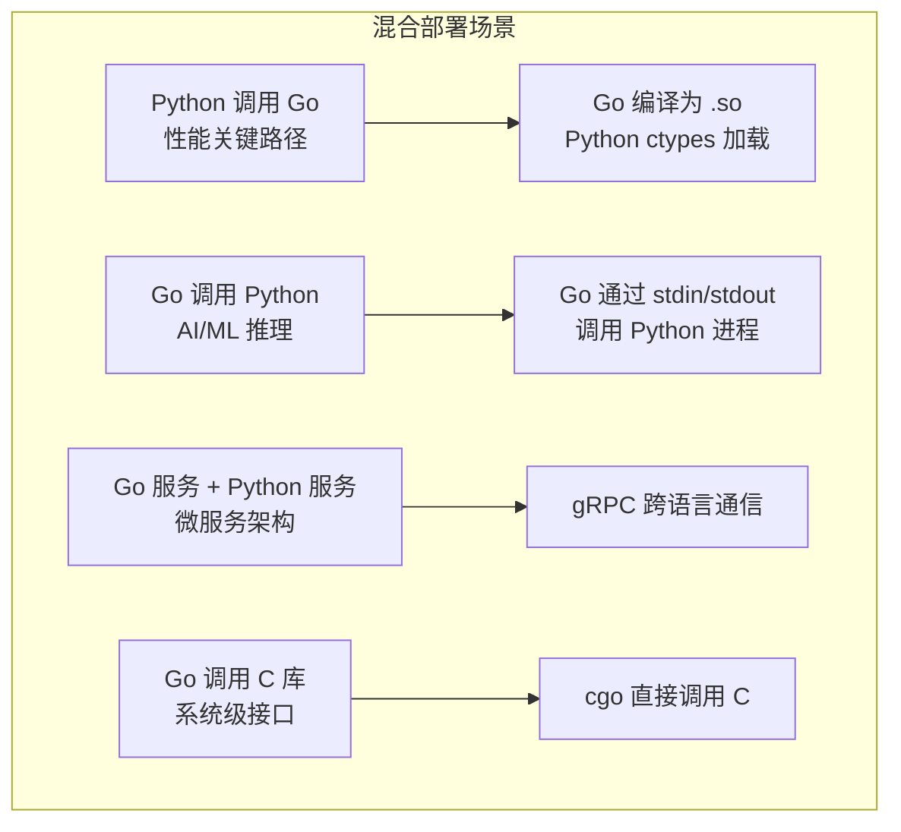

## 前置知识：什么时候需要 FFI

Python 生态丰富（AI/ML/数据分析），Go 性能优秀（并发/微服务/HTTP）。最佳实践不是"二选一"，而是**各取所长**。



> [!important] 核心认知
> - **Go 调用 Python**：用 stdin/stdout 或 gRPC，不建议嵌入 Python 解释器
> - **Python 调用 Go**：编译为 C 共享库（.so/.dll），Python ctypes 加载
> - **首选方案**：gRPC 跨语言通信（解耦、可扩展、可独立部署）

---

## 1. Python 调用 Go：编译为 .so 动态库

### Go 代码（编译为 C 共享库）

```go
package main

/*
#include <stdlib.h>  // 提供 C.free
*/
import "C"
import (
    "fmt"
    "unsafe"
)

// 注意 ABI：Go 的 int 在 64 位平台是 64 位，直接导出会与 Python 侧 c_int（32 位）错配。
// 导出函数的参数/返回值用 C.int（或 C.longlong，Python 侧对应改用 c_int64）。
//export Sum
func Sum(a, b C.int) C.int {
    return a + b
}

//export Greet
func Greet(name *C.char) *C.char {
    goName := C.GoString(name)
    result := fmt.Sprintf("Hello, %s! (from Go)", goName)
    return C.CString(result)  // C.CString 分配的 C 内存不受 Go GC 管理，须手动释放
}

//export Free
func Free(p *C.char) {
    C.free(unsafe.Pointer(p))  // 供 Python 侧释放 Greet 返回的字符串
}

func main() {}  // 必须，但不会被调用
```

```bash
# 编译为 C 共享库
go build -buildmode=c-shared -o go_lib.so go_lib.go
# 生成 go_lib.so 和 go_lib.h（C 头文件）
```

### Python 调用

```python
import ctypes

# 加载 Go 编译的共享库
lib = ctypes.CDLL("./go_lib.so")

# 调用 Sum 函数（Go 侧签名是 C.int，与 c_int 一致；若 Go 侧用 int，这里须改 c_int64）
lib.Sum.argtypes = [ctypes.c_int, ctypes.c_int]
lib.Sum.restype = ctypes.c_int
result = lib.Sum(3, 5)
print(f"Sum: {result}")  # Sum: 8

# 调用 Greet 函数（字符串）
lib.Greet.argtypes = [ctypes.c_char_p]
lib.Greet.restype = ctypes.c_void_p  # 用 c_void_p 保留原始指针，便于稍后释放
ptr = lib.Greet(b"World")
greeting = ctypes.cast(ptr, ctypes.c_char_p).value
print(greeting.decode())  # Hello, World! (from Go)
lib.Free(ptr)  # C.CString 的内存必须手动释放，否则泄漏
```

**注释**：Go 通过 `//export` 注释导出函数，`-buildmode=c-shared` 编译为 C 共享库。Python 用 `ctypes` 加载，需要定义参数类型和返回类型。两个 ABI 要点：① Go 的 `int` 在 64 位平台是 64 位，与 ctypes 的 `c_int`（32 位）不匹配——Go 侧签名用 `C.int`/`C.longlong`，或 Python 侧改用 `c_int64`；② `C.CString` 返回的字符串是 C 堆内存，Go GC 不会回收，需导出 `Free`（内部调 `C.free`）供 Python 侧释放。这是 Python 调用 Go 的最高性能方案。

---

## 2. Go 调用 Python：stdin/stdout 进程通信

### Go 代码（主进程）

```go
package main

import (
    "bytes"
    "encoding/json"
    "fmt"
    "os/exec"
)

type Input struct {
    Numbers []float64 `json:"numbers"`
}

type Output struct {
    Mean   float64 `json:"mean"`
    StdDev float64 `json:"std_dev"`
}

func main() {
    // Go 调用 Python 脚本进行数据分析
    input := Input{Numbers: []float64{1.0, 2.0, 3.0, 4.0, 5.0}}
    inputJSON, _ := json.Marshal(input)

    // 启动 Python 进程
    cmd := exec.Command("python", "analyze.py")
    cmd.Stdin = bytes.NewReader(inputJSON)
    var stderr bytes.Buffer
    cmd.Stderr = &stderr

    resultJSON, err := cmd.Output()
    if err != nil {
        fmt.Printf("Python error: %s\n", stderr.String())
        return
    }

    var output Output
    json.Unmarshal(resultJSON, &output)
    fmt.Printf("Mean: %.2f, StdDev: %.2f\n", output.Mean, output.StdDev)
}
```

### Python 代码（analyze.py）

```python
import sys
import json
import statistics

# 从 stdin 读取 JSON 输入
input_data = json.loads(sys.stdin.read())
numbers = input_data["numbers"]

# 计算统计量
result = {
    "mean": statistics.mean(numbers),
    "std_dev": statistics.stdev(numbers),
}

# 输出 JSON 到 stdout
print(json.dumps(result))
```

**注释**：Go 通过 `os/exec` 启动 Python 进程，stdin/stdout 传递 JSON 数据。这种方式简单可靠，适合偶尔调用 Python 的场景。

---

## 3. gRPC 跨语言通信（推荐方案）

### Go gRPC 服务端

```go
package main

import (
    "context"
    "net"

    "google.golang.org/grpc"
    pb "path/to/proto"
)

type server struct {
    pb.UnimplementedAnalyzerServer
}

func (s *server) Analyze(ctx context.Context, req *pb.AnalyzeRequest) (*pb.AnalyzeResponse, error) {
    // Go 处理高性能计算
    numbers := req.Numbers
    var sum float64
    for _, n := range numbers {
        sum += n
    }
    return &pb.AnalyzeResponse{Mean: sum / float64(len(numbers))}, nil
}

func main() {
    lis, _ := net.Listen("tcp", ":50051")
    s := grpc.NewServer()
    pb.RegisterAnalyzerServer(s, &server{})
    s.Serve(lis)
}
```

### Python gRPC 客户端

```python
import grpc
import analyzer_pb2, analyzer_pb2_grpc

channel = grpc.insecure_channel("localhost:50051")
stub = analyzer_pb2_grpc.AnalyzerStub(channel)

response = stub.Analyze(analyzer_pb2.AnalyzeRequest(numbers=[1.0, 2.0, 3.0]))
print(f"Mean: {response.mean}")  # Mean: 2.0
```

**注释**：gRPC 是跨语言通信的最佳方案——强类型 protobuf 定义、双向流、内置负载均衡。Go 和 Python 都有成熟的 gRPC 支持。

---

## 4. cgo 调用 C 库

```go
package main

/*
#include <stdio.h>
#include <stdlib.h>

void hello(const char* name) {
    printf("Hello from C, %s!\n", name);
}
*/
import "C"
import "unsafe"
import "fmt"

func main() {
    name := C.CString("Go")
    defer C.free(unsafe.Pointer(name))  // 必须手动释放
    C.hello(name)
    fmt.Println("Done")
}
```

**注释**：`import "C"` 前的注释块是 C 代码。`C.CString` 将 Go string 转为 C string（分配内存），**必须用 `C.free` 释放**，否则内存泄漏。`unsafe.Pointer` 是 Go 与 C 指针互转的桥梁。

> [!warning] cgo 的代价
> cgo 调用有上下文切换开销（~100ns）。注意：cgo 调用期间**并不是整个调度器无法切换 goroutine**——发起调用的 goroutine 所在的 OS 线程（M）会被 C 代码阻塞、该 goroutine 暂时不能迁移，但运行时会把这个 M 上的 P 交给其他 M，其余 goroutine 照常调度运行。**热路径中避免 cgo 调用**（固定开销 + 阻塞线程的代价）。

---

## 5. 技术选型矩阵

| 场景 | 推荐方案 | 原因 |
|------|---------|------|
| Go 服务调用 Python ML 模型 | **HTTP/gRPC** | 解耦，独立部署，调试方便 |
| Go 调用 Python 密集计算 | **cgo + Python C API** | 避免 IPC 开销 |
| Python 调用 Go 高性能函数 | **ctypes + .so** | Go 做计算密集型 |
| 共享 C 库 | **cgo + ctypes** | 两边都调同一个 C 库 |
| 混合部署（微服务） | **HTTP/gRPC** | 生产级方案，独立扩展 |

> [!important] 优先考虑 HTTP/gRPC
> FFI 只在以下场景值得使用：
> 1. **性能关键路径**：IPC 开销（1-5ms）不可接受
> 2. **嵌入式场景**：无法运行两个独立进程
> 3. **遗留系统集成**：必须共享内存空间

---

## 6. 性能对比

| 方案 | 调用延迟 | 吞吐量 | 开发复杂度 |
|------|---------|--------|----------|
| HTTP/gRPC | 1-5ms | 中 | 低 |
| cgo → Python C API | 100-500µs | 高 | 高 |
| ctypes → Go .so | 1-10µs | 极高 | 中 |
| 直接 Go 函数 | 1-10ns | 极高 | - |
| 直接 Python 函数 | 100-500ns | 中 | - |

---

## 🚨 Python 程序员写 Go 的常见错误

> [!warning] **坑 1：cgo 有性能开销**
> cgo 调用不是零成本——每次调用约 50-100ns 的 C↔Go 切换开销。热路径中频繁调用 cgo 会显著降低性能。

> [!warning] **坑 2：内存管理不同**
> Go 有 GC，Python 有引用计数。跨语言传递对象时，需明确内存所有权——Go 分配的内存由 Go 管理，Python 分配的内存由 Python 管理。

> [!warning] **坑 3：线程模型冲突**
> Python 的 GIL 和 Go 的 goroutine 调度模型不同。在 Go 中启动 Python 解释器时，需注意 GIL 的获取和释放。

---

## 🎯 练习

### 练习 1：ctypes 调 Go

编写一个 Go 函数做数组排序，编译为 `.so`，用 Python ctypes 调用。对比纯 Python 排序的性能差异。注释说明 `C.int` 和 Go `int` 的类型转换。

### 练习 2：Go 通过 stdin/stdout 调 Python

Go 程序调用 Python 的 `pandas` 做 CSV 统计，stdin/stdout 传递 JSON。注释说明数据传递格式。

### 练习 3：gRPC 跨语言通信

编写一个简单的 gRPC 服务（Go 服务端 + Python 客户端），protobuf 定义计算接口。注释说明 protobuf 的类型安全优势。

---

## 🎯 本文学完自检

| 层次 | 检查项 |
|------|--------|
| 🟢 基础 | 能用 `go build -buildmode=c-shared` 编译 Go 为 .so |
| 🟢 基础 | 能用 cgo 调用简单的 C 函数 |
| 🟡 进阶 | 能用 Python ctypes 调用 Go 编译的共享库 |
| 🟡 进阶 | 能对比 FFI 和 HTTP/gRPC 的性能差异 |
| 🔴 挑战 | 能在真实项目中做 FFI 技术选型，权衡性能与复杂度 |

---

## 相关笔记

- ⬅️ 前置：[[09-Go标准库实战-Python对照]] — 标准 C 库的使用
- ⬅️ 前置：[[10-Go性能调优入门-Python对照]] — cgo 性能分析
- 🔗 关联：[[06-Python有Go无与Go有Python无]] — FFI 是 Go 和 Python 的互补场景

---

*最后更新：2026-07-24*
