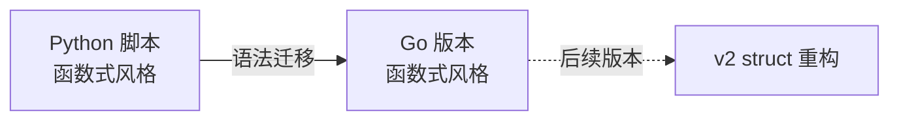

## 项目目标

将一个 Python 任务调度器迁移为 Go，**只做语法迁移，不改架构**。



---

## Python 原始代码

```python
import time
from datetime import datetime

tasks = [
    ("发送邮件", 2, 0.9),
    ("生成报告", 3, 0.8),
    ("数据备份", 5, 0.95),
    ("日志清理", 1, 1.0),
]

def run_task(name, duration, success_rate):
    print(f"[{datetime.now():%H:%M:%S}] 开始: {name} (预计 {duration}s)")
    time.sleep(duration)
    import random
    success = random.random() < success_rate
    return {
        "name": name, "success": success,
        "duration": duration,
        "timestamp": datetime.now().strftime("%H:%M:%S"),
    }

def main():
    results = []
    for name, duration, success_rate in tasks:
        result = run_task(name, duration, success_rate)
        status = "✅" if result["success"] else "❌"
        print(f"[{result['timestamp']}] {status} {result['name']}")
        results.append(result)
    succeeded = sum(1 for r in results if r["success"])
    print(f"\n=== 完成: {succeeded}/{len(results)} 成功 ===")

if __name__ == "__main__":
    main()
```

---

## Go 迁移版 v1

```go
package main

import (
    "fmt"
    "math/rand"
    "time"
)

// taskDef 任务定义（v1 用 struct 替代 Python 的 tuple）
type taskDef struct {
    name        string
    duration    float64
    successRate float64
}

// Result 结果用 struct 替代 Python 的 dict
type Result struct {
    Name      string
    Success   bool
    Duration  float64
    Timestamp string
}

// runTask 运行单个任务（等价 Python 的 def run_task）
func runTask(name string, duration, successRate float64) Result {
    fmt.Printf("[%s] 开始: %s (预计 %.1fs)\n",
        time.Now().Format("15:04:05"), name, duration)
    time.Sleep(time.Duration(duration * float64(time.Second)))
    return Result{
        Name: name, Success: rand.Float64() < successRate,
        Duration: duration, Timestamp: time.Now().Format("15:04:05"),
    }
}

func main() {
    fmt.Println("=== 任务调度器 v1 ===")
    tasks := []taskDef{
        {"发送邮件", 2, 0.9}, {"生成报告", 3, 0.8},
        {"数据备份", 5, 0.95}, {"日志清理", 1, 1.0},
    }

    var results []Result
    // range 返回 (索引, 值)，用 _ 忽略索引
    for _, t := range tasks {
        result := runTask(t.name, t.duration, t.successRate)
        status := "❌"
        if result.Success {
            status = "✅"
        }
        fmt.Printf("[%s] %s %s (%.1fs)\n",
            result.Timestamp, status, result.Name, result.Duration)
        results = append(results, result)
    }

    succeeded := 0
    for _, r := range results {
        if r.Success {
            succeeded++
        }
    }
    fmt.Printf("\n=== 完成: %d/%d 成功 ===\n", succeeded, len(results))
}
```

---

## 语法迁移对照表

| Python | Go | 注意事项 |
|--------|-----|---------|
| `time.sleep(2)` | `time.Sleep(2 * time.Second)` | Go 需指定 Duration 单位 |
| `datetime.now()` | `time.Now()` | Go 无日期/时间区分 |
| `"%H:%M:%S"` | `"15:04:05"` | Go 用固定时间作格式参考 |
| `random.random()` | `rand.Float64()` | Go 用 math/rand |
| `f"..."` | `fmt.Printf(...)` | Go 用 Printf 格式化 |
| `for x in list:` | `for _, x := range list` | range 返回索引和值 |
| `list.append(x)` | `results = append(results, x)` | append 返回新 slice |
| `sum(1 for ...)` | 循环 + `succeeded++` | Go 无推导式 |
| `if __name__` | `func main()` | Go 用 main 包 + main 函数 |

---

## 🎯 本版本自检

| 层次 | 检查项 |
|------|--------|
| 🟢 基础 | 能运行 `go run main.go`，输出与 Python 版本一致 |
| 🟡 进阶 | 能解释每个 Python 语法对应的 Go 语法 |
| 🔴 挑战 | 能独立把另一个 Python 脚本迁移到 Go |

---

## 相关笔记

- ⬅️ 前置：[[01-环境搭建与基础语法对比]]
- ➡️ 下一步：[[v2-struct与方法版]]
- 🔗 关联：[[00-Go 总览索引（Python 迁移版）]]

---

*最后更新：2026-07-24*