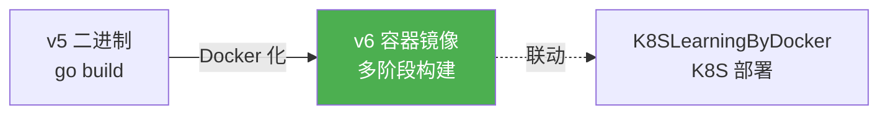
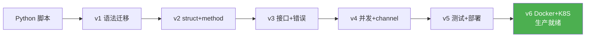

## 项目目标

**在 v5 基础上**：用 Docker 多阶段构建打包 Go 二进制，实现从 Python 脚本到容器化部署的完整迁移。



---

## 改造要点

| v5 | v6 | 改造维度 |
|----|----|---------|
| `go build` 本地编译 | Docker 多阶段构建 | 容器化 |
| 手动部署二进制 | `docker run` 一键部署 | 自动化 |
| 无镜像优化 | 多阶段构建最小镜像 | 镜像优化 |
| 无 K8S 衔接 | 镜像可直接用于 K8S | DevOps 链路 |

---

## Dockerfile（多阶段构建）

```dockerfile
# ========== Stage 1: 编译阶段 ==========
FROM golang:1.22-alpine AS builder

WORKDIR /app

# 先拷贝依赖文件（利用 Docker 缓存层）
COPY go.mod go.sum ./
RUN go mod download

# 拷贝源码
COPY . .

# 静态编译（CGO_ENABLED=0 确保纯静态二进制）
# 对比 Python: PyInstaller 无法做到真正的静态二进制
RUN CGO_ENABLED=0 GOOS=linux GOARCH=amd64 go build \
    -ldflags="-w -s" \
    -o scheduler \
    ./main.go

# ========== Stage 2: 运行阶段 ==========
FROM alpine:3.19

# 安装 ca-certificates（HTTPS 请求需要）和 tzdata（时区）
RUN apk --no-cache add ca-certificates tzdata

WORKDIR /app

# 从 builder 阶段拷贝编译好的二进制
COPY --from=builder /app/scheduler .

# 创建非 root 用户（安全最佳实践）
RUN adduser -D -u 1001 appuser
USER appuser

EXPOSE 8080

ENTRYPOINT ["./scheduler"]
```

**注释**：
- **多阶段构建**是 Go 的杀手级优势——Stage 1 用 `golang:1.22-alpine`（~350MB）编译，Stage 2 用 `alpine:3.19`（~7MB）运行。最终镜像 ~15MB。
- 对比 Python：即使打包成单一文件，Python 应用仍需基础镜像包含 Python 解释器（~150MB+）。
- `CGO_ENABLED=0` 确保纯静态二进制，可以在 `scratch` 镜像上运行。
- `-ldflags="-w -s"` 去掉调试信息，减小二进制体积约 30%。

---

## .dockerignore

```
.git
.gitignore
*.md
.env
.vscode/
.idea/
```

---

## docker-compose.yml

```yaml
version: '3.8'

services:
  scheduler:
    build:
      context: .
      dockerfile: Dockerfile
    container_name: scheduler
    ports:
      - "8080:8080"
    environment:
      - GOMAXPROCS=4
      - SCHEDULER_MAX_WORKERS=10
    restart: unless-stopped
    deploy:
      resources:
        limits:
          cpus: "0.5"
          memory: 128M
```

---

## Python vs Go Docker 部署对比

| 维度 | Python | Go |
|------|--------|-----|
| 基础镜像大小 | `python:3.12-slim` ~150MB | `golang:1.22-alpine` ~350MB（仅构建） |
| 运行镜像大小 | ~150-200MB | ~8-15MB |
| 多阶段构建 | 可行但仍需 Python 运行时 | 构建阶段用 Go，运行阶段只需二进制 |
| 静态编译 | 不可能 | `CGO_ENABLED=0` 实现纯静态 |
| 启动速度 | 2-5 秒（解释器初始化） | < 100ms（直接执行二进制） |
| 安全攻击面 | 较大（Python + 依赖） | 极小（仅静态二进制） |

---

## 构建和运行

```bash
# 构建镜像
docker build -t scheduler:latest .

# 查看镜像大小（对比 Python 镜像）
docker images scheduler
# REPOSITORY   TAG       SIZE
# scheduler    latest    15.2MB
# 对比：Python Flask 镜像通常 100-200MB

# 运行容器
docker run -d --name scheduler -p 8080:8080 scheduler:latest

# 查看日志
docker logs scheduler

# 停止和清理
docker stop scheduler && docker rm scheduler
```

---

## K8S 部署（联动 K8SLearningByDocker）

```yaml
# k8s/deployment.yaml
apiVersion: apps/v1
kind: Deployment
metadata:
  name: scheduler
  labels:
    app: scheduler
spec:
  replicas: 3
  selector:
    matchLabels:
      app: scheduler
  template:
    metadata:
      labels:
        app: scheduler
    spec:
      containers:
        - name: scheduler
          image: yourname/scheduler:v1.0.0
          ports:
            - containerPort: 8080
          resources:
            limits:
              cpu: "500m"
              memory: "128Mi"
            requests:
              cpu: "100m"
              memory: "64Mi"
          livenessProbe:
            httpGet:
              path: /health
              port: 8080
            initialDelaySeconds: 5
            periodSeconds: 10
---
apiVersion: v1
kind: Service
metadata:
  name: scheduler
spec:
  selector:
    app: scheduler
  ports:
    - port: 8080
      targetPort: 8080
  type: ClusterIP
```

```bash
# 推送到镜像仓库
docker tag scheduler:latest yourname/scheduler:v6
docker push yourname/scheduler:v6

# K8S 部署（K8SLearningByDocker 路径会详细讲解）
kubectl apply -f k8s/deployment.yaml
kubectl get pods -l app=scheduler
```

> [!tip] DevOps 链路
> 本镜像可直接用于 [[../../K8SLearningByDocker/00-K8S 总览索引（Docker 迁移版）|K8S 学习路径]] 中的 K8S 部署练习，形成 Go→Docker→K8S 完整链路。

---

## 🎯 本版本自检

| 层次 | 检查项 |
|------|--------|
| 🟢 基础 | 能用 `docker build` 构建多阶段镜像 |
| 🟡 进阶 | 能解释多阶段构建如何减小镜像体积 |
| 🔴 挑战 | 能对比 Python 和 Go 的 Docker 部署差异，部署到 K8S |

---

## 迁移完成总结



| 版本 | 改造维度 | Python 概念 → Go 概念 | 预计学时 |
|------|---------|----------------------|---------|
| v1 | 基础语法 | Python 脚本 → Go 语法 | 2h |
| v2 | struct+method | Python class → Go struct | 3h |
| v3 | 接口+错误 | try/except → error + interface | 3h |
| v4 | 并发+channel | asyncio → goroutine | 4h |
| v5 | 测试+部署 | pytest → go test + 交叉编译 | 4h |
| v6 | Docker+K8S | 容器化 → 多阶段构建 + K8S | 3h |

---

## 相关笔记

- ⬅️ 前置：[[v5-测试与部署版]] — 二进制编译基础
- 🔗 关联：[[00-Go 总览索引（Python 迁移版）]] — 路径总览
- 🔗 关联：[[../../K8SLearningByDocker/00-K8S 总览索引（Docker 迁移版）|K8S 学习路径]] — K8S 部署路径联动

---

*最后更新：2026-07-24*
