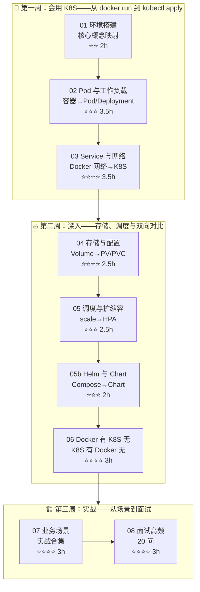

> [!important] 版本基线
> 本课程基于 **Kubernetes 1.30+ / kubectl 1.30+**。相关版本口径：
> - kubectl 的 `--record` 已在 **1.27** 移除（变更原因改用 `kubectl annotate ... kubernetes.io/change-cause`）
> - **dockershim** 已在 **1.24** 移除（节点运行时为 containerd 等 CRI 实现，Docker 构建的镜像仍可直接运行）
> - `ReadWriteOncePod` PV 访问模式 **1.27+** 默认可用
> - **🔄 2026-09 版本口径**：上游保持每年 3 个 minor 的节奏，已发布至 **1.37**（官方同时维护最近三个 minor，以 [kubernetes.io/releases](https://kubernetes.io/releases/) 为准）。本课程讲授的 Deployment/Service/HPA/Ingress 等均为稳定核心 API，在新版本上照常可用，正文无需因版本升级改写

> 📌 **本学习路径基于 [[../../03-AI工具/AI协作方法论/迁移式学习路径创建方法论]] 构建**，专为**有 Docker 经验的开发者**设计。以 Docker 为锚点，逐篇映射 Docker 概念到 K8S 等价物，辅以 Docker 有 K8S 无 / K8S 有 Docker 无的双向对比，由浅入深完成迁移。

---

## 📖 学习路径概览



---

## 🧭 角色导航

| 角色 | 背景 | 推荐路线 | 预计学时 |
|------|------|---------|---------|
| 🐳 **Docker 用户** | 用过 Docker/Compose，可能接触过 Swarm | 01→02→03→04→05→05b→06→07→08（全部） | 约 26h |
| 🚀 **Docker Swarm 用户** | 有 Swarm 集群经验 | 01 速览→02 速览→03 重点→04→05→05b→06 速览→07→08 | 约 22h |
| 🔧 **仅用过 Docker Compose** | 单机编排经验 | 全部学习路径，重点 02 和 05 | 约 25h |

### 🚀 背景速查：Docker 经验可跳过的内容

| 可快速浏览的内容 | 原因 | 何时需要深读 |
|-------------|------|-------------|
| 01 容器运行时概念 | containerd 就是 Docker 的底层运行时 | 遇到 CRI/OCI 规范时 |
| 02 Pod 内容器共享网络 | 与 `docker compose` 同一网络中的容器互访概念一致 | 遇到 Sidecar 模式和 Init Container 时 |
| 03 端口映射基础 | `-p 8080:80` 与 NodePort 逻辑一致 | 遇到 Ingress 和 LoadBalancer 时 |
| 04 Volume 挂载 | `-v /host:/container` 与 hostPath 逻辑一致 | 遇到 PV/PVC 动态供给时 |
| 05 副本扩缩 | `docker service scale` 与 `kubectl scale` 逻辑一致 | 遇到 HPA 自动扩缩时 |

---

## 📊 阶段总览

| 阶段 | 笔记数 | 预计学时 | 难度 | 核心目标 |
|------|--------|---------|------|---------|
| 第一周 | 3 篇 | 约 9h | ⭐⭐→⭐⭐⭐⭐ | 建立 Docker→K8S 概念映射，能部署 Pod 和 Service |
| 第二周 | 4 篇（含 05b） | 约 10h | ⭐⭐→⭐⭐⭐⭐ | 掌握存储、调度、扩缩容、Helm，建立双向对比认知 |
| 第三周 | 2 篇 | 约 6h | ⭐⭐⭐⭐ | 10 大场景实战，面试对答如流 |

> **总学时**：约 26h（Docker 开发者，9 篇核心笔记）+ 约 18h 毕业项目（v1-v6）= 约 44h

---

## 📋 笔记索引

### 第一周：会用

| 序号 | 笔记 | 难度 | 学时 | Docker 锚点 | K8S 目标 |
|------|------|------|------|------------|---------|
| 01 | [[01-环境搭建与核心概念映射]] | ⭐⭐ | 2h | `docker run` / 引擎架构 / CLI | `kubectl apply` / 控制平面 / 声明式 API |
| 02 | [[02-Pod 与工作负载：从容器到 Pod]] | ⭐⭐⭐ | 3.5h | 容器→Pod, Compose→Deployment, `docker run -d`→Deployment | Pod / Deployment / StatefulSet / DaemonSet |
| 03 | [[03-Service 与网络：从 Docker 网络到 K8S]] | ⭐⭐⭐⭐ | 3.5h | `-p`→Service, `--network`→CNI, 容器名→CoreDNS | Service / Ingress / CoreDNS / CNI |

### 第二周：深入

| 序号 | 笔记 | 难度 | 学时 | Docker 锚点 | K8S 目标 |
|------|------|------|------|------------|---------|
| 04 | [[04-存储与配置：从 Volume 到 PV-PVC]] | ⭐⭐⭐⭐ | 2.5h | Volume→PV/PVC, `-e`→ConfigMap/Secret, bind mount→hostPath | PV / PVC / StorageClass / ConfigMap / Secret |
| 05 | [[05-调度与扩缩容：从 scale 到 HPA]] | ⭐⭐⭐ | 2.5h | `docker service scale`→HPA, Swarm 调度→K8S Scheduler | HPA / VPA / 调度器 / 亲和性 / 污点 |
| 05b | [[05b-Helm 与 Chart 模板]] | ⭐⭐⭐ | 2h | Compose 多文件覆盖→values 多环境, Compose→Chart | Chart / values / 模板 / 子 Chart / Chart 仓库 |
| 06 | [[06-Docker有K8S无与K8S有Docker无]] | ⭐⭐⭐⭐ | 3h | Docker 独有特性 | K8S 独有特性（双向全景对比） |

### 第三周：实战

| 序号 | 笔记 | 难度 | 学时 | Docker 锚点 | K8S 目标 |
|------|------|------|------|------------|---------|
| 07 | [[01-学习/K8SLearningByDocker/07-业务场景实战合集|07-业务场景实战合集]] | ⭐⭐⭐⭐ | 3h | 10 大 Docker 场景 | 对应 K8S 实现 |
| 08 | [[08-面试高频20问-Docker背景版]] | ⭐⭐⭐⭐ | 3h | 每题带 Docker 对比视角 | K8S 视角回答 |

---

## 🗺️ Docker → K8S 核心概念映射速查

| Docker 概念 | K8S 等价 | 差异说明 |
|------------|---------|---------|
| `docker run` | `kubectl run` / `kubectl create deployment` | K8S 用 Deployment 包裹 Pod，不直接创建容器 |
| 容器 (Container) | Pod | Pod 可包含多个容器，共享网络和存储 |
| `docker compose` | Deployment + Service | K8S 将编排和网络分离为独立资源 |
| `docker service` | Deployment | K8S 的 Deployment 是声明式的，自动调和 |
| `docker service scale` | `kubectl scale` / HPA | K8S 支持自动扩缩（HPA/VPA） |
| `-p 8080:80` | Service (NodePort/LoadBalancer) | K8S 用 Service 对象抽象网络暴露 |
| `--network bridge` | CNI 插件 (Calico/Flannel) | K8S 网络模型更灵活，插件化 |
| `--network overlay` | CNI overlay (Flannel VXLAN) | Swarm overlay 对应 K8S CNI overlay |
| `-v volume:/data` | PV + PVC | K8S 将存储抽象为集群资源 |
| `-v /host:/container` | hostPath Volume | 直接挂载宿主机目录 |
| `-e VAR=value` | ConfigMap / Secret | K8S 将配置与容器解耦 |
| `docker secret` | K8S Secret | 两者概念相似，K8S 更细粒度 |
| `docker config` | ConfigMap | Swarm Config 对应 K8S ConfigMap |
| `docker stack deploy` | `kubectl apply -f` / Helm | K8S 用声明式 YAML 或 Helm Chart |
| `Dockerfile` | Dockerfile（镜像仍用 Docker 构建） | 镜像格式是 OCI 标准，K8S 也用 Docker 镜像 |
| `docker build` | `docker build`（构建不变） | K8S 不负责构建镜像，只负责运行 |
| `docker pull` | `docker pull`（拉取不变） | K8S 节点上的容器运行时自动拉取 |
| Swarm Manager | Control Plane (API Server/etcd/Scheduler/CM) | K8S 控制平面组件更丰富 |
| Swarm Worker | Worker Node (kubelet/kube-proxy) | K8S 工作节点组件更丰富 |
| Swarm Raft | etcd | K8S 用独立的 etcd 集群存储状态 |
| `docker stack` | Deployment + Service + ConfigMap + Secret | K8S 将 Stack 的概念拆分为多个独立资源 |
| `docker service update --rollback` | `kubectl rollout undo` | 两者都支持回滚 |
| `docker service ps` | `kubectl get pods` | 查看服务实例 |
| `docker node ls` | `kubectl get nodes` | 查看集群节点 |
| `docker network ls` | `kubectl get svc` / CNI | K8S 没有独立的"网络"列表概念 |
| `docker system prune` | 无直接等价 | K8S 不自动清理，需手动或 CronJob |

---

## ⚡ Docker → kubectl 速查卡片

| 你想做的事 | Docker 命令 | kubectl 命令 |
|-----------|------------|-------------|
| 启动应用 | `docker run -d nginx` | `kubectl create deployment nginx --image=nginx` |
| 查看运行实例 | `docker ps` | `kubectl get pods` |
| 查看日志 | `docker logs -f <c>` | `kubectl logs -f <pod>` |
| 进入容器 | `docker exec -it <c> sh` | `kubectl exec -it <pod> -- sh` |
| 端口映射 | `docker run -p 8080:80` | `kubectl expose deploy nginx --port=80 --type=NodePort` |
| 扩缩容 | `docker service scale web=5` | `kubectl scale deployment web --replicas=5` |
| 滚动更新 | `docker service update --image` | `kubectl set image deployment/web nginx=nginx:1.21` |
| 回滚 | `docker service rollback web` | `kubectl rollout undo deployment/web` |
| 清理 | `docker system prune -a` | `kubectl delete all --all` |
| 查看网络 | `docker network ls` | `kubectl get svc` / `kubectl get networkpolicies` |
| 查看卷 | `docker volume ls` | `kubectl get pv,pvc` |
| 查看节点 | `docker node ls` | `kubectl get nodes` |
| 查看配置 | `docker config ls` | `kubectl get configmaps,secrets` |

> [!tip] 完整速查卡片见 [[附录-Docker 到 kubectl 速查卡片]]
> 把它设成桌面壁纸，或打印贴在显示器边。Docker 老用户最痛苦的不是学不会 kubectl，而是下意识地敲 `docker ps`。每天对照一次，一周就能形成肌肉记忆。

---

## 📋 复习检查点索引

| 检查点 | 覆盖篇 | 难度 | 学时 | 核心练习 |
|--------|--------|------|------|----------|
| [[01-学习/K8SLearningByDocker/99-第一周复习检查点|99-第一周复习检查点]] | 01-03 | ⭐⭐ | 2h | 搭建 minikube→部署 Deployment→暴露 Service→验证 CoreDNS |
| [[01-学习/K8SLearningByDocker/99-第二周复习检查点|99-第二周复习检查点]] | 04-06 | ⭐⭐⭐ | 2h | PVC 动态供给→HPA 自动扩缩→双向对比选择题 |
| [[01-学习/K8SLearningByDocker/99-第三周复习检查点|99-第三周复习检查点]] | 07-08 | ⭐⭐⭐⭐ | 2h | Docker Compose→K8S 完整迁移→模拟面试 |

---

## 🚀 毕业项目：Web 应用 K8S 化 v1→v6

> 将一个 Docker Compose 多容器应用（Nginx + Flask + Redis + PostgreSQL）逐步迁移到 K8S。

| 版本 | 名称 | 难度 | 学时 | 核心改造 | Docker 锚点 |
|------|------|------|------|----------|------------|
| v1 | [[毕业项目-Web应用K8S化/v1-Deployment基础版]] | ⭐⭐ | 2h | 将容器转换为 Pod/Deployment | `docker run`→Deployment |
| v2 | [[毕业项目-Web应用K8S化/v2-Service网络版]] | ⭐⭐⭐ | 3h | 添加 Service/Ingress 网络层 | Compose 网络→Service |
| v3 | [[毕业项目-Web应用K8S化/v3-存储持久化版]] | ⭐⭐⭐ | 3h | PV/PVC 持久化 PostgreSQL | Volume→PVC |
| v4 | [[毕业项目-Web应用K8S化/v4-ConfigMap与Secret版]] | ⭐⭐⭐⭐ | 3h | 配置外部化 | `-e`/`--secret`→ConfigMap/Secret |
| v5 | [[毕业项目-Web应用K8S化/v5-Helm包管理版]] | ⭐⭐⭐⭐ | 4h | Helm Chart 打包 | `docker stack`→Helm |
| v6 | [[毕业项目-Web应用K8S化/v6-监控告警版]] | ⭐⭐⭐⭐ | 3h | Prometheus + Grafana 监控告警 | `docker stats`→Prometheus |

> **毕业项目总学时**：约 18h | **版本递进哲学**：每个版本只改一个维度，逐步从"能跑"到"可发布、可监控的生产级 Chart"

---

## 📐 质量审查报告

本学习路径的三维审查报告存放于 `reviews/` 目录：

| 报告 | 审查维度 | 文件 |
|------|----------|------|
| 结构审查 | 完整性、顺序、递进、引用、冗余 | [[reviews/01-结构审查报告]] |
| 技术校验 | API 一致性、代码可运行性、概念对齐 | [[reviews/02-技术校验报告]] |
| 体验优化 | 练习设计、巩固机制、差异化路径 | [[reviews/03-体验优化报告]] |

---

## 🛠️ 环境准备

| 工具 | 用途 | 安装命令 |
|------|------|---------|
| minikube（推荐） | 本地单节点 K8S | `curl -LO https://storage.googleapis.com/minikube/releases/latest/minikube-linux-amd64` |
| kind（备选） | Kubernetes in Docker | `go install sigs.k8s.io/kind@latest` |
| kubectl | K8S CLI | `curl -LO "https://dl.k8s.io/release/$(curl -L -s https://dl.k8s.io/release/stable.txt)/bin/linux/amd64/kubectl"` |
| Docker | 构建镜像 + minikube/kind 驱动 | 已安装 ✓ |
| Helm | 包管理（v5 毕业项目） | `curl https://raw.githubusercontent.com/helm/helm/main/scripts/get-helm-3 \| bash` |

```bash
# 快速验证环境
minikube start --driver=docker     # 用 Docker 驱动启动
kubectl cluster-info               # 验证集群状态
kubectl get nodes                  # 查看节点
kubectl create deployment nginx --image=nginx:alpine  # 第一个 K8S 部署！
kubectl get pods                   # 查看 Pod
kubectl delete deployment nginx    # 清理
```

> [!important] 版本说明
> 本课程基于 **Kubernetes 1.30+**。`minikube` 推荐使用 Docker 驱动（本机已安装 Docker）。K8S 1.24 起移除了 dockershim，但**镜像格式仍是 OCI 标准**，Docker 构建的镜像可以直接在 K8S 上运行。

---

## 🔗 相关笔记

- [[../../03-AI工具/AI协作方法论/迁移式学习路径创建方法论]] — 本学习路径的方法论来源
- [[../../03-AI工具/AI协作方法论/技术学习路径创建方法论]] — 通用创建方法论
- [[../../03-AI工具/AI协作方法论/技术学习路径审查与优化方法论]] — 配套审查方法论
- [[../DockerNew/00-Docker 总览索引]] — 迁移锚点：你已掌握的 Docker 知识
- [[../跨技术栈学习路径总览]] — 跨技术栈学习全景

---

## 📎 附录文件

| 附录 | 用途 |
|------|------|
| [[附录-Docker 到 kubectl 速查卡片]] | 命令级对照，随时查阅 |
| [[附录-K8S 术语表（Docker 视角对照）]] | 陌生术语速查 |
| [[附录-Compose 到 K8S 逐行对照]] | 完整迁移实战对照 |

---

*最后更新：2026-07-25*