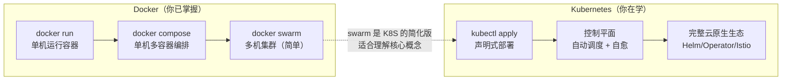
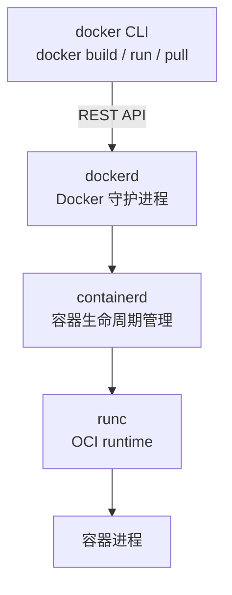
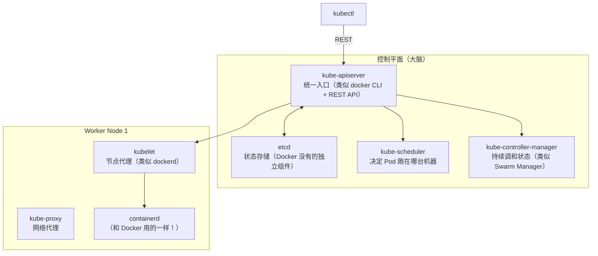
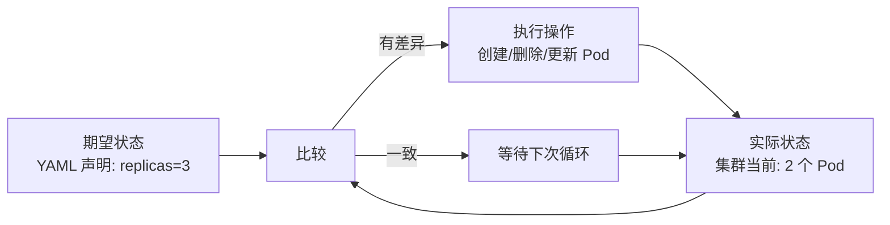
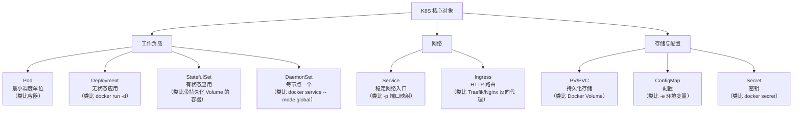

## 前置知识：Docker 和 K8S 的关系

你已经会用 Docker，现在需要理解 K8S 在 Docker 的基础上**解决了什么新问题**：



> [!important] Docker 是容器运行时，K8S 是容器编排平台
> • **Docker 解决**："怎么在一台机器上跑容器"（打包、运行、单机编排）
> • **K8S 解决**："怎么在几百台机器上管理几千个容器"（调度、扩缩、自愈、滚动更新、服务发现）
> • **K8S 1.24+ 不再用 Docker 作为运行时**，但**镜像格式是 OCI 标准**，Docker 构建的镜像可以直接在 K8S 上跑

---

## 1. 环境搭建：从 Docker 到 K8S

### 1.1 工具链对比

| 用途 | Docker | K8S |
|------|--------|-----|
| 本地开发环境 | Docker Desktop | minikube / kind / k3d |
| 命令行工具 | `docker` | `kubectl` |
| 守护进程 | `dockerd` | `kube-apiserver`（入口） |
| 运行时 | `containerd` / `runc` | `containerd` / `CRI-O`（一样！） |
| 镜像构建 | `docker build` | `docker build`（不变！） |
| 镜像仓库 | Docker Hub | Docker Hub / Harbor / ECR |
| 查看状态 | `docker ps` | `kubectl get pods` |
| 查看日志 | `docker logs` | `kubectl logs` |
| 进入容器 | `docker exec -it` | `kubectl exec -it` |
| 端口映射 | `-p 8080:80` | Service (NodePort) |
| 环境变量 | `-e VAR=value` | ConfigMap / Secret |
| 挂载目录 | `-v /host:/container` | hostPath / PV+PVC |
| 重启策略 | `--restart=always` | Deployment `restartPolicy` |

### 1.2 搭建 minikube（推荐入门）

```bash
# ===== Docker 方式：安装 Docker Desktop 即可 =====
# 你已经安装了 Docker，无需额外操作

# ===== K8S 方式：安装 minikube =====
# Linux
curl -LO https://storage.googleapis.com/minikube/releases/latest/minikube-linux-amd64
sudo install minikube-linux-amd64 /usr/local/bin/minikube

# macOS
brew install minikube

# Windows（PowerShell 管理员）
winget install minikube

# ===== 启动 K8S 集群（用 Docker 驱动，因为本机有 Docker）=====
minikube start --driver=docker --cpus=2 --memory=4096

# 验证
kubectl cluster-info           # 查看集群信息
kubectl get nodes              # 查看节点
kubectl get pods -A            # 查看所有命名空间的 Pod
```

> [!tip] 为什么用 Docker 驱动？
> minikube 会创建一个 Docker 容器，在容器内运行 K8S 的所有组件。因为本机已经有 Docker，这是最轻量的方式。你理解的 Docker 容器，现在成了 K8S 的载体。

### 1.3 备选方案：kind（Kubernetes in Docker）

```bash
# kind 比 minikube 更轻量，适合 CI/CD 和快速实验
go install sigs.k8s.io/kind@latest
# 或 brew install kind

# 创建集群
kind create cluster --name k8s-docker-learn
kubectl cluster-info
kubectl get nodes
```

### 1.4 kubectl 别名（对标 Docker CLI 习惯）

```bash
# Docker 用户习惯：docker ps / docker images / docker logs
# K8S 建议配置别名，提高效率
alias k='kubectl'
alias kgp='kubectl get pods'
alias kgd='kubectl get deployments'
alias kgs='kubectl get services'
alias kd='kubectl describe'
alias kl='kubectl logs'
alias ke='kubectl exec -it'
alias ka='kubectl apply -f'

# 添加到 ~/.bashrc 或 ~/.zshrc
echo "alias k='kubectl'" >> ~/.bashrc
source ~/.bashrc
```

### 1.5 为 YAML 指定 namespace（重要约定）

```yaml
# 所有示例 YAML 默认部署在 default 命名空间
# 生产环境建议显式指定 namespace
apiVersion: apps/v1
kind: Deployment
metadata:
  name: web
  namespace: default          # ★ 显式指定，避免误操作
```

---

## 2. 架构对比：Docker 引擎 vs K8S 控制平面

### 2.1 Docker 引擎架构（回顾）



一个守护进程 (`dockerd`) 管理一切：镜像、容器、网络、存储。

### 2.2 K8S 架构（新的认知模型）



| Docker 组件 | K8S 对应 | 差异 |
|------------|---------|------|
| `docker CLI` | `kubectl` | 风格不同，kubectl 是声明式为主 |
| `dockerd` | `kubelet`（部分）+ `kube-apiserver` | K8S 将单机守护进程拆分为控制平面 + 节点代理 |
| `containerd` | `containerd` | **完全一样！** K8S 也用 containerd 作为容器运行时 |
| `runc` | `runc` | **完全一样！** |
| 无 | `etcd` | K8S 独有的分布式 KV 存储，Docker 没有对标 |
| 无 | `kube-scheduler` | Docker 单机不需要调度器 |
| Swarm Manager | `kube-controller-manager` | K8S 有更丰富的内置控制器 |

> [!important] Docker 用了这么多年的 containerd 就是 K8S 的运行时
> 你在 Docker 中拉取的镜像（`nginx:alpine`、`python:3.12`），K8S 可以直接用。因为 K8S 的容器运行时（containerd）支持 OCI 标准镜像格式。

---

## 3. 命令式 vs 声明式：Docker 和 K8S 最大的思维差异

### 3.1 Docker 是命令式（你告诉它怎么做）

```bash
# Docker 命令式：每一步都显式指定
docker run -d --name web -p 8080:80 nginx:alpine
docker stop web
docker rm web
docker run -d --name web2 -p 8081:80 nginx:alpine  # 换端口重来
```

### 3.2 K8S 是声明式（你告诉它要什么，它自己调和）

```yaml
# deployment.yaml —— 声明式："我要 3 个 Nginx，用 100m CPU，端口 80"
apiVersion: apps/v1
kind: Deployment
metadata:
  name: nginx
spec:
  replicas: 3
  selector:
    matchLabels:
      app: nginx
  template:
    metadata:
      labels:
        app: nginx
    spec:
      containers:
      - name: nginx
        image: nginx:alpine
        ports:
        - containerPort: 80
        resources:
          requests:
            cpu: "100m"
            memory: "128Mi"
```

```bash
kubectl apply -f deployment.yaml  # 声明式：提交期望状态
# 如果 Pod 挂了，K8S 自动重建 → 不需要手动 docker restart
# 如果要改成 5 个副本 → 改 replicas: 5 → kubectl apply → 自动扩缩
```

> [!important] 声明式 vs 命令式的核心区别
> • **命令式**：你告诉系统"做什么"（`docker run`、`docker stop`）
> • **声明式**：你告诉系统"要什么状态"（`replicas=3`、`image=nginx`），系统持续工作让集群达到那个状态
> • **声明式的优势**：自愈（Pod 挂了自动重建）、可重复（`kubectl apply` 多次执行无副作用）、可审计（YAML 纳入 git 管理）

---

## 4. Controller 模式：K8S 的灵魂

### 4.1 Reconcile Loop（协调循环）



```python
# Controller 模式的伪代码——所有 K8S 控制器都是这个逻辑
while True:
    desired = get_desired_state()   # 从 YAML/API 读取期望状态
    actual = get_actual_state()     # 从 etcd/集群读取实际状态

    if desired != actual:
        reconcile(desired, actual)  # 执行操作，向期望状态靠拢

    sleep(reconcile_interval)       # 等待下一次循环
```

### 4.2 Docker 与 K8S 的状态管理差异

| 维度 | Docker | K8S |
|------|--------|------|
| 状态管理 | 命令式，用户维护 | 声明式，控制器自动维护 |
| 容器挂了 | 手动重启或配置 restart | 控制器自动重建 |
| 扩缩容 | `docker service scale` | `kubectl scale` / HPA |
| 回滚 | `docker service rollback` | `kubectl rollout undo` |

---

## 5. 第一个 K8S 部署：从 `docker run` 到 `kubectl`

### 5.1 Docker 方式（你熟悉的）

```bash
docker run -d --name my-nginx -p 8080:80 nginx:alpine
curl http://localhost:8080
# 看到 Nginx 欢迎页
docker stop my-nginx && docker rm my-nginx
```

### 5.2 K8S 方式（新学）

```bash
# 方式一：命令式（接近 docker run，适合快速实验）
kubectl create deployment my-nginx --image=nginx:alpine --port=80
kubectl get pods
kubectl get deployments

# 暴露端口（类似 docker run -p 8080:80）
kubectl expose deployment my-nginx --port=80 --type=NodePort
kubectl get svc my-nginx

# 查看 NodePort 端口号（如 31234）
minikube service my-nginx --url
# http://192.168.49.2:31234

# 清理
kubectl delete deployment my-nginx
kubectl delete svc my-nginx
```

```bash
# 方式二：声明式（推荐，适合生产）
# 创建 nginx-deploy.yaml
cat > nginx-deploy.yaml << 'EOF'
apiVersion: apps/v1
kind: Deployment
metadata:
  name: my-nginx
spec:
  replicas: 2
  selector:
    matchLabels:
      app: nginx
  template:
    metadata:
      labels:
        app: nginx
    spec:
      containers:
      - name: nginx
        image: nginx:alpine
        ports:
        - containerPort: 80
---
apiVersion: v1
kind: Service
metadata:
  name: my-nginx-svc
spec:
  type: NodePort
  selector:
    app: nginx
  ports:
  - port: 80
    targetPort: 80
EOF

kubectl apply -f nginx-deploy.yaml
kubectl get pods,svc
minikube service my-nginx-svc --url
# 清理
kubectl delete -f nginx-deploy.yaml
```

### 5.3 CLI 命令对照

| 操作 | Docker CLI | kubectl |
|------|-----------|---------|
| 启动容器/部署 | `docker run -d nginx` | `kubectl create deployment nginx --image=nginx` |
| 查看运行中 | `docker ps` | `kubectl get pods` |
| 查看日志 | `docker logs <container>` | `kubectl logs <pod>` |
| 进入容器 | `docker exec -it <container> sh` | `kubectl exec -it <pod> -- sh` |
| 停止 | `docker stop <container>` | `kubectl delete pod <pod>`（控制器会重建！） |
| 删除 | `docker rm <container>` | `kubectl delete deployment <name>` |
| 查看资源 | `docker stats` | `kubectl top pods` |
| 端口映射 | `-p 8080:80` | `kubectl expose` / Service YAML |
| 环境变量 | `-e VAR=value` | ConfigMap / Secret |

---

## 6. K8S 核心对象速览



| K8S 对象 | Docker 类比 | 一句话理解 |
|---------|------------|-----------|
| **Pod** | 容器组 | 一个或多个容器，共享网络和存储 |
| **Deployment** | `docker run -d` + `--restart=always` | 管理 Pod 的副本数、滚动更新 |
| **Service** | `-p 8080:80` + 负载均衡 | 给 Pod 提供稳定的网络入口 |
| **ConfigMap** | `-e VAR=value` | 将配置从容器中解耦 |
| **Secret** | `docker secret` | 敏感信息（密码、证书） |
| **PersistentVolume** | `docker volume` | 持久化存储，Pod 删了数据还在 |
| **Namespace** | Docker 没有直接对应 | 逻辑隔离（类似 Docker Compose 的项目名） |

---

## 🧪 实践练习

> 以下练习按难度递进，完成 🟢 基础项后建议再挑战 🟡 和 🔴。

### 🟢 基础练习 1：环境搭建与第一个部署

```bash
# 1. 启动 minikube（或 kind）
minikube start --driver=docker
# 验证：kubectl get nodes 能看到一个 Ready 节点

# 2. 部署第一个应用
kubectl create deployment hello --image=nginx:alpine --port=80
# 验证：kubectl get pods 能看到一个 Running 的 Pod

# 3. 暴露服务
kubectl expose deployment hello --type=NodePort --port=80
# 验证：kubectl get svc hello 能看到分配的端口

# 4. 访问应用
minikube service hello --url
# 在浏览器访问返回的 URL，看到 Nginx 欢迎页

# 5. 查看日志
kubectl logs deployment/hello
# 应该能看到 Nginx 的访问日志

# 6. 进入容器
kubectl exec -it deployment/hello -- sh
# 在容器内执行：cat /etc/nginx/nginx.conf
# 退出：exit

# 7. 清理
kubectl delete deployment hello
kubectl delete svc hello
```

### 🟢 基础练习 2：对比 Docker 和 K8S 的命令

```bash
# 同一个 Nginx 应用，两种方式对比

# ===== Docker 方式 =====
docker run -d --name nginx-docker -p 8080:80 nginx:alpine
curl http://localhost:8080
docker stop nginx-docker && docker rm nginx-docker

# ===== K8S 方式 =====
kubectl create deployment nginx-k8s --image=nginx:alpine
kubectl expose deployment nginx-k8s --type=NodePort --port=80
minikube service nginx-k8s --url
curl <URL>
kubectl delete deployment nginx-k8s
kubectl delete svc nginx-k8s

# 对比观察：
# - Docker：直接 docker run，容器名固定
# - K8S：create deployment → Pod 名随机后缀，expose → Service 提供入口
```

### 🟡 进阶练习：声明式部署与多副本

```bash
# 1. 创建以下 YAML 文件（multi-nginx.yaml）
# 要求：3 个副本，每个用 128Mi 内存，80 端口
# 提示：参考上面的 nginx-deploy.yaml 示例

# 2. 用 kubectl apply 部署
kubectl apply -f multi-nginx.yaml

# 3. 验证 3 个 Pod 都 Running
kubectl get pods -o wide
# 观察每个 Pod 的名称和 IP

# 4. 模拟 Pod 故障：删除一个 Pod
kubectl delete pod <pod-name>
# 观察：K8S 自动创建新 Pod 替代（自愈能力！）

# 5. 查看事件
kubectl get events --sort-by='.lastTimestamp'
# 追踪 Pod 从创建到运行的完整事件流

# 6. 验证声明式幂等性
kubectl apply -f multi-nginx.yaml
kubectl apply -f multi-nginx.yaml
# 第二次应该输出 "unchanged"，这就是声明式的幂等性
```

### 🔴 挑战练习：架构理解与对比

```bash
# 1. 画出 K8S 控制平面 + 工作节点的架构图
# 要求：标注每个组件的职责

# 2. 对比 Docker 引擎架构和 K8S 架构的差异
# 写出至少 5 个关键差异点

# 3. 在 minikube 内部查看 K8S 系统组件
kubectl get pods -n kube-system
# 识别每个 Pod 的作用（apiserver、etcd、scheduler、controller-manager、coredns、kube-proxy）

# 4. 用 kubectl explain 探索 API 资源
kubectl explain deployment.spec
kubectl explain pod.spec.containers
# 理解 K8S API 的层级结构

# 5. 用 describe 追踪 Pod 生命周期
kubectl describe pod <pod-name>
# 找到 Events 段，理解 Scheduled → Pulling → Created → Started 流程
```

---

## 常见错误排查速查

| 错误现象 | 排查命令 | 原因 | 解决方案 |
|---------|---------|------|----------|
| Pod 处于 `Pending` | `kubectl describe pod <pod>` | 资源不足 / 节点污点 / PVC 未绑定 | 扩容节点 / 添加 toleration / 检查 PVC |
| Pod 处于 `CrashLoopBackOff` | `kubectl logs <pod>` + `kubectl describe pod <pod>` | 应用启动失败 / livenessProbe 失败 | 查看日志 / 调整探针参数 |
| Pod 处于 `ImagePullBackOff` | `kubectl describe pod <pod>` | 镜像拉取失败 | 检查镜像名、仓库权限、`imagePullPolicy` |
| Pod 处于 `ErrImagePull` | `kubectl describe pod <pod>` | 镜像不存在或认证失败 | 核对镜像 tag，配置 `imagePullSecrets` |
| `kubectl apply` 报 "already exists" | `kubectl get <resource>` | 混用了 `create` 和 `apply` | 改用 `kubectl apply`，或先 `kubectl delete -f` |
| NodePort 访问不通 | `minikube service <svc> --url` | minikube IP 不是 localhost | 用 minikube service 或 `kubectl port-forward` |
| 无法连接 Service | `kubectl get endpoints <svc>` | Service selector 标签不匹配 | 核对 Pod labels 和 Service selector |
| DNS 解析失败 | `kubectl get pods -n kube-system -l k8s-app=kube-dns` | CoreDNS 未运行 | 检查 CoreDNS Pod / 配置 |

---

## 常见易错点

> [!warning] **坑 1：`kubectl create` 和 `kubectl apply` 混用**
> ```bash
> # ❌ create 是命令式，重复执行报错
> kubectl create -f deploy.yaml
> kubectl create -f deploy.yaml  # Error: already exists
>
> # ✅ apply 是声明式，可重复执行
> kubectl apply -f deploy.yaml
> kubectl apply -f deploy.yaml  # 无副作用
> ```
> **为什么错**：命令式和声明式混用会导致状态不一致。
> **解决方案**：始终优先用 `kubectl apply`，把 YAML 纳入 git 管理。

> [!warning] **坑 2：`docker run` 思维迁移到 K8S**
> ```bash
> # ❌ 试图在 K8S 中找 docker run 的等价物
> # K8S 不直接运行容器，而是创建 Deployment → Pod → 容器
>
> # ✅ 正确思维
> # docker run -d nginx → kubectl create deployment nginx --image=nginx
> # docker ps            → kubectl get pods
> # docker stop          → kubectl delete pod（但控制器会重建！）
> ```
> **为什么错**：Docker 是单机容器管理，K8S 是集群编排。思维模型不同。
> **解决方案**：养成"先写 YAML，再 apply"的习惯。

> [!warning] **坑 3：直接创建裸 Pod**
> ```bash
> # ❌ 直接创建 Pod 没有自愈能力
> kubectl run nginx --image=nginx:alpine  # 创建的是 Pod！
>
> # ✅ 用 Deployment 包裹
> kubectl create deployment nginx --image=nginx:alpine
> ```
> **为什么错**：裸 Pod 挂了不会被重建。
> **解决方案**：生产环境永远用 Deployment/StatefulSet 等控制器管理 Pod。

> [!warning] **坑 4：`kubectl delete pod` 后 Pod 又出现了**
> ```bash
> kubectl delete pod nginx-abc123
> # Pod 被删了，但立刻又出现新的！
> ```
> **为什么错**：Deployment 控制器发现实际副本数 < 期望副本数 → 自动创建新 Pod。
> **解决方案**：要删除 Pod，先删除 Deployment（`kubectl delete deployment nginx`）。

> [!warning] **坑 5：minikube IP 不是 localhost**
> ```bash
> # ❌ curl http://localhost:8080  # 可能不通
> # NodePort 服务绑定在 minikube 的 VM/容器 IP 上
>
> # ✅ 用 minikube service 获取正确 URL
> minikube service my-service --url
> # 或
> kubectl port-forward svc/my-service 8080:80
> curl http://localhost:8080  # 这样才对
> ```
> **为什么错**：minikube 在 Docker 容器或 VM 中运行，有独立 IP。
> **解决方案**：用 `minikube service` 或 `kubectl port-forward` 访问。

> [!warning] **坑 6：YAML 缩进错误**
> ```yaml
> # ❌ 缩进不对
> spec:
> containers:        # 应该缩进 2 格
> - name: nginx
>
> # ✅ 正确缩进（2 空格）
> spec:
>   containers:
>   - name: nginx
>     image: nginx
> ```
> **为什么错**：K8S YAML 严格遵循 2 空格缩进。
> **解决方案**：用 VS Code + Kubernetes 扩展实时校验，或 `kubectl apply --dry-run=client -f deploy.yaml` 预检。

> [!warning] **坑 7：忘记设置 kubectl 的默认命名空间**
> ```bash
> # 每次都要加 -n 很烦
> kubectl get pods -n dev
>
> # ✅ 设置默认命名空间
> kubectl config set-context --current --namespace=dev
> kubectl get pods  # 现在默认查 dev 命名空间
> ```
> **为什么错**：不设置默认命名空间，每次操作都要带 `-n`，容易遗漏。
> **解决方案**：用 `kubectl config set-context` 设置默认命名空间。

---

## 🎯 本文学完自检

| 层次 | 检查项 |
|------|--------|
| 🟢 基础 | 能用 minikube 启动 K8S 集群，用 `kubectl create deployment` 部署一个 Nginx 并访问 |
| 🟢 基础 | 能列出 `docker run` → `kubectl create deployment`、`docker ps` → `kubectl get pods` 等常用命令对照 |
| 🟡 进阶 | 能画出 K8S 控制平面 + 工作节点架构图，解释每个组件的职责 |
| 🟡 进阶 | 能解释声明式 vs 命令式的区别，并说明为什么生产环境用声明式 |
| 🔴 挑战 | 能在 minikube 上用 `kubectl get events --watch` 追踪一个 Pod 从创建到运行的完整事件流，并解释每一步 |

---

## 相关笔记

- ⬅️ 前置：[[00-K8S 总览索引（Docker 迁移版）]] — 回到课程总览
- ⬅️ 前置：[[../DockerNew/01-初识 Docker：从安装到运行你的第一个容器]] — 回顾 Docker 容器本质与基本操作
- ➡️ 后续：[[02-Pod 与工作负载：从容器到 Pod]] — 学完环境搭建后，深入 Pod 和 Deployment 实战
- ➡️ 后续：[[03-Service 与网络：从 Docker 网络到 K8S]] — 理解 K8S 的网络模型

---

*最后更新：2026-07-23*