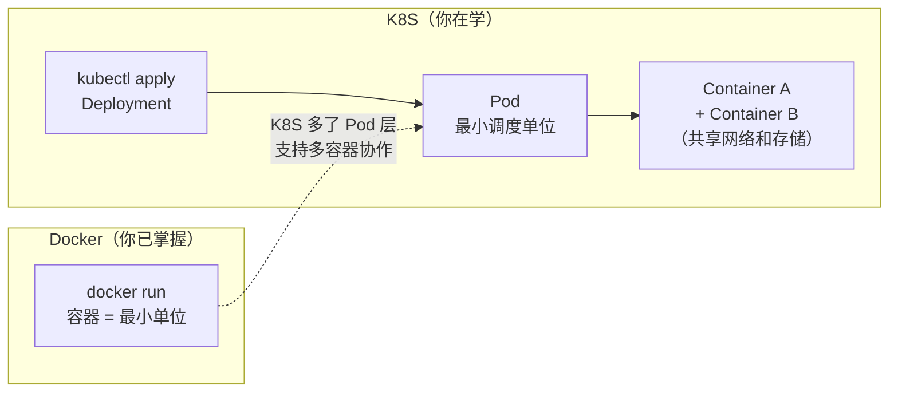
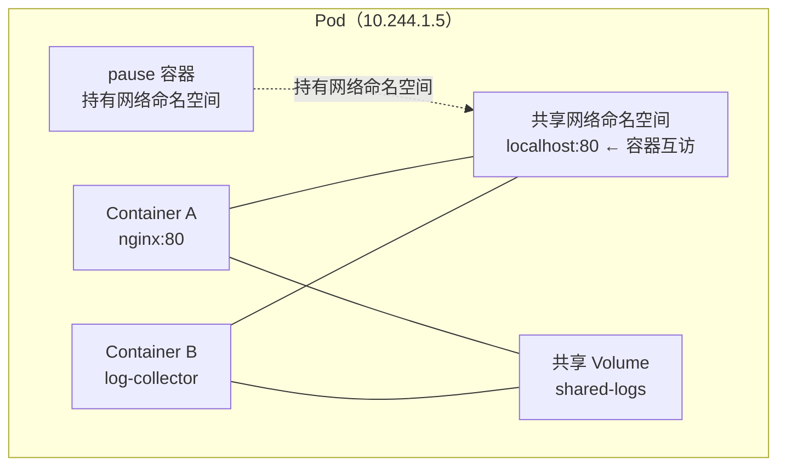
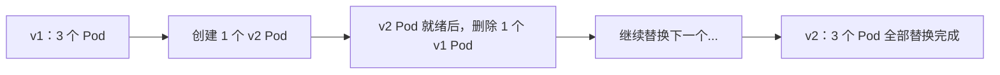
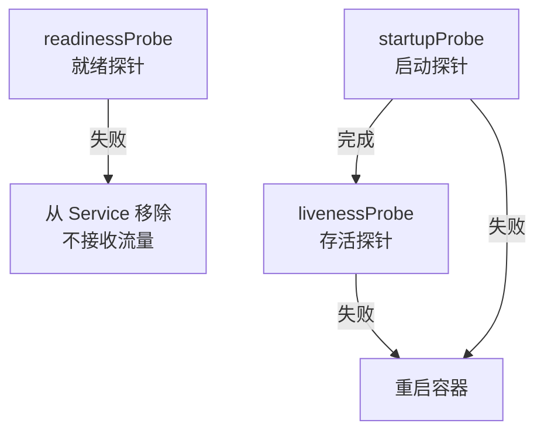

## 前置知识：Docker 容器 vs K8S Pod

你已经熟悉 Docker 容器。现在需要理解 K8S 的**核心抽象升级**：**Pod**。



> [!important] 为什么要引入 Pod？
> • Docker 的最小单位是**容器**，K8S 的最小单位是**Pod**
> • Pod = 一组共享网络和存储的容器，同生共死、一起调度
> • **你以前在 Docker 中的单容器习惯，在 K8S 中就是只含一个容器的 Pod**

### Docker 容器 vs K8S Pod 对照

| 维度 | Docker 容器 | K8S Pod |
|------|------------|---------|
| 最小单位 | 是 | 否（Pod 是最小调度单位） |
| 网络共享 | 需要同一 `--network` | Pod 内容器自动共享同一 IP |
| 存储共享 | 需要 `--volumes-from` | Pod 内容器自动共享 Volume |
| 调度单位 | 容器本身 | Pod |
| 生命周期 | 容器退出即终止 | Pod 内所有容器一起调度和终止 |
| 多进程 | 不推荐（PID 1 问题） | 用多容器替代多进程 |

---

## 1. Pod 详解：从容器到容器组

### 1.1 Pod 的结构



| Pod 特性 | 说明 | Docker 类比 |
|---------|------|------------|
| 共享网络 | 同一 Pod 内容器通过 localhost 互访 | `docker run --network container:xxx` |
| 共享存储 | 同一 Pod 内容器共享 Volume | Compose 同服务多容器共享 Volume |
| 共享生命周期 | 同生共死，一起调度 | 无直接类比 |
| 临时性 | Pod 是临时的，随时可能被销毁重建 | 容器也类似，但 Pod 更强调"用完即弃" |

### 1.2 第一个 Pod（对比 Docker run）

```bash
# ===== Docker 方式：直接创建容器 =====
docker run -d --name web -p 80:80 nginx:alpine

# ===== K8S 方式：通过 Deployment 创建 Pod =====
# 命令式（实验用）
kubectl create deployment web --image=nginx:alpine --port=80
kubectl get pods -o wide
# NAME                   READY   STATUS    IP            NODE
# web-5d59d67564-abcde  1/1     Running   10.244.1.5   minikube-m02
```

```yaml
# 声明式（生产用）：web-deployment.yaml
apiVersion: apps/v1
kind: Deployment
metadata:
  name: web
spec:
  replicas: 1                      # 对标 docker run -d（单个实例）
  selector:
    matchLabels:
      app: web
  template:                        # Pod 模板
    metadata:
      labels:
        app: web
    spec:
      containers:
      - name: nginx
        image: nginx:alpine
        ports:
        - containerPort: 80
```

### 1.3 多容器 Pod（Sidecar 模式）

```yaml
# Docker Compose 中紧密耦合的容器，在 K8S 中用多容器 Pod 实现
apiVersion: v1
kind: Pod
metadata:
  name: web-with-logger
spec:
  containers:
  - name: web            # 主容器
    image: nginx:alpine
    ports:
    - containerPort: 80
    volumeMounts:
    - name: shared-logs
      mountPath: /var/log/nginx

  - name: log-collector  # Sidecar 容器
    image: alpine
    command: ["sh", "-c", "tail -f /var/log/nginx/access.log"]
    volumeMounts:
    - name: shared-logs
      mountPath: /var/log/nginx

  volumes:
  - name: shared-logs
    emptyDir: {}          # Pod 生命周期内的临时存储
```

```bash
kubectl apply -f multi-container-pod.yaml
kubectl get pods
# NAME                READY   STATUS
# web-with-logger     2/2     Running  ← 2 个容器都 Ready

# 验证两个容器共享网络（localhost 互访）
kubectl exec -it web-with-logger -c log-collector -- wget -qO- http://localhost:80
# 看到 Nginx 欢迎页！

# 验证共享 Volume
kubectl exec -it web-with-logger -c web -- sh -c "echo 'test' >> /var/log/nginx/access.log"
kubectl exec -it web-with-logger -c log-collector -- cat /var/log/nginx/access.log
# log-collector 能看到 web 写入的日志！
```

> [!tip] 从 Docker Compose 到 Pod 的思维转换
> Docker Compose 中多个服务通过 `networks` 关联。K8S 中，**紧密耦合的容器**应放在同一 Pod 内（共享 localhost），**松耦合的服务**应放在各自独立 Pod 中（通过 Service 通信）。

> [!important] Sidecar 模式是 Docker 难以做到的
> Docker 中两个容器共享文件需要 `--volumes-from`，而且网络隔离。K8S 的 Pod 让 Sidecar 模式变得自然——两个容器在同一 Pod 内，通过 `localhost` 互访，通过共享 Volume 交换文件。

---

## 2. Deployment：`docker run -d --restart=always` 的升级版

### 2.1 Deployment 对标 Docker 命令

| Docker 操作 | K8S Deployment | 说明 |
|------------|----------------|------|
| `docker run -d nginx` | `replicas: 1` | 单实例 |
| `docker run -d --restart=always` | Deployment 自带自愈 | Pod 挂了自动重建 |
| `docker service create --replicas 3` | `replicas: 3` | 3 个副本 |
| `docker service scale web=5` | `kubectl scale deployment web --replicas=5` | 扩缩容 |
| `docker service update --image nginx:1.27` | `kubectl set image deployment/web nginx=nginx:1.27-alpine` | 更新镜像 |
| `docker service rollback` | `kubectl rollout undo deployment/web` | 回滚 |
| 无对标（镜像历史是 `docker image history`，服务没有 history 子命令） | `kubectl rollout history deployment/web` | 查看历史 |

### 2.2 生产级 Deployment 完整示例

```yaml
# deployment-full.yaml
apiVersion: apps/v1
kind: Deployment
metadata:
  name: web-app
  labels:
    app: web-app
spec:
  replicas: 3                     # 对标 docker service create --replicas 3
  selector:
    matchLabels:
      app: web-app
  strategy:                        # 滚动更新策略
    type: RollingUpdate
    rollingUpdate:
      maxSurge: 1                  # 滚动更新时最多多出 1 个 Pod
      maxUnavailable: 0            # 滚动更新时不允许减少可用 Pod（零停机）
  template:
    metadata:
      labels:
        app: web-app
    spec:
      containers:
      - name: nginx
        image: nginx:1.27-alpine   # ★ 指定版本，不用 latest！
        ports:
        - containerPort: 80
        resources:                 # 对标 docker run --memory --cpus
          requests:                # 最低保证（调度依据）
            cpu: "100m"            # 0.1 核
            memory: "128Mi"
          limits:                  # 上限
            cpu: "200m"
            memory: "256Mi"
        livenessProbe:             # 存活探针（Docker 没有原生）
          httpGet:
            path: /
            port: 80
          initialDelaySeconds: 10
          periodSeconds: 5
        readinessProbe:            # 就绪探针（Docker 没有原生）
          httpGet:
            path: /
            port: 80
          initialDelaySeconds: 5
          periodSeconds: 3
```

```bash
kubectl apply -f deployment-full.yaml
kubectl get deployments
kubectl get pods -o wide
kubectl describe deployment web-app

# 扩缩容
kubectl scale deployment web-app --replicas=5

# 更新镜像
kubectl set image deployment/web-app nginx=nginx:1.27.2-alpine
kubectl rollout status deployment/web-app  # 观察滚动更新

# 回滚
kubectl rollout undo deployment/web-app
kubectl rollout history deployment/web-app  # 查看历史版本
```

### 2.3 滚动更新详解



| 参数 | 作用 | 默认值 |
|------|------|--------|
| `maxSurge` | 滚动更新时最多超出几个 Pod | 25% |
| `maxUnavailable` | 滚动更新时最多几个 Pod 不可用 | 25% |

> [!important] 生产环境滚动更新策略
> 设置 `maxUnavailable: 0` + `maxSurge: 1`，保证更新期间始终有足够 Pod 可用，实现零停机部署。

---

## 3. StatefulSet：有状态应用的 K8S 方案

### 3.1 Docker 带持久化的容器 → StatefulSet

```yaml
# Docker Compose 有状态应用
services:
  postgres:
    image: postgres:15
    volumes:
      - pgdata:/var/lib/postgresql/data
```

```yaml
# K8S StatefulSet
apiVersion: apps/v1
kind: StatefulSet
metadata:
  name: mysql
spec:
  serviceName: mysql-headless    # ★ 必须关联 Headless Service
  replicas: 3
  selector:
    matchLabels:
      app: mysql
  template:
    metadata:
      labels:
        app: mysql
    spec:
      containers:
      - name: mysql
        image: mysql:8.0
        env:
        - name: MYSQL_ROOT_PASSWORD
          value: "secret"
        volumeMounts:
        - name: data
          mountPath: /var/lib/mysql
  volumeClaimTemplates:           # ★ StatefulSet 独有：自动创建 PVC
  - metadata:
      name: data
    spec:
      accessModes: ["ReadWriteOnce"]
      resources:
        requests:
          storage: 10Gi
---
apiVersion: v1
kind: Service
metadata:
  name: mysql-headless
spec:
  clusterIP: None                # ★ Headless Service
  selector:
    app: mysql
  ports:
  - port: 3306
```

```bash
kubectl apply -f statefulset.yaml
kubectl get pods -l app=mysql
# NAME      READY   STATUS    AGE
# mysql-0   1/1     Running   2m   ← 有序命名！
# mysql-1   1/1     Running   2m
# mysql-2   1/1     Running   2m

# 每个 Pod 有独立 DNS
# mysql-0.mysql-headless.default.svc.cluster.local
```

| 特性 | Deployment | StatefulSet | Docker 类比 |
|------|-----------|-------------|------------|
| Pod 命名 | 随机后缀（`nginx-5d59d-abcde`） | 有序编号（`mysql-0`、`mysql-1`） | 无对标 |
| 网络标识 | 不固定 | 稳定 DNS（`mysql-0.mysql-headless`） | 无对标 |
| 存储 | 共享或临时 | 每个 Pod 独立 PVC（`volumeClaimTemplates`） | `docker run -v` 每个 Task 不同 |
| 启动/停止顺序 | 并行 | 顺序（0→1→2 启动，2→1→0 停止） | 无对标 |
| 适用场景 | 无状态（Web、API） | 有状态（数据库、消息队列） | — |

> [!important] StatefulSet 的稳定标识
> • Pod 名稳定：`mysql-0`（重建后名字不变）
> • DNS 稳定：`mysql-0.mysql-headless.default.svc.cluster.local`
> • 存储稳定：每个 Pod 有独立 PV，Pod 重建后挂载同一 PV
> • 这对数据库集群（主从复制）至关重要

---

## 4. DaemonSet：每节点一个（对标 `docker service --mode global`）

```bash
# Docker Swarm：每个节点一个日志收集器
docker service create --mode global --name log-agent log-collector
```

```yaml
# K8S DaemonSet
apiVersion: apps/v1
kind: DaemonSet
metadata:
  name: fluentd
  namespace: kube-system
spec:
  selector:
    matchLabels:
      app: fluentd
  template:
    metadata:
      labels:
        app: fluentd
    spec:
      containers:
      - name: fluentd
        image: fluent/fluent-bit:latest
        volumeMounts:
        - name: varlog
          mountPath: /var/log
      volumes:
      - name: varlog
        hostPath:
          path: /var/log
```

> [!tip] DaemonSet 的典型用途
> • 日志收集（Fluentd、Filebeat）
> • 监控 Agent（Prometheus Node Exporter）
> • 网络插件（Calico、Flannel 的节点组件）

---

## 5. Job 和 CronJob：Docker 没有的批处理

```yaml
# Job：一次性任务（类似 docker run --rm）
apiVersion: batch/v1
kind: Job
metadata:
  name: data-migration
spec:
  completions: 1              # 成功完成 1 次
  backoffLimit: 3             # 失败重试 3 次
  template:
    spec:
      containers:
      - name: migration
        image: python:3.12-alpine
        command: ["python", "migrate.py"]
      restartPolicy: Never    # ★ Job 必须用 Never 或 OnFailure
---
# CronJob：定时任务（类似 cron + docker run）
apiVersion: batch/v1
kind: CronJob
metadata:
  name: daily-backup
spec:
  schedule: "0 2 * * *"        # 每天凌晨 2 点（UTC！）
  jobTemplate:
    spec:
      template:
        spec:
          containers:
          - name: backup
            image: postgres:15-alpine
            command: ["pg_dump", "-h", "postgres", "-U", "postgres", "mydb"]
          restartPolicy: OnFailure
```

| 工作负载 | Docker 等价 | 适用场景 |
|---------|------------|---------|
| Deployment | `docker run -d` + `--restart=always` | 无状态 Web/API |
| StatefulSet | 带持久化 Volume 的容器 + 固定名称 | 数据库、消息队列 |
| DaemonSet | `docker service --mode global` | 日志、监控、网络组件 |
| Job | `docker run --rm` | 一次性数据迁移 |
| CronJob | `docker run` + cron | 定时备份、清理 |

---

## 6. 探针：K8S 的健康检查（Docker 没有的能力）



| 探针类型 | 失败行为 | Docker 对应 | 用途 |
|---------|---------|------------|------|
| `livenessProbe` | 重启容器 | `HEALTHCHECK` + `--restart` | 检测死锁、假死 |
| `readinessProbe` | 从 Service 移除 | 无直接对应 | 检测应用未就绪 |
| `startupProbe` | 重启容器 | 无直接对应 | 慢启动应用保护 |

> [!important] readinessProbe 的独特价值
> Docker 没有 readiness 概念。在 K8S 中，Service 只会把流量转发给 readiness 通过的 Pod，避免新启动的 Pod 被"打爆"。

---

## 🧪 实践练习

### 🟢 基础练习 1：Deployment 部署与自愈验证

```bash
# 1. 创建 3 副本的 Nginx Deployment
kubectl create deployment web --image=nginx:alpine --replicas=3
kubectl get pods -o wide
# 观察 3 个 Pod 的名称和分布

# 2. 扩容到 5 个
kubectl scale deployment web --replicas=5
kubectl get pods  # 观察新增的 2 个 Pod

# 3. 缩容到 2 个
kubectl scale deployment web --replicas=2
kubectl get pods  # 观察哪些 Pod 被终止

# 4. 模拟 Pod 故障（自愈验证）
kubectl delete pod <pod-name>
kubectl get pods -w  # 观察新 Pod 自动创建（自愈！）

# 5. 清理
kubectl delete deployment web
```

### 🟢 基础练习 2：多容器 Pod 与 Sidecar

```bash
# 1. 创建包含 Sidecar 的 Pod
kubectl apply -f - << 'EOF'
apiVersion: v1
kind: Pod
metadata:
  name: web-sidecar
spec:
  containers:
  - name: nginx
    image: nginx:alpine
    ports:
    - containerPort: 80
    volumeMounts:
    - name: shared-data
      mountPath: /usr/share/nginx/html
  - name: writer
    image: alpine
    command: ["sh", "-c", "while true; do echo $(date) > /usr/share/nginx/html/index.html; sleep 5; done"]
    volumeMounts:
    - name: shared-data
      mountPath: /usr/share/nginx/html
  volumes:
  - name: shared-data
    emptyDir: {}
EOF

# 2. 验证 Sidecar 容器间 localhost 通信
kubectl exec -it web-sidecar -c nginx -- sh
# 在 nginx 容器内
curl http://localhost          # 应该能看到当前时间
exit

# 3. 验证共享 Volume
kubectl exec -it web-sidecar -c writer -- cat /usr/share/nginx/html/index.html
# 看到写入的时间

# 4. 清理
kubectl delete pod web-sidecar
```

### 🟡 进阶练习：滚动更新与回滚

```bash
# 1. 创建 Deployment
kubectl create deployment app --image=nginx:1.25-alpine --replicas=3

# 2. 触发滚动更新
# 注意：--record 已在 kubectl 1.27 移除（本课程基线 1.30+，执行会报 unknown flag）
# 记录变更原因改用 kubectl annotate；rollout history 的 CHANGE-CAUSE 列显示的就是该注解
kubectl set image deployment/app nginx=nginx:1.27-alpine
kubectl annotate deployment/app kubernetes.io/change-cause="upgrade to 1.27"
kubectl rollout status deployment/app
# 观察新旧 Pod 交替重启

# 3. 查看历史版本
kubectl rollout history deployment/app
# 应该看到两个版本

# 4. 回滚到上一版本
kubectl rollout undo deployment/app
kubectl describe deployment app | grep Image
# 确认镜像恢复为 1.25

# 5. 清理
kubectl delete deployment app
```

### 🔴 挑战练习：StatefulSet + Headless Service

```bash
# 1. 创建 StatefulSet（参考上面的 mysql 示例）
kubectl apply -f statefulset.yaml

# 2. 验证 Pod 有序命名
kubectl get pods -l app=mysql -w
# 应该看到 mysql-0, mysql-1, mysql-2（有序创建）

# 3. 验证稳定 DNS 名
kubectl run debug --rm -it --image=alpine -- sh
# 在 debug Pod 中
nslookup mysql-0.mysql-headless
# 应该解析到 mysql-0 的 IP
exit

# 4. 验证持久化数据
kubectl exec -it mysql-0 -- sh -c "echo 'persistent' > /var/lib/mysql/test.txt"
kubectl delete pod mysql-0
# 等待重建
kubectl exec -it mysql-0 -- cat /var/lib/mysql/test.txt
# 应该看到 "persistent"（数据保留！）

# 5. 清理
kubectl delete statefulset mysql
kubectl delete svc mysql-headless
kubectl delete pvc data-mysql-0 data-mysql-1 data-mysql-2  # StatefulSet 不会自动删 PVC
```

---

## 常见易错点

> [!warning] **坑 1：直接创建裸 Pod**
> ```bash
> # ❌ 裸 Pod 没有自愈能力
> kubectl run nginx --image=nginx:alpine  # 创建的是 Pod！
> # Pod 挂了就没了，不会被重建
>
> # ✅ 用 Deployment 包裹
> kubectl create deployment nginx --image=nginx:alpine
> ```
> **为什么错**：Pod 不具备自愈能力，是 Deployment 等控制器提供了自愈。
> **解决方案**：生产环境始终用 Deployment/StatefulSet/DaemonSet 管理 Pod。

> [!warning] **坑 2：在 Deployment 中用 `latest` 标签**
> ```yaml
> # ❌ image: nginx:latest
> # 每次拉取可能不同，回滚时不知道版本
>
> # ✅ 指定具体版本
> image: nginx:1.27.3-alpine
> ```
> **为什么错**：与 Docker 一样，`latest` 不可追溯。
> **解决方案**：CI/CD 中为每个构建打上唯一版本号标签。

> [!warning] **坑 3：StatefulSet 忘记创建 Headless Service**
> ```yaml
> # ❌ StatefulSet 配置了 serviceName 但没有对应的 Service
> spec:
>   serviceName: "mysql"  # 找不到这个 Service → 失败
>
> # ✅ 先创建 Headless Service（clusterIP: None）
> ```
> **为什么错**：StatefulSet 依赖 Headless Service 提供稳定的网络标识。
> **解决方案**：StatefulSet 的 `serviceName` 必须与一个 `clusterIP: None` 的 Service 匹配。

> [!warning] **坑 4：多容器 Pod 滥用**
> ```yaml
> # ❌ 把松耦合的服务塞进一个 Pod
> # 如把 Web 和 Redis 放一个 Pod（它们不需要共享 localhost）
>
> # ✅ 紧密耦合的容器才放一个 Pod
> # 如 Web + 日志收集器（需要共享日志文件）
> ```
> **为什么错**：Pod 内容器同生共死，松耦合服务放一起会导致不必要的重启。
> **解决方案**：只把需要共享 localhost 或共享 Volume 的容器放同一 Pod。

> [!warning] **坑 5：忘记设置资源限制**
> ```yaml
> # ❌ 没有资源限制，Pod 可能吃光节点资源
> containers:
> - name: app
>   image: myapp
>   # 没有 resources！
>
> # ✅ 设置 requests 和 limits
> resources:
>   requests: { cpu: "100m", memory: "128Mi" }
>   limits:   { cpu: "200m", memory: "256Mi" }
> ```
> **为什么错**：没有限制的 Pod 可能 OOM Kill 其他 Pod。
> **解决方案**：与 Docker 的 `--memory`/`--cpus` 一样，K8S 也必须设置资源限制。

> [!warning] **坑 6：livenessProbe 的 initialDelaySeconds 太短**
> ```yaml
> # ❌ 应用还没启动就开始检测
> livenessProbe:
>   httpGet: { path: /, port: 80 }
>   initialDelaySeconds: 0   # 应用还没启动就检测！
>   periodSeconds: 1
> # → Pod 不断被杀和重建
>
> # ✅ 给应用足够的启动时间
> livenessProbe:
>   httpGet: { path: /, port: 80 }
>   initialDelaySeconds: 30
>   periodSeconds: 10
> ```
> **为什么错**：应用启动慢，探针过早检测导致 Pod 频繁重启。
> **解决方案**：合理设置 `initialDelaySeconds`，或用 `startupProbe` 保护慢启动应用。

> [!warning] **坑 7：CronJob 时区问题**
> ```yaml
> # ❌ 默认 UTC，与中国时间差 8 小时
> schedule: "0 2 * * *"  # UTC 2:00 = 北京 10:00
>
> # ✅ K8S 1.27+ 使用 timeZone 字段
> timeZone: "Asia/Shanghai"
> schedule: "0 2 * * *"  # 北京时间 2:00
> ```
> **为什么错**：CronJob 默认 UTC，容易时区错误。
> **解决方案**：K8S 1.27+ 使用 `timeZone` 字段，或在 schedule 中换算时间。

---

## 🎯 本文学完自检

| 层次 | 检查项 |
|------|--------|
| 🟢 基础 | 能用 `kubectl create deployment` 部署应用，用 `kubectl scale` 扩缩容，用 `kubectl rollout` 回滚 |
| 🟢 基础 | 能解释 Pod 和 Docker 容器的核心区别（Pod 支持多容器共享网络和存储） |
| 🟡 进阶 | 能写出包含资源限制、livenessProbe、readinessProbe 的生产级 Deployment YAML |
| 🟡 进阶 | 能对比 Deployment、StatefulSet、DaemonSet 各自的适用场景，并说明何时选哪个 |
| 🔴 挑战 | 能部署一个 3 副本 StatefulSet，验证 Pod 有序命名、独立 DNS 和持久化数据保留 |

---

## 相关笔记

- ⬅️ 前置：[[00-K8S 总览索引（Docker 迁移版）]] — 课程总览
- ⬅️ 前置：[[01-环境搭建与核心概念映射]] — 理解 K8S 架构和声明式 API
- ⬅️ 前置：[[../DockerNew/01-初识 Docker：从安装到运行你的第一个容器]] — Docker 容器概念回顾
- ⬅️ 前置：[[../DockerNew/07-Docker Compose 多容器编排]] — Compose 多容器编排（对比 Pod）
- ➡️ 后续：[[03-Service 与网络：从 Docker 网络到 K8S]] — Pod 部署后如何暴露给外部访问
- ➡️ 后续：[[04-存储与配置：从 Volume 到 PV-PVC]] — StatefulSet 依赖 PV/PVC 持久化

---

*最后更新：2026-07-23*