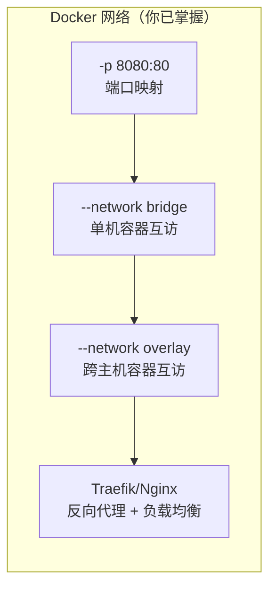
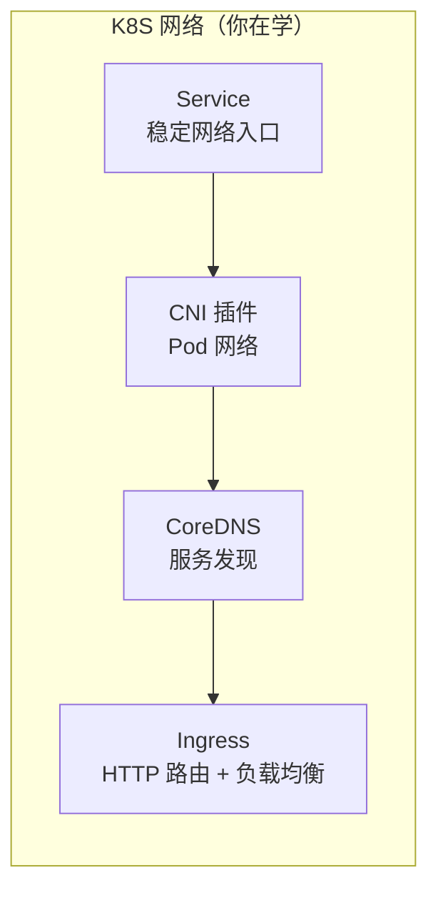
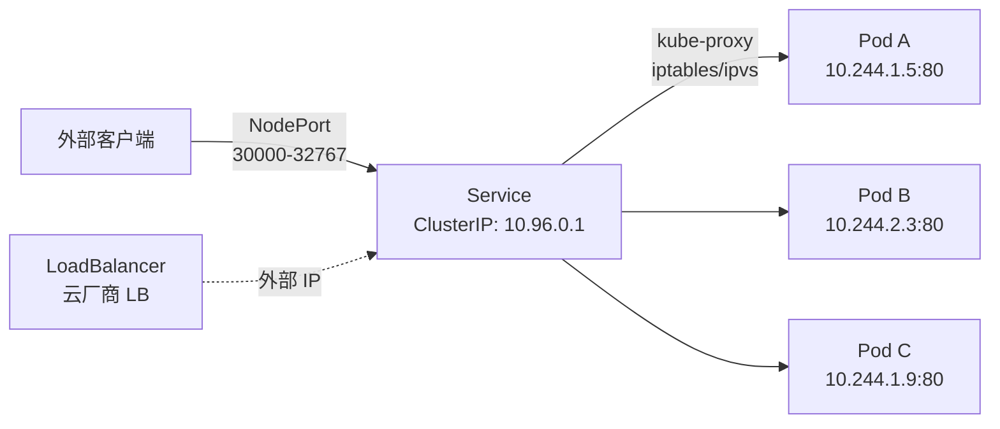
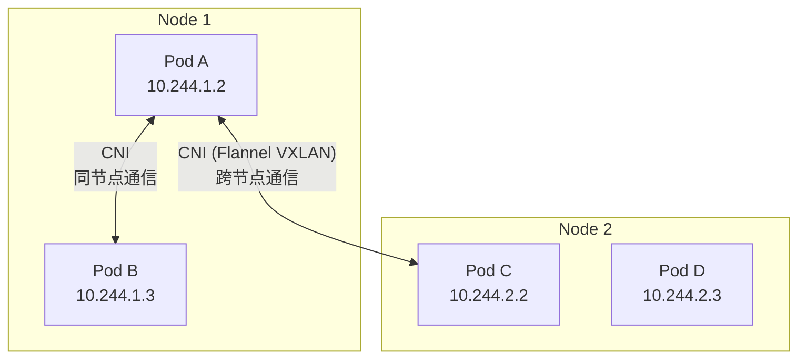

## 前置知识：Docker 网络已解决的问题

你已经会用 Docker 的网络功能：



K8S 网络需要解决同样的问题，但规模更大、更复杂：



> [!important] K8S 网络的核心原则
> • **每个 Pod 有独立 IP**（不像 Docker 容器默认共享宿主 IP）
> • **Pod 间可以直接通信**（不需要端口映射，不需要 `--link`）
> • **Service 提供稳定的虚拟 IP**（Pod 重建后 IP 变化，但 Service IP 不变）
> • **CoreDNS 提供服务发现**（类似 Docker 自定义网络 DNS，但更强大）

---

## 1. 端口映射 → Service：从 `-p` 到 ClusterIP/NodePort/LoadBalancer

### 1.1 Docker 的端口映射

```bash
# Docker 方式：端口映射到宿主机
docker run -d -p 8080:80 --name web nginx:alpine
# 访问 http://localhost:8080 → 容器内 80

# Compose 方式
services:
  web:
    ports:
      - "8080:80"
```

### 1.2 K8S Service 四种类型



| Service 类型 | 访问范围 | Docker 等价 | 使用场景 |
|-------------|---------|------------|---------|
| **ClusterIP**（默认） | 仅集群内部 | Compose 内部网络 | 微服务间通信 |
| **NodePort** | 集群外（节点 IP:端口） | `-p 30080:80` | 开发/测试，简单暴露 |
| **LoadBalancer** | 集群外（云厂商 LB） | 手动配置 Nginx 反向代理 | 生产环境 |
| **ExternalName** | DNS 别名 | 无直接等价 | 外部服务映射 |

### 1.3 Service 完整示例

```yaml
# service-clusterip.yaml —— 集群内访问
apiVersion: v1
kind: Service
metadata:
  name: nginx-service
spec:
  type: ClusterIP          # 默认类型，集群内访问
  selector:
    app: nginx             # ★ 通过标签选择 Pod（类似 Compose 的 service 名）
  ports:
  - name: http
    port: 80               # Service 对外暴露的端口
    targetPort: 80         # 容器内监听的端口
    protocol: TCP
```

```yaml
# service-nodeport.yaml —— 集群外访问
apiVersion: v1
kind: Service
metadata:
  name: nginx-nodeport
spec:
  type: NodePort
  selector:
    app: nginx
  ports:
  - port: 80
    targetPort: 80
    nodePort: 30080        # 指定节点端口（可选，不指定则自动分配 30000-32767）
```

```bash
# 创建 Service
kubectl apply -f service-clusterip.yaml

# 查看 Service
kubectl get svc
kubectl describe svc nginx-service

# 查看 Endpoints（Service 关联的 Pod IP）
kubectl get endpoints nginx-service

# 集群内访问（从另一个 Pod 测试）
kubectl run test --rm -it --image=alpine -- sh
# 在测试 Pod 内
wget -qO- http://nginx-service      # 用 Service 名访问
wget -qO- http://nginx-service.default.svc.cluster.local  # 完整 FQDN
exit
```

> [!tip] Service 的标签选择器
> Docker Compose 用服务名关联容器，K8S 用**标签（labels）**关联 Pod 和 Service。Service 的 `selector` 匹配 Pod 的 `labels`，大小写敏感、拼写必须完全一致。

---

## 2. Docker 网络 → CNI 插件

### 2.1 Docker 网络模型（回顾）

```bash
# Docker 单机网络
docker network create mynet
docker run --network mynet nginx
docker run --network mynet alpine  # 可以通过容器名互访

# Docker 跨主机网络（需 Swarm）
docker network create --driver overlay my-overlay
```

### 2.2 K8S CNI 网络模型

| 特性 | Docker 网络 | K8S CNI |
|------|------------|---------|
| 单机互通 | `bridge` 网络 | CNI 插件（Flannel/Calico） |
| 跨主机互通 | `overlay` 网络（需 Swarm） | 所有 CNI 插件都支持 |
| 插件化 | 否（内置 bridge/overlay/host） | 是（Flannel/Calico/Cilium/Weave） |
| 网络策略 | 无 | NetworkPolicy |



> [!important] K8S 网络模型 vs Docker 网络模型
> • **Docker**：容器默认在私有网络，需要 `-p` 映射端口或 `--network` 互联
> • **K8S**：所有 Pod 默认在一个扁平的大网络中，可以跨节点直接通信
> • **CNI（Container Network Interface）**：K8S 的网络插件标准

### 2.3 常见 CNI 插件对比

| 插件 | 特点 | 适用场景 | Docker 类比 |
|------|------|---------|------------|
| **Flannel** | 简单，Overlay 网络（VXLAN） | 入门、中小集群 | `overlay` 网络 |
| **Calico** | 高性能，支持 NetworkPolicy | 生产环境、需要网络策略 | `overlay` + 防火墙 |
| **Cilium** | eBPF 驱动，可观测性强 | 大规模集群、服务网格 | 无对标 |

---

## 3. 容器名 DNS → CoreDNS

### 3.1 Docker 的 DNS

```bash
# Docker 自定义网络中，容器名可以 DNS 解析
docker network create mynet
docker run -d --name web --network mynet nginx
docker run --rm --network mynet alpine ping web  # ✅ 容器名解析
```

### 3.2 K8S CoreDNS

```bash
# K8S 中，Service 名自动注册 DNS
# 格式：<service-name>.<namespace>.svc.<cluster-domain>

# 示例
nginx-service.default.svc.cluster.local  # 完整 FQDN
nginx-service.default                    # 同集群内可省略
nginx-service                            # 同命名空间内可省略
```

```bash
# 验证 CoreDNS
kubectl run dns-test --rm -it --image=alpine -- sh
# 在 Pod 内
nslookup nginx-service
# 应该解析到 ClusterIP

nslookup nginx-service.default.svc.cluster.local
# 完整 FQDN 也能解析

# 查看 CoreDNS 配置
kubectl get configmap coredns -n kube-system -o yaml
exit
```

| 特性 | Docker DNS | K8S CoreDNS |
|------|-----------|-------------|
| 自动注册 | 容器名 → IP | Service 名 → ClusterIP |
| DNS 格式 | `<容器名>` | `<service>.<namespace>.svc.<cluster-domain>` |
| 跨命名空间 | 无命名空间概念 | `<service>.<namespace>` |
| Pod DNS | 无 | Headless Service 下每个 Pod 有独立 DNS |

---

## 4. 反向代理 → Ingress

### 4.1 Docker 中的反向代理

```yaml
# Docker Compose + Traefik 反向代理
services:
  traefik:
    image: traefik:v3.0
    ports:
      - "80:80"
    command:
      - "--providers.docker=true"
    volumes:
      - /var/run/docker.sock:/var/run/docker.sock

  web:
    image: nginx
    labels:
      - "traefik.http.routers.web.rule=Host(`web.example.com`)"
```

### 4.2 K8S Ingress

```yaml
# ingress.yaml
apiVersion: networking.k8s.io/v1
kind: Ingress
metadata:
  name: web-ingress
spec:
  ingressClassName: nginx
  rules:
  - host: web.example.com          # ★ 基于域名的路由
    http:
      paths:
      - path: /
        pathType: Prefix
        backend:
          service:
            name: web-service      # 指向 Service
            port:
              number: 80
  - host: api.example.com
    http:
      paths:
      - path: /
        pathType: Prefix
        backend:
          service:
            name: api-service
            port:
              number: 80
```

```bash
# 安装 Ingress Controller（以 Nginx Ingress 为例）
kubectl apply -f https://raw.githubusercontent.com/kubernetes/ingress-nginx/controller-v1.10.0/deploy/static/provider/cloud/deploy.yaml

# minikube 启用 Ingress
minikube addons enable ingress

# 创建 Ingress 资源
kubectl apply -f ingress.yaml

# 查看 Ingress
kubectl get ingress
kubectl describe ingress web-ingress
```

| 特性 | Docker 反向代理（Traefik） | K8S Ingress |
|------|--------------------------|------------|
| 配置方式 | 容器标签 | YAML 资源 |
| 自动发现 | 监听 Docker socket | 通过 Ingress Controller |
| 路由规则 | 域名 + 路径 | 域名 + 路径 |
| TLS 终止 | Traefik 配置 | Ingress TLS 字段 |
| 控制器选择 | 仅 Traefik | Nginx / Traefik / HAProxy / Istio |

> [!tip] Ingress 是 K8S 的 Traefik/Nginx 反向代理
> 如果你用过 Docker + Traefik，K8S Ingress 的概念完全一样——基于域名和路径的 HTTP 路由。区别在于 K8S 用声明式 YAML 资源配置，而不是容器标签。

---

## 5. NetworkPolicy：Docker 没有的网络隔离

```yaml
# networkpolicy.yaml —— 限制 Pod 间流量
apiVersion: networking.k8s.io/v1
kind: NetworkPolicy
metadata:
  name: db-policy
  namespace: default
spec:
  podSelector:
    matchLabels:
      app: postgres    # 保护 postgres Pod
  policyTypes:
  - Ingress
  ingress:
  - from:
    - podSelector:
        matchLabels:
          app: web      # 只允许 web Pod 访问 postgres
    ports:
    - protocol: TCP
      port: 5432
```

> [!important] NetworkPolicy 是 K8S 独有的安全能力
> Docker 没有原生的网络策略。Docker 中限制容器间通信只能通过网络隔离。K8S 的 NetworkPolicy 可以细粒度控制 Pod 间流量，类似云安全组。
> 注意：NetworkPolicy 需要 CNI 插件支持（如 Calico），Flannel 默认不支持。

---

## 🧪 实践练习

### 🟢 基础练习 1：创建 Service 并验证

```bash
# 1. 创建 Deployment
kubectl create deployment web --image=nginx:alpine --replicas=3

# 2. 暴露 Service（NodePort 方式）
kubectl expose deployment web --port=80 --type=NodePort --name=web-svc
kubectl get svc web-svc
# 记下 NodePort 端口号（如 31234）

# 3. 访问应用
minikube service web-svc --url
# 或
curl $(minikube ip):<nodeport>

# 4. 验证 CoreDNS
kubectl run dns-test --rm -it --image=alpine -- sh
# 在 Pod 内
nslookup web-svc
wget -qO- http://web-svc
wget -qO- http://web-svc.default.svc.cluster.local
exit

# 5. 清理
kubectl delete deployment web
kubectl delete svc web-svc
```

### 🟢 基础练习 2：ClusterIP vs NodePort 对比

```bash
# 1. 创建 ClusterIP Service
kubectl expose deployment web --port=80 --type=ClusterIP --name=web-internal
# 集群内可访问，集群外不可访问

# 2. 创建 NodePort Service
kubectl expose deployment web --port=80 --type=NodePort --name=web-external
# 集群内外都可访问

# 3. 对比访问
kubectl run test --rm -it --image=alpine -- sh
# 在 Pod 内：两者都能访问
wget -qO- http://web-internal
wget -qO- http://web-external
exit
# 在宿主机：只能访问 NodePort
curl $(minikube ip):<nodeport>

# 4. 清理
kubectl delete svc web-internal web-external
```

### 🟡 进阶练习：Ingress 路由

```bash
# 1. 启用 minikube Ingress
minikube addons enable ingress

# 2. 创建两个 Deployment + Service
kubectl create deployment web --image=nginx:alpine
kubectl expose deployment web --port=80
kubectl create deployment api --image=nginx:alpine
kubectl expose deployment api --port=80

# 3. 创建 Ingress 规则
kubectl apply -f - << 'EOF'
apiVersion: networking.k8s.io/v1
kind: Ingress
metadata:
  name: multi-route
spec:
  ingressClassName: nginx
  rules:
  - host: web.local
    http:
      paths:
      - path: /
        pathType: Prefix
        backend:
          service:
            name: web
            port:
              number: 80
  - host: api.local
    http:
      paths:
      - path: /
        pathType: Prefix
        backend:
          service:
            name: api
            port:
              number: 80
EOF

# 4. 配置 hosts 文件（将 minikube IP 映射到域名）
echo "$(minikube ip) web.local api.local" | sudo tee -a /etc/hosts

# 5. 验证路由
curl http://web.local    # 访问 web 服务
curl http://api.local    # 访问 api 服务

# 6. 清理
kubectl delete ingress multi-route
kubectl delete deployment web api
kubectl delete svc web api
```

### 🔴 挑战练习：网络策略验证

```bash
# 1. 创建 web 和 postgres 两个 Deployment
# 2. 默认情况下，所有 Pod 可以互相访问
# 3. 创建 NetworkPolicy 限制只有 web 能访问 postgres
# 4. 验证：从其他 Pod 访问 postgres 被拒绝

# 提示步骤：
# - 安装支持 NetworkPolicy 的 CNI（如 Calico）
# - 创建 NetworkPolicy YAML
# - 用 kubectl exec 测试连通性
# - 观察流量被拒绝的效果

# 思考题：Docker 中如何实现类似的网络隔离？
# 答：Docker 只能通过网络分段隔离，没有细粒度的 Pod 间策略
```

---

## 常见易错点

> [!warning] **坑 1：Service 的 selector 不匹配 Pod 的 labels**
> ```yaml
> # ❌ Pod label 是 app: nginx，Service selector 是 app: nginx-prod
> # → Service 找不到任何 Endpoint，流量无法到达
>
> # ✅ 核对标签
> kubectl describe svc <name>  # 查看 Endpoints 是否为空
> kubectl get pods --show-labels  # 核对标签
> ```
> **为什么错**：Service 通过标签选择器匹配 Pod，大小写敏感。
> **解决方案**：用 `kubectl describe svc` 查看 Endpoints 是否为空。

> [!warning] **坑 2：minikube IP 不是 localhost**
> ```bash
> # ❌ curl http://localhost:8080  # 可能不通
> # NodePort 绑定在 minikube 的 IP 上
>
> # ✅ 用 minikube service 获取正确 URL
> minikube service my-service --url
> # 或用 port-forward
> kubectl port-forward svc/my-service 8080:80
> ```
> **为什么错**：minikube 在 Docker 容器或 VM 中运行，有独立 IP。
> **解决方案**：用 `minikube service` 或 `kubectl port-forward`。

> [!warning] **坑 3：混淆 ClusterIP 和 NodePort 的用途**
> ```bash
> # ❌ 对外暴露服务用 ClusterIP
> # ClusterIP 只能集群内访问
>
> # ✅ 对外用 NodePort 或 LoadBalancer
> # 集群内用 ClusterIP
> ```

> [!warning] **坑 4：Ingress 没有安装 Ingress Controller**
> ```bash
> # ❌ 只创建了 Ingress 资源，但没有 Ingress Controller
> # Ingress 规则不会生效
>
> # ✅ 先安装 Ingress Controller
> minikube addons enable ingress
> kubectl get pods -n ingress-nginx  # 确认 Controller 运行
> ```

> [!warning] **坑 5：headless Service 的 clusterIP 不是 None**
> ```yaml
> # ❌ StatefulSet 需要 Headless Service，但没设 clusterIP
> spec:
>   clusterIP: 10.96.0.5  # 不是 None！
>
> # ✅ Headless Service 必须设 clusterIP: None
> spec:
>   clusterIP: None
> ```
> **为什么错**：Headless Service 不分配 ClusterIP，每个 Pod 有独立 DNS。
> **解决方案**：StatefulSet 的 Service 必须是 `clusterIP: None`。

> [!warning] **坑 6：CoreDNS 没有运行导致服务发现失败**
> ```bash
> # 排查 DNS 问题
> kubectl get pods -n kube-system -l k8s-app=kube-dns
> # 如果没有 CoreDNS Pod，服务发现会失败
> ```
> **为什么错**：CoreDNS 是 K8S 服务发现的核心组件。
> **解决方案**：检查 CoreDNS 是否正常运行。

> [!warning] **坑 7：NetworkPolicy 限制过于严格导致全断**
> ```yaml
> # ❌ 默认拒绝所有入口流量，但没有放行规则
> spec:
>   podSelector: {}
>   policyTypes:
>   - Ingress
>   ingress: []  # 空列表 = 拒绝所有！
>
> # ✅ 先放行必要流量
> ```
> **为什么错**：NetworkPolicy 默认拒绝，空 ingress 列表等于拒绝所有入口流量。
> **解决方案**：逐步添加放行规则，先用 `kubectl exec` 测试连通性。

---

## 🎯 本文学完自检

| 层次 | 检查项 |
|------|--------|
| 🟢 基础 | 能创建 ClusterIP 和 NodePort Service，并从集群内外访问 |
| 🟢 基础 | 能解释 Service 如何通过标签选择器关联 Pod |
| 🟡 进阶 | 能创建 Ingress 实现基于域名的路由，对比 Docker 中 Traefik 的配置方式 |
| 🟡 进阶 | 能解释 K8S CNI 网络模型和 Docker bridge/overlay 网络的差异 |
| 🔴 挑战 | 能创建 NetworkPolicy 限制 Pod 间流量，并验证隔离效果 |

---

## 相关笔记

- ⬅️ 前置：[[01-环境搭建与核心概念映射]] — 理解 K8S 架构和 kubectl 基础
- ⬅️ 前置：[[02-Pod 与工作负载：从容器到 Pod]] — Service 关联的对象是 Pod
- ⬅️ 前置：[[../DockerNew/06-容器网络与存储]] — Docker 网络模型回顾
- ➡️ 后续：[[04-存储与配置：从 Volume 到 PV-PVC]] — 从网络到存储的迁移
- 🔗 关联：[[../DockerNew/07-Docker Compose 多容器编排]] — Compose 网络与 K8S Service 对比

---

*最后更新：2026-07-23*