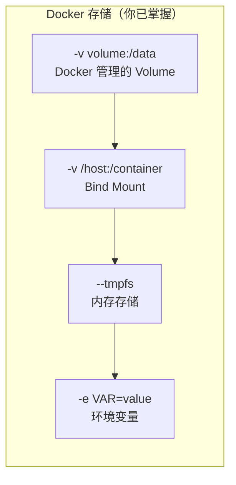
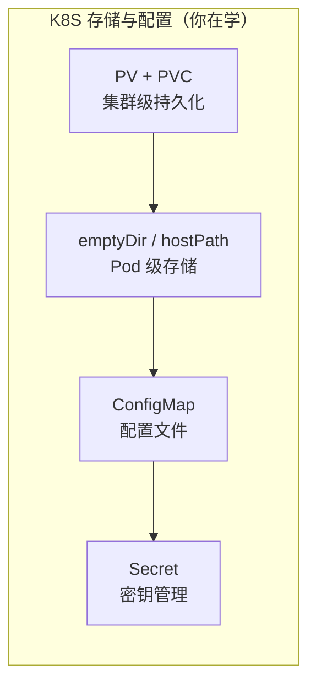
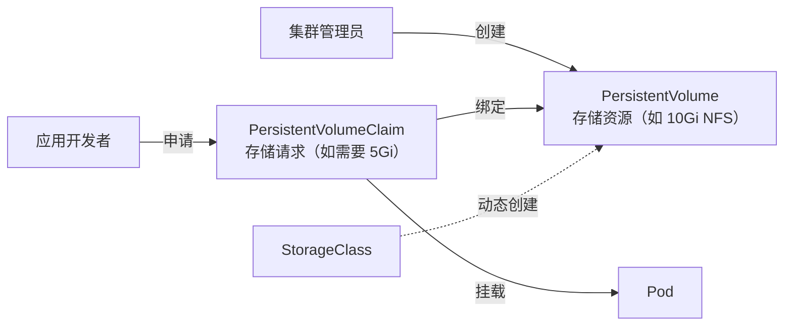

## 前置知识：Docker 存储已解决的问题



K8S 在 Docker 存储基础上，把存储提升到了**集群资源管理**的层面：



> [!important] K8S 存储的核心升级
> • **Docker 的 Volume 绑定在单个容器/宿主机上**
> • **K8S 将存储抽象为集群级资源（PV）**，让 Pod 可以在任何节点上挂载同一份持久化数据
> • **K8S 引入 StorageClass 实现存储的动态供给**（无需管理员手动创建 PV）
> • **ConfigMap 和 Secret 把配置从容器镜像中分离出来**，实现配置与代码解耦

---

## 1. Volume 类型对比

### 1.1 Docker Volume → K8S Volume 映射

| Docker 方式 | K8S 对应 | 差异说明 |
|------------|---------|---------|
| `docker volume create` + `-v` | PV + PVC | K8S 将存储抽象为独立资源 |
| `-v /host:/container`（bind mount） | `hostPath` | 概念一致，但 K8S 有 `type` 字段 |
| `--tmpfs /cache` | `emptyDir`（`medium: Memory`） | K8S emptyDir 更灵活 |
| Docker 没有 | `configMap` Volume | K8S 独有：将配置挂载为文件 |
| Docker 没有 | `secret` Volume | K8S 独有：将密钥挂载为文件 |
| Docker 没有动态供给 | `StorageClass` | K8S 独有：自动创建 PV |

### 1.2 emptyDir：Pod 生命周期内的临时存储

```yaml
# Docker 等价：无（Docker 没有 Pod 级别的临时共享存储）
# 用途：Sidecar 容器间共享数据
apiVersion: v1
kind: Pod
metadata:
  name: emptydir-demo
spec:
  containers:
  - name: writer
    image: alpine
    command: ["sh", "-c", "while true; do date >> /shared/log.txt; sleep 5; done"]
    volumeMounts:
    - name: shared
      mountPath: /shared
  - name: reader
    image: alpine
    command: ["sh", "-c", "tail -f /shared/log.txt"]
    volumeMounts:
    - name: shared
      mountPath: /shared
  volumes:
  - name: shared
    emptyDir: {}         # Pod 删除时数据丢失！
```

```bash
kubectl apply -f emptydir-demo.yaml
# 验证共享
kubectl exec -it emptydir-demo -c reader -- cat /shared/log.txt
# 删除 Pod 后 emptyDir 数据丢失
kubectl delete pod emptydir-demo
```

> [!important] emptyDir 的生命周期
> • Pod 创建时创建，Pod 删除时删除
> • Pod 内容器间共享（对标 Docker `--volumes-from`，但更自然）
> • 默认存储在节点磁盘，可设 `medium: Memory` 用 tmpfs
> • **适合临时缓存和 Sidecar 间共享，不适合持久化**

### 1.3 hostPath：直接挂载宿主机目录

```yaml
# Docker 等价：-v /var/log:/var/log
# 用途：DaemonSet 读取节点日志
apiVersion: v1
kind: Pod
metadata:
  name: hostpath-demo
spec:
  containers:
  - name: log-reader
    image: alpine
    command: ["tail", "-f", "/var/log/syslog"]
    volumeMounts:
    - name: node-logs
      mountPath: /var/log
      readOnly: true
  volumes:
  - name: node-logs
    hostPath:
      path: /var/log
      type: Directory          # 不存在时报错（可选 DirectoryOrCreate）
```

> [!warning] hostPath 的局限
> 与 Docker 的 `-v /host:/container` 一样，hostPath 把 Pod 和节点绑定。Pod 重建到不同节点后数据不可用。**生产环境优先用 PV/PVC**。

---

## 2. PV + PVC：K8S 的存储抽象

### 2.1 核心概念



| 概念 | 角色 | Docker 类比 |
|------|------|------------|
| **PersistentVolume (PV)** | 集群级存储资源（管理员提供） | `docker volume create` 创建好的卷 |
| **PersistentVolumeClaim (PVC)** | 用户的存储请求（开发者申请） | `docker run -v vol:/data` 引用卷 |
| **StorageClass** | 动态供给策略 | Docker 没有对标 |

### 2.2 静态供给：手动创建 PV 和 PVC

```yaml
# pv-static.yaml —— 管理员创建
apiVersion: v1
kind: PersistentVolume
metadata:
  name: my-pv
spec:
  capacity:
    storage: 10Gi
  accessModes:
    - ReadWriteOnce           # 访问模式：RWO/ROX/RWX
  persistentVolumeReclaimPolicy: Retain  # 回收策略
  storageClassName: manual
  hostPath:                    # 测试用 hostPath，生产用 NFS/云存储
    path: /mnt/data
---
# pvc-static.yaml —— 开发者申请
apiVersion: v1
kind: PersistentVolumeClaim
metadata:
  name: my-pvc
spec:
  accessModes:
    - ReadWriteOnce
  resources:
    requests:
      storage: 5Gi            # 申请 5Gi，绑定到上面的 10Gi PV
  storageClassName: manual
---
# pod-with-pvc.yaml —— Pod 使用 PVC
apiVersion: v1
kind: Pod
metadata:
  name: my-pod
spec:
  containers:
  - name: app
    image: nginx:alpine
    volumeMounts:
    - name: data
      mountPath: /usr/share/nginx/html
  volumes:
  - name: data
    persistentVolumeClaim:
      claimName: my-pvc
```

```bash
kubectl apply -f pv-static.yaml
kubectl get pv,pvc
# NAME                       CAPACITY   ACCESS MODES   RECLAIM POLICY   STATUS
# persistentvolume/my-pv     10Gi       RWO            Retain           Bound
# persistentvolumeclaim/my-pvc   Bound    my-pv      10Gi       RWO
```

### 2.3 访问模式（Access Modes）

| 模式 | 缩写 | 含义 | 典型存储 | Docker 类比 |
|------|------|------|---------|------------|
| ReadWriteOnce | RWO | 单节点读写 | 本地磁盘、EBS | `docker volume` 默认 |
| ReadOnlyMany | ROX | 多节点只读 | NFS、GlusterFS | 无对标 |
| ReadWriteMany | RWX | 多节点读写 | NFS、CephFS | NFS 共享存储 |
| ReadWriteOncePod | RWOP | 单 Pod 读写 | K8S 1.22+ | 无对标 |

> [!warning] Docker 的 Volume 没有访问模式概念
> Docker Volume 可以被多个容器同时挂载，但可能导致数据损坏。K8S 的 Access Mode 显式声明并发约束，更安全。

---

## 3. StorageClass：动态供给（K8S 独有）

```yaml
# storageclass.yaml —— 集群管理员配置
apiVersion: storage.k8s.io/v1
kind: StorageClass
metadata:
  name: fast-ssd
provisioner: k8s.io/minikube-hostpath   # minikube 默认供给器
# 生产环境用：kubernetes.io/aws-ebs / kubernetes.io/gce-pd
parameters:
  type: ssd
reclaimPolicy: Delete                    # PVC 删除时自动删除 PV
volumeBindingMode: WaitForFirstConsumer  # 延迟绑定，等 Pod 调度后再创建
---
# pvc-dynamic.yaml —— 开发者只需申请，PV 自动创建
apiVersion: v1
kind: PersistentVolumeClaim
metadata:
  name: fast-data
spec:
  accessModes:
    - ReadWriteOnce
  storageClassName: fast-ssd    # 引用 StorageClass
  resources:
    requests:
      storage: 10Gi
```

```bash
kubectl apply -f storageclass.yaml
kubectl apply -f pvc-dynamic.yaml
# PV 会自动创建！不需要手动 provision
kubectl get pv,pvc
```

| 模式 | Docker 对标 | 适用场景 |
|------|------------|---------|
| 静态供给 | 管理员手动 `docker volume create` | 测试、特定存储 |
| 动态供给 | 无对标（Docker 没有此能力） | 生产环境（自动化） |

> [!important] 动态供给是 K8S 的核心优势
> • **Docker**：必须手动 `docker volume create`，然后 `docker run -v`
> • **K8S**：开发者只需写 PVC，StorageClass 自动创建 PV
> • 云环境中，StorageClass 对接 EBS/GCE PD/Azure Disk，完全自动化

---

## 4. ConfigMap：从 `-e` 到 K8S 配置

### 4.1 Docker 配置方式

```bash
# Docker 环境变量
docker run -e DB_HOST=localhost -e DB_PORT=5432 myapp

# Docker 挂载配置文件
docker run -v ./nginx.conf:/etc/nginx/nginx.conf nginx
```

### 4.2 K8S ConfigMap

```yaml
# configmap.yaml
apiVersion: v1
kind: ConfigMap
metadata:
  name: app-config
data:
  DB_HOST: "postgres.default.svc.cluster.local"   # 键值对（对标 -e）
  DB_PORT: "5432"
  LOG_LEVEL: "info"
  nginx.conf: |                                    # 完整配置文件（对标 -v 挂载）
    server {
      listen 80;
      location / {
        root /usr/share/nginx/html;
      }
    }
```

```yaml
# pod-with-configmap.yaml
apiVersion: v1
kind: Pod
metadata:
  name: app-with-config
spec:
  containers:
  - name: app
    image: nginx:alpine
    envFrom:                   # 方式 1：批量注入环境变量（对标多个 -e）
    - configMapRef:
        name: app-config
    env:                       # 方式 2：单独注入某个键
    - name: SPECIAL_KEY
      valueFrom:
        configMapKeyRef:
          name: app-config
          key: LOG_LEVEL
    volumeMounts:              # 方式 3：挂载为文件（对标 -v 挂载配置文件）
    - name: config-volume
      mountPath: /etc/nginx/conf.d
  volumes:
  - name: config-volume
    configMap:
      name: app-config
```

```bash
kubectl apply -f configmap.yaml
kubectl exec -it app-with-config -- env | grep DB     # 验证环境变量
kubectl exec -it app-with-config -- cat /etc/nginx/conf.d/nginx.conf  # 验证文件
```

| 特性 | Docker `-e` | K8S ConfigMap |
|------|------------|---------------|
| 注入方式 | 命令行参数 | YAML 资源 |
| 批量注入 | 需写多个 `-e` | `envFrom` 一行搞定 |
| 配置文件 | 需 `-v` 挂载 | 直接挂载为文件 |
| 动态更新 | 需重建容器 | Volume 挂载方式支持热更新 |
| 管理方式 | 脚本/Compose 文件 | kubectl 声明式管理 |

> [!important] ConfigMap 的两种使用方式
> 1. **环境变量**：`envFrom` 批量注入，但**不支持热更新**（需重启 Pod）
> 2. **Volume 挂载**：挂载为文件，**支持热更新**（ConfigMap 更新后自动同步，有延迟）

---

## 5. Secret：从 `docker secret` 到 K8S Secret

### 5.1 Docker Swarm Secret

```bash
echo "super_secret_password" | docker secret create db_password -
docker service create --secret db_password myapp
# 容器内：/run/secrets/db_password
```

### 5.2 K8S Secret

```bash
# 命令行创建（自动 base64 编码，推荐）
kubectl create secret generic db-secret \
  --from-literal=username=admin \
  --from-literal=password=super_secret

# 或 YAML 创建
kubectl apply -f - << 'EOF'
apiVersion: v1
kind: Secret
metadata:
  name: db-secret
type: Opaque
stringData:               # 明文写入，自动编码
  username: admin
  password: super_secret
EOF
```

```yaml
# pod-with-secret.yaml
apiVersion: v1
kind: Pod
metadata:
  name: app-with-secret
spec:
  containers:
  - name: app
    image: myapp:latest
    env:
    - name: DB_PASSWORD        # 方式 1：注入为环境变量
      valueFrom:
        secretKeyRef:
          name: db-secret
          key: password
    volumeMounts:
    - name: secret-volume      # 方式 2：挂载为文件
      mountPath: /etc/secrets
      readOnly: true
  volumes:
  - name: secret-volume
    secret:
      secretName: db-secret
```

| 特性 | Docker Secret | K8S Secret |
|------|--------------|-----------|
| 创建方式 | `docker secret create` | `kubectl create secret` |
| 容器内访问 | `/run/secrets/<name>` | 环境变量 / 文件挂载 |
| 加密 | Raft 加密存储 | base64（默认不加密！） |
| 适用范围 | 仅 Swarm 模式 | 所有 K8S 资源 |

> [!warning] K8S Secret 默认只是 base64 编码，不是加密
> Docker Swarm Secret 是加密存储的。K8S Secret 默认只做 base64 编码，需要配合 etcd 加密（Encryption at Rest）或外部密钥管理（Vault、AWS KMS）。

---

## 6. StatefulSet + PVC 模板

```yaml
# StatefulSet 的持久化（对标 Docker Swarm 中带 Volume 的 Service）
apiVersion: apps/v1
kind: StatefulSet
metadata:
  name: postgres
spec:
  serviceName: postgres-headless
  replicas: 3
  selector:
    matchLabels:
      app: postgres
  template:
    metadata:
      labels:
        app: postgres
    spec:
      containers:
      - name: postgres
        image: postgres:15
        volumeMounts:
        - name: data
          mountPath: /var/lib/postgresql/data
  volumeClaimTemplates:          # ★ StatefulSet 独有：自动为每个 Pod 创建 PVC
  - metadata:
      name: data
    spec:
      accessModes: ["ReadWriteOnce"]
      storageClassName: standard  # 动态供给
      resources:
        requests:
          storage: 10Gi
```

| 特性 | Docker Swarm | K8S StatefulSet |
|------|-------------|-----------------|
| 每个 Task/Pod 独立 Volume | 需手动配置 | `volumeClaimTemplates` 自动 |
| 声明式 | 部分 | 完全声明式 |
| 稳定标识 | 无 | 有序编号 + 稳定 DNS |

---

## 🧪 实践练习

### 🟢 基础练习 1：ConfigMap 环境变量注入

```bash
# 1. 创建 ConfigMap
kubectl create configmap app-config \
  --from-literal=APP_ENV=production \
  --from-literal=LOG_LEVEL=info

# 2. 创建 Pod 使用 ConfigMap
kubectl apply -f - << 'EOF'
apiVersion: v1
kind: Pod
metadata:
  name: config-test
spec:
  containers:
  - name: app
    image: nginx:alpine
    envFrom:
    - configMapRef:
        name: app-config
    command: ["sh", "-c", "env | grep APP; env | grep LOG; sleep 3600"]
EOF

# 3. 验证环境变量注入
kubectl logs config-test
# 应看到 APP_ENV=production 和 LOG_LEVEL=info

# 4. 清理
kubectl delete pod config-test
kubectl delete configmap app-config
```

### 🟢 基础练习 2：动态供给 PVC

```bash
# 1. 创建 PVC（minikube 默认支持动态供给）
kubectl apply -f - << 'EOF'
apiVersion: v1
kind: PersistentVolumeClaim
metadata:
  name: test-pvc
spec:
  accessModes: ["ReadWriteOnce"]
  resources:
    requests:
      storage: 1Gi
EOF

# 2. 验证 PVC 和自动创建的 PV
kubectl get pvc
kubectl get pv

# 3. 创建 Pod 使用 PVC
kubectl apply -f - << 'EOF'
apiVersion: v1
kind: Pod
metadata:
  name: pvc-test
spec:
  containers:
  - name: app
    image: nginx:alpine
    volumeMounts:
    - name: data
      mountPath: /data
    command: ["sh", "-c", "echo 'persistent' > /data/test.txt; sleep 3600"]
  volumes:
  - name: data
    persistentVolumeClaim:
      claimName: test-pvc
EOF

# 4. 验证数据持久化（删除 Pod 后重建，数据还在）
kubectl wait --for=condition=ready pod/pvc-test --timeout=30s
kubectl delete pod pvc-test
# 用同一 PVC 创建新 Pod
kubectl apply -f - << 'EOF'
apiVersion: v1
kind: Pod
metadata:
  name: pvc-test-2
spec:
  containers:
  - name: app
    image: nginx:alpine
    volumeMounts:
    - name: data
      mountPath: /data
  volumes:
  - name: data
    persistentVolumeClaim:
      claimName: test-pvc
EOF
kubectl exec pvc-test-2 -- cat /data/test.txt
# 应看到 "persistent"（数据保留！）

# 5. 清理
kubectl delete pod pvc-test-2
kubectl delete pvc test-pvc
```

### 🟡 进阶练习：Secret 管理

```bash
# 1. 创建 Secret
kubectl create secret generic db-secret \
  --from-literal=password=MySecret123

# 2. 创建 Pod 使用 Secret
kubectl apply -f - << 'EOF'
apiVersion: v1
kind: Pod
metadata:
  name: secret-test
spec:
  containers:
  - name: app
    image: nginx:alpine
    env:
    - name: DB_PASSWORD
      valueFrom:
        secretKeyRef:
          name: db-secret
          key: password
    command: ["sh", "-c", "echo $DB_PASSWORD; sleep 3600"]
EOF

# 3. 验证 Secret 注入
kubectl logs secret-test
# 应看到 MySecret123

# 4. 验证 Secret 只是 base64 编码
kubectl get secret db-secret -o jsonpath='{.data.password}' | base64 -d
# 应看到 MySecret123

# 5. 清理
kubectl delete pod secret-test
kubectl delete secret db-secret
```

### 🔴 挑战练习：StatefulSet + 持久化

```bash
# 1. 创建 Headless Service + StatefulSet（带 volumeClaimTemplates）
kubectl apply -f - << 'EOF'
apiVersion: v1
kind: Service
metadata:
  name: web-headless
spec:
  clusterIP: None
  selector:
    app: web
  ports:
  - port: 80
---
apiVersion: apps/v1
kind: StatefulSet
metadata:
  name: web
spec:
  serviceName: web-headless
  replicas: 3
  selector:
    matchLabels:
      app: web
  template:
    metadata:
      labels:
        app: web
    spec:
      containers:
      - name: nginx
        image: nginx:alpine
        volumeMounts:
        - name: data
          mountPath: /usr/share/nginx/html
  volumeClaimTemplates:
  - metadata:
      name: data
    spec:
      accessModes: ["ReadWriteOnce"]
      resources:
        requests:
          storage: 1Gi
EOF

# 2. 验证 3 个 Pod 有序创建，各有独立 PVC
kubectl get pods -l app=web -w
kubectl get pvc
# 应看到 data-web-0、data-web-1、data-web-2

# 3. 写入数据 → 删除 Pod → 验证数据保留
kubectl exec -it web-0 -- sh -c "echo 'stateful' > /usr/share/nginx/html/index.html"
kubectl delete pod web-0
# 等待重建
kubectl exec -it web-0 -- cat /usr/share/nginx/html/index.html
# 应看到 "stateful"（数据保留！）

# 4. 清理
kubectl delete statefulset web
kubectl delete svc web-headless
kubectl delete pvc data-web-0 data-web-1 data-web-2
```

---

## 常见易错点

> [!warning] **坑 1：PVC 处于 Pending 状态**
> ```bash
> kubectl get pvc
> # STATUS: Pending（没有绑定 PV）
> ```
> **为什么错**：没有匹配的 PV 或 StorageClass。
> **解决方案**：`kubectl describe pvc` 查看 Events，检查 StorageClass 是否存在。

> [!warning] **坑 2：ConfigMap 更新后 Pod 未生效**
> ```bash
> # 更新 ConfigMap 后，Pod 内环境变量没变！
> ```
> **为什么错**：环境变量方式不支持热更新。
> **解决方案**：用 Volume 挂载方式（支持热更新），或 `kubectl rollout restart`。

> [!warning] **坑 3：Secret 的 base64 不是加密**
> K8S Secret 默认只做 base64 编码，不是加密。生产环境需启用 etcd 静态加密或用 Vault。

> [!warning] **坑 4：StatefulSet 删除后 PVC 未清理**
> StatefulSet 的 PVC 不会自动删除（保护数据）。需手动 `kubectl delete pvc data-xxx-0`。

> [!warning] **坑 5：hostPath 跨节点数据不一致**
> Pod 调度到 Node1 写入 hostPath，重建后调度到 Node2 → 数据不在！用 PV/PVC 替代。

> [!warning] **坑 6：accessModes 不匹配**
> PVC 请求 ReadWriteMany 但 PV 只支持 ReadWriteOnce → 绑定失败。确认存储后端支持的访问模式。

> [!warning] **坑 7：reclaimPolicy 导致数据丢失**
> StorageClass 的 `reclaimPolicy: Delete` → PVC 删除时 PV 及数据也被删除！重要数据用 `Retain`。

---

## 🎯 本文学完自检

| 层次 | 检查项 |
|------|--------|
| 🟢 基础 | 能创建 ConfigMap 和 Secret，并在 Pod 中以环境变量方式使用 |
| 🟢 基础 | 能用动态供给创建 PVC，并挂载到 Pod 验证数据持久化 |
| 🟡 进阶 | 能解释 PV/PVC/StorageClass 三级抽象与 Docker Volume 的区别 |
| 🟡 进阶 | 能为 StatefulSet 配置 volumeClaimTemplates，验证每个 Pod 独立 PVC |
| 🔴 挑战 | 能设计生产级存储方案，对比 Docker Volume 的局限性，说明动态供给的价值 |

---

## 相关笔记

- ⬅️ 前置：[[02-Pod 与工作负载：从容器到 Pod]] — StatefulSet 依赖 PVC 持久化
- ⬅️ 前置：[[03-Service 与网络：从 Docker 网络到 K8S]] — Headless Service 与 StatefulSet 配合
- ⬅️ 前置：[[../DockerNew/06-容器网络与存储]] — Docker Volume 和 Bind Mount 回顾
- ➡️ 后续：[[05-调度与扩缩容：从 scale 到 HPA]] — 存储之后是调度和扩缩容
- ➡️ 后续：[[06-Docker有K8S无与K8S有Docker无]] — 对比存储管理的双向差异

---

*最后更新：2026-07-23*