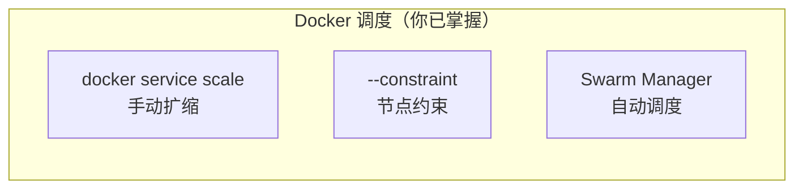
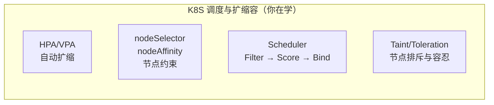
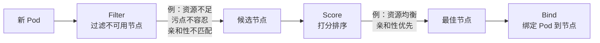
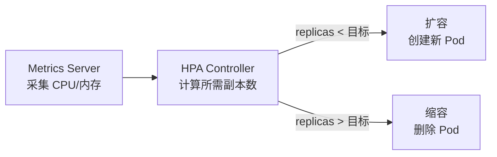

## 前置知识：Docker 的调度与扩缩容



K8S 的调度更强大、更灵活：



> [!important] K8S 调度的核心升级
> • Docker Swarm 的调度较简单（基于标签约束）
> • K8S 调度器有完整的 **Filter → Score → Bind** 流程
> • K8S 支持 **HPA（水平自动扩缩）**，Docker 没有原生自动扩缩能力
> • K8S 支持 **Taint/Toleration**（节点排斥），Docker 没有对标

---

## 1. 调度器：从 Swarm Manager 到 K8S Scheduler

### 1.1 Docker Swarm 调度（回顾）

```bash
# Swarm：基于标签的约束
docker node update --label-add storage=ssd node1
docker service create --constraint "node.labels.storage==ssd" postgres
docker service scale web=5  # 手动扩缩
```

### 1.2 K8S 调度器三步流程



| 阶段 | 作用 | Docker 类比 |
|------|------|------------|
| Filter | 过滤不满足条件的节点 | Swarm `--constraint` |
| Score | 对候选节点打分排序 | Swarm 的 spread 策略 |
| Bind | 将 Pod 绑定到最佳节点 | Swarm Task 分配 |

---

## 2. 节点约束：从 `--constraint` 到 `nodeSelector` / `nodeAffinity`

### 2.1 Docker 约束

```bash
docker node update --label-add disk=ssd node1
docker service create --constraint "node.labels.disk==ssd" postgres
```

### 2.2 K8S nodeSelector（简单版）

```bash
# 给节点打标签
kubectl label nodes minikube disk=ssd
kubectl get nodes --show-labels
```

```yaml
apiVersion: v1
kind: Pod
metadata:
  name: postgres
spec:
  nodeSelector:
    disk: ssd            # 只调度到 disk=ssd 的节点
  containers:
  - name: postgres
    image: postgres:15
```

### 2.3 K8S nodeAffinity（高级版）

```yaml
apiVersion: v1
kind: Pod
metadata:
  name: app
spec:
  affinity:
    nodeAffinity:
      requiredDuringSchedulingIgnoredDuringExecution:   # 硬约束（必须满足）
        nodeSelectorTerms:
        - matchExpressions:
          - key: disk
            operator: In
            values: ["ssd", "nvme"]
      preferredDuringSchedulingIgnoredDuringExecution:   # 软约束（尽量满足）
      - weight: 100
        preference:
          matchExpressions:
          - key: zone
            operator: In
            values: ["east"]
  containers:
  - name: app
    image: myapp
```

| 特性 | Docker `--constraint` | K8S `nodeSelector` | K8S `nodeAffinity` |
|------|----------------------|--------------------|--------------------|
| 匹配方式 | 等值 | 等值 | In/NotIn/Exists 等 |
| 软约束 | 无 | 无 | preferred（尽量） |
| 硬约束 | 有 | 有 | required（必须） |
| 操作符 | `==` / `!=` | 等值 | In/NotIn/Exists/DoesNotExist |

---

## 3. 污点与容忍：K8S 独有的节点排斥

```bash
# 给节点打污点（排斥 Pod）
kubectl taint nodes node1 dedicated=gpu:NoSchedule
# 只有声明了对应 toleration 的 Pod 才能调度上来

# 移除污点
kubectl taint nodes node1 dedicated=gpu:NoSchedule-
```

```yaml
# Pod 声明容忍（可以调度到有污点的节点）
apiVersion: v1
kind: Pod
metadata:
  name: gpu-task
spec:
  tolerations:
  - key: "dedicated"
    operator: "Equal"
    value: "gpu"
    effect: "NoSchedule"
  containers:
  - name: gpu-app
    image: tensorflow/tensorflow:latest-gpu
```

| 污点效果 | 说明 | Docker 对标 |
|---------|------|------------|
| NoSchedule | 不调度新 Pod | `--constraint` 反向 |
| PreferNoSchedule | 尽量不调度 | 无对标 |
| NoExecute | 驱逐已有不容忍 Pod | 无对标 |

> [!important] Taint/Toleration 是 K8S 独有的
> Docker Swarm 没有节点排斥机制。K8S 的污点让管理员可以"保护"专用节点（如 GPU 节点只跑 GPU 任务）。

---

## 4. Pod 亲和性：让相关 Pod 调度到一起或分开

```yaml
# 让 web 和 cache 调度到同一节点（减少网络延迟）
apiVersion: v1
kind: Pod
metadata:
  name: web
  labels:
    app: web
spec:
  affinity:
    podAffinity:
      requiredDuringSchedulingIgnoredDuringExecution:
      - labelSelector:
          matchExpressions:
          - key: app
            operator: In
            values: ["cache"]
        topologyKey: kubernetes.io/hostname  # 同一节点
  containers:
  - name: web
    image: nginx
```

```yaml
# 让 web 副本分散到不同节点（高可用）
spec:
  affinity:
    podAntiAffinity:
      preferredDuringSchedulingIgnoredDuringExecution:
      - weight: 100
        podAffinityTerm:
          labelSelector:
            matchExpressions:
            - key: app
              operator: In
              values: ["web"]
          topologyKey: kubernetes.io/hostname
```

> [!tip] 亲和性 vs 反亲和性
> • **podAffinity**：让 Pod 靠近（如 web + cache 同节点，减少网络延迟）
> • **podAntiAffinity**：让 Pod 分散（如 web 副本不同节点，提高可用性）
> • Docker Swarm 没有这些能力

---

## 5. 扩缩容：从 `docker service scale` 到 HPA

### 5.1 Docker 手动扩缩

```bash
docker service scale web=5
docker service scale web=2  # 缩容
```

### 5.2 K8S 手动扩缩

```bash
# 与 Docker 类似的手动扩缩
kubectl scale deployment web --replicas=5
kubectl scale deployment web --replicas=2
```

### 5.3 HPA：自动扩缩（K8S 独有）



```yaml
# hpa.yaml
apiVersion: autoscaling/v2
kind: HorizontalPodAutoscaler
metadata:
  name: web-hpa
spec:
  scaleTargetRef:
    apiVersion: apps/v1
    kind: Deployment
    name: web
  minReplicas: 2               # 最少 2 个
  maxReplicas: 10              # 最多 10 个
  metrics:
  - type: Resource
    resource:
      name: cpu
      target:
        type: Utilization
        averageUtilization: 70  # CPU 使用率超过 70% 扩容
  - type: Resource
    resource:
      name: memory
      target:
        type: Utilization
        averageUtilization: 80
  behavior:
    scaleDown:
      stabilizationWindowSeconds: 300  # 缩容前稳定 300 秒
```

```bash
# 安装 Metrics Server（HPA 依赖）
minikube addons enable metrics-server

# 创建 HPA
kubectl apply -f hpa.yaml
kubectl get hpa
kubectl get hpa -w   # 观察 HPA 调整副本数

# 先给 Deployment 创建 Service（Deployment 名不会注册 DNS，CoreDNS 只解析 Service 名，
# 不 expose 的话 wget http://web 解析失败）
kubectl expose deployment web --port=80

# 生成负载测试 HPA
kubectl run -i --tty loadgen --rm --image=busybox:1.36 \
  -- /bin/sh -c "while true; do wget -q -O- http://web; done"
```

| 扩缩方式 | Docker | K8S |
|---------|--------|------|
| 手动扩缩 | `docker service scale` | `kubectl scale` |
| 自动扩缩 | 无原生支持 | HPA（CPU/内存/自定义指标） |
| 垂直扩缩 | 无 | VPA（调整资源 requests/limits） |
| 集群扩缩 | 无 | Cluster Autoscaler（增减节点） |

> [!important] HPA 是 K8S 相比 Docker 的重大优势
> Docker Swarm 没有自动扩缩能力。K8S 的 HPA 可以根据 CPU/内存/自定义指标自动扩缩，这是云原生的核心能力。

### 5.4 VPA 和 Cluster Autoscaler

```yaml
# VPA：自动调整资源 requests/limits（K8S 独有）
apiVersion: autoscaling.k8s.io/v1
kind: VerticalPodAutoscaler
metadata:
  name: app-vpa
spec:
  targetRef:
    apiVersion: apps/v1
    kind: Deployment
    name: app
  updatePolicy:
    updateMode: Auto
```

| 扩缩类型 | 作用 | Docker 对标 |
|---------|------|------------|
| HPA | 水平扩缩（调副本数） | 无对标 |
| VPA | 垂直扩缩（调资源限制） | 无对标 |
| Cluster Autoscaler | 集群节点扩缩 | 无对标 |

> [!important] 三者关系
> • **HPA** 决定一个应用有几个 Pod
> • **VPA** 决定一个 Pod 有多少 CPU/内存
> • **Cluster Autoscaler** 决定集群有几个节点

---

## 🧪 实践练习

### 🟢 基础练习 1：手动扩缩容

```bash
# 1. 创建 Deployment
kubectl create deployment web --image=nginx:alpine --replicas=2
kubectl get pods -o wide

# 2. 扩容到 5
kubectl scale deployment web --replicas=5
kubectl get pods -w  # 观察新 Pod 创建

# 3. 缩容到 1
kubectl scale deployment web --replicas=1
kubectl get pods  # 观察哪些 Pod 被终止

# 4. 清理
kubectl delete deployment web
```

### 🟢 基础练习 2：nodeSelector 节点约束

```bash
# 1. 给节点打标签
kubectl label nodes minikube disk=ssd
kubectl get nodes --show-labels

# 2. 创建带 nodeSelector 的 Pod
kubectl apply -f - << 'EOF'
apiVersion: v1
kind: Pod
metadata:
  name: on-ssd
spec:
  nodeSelector:
    disk: ssd
  containers:
  - name: app
    image: nginx:alpine
EOF

# 3. 验证 Pod 调度到正确节点
kubectl get pod on-ssd -o wide

# 4. 清理
kubectl delete pod on-ssd
kubectl label nodes minikube disk-
```

### 🟡 进阶练习：HPA 自动扩缩容

```bash
# 1. 启用 metrics-server
minikube addons enable metrics-server

# 2. 创建带资源请求的 Deployment（HPA 必须有 requests！）
kubectl create deployment hpatest --image=nginx:alpine --replicas=1
kubectl set resources deployment hpatest \
  --requests=cpu=100m,memory=128Mi \
  --limits=cpu=200m,memory=256Mi

# 3. 创建 HPA
kubectl autoscale deployment hpatest --cpu-percent=50 --min=1 --max=5
kubectl get hpa

# 4. 模拟负载（先创建 Service：Deployment 名不注册 DNS，需 Service 提供集群内解析）
kubectl expose deployment hpatest --port=80
kubectl run load --rm -it --image=busybox:1.36 -- \
  /bin/sh -c "while true; do wget -q -O- http://hpatest; done"

# 5. 在另一个终端观察 HPA 自动扩容
kubectl get hpa -w
kubectl get pods -w

# 6. 停止负载后观察缩容（有冷却时间约 5 分钟）

# 7. 清理
kubectl delete hpa hpatest
kubectl delete svc hpatest
kubectl delete deployment hpatest
```

### 🔴 挑战练习：污点 + 容忍 + 亲和性综合

```bash
# 1. 给节点打污点
kubectl taint nodes minikube dedicated=test:NoSchedule

# 2. 创建不带 toleration 的 Pod（应该调度失败）
kubectl apply -f - << 'EOF'
apiVersion: v1
kind: Pod
metadata:
  name: no-toleration
spec:
  containers:
  - name: app
    image: nginx:alpine
EOF

kubectl get pod no-toleration
# 应该是 Pending 状态（被污点排斥）

# 3. 创建带 toleration 的 Pod（应该调度成功）
kubectl apply -f - << 'EOF'
apiVersion: v1
kind: Pod
metadata:
  name: with-toleration
spec:
  tolerations:
  - key: "dedicated"
    operator: "Equal"
    value: "test"
    effect: "NoSchedule"
  containers:
  - name: app
    image: nginx:alpine
EOF

kubectl get pod with-toleration
# 应该是 Running 状态

# 4. 清理
kubectl delete pod no-toleration with-toleration
kubectl taint nodes minikube dedicated=test:NoSchedule-

# 思考题：Docker Swarm 中如何实现类似效果？
# 答：Swarm 只能用 --constraint 正向约束，没有反向排斥机制
```

---

## 常见易错点

> [!warning] **坑 1：HPA 不工作，TARGETS 显示 `<unknown>`**
> ```bash
> kubectl get hpa
> # TARGETS 列显示 <unknown>/50%
> ```
> **为什么错**：没有安装 Metrics Server，或 Deployment 没有设置 `resources.requests`。
> **解决方案**：`minikube addons enable metrics-server`，确保 Deployment 有 `resources.requests.cpu`。

> [!warning] **坑 2：nodeSelector 标签不匹配**
> ```bash
> kubectl get pod
> # STATUS: Pending
> ```
> **为什么错**：没有节点带指定标签。
> **解决方案**：`kubectl get nodes --show-labels` 核对标签。

> [!warning] **坑 3：Taint 导致 Pod 无法调度**
> Master 节点默认有 `NoSchedule` 污点，普通 Pod 不会调度上去。如果只有 Master 节点可用，Pod 会 Pending。

> [!warning] **坑 4：HPA 扩容到 maxReplicas 仍然不够**
> HPA 只扩 Pod 数量，不扩节点数量。节点不够时 Pod 会 Pending，需要 Cluster Autoscaler。

> [!warning] **坑 5：缩容过快导致服务抖动**
> HPA 默认缩容冷却 5 分钟。如果设置太短，可能导致频繁扩缩抖动。

> [!warning] **坑 6：podAntiAffinity 过于严格**
> 如果要求所有副本在不同节点，但集群只有 2 个节点，Deployment 设 3 副本 → 第 3 个 Pod 永远 Pending。

> [!warning] **坑 7：VPA 和 HPA 同时作用于同一资源**
> VPA 修改 resources.requests，HPA 根据 CPU 利用率计算副本数 → 两者冲突。不要同时对同一 Deployment 用 VPA 和 HPA（基于 CPU 的）。

---

## 🎯 本文学完自检

| 层次 | 检查项 |
|------|--------|
| 🟢 基础 | 能用 `kubectl scale` 手动扩缩容，对比 `docker service scale` |
| 🟢 基础 | 能用 `nodeSelector` 约束 Pod 调度到特定节点 |
| 🟡 进阶 | 能创建 HPA 实现基于 CPU 的自动扩缩容 |
| 🟡 进阶 | 能对比 Docker Swarm `--constraint` 和 K8S `nodeAffinity`/`taints` 的差异 |
| 🔴 挑战 | 能综合使用 nodeAffinity + podAntiAffinity + taints 设计高可用部署方案 |

---

## 相关笔记

- ⬅️ 前置：[[04-存储与配置：从 Volume 到 PV-PVC]] — 调度器会考虑节点存储能力
- ⬅️ 前置：[[02-Pod 与工作负载：从容器到 Pod]] — Deployment 是扩缩容的对象
- ➡️ 后续：[[06-Docker有K8S无与K8S有Docker无]] — 双向特性全景对比

---

*最后更新：2026-07-23*