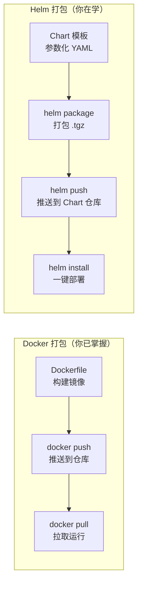

## 前置知识：Helm 是 K8S 的包管理器

你已经用 Docker Compose 做过单机编排。现在理解 Helm 的定位：



> [!important] Helm 解决的问题
> • **Docker Compose**：一个 YAML 搞定，但不能参数化、不能版本管理、不能从仓库安装
> • **裸 kubectl apply**：多个 YAML 文件，无参数化，多环境需手动改
> • **Helm Chart**：模板化 YAML + values 参数化 + 版本管理 + 仓库分发
> • **一句话**：Helm 之于 K8S = apt/yum 之于 Linux = Docker Compose 之于 Docker（但更强）

---

## 1. Chart 目录结构

```bash
# 创建一个新 Chart（类比 docker init 生成项目骨架）
helm create myapp
```

```
myapp/                     # Chart 根目录
├── Chart.yaml             # Chart 元信息（类比 package.json）
├── values.yaml            # 默认参数（类比 docker-compose.yml 的默认配置）
├── values-prod.yaml       # 生产环境覆盖参数
├── charts/                # 依赖的子 Chart
├── templates/             # 模板文件（参数化 YAML）
│   ├── deployment.yaml    # Deployment 模板
│   ├── service.yaml       # Service 模板
│   ├── ingress.yaml       # Ingress 模板
│   ├── configmap.yaml     # ConfigMap 模板
│   ├── _helpers.tpl       # 公共模板函数（类比 Docker 的 .env）
│   └── NOTES.txt          # 安装后提示信息
└── .helmignore            # 忽略文件（类比 .dockerignore）
```

| Helm 文件 | Docker 类比 | 作用 |
|-----------|------------|------|
| `Chart.yaml` | `package.json` / `compose.yaml` 头部 | Chart 名称、版本、描述 |
| `values.yaml` | `docker-compose.yaml` 的默认值 | 默认参数，可被 `-f` 覆盖 |
| `templates/` | `docker-compose.yaml` 的服务定义 | 参数化 K8S 资源模板 |
| `_helpers.tpl` | `.env` 公共变量 | 公共模板函数，避免重复 |
| `charts/` | `depends_on` | 依赖的其他 Chart |

---

## 2. Chart.yaml：元信息

```yaml
# Chart.yaml
apiVersion: v2
name: myapp
description: A Helm chart for my web application
type: application
version: 0.1.0          # Chart 版本（SemVer）
appVersion: "1.16.0"    # 应用版本（容器镜像 tag）
keywords:
  - web
  - api
maintainers:
  - name: your-name
    email: you@example.com
dependencies:
  - name: redis
    version: "18.x.x"
    repository: https://charts.bitnami.com/bitnami
    condition: redis.enabled
```

> [!tip] version vs appVersion
> • `version`：**Chart 模板**的版本（改模板就加版本号）
> • `appVersion`：**容器应用**的版本（对应镜像 tag）
> • Docker 中没有此区分——Dockerfile 和镜像 tag 是分开的，Helm 把两者都管理起来

---

## 3. values.yaml：参数化配置

### 3.1 默认值

```yaml
# values.yaml —— 类比 docker-compose.yml 的默认配置
replicaCount: 2

image:
  repository: myapp
  tag: "1.16.0"
  pullPolicy: IfNotPresent

service:
  type: ClusterIP
  port: 80

ingress:
  enabled: false
  className: nginx
  hosts:
    - host: app.example.com
      paths:
        - path: /
          pathType: Prefix

resources:
  requests:
    cpu: 100m
    memory: 128Mi
  limits:
    cpu: 200m
    memory: 256Mi

# 子 Chart 开关
redis:
  enabled: false
```

### 3.2 多环境覆盖（类比 Docker 多 Compose 文件）

```yaml
# values-prod.yaml —— 生产环境覆盖
replicaCount: 5              # 生产 5 副本（默认 2）

image:
  tag: "1.16.0-prod"        # 生产镜像 tag

resources:
  requests:
    cpu: 500m               # 生产更多资源
    memory: 512Mi
  limits:
    cpu: 1000m
    memory: 1Gi

ingress:
  enabled: true              # 生产启用 Ingress
  hosts:
    - host: prod.example.com

redis:
  enabled: true              # 生产用 Redis 子 Chart
```

```bash
# Docker 方式：多环境
docker compose -f docker-compose.yml -f docker-compose.prod.yml up

# Helm 方式：多环境
helm install myapp ./myapp -f values.yaml -f values-prod.yaml -n prod
# 后面的 -f 覆盖前面的，最终合并为完整配置
```

---

## 4. 模板语法：Go template + Helm 函数

### 4.1 基础模板

```yaml
# templates/deployment.yaml
apiVersion: apps/v1
kind: Deployment
metadata:
  name: {{ .Release.Name }}-{{ .Chart.Name }}    # Release.Name = helm install 时的名字
  labels:
    {{- include "myapp.labels" . | nindent 4 }}   # 调用 _helpers.tpl 中的函数
spec:
  replicas: {{ .Values.replicaCount }}             # 引用 values.yaml
  selector:
    matchLabels:
      {{- include "myapp.selectorLabels" . | nindent 6 }}
  template:
    metadata:
      labels:
        {{- include "myapp.selectorLabels" . | nindent 8 }}
    spec:
      containers:
      - name: {{ .Chart.Name }}
        image: "{{ .Values.image.repository }}:{{ .Values.image.tag }}"
        ports:
        - containerPort: {{ .Values.service.port }}
        resources:
          {{- toYaml .Values.resources | nindent 12 }}   # 把 map 转 YAML
```

### 4.2 模板对象速查

| 对象 | 说明 | 示例 |
|------|------|------|
| `.Release.Name` | helm install 时指定的名字 | `helm install myapp` → `myapp` |
| `.Release.Namespace` | 安装的命名空间 | `prod` |
| `.Chart.Name` | Chart.yaml 中的 name | `myapp` |
| `.Chart.Version` | Chart 版本 | `0.1.0` |
| `.Values.xxx` | values.yaml 中的值 | `.Values.replicaCount` |

### 4.3 常用模板函数

| 函数 | 作用 | 示例 |
|------|------|------|
| `{{ .Values.xxx \| toYaml }}` | 将值转为 YAML 格式 | 嵌套配置直接输出 |
| `{{ .Values.xxx \| nindent 4 }}` | 缩进 N 格 | 对齐 YAML 层级 |
| `{{ include "func" . }}` | 调用 _helpers.tpl 函数 | 复用标签定义 |
| `{{ if .Values.ingress.enabled }}` | 条件判断 | 按需生成 Ingress |
| `{{ range .Values.ingress.hosts }}` | 循环遍历 | 多域名路由 |
| `{{ default "80" .Values.port }}` | 默认值 | 值未设置时用 80 |

### 4.4 条件与循环

```yaml
# 条件生成（Docker 没有，Compose 只能全写）
{{- if .Values.ingress.enabled }}
apiVersion: networking.k8s.io/v1
kind: Ingress
metadata:
  name: {{ .Release.Name }}-ingress
spec:
  rules:
  {{- range .Values.ingress.hosts }}
  - host: {{ .host | quote }}
    http:
      paths:
      {{- range .paths }}
      - path: {{ .path }}
        pathType: {{ .pathType }}
        backend:
          service:
            name: {{ $.Release.Name }}
            port:
              number: {{ $.Values.service.port }}
      {{- end }}
  {{- end }}
{{- end }}
```

---

## 5. _helpers.tpl：公共模板函数

```yaml
# templates/_helpers.tpl
{{/* 生成公共标签（避免每处重复写） */}}
{{- define "myapp.labels" -}}
app.kubernetes.io/name: {{ .Chart.Name }}
app.kubernetes.io/instance: {{ .Release.Name }}
app.kubernetes.io/version: {{ .Chart.AppVersion | quote }}
app.kubernetes.io/managed-by: {{ .Release.Service }}
{{- end -}}

{{/* 生成选择器标签 */}}
{{- define "myapp.selectorLabels" -}}
app.kubernetes.io/name: {{ .Chart.Name }}
app.kubernetes.io/instance: {{ .Release.Name }}
{{- end -}}

{{/* 生成全名（Release-Chart） */}}
{{- define "myapp.fullname" -}}
{{- if .Values.fullnameOverride -}}
{{- .Values.fullnameOverride | trunc 63 | trimSuffix "-" -}}
{{- else -}}
{{- .Release.Name }}-{{ .Chart.Name | trunc 63 | trimSuffix "-" -}}
{{- end -}}
{{- end -}}
```

> [!tip] _helpers.tpl 的价值
> Docker Compose 用 YAML 锚点（`&anchor` / `*anchor`）复用，但功能有限。Helm 的 `_helpers.tpl` 用 Go template 函数实现复用，更灵活强大。

---

## 6. 依赖管理：子 Chart

```yaml
# Chart.yaml 中声明依赖
dependencies:
  - name: redis
    version: "18.x.x"
    repository: https://charts.bitnami.com/bitnami
    condition: redis.enabled    # values.yaml 中 redis.enabled=true 时才安装
  - name: postgresql
    version: "15.x.x"
    repository: https://charts.bitnami.com/bitnami
    condition: postgresql.enabled
```

```bash
# 下载依赖到 charts/ 目录（类比 docker pull 依赖镜像）
helm dependency update
# 会下载 redis 和 postgresql 的 Chart 到 charts/ 目录

# 安装时自动包含子 Chart
helm install myapp ./myapp -n dev
# 同时部署 myapp + redis + postgresql
```

| Helm 依赖 | Docker 对比 |
|-----------|------------|
| `dependencies` | `depends_on` |
| `helm dependency update` | `docker compose pull` |
| `condition: redis.enabled` | Docker 无此开关 |
| 子 Chart 的 values 独立 | Docker 全局共享环境 |

---

## 7. Chart 打包与发布

```bash
# 1. 打包 Chart（类比 docker build 打镜像）
helm package ./myapp
# 生成 myapp-0.1.0.tgz

# 2. 生成仓库索引（类比 Docker Registry）
helm repo index ./charts-repo --url https://my-registry.com/charts
# 生成 index.yaml

# 3. 添加自定义仓库
helm repo add myrepo https://my-registry.com/charts

# 4. 从仓库安装（类比 docker pull + docker run）
helm repo update
helm search repo myrepo/myapp
helm install myapp myrepo/myapp -n prod
```

| Helm 操作 | Docker 对应 |
|-----------|------------|
| `helm package` | `docker build` + `docker tag` |
| `helm push` | `docker push` |
| `helm repo add` | `docker login` + 配置 registry |
| `helm search` | `docker search` |
| `helm install` | `docker run` / `docker compose up` |
| `helm upgrade` | `docker compose up`（重建容器） |
| `helm rollback` | 无直接对标（Docker 需手动回退） |
| `helm uninstall` | `docker compose down` |

---

## 8. 完整生命周期命令对照

```bash
# ===== Docker Compose 生命周期 =====
docker compose up -d              # 部署
docker compose ps                 # 查看状态
docker compose up -d              # 更新（重建变更的容器）
docker compose down               # 卸载

# ===== Helm 生命周期 =====
helm install myapp ./myapp -n dev       # 部署
helm list -n dev                        # 查看状态
helm upgrade myapp ./myapp -n dev       # 更新（滚动更新）
helm rollback myapp 1 -n dev            # 回滚到版本 1
helm uninstall myapp -n dev             # 卸载
helm history myapp -n dev               # 查看部署历史（Docker 没有！）
```

> [!important] Helm 的版本管理是 Docker Compose 没有的杀手锏
> • `helm history` 可以看到每次部署的版本号、状态、时间
> • `helm rollback myapp 1` 一键回滚到任意历史版本
> • Docker Compose 没有版本管理——每次 `up` 就是最新的，回滚需手动

---

## 🧪 实践练习

### 🟢 基础练习：创建并安装第一个 Chart

```bash
# 1. 创建新 Chart
helm create my-first-chart
# 检查目录结构
ls my-first-chart/templates/

# 2. 用 dry-run 预览渲染结果（不实际部署）
helm template my-first-chart ./my-first-chart
# 观察模板变量被替换为实际值

# 3. 安装到 minikube
helm install myapp ./my-first-chart
helm list
kubectl get pods,svc

# 4. 修改 values.yaml，升级
sed -i 's/replicaCount: 1/replicaCount: 3/' my-first-chart/values.yaml
helm upgrade myapp ./my-first-chart
kubectl get pods -w   # 观察滚动扩容

# 5. 查看历史
helm history myapp

# 6. 回滚
helm rollback myapp 1
kubectl get pods -w   # 观察回滚

# 7. 清理
helm uninstall myapp
```

### 🟡 进阶练习：多环境部署

```bash
# 1. 创建 dev 和 prod 的 values
cat > my-first-chart/values-dev.yaml << 'EOF'
replicaCount: 1
image:
  tag: "latest"
resources:
  requests: { cpu: 50m, memory: 64Mi }
EOF

cat > my-first-chart/values-prod.yaml << 'EOF'
replicaCount: 5
image:
  tag: "1.0.0"
resources:
  requests: { cpu: 500m, memory: 512Mi }
ingress:
  enabled: true
  hosts:
    - host: prod.example.com
      paths:
        - path: /
          pathType: Prefix
EOF

# 2. 分别部署到不同 namespace
helm install myapp ./my-first-chart -f values-dev.yaml -n dev --create-namespace
helm install myapp ./my-first-chart -f values-prod.yaml -n prod --create-namespace

# 3. 对比两个环境的 Pod 数量和资源
kubectl get pods -n dev
kubectl get pods -n prod
kubectl get pods -n dev -o wide | grep cpu   # 对比资源请求

# 4. 清理
helm uninstall myapp -n dev
helm uninstall myapp -n prod
```

### 🔴 挑战练习：自定义模板 + 子 Chart

```bash
# 1. 自定义 ConfigMap 模板
cat > my-first-chart/templates/configmap.yaml << 'EOF'
apiVersion: v1
kind: ConfigMap
metadata:
  name: {{ include "my-first-chart.fullname" . }}-config
data:
  APP_ENV: {{ .Values.env | default "development" | quote }}
  LOG_LEVEL: {{ .Values.logLevel | default "info" | quote }}
  config.yaml: |
    database:
      host: {{ .Values.db.host | default "localhost" }}
      port: {{ .Values.db.port | default 5432 }}
EOF

# 2. 添加 Redis 子 Chart
cat >> my-first-chart/Chart.yaml << 'EOF'
dependencies:
  - name: redis
    version: "18.x.x"
    repository: https://charts.bitnami.com/bitnami
    condition: redis.enabled
EOF

# 注意：不要用 echo "redis:\n  enabled: true"——bash 的 echo 默认不解释 \n，
# 会把字面量 \n 写进 values.yaml 导致 YAML 解析失败；printf 才会输出真实换行
printf 'redis:\n  enabled: true\n' >> my-first-chart/values.yaml
helm dependency update my-first-chart

# 3. 部署并验证
helm install myapp ./my-first-chart
kubectl get pods  # 应看到 myapp + redis 的 Pod
kubectl get configmap  # 应看到自定义的 ConfigMap

# 4. 清理
helm uninstall myapp
```

---

## 常见易错点

> [!warning] **坑 1：模板缩进错误**
> ```yaml
> # ❌ {{ }} 语法占位导致缩进错乱
> spec:
>   {{- if .Values.ingress.enabled }}
>   rules:
>   {{- end }}
> ```
> **解决方案**：用 `{{-` 去掉前导空白，用 `| nindent N` 控制缩进。

> [!warning] **坑 2：values 覆盖顺序混淆**
> `helm install -f values.yaml -f values-prod.yaml` 中，**后面的覆盖前面的**。
> **解决方案**：默认值放 values.yaml，环境覆盖放 values-xxx.yaml。

> [!warning] **坑 3：忘记 `helm dependency update`**
> 新拉取 Chart 后子 Chart 在 `charts/` 目录不存在。
> **解决方案**：每次修改 `dependencies` 后执行 `helm dependency update`。

> [!warning] **坑 4：误以为"不改 Chart.yaml version，helm upgrade 就不生效"**
> `helm upgrade` 对比的是**渲染后的 manifest** 与集群中当前 release 的差异，而不是 Chart.yaml 的 `version`——version 不改但模板/values 变了，照样会升级。
> **建议**：每次改模板后仍应更新 `version`（便于 `helm history` 区分版本、避免打包 `.tgz` 重名），但不要把它当作升级是否生效的开关。

> [!warning] **坑 5：模板中直接用 `{{ .Values.password }}` 导致泄露**
> 敏感值不应放 values.yaml。
> **解决方案**：用 `--set` 传参或引用已存在的 K8S Secret。

> [!warning] **坑 6：`helm install` 重复执行报错**
> `helm install myapp` 重复执行会报 "already exists"。
> **解决方案**：用 `helm upgrade --install myapp`（不存在则安装，存在则升级）。

> [!warning] **坑 7：子 Chart 值覆盖路径错误**
> 子 Chart 的 values 要在父 Chart 的 values 中以**子 Chart 名为前缀**。
> ```yaml
> # 父 values.yaml
> redis:
>   architecture: replication    # 覆盖子 Chart redis 的 architecture
> ```

---

## 🎯 本文学完自检

| 层次 | 检查项 |
|------|--------|
| 🟢 基础 | 能用 `helm create` 创建 Chart，用 `helm install` 部署，用 `helm template` 预览 |
| 🟢 基础 | 能对比 Docker Compose 的多文件覆盖和 Helm values 的多文件覆盖 |
| 🟡 进阶 | 能写自定义模板（条件、循环、函数），实现多环境部署 |
| 🟡 进阶 | 能管理子 Chart 依赖，理解 condition 开关机制 |
| 🔴 挑战 | 能打包发布 Chart 到私有仓库，实现 `helm upgrade --install` 幂等部署 |

---

## 相关笔记

- ⬅️ 前置：[[04-存储与配置：从 Volume 到 PV-PVC]] — ConfigMap/Secret 是 Chart 模板的核心输入
- ⬅️ 前置：[[05-调度与扩缩容：从 scale 到 HPA]] — Chart 中可以包含 HPA 模板
- 🔗 关联：[[06-Docker有K8S无与K8S有Docker无]] — Helm 是 K8S 独有能力之一
- ➡️ 后续：[[毕业项目-Web应用K8S化/v5-Helm包管理版]] — 毕业项目实战 Helm
- ➡️ 后续：[[01-学习/K8SLearningByDocker/07-业务场景实战合集|07-业务场景实战合集]] — 场景 4/10 用 Helm 安装监控栈和多环境管理

---

*最后更新：2026-07-25*