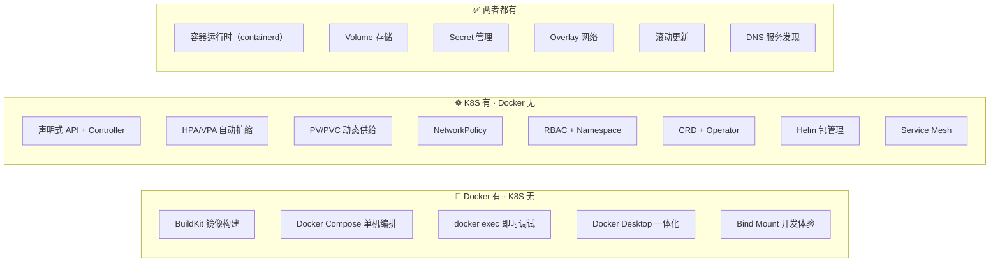
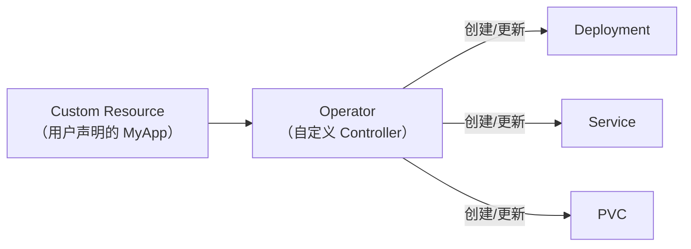

## 前置知识：差异是定位不同的取舍

Docker 定位是**容器运行时和单机编排工具**，K8S 定位是**企业级容器编排平台**。这决定了它们的能力边界：



> [!important] 迁移心态
> - **不要抱怨 K8S 没有 Docker Compose 那么简单** — 这是定位不同
> - **学习 K8S 独有的编排能力** — 这是 Docker 永远做不到的
> - **掌握双向对比** — 面试高频考点，也是迁移式学习的核心价值

---

## 第一板块：Docker 有、K8S 没有的 12 个核心特性

### 1. BuildKit 镜像构建能力

```dockerfile
# Docker 有完善的 Dockerfile + BuildKit 构建能力
# syntax=docker/dockerfile:1
FROM --platform=$BUILDPLATFORM golang:1.22-alpine AS builder
WORKDIR /src
COPY . .
RUN --mount=type=cache,target=/root/.cache/go-build \
    CGO_ENABLED=0 go build -o /app .

FROM gcr.io/distroless/static
COPY --from=builder /app /app
ENTRYPOINT ["/app"]
```

```bash
# Docker 构建命令
docker buildx build --platform linux/amd64,linux/arm64 -t myapp:latest .
docker buildx build --push -t registry.com/myapp:latest .
```

> [!important] K8S 不负责镜像构建
> K8S 是编排平台，不包含镜像构建能力。你仍然用 Docker（或 Buildah/Kaniko/Cloud Build）构建镜像，然后推送到仓库供 K8S 拉取运行。
> **CI/CD 流水线中 Docker 和 K8S 是互补的**：Docker 构建 → 推送仓库 → K8S 拉取部署。

### 2. Docker Compose 单机编排的简洁性

```yaml
# docker-compose.yaml —— 极简的单机多容器编排
services:
  web:
    build: .
    ports: ["8080:80"]
    depends_on: [db]
  db:
    image: postgres:15
    volumes: ["dbdata:/var/lib/postgresql/data"]
volumes:
  dbdata:
```

```bash
# 一条命令启动整个应用
docker compose up -d
docker compose ps
docker compose down
```

> [!tip] K8S 中需要多个 YAML 文件
> Docker Compose 一个文件搞定，K8S 需要 Deployment + Service + ConfigMap + Secret 等多个 YAML。但 K8S 的 Helm Chart 提供了类似的打包体验（见 [[毕业项目-Web应用K8S化/v5-Helm包管理版]]）。

### 3. `docker exec` 的即时调试体验

```bash
# Docker：一行命令进入容器
docker exec -it web sh
# 立即进入，无延迟

# K8S：命令更长，但逻辑一样
kubectl exec -it <pod-name> -- sh
# 需要先知道 Pod 名（kubectl get pods 查）
```

| 维度 | Docker | K8S |
|------|--------|------|
| 命令长度 | `docker exec -it <name> sh` | `kubectl exec -it <pod> -- sh` |
| 容器名稳定 | 是（`--name` 指定） | 否（Pod 名含随机后缀） |
| 多容器 Pod | 无此概念 | 需 `-c <container>` 指定 |

> [!tip] K8S 的 Pod 名不稳定怎么办？
> 用 `kubectl exec -it deployment/web -- sh` 直接指定 Deployment 名，K8S 会自动选一个 Pod。这接近 Docker 的体验。

### 4. Docker Desktop 一体化体验

Docker Desktop 包含：Docker 引擎 + Compose + BuildKit + Kubernetes（可选启用）+ GUI 管理界面。

K8S 没有类似的一体化桌面产品。minikube/kind 只提供集群，管理靠 kubectl。第三方工具如 **k9s**（终端 TUI）、**Lens**（图形界面）可替代。

### 5. 单机容器的简单性

```bash
# Docker 单机运行一个容器
docker run -d -p 8080:80 nginx
# 无需理解 Pod、Deployment、Service

# K8S 要运行一个 Pod 至少需要
kubectl create deployment nginx --image=nginx
kubectl expose deployment nginx --port=80
# 还要理解 Deployment、Pod、Service 的关系
```

> [!important] 简单场景 Docker 更合适
> 如果你只需要在一台机器上跑一个容器，Docker 更简单。K8S 的价值在规模化、自动化、自愈——这些在单机场景下是过度设计。

### 6. Bind Mount 的便捷性

```bash
# Docker：一行命令挂载本地代码
docker run -v $(pwd)/src:/app node:20

# K8S：需要用 hostPath 或 PVC，且不如 Docker 灵活
# 开发时通常用 Skaffold/DevSpace 等工具
```

> [!tip] 开发环境用 Docker，生产环境用 K8S
> 本地开发用 Docker Compose 更灵活便捷。生产部署用 K8S 获得编排能力。两者不是替代关系，而是互补。

### 7. Compose Watch 开发体验

```yaml
# docker-compose.yaml
services:
  web:
    build: .
    watch:
      - action: rebuild
        path: ./src
```

```bash
docker compose watch  # 文件变化自动重建容器
```

> K8S 没有原生文件监听重建能力。开发环境仍推荐 Docker Compose 或 Skaffold/Tilt。

### 8. `docker system prune` 一键清理

```bash
# Docker 一键清理无用资源
docker system prune -a
docker volume prune

# K8S 没有直接等价命令
kubectl delete pods --field-selector status.phase=Failed
kubectl delete pvc --all  # 危险！
```

### 9. `docker logs -f` 的简易性

```bash
# Docker：简单直接
docker logs -f myapp

# K8S：需要指定 Pod 名
kubectl logs -f <pod-name>
# 生产环境需要 kubetail、stern 或 Loki 等聚合工具
```

### 10. `docker network ls` 列出所有网络

Docker 有明确的网络列表概念。K8S 没有"网络列表"——CNI 插件管理网络，但不暴露为可查询的资源。

### 11. Dockerfile 的通用性

```dockerfile
# 同一个 Dockerfile 在 Docker 和 K8S 中都适用
FROM node:20-alpine
WORKDIR /app
COPY package*.json ./
RUN npm ci --production
COPY . .
EXPOSE 3000
CMD ["node", "server.js"]
```

> Docker 构建的镜像可以直接在 K8S 上运行。**Dockerfile 是 Docker 和 K8S 的共用桥梁**。

### 12. 单机部署的便利性

Docker 只需安装 Docker Desktop 即可。K8S 需要 minikube/kind/k3s 等额外工具，或者直接上云托管集群。学习成本从 1 天变成 1-2 周。

---

## 第二板块：K8S 有、Docker 没有的 15 个核心特性

> 这些特性是 K8S 的"杀手锏"，也是 Docker 用户迁移后最该掌握的新能力。

### 1. 声明式 API 与 Controller 模式（核心差异）

```yaml
# K8S：声明期望状态，控制器自动调和
apiVersion: apps/v1
kind: Deployment
metadata:
  name: web
spec:
  replicas: 3    # 告诉 K8S"我要 3 个副本"
```

```bash
# Docker：命令式，一次性描述"怎么做"
docker service create --replicas 3 web
# Swarm 也有自愈：task 挂了 Swarm 会自动重建以维持副本数
# K8S 的差异：声明期望状态 + 控制器持续调和（扩缩/更新/回滚一体化），并有 rollout history
```

```python
# Controller 模式的伪代码——所有 K8S 控制器都是这个逻辑
while True:
    desired = get_desired_state()   # YAML 中的期望状态
    actual = get_actual_state()     # 集群当前状态
    if desired != actual:
        reconcile()                 # 自动协调
    sleep(5)
```

| 维度 | Docker 命令式 | K8S 声明式 |
|------|--------------|-----------|
| 思维方式 | 一步一步怎么做 | 期望状态是什么 |
| 幂等性 | 无（重复执行会出错） | 有（重复执行无副作用） |
| 自愈 | 需 `--restart=always` | 控制器自动调和 |
| 版本管理 | 脚本 | YAML 纳入 git |

### 2. etcd 分布式状态存储

K8S 用独立的 etcd 集群存储所有状态。Docker 的状态存在 dockerd 内存和本地文件中，Swarm 用 Raft 但内置于引擎。

### 3. HPA/VPA 自动扩缩容

```bash
# K8S 独有：根据 CPU/内存自动扩缩
kubectl autoscale deployment web --cpu-percent=70 --min=2 --max=10
# 流量高峰自动扩到 10 个 Pod，低谷自动缩回 2 个
```

> **Docker 对比**：Docker/Swarm 没有原生自动扩缩能力，需外部工具。

### 4. Namespace 逻辑隔离

```bash
# K8S 独有：多租户隔离
kubectl create namespace dev
kubectl create namespace prod
# 不同命名空间的资源互相隔离
```

> **Docker 对比**：Docker 没有 Namespace 概念，Swarm 也只有 Stack 级别隔离。

### 5. RBAC 权限控制

```yaml
# K8S 独有：细粒度权限控制
apiVersion: rbac.authorization.k8s.io/v1
kind: Role
metadata:
  namespace: dev
  name: pod-reader
rules:
- apiGroups: [""]
  resources: ["pods"]
  verbs: ["get", "list", "watch"]
```

> **Docker 对比**：Docker 没有原生 RBAC，Swarm 有简单的节点角色（Manager/Worker）。

### 6. NetworkPolicy 网络策略

```yaml
# K8S 独有：Pod 间流量控制
apiVersion: networking.k8s.io/v1
kind: NetworkPolicy
spec:
  podSelector:
    matchLabels: { app: postgres }
  ingress:
  - from:
    - podSelector:
        matchLabels: { app: web }
```

> **Docker 对比**：Docker 没有原生网络策略，只能通过网络分段隔离。

### 7. liveness/readiness/startup 探针

```yaml
# K8S 独有：精细化健康检查
livenessProbe:     # 存活探针（Docker 的 HEALTHCHECK 只能做到这个级别）
  httpGet: { path: /health, port: 8080 }
readinessProbe:    # 就绪探针（Docker 完全没有）
  httpGet: { path: /ready, port: 8080 }
startupProbe:      # 启动探针（保护慢启动应用）
  httpGet: { path: /startup, port: 8080 }
```

> **Docker 对比**：Docker 的 `HEALTHCHECK` 类似 livenessProbe，但没有 readiness 概念。

### 8. CRD 与 Operator 模式

```yaml
# K8S 独有：自定义资源定义（CRD）
apiVersion: apiextensions.k8s.io/v1
kind: CustomResourceDefinition
metadata:
  name: myapps.example.com
spec:
  group: example.com
  scope: Namespaced
  names:
    plural: myapps
    singular: myapp
    kind: MyApp
  versions:
    - name: v1
      served: true
      storage: true
      schema:
        openAPIV3Schema:
          type: object
          properties:
            spec:
              type: object
              properties:
                replicas: { type: integer }
                image: { type: string }
```

### 8.1 Operator 深度实例：自定义 BackupSchedule CRD

> [!important] 下面是一个最小可运行的 Operator 示例
> 展示 CRD 定义 + CRD 实例 + Controller 伪代码，帮你理解 K8S 独有的扩展性。

**步骤 1：定义 CRD（自定义资源定义）**

```yaml
# crd-backupschedule.yaml —— 定义新的 API 资源类型
apiVersion: apiextensions.k8s.io/v1
kind: CustomResourceDefinition
metadata:
  name: backupschedules.backup.example.com
spec:
  group: backup.example.com          # API 组名
  names:
    plural: backupschedules
    singular: backupschedule
    kind: BackupSchedule             # kubectl get backupschedules
    shortNames: ["bs", "backup"]     # kubectl get bs
  scope: Namespaced
  versions:
  - name: v1
    served: true
    storage: true
    schema:
      openAPIV3Schema:
        type: object
        properties:
          spec:
            type: object
            properties:
              schedule:              # Cron 表达式
                type: string
              database:               # 备份目标
                type: string
              retention:              # 保留天数
                type: integer
                default: 7
              storageLocation:       # 备份存储位置
                type: string
```

**步骤 2：创建 CRD 实例（用户使用自定义资源）**

```yaml
# my-backup.yaml —— 像写 Deployment 一样写自定义资源
apiVersion: backup.example.com/v1
kind: BackupSchedule
metadata:
  name: daily-pg-backup
spec:
  schedule: "0 2 * * *"              # 每天凌晨 2 点
  database: "postgres"               # 备份 PostgreSQL
  retention: 30                      # 保留 30 天
  storageLocation: "s3://my-bucket/backups/"
```

```bash
# 安装 CRD
kubectl apply -f crd-backupschedule.yaml

# 创建备份计划（和创建 Deployment 一样的体验！）
kubectl apply -f my-backup.yaml
kubectl get backupschedules
kubectl describe backupschedule daily-pg-backup
```

**步骤 3：Controller 伪代码（Operator 的核心逻辑）**

```python
# backup_operator.py —— Operator 的 Reconcile Loop（伪代码）
# 这个控制器持续监控 BackupSchedule 资源，自动创建 CronJob
while True:
    # 1. 读取所有 BackupSchedule 资源
    schedules = list_backup_schedules()

    for schedule in schedules:
        # 2. 检查是否已有对应的 CronJob
        cronjob = get_cronjob(schedule.name)

        if cronjob is None:
            # 3. 不存在 → 创建 CronJob（自动生成 YAML）
            create_cronjob(
                name=f"backup-{schedule.name}",
                schedule=schedule.spec.schedule,
                command=f"pg_dump {schedule.spec.database} | aws s3 cp - {schedule.spec.storageLocation}",
                retention=schedule.spec.retention,
            )
            log(f"Created CronJob for {schedule.name}")

        elif cronjob.spec.schedule != schedule.spec.schedule:
            # 4. 配置变了 → 更新 CronJob
            update_cronjob(schedule.name, schedule.spec)
            log(f"Updated CronJob for {schedule.name}")

    # 5. 等待下一次循环
    sleep(30)
```

**Operator 的价值**：

| 维度 | 手动运维 | Operator 自动化 |
|------|---------|----------------|
| 创建备份任务 | 手动写 CronJob YAML | 声明 BackupSchedule CR，Operator 自动生成 |
| 修改备份计划 | 手动改 CronJob | 改 CR spec，Operator 自动同步 |
| 保留策略 | 手动写清理脚本 | Operator 内置 retention 逻辑 |
| 多数据库备份 | 每个写一套 YAML | 一个 CR 搞定，Operator 处理差异 |

> [!tip] Operator = 把运维 SRE 的知识编码为代码
> Docker 中运维靠脚本 + cron + 文档。K8S Operator 把运维知识编码为 Controller，用户只需声明 `spec`，Operator 负责一切。这就是 K8S 的"可编程基础设施"。

---

Operator = CRD + Controller，把运维知识编码为控制器：



```yaml
# 使用 Prometheus Operator（K8S 生态最成功的 Operator）
apiVersion: monitoring.coreos.com/v1
kind: Prometheus
metadata:
  name: my-prometheus
spec:
  replicas: 2
  serviceAccountName: prometheus
  serviceMonitorSelector: {}
```

| 维度 | Docker | K8S Operator |
|------|--------|-------------|
| 部署第三方软件 | `docker run` 启动单容器 | Operator 自动管理所有相关资源 |
| 运维自动化 | 脚本 + cron | 编码为 Controller |
| 升级/备份 | 手动 | Operator 自动处理 |

### 9. Helm 包管理

```bash
# K8S 独有：应用模板化包管理
helm repo add bitnami https://charts.bitnami.com/bitnami
helm install my-redis bitnami/redis
helm upgrade my-redis bitnami/redis --set replica.count=5
helm rollback my-release 1
helm uninstall my-redis
```

> **Docker 对比**：Docker Compose 有 Compose file，但不能模板化、不能版本管理、不能从仓库安装。Helm 相当于 K8S 的 apt/yum。

### 10. StatefulSet 稳定标识

```bash
# K8S 独有：有状态应用的有序管理
# Pod 名稳定：mysql-0, mysql-1, mysql-2
# DNS 稳定：mysql-0.mysql-headless.default.svc.cluster.local
# 存储稳定：每个 Pod 独立 PVC
```

> **Docker 对比**：Docker/Swarm 的 Task 名是随机的，没有稳定标识。

### 11. Pod 多容器协作

```yaml
# K8S 独有：Pod 内多容器共享网络和存储
spec:
  containers:
  - name: main        # 主容器
    image: myapp
  - name: sidecar     # Sidecar（日志/监控/代理）
    image: log-collector
  # 共享 localhost 和 Volume，同生共死
```

> **Docker 对比**：Docker 需要 `--volumes-from` 和 `--network container:xxx` 模拟，体验差很多。

### 12. Init Container 初始化

```yaml
# K8S 独有：初始化容器
spec:
  initContainers:
  - name: init-db
    image: alpine
    command: ["sh", "-c", "until nc -z postgres 5432; do sleep 1; done"]
  containers:
  - name: app
    image: myapp
# init 容器完成后才启动主容器
```

> **Docker 对比**：Docker Compose 用 `depends_on` + `healthcheck` 模拟，但不如 Init Container 灵活。

### 13. Job/CronJob 批处理

```yaml
# K8S 独有：原生批处理和定时任务
apiVersion: batch/v1
kind: CronJob
spec:
  schedule: "0 2 * * *"
  jobTemplate:
    spec:
      template:
        spec:
          containers:
          - name: backup
            image: postgres
          restartPolicy: OnFailure
```

> **Docker 对比**：Docker 需要 `cron + docker run` 或外部调度器（Airflow 等）。

### 14. 滚动更新与回滚（声明式）

```bash
# K8S：声明式滚动更新 + 自动回滚
kubectl set image deployment/web nginx=nginx:1.27-alpine
kubectl rollout status deployment/web    # 观察进度
kubectl rollout undo deployment/web      # 一键回滚
kubectl rollout history deployment/web   # 版本历史
kubectl rollout restart deployment/web   # 强制滚动重启
```

> **Docker 对比**：Swarm 有滚动更新和回滚（`docker service update`），但不如 K8S 完善（没有 rollout history）。

### 15. 集群自动扩缩（Cluster Autoscaler）

K8S 可以根据 Pending Pod 自动向云厂商请求新节点。Docker/Swarm 没有此能力。

---

## 第三板块：迁移策略矩阵

| Docker 习惯 | K8S 对应方案 | 难度 |
|------------|------------|------|
| `docker run -d nginx` | `kubectl create deployment nginx --image=nginx` | ⭐ |
| `docker compose up` | `kubectl apply -f *.yaml` / Helm | ⭐⭐ |
| `docker compose`（单文件） | Kustomize / Helm Chart | ⭐⭐⭐ |
| `docker build` | 外部构建（Docker/kaniko），K8S 只负责运行 | ⭐（不变） |
| `docker volume` | PV + PVC / StorageClass | ⭐⭐⭐ |
| `-e VAR=value` | ConfigMap | ⭐⭐ |
| `docker secret` | K8S Secret | ⭐⭐ |
| `docker service scale` | `kubectl scale` / HPA | ⭐⭐ |
| `docker service update --rollback` | `kubectl rollout undo` | ⭐ |
| `--constraint` | nodeSelector / nodeAffinity | ⭐⭐ |
| Swarm overlay 网络 | CNI 插件 | ⭐⭐⭐ |
| `docker exec -it` | `kubectl exec -it` | ⭐ |
| `docker logs -f` | `kubectl logs -f` / stern | ⭐ |
| `docker system prune` | 无直接等价（手动清理） | ⭐⭐⭐ |
| Traefik 反向代理 | Ingress Controller | ⭐⭐⭐ |

---

## 第四板块：你会特别想 Docker 的地方

| 场景 | Docker 方案 | K8S 现状 |
|------|------------|---------|
| 本地开发环境 | `docker compose up` 一行搞定 | 需 minikube + 多个 YAML + kubectl |
| 快速跑一个容器 | `docker run nginx` | `kubectl create deployment`（概念更多） |
| 热更新开发 | `-v` 挂载 + `nodemon` | Skaffold / Tilt / DevSpace |
| 挂载本地代码 | `-v $(pwd):/app` | 需 hostPath 或 DevSpace/Skaffold |
| Compose Watch | 文件变化自动重建 | 需 Skaffold/DevSpace/Tilt 工具 |
| 查看容器日志 | `docker logs -f myapp` | `kubectl logs -f <pod>`（分散） |
| 查看所有容器状态 | `docker ps` | `kubectl get pods -A` |
| 一键清理 | `docker system prune` | 无直接等价 |
| 镜像构建 | `docker build` | `docker build`（不变！） |
| 简单单机部署 | Docker Compose 足够 | K8S 是过度设计 |
| 学习成本 | 1 天上手 | 1-2 周入门 |

---

## 常见易错点

> [!warning] **坑 1：在 K8S 中找 `docker compose` 的等价物**
> K8S 没有单文件编排。最接近的是 `kubectl apply -f`（多文件）或 Helm Chart。
> **解决方案**：学习 Helm 和 Kustomize，理解 K8S 的"多资源声明式"思维。Kompose（`kompose convert`）可转换 compose.yaml 但复杂场景需手动调整。

> [!warning] **坑 2：试图用 `docker run` 在 K8S 集群中运行容器**
> ```bash
> # ❌ 即使节点上装了 Docker，docker run 起的容器也不归 K8S 管理
> docker run nginx  # 能执行，但 kubelet 不认识它：无探针/无自愈/不参与调度
>
> # ✅ 用 kubectl 创建资源
> kubectl create deployment nginx --image=nginx
> ```
> **为什么错**：1.24 移除的是 **dockershim**（kubelet 与 Docker 之间的适配层），不是 Docker 本身——节点装了 Docker 时 `docker run` 可以执行，只是该容器游离在 K8S 管理之外；未装 Docker 的节点则根本没有 docker CLI。
> **解决方案**：工作负载一律交给 `kubectl`（kubelet 经 CRI 使用 containerd 等运行时）；`docker build` 只用于 CI/CD 构建镜像。

> [!warning] **坑 3：期待 K8S 有 `docker exec` 的即时性**
> Docker：`docker exec -it web sh` 立即进入。K8S：需要先 `kubectl get pods` 找到 Pod 名。
> **解决方案**：用 `kubectl exec -it deployment/web -- sh` 直接指定 Deployment 名。

> [!warning] **坑 4：K8S 的 YAML 写起来比 Compose 多很多**
> 觉得 K8S 配置太繁琐。这是声明式 API 的代价，但换来的是可审计、可重复、可自动化。
> **解决方案**：用 Helm 模板化、Kustomize 复用、kubectl 别名提高效率。

> [!warning] **坑 5：用 Docker 思维管理 K8S**
> ```bash
> # ❌ 试图 exec 进 Pod 改配置
> kubectl exec -it pod-xxx -- vi /etc/nginx/nginx.conf
> # 改完 Pod 重建后配置丢失！
>
> # ✅ 用 ConfigMap + Deployment 管理
> # 改 ConfigMap → rollout restart → 配置生效且持久
> ```

> [!warning] **坑 6：K8S 默认不加密 Secret**
> Docker Swarm Secret 是加密存储的。K8S Secret 只是 base64。
> **解决方案**：启用 etcd 静态加密，或用 HashiCorp Vault/Sealed Secrets。

> [!warning] **坑 7：混淆 K8S ImagePullPolicy 和 Docker pull 行为**
> ```yaml
> # K8S 独有：控制镜像拉取策略
> spec:
>   containers:
>   - name: app
>     image: myapp:latest
>     imagePullPolicy: IfNotPresent  # 本地有就不拉（默认）
>     # Always: 每次都拉（latest 默认值）
>     # Never: 从不拉取
> ```
> Docker 默认每次 `docker run` 都检查本地是否有镜像。K8S 通过 `imagePullPolicy` 控制。

---

## 🎯 本文学完自检

| 层次 | 检查项 |
|------|--------|
| 🟢 基础 | 能列出 5 个 Docker 有但 K8S 没有的特性，给出 K8S 替代方案 |
| 🟢 基础 | 能列出 5 个 K8S 有但 Docker 没有的特性 |
| 🟡 进阶 | 能解释为什么 K8S 不包含镜像构建（定位不同） |
| 🟡 进阶 | 能对比 Docker Compose 和 Helm Chart 的差异，以及 Docker Swarm Secret 和 K8S Secret 的安全差异 |
| 🔴 挑战 | 能完整画出 Docker→K8S 迁移心智模型对比图，并说明每个 Docker 习惯的迁移路径 |

---

## 相关笔记

- ⬅️ 前置：[[01-环境搭建与核心概念映射]] — 基础概念差异
- ⬅️ 前置：[[02-Pod 与工作负载：从容器到 Pod]] — 工作负载差异
- ⬅️ 前置：[[03-Service 与网络：从 Docker 网络到 K8S]] — 网络差异
- ⬅️ 前置：[[04-存储与配置：从 Volume 到 PV-PVC]] — 存储差异
- ⬅️ 前置：[[05-调度与扩缩容：从 scale 到 HPA]] — 调度差异
- ➡️ 后续：[[01-学习/K8SLearningByDocker/07-业务场景实战合集|07-业务场景实战合集]] — 实战中应用双向对比
- ➡️ 后续：[[08-面试高频20问-Docker背景版]] — 高频对比题

---

*最后更新：2026-07-23*