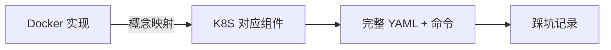

## 前置知识：场景迁移方法论

本篇把你在 Docker 中遇到的 10 个典型业务场景，逐一迁移到 K8S 实现。每个场景包含：**Docker 方案 → K8S 方案 → 关键差异 → 踩坑记录**。



| # | 场景 | Docker 方案 | K8S 方案 | 难度 |
|---|------|------------|---------|------|
| 1 | 微服务部署 | Docker Compose | Deployment + Service + Ingress | ⭐⭐⭐ |
| 2 | 灰度发布 | Traefik 标签 | Ingress Canary / Argo Rollouts | ⭐⭐⭐⭐ |
| 3 | 日志收集 | Loki / Docker Driver | Fluentd DaemonSet + Loki | ⭐⭐⭐ |
| 4 | 监控告警 | Prometheus + Docker | Prometheus Operator + Grafana | ⭐⭐⭐⭐ |
| 5 | 数据库部署 | `docker run postgres` | StatefulSet + PVC | ⭐⭐⭐⭐ |
| 6 | 配置管理 | `-e` + `.env` | ConfigMap + Secret | ⭐⭐ |
| 7 | 多租户隔离 | 多 Docker 网络 | Namespace + RBAC + ResourceQuota | ⭐⭐⭐⭐ |
| 8 | CI/CD 流水线 | `docker build` + compose up | docker build + kubectl apply / GitOps | ⭐⭐⭐⭐ |
| 9 | 灾备恢复 | Volume 备份 + Raft 备份 | etcd 备份 + Velero | ⭐⭐⭐ |
| 10 | 多环境管理 | 多 Compose 文件 | Namespace + Kustomize / Helm values | ⭐⭐⭐ |

---

## 场景 1：微服务部署（Docker Compose → Deployment + Service + Ingress）

### Docker 方案

```yaml
# docker-compose.yaml
services:
  web:
    image: nginx:alpine
    ports: ["80:80"]
    depends_on: [api]
  api:
    image: myapi:latest
    environment:
      DATABASE_URL: postgres://user:pass@db:5432/app
    depends_on: [db]
  db:
    image: postgres:15
    volumes: ["pgdata:/var/lib/postgresql/data"]
    environment:
      POSTGRES_PASSWORD: pass
volumes:
  pgdata:
```

```bash
docker compose up -d   # 一条命令启动
```

### K8S 方案

```yaml
# secret.yaml
apiVersion: v1
kind: Secret
metadata: { name: db-secret }
type: Opaque
stringData:
  POSTGRES_PASSWORD: pass
---
# web.yaml
apiVersion: apps/v1
kind: Deployment
metadata: { name: web }
spec:
  replicas: 2
  selector: { matchLabels: { app: web } }
  template:
    metadata: { labels: { app: web } }
    spec:
      containers:
      - name: nginx
        image: nginx:alpine
        ports: [{ containerPort: 80 }]
        resources: { requests: { cpu: 100m, memory: 64Mi } }
---
apiVersion: v1
kind: Service
metadata: { name: web }
spec:
  type: ClusterIP
  selector: { app: web }
  ports: [{ port: 80 }]
---
# api.yaml
apiVersion: apps/v1
kind: Deployment
metadata: { name: api }
spec:
  replicas: 3
  selector: { matchLabels: { app: api } }
  template:
    metadata: { labels: { app: api } }
    spec:
      containers:
      - name: api
        image: myapi:latest
        env:
        - name: DATABASE_URL
          value: "postgres://user:pass@db:5432/app"
        ports: [{ containerPort: 8080 }]
        readinessProbe:
          httpGet: { path: /health, port: 8080 }
---
apiVersion: v1
kind: Service
metadata: { name: api }
spec:
  selector: { app: api }
  ports: [{ port: 8080 }]
---
# db.yaml（StatefulSet + Headless Service）
apiVersion: v1
kind: Service
metadata: { name: db-headless }
spec:
  clusterIP: None
  selector: { app: db }
  ports: [{ port: 5432 }]
---
apiVersion: apps/v1
kind: StatefulSet
metadata: { name: db }
spec:
  serviceName: db-headless
  replicas: 1
  selector: { matchLabels: { app: db } }
  template:
    metadata: { labels: { app: db } }
    spec:
      containers:
      - name: postgres
        image: postgres:15
        env:
        - name: POSTGRES_PASSWORD
          valueFrom:
            secretKeyRef: { name: db-secret, key: POSTGRES_PASSWORD }
        volumeMounts:
        - { name: data, mountPath: /var/lib/postgresql/data }
  volumeClaimTemplates:
  - metadata: { name: data }
    spec:
      accessModes: [ReadWriteOnce]
      resources: { requests: { storage: 10Gi } }
---
# ingress.yaml
apiVersion: networking.k8s.io/v1
kind: Ingress
metadata:
  name: app-ingress
spec:
  ingressClassName: nginx
  rules:
  - host: app.example.com
    http:
      paths:
      - path: /
        pathType: Prefix
        backend: { service: { name: web, port: { number: 80 } } }
      - path: /api
        pathType: Prefix
        backend: { service: { name: api, port: { number: 8080 } } }
```

```bash
kubectl apply -f secret.yaml -f web.yaml -f api.yaml -f db.yaml -f ingress.yaml
kubectl get pods,svc,ingress
```

### 关键差异

| 维度 | Docker Compose | K8S |
|------|---------------|-----|
| 配置文件 | 1 个 YAML | 多个 YAML / Helm Chart |
| 服务关联 | 服务名直接 DNS | Service + 标签选择器 |
| 状态持久化 | `volumes:` 简单 | StatefulSet + PVC |
| 反向代理 | Traefik 标签 | Ingress YAML |
| 自愈能力 | `restart: always` | Deployment 控制器自动调和 |

> [!warning] 踩坑记录
> • Compose 的 `depends_on` 在 K8S 中需用 Init Container 实现
> • Secret 必须先于 Pod 创建，否则 Pod 启动失败

---

## 场景 2：灰度发布

### Docker 方案

```bash
# Docker Swarm + Traefik 加权路由（手动配置，较粗糙）
docker service update --image myapp:v2 --update-parallelism 1 web
```

### K8S 方案

```yaml
# v1 稳定版（注：使用 Canary 权重注解时流量比例由注解决定，与副本数无关，见下方 Canary Ingress）
apiVersion: apps/v1
kind: Deployment
metadata: { name: web-v1 }
spec:
  replicas: 4
  selector: { matchLabels: { app: web, version: v1 } }
  template:
    metadata: { labels: { app: web, version: v1 } }
    spec:
      containers: [{ name: web, image: myapp:v1 }]
---
# v2 灰度版
apiVersion: apps/v1
kind: Deployment
metadata: { name: web-v2 }
spec:
  replicas: 1
  selector: { matchLabels: { app: web, version: v2 } }
  template:
    metadata: { labels: { app: web, version: v2 } }
    spec:
      containers: [{ name: web, image: myapp:v2 }]
---
# Service 同时匹配 v1 和 v2（仅供"不配 Canary 注解、按副本数比例分流"的方案使用）
apiVersion: v1
kind: Service
metadata: { name: web }
spec:
  selector: { app: web }   # 匹配两个版本
  ports: [{ port: 80 }]
---
# v2 专用 Service（Canary Ingress 的 backend 必须指向真实存在的 Service）
apiVersion: v1
kind: Service
metadata: { name: web-v2 }
spec:
  selector: { app: web, version: v2 }   # 只匹配 v2 的 Pod
  ports: [{ port: 80 }]
---
# Canary Ingress（Nginx Ingress 支持）
# ★ 配置 canary-weight 后，流量比例完全由该注解决定（20% 到 web-v2，
#   其余 80% 到同 host/path 的主 Ingress 后端，如场景 1 的 app-ingress→web），
#   与两个 Deployment 的副本数无关；只有不使用 Canary 注解时，才按 Service web 匹配到的副本数比例分流
apiVersion: networking.k8s.io/v1
kind: Ingress
metadata:
  name: web-canary
  annotations:
    nginx.ingress.kubernetes.io/canary: "true"
    nginx.ingress.kubernetes.io/canary-weight: "20"
spec:
  rules:
  - host: app.example.com
    http:
      paths:
      - path: /
        pathType: Prefix
        backend: { service: { name: web-v2, port: { number: 80 } } }
```

```bash
# 逐步扩大灰度比例（使用 Canary 注解时改权重，而不是改副本数——副本数不影响注解方案的流量比例）
kubectl annotate ingress web-canary nginx.ingress.kubernetes.io/canary-weight="50" --overwrite    # 50%
kubectl annotate ingress web-canary nginx.ingress.kubernetes.io/canary-weight="100" --overwrite   # 100% 切换
```

> [!tip] 生产推荐用 Argo Rollouts
> 原生灰度是粗粒度的（按副本数比例）。Argo Rollouts 或 Istio 支持精确流量控制。

---

## 场景 3：日志收集

### Docker 方案

```bash
docker run --log-driver=fluentd --log-opt fluentd-address=localhost:24224 myapp
# 或 Loki Docker Driver
docker plugin install grafana/loki-docker-driver:latest
```

### K8S 方案

```yaml
# DaemonSet：每个节点自动部署一个日志收集器
apiVersion: apps/v1
kind: DaemonSet
metadata: { name: fluent-bit, namespace: kube-system }
spec:
  selector: { matchLabels: { app: fluent-bit } }
  template:
    metadata: { labels: { app: fluent-bit } }
    spec:
      containers:
      - name: fluent-bit
        image: fluent/fluent-bit:latest
        # tail 输入指向 /var/log/containers/*.log（containerd/CRI 日志软链目录）
        volumeMounts:
        - { name: varlog, mountPath: /var/log }
        - { name: logcontainers, mountPath: /var/log/containers, readOnly: true }
        - { name: logpods, mountPath: /var/log/pods, readOnly: true }
      volumes:
      - { name: varlog, hostPath: { path: /var/log } }
      - { name: logcontainers, hostPath: { path: /var/log/containers } }
      - { name: logpods, hostPath: { path: /var/log/pods } }
```

> [!important] DaemonSet 是 K8S 日志收集的核心
> Docker 中 Filebeat/Fluentd 以独立容器运行。K8S 中用 DaemonSet，自动在每个节点部署一个实例，无需手动配置。

---

## 场景 4：监控告警

### Docker 方案

```yaml
services:
  prometheus: { image: prom/prometheus, ports: ["9090:9090"] }
  grafana: { image: grafana/grafana, ports: ["3000:3000"] }
  node-exporter: { image: prom/node-exporter, pid: host }
```

### K8S 方案

```bash
# 一键安装完整监控栈（Prometheus + Grafana + AlertManager + Node Exporter）
helm repo add prometheus-community https://prometheus-community.github.io/helm-charts
helm install kube-prometheus prometheus-community/kube-prometheus-stack \
  --namespace monitoring --create-namespace \
  --set grafana.adminPassword=admin

# 访问 Grafana
kubectl port-forward -n monitoring svc/kube-prometheus-grafana 3000:80
# 浏览器打开 http://localhost:3000
```

> [!tip] K8S 监控生态比 Docker 成熟
> K8S 有 Prometheus Operator 自动发现 Pod/Service/Node。Docker 需手动配置 scrape 目标。

---

## 场景 5：数据库部署

### Docker 方案

```bash
docker run -d -v pgdata:/var/lib/postgresql/data -e POSTGRES_PASSWORD=pass postgres:15
```

### K8S 方案

```yaml
# Headless Service（StatefulSet 必需；CronJob 里的 postgres-0.postgres-headless 也依赖它解析）
apiVersion: v1
kind: Service
metadata: { name: postgres-headless }
spec:
  clusterIP: None
  selector: { app: postgres }
  ports: [{ port: 5432 }]
---
apiVersion: apps/v1
kind: StatefulSet
metadata: { name: postgres }
spec:
  serviceName: postgres-headless
  replicas: 1
  selector: { matchLabels: { app: postgres } }
  template:
    metadata: { labels: { app: postgres } }
    spec:
      containers:
      - name: postgres
        image: postgres:15-alpine
        env:
        - name: POSTGRES_PASSWORD
          valueFrom: { secretKeyRef: { name: db-secret, key: POSTGRES_PASSWORD } }   # 键名与场景 1 的 db-secret 统一
        - { name: PGDATA, value: /var/lib/postgresql/data/pgdata }
        volumeMounts:
        - { name: data, mountPath: /var/lib/postgresql/data }
        readinessProbe:
          exec: { command: ["pg_isready", "-U", "postgres"] }
  volumeClaimTemplates:
  - metadata: { name: data }
    spec:
      accessModes: [ReadWriteOnce]
      resources: { requests: { storage: 50Gi } }
---
# 定时备份（CronJob）
apiVersion: batch/v1
kind: CronJob
metadata: { name: postgres-backup }
spec:
  schedule: "0 2 * * *"
  timeZone: "Asia/Shanghai"
  jobTemplate:
    spec:
      template:
        spec:
          containers:
          - name: backup
            image: postgres:15-alpine
            command: ["pg_dump", "-h", "postgres-0.postgres-headless", "-U", "postgres", "mydb"]
          restartPolicy: OnFailure
```

> [!warning] 数据库上 K8S 的注意事项
> • 设置 `PGDATA=/var/lib/postgresql/data/pgdata`（避免挂载冲突）
> • `reclaimPolicy: Retain` 保护数据
> • 生产环境优先用 Operator（如 CloudNativePG / CrunchyData）
> • 很多团队选择把数据库留在 K8S 外部（如云托管 RDS）

---

## 场景 6-10 速览

### 场景 6：配置管理（ConfigMap + Secret + 热更新）

```yaml
apiVersion: v1
kind: ConfigMap
metadata: { name: app-config }
data:
  LOG_LEVEL: info
  DB_HOST: postgres.default.svc.cluster.local
---
# Pod 以 Volume 挂载，支持热更新
spec:
  containers:
  - name: app
    volumeMounts: [{ name: config, mountPath: /etc/app }]
  volumes:
  - { name: config, configMap: { name: app-config } }
```

### 场景 7：多租户隔离（Namespace + RBAC + ResourceQuota）

```yaml
apiVersion: v1
kind: Namespace
metadata: { name: team-a }
---
apiVersion: v1
kind: ResourceQuota
metadata: { name: team-a-quota, namespace: team-a }
spec:
  hard:
    requests.cpu: "10"
    requests.memory: 20Gi
    pods: "50"
```

### 场景 8：CI/CD 流水线（Docker 构建 + K8S 部署 + GitOps）

```yaml
# .github/workflows/deploy.yml
jobs:
  deploy:
    steps:
      - name: Build and Push
        run: |
          docker build -t registry.com/myapp:${{ github.sha }} .
          docker push registry.com/myapp:${{ github.sha }}
      - name: Deploy to K8S
        run: |
          kubectl set image deployment/myapp myapp=registry.com/myapp:${{ github.sha }}
          kubectl rollout status deployment/myapp
```

> [!tip] 生产推荐用 ArgoCD/FluxCD
> GitOps 模式：把 Git 仓库作为唯一真相源，ArgoCD 自动同步。比 CI 直接 kubectl apply 更安全。

### 场景 9：灾备恢复（etcd 备份 + Velero）

```bash
# 备份 etcd（K8S 的大脑）
ETCDCTL_API=3 etcdctl snapshot save /backup/etcd-$(date +%Y%m%d).db

# 用 Velero 备份整个集群（含 PV 数据）
velero install --provider aws --bucket k8s-backup
velero backup create full-cluster-backup
velero restore create --from-backup full-cluster-backup
```

### 场景 10：多环境管理（Namespace + Kustomize / Helm）

```bash
# K8S 原生方式：Kustomize overlay
kubectl apply -k overlays/dev
kubectl apply -k overlays/prod

# Helm 方式：values 文件
helm install myapp ./chart -f values-dev.yaml -n dev
helm install myapp ./chart -f values-prod.yaml -n prod
```

---

## 迁移检查清单

| 场景 | Docker 实现 | K8S 实现 | 状态 |
|------|------------|---------|------|
| 1. 微服务部署 | `docker compose up` | 多 Deployment + Service + Ingress | [ ] |
| 2. 灰度发布 | Traefik 加权 | Canary Deployment + Ingress | [ ] |
| 3. 日志收集 | docker log-driver | Fluentd DaemonSet | [ ] |
| 4. 监控告警 | Prometheus 容器 | Prometheus Operator (Helm) | [ ] |
| 5. 数据库部署 | `docker run -v` | StatefulSet + PVC | [ ] |
| 6. 配置管理 | `-e` + `.env` | ConfigMap + Secret | [ ] |
| 7. 多租户隔离 | 多 Docker 网络 | Namespace + RBAC | [ ] |
| 8. CI/CD | docker build + compose | docker build + kubectl apply | [ ] |
| 9. 灾备恢复 | Volume 备份 | etcd 备份 + Velero | [ ] |
| 10. 多环境管理 | 多 Compose 文件 | Kustomize / Helm values | [ ] |

---

## 🧪 实践练习

### 🟢 基础练习：微服务部署（场景 1）

```bash
# 1. 部署 web + api + db 到 K8S（参考场景 1 的 YAML）
# 2. 创建 Ingress 路由
# 3. 验证服务间通信
kubectl exec -it deployment/api -- sh -c "nc -z db 5432 && echo OK"
# 4. 访问 http://app.example.com → web，/api → api
# 5. 清理
kubectl delete -f secret.yaml -f web.yaml -f api.yaml -f db.yaml -f ingress.yaml
```

### 🟡 进阶练习：灰度发布（场景 2）

```bash
# 1. 部署 v1（4 副本）+ v2（1 副本）
# 2. 创建 Canary Ingress（20% 流量到 v2）
# 3. 用 wrk 发送请求，观察流量分布
# 4. 逐步扩大 v2 比例（20% → 50% → 100%）
# 5. 全量切换到 v2

# 思考题：Docker 中如何实现灰度发布？K8S 的优势在哪里？
```

### 🔴 挑战练习：完整可观测性栈

```bash
# 1. 用 Helm 安装 Prometheus + Grafana
helm install monitoring prometheus-community/kube-prometheus-stack -n monitoring --create-namespace
# 2. 部署 Fluentd DaemonSet 收集日志到 Loki
# 3. 在 Grafana 查看应用的 CPU/内存/请求量
# 4. 配置告警规则（如 API 错误率 > 1%）
# 5. 清理
helm uninstall monitoring -n monitoring
```

---

## 常见易错点

> [!warning] **坑 1：在 K8S 中用 `docker run` 启动容器**
> K8S 节点可能没有 docker CLI。用 `kubectl create deployment` 替代。

> [!warning] **坑 2：灰度发布 Service selector 太宽泛**
> 确保只匹配目标版本的 Pod 标签。

> [!warning] **坑 3：数据库 StatefulSet 没有配 PVC 模板**
> 不配 `volumeClaimTemplates` → 数据不持久，Pod 重建数据丢失。

> [!warning] **坑 4：CI/CD 中用 `kubectl create` 而非 `kubectl apply`**
> `create` 重复执行报错。CI/CD 必须用 `apply` 或 `helm upgrade --install`。

> [!warning] **坑 5：PostgreSQL 的 PGDATA 路径冲突**
> 挂载点 `/var/lib/postgresql/data` 与镜像内文件冲突。设置 `PGDATA=/var/lib/postgresql/data/pgdata`。

> [!warning] **坑 6：多环境用相同镜像 tag**
> dev/staging/prod 用相同 tag → 无法区分版本。每个环境用不同 tag。

> [!warning] **坑 7：Velero 备份忘记装存储插件**
> Velero 需要对应云厂商的插件才能备份 PV 数据。

---

## 🎯 本文学完自检

| 层次 | 检查项 |
|------|--------|
| 🟢 基础 | 能部署一个 3 层微服务（web + api + db）到 K8S，并通过 Ingress 访问 |
| 🟢 基础 | 能对比 Docker Compose 和 K8S 部署的配置文件数量和复杂度 |
| 🟡 进阶 | 能实现一个 Canary Deployment，观察流量分配 |
| 🟡 进阶 | 能用 Helm 安装 Prometheus + Grafana 监控栈 |
| 🔴 挑战 | 能设计生产级微服务架构，包含配置管理、监控、灰度发布、灾备恢复 |

---

## 相关笔记

- ⬅️ 前置：[[01-环境搭建与核心概念映射]] ~ [[06-Docker有K8S无与K8S有Docker无]] — 全部核心笔记
- ⬅️ 前置：[[../DockerNew/10-业务场景实战合集]] — Docker 场景回顾（对比参考）
- ➡️ 后续：[[08-面试高频20问-Docker背景版]] — 面试准备
- ➡️ 后续：[[毕业项目-Web应用K8S化/v1-Deployment基础版]] — 毕业项目入口

---

*最后更新：2026-07-23*