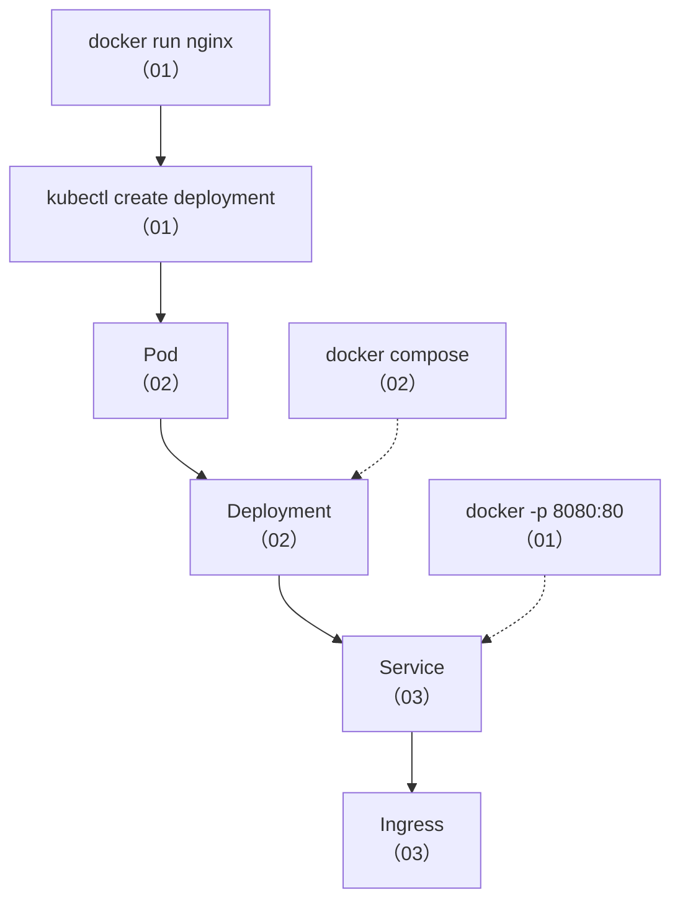

## 📚 第一周知识图谱



| 笔记 | 核心知识点 | Docker 锚点 |
|------|-----------|------------|
| 01 | K8S 架构、kubectl、声明式 API | docker run / dockerd |
| 02 | Pod、Deployment、StatefulSet | 容器 / Compose / Swarm |
| 03 | Service、Ingress、CoreDNS | -p / --network / Traefik |

---

## 🧪 综合练习：搭建 minikube → 部署 → 暴露 → 验证

```bash
# 步骤 1：启动 minikube
minikube start --driver=docker
kubectl get nodes   # 应看到 1 个 Ready 节点

# 步骤 2：部署 3 副本 Nginx（声明式）
cat > web.yaml << 'EOF'
apiVersion: apps/v1
kind: Deployment
metadata: { name: web }
spec:
  replicas: 3
  selector: { matchLabels: { app: web } }
  template:
    metadata: { labels: { app: web } }
    spec:
      containers:
      - { name: nginx, image: nginx:alpine, ports: [{ containerPort: 80 }] }
---
apiVersion: v1
kind: Service
metadata: { name: web-svc }
spec:
  type: NodePort
  selector: { app: web }
  ports: [{ port: 80, targetPort: 80 }]
EOF
kubectl apply -f web.yaml

# 步骤 3：验证
kubectl get pods -o wide           # 3 个 Pod
kubectl get svc web-svc            # NodePort 端口
minikube service web-svc --url     # 获取访问 URL
curl <URL>                         # 看到 Nginx 欢迎页

# 步骤 4：验证 CoreDNS
kubectl run test --rm -it --image=alpine -- sh -c "wget -qO- http://web-svc"
# 应看到 Nginx 欢迎页（DNS 解析成功）

# 步骤 5：模拟故障（自愈验证）——只删 1 个 Pod
# 注意：不能写 `kubectl delete pod -l app=web | head -1`——删除请求在管道前就已全部发出，
# head -1 只是截断输出，实际会删掉所有匹配的 Pod
kubectl delete pod $(kubectl get pods -l app=web -o jsonpath='{.items[0].metadata.name}')
kubectl get pods -w   # 观察新 Pod 自动创建（自愈！）

# 步骤 6：清理
kubectl delete -f web.yaml
```

---

## 📝 自测选择题

**1. K8S 1.24 移除 dockershim 后，Docker 构建的镜像还能在 K8S 上运行吗？**
- A. 不能，必须重新用 containerd 构建
- B. 能，镜像格式是 OCI 标准 ✅
- C. 只有 Docker Hub 上的镜像可以
- D. 需要转换工具

**2. 下面哪个命令是声明式操作？**
- A. `kubectl run nginx --image=nginx`
- B. `kubectl create deployment nginx --image=nginx`
- C. `kubectl apply -f deployment.yaml` ✅
- D. `kubectl delete pod nginx`

**3. Pod 和 Docker 容器的核心区别是？**
- A. Pod 可以包含多个容器共享网络和存储 ✅
- B. Pod 运行更快
- C. Pod 不需要镜像
- D. Pod 只能在 Linux 上运行

**4. Service 的 selector 作用是？**
- A. 限制 Service 可以访问的网络
- B. 通过标签匹配 Pod ✅
- C. 选择 Service 类型
- D. 选择命名空间

**5. 下面哪个 Service 类型适合对外暴露生产服务？**
- A. ClusterIP
- B. NodePort
- C. LoadBalancer ✅
- D. Headless

**6. `kubectl delete pod xxx` 后 Pod 又出现了，原因是？**
- A. 这是 bug
- B. Pod 由 Deployment 管理，Controller 自动重建 ✅
- C. Pod 没真的删除
- D. K8S 版本问题

**7. Ingress 的作用是？**
- A. 提供 ClusterIP
- B. 基于域名和路径的 HTTP 路由（对标 Docker Traefik） ✅
- C. 管理容器网络
- D. 存储配置

---

## 💻 编码练习

**练习 1**：写一个 Deployment YAML，要求 3 副本、用 `nginx:1.27-alpine` 镜像、CPU request 100m、内存 request 128Mi、配置 livenessProbe（HTTP GET / 端口 80）。

**练习 2**：写一个 Ingress，要求 `web.example.com` → web Service，`api.example.com` → api Service。

> 参考答案见 [[01-环境搭建与核心概念映射]] 和 [[03-Service 与网络：从 Docker 网络到 K8S]]。

---

## 📊 分级反馈表

| 你的得分 | 建议 |
|----------|------|
| 全部正确 + 编码练习完成 | ✅ 可以直接进入第二周 |
| 错 1-2 题 | ⚠️ 回顾 [[01-环境搭建与核心概念映射]] 的声明式 API 和 [[03-Service 与网络：从 Docker 网络到 K8S]] 的 Service 类型 |
| 错 3-4 题 | 🔄 重新学习 01-03 全部笔记，重点理解 Docker→K8S 概念映射 |
| 错 5+ 题 | 📖 建议从 [[01-环境搭建与核心概念映射]] 重新开始，打好基础 |

---

## 相关笔记

- ⬅️ 覆盖：[[01-环境搭建与核心概念映射]]
- ⬅️ 覆盖：[[02-Pod 与工作负载：从容器到 Pod]]
- ⬅️ 覆盖：[[03-Service 与网络：从 Docker 网络到 K8S]]
- ➡️ 下一个检查点：[[01-学习/K8SLearningByDocker/99-第二周复习检查点|99-第二周复习检查点]]

---

*最后更新：2026-07-23*