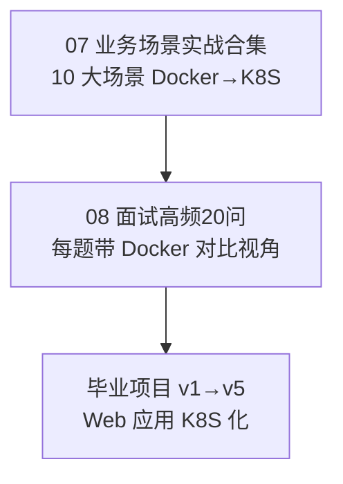

## 📚 第三周知识图谱



| 笔记 | 核心能力 | Docker 锚点 |
|------|---------|------------|
| 07 | 10 大场景完整迁移（微服务、灰度、日志、监控等） | 10 大 Docker 场景 |
| 08 | 面试 20 题三段式回答 + Docker 对比 | Docker 面试题 |

---

## 🧪 综合练习：Docker Compose → K8S 完整迁移

### 原始应用

```yaml
# docker-compose.yaml
services:
  web:
    image: nginx:alpine
    ports: ["80:80"]
    depends_on: [api]
  api:
    image: myapi:latest
    environment:
      DATABASE_URL: postgres://user:pass@db:5432/app
    depends_on: [db]
  db:
    image: postgres:15
    volumes: ["pgdata:/var/lib/postgresql/data"]
    environment:
      POSTGRES_PASSWORD: pass
volumes:
  pgdata:
```

### 迁移任务清单

| # | 任务 | K8S 组件 | 状态 |
|---|------|---------|------|
| 1 | web 服务部署 | Deployment + Service | [ ] |
| 2 | api 服务部署 | Deployment + Service + readinessProbe | [ ] |
| 3 | db 服务部署 | StatefulSet + PVC + Headless Service | [ ] |
| 4 | 配置管理 | ConfigMap + Secret | [ ] |
| 5 | 网络路由 | Ingress | [ ] |
| 6 | 自动扩缩 | HPA | [ ] |
| 7 | 部署到 K8S | `kubectl apply -f` | [ ] |
| 8 | 验证 | 端口转发/Ingress | [ ] |

### 验收标准

- [ ] web、api、db 三个服务全部 Running
- [ ] Ingress 路由正确（`/` → web，`/api` → api）
- [ ] db 数据持久化（删除 Pod 后数据不丢失）
- [ ] ConfigMap 配置生效
- [ ] HPA 自动扩缩（可手动触发）

---

## 🎤 模拟面试

### 练习 1：3 分钟口述迁移项目

```
准备一段 3 分钟的口述：
"我学习 K8S 的路线是从 Docker 迁移切入的。我掌握了 Docker 的容器编排能力后，
 发现 K8S 在调度、扩缩容、自愈方面有更强大的方案，例如 HPA 自动扩缩容、
 PV/PVC 动态供给、声明式 API 的 Controller 模式。
 我的实战项目是将一个 Docker Compose 微服务迁移到 K8S..."
```

### 练习 2：随机选 5 道题口述回答

从 [[08-面试高频20问-Docker背景版]] 中随机选 5 道题，每道题按黄金三段式回答：
- ① 先说结论（一句话定性）
- ② 再展开原理（带 Docker 对比）
- ③ 再补充生产经验（踩坑/选型）

### 练习 3：架构设计题

```
题目：设计一个支持 1000 QPS 的电商系统 K8S 部署方案
要求包含：
- 工作负载类型选择（Deployment vs StatefulSet）
- 网络架构（Service + Ingress + NetworkPolicy）
- 存储方案（PVC + ConfigMap + Secret）
- 扩缩容策略（HPA + 自定义指标）
- 灾备恢复（etcd 备份 + Velero）
```

---

## 📝 自测选择题

**1. 把 Docker Compose 迁移到 K8S，最接近的 K8S 工具是？**
- A. kubectl create
- B. Helm Chart / Kustomize ✅
- C. docker compose（K8S 不支持）
- D. Skaffold

**2. 灰度发布在 K8S 中如何实现？**
- A. 只能通过 Argo Rollouts
- B. 通过 Canary Deployment + Ingress 加权 ✅
- C. 直接修改 Deployment 的 image
- D. 不支持

**3. 日志收集在 K8S 中用什么部署？**
- A. Sidecar
- B. Deployment
- C. DaemonSet ✅
- D. StatefulSet

**4. 生产环境数据库部署推荐用？**
- A. 裸 Pod
- B. Deployment
- C. StatefulSet ✅
- D. DaemonSet

**5. 面试回答的黄金三段式是？**
- A. 问题→原因→结论
- B. 结论→原理→生产经验 ✅
- C. 现象→分析→修复
- D. 背景→方案→实施

**6. GitOps 的核心思想是？**
- A. 用 Git 管理代码版本
- B. 用 Git 仓库作为唯一真相源，自动同步到 K8S ✅
- C. 手动 kubectl apply
- D. 用 Docker Compose 部署

---

## 💻 编码练习

**练习 1**：写一个 CronJob，每天凌晨 2 点（北京时间）备份 PostgreSQL 数据库。

**练习 2**：准备面试 Q5（Service 类型）和 Q10（HPA 工作原理）的三段式回答，录音并对照参考答案。

> 参考答案见 [[01-学习/K8SLearningByDocker/07-业务场景实战合集|07-业务场景实战合集]] 和 [[08-面试高频20问-Docker背景版]]。

---

## 📊 毕业项目验收

| 版本 | 完成状态 | 验收标准 |
|------|---------|---------|
| v1: Deployment 基础 | [ ] | `kubectl apply` 能跑起来 |
| v2: Service 网络 | [ ] | 通过 Ingress 访问 |
| v3: 存储持久化 | [ ] | 删除 Pod 后数据保留 |
| v4: ConfigMap/Secret | [ ] | 配置外部化，更新 ConfigMap 可热更新 |
| v5: Helm 包管理 | [ ] | `helm install` 一键部署 |

---

## 📊 分级反馈表

| 你的得分 | 建议 |
|----------|------|
| 全部正确 + 编码练习完成 | ✅ 可以开始毕业项目 |
| 错 1-2 题 | ⚠️ 回顾 [[01-学习/K8SLearningByDocker/07-业务场景实战合集|07-业务场景实战合集]] 的场景 1 和 [[08-面试高频20问-Docker背景版]] 的黄金三段式 |
| 错 3-4 题 | 🔄 重新学习 07-08 全部笔记 |
| 错 5+ 题 | 📖 建议从 [[01-学习/K8SLearningByDocker/07-业务场景实战合集|07-业务场景实战合集]] 重新开始 |

---

## 🎓 恭喜你完成学习路径

如果你完成了：
- ✅ 8 篇核心笔记的 🟢 自检项
- ✅ 3 个复习检查点
- ✅ 第三周综合练习
- ✅ 20 道面试题准备

你已经具备了 Docker→K8S 迁移的系统认知。下一步：

1. **开始毕业项目** [[毕业项目-Web应用K8S化/v1-Deployment基础版]]
2. **在真实项目中实践**
3. **深入学习** [[05b-Helm 与 Chart 模板]] / [[05-调度与扩缩容：从 scale 到 HPA]]
4. **准备 CKA/CKAD 认证**

---

## 相关笔记

- ⬅️ 覆盖：[[01-学习/K8SLearningByDocker/07-业务场景实战合集|07-业务场景实战合集]]
- ⬅️ 覆盖：[[08-面试高频20问-Docker背景版]]
- ⬅️ 前置检查点：[[01-学习/K8SLearningByDocker/99-第二周复习检查点|99-第二周复习检查点]]
- ➡️ 毕业项目：[[毕业项目-Web应用K8S化/v1-Deployment基础版]]
- 🏆 完成：[[00-K8S 总览索引（Docker 迁移版）]] — 回到总览

---

*最后更新：2026-07-23*