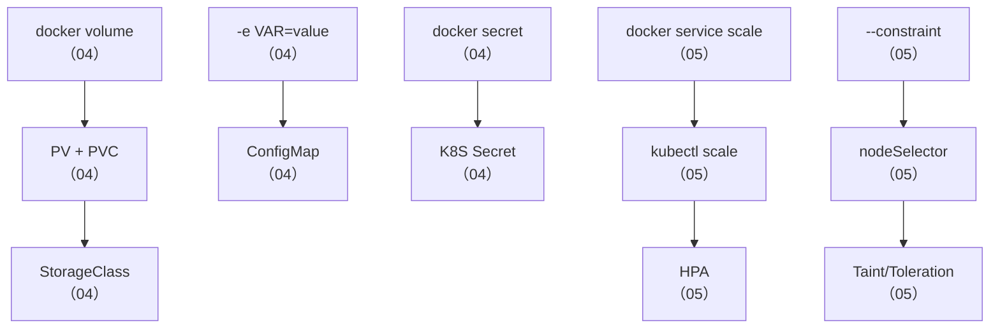

## 📚 第二周知识图谱



| 笔记 | 核心知识点 | Docker 锚点 |
|------|-----------|------------|
| 04 | PV/PVC/StorageClass、ConfigMap/Secret | Volume、`-e` |
| 05 | Scheduler、HPA、nodeAffinity、Taint | scale、constraint |
| 06 | 双向特性全景对比、迁移策略 | Docker 全栈 |

---

## 🧪 综合练习：StatefulSet + PVC + ConfigMap + HPA

```bash
# 步骤 1：创建 ConfigMap 管理 Redis 配置
kubectl apply -f - << 'EOF'
apiVersion: v1
kind: ConfigMap
metadata: { name: redis-config }
data:
  redis.conf: |
    maxmemory 256mb
    maxmemory-policy allkeys-lru
    save 900 1
EOF

# 步骤 2：创建 StatefulSet Redis（带 PVC 持久化）
kubectl apply -f - << 'EOF'
apiVersion: v1
kind: Service
metadata: { name: redis-headless }
spec:
  clusterIP: None
  selector: { app: redis }
  ports: [{ port: 6379 }]
---
apiVersion: apps/v1
kind: StatefulSet
metadata: { name: redis }
spec:
  serviceName: redis-headless
  replicas: 1
  selector: { matchLabels: { app: redis } }
  template:
    metadata: { labels: { app: redis } }
    spec:
      containers:
      - name: redis
        image: redis:7-alpine
        command: ["redis-server", "/etc/redis/redis.conf"]
        ports: [{ containerPort: 6379 }]
        volumeMounts:
        - { name: data, mountPath: /data }
        - { name: config, mountPath: /etc/redis }
      volumes:
      - { name: config, configMap: { name: redis-config } }
  volumeClaimTemplates:
  - metadata: { name: data }
    spec:
      accessModes: [ReadWriteOnce]
      resources: { requests: { storage: 5Gi } }
EOF

# 步骤 3：创建带资源请求的 Deployment + HPA
kubectl create deployment hpatest --image=nginx:alpine --replicas=1
kubectl set resources deployment hpatest --requests=cpu=100m,memory=128Mi
kubectl expose deployment hpatest --port=80   # Deployment 名不注册 DNS，需 Service 才能被 wget http://hpatest 解析
minikube addons enable metrics-server
kubectl autoscale deployment hpatest --cpu-percent=50 --min=1 --max=5
kubectl get hpa

# 步骤 4：生成负载，观察 HPA 自动扩容
kubectl run load --rm -it --image=busybox:1.36 -- \
  /bin/sh -c "while true; do wget -q -O- http://hpatest; done"
# 另一个终端观察
kubectl get hpa -w
kubectl get pods -w

# 步骤 5：验证 Redis 数据持久化
kubectl exec -it redis-0 -- redis-cli SET test "persistent"
kubectl delete pod redis-0
# 等待重建
kubectl exec -it redis-0 -- redis-cli GET test
# 应看到 "persistent"（数据保留！）

# 步骤 6：清理
kubectl delete statefulset redis
kubectl delete svc redis-headless
kubectl delete pvc data-redis-0
kubectl delete configmap redis-config
kubectl delete hpa hpatest
kubectl delete svc hpatest
kubectl delete deployment hpatest
```

---

## 📝 自测选择题

**1. PV 和 PVC 的关系是？**
- A. PV 是用户请求，PVC 是资源
- B. PV 是集群级存储资源，PVC 是用户存储请求 ✅
- C. 两者一样
- D. PV 替代 PVC

**2. ConfigMap 以 Volume 挂载时支持热更新吗？**
- A. 不支持，需要重启 Pod
- B. 支持，自动同步（有延迟） ✅
- C. 支持且立即生效
- D. 仅支持删除

**3. K8S Secret 默认的存储方式是？**
- A. AES 加密
- B. base64 编码（不是加密！） ✅
- C. 明文
- D. RSA 加密

**4. HPA 不工作时，最可能的原因是？**
- A. 集群节点太多
- B. 没有安装 Metrics Server 或 Deployment 没有 resources.requests ✅
- C. K8S 版本太低
- D. Pod 太多

**5. 下面哪个是 K8S 独有而 Docker 没有的？**
- A. 滚动更新
- B. Secret 管理
- C. Taint/Toleration ✅
- D. Volume

**6. Docker 有而 K8S 没有的是？**
- A. HPA 自动扩缩
- B. NetworkPolicy
- C. Dockerfile / BuildKit 镜像构建 ✅
- D. 声明式 API

**7. StorageClass 的作用是？**
- A. 手动创建 PV
- B. 动态供给 PV ✅
- C. 备份 PVC
- D. 限制存储大小

---

## 💻 编码练习

**练习 1**：写一个 StatefulSet YAML，要求 3 副本 PostgreSQL、每 Pod 独立 10Gi PVC、用 Secret 注入密码。

**练习 2**：写一个 HPA YAML，要求目标 Deployment: web、min 2、max 10、CPU 阈值 70%、缩容稳定窗口 300 秒。

**练习 3**：写一个 NetworkPolicy，只允许 `app=web` 的 Pod 访问 `app=postgres` 的 5432 端口。

> 参考答案见 [[04-存储与配置：从 Volume 到 PV-PVC]]、[[05-调度与扩缩容：从 scale 到 HPA]] 和 [[03-Service 与网络：从 Docker 网络到 K8S]]。

---

## 📊 分级反馈表

| 你的得分 | 建议 |
|----------|------|
| 全部正确 + 编码练习完成 | ✅ 可以直接进入第三周 |
| 错 1-2 题 | ⚠️ 回顾 [[04-存储与配置：从 Volume 到 PV-PVC]] 的 PV/PVC 和 [[06-Docker有K8S无与K8S有Docker无]] 的双向对比 |
| 错 3-4 题 | 🔄 重新学习 04-06 全部笔记 |
| 错 5+ 题 | 📖 建议从 [[04-存储与配置：从 Volume 到 PV-PVC]] 重新开始 |

---

## 相关笔记

- ⬅️ 覆盖：[[04-存储与配置：从 Volume 到 PV-PVC]]
- ⬅️ 覆盖：[[05-调度与扩缩容：从 scale 到 HPA]]
- ⬅️ 覆盖：[[06-Docker有K8S无与K8S有Docker无]]
- ⬅️ 前置检查点：[[01-学习/K8SLearningByDocker/99-第一周复习检查点|99-第一周复习检查点]]
- ➡️ 下一个检查点：[[01-学习/K8SLearningByDocker/99-第三周复习检查点|99-第三周复习检查点]]

---

*最后更新：2026-07-23*