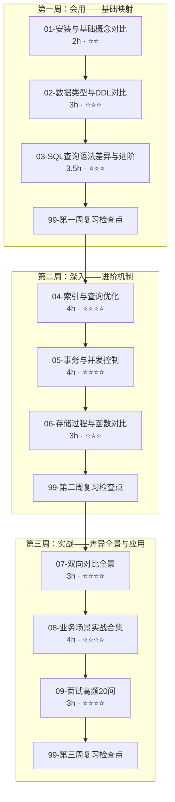
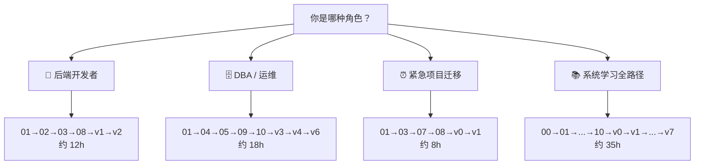

> [!info] 版本基线
> PostgreSQL 14–16（注意：分区表使用 IDENTITY 列需 PG 17+，本文脚本一律用 BIGSERIAL）；MySQL 8.0.x；SKIP LOCKED 需 PG 9.5+；PgBouncer 1.21+ 才在 transaction 模式支持协议级 prepared statements。
>
> **🔄 2026-09 版本差异**：PostgreSQL 18 已于 2025-09-25 发布（现行 minor 18.6）。值得关注的新能力：异步 I/O（AIO）提升 I/O 吞吐、多列 B-tree 的 skip scan、`uuidv7()` 函数、virtual generated columns、OAuth 认证。本路径脚本在 16/17/18 上均可运行；"PG16→PG18 迁移"专题后续按需补充，重点服务量化主线的行情存储选型。

## 前置知识：为什么用迁移式学习

你已掌握 MySQL，想学 PostgreSQL。传统路径从零讲"什么是表""什么是索引"——对你来说太慢。迁移式学习以 **MySQL 为认知锚点**，逐篇映射已知概念到 PostgreSQL 等价物，差异大的重点讲，差异小的快速跳过。


> [!important] 迁移式学习的三类内容
> • **🔄 共有概念**（快速映射）：表、索引、事务、JOIN、子查询——语法大同小异，速览即可
> • **⚡ PG 独有特性**（深入学习）：JSONB 索引、GIN/GiST/BRIN 索引、数组类型、CTE 递归、窗口函数、PL/pgSQL、扩展生态（pg_stat_statements、pg_partman、PostGIS）
> • **🔀 双向对比**（系统梳理）：MySQL 有 PG 无的特性 + PG 有 MySQL 无的特性——这是迁移路径的核心差异化价值

---

## 一、课程清单

| # | 笔记 | MySQL 锚点 | 差异等级 | 建议学时 |
|---|------|------------|---------|---------|
| 00 | [[00-PostgreSQL 总览索引（MySQL 迁移版）]] | — | — | 0.5h |
| 01 | [[01-安装与基础概念对比]] | mysql 服务/CLI → psql/进程架构 | ⭐⭐ 中 | 2h |
| 02 | [[02-数据类型与DDL对比]] | INT/VARCHAR/DATETIME → 数值/文本/时间/JSONB/数组 | ⭐⭐⭐ 高 | 3h |
| 03 | [[03-SQL查询语法差异与进阶]] | LIMIT/隐式转换 → RETURNING/CTE/窗口函数 | ⭐⭐⭐ 高 | 3.5h |
| 04 | [[04-索引与查询优化]] | BTREE → B-tree/Hash/GIN/GiST/BRIN + EXPLAIN | ⭐⭐⭐⭐ 高 | 4h |
| 05 | [[05-事务与并发控制]] | 隔离级别/行锁 → MVCC/快照/死锁/VACUUM | ⭐⭐⭐⭐ 高 | 4h |
| 06 | [[06-存储过程与函数对比]] | PROCEDURE/FUNCTION → PL/pgSQL/触发器/扩展 | ⭐⭐⭐ 高 | 3h |
| 07 | [[07-双向对比-MySQL有PG无与PG有MySQL无]] | 全景差异矩阵 + 迁移策略 | ⭐⭐⭐⭐ 高 | 3h |
| 08 | [[08-业务场景实战合集]] | 10 大生产场景完整迁移代码 | ⭐⭐⭐⭐ 高 | 4h |
| 09 | [[09-面试高频20问-MySQL背景版]] | 每题带 MySQL 对比 + 系统设计 | ⭐⭐⭐⭐ 高 | 3.5h |
| 10 | [[10-扩展与运维实战-pg_repack与Citus]] | 在线表重组 + 分布式扩展 | ⭐⭐⭐⭐⭐ 高 | 4h |
| v0 | [[v0-数据库初始化]] | 统一建表 + 测试数据 | ⭐ | 1h |
| v6 | [[v6-pg_repack在线表重组]] | pg_repack 毕业项目 | ⭐⭐⭐⭐⭐ | 2h |
| v7 | [[v7-Citus分布式扩展]] | Citus 毕业项目 | ⭐⭐⭐⭐⭐ | 2h |
| 审查 | reviews/（结构/技术/体验） | 三份审查报告 | — | 1.5h |

**总学时：约 40 小时（三周递进 + v0-v7 毕业项目 + 生产运维 + 审查报告）**

---

## 二、三周学习路线图



### 阶段检验标准

| 阶段 | 目标 | 检验标准 |
|------|------|---------|
| **第一周** | 能在 PG 上完成日常 CRUD 操作 | 独立完成数据类型迁移 + 常用查询改写 |
| **第二周** | 理解 PG 的索引、事务、存储过程机制 | 能解释 MVCC 原理 + 画出索引选择决策图 |
| **第三周** | 能应对生产场景和面试 | 完成毕业项目 v5 + 模拟面试全部答出 |

---

## 三、角色导航表（按角色选择学习路线）

不同背景的学习者，推荐的精简路线不同。找到你的角色，直接走对应路线：



| 角色 | 推荐路线 | 预计学时 | 核心目标 |
|------|---------|---------|----------|
| 🔧 **后端开发者**（偏 CRUD + ORM） | 01→02→03→08→v0→v1→v2 | ~12h | 能在应用代码中正确使用 PG 类型、SQL 语法、JSONB |
| 🗄️ **DBA / 运维工程师** | 01→04→05→09→10→v3→v4→v6 | ~18h | 能调优索引、管理 VACUUM、处理膨胀、监控慢查询 |
| ⏰ **紧急项目迁移**（下周要迁移） | 01→03→07→08→v0→v1 | ~8h | 能快速完成 MySQL→PG 的 SQL 改写和表结构迁移 |
| 📚 **系统学习全路径** | 00→01→…→10→v0→v1→…→v7 | ~35h | 从基础到分布式，全面掌握 PG + 面试 + 生产运维 |

> [!tip] 能力评估矩阵
> 完成 70% 的练习和毕业项目 = **中级**（能独立完成日常 PG 开发）
> 完成 85% = **高级**（能处理索引调优、MVCC 问题、迁移方案设计）
> 完成 95% = **专家级**（能设计高可用架构、Citus 分布式、面试全部答出）

---

## 四、核心概念对照表

### 架构层

| MySQL | PostgreSQL | 差异说明 |
|-------|-----------|---------|
| 线程池模型（一个连接一个线程） | 进程模型（一个连接一个后端进程） | PG 用多进程而非多线程 |
| 存储引擎可插拔（InnoDB/MyISAM） | 无多引擎，表即 heap/index | PG 不区分存储引擎，所有表统一 |
| Database = 逻辑容器 | Database 物理隔离 + Schema 逻辑分组 | PG 的 database 隔离更强，跨库需 FDW |
| Server 层 + 引擎层 | 单一服务进程，无分层 | PG 没有 MySQL 的 Server/Engine 分层 |

### 数据层

| MySQL | PostgreSQL | 差异说明 |
|-------|-----------|---------|
| `AUTO_INCREMENT` | `SERIAL` / `GENERATED ... AS IDENTITY` | PG 用序列对象实现自增 |
| `INT(11)` 显示宽度 | `INTEGER`（无显示宽度概念） | PG 对 `INT(11)` 直接报语法错误 |
| `VARCHAR(n)` / `TEXT` | `VARCHAR(n)` / `TEXT`（几乎一致） | 低差异 |
| `DATETIME` / `TIMESTAMP` | `TIMESTAMP` / `TIMESTAMPTZ` | PG 有带时区的时间戳 |
| `JSON` 类型 | `JSON` / `JSONB`（JSONB 更推荐） | PG 的 JSONB 可高效索引 |
| 无数组类型 | 原生数组类型 `int[]` / `text[]` | PG 独有，支持数组操作 |
| `ENUM` 字符串枚举 | `CREATE TYPE ... AS ENUM` | PG 需先创建类型再使用 |
| `DOUBLE` / `FLOAT` | `DOUBLE PRECISION` / `REAL` | 命名不同，语义相近 |

### SQL 层

| MySQL | PostgreSQL | 差异说明 |
|-------|-----------|---------|
| `LIMIT offset, count` 或 `LIMIT count OFFSET offset` | `LIMIT count OFFSET offset` | 语法一致但 PG 不支持逗号语法 |
| 无 `RETURNING` | `INSERT/UPDATE/DELETE ... RETURNING *` | PG 独有，替代 `LAST_INSERT_ID()` |
| 递归 CTE + 非递归 CTE（8.0+ 含 WITH RECURSIVE） | 递归 CTE + 非递归 CTE | 两者都支持；PG 的真正差异点是 MATERIALIZED/NOT MATERIALIZED 提示与 CTE 中可写 DML |
| 窗口函数（8.0+） | 窗口函数（功能更完整） | PG 支持更多窗口帧选项 |
| GROUP BY 宽松模式（可 SELECT 非聚合列，需关闭 ONLY_FULL_GROUP_BY） | GROUP BY 严格模式（必须聚合或分组） | MySQL 5.7.5+/8.0 默认 sql_mode 含 ONLY_FULL_GROUP_BY，默认同样报错 |
| 隐式类型转换（宽松） | 严格类型检查（几乎不隐式转换） | PG 会报类型错误 |
| 反引号 \`column\` | 双引号 "column"（区分大小写） | PG 默认转小写，双引号保留大小写 |

### 运维层

| MySQL | PostgreSQL | 差异说明 |
|-------|-----------|---------|
| `SHOW PROCESSLIST` | `pg_stat_activity` 视图 | PG 用系统视图查连接 |
| `EXPLAIN` / `EXPLAIN ANALYZE`（MySQL 8.0） | `EXPLAIN` / `EXPLAIN ANALYZE` / `EXPLAIN BUFFERS` | PG 的 EXPLAIN 更详细 |
| `OPTIMIZE TABLE` | `VACUUM` / `VACUUM FULL` / `ANALYZE` | PG 需手动/自动 VACUUM 回收死元组 |
| 慢查询日志 | `log_min_duration_statement` + `pg_stat_statements` | PG 有专用统计扩展 |
| `mysqldump` | `pg_dump` / `pg_dumpall` | 工具不同但理念相似 |

---

## 五、环境准备

### 推荐安装方式

| 方式 | 命令 | 适用场景 |
|------|------|---------|
| Docker | `docker run --name pg16 -e POSTGRES_PASSWORD=123456 -p 5432:5432 -d postgres:16` | 本地开发（推荐） |
| Windows 安装包 | 从 [postgresql.org](https://www.postgresql.org/download/) 下载 | Windows 原生 |
| 包管理器 | `apt install postgresql-16` / `brew install postgresql@16` | Linux/Mac |
| 云服务 | AWS RDS / 阿里云 RDS / Azure Database | 生产环境 |

### 推荐客户端

| 工具 | 特点 | 推荐场景 |
|------|------|---------|
| psql | 官方 CLI，功能最全 | 必装，日常命令行操作 |
| DBeaver | 免费 GUI，跨平台 | 可视化查询 + ER 图 |
| DataGrip | JetBrains 出品，功能最强 | 日常开发 |
| pgAdmin | 官方 Web 管理工具 | 初学 + 管理 |

### 快速验证

```bash
# Docker 启动后进入 psql
docker exec -it pg16 psql -U postgres -d postgres

# 查看 PostgreSQL 版本
SELECT version();

# 查看当前数据库
\l

# 查看当前用户
SELECT current_user;

# 查看 PostgreSQL 数据目录
SHOW data_directory;
```

---

## 六、面试急救速查树

```mermaid
mindmap
  root((PostgreSQL<br/>MySQL 迁移版))
    第一周 基础映射
      01 安装与概念
        多进程 vs 多线程
        psql vs mysql CLI
        角色/Schema/Database
        pg_stat_activity
      02 数据类型与 DDL
        SERIAL vs AUTO_INCREMENT
        JSONB vs JSON
        数组类型 TEXT[]
        ENUM CREATE TYPE
        CHECK 替代 UNSIGNED
        TIMESTAMPTZ 时区
        EXCLUDE 排他约束
        触发器替代 ON UPDATE
      03 SQL 查询进阶
        LIMIT OFFSET 语法
        RETURNING 子句
        WITH RECURSIVE CTE
        窗口函数 RANK/LAG
        FILTER 条件聚合
        ON CONFLICT UPSERT
        LATERAL JOIN
        DISTINCT ON
    第二周 深入机制
      04 索引与优化
        Heap vs 聚簇索引
        B-tree 默认
        Hash 等值
        GIN JSONB/数组/全文
        GiST 地理/范围
        BRIN 时序大表
        覆盖索引 INCLUDE
        部分索引 WHERE
        CONCURRENTLY 并发建
        EXPLAIN ANALYZE
        pg_stat_statements
      05 事务与并发
        MVCC 多版本元组
        xmin xmax ctid
        死元组生命周期
        VACUUM vs VACUUM FULL
        autovacuum 调优
        隔离级别 4 级
        RR 防幻读
        DDL 事务回滚
        SKIP LOCKED 队列
        Advisory Lock
        长事务三重危害
        死锁检测
      06 存储过程
        PL/pgSQL 函数
        RETURNS TABLE
        PROCEDURE CALL
        触发器函数
        审计触发器
        EXCEPTION 异常处理
        pg_trgm 模糊搜索
        分区表 RANGE
        分区裁剪
    第三周 实战应用
      07 双向对比
        MySQL 有 PG 无 16 项
        PG 有 MySQL 无 20+ 项
        迁移策略矩阵
        迁移检查清单
      08 业务场景
        电商订单 JSONB+CHECK
        CMS 数组+全文搜索
        日志监控 分区+BRIN
        RBAC+RLS 行安全
        多租户 Schema/RLS
        任务队列 SKIP LOCKED
        时序分析 窗口函数
        地理空间 PostGIS
        数据仓库 物化视图
      09 面试 20+5 问
        架构/类型/SQL
        索引/事务/扩展
        系统设计 5 题
      10 运维扩展
        pg_repack 在线重组
        Citus 分布式
    毕业项目
      v0 数据库初始化
      v1 环境搭建 CRUD
      v2 类型与 DDL 迁移
      v3 查询与索引优化
      v4 事务与并发控制
      v5 存储过程与触发器
      v6 pg_repack 表重组
      v7 Citus 分布式扩展
    审查报告
      结构审查 8.5/10
      技术校验 8.0/10
      体验优化 8.5/10
```

---

## 七、常见易错点

> [!warning] **易错 1：把 MySQL 的 `database` 等同于 PostgreSQL 的 `database`**
> MySQL 的 `database` 更接近 PostgreSQL 的 `schema`。PG 中 `database` 之间物理隔离更强，跨库查询需用 `dblink` 或 `postgres_fdw`。
> **解决方案**：理解 PG 的三级层次——Database → Schema → Table。

> [!warning] **易错 2：用 `int(11)` 定义 PostgreSQL 列**
> PG 对 `INT(11)` 直接报语法错误（`ERROR: syntax error at or near "("`），迁移时必须删掉 `(11)`；只有 varchar/char/numeric/timestamp 等类型接受长度修饰符。
> **解决方案**：直接写 `INTEGER` 或 `INT`。

> [!warning] **易错 3：以为 `COUNT(*)` 有查询缓存**
> PG 没有 MySQL 的 Query Cache（且 MySQL 8.0 已彻底移除 Query Cache，仅 5.7 及以前存在），每次 `COUNT(*)` 都要全表扫描或索引扫描，大表上很慢。
> **解决方案**：用近似计数 `SELECT reltuples FROM pg_class WHERE relname = '表名'`。

> [!warning] **易错 4：忽略 VACUUM**
> PG 的 MVCC 不会即时回收旧版本数据（死元组），需要定期 VACUUM，否则表和索引会膨胀（bloat）。
> **解决方案**：配置 `autovacuum`，理解 `VACUUM` vs `VACUUM FULL` 的区别。

> [!warning] **易错 5：用双引号随意包裹标识符**
> PG 中未加引号的标识符自动转小写；双引号 `"MyTable"` 会保留大小写，但后续所有引用都必须加双引号，否则找不到表。
> **解决方案**：默认不加引号，让 PG 统一转小写；如果必须用大写，全程加双引号。

> [!warning] **易错 6：默认用户名/数据库名混淆**
> `psql` 默认连接与当前 OS 用户同名的数据库。如果用 `root` 登录但 PG 中没有 `root` 数据库，会报错。
> **解决方案**：用 `psql -U postgres -d postgres` 明确指定用户和数据库。

> [!warning] **易错 7：把 MySQL 的隐式类型转换带到 PG**
> MySQL 会隐式将 `'123'` 转为 `123`。PG 中 `WHERE int_col = '123'` 并不报错（'123' 按 unknown 字面量推导为 int）；真正报错的是反向 `WHERE text_col = 123`（`operator does not exist: text = integer`）。
> **解决方案**：对 text 列与数字比较时显式转换，如 `WHERE text_col = '123'` 或 `WHERE text_col::int = 123`。

---

## 🎯 本文学完自检

| 层次 | 检查项 |
|------|--------|
| 🟢 基础 | 能说出 PostgreSQL 与 MySQL 在架构上的 3 个核心差异 |
| 🟡 进阶 | 能画出 PostgreSQL 进程架构图，并解释连接与后端进程的关系 |
| 🔴 挑战 | 能根据团队背景（DBA/后端/全栈）设计一条合理的 PostgreSQL 学习路线 |

---

## 相关笔记

- ➡️ 后续：[[01-安装与基础概念对比]]
- 🔗 关联：[[01-学习/PostgresqlLearningByMySql/README]]
- 🔗 关联：[[07-双向对比-MySQL有PG无与PG有MySQL无]]
- 🔗 关联：[[10-扩展与运维实战-pg_repack与Citus]]
- 🔗 毕业项目：[[v0-数据库初始化]] · [[v6-pg_repack在线表重组]] · [[v7-Citus分布式扩展]]
- 🔗 审查：[[reviews/01-结构审查报告]] · [[reviews/02-技术校验报告]] · [[reviews/03-体验优化报告]]

---
*最后更新：2026-07-24*