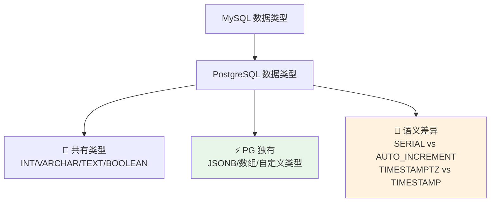

## 前置知识：数据类型是迁移的第一道坎

MySQL 开发者切到 PostgreSQL 时，数据类型是最直观的冲击：`AUTO_INCREMENT` 没了、`DATETIME` 变了、JSON 强大了、甚至**数组**也能直接存。理解类型映射和差异，决定了你的表结构迁移是否干净、高效。



> [!important] 迁移核心原则
> • **类型映射**先于语法学习：先搞清 MySQL 的每个类型在 PG 中的对应物
> • **JSONB 是 PG 的杀手锏**：如果你只用 JSON，等于浪费了 PG 一半的能力
> • **数组类型**是 MySQL 没有的原生存储，能替代很多中间关联表
> • **PG 的隐式类型转换比 MySQL 严格**：`WHERE int_col = '123'` 不报错（'123' 按 unknown 字面量推导为 int），真正报错的是反向 `WHERE text_col = 123`（`operator does not exist: text = integer`）

---

## 一、数值类型对比

### 1.1 整数类型映射

| MySQL | PostgreSQL | 说明 |
|-------|-----------|------|
| `TINYINT` | `SMALLINT` 或 `BOOLEAN`（仅 0/1） | PG 无 TINYINT，SMALLINT 占 2 字节 |
| `SMALLINT` | `SMALLINT` | 一致，2 字节 |
| `MEDIUMINT` | `INT` | PG 无 MEDIUMINT，用 INT 占 4 字节 |
| `INT` / `INTEGER` | `INT` / `INTEGER` | 一致，4 字节 |
| `BIGINT` | `BIGINT` | 一致，8 字节 |
| `INT(11)` 显示宽度 | **无显示宽度概念** | PG 对 `INT(11)` 直接报语法错误 |
| `INT UNSIGNED` | **无原生支持** | 用 `CHECK (col >= 0)` 替代 |

> [!warning] `INT(11)` 的误区
> MySQL 的 `INT(11)` 中的 11 是**显示宽度**，不影响存储范围。PostgreSQL 完全没有这个概念，写 `INT(11)` 会直接报语法错误（`ERROR: syntax error at or near "("`），不会被当作 `INT` 处理。
> **迁移建议**：去掉所有 `INT(n)` 中的 `(n)`。

### 1.2 精确小数类型

| MySQL | PostgreSQL | 说明 |
|-------|-----------|------|
| `DECIMAL(p,s)` / `NUMERIC(p,s)` | `DECIMAL(p,s)` / `NUMERIC(p,s)` | 完全一致 |
| `FLOAT` | `REAL` | PG 用 REAL 表示单精度（4 字节） |
| `DOUBLE` | `DOUBLE PRECISION` | 命名不同，语义一致（8 字节） |
| 无 | `MONEY` | PG 独有货币类型（不建议用，推荐 NUMERIC） |

### 1.3 自增与序列

```sql
-- ============================================
-- MySQL 自增列
-- ============================================
CREATE TABLE mysql_users (
    id INT AUTO_INCREMENT PRIMARY KEY,
    name VARCHAR(50)
);

-- ============================================
-- PostgreSQL 自增列（三种方式）
-- ============================================

-- 方式 1：SERIAL（传统写法，PG 10 之前唯一选择）
-- 注释：SERIAL 本质是创建一个序列对象 + 设置默认值
CREATE TABLE pg_users_serial (
    id SERIAL PRIMARY KEY,
    name VARCHAR(50)
);

-- 方式 2：GENERATED ... AS IDENTITY（SQL 标准，PG 10+ 推荐）
-- 注释：更符合 SQL 标准，删除表时自动清理序列
CREATE TABLE pg_users_identity (
    id INTEGER GENERATED BY DEFAULT AS IDENTITY PRIMARY KEY,
    name VARCHAR(50)
);

-- 方式 3：手动序列（需要复杂控制时）
CREATE SEQUENCE user_id_seq START 1000;
CREATE TABLE pg_users_manual (
    id INTEGER DEFAULT nextval('user_id_seq') PRIMARY KEY,
    name VARCHAR(50)
);

-- 查看序列当前值
SELECT currval('pg_users_serial_id_seq');
SELECT lastval();  -- 最近使用的序列值
```

| 自增方式 | MySQL | PostgreSQL | 推荐 |
|---------|-------|-----------|------|
| 基本自增 | `AUTO_INCREMENT` | `SERIAL` | 简单场景 |
| SQL 标准自增 | 无 | `GENERATED AS IDENTITY` | ⭐⭐⭐ 推荐 |
| 手动序列 | 不支持 | `CREATE SEQUENCE` | 需要自定义控制 |

> [!tip] 为什么推荐 GENERATED AS IDENTITY 而非 SERIAL
> `SERIAL` 会在底层创建一个与表绑定的序列对象，删除表时序列不一定清理干净。`GENERATED AS IDENTITY` 是 SQL 标准，语义更清晰，删除表时自动清理序列。

---

## 二、文本类型对比

| MySQL | PostgreSQL | 存储差异 |
|-------|-----------|---------|
| `CHAR(n)` | `CHAR(n)` | 定长，空格填充 |
| `VARCHAR(n)` | `VARCHAR(n)` | 变长，有长度上限 |
| `TEXT` | `TEXT` | 变长，无长度上限 |
| `TINYTEXT` / `MEDIUMTEXT` / `LONGTEXT` | 无对应，统一用 `TEXT` | PG 的 TEXT 无大小限制 |
| 无 | `VARCHAR`（不指定 n） | 无长度上限，等价于 TEXT |
| `BLOB` / `LONGBLOB` | `BYTEA` | PG 用 BYTEA 存二进制 |
| `BINARY` / `VARBINARY` | `BYTEA` | 用 BYTEA 替代 |

> [!tip] VARCHAR 长度：MySQL 与 PG 一致
> MySQL 4.1 起 `VARCHAR(n)` 的 n 就是**字符数**（utf8mb4 下 `VARCHAR(50)` 能存 50 个汉字）；字节限制作用于索引键长与行大小，不是列长度。PG 的 `VARCHAR(n)` 同样按字符数计算——这点两者一致，不存在"迁移坑"。

```sql
-- ============================================
-- 文本类型示例
-- ============================================
CREATE TABLE text_examples (
    -- MySQL 4.1+ 与 PG 一致：VARCHAR(50) 限制 50 个字符（utf8mb4 下也能存 50 个汉字）
    -- 注：字节限制作用于索引键长与行大小，不是列长度
    name VARCHAR(50),

    -- 不指定长度的 VARCHAR（PG 独有，等价于 TEXT）
    description VARCHAR,

    -- TEXT 无长度限制
    content TEXT,

    -- CHAR 定长（不常用）
    code CHAR(10)
);

INSERT INTO text_examples (name, description, content, code)
VALUES ('你好世界', '这是一段描述', '很长的内容...', 'CODE');
```

---

## 三、时间类型对比

这是 MySQL 和 PostgreSQL 差异最大的领域之一：

### 3.1 类型映射

| MySQL | PostgreSQL | 关键差异 |
|-------|-----------|---------|
| `DATE` | `DATE` | 一致 |
| `TIME` | `TIME` | 一致 |
| `DATETIME` | `TIMESTAMP` | 不带时区的时间戳 |
| `TIMESTAMP` | `TIMESTAMPTZ` | **PG 的 TIMESTAMP 默认不带时区，需手动加 TZ** |
| `YEAR` | `INTEGER` 或 `SMALLINT` | PG 无 YEAR 类型 |
| `DATETIME(6)` 微秒 | `TIMESTAMP(6)` | fsp=6 是 0-6 位小数的微秒精度，PG TIMESTAMP(6) 同 |

> [!important] 时区处理是 PG 的核心优势
> PostgreSQL 的 `TIMESTAMPTZ` 会自动处理时区转换。存储时转为 UTC，查询时按会话时区返回。MySQL 的 `TIMESTAMP` 也有类似行为，但实现不同，且范围只到 2038 年。

### 3.2 时区对比示例

```sql
-- ============================================
-- PostgreSQL 时区处理
-- ============================================
CREATE TABLE time_examples (
    -- 不带时区的时间戳（不推荐用于跨时区场景）
    created_at TIMESTAMP,

    -- 带时区的时间戳（推荐！）
    updated_at TIMESTAMPTZ,

    birth_date DATE,
    daily_time TIME
);

-- 插入带时区的值
INSERT INTO time_examples (created_at, updated_at, birth_date, daily_time)
VALUES (
    '2026-07-24 21:30:00',
    '2026-07-24 21:30:00+08',  -- 北京时间
    '1990-01-15',
    '14:30:00'
);

-- 设置会话时区为 UTC（查看存储的 UTC 值）
SET TIME ZONE 'UTC';
SELECT updated_at FROM time_examples;
-- 结果：2026-07-24 13:30:00+00（UTC 时间）

-- 切换为北京时间
SET TIME ZONE 'Asia/Shanghai';
SELECT updated_at FROM time_examples;
-- 结果：2026-07-24 21:30:00+08（北京时间）

-- ============================================
-- MySQL 对比：TIMESTAMP 自动转 UTC 存储
-- 但 MySQL 的 TIMESTAMP 范围只到 2038 年
-- PG 的 TIMESTAMPTZ 范围：4713 BC ~ 294276 AD
-- ============================================
```

> [!warning] 不要用 `TIMESTAMP WITHOUT TIME ZONE` 存创建时间
> MySQL 习惯用 `DATETIME` 存 `created_at`（不带时区）。在 PG 中推荐用 `TIMESTAMPTZ`，避免跨时区数据混乱。
> **迁移建议**：所有 MySQL `TIMESTAMP` 列映射为 PG `TIMESTAMPTZ`，所有 `DATETIME` 列也映射为 `TIMESTAMPTZ`。

### 3.3 常用时间函数对比

| 功能 | MySQL | PostgreSQL |
|------|-------|-----------|
| 当前时间戳 | `NOW()` / `CURRENT_TIMESTAMP` | `NOW()` / `CURRENT_TIMESTAMP` |
| 当前日期 | `CURDATE()` | `CURRENT_DATE` |
| 当前时间 | `CURTIME()` | `CURRENT_TIME` |
| 日期加法 | `DATE_ADD(d, INTERVAL 1 DAY)` | `d + INTERVAL '1 day'` |
| 日期减法 | `DATE_SUB(d, INTERVAL 1 DAY)` | `d - INTERVAL '1 day'` |
| 日期差 | `DATEDIFF(d1, d2)` | `d1 - d2`（date 相减返回整数天数） |
| 格式化 | `DATE_FORMAT(d, '%Y-%m-%d')` | `TO_CHAR(d, 'YYYY-MM-DD')` |
| 解析 | `STR_TO_DATE(s, '%Y-%m-%d')` | `TO_DATE(s, 'YYYY-MM-DD')` |
| 提取年 | `YEAR(d)` | `EXTRACT(YEAR FROM d)` 或 `DATE_PART('year', d)` |
| 时间戳转日期 | `DATE(FROM_UNIXTIME(ts))` | `TO_TIMESTAMP(ts)::DATE` |

```sql
-- 日期加法
-- MySQL: SELECT DATE_ADD('2026-01-01', INTERVAL 1 MONTH);
-- PG:
SELECT DATE '2026-01-01' + INTERVAL '1 month';  -- 2026-02-01

-- 日期差
-- MySQL: SELECT DATEDIFF('2026-01-02', '2026-01-01');  -- 1（天）
-- PG:
SELECT DATE '2026-01-02' - DATE '2026-01-01';  -- 1（integer 天数；date 相减返回整数，timestamp 相减才是 INTERVAL）

-- 格式化
-- MySQL: SELECT DATE_FORMAT(NOW(), '%Y-%m-%d %H:%i');
-- PG:
SELECT TO_CHAR(NOW(), 'YYYY-MM-DD HH24:MI');   -- 2026-07-24 21:30

-- Unix 时间戳
-- MySQL: SELECT UNIX_TIMESTAMP();  SELECT FROM_UNIXTIME(1719500400);
-- PG:
SELECT EXTRACT(EPOCH FROM NOW())::bigint;       -- Unix 时间戳
SELECT TO_TIMESTAMP(1719500400);               -- 时间戳转日期
```

---

## 四、布尔类型对比

```sql
-- ============================================
-- MySQL 的布尔（本质是 TINYINT(1)）
-- ============================================
-- MySQL: CREATE TABLE t (is_active TINYINT(1));
-- 存储值：0 (false) / 1 (true)
-- 查询：WHERE is_active = 1

-- ============================================
-- PostgreSQL 的布尔（真正的 BOOLEAN 类型）
-- ============================================
CREATE TABLE bool_examples (
    is_active BOOLEAN DEFAULT TRUE,
    is_deleted BOOLEAN DEFAULT FALSE
);

INSERT INTO bool_examples (is_active, is_deleted) VALUES (TRUE, FALSE);

-- PG 支持多种布尔字面量
SELECT * FROM bool_examples WHERE is_active = TRUE;     -- 标准
SELECT * FROM bool_examples WHERE is_active;            -- 简写（推荐）
SELECT * FROM bool_examples WHERE is_active = 't';      -- 字符串简写
```

| 维度 | MySQL | PostgreSQL |
|------|-------|-----------|
| 类型名 | `TINYINT(1)` | `BOOLEAN` |
| 存储 | 1 字节整数 | 1 字节布尔 |
| 值 | 0/1 | TRUE/FALSE/'t'/'f' |
| 查询 | `WHERE col = 1` | `WHERE col` 或 `WHERE col = TRUE` |

---

## 五、JSON 类型对比（PG 核心优势）

### 5.1 基本对比

| 维度 | MySQL | PostgreSQL |
|------|-------|-----------|
| JSON 类型 | `JSON` | `JSON` + **`JSONB`** |
| 存储格式 | 文本（原始字符串） | JSON: 文本 / JSONB: 二进制解析 |
| 索引支持 | 有限（函数索引） | JSONB 原生支持 GIN 索引 |
| 查询性能 | 一般 | JSONB 快 3-10 倍 |
| 保留空格 | 保留 | JSONB 不保留（解析后重建） |
| 键顺序 | 保留 | JSONB 不保留（按内部排序） |

> [!important] JSONB vs JSON
> • **JSON**：存储原始文本，保留格式和键顺序，每次查询需解析
> • **JSONB**：二进制解析存储，查询快、可索引，但不保留原始格式
> • **生产建议**：**99% 场景用 JSONB**，只在需要保留原始格式时用 JSON

### 5.2 JSONB 操作示例

```sql
-- ============================================
-- PostgreSQL JSONB 操作（MySQL 无法直接对标）
-- ============================================
CREATE TABLE products (
    id SERIAL PRIMARY KEY,
    name VARCHAR(100),
    -- JSONB 存储：二进制格式，可高效索引
    attributes JSONB NOT NULL DEFAULT '{}'
);

-- 插入数据
INSERT INTO products (name, attributes) VALUES
('iPhone', '{"brand": "Apple", "price": 7999, "tags": ["phone", "premium"], "specs": {"ram": "6GB", "storage": "128GB"}}'),
('Galaxy', '{"brand": "Samsung", "price": 5999, "tags": ["phone", "android"], "specs": {"ram": "8GB", "storage": "256GB"}}'),
('iPad',   '{"brand": "Apple", "price": 3999, "tags": ["tablet", "premium"], "specs": {"ram": "4GB", "storage": "64GB"}}');

-- ============================================
-- 查询操作对比
-- ============================================

-- MySQL: SELECT * FROM products WHERE attributes->>'$.brand' = 'Apple';
-- PG: 使用 ->> 获取文本值
SELECT name, attributes->>'brand' AS brand, attributes->'price' AS price
FROM products
WHERE attributes->>'brand' = 'Apple';

-- 使用 -> 获取 JSON 对象（保留 JSONB 类型）
SELECT name, attributes->'tags' AS tags_json
FROM products
WHERE attributes @> '{"brand": "Apple"}';  -- 包含操作符（MySQL 无）

-- 查询 tags 数组中包含 "premium" 的记录
SELECT name
FROM products
WHERE attributes->'tags' ? 'premium';

-- 提取嵌套路径
SELECT name, attributes #>> '{specs,ram}' AS ram
FROM products;

-- 更新 JSONB 字段（PG 独有的 || 合并操作符）
UPDATE products
SET attributes = attributes || '{"in_stock": true}'::jsonb
WHERE id = 1;

-- 删除 JSONB 键
UPDATE products
SET attributes = attributes - 'tags'
WHERE id = 2;

-- 精确设置某个路径的值
UPDATE products
SET attributes = jsonb_set(attributes, '{specs,ram}', '"8GB"')
WHERE name = 'iPad';
```

### 5.3 JSONB 索引（PG 杀手锏）

```sql
-- ============================================
-- JSONB GIN 索引（MySQL 无对标能力）
-- ============================================
-- 创建 GIN 索引（支持 @> ? ?| ?& 等操作符）
CREATE INDEX idx_products_attrs ON products USING GIN (attributes);

-- 以下查询会使用 GIN 索引
SELECT * FROM products WHERE attributes @> '{"brand": "Apple"}';
SELECT * FROM products WHERE attributes ? 'brand';
SELECT * FROM products WHERE attributes->'tags' ? 'premium';

-- 对比 MySQL：
-- MySQL 只能对 JSON 路径创建函数索引
-- CREATE INDEX idx_brand ON products ((attributes->>'$.brand'));
-- 只能优化特定路径查询，不能优化 @> 等包含查询
```

> [!tip] JSONB 迁移建议
> • MySQL `JSON` → PostgreSQL `JSONB`
> • MySQL `->>'$.key'` → PostgreSQL `->>'key'`
> • MySQL `JSON_CONTAINS()` → PostgreSQL `@>`（包含操作符）
> • MySQL `JSON_EXTRACT()` → PostgreSQL `->` 或 `#>>`

---

## 六、数组类型（PG 独有）

MySQL 没有原生的数组类型，通常用关联表或逗号字符串代替。PG 原生支持数组，大大简化某些场景。

```sql
-- ============================================
-- PostgreSQL 数组类型（MySQL 无对应物）
-- ============================================
CREATE TABLE courses (
    id SERIAL PRIMARY KEY,
    name VARCHAR(100),
    -- 一维数组
    tags TEXT[],
    -- 整数数组
    student_ids INTEGER[]
);

-- 插入数据
INSERT INTO courses (name, tags, student_ids) VALUES
('PostgreSQL 入门',
    ARRAY['database', 'sql', 'postgres'],   -- ARRAY 构造器
    ARRAY[1, 2, 3, 4, 5]
),
('Python 高级',
    '{python, advanced}',                     -- 数组字面量
    '{10, 20, 30}'
);

-- 查询数组
-- 注释：PostgreSQL 的数组下标从 1 开始（不是 0！）
SELECT name, tags, tags[1] AS first_tag FROM courses;

-- 数组包含查询
SELECT name FROM courses WHERE 'postgres' = ANY(tags);       -- 任一元素匹配
SELECT name FROM courses WHERE tags @> ARRAY['sql'];          -- 包含所有指定元素

-- 数组展开为多行
SELECT name, unnest(tags) AS tag FROM courses;

-- 数组操作
SELECT array_length(tags, 1) FROM courses;        -- 数组长度
SELECT array_append(tags, 'new') FROM courses;     -- 追加元素
SELECT array_remove(tags, 'sql') FROM courses;     -- 移除元素

-- 数组聚合
SELECT array_agg(name) FROM courses;              -- 多行合并为数组

-- 数组 GIN 索引
CREATE INDEX idx_tags_gin ON courses USING GIN (tags);
```

| 操作 | MySQL（需关联表代替） | PostgreSQL |
|------|---------------------|-----------|
| 存储标签 | 中间表 `course_tags` | `tags TEXT[]` |
| 查询包含 | JOIN + WHERE | `tags @> ARRAY['sql']` |
| 数组展开 | 需多次查询 | `unnest(tags)` |
| 数组长度 | COUNT 关联表 | `array_length(tags, 1)` |

> [!tip] 什么时候用数组，什么时候用关联表
> • **用数组**：标签、权限列表、简单关联，不需要单独维护的
> • **用关联表**：需要存储额外属性、需要独立索引、需要多对多关系
> • 数组适合"值类型"，关联表适合"实体类型"

---

## 七、枚举与自定义类型

```sql
-- ============================================
-- MySQL 枚举（内联定义）
-- ============================================
-- CREATE TABLE users (role ENUM('admin', 'user', 'guest'));

-- ============================================
-- PostgreSQL 枚举（需先创建类型）
-- ============================================
-- 步骤 1：先创建枚举类型
CREATE TYPE user_role AS ENUM ('admin', 'user', 'guest');

-- 步骤 2：在建表时引用
CREATE TABLE users (
    id SERIAL PRIMARY KEY,
    name VARCHAR(50),
    role user_role DEFAULT 'user'
);

INSERT INTO users (name, role) VALUES ('Alice', 'admin');

-- 新增枚举值（只能追加，不能修改已有值）
ALTER TYPE user_role ADD VALUE 'moderator' BEFORE 'user';

-- ============================================
-- 自定义复合类型（PG 独有，MySQL 无）
-- ============================================
CREATE TYPE address_type AS (
    street VARCHAR(200),
    city VARCHAR(50),
    zip VARCHAR(20)
);

CREATE TABLE companies (
    id SERIAL PRIMARY KEY,
    name VARCHAR(100),
    address address_type  -- 使用复合类型作为列
);

INSERT INTO companies (name, address) VALUES
('Acme', ROW('123 Main St', 'Springfield', '62701'));

-- 查询复合类型
SELECT name, (address).city FROM companies;
SELECT name FROM companies WHERE (address).city = 'Springfield';
```

---

## 八、DDL 差异：建表与约束

### 8.1 建表对比

```sql
-- ============================================
-- MySQL 建表
-- ============================================
CREATE TABLE mysql_orders (
    id INT AUTO_INCREMENT PRIMARY KEY,
    user_id INT NOT NULL,
    amount DECIMAL(10, 2) NOT NULL DEFAULT 0.00,
    status ENUM('pending', 'paid', 'shipped') DEFAULT 'pending',
    created_at TIMESTAMP DEFAULT CURRENT_TIMESTAMP,
    UNIQUE KEY uk_user_amount (user_id, amount)
) ENGINE=InnoDB DEFAULT CHARSET=utf8mb4;

-- ============================================
-- PostgreSQL 建表
-- ============================================
-- 注释：先创建枚举类型
CREATE TYPE order_status AS ENUM ('pending', 'paid', 'shipped');

CREATE TABLE pg_orders (
    id SERIAL PRIMARY KEY,
    user_id INT NOT NULL,
    amount NUMERIC(10, 2) NOT NULL DEFAULT 0.00,
    status order_status DEFAULT 'pending',
    created_at TIMESTAMPTZ DEFAULT NOW(),

    -- 约束写法一致，但 PG 不需 KEY 关键字
    CONSTRAINT uk_user_amount UNIQUE (user_id, amount)
);
-- 注释：PG 无 ENGINE 子句，无 CHARSET 子句
```

### 8.2 约束对比

| 约束类型 | MySQL | PostgreSQL | 差异 |
|---------|-------|-----------|------|
| 主键 | `PRIMARY KEY` | `PRIMARY KEY` | 一致 |
| 唯一 | `UNIQUE KEY` / `UNIQUE` | `UNIQUE` | PG 不用 KEY 关键字 |
| 外键 | `FOREIGN KEY` | `FOREIGN KEY` | 一致 |
| 检查约束 | `CHECK`（8.0+ 强制） | `CHECK`（原生强制） | PG 一直强制 CHECK |
| 非空 | `NOT NULL` | `NOT NULL` | 一致 |
| 排除约束 | 无 | `EXCLUDE` | PG 独有，用于范围不重叠 |

```sql
-- ============================================
-- CHECK 约束（PG 一直强制执行，MySQL 8.0+ 才强制）
-- ============================================
CREATE TABLE employees (
    id SERIAL PRIMARY KEY,
    name VARCHAR(50) NOT NULL,
    age INT CHECK (age >= 18 AND age <= 65),
    salary NUMERIC(10, 2) CHECK (salary > 0),
    email VARCHAR(100),

    -- PG 支持正则表达式约束
    CONSTRAINT valid_email CHECK (email ~ '@')
);

-- ============================================
-- EXCLUDE 约束（PG 独有）
-- 用于确保范围不重叠，常用于时间范围排他
-- ============================================
CREATE EXTENSION IF NOT EXISTS btree_gist;

CREATE TABLE bookings (
    id SERIAL PRIMARY KEY,
    room_id INT,
    time_range TSTZRANGE,  -- 时间范围类型（PG 独有）

    -- 排除约束：同一房间的预订时间范围不能重叠
    EXCLUDE USING GIST (room_id WITH =, time_range WITH &&)
);

INSERT INTO bookings (room_id, time_range) VALUES
    (1, tstzrange('2026-07-24 09:00+08', '2026-07-24 10:00+08'));
-- 成功

-- INSERT INTO bookings (room_id, time_range) VALUES
--     (1, tstzrange('2026-07-24 09:30+08', '2026-07-24 10:30+08'));
-- 失败！时间范围重叠
```

### 8.3 表结构修改

```sql
-- 添加列
-- MySQL: ALTER TABLE t ADD COLUMN col INT DEFAULT 0;
-- PG: ALTER TABLE t ADD COLUMN col INT DEFAULT 0;  -- 瞬间完成（不重写表）

-- 修改列类型
-- MySQL: ALTER TABLE t MODIFY COLUMN col BIGINT;
-- PG: ALTER TABLE t ALTER COLUMN col TYPE BIGINT USING col::bigint;

-- 重命名列
-- MySQL: ALTER TABLE t RENAME COLUMN old TO new;
-- PG: ALTER TABLE t RENAME COLUMN old TO new;

-- 修改默认值
-- MySQL: ALTER TABLE t ALTER COLUMN col SET DEFAULT 1;
-- PG: ALTER TABLE t ALTER COLUMN col SET DEFAULT 1;  -- 语法一致

-- 添加索引
-- MySQL 8.0 InnoDB: CREATE INDEX / ADD INDEX 是 Online DDL（INPLACE，允许并发 DML，仅首尾短暂元数据锁）
-- PG:   CREATE INDEX idx ON t (col);   -- 会锁表
-- PG:   CREATE INDEX CONCURRENTLY idx ON t (col);  -- 不锁写入（PG 独有优势；失败后需清理残留的 invalid 索引）

-- PG 独有：部分索引
CREATE INDEX idx_orders_unpaid ON pg_orders (created_at)
    WHERE status = 'pending';  -- 只给未付款订单建索引

-- PG 独有：表达式索引
CREATE INDEX idx_users_lower_email ON users (LOWER(email));
```

### 8.4 UUID 默认值

```sql
-- MySQL: DEFAULT UUID()
-- PostgreSQL 13+: DEFAULT gen_random_uuid()
CREATE TABLE pg_sessions (
    id UUID DEFAULT gen_random_uuid() PRIMARY KEY,
    user_id INTEGER NOT NULL,
    token VARCHAR(100),
    created_at TIMESTAMPTZ DEFAULT NOW()
);
```

---

## 九、实践练习（附注释）

### 练习 1：数据类型迁移 🟢 基础

```sql
-- 目标：将一个 MySQL 表结构迁移到 PostgreSQL
-- 原始 MySQL 表：
-- CREATE TABLE mysql_users (
--     id INT UNSIGNED AUTO_INCREMENT PRIMARY KEY,
--     username VARCHAR(50) NOT NULL,
--     email VARCHAR(100) NOT NULL,
--     is_active TINYINT(1) DEFAULT 1,
--     created_at DATETIME DEFAULT CURRENT_TIMESTAMP,
--     updated_at DATETIME DEFAULT CURRENT_TIMESTAMP ON UPDATE CURRENT_TIMESTAMP,
--     profile JSON
-- );

-- PostgreSQL 迁移版本：
CREATE TABLE pg_users (
    -- AUTO_INCREMENT UNSIGNED → GENERATED AS IDENTITY + CHECK
    id INTEGER GENERATED BY DEFAULT AS IDENTITY PRIMARY KEY,

    username VARCHAR(50) NOT NULL,

    email VARCHAR(100) NOT NULL,

    -- TINYINT(1) → BOOLEAN
    is_active BOOLEAN DEFAULT TRUE,

    -- DATETIME → TIMESTAMPTZ
    created_at TIMESTAMPTZ DEFAULT NOW(),

    -- MySQL 的 ON UPDATE CURRENT_TIMESTAMP 在 PG 中需要触发器实现
    -- 注释：06 篇笔记会详细讲解触发器
    updated_at TIMESTAMPTZ DEFAULT NOW(),

    -- JSON → JSONB
    profile JSONB DEFAULT '{}'
);

-- 插入测试数据
INSERT INTO pg_users (username, email) VALUES ('alice', 'alice@test.com');
SELECT * FROM pg_users;
```

**验收标准**：成功创建表，理解每个类型映射的原因。

### 练习 2：JSONB 存储与查询 🟡 进阶

```sql
-- 目标：体验 JSONB 的查询和索引能力
CREATE TABLE products_jsonb (
    id SERIAL PRIMARY KEY,
    name VARCHAR(100),
    attributes JSONB NOT NULL DEFAULT '{}'
);

INSERT INTO products_jsonb (name, attributes) VALUES
('iPhone 15',  '{"brand":"Apple","price":7999,"colors":["black","white"],"specs":{"ram":"6GB","storage":"128GB"}}'),
('Galaxy S24', '{"brand":"Samsung","price":5999,"colors":["blue","gray"],"specs":{"ram":"8GB","storage":"256GB"}}'),
('Pixel 8',    '{"brand":"Google","price":4999,"colors":["white"],"specs":{"ram":"12GB","storage":"128GB"}}');

-- 1. 基本查询：获取 JSONB 字段值
SELECT name, attributes->>'brand' AS brand, attributes->'price' AS price
FROM products_jsonb;

-- 2. 条件查询：品牌为 Apple
SELECT name FROM products_jsonb WHERE attributes->>'brand' = 'Apple';

-- 3. 包含查询：colors 包含 black
SELECT name FROM products_jsonb WHERE attributes->'colors' ? 'black';

-- 4. 嵌套查询：获取 specs.ram（注意类型转换）
SELECT name, attributes#>>'{specs,ram}' AS ram FROM products_jsonb;
-- 数字比较时需先去单位再转换类型（ram 存的是 "6GB"/"8GB"/"12GB" 文本，直接 ::int 会抛 invalid input syntax）
SELECT name FROM products_jsonb
WHERE (regexp_replace(attributes#>>'{specs,ram}', '[^0-9]', '', 'g'))::int > 6;

-- 5. GIN 索引加速
CREATE INDEX idx_attrs_gin ON products_jsonb USING GIN (attributes);

-- 6. 复杂查询：包含嵌套对象（会使用 GIN 索引）
SELECT name FROM products_jsonb WHERE attributes @> '{"specs":{"ram":"8GB"}}';

-- 7. 更新 JSONB（|| 合并操作符）
UPDATE products_jsonb
SET attributes = attributes || '{"in_stock": true}'::jsonb
WHERE name = 'iPhone 15';
```

**可量化验收标准**：
- **完成标准**：① 用 `->` 取 JSONB 对象、`->>` 取文本、`@>` 做包含查询、`?` 检查键存在，各至少 1 次成功 ② 创建 GIN 索引后 `@>` 查询走索引
- **预期输出**：`SELECT name FROM products_jsonb WHERE attributes @> '{"brand":"Apple"}'` 返回 `iPhone 15`；`EXPLAIN` 显示 `Bitmap Index Scan on idx_attrs_gin`
- **自测方法**：`SELECT name, attributes->>'brand' FROM products_jsonb` 返回 3 行；数值比较时 `(regexp_replace(attributes#>>'{specs,ram}', '[^0-9]', '', 'g'))::int > 6` 返回 Galaxy S24 和 Pixel 8
- **常见错误**：`->>'price'` 返回文本，数值比较需 `::numeric` 转换；`||` 合并后键顺序可能变化

### 练习 3：数组类型实战 🟡 进阶

```sql
-- 目标：用数组类型替代关联表，对比性能差异
-- 场景：课程标签管理
-- MySQL 做法：course + tag + course_tag 三张表
-- PG 做法：用 TEXT[] 数组

CREATE TABLE courses_pg (
    id SERIAL PRIMARY KEY,
    name VARCHAR(100) NOT NULL,
    tags TEXT[] DEFAULT '{}',
    student_ids INTEGER[] DEFAULT '{}'
);

INSERT INTO courses_pg (name, tags, student_ids) VALUES
('PG 入门', ARRAY['database','sql','postgres'], ARRAY[1,2,3]),
('Python 进阶', ARRAY['python','advanced'], ARRAY[10,20]),
('Docker 实战', ARRAY['docker','devops','container'], ARRAY[30,40,50]);

-- 1. 查询包含特定标签的课程
SELECT name FROM courses_pg WHERE tags @> ARRAY['database'];

-- 2. 查询任一标签匹配的课程
SELECT name FROM courses_pg WHERE 'python' = ANY(tags);

-- 3. 展开数组为多行（用于统计）
SELECT tag, COUNT(*) FROM (
    SELECT unnest(tags) AS tag FROM courses_pg
) t GROUP BY tag;

-- 4. 数组操作：追加和移除
UPDATE courses_pg SET tags = array_append(tags, 'advanced')
WHERE name = 'PG 入门';

UPDATE courses_pg SET tags = array_remove(tags, 'sql')
WHERE name = 'PG 入门';

-- 5. 创建 GIN 索引加速数组查询
CREATE INDEX idx_tags_gin ON courses_pg USING GIN (tags);
```

**可量化验收标准**：
- **完成标准**：① `@>` 包含查询返回正确行 ② `ANY()` 匹配查询 ③ `unnest()` 展开聚合 ④ `array_append/remove` 修改操作成功
- **预期输出**：`SELECT name FROM courses_pg WHERE tags @> ARRAY['database']` 返回 `PG 入门`；`unnest+GROUP BY` 返回 6+ 个标签计数
- **自测方法**：`SELECT COUNT(*) FROM courses_pg WHERE 'python' = ANY(tags)` 返回 1；GIN 索引后 `EXPLAIN` 显示 `Bitmap Index Scan`
- **常见错误**：数组与标量直接比较 `WHERE tags = 'database'` 应改为 `@> ARRAY['database']`；数组适合 N<100 的场景，超过用关联表

### 练习 4：EXCLUDE 约束 🔴 挑战

```sql
-- 目标：用 EXCLUDE 约束实现时间范围不重叠
-- 场景：会议室预订系统

-- 安装扩展
CREATE EXTENSION IF NOT EXISTS btree_gist;

-- 创建会议预订表
CREATE TABLE meeting_rooms (
    id SERIAL PRIMARY KEY,
    room_name VARCHAR(50) NOT NULL,
    -- TSTZRANGE：带时区的时间范围类型
    booked_range TSTZRANGE NOT NULL,

    -- 排除约束：同一房间同一时间不能被预订两次
    EXCLUDE USING GIST (
        room_name WITH =,
        booked_range WITH &&
    )
);

-- 插入预订（成功）
INSERT INTO meeting_rooms (room_name, booked_range) VALUES
    ('Room A', tstzrange('2026-07-24 09:00+08', '2026-07-24 10:00+08'));

-- 尝试插入重叠预订（失败！）
-- INSERT INTO meeting_rooms (room_name, booked_range) VALUES
--     ('Room A', tstzrange('2026-07-24 09:30+08', '2026-07-24 10:30+08'));
-- 报错：conflicting key value violates exclusion constraint

-- 插入不同房间相同时间段（成功）
INSERT INTO meeting_rooms (room_name, booked_range) VALUES
    ('Room B', tstzrange('2026-07-24 09:30+08', '2026-07-24 10:30+08'));
```

**可量化验收标准**：
- **完成标准**：① 成功创建 `meeting_rooms` 表含 `EXCLUDE USING GIST` 约束 ② 不重叠记录插入成功 ③ 重叠记录被拦截报错 ④ 说明 MySQL 需应用层 `SELECT ... FOR UPDATE` + 范围重叠判断
- **预期输出**：重叠插入报错 `conflicting key value violates exclusion constraint`；不同房间同时段插入成功
- **自测方法**：`SELECT count(*) FROM meeting_rooms WHERE room_name='Room A'` 返回 1（第二条被拦截）
- **常见错误**：未安装 `btree_gist` 扩展就创建 EXCLUDE 约束会报错；时间范围写反（开始>=结束）导致插入失败

### 练习 5：自动更新时间戳 🔴 挑战

```sql
-- 目标：在 PostgreSQL 中实现 MySQL 的 ON UPDATE CURRENT_TIMESTAMP
-- 注释：PG 没有 ON UPDATE 语法，必须用触发器

CREATE TABLE customers (
    id SERIAL PRIMARY KEY,
    name VARCHAR(100),
    created_at TIMESTAMPTZ DEFAULT NOW(),
    updated_at TIMESTAMPTZ DEFAULT NOW()
);

-- 创建触发器函数
CREATE OR REPLACE FUNCTION update_updated_at_column()
RETURNS TRIGGER AS $$
BEGIN
    NEW.updated_at = NOW();
    RETURN NEW;
END;
$$ LANGUAGE plpgsql;

-- 创建触发器
CREATE TRIGGER trigger_customers_updated_at
    BEFORE UPDATE ON customers
    FOR EACH ROW
    EXECUTE FUNCTION update_updated_at_column();

-- 验证
INSERT INTO customers (name) VALUES ('Alice');
SELECT * FROM customers;

-- 等 1 秒后更新
SELECT pg_sleep(1);
UPDATE customers SET name = 'Alice Smith' WHERE id = 1;
SELECT * FROM customers;  -- updated_at 应该自动更新为更晚的时间
```

**可量化验收标准**：
- **完成标准**：① 创建触发器函数 `update_updated_at_column()` ② 创建 `BEFORE UPDATE` 触发器 ③ INSERT 后 `updated_at=created_at`，UPDATE 后 `updated_at > created_at` ④ 说明 MySQL 用 `ON UPDATE CURRENT_TIMESTAMP`，PG 必须写触发器
- **预期输出**：`SELECT updated_at > created_at AS changed FROM customers WHERE id=1` 返回 `t`
- **自测方法**：`SELECT pg_sleep(1); UPDATE customers SET name='Alice Smith' WHERE id=1;` 后 `updated_at` 变为更晚时间
- **常见错误**：触发器函数中忘记 `RETURN NEW` 导致 UPDATE 后整行变 NULL；函数名与触发器名混淆

---

## 十、常见易错点

> [!warning] **易错 1：用 `INT(11)` 定义 PostgreSQL 列**
> PG 对 `INT(11)` 直接报语法错误（`ERROR: syntax error at or near "("`），不会静默忽略。
> **解决方案**：迁移时去掉所有 `INT(n)` 中的 `(n)`。

> [!warning] **易错 2：把 MySQL 的 `UNSIGNED` 带到 PG**
> PostgreSQL 没有 unsigned 类型。
> **解决方案**：根据范围选择 `SMALLINT` / `INTEGER` / `BIGINT`，用 `CHECK (col >= 0)` 替代。

> [!warning] **易错 3：把 `DATETIME` 直接映射为 `TIMESTAMP`**
> PG 的 `TIMESTAMP` 不带时区。如果需要时区处理，应该用 `TIMESTAMPTZ`。
> **解决方案**：所有时间戳列统一用 `TIMESTAMPTZ`。

> [!warning] **易错 4：用 JSON 而非 JSONB**
> `JSON` 类型是文本存储，每次查询都要重新解析；`JSONB` 是二进制存储，可建 GIN 索引，性能差异可达 10 倍以上。
> **解决方案**：始终使用 `JSONB`，除非需要保留原始 JSON 格式。

> [!warning] **易错 5：JSONB 提取后忘记类型转换**
> `tags->'specs'->>'ram'` 返回 `text`，直接与数字比较会报类型错误。
> **解决方案**：`(tags->'specs'->>'ram')::int` 显式转换。

> [!warning] **易错 6：忘记数组索引从 1 开始**
> PostgreSQL 数组下标从 1 开始，不是 0。
> **解决方案**：访问 `tags[1]` 而不是 `tags[0]`。

> [!warning] **易错 7：给 SERIAL 列手动插入值导致序列冲突**
> 手动插入 id 后，序列不会自动更新，下次用默认值可能报主键冲突。
> **解决方案**：手动设置 `SELECT setval('表_id_seq', (SELECT max(id) FROM 表));` 或改用 `GENERATED BY DEFAULT AS IDENTITY`。

---

## 🎯 本文学完自检

| 层次 | 检查项 |
|------|--------|
| 🟢 基础 | 能建立 MySQL 到 PG 的类型映射表，正确迁移 AUTO_INCREMENT/ENUM/JSON/DATETIME |
| 🟡 进阶 | 能熟练使用 JSONB、数组、枚举类型，并用 GIN 索引加速查询 |
| 🔴 挑战 | 能处理类型迁移中的边界情况（ON UPDATE TIMESTAMP、UNSIGNED、EXCLUDE 约束等） |

---

## ⚡ 30 秒速记卡片

| # | 正面（问题） | 背面（答案） |
|---|-------------|-------------|
| F1 | AUTO_INCREMENT → ？ | SERIAL 或 GENERATED AS IDENTITY |
| F2 | TINYINT(1) → ？ | BOOLEAN（PG 有原生 bool 类型） |
| F3 | DATETIME → ？ | TIMESTAMPTZ（带时区，推荐始终用） |
| F4 | JSON → ？ | JSONB（二进制存储，支持 GIN 索引） |
| F5 | UNSIGNED → ？ | INTEGER + CHECK (col >= 0) |
| F6 | ENUM('a','b') → ？ | CREATE TYPE xxx AS ENUM ('a','b') |
| F7 | 逗号分隔标签 → ？ | TEXT[] 数组 + GIN 索引 |
| F8 | ON UPDATE CURRENT_TIMESTAMP → ？ | BEFORE UPDATE 触发器函数 |
| F9 | INT(11) 显示宽度？ | PG 无显示宽度概念，直接写 INTEGER |
| F10 | SET 类型 → ？ | TEXT[] 数组或 JSONB |

---

## ⚠️ 常见陷阱速查

> [!warning] 迁移时最容易踩的坑
> 1. **JSON 用了 JSON 而非 JSONB** → 无法建 GIN 索引，查询慢 3-10 倍。99% 场景用 JSONB
> 2. **EXCLUDE 约束未安装 btree_gist** → 报错 operator class does not exist。先 `CREATE EXTENSION btree_gist`
> 3. **触发器函数忘记 RETURN NEW** → BEFORE UPDATE 后整行变 NULL。每个分支都要 RETURN
> 4. **SERIAL 序列值冲突** → 迁移数据后需 `SELECT setval('users_id_seq', max(id)) FROM users` 重置
> 5. **分区表主键不含分区键** → 报错 `must include all partitioning columns`。用复合主键

---

## 相关笔记

- ⬅️ 前置：[[01-安装与基础概念对比]]
- ➡️ 后续：[[03-SQL查询语法差异与进阶]]
- 🔗 关联：[[04-索引与查询优化]]（GIN 索引深入讲解）
- 🔗 关联：[[07-双向对比-MySQL有PG无与PG有MySQL无]]

---
*最后更新：2026-07-24*