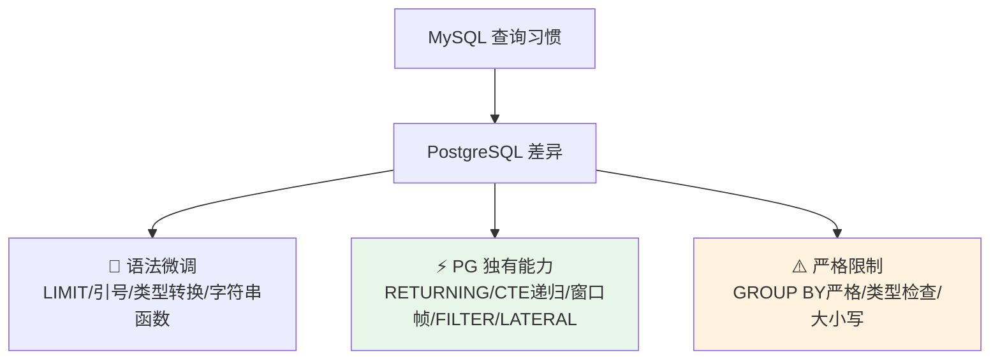
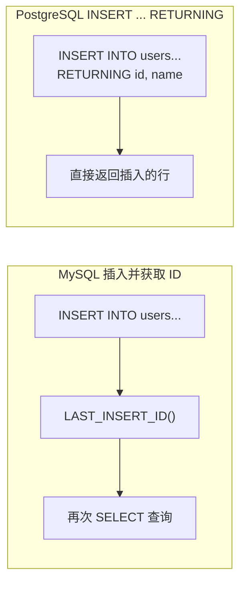

## 前置知识：SQL 方言差异是迁移的核心痛点

PostgreSQL 和 MySQL 都遵循 SQL 标准，但 PostgreSQL 更严格地遵循标准，MySQL 更宽松。这种"宽松 vs 严格"的差异，加上 PG 独有的进阶查询能力，是迁移中最大的痛点，也是最大的收益点。



> [!important] 三大核心差异
> • **RETURNING 子句**：PG 独有，INSERT/UPDATE/DELETE 后直接返回数据，替代 MySQL 的 `LAST_INSERT_ID()`
> • **CTE**：MySQL 8.0 同样支持 `WITH RECURSIVE`（含非递归 CTE）；PG 的差异点是 `MATERIALIZED`/`NOT MATERIALIZED` 提示与 CTE 中可写 DML
> • **严格 GROUP BY**：PG 要求 SELECT 中的非聚合列必须出现在 GROUP BY 中，MySQL 宽松允许

---

## 一、基础语法差异速查

### 1.1 标识符引号与大小写

| 功能 | MySQL | PostgreSQL | 说明 |
|------|-------|-----------|------|
| 列/表名 | 反引号 `` `col` `` | 双引号 `"col"` | PG 用双引号 |
| 字符串 | 单引号 `'str'` | 单引号 `'str'` | 一致 |
| 大小写 | 不敏感（取决于 OS） | **默认转小写**；双引号保留 | 差异大 |

> [!warning] 大小写处理差异
> PostgreSQL 中未加引号的标识符会**自动转为小写**。如果你创建表时写 `CREATE TABLE MyTable`，实际创建的表名是 `mytable`。如果用双引号 `CREATE TABLE "MyTable"`，则保留大小写，但后续所有引用都必须加双引号。
>
> **建议**：不要使用双引号，让 PG 统一转小写，与 MySQL 习惯一致。

```sql
-- ============================================
-- 标识符引号对比
-- ============================================
-- MySQL: CREATE TABLE `Order` (id INT);  -- 反引号
-- PG: CREATE TABLE "Order" (id INT);    -- 双引号

-- 不加引号时，PG 默认转小写
CREATE TABLE MyTable (id INT);
SELECT * FROM MyTable;     -- 成功（自动找 mytable）
SELECT * FROM mytable;     -- 成功

-- 加双引号时，保留大小写，后续必须加引号
-- CREATE TABLE "MyTable" (id INT);
-- SELECT * FROM MyTable;     -- 失败！找不到 MyTable
-- SELECT * FROM "MyTable";   -- 成功
```

### 1.2 分页语法

```sql
-- ============================================
-- 分页语法对比
-- ============================================
-- MySQL 语法 1：LIMIT offset, count（逗号语法，PG 不支持！）
-- SELECT * FROM users LIMIT 0, 10;  -- ❌ PG 报错

-- MySQL 语法 2：LIMIT count OFFSET offset（PG 也支持）
SELECT * FROM users LIMIT 10 OFFSET 0;  -- ✅ 两者通用

-- PG 建议使用 FETCH FIRST（SQL 标准）
SELECT * FROM users ORDER BY id FETCH FIRST 10 ROWS ONLY;

-- 只取一条
SELECT * FROM users LIMIT 1;              -- 两者通用
SELECT * FROM users ORDER BY id FETCH FIRST 1 ROW ONLY;  -- SQL 标准
```

| 写法 | MySQL | PostgreSQL |
|------|-------|-----------|
| `LIMIT 10, 20` | ✅ 支持 | ❌ 不支持 |
| `LIMIT 20 OFFSET 10` | ✅ 支持 | ✅ 支持 |
| `FETCH FIRST 10 ROWS ONLY` | ❌ 不支持 | ✅ 支持 |

> [!warning] MySQL 的逗号分页语法
> `LIMIT 0, 10` 是 MySQL 特有语法，PostgreSQL **不支持**逗号语法。迁移时必须改为 `LIMIT 10 OFFSET 0`。

### 1.3 隐式类型转换差异

| 场景 | MySQL | PostgreSQL |
|------|-------|-----------|
| 数字与字符串比较 | 隐式转换（`'123'` → `123`） | int 列 = `'123'` 不报错（unknown 字面量）；text 列 = `123` 报错 |
| 布尔与整数 | `WHERE is_active = 1` | `WHERE is_active = TRUE` |
| 字符串拼接数字 | 隐式转换 | 报错 |
| 日期与字符串 | 隐式转换 | 需显式转换 |

```sql
-- MySQL: SELECT * FROM users WHERE id = '123';  -- 自动将 '123' 转为 123
-- PostgreSQL: int 列与字符串字面量比较不报错（'123' 按 unknown 字面量推导为 int）
SELECT * FROM users WHERE id = 123;              -- ✅
SELECT * FROM users WHERE id = '123';            -- ✅ 同样可行，不报错

-- 真正报错的是反向：text 列与数字比较（order_no 为 text 列）
-- SELECT * FROM orders WHERE order_no = 123;    -- ❌ operator does not exist: text = integer

-- 解决方案：显式转换
SELECT * FROM orders WHERE order_no = 123::text;      -- ✅ :: 转换操作符
SELECT * FROM orders WHERE order_no = CAST(123 AS text);  -- ✅ CAST 语法

-- 布尔类型
-- MySQL: WHERE is_active = 1   （TINYINT(1)）
-- PG: WHERE is_active = TRUE   （真正的 BOOLEAN）
SELECT * FROM users WHERE is_active;            -- ✅ 简写（推荐）

-- 常用类型转换
SELECT '123'::int, '3.14'::numeric, '2026-01-01'::date;
SELECT int_col::text, text_col::int, timestamp_col::date;

-- 安全转换（处理可能失败的转换）
-- PG 16+ 可用，低版本需自定义函数
CREATE OR REPLACE FUNCTION safe_cast_int(text) RETURNS int AS $$
    SELECT CASE WHEN $1 ~ '^[0-9]+$' THEN $1::int ELSE NULL END
$$ LANGUAGE SQL IMMUTABLE;

SELECT val, safe_cast_int(val) FROM (VALUES ('123'), ('abc'), ('456')) AS t(val);
```

### 1.4 NULL 排序与字符串比较

```sql
-- ============================================
-- NULL 排序（PG 独有显式控制）
-- ============================================
-- MySQL: NULL 视为最小，升序在最前（不可配置）
-- PG: NULL 视为最大值——ASC 默认 NULLS LAST，DESC 默认 NULLS FIRST；支持显式 NULLS FIRST / NULLS LAST
SELECT * FROM orders ORDER BY completed_at NULLS FIRST;      -- ASC 下显式把 NULL 提前（默认是 NULLS LAST）
SELECT * FROM orders ORDER BY completed_at DESC NULLS LAST;  -- DESC 下默认 NULLS FIRST，NULL 在后必须显式写 NULLS LAST

-- ============================================
-- LIKE 大小写差异
-- ============================================
-- MySQL（utf8mb4_general_ci 默认不区分大小写）
-- SELECT * FROM users WHERE name LIKE '%alice%'; -- 能匹配 Alice

-- PostgreSQL（默认区分大小写）
SELECT * FROM users WHERE name LIKE '%alice%';   -- ❌ 不能匹配 Alice
SELECT * FROM users WHERE name ILIKE '%alice%';  -- ✅ 不区分大小写，匹配 Alice

-- 函数索引加速大小写不敏感查询
CREATE INDEX idx_users_name_lower ON users (LOWER(name));
SELECT * FROM users WHERE LOWER(name) LIKE '%alice%';
```

### 1.5 常用函数差异对照表

| 功能 | MySQL | PostgreSQL |
|------|-------|-----------|
| 字符串拼接 | `CONCAT(a, b)` | `a || b` 或 `CONCAT(a, b)` |
| 字符串分割 | `SUBSTRING_INDEX(s, ',', 2)` | `SPLIT_PART(s, ',', 2)` |
| 条件表达式 | `IF(cond, a, b)` | `CASE WHEN cond THEN a ELSE b END`（PG 无 IF） |
| NULL 合并 | `IFNULL(a, b)` | `COALESCE(a, b)` |
| 随机数 | `RAND()` | `RANDOM()` |
| 日期加法 | `DATE_ADD(d, INTERVAL 1 DAY)` | `d + INTERVAL '1 day'` |
| 日期格式化 | `DATE_FORMAT(d, '%Y-%m-%d')` | `TO_CHAR(d, 'YYYY-MM-DD')` |
| 日期解析 | `STR_TO_DATE(s, '%Y-%m-%d')` | `TO_DATE(s, 'YYYY-MM-DD')` |
| Unix 时间戳 | `UNIX_TIMESTAMP()` | `EXTRACT(EPOCH FROM NOW())` |
| 正则匹配 | `s REGEXP 'pattern'` | `s ~ 'pattern'`（区分大小写）/ `~*`（不区分） |
| 字符串聚合 | `GROUP_CONCAT(col SEPARATOR ',')` | `STRING_AGG(col, ',')` |
| 数组聚合 | `JSON_ARRAYAGG(col)` | `ARRAY_AGG(col)` |
| 中位数 | 无原生支持 | `PERCENTILE_CONT(0.5) WITHIN GROUP` |
| 生成序列 | 无原生 | `GENERATE_SERIES(1, 10)` |
| 类型转换 | `CAST(expr AS type)` | `expr::type` 或 `CAST(expr AS type)` |

```sql
-- 字符串拼接（PG 的 || 遇到 NULL 返回 NULL）
SELECT COALESCE(first_name, '') || ' ' || COALESCE(last_name, '') AS full_name;

-- 条件表达式（PG 无 IF 函数）
SELECT CASE WHEN age > 18 THEN 'adult' ELSE 'minor' END FROM users;

-- 生成序列（PG 独有）
SELECT GENERATE_SERIES(1, 5);          -- 1,2,3,4,5
SELECT GENERATE_SERIES('2026-01-01'::date, '2026-01-05'::date, '1 day');

-- 中位数（PG 独有）
SELECT PERCENTILE_CONT(0.5) WITHIN GROUP (ORDER BY price) FROM orders;
```

---

## 二、RETURNING 子句（PG 独有）

### 2.1 替代 LAST_INSERT_ID()



| 操作 | MySQL | PostgreSQL |
|------|-------|-----------|
| 插入后获取自增 ID | `LAST_INSERT_ID()` | `INSERT ... RETURNING id` |
| 更新后获取新值 | 需再次 SELECT | `UPDATE ... RETURNING *` |
| 删除前留档 | 需先 SELECT 保存 | `DELETE ... RETURNING *` |
| 批量插入获取 ID 列表 | 无法直接获取 | `INSERT ... RETURNING id` 返回多行 |

```sql
CREATE TABLE users_returning (
    id SERIAL PRIMARY KEY,
    name VARCHAR(50),
    email VARCHAR(100),
    created_at TIMESTAMPTZ DEFAULT NOW()
);

-- 插入并返回生成的 id（替代 LAST_INSERT_ID()）
INSERT INTO users_returning (name, email)
VALUES ('Alice', 'alice@test.com')
RETURNING id, name, created_at;

-- 批量插入并返回所有生成的 ID
INSERT INTO users_returning (name, email)
VALUES ('Bob', 'bob@test.com'), ('Charlie', 'charlie@test.com')
RETURNING id, name;

-- 更新并返回更新后的值
UPDATE users_returning SET name = 'Alice Smith' WHERE id = 1
RETURNING id, name, email;

-- 删除并返回被删除的行（用于审计/留档）
DELETE FROM users_returning WHERE id = 3
RETURNING id, name, email;

-- 返回表达式
INSERT INTO users_returning (name, email)
VALUES ('Dave', 'dave@test.com')
RETURNING id, name, email, length(email) AS email_len;
```

> [!tip] RETURNING 在批量操作中的价值
> 批量插入 100 条记录后，MySQL 无法直接知道这 100 条的 ID。PG 的 `RETURNING` 直接返回所有 ID，无需额外查询。这是 ORM 框架优化的关键工具。

---

## 三、CTE（公共表表达式）

### 3.1 非递归 CTE

```sql
-- MySQL 8.0+ 和 PG 都支持非递归 CTE，但 PG 功能更完整

-- PG 独有：CTE 物化提示
-- MATERIALIZED: 强制执行一次并缓存结果
WITH heavy_query AS MATERIALIZED (
    SELECT user_id, COUNT(*) AS order_count
    FROM orders GROUP BY user_id HAVING COUNT(*) > 5
)
SELECT u.name, hq.order_count
FROM users u JOIN heavy_query hq ON u.id = hq.user_id;

-- NOT MATERIALIZED: 允许优化器内联展开（PG 13+ 默认）
WITH user_summary AS NOT MATERIALIZED (
    SELECT id, name FROM users WHERE is_active = true
)
SELECT * FROM user_summary WHERE name LIKE 'A%';

-- 多 CTE 链式引用
WITH
    active_users AS (
        SELECT id, name FROM users WHERE is_active = true
    ),
    user_orders AS (
        SELECT user_id, COUNT(*) AS cnt
        FROM orders
        WHERE user_id IN (SELECT id FROM active_users)
        GROUP BY user_id
    )
SELECT au.name, uo.cnt
FROM active_users au JOIN user_orders uo ON au.id = uo.user_id;
```

### 3.2 递归 CTE（PG 核心优势）

```sql
-- ============================================
-- 递归 CTE：组织架构层级查询
-- ============================================
CREATE TABLE employees (
    id SERIAL PRIMARY KEY,
    name VARCHAR(50),
    manager_id INT REFERENCES employees(id),
    level INT DEFAULT 0
);

INSERT INTO employees (name, manager_id, level) VALUES
    ('CEO', NULL, 0),
    ('VP1', 1, 1), ('VP2', 1, 1),
    ('Mgr1', 2, 2), ('Mgr2', 3, 2),
    ('Emp1', 4, 3), ('Emp2', 4, 3), ('Emp3', 5, 3);

-- 从 CEO 开始，向下遍历所有下属
WITH RECURSIVE org_tree AS (
    -- 基础查询：根节点
    SELECT id, name, manager_id, level, name::text AS path
    FROM employees WHERE manager_id IS NULL

    UNION ALL

    -- 递归查询：连接子节点
    SELECT e.id, e.name, e.manager_id, e.level,
           ot.path || ' > ' || e.name
    FROM employees e
    JOIN org_tree ot ON e.manager_id = ot.id
)
SELECT id, name, level, path FROM org_tree ORDER BY path;
-- 结果：
-- 1 | CEO  | 0 | CEO
-- 2 | VP1  | 1 | CEO > VP1
-- 4 | Mgr1 | 2 | CEO > VP1 > Mgr1
-- 6 | Emp1 | 3 | CEO > VP1 > Mgr1 > Emp1
-- ...

-- 生成日期序列（也可用 GENERATE_SERIES 简化）
-- 注：dt + INTERVAL 会产生 timestamp，需 ::date 转回，否则与初始 date 类型不匹配报错
WITH RECURSIVE date_series AS (
    SELECT DATE '2026-07-01' AS dt
    UNION ALL
    SELECT (dt + INTERVAL '1 day')::date FROM date_series
    WHERE dt < DATE '2026-07-10'
)
SELECT dt FROM date_series;
```

### 3.3 CTE 中使用 DML（PG 独有）

```sql
-- 场景：把旧数据归档到历史表，同时返回迁移统计
WITH moved AS (
    INSERT INTO orders_archive (id, user_id, amount, created_at)
    SELECT id, user_id, amount, created_at
    FROM orders WHERE created_at < '2025-01-01'
    RETURNING id
),
deleted AS (
    DELETE FROM orders WHERE created_at < '2025-01-01'
    RETURNING id
)
SELECT 'archived' AS action, COUNT(*) AS cnt FROM moved
UNION ALL
SELECT 'deleted', COUNT(*) FROM deleted;
```

---

## 四、窗口函数

### 4.1 基础窗口函数

```sql
CREATE TABLE sales_data (
    id SERIAL PRIMARY KEY,
    region VARCHAR(50),
    salesperson VARCHAR(50),
    amount NUMERIC(10, 2),
    sale_date DATE
);

INSERT INTO sales_data (region, salesperson, amount, sale_date) VALUES
('North', 'Alice', 1000, '2026-01-01'),
('North', 'Bob', 2000, '2026-01-02'),
('North', 'Alice', 1500, '2026-01-03'),
('South', 'Charlie', 3000, '2026-01-01'),
('South', 'Dave', 4000, '2026-01-03');

-- 1. ROW_NUMBER / RANK / DENSE_RANK
SELECT region, salesperson, amount,
    ROW_NUMBER() OVER (PARTITION BY region ORDER BY amount DESC) AS rn,
    RANK() OVER (PARTITION BY region ORDER BY amount DESC) AS rank_val,
    DENSE_RANK() OVER (PARTITION BY region ORDER BY amount DESC) AS dense_rank_val
FROM sales_data;

-- 2. 累计求和
SELECT region, salesperson, amount,
    SUM(amount) OVER (PARTITION BY region) AS region_total,
    SUM(amount) OVER (ORDER BY sale_date) AS running_total
FROM sales_data;

-- 3. LAG / LEAD 偏移访问
SELECT region, sale_date, amount,
    LAG(amount, 1) OVER (PARTITION BY region ORDER BY sale_date) AS prev_amount,
    amount - LAG(amount, 1) OVER (PARTITION BY region ORDER BY sale_date) AS diff
FROM sales_data;

-- 4. FIRST_VALUE / LAST_VALUE
SELECT region, salesperson, amount,
    FIRST_VALUE(amount) OVER (PARTITION BY region ORDER BY amount DESC) AS max_in_region,
    LAST_VALUE(amount) OVER (
        PARTITION BY region ORDER BY amount DESC
        ROWS BETWEEN UNBOUNDED PRECEDING AND UNBOUNDED FOLLOWING
    ) AS min_in_region
FROM sales_data;
```

### 4.2 PG 独有/更完整的窗口帧选项

```sql
-- ROWS：按物理行偏移
SELECT sale_date, amount,
    SUM(amount) OVER (
        ORDER BY sale_date
        ROWS BETWEEN 2 PRECEDING AND CURRENT ROW  -- 前 2 行到当前行
    ) AS moving_sum_3
FROM sales_data;

-- RANGE：按逻辑值偏移（PG 独有：支持 INTERVAL 时间范围）
SELECT created_at, amount,
    AVG(amount) OVER (
        ORDER BY created_at
        RANGE BETWEEN INTERVAL '7 days' PRECEDING AND CURRENT ROW
    ) AS moving_avg_7d
FROM orders;

-- EXCLUDE CURRENT ROW（PG 独有）
SELECT region, amount,
    SUM(amount) OVER (
        PARTITION BY region
        ROWS BETWEEN UNBOUNDED PRECEDING AND UNBOUNDED FOLLOWING
        EXCLUDE CURRENT ROW
    ) AS total_excluding_self
FROM sales_data;

-- NTILE 分桶 + PERCENT_RANK 百分位
SELECT salesperson, amount,
    NTILE(4) OVER (ORDER BY amount DESC) AS quartile,
    PERCENT_RANK() OVER (ORDER BY amount DESC) AS pct_rank,
    CUME_DIST() OVER (ORDER BY amount DESC) AS cume_dist
FROM sales_data;
```

### 4.3 FILTER 子句（PG 独有）

```sql
-- ============================================
-- FILTER 子句：条件聚合（PG 独有）
-- MySQL 需要用 CASE WHEN 模拟
-- ============================================
SELECT region,
    COUNT(*) FILTER (WHERE amount > 2000) AS high_count,
    COUNT(*) FILTER (WHERE amount <= 2000) AS low_count,
    AVG(amount) FILTER (WHERE salesperson = 'Alice') AS avg_alice,
    SUM(amount) FILTER (WHERE sale_date >= '2026-01-02') AS recent_total
FROM sales_data
GROUP BY region;

-- MySQL 等价写法（更冗长）：
-- SELECT region,
--     SUM(CASE WHEN amount > 2000 THEN 1 ELSE 0 END) AS high_count,
--     SUM(CASE WHEN amount <= 2000 THEN 1 ELSE 0 END) AS low_count,
--     AVG(CASE WHEN salesperson = 'Alice' THEN amount END) AS avg_alice
-- FROM sales_data GROUP BY region;
```

---

## 五、GROUP BY 严格模式

### 5.1 行为差异

```sql
-- MySQL 宽松模式：允许 SELECT 非聚合列（返回不确定的值）
-- MySQL: SELECT region, salesperson, SUM(amount) FROM sales_data GROUP BY region;
-- 不报错，但 salesperson 返回该组内某个不确定的值

-- PostgreSQL 严格模式：必须聚合或出现在 GROUP BY 中
-- SELECT region, salesperson, SUM(amount) FROM sales_data GROUP BY region;
-- ❌ 报错：column "sales_data.salesperson" must appear in the GROUP BY clause

-- 正确写法 1：补全 GROUP BY
SELECT region, salesperson, SUM(amount)
FROM sales_data GROUP BY region, salesperson;

-- 正确写法 2：对非分组列使用聚合函数
SELECT region, STRING_AGG(salesperson, ', ') AS people, SUM(amount)
FROM sales_data GROUP BY region;

-- 正确写法 3：用窗口函数（不需要 GROUP BY）
SELECT DISTINCT region,
    SUM(amount) OVER (PARTITION BY region) AS region_total
FROM sales_data;
```

> [!important] GROUP BY 迁移建议
> MySQL 的宽松 GROUP BY 是一个坏习惯。迁移到 PG 时：
> 1. 检查所有 GROUP BY 查询，确保非聚合列都在 GROUP BY 中
> 2. 开启 MySQL 的 `ONLY_FULL_GROUP_BY` 模式，提前发现这类问题

### 5.2 GROUPING SETS / ROLLUP / CUBE

```sql
-- 多维分组（PG 和 MySQL 8.0+ 都支持，但 PG 更早）
-- GROUPING SETS：精确控制分组维度
SELECT region, salesperson, SUM(amount) AS total
FROM sales_data
GROUP BY GROUPING SETS ((region, salesperson), (region), ());

-- ROLLUP：从细粒度到粗粒度的层级汇总
SELECT region, salesperson, SUM(amount) AS total
FROM sales_data GROUP BY ROLLUP (region, salesperson);

-- CUBE：所有维度组合
SELECT region, salesperson, SUM(amount) AS total
FROM sales_data GROUP BY CUBE (region, salesperson);
```

---

## 六、UPSERT（插入或更新）

```sql
-- ============================================
-- UPSERT 语法对比
-- ============================================
-- MySQL: INSERT ... ON DUPLICATE KEY UPDATE
-- INSERT INTO users (id, name) VALUES (1, 'Alice')
-- ON DUPLICATE KEY UPDATE name = VALUES(name);

-- PostgreSQL: INSERT ... ON CONFLICT DO UPDATE
INSERT INTO users (id, name, email)
VALUES (1, 'Alice', 'alice@new.com')
ON CONFLICT (id) DO UPDATE
    SET name = EXCLUDED.name, email = EXCLUDED.email;
-- 注释：EXCLUDED 指向尝试插入但冲突的行

-- 只冲突时什么也不做（替代 MySQL 的 INSERT IGNORE）
INSERT INTO users (id, name, email)
VALUES (1, 'Alice', 'alice@new.com')
ON CONFLICT (id) DO NOTHING;

-- 条件更新：只在特定条件满足时更新
INSERT INTO products (id, name, price, stock)
VALUES (1, 'iPhone', 7999, 100)
ON CONFLICT (id) DO UPDATE
    SET stock = products.stock + EXCLUDED.stock,
        price = EXCLUDED.price
    WHERE products.is_active = true;

-- 指定唯一约束名
INSERT INTO users (id, name, email)
VALUES (1, 'Alice', 'alice@test.com')
ON CONFLICT ON CONSTRAINT users_email_key DO UPDATE
    SET name = EXCLUDED.name;

-- 批量 UPSERT + RETURNING + 区分插入/更新
INSERT INTO users (username, email)
VALUES ('alice', 'alice@new.com'), ('bob', 'bob@new.com')
ON CONFLICT (username) DO UPDATE
    SET email = EXCLUDED.email
RETURNING id, username, (xmax = 0) AS is_insert;
-- 注释：xmax=0 表示新插入，xmax≠0 表示更新
```

| 维度 | MySQL | PostgreSQL |
|------|-------|-----------|
| 语法 | `ON DUPLICATE KEY UPDATE` | `ON CONFLICT (col) DO UPDATE` |
| 新值引用 | `VALUES(col)` | `EXCLUDED.col` |
| 忽略冲突 | `INSERT IGNORE` | `ON CONFLICT DO NOTHING` |
| 冲突目标 | 隐式（主键/唯一键） | **显式指定**冲突列 |
| 条件更新 | 不支持 | `WHERE` 子句 |

---

## 七、UPDATE/DELETE JOIN

```sql
-- ============================================
-- UPDATE JOIN 对比
-- ============================================
-- MySQL: UPDATE orders o JOIN users u ON o.user_id = u.id SET o.status = 'vip' WHERE u.level = 'vip';
-- PostgreSQL: 用 FROM 子句
UPDATE orders
SET status = 'vip'
FROM users
WHERE orders.user_id = users.id AND users.level = 'vip';

-- ============================================
-- DELETE JOIN 对比
-- ============================================
-- MySQL: DELETE o FROM orders o JOIN users u ON o.user_id = u.id WHERE u.is_deleted = true;
-- PostgreSQL: 用 USING 子句
DELETE FROM orders
USING users
WHERE orders.user_id = users.id AND users.is_deleted = true
RETURNING id;  -- PG 独有：删除时返回被删除的行
```

> [!warning] UPDATE FROM 的坑
> PG 的 `UPDATE ... FROM` 是隐式交叉连接（CROSS JOIN），如果 WHERE 条件没写对，会更新意外的行。迁移时特别注意 WHERE 条件要覆盖所有关联关系。

---

## 八、DISTINCT ON（PG 独有）

```sql
-- ============================================
-- DISTINCT ON：取每组的第一行（PG 独有）
-- ============================================
-- 场景：取每个地区销售额最高的记录

-- MySQL 做法（需要子查询 + JOIN）
-- SELECT s.* FROM sales_data s
-- JOIN (SELECT region, MAX(amount) AS max_amt FROM sales_data GROUP BY region) m
-- ON s.region = m.region AND s.amount = m.max_amt;

-- PostgreSQL 做法（一行搞定）
SELECT DISTINCT ON (region) *
FROM sales_data
ORDER BY region, amount DESC;
-- 注释：DISTINCT ON (region) 取每个 region 的第一行
-- ORDER BY 必须以 DISTINCT ON 的列开头

-- 其他应用：取每个用户最近的一条订单
SELECT DISTINCT ON (user_id) user_id, order_date, amount
FROM orders
ORDER BY user_id, order_date DESC;
```

> [!tip] DISTINCT ON 是 PG 独有的杀手锏
> MySQL 需要子查询+JOIN 才能实现的功能，PG 一行 `DISTINCT ON` 搞定。

---

## 九、LATERAL JOIN

```sql
-- ============================================
-- LATERAL JOIN：关联子查询
-- 允许右侧子查询引用左侧表的列
-- MySQL 8.0.14+ 已支持 LATERAL 派生表；
-- PG 支持更早（9.3+），且与 LEFT JOIN ... ON TRUE 组合更成熟
-- ============================================

-- 场景：每个用户最新的 3 条订单
SELECT u.name, o.id, o.amount, o.created_at
FROM users u
LEFT JOIN LATERAL (
    SELECT id, amount, created_at
    FROM orders
    WHERE orders.user_id = u.id
    ORDER BY created_at DESC
    LIMIT 3
) o ON TRUE;

-- 场景：每门课程的最新评价
SELECT c.name, r.review_text, r.rating
FROM courses c
LEFT JOIN LATERAL (
    SELECT review_text, rating
    FROM reviews
    WHERE reviews.course_id = c.id
    ORDER BY created_at DESC
    LIMIT 1
) r ON TRUE;
```

---

## 十、游标分页（大表优化）

```sql
-- ============================================
-- 深分页优化：游标分页（Keyset Pagination）
-- ============================================
-- 传统 OFFSET 分页：OFFSET 100000 LIMIT 10（需扫描 100010 行，很慢）
-- 游标分页：利用索引快速定位，不扫描跳过的行

-- 第一页
SELECT id, name, created_at
FROM users
ORDER BY created_at DESC, id DESC
LIMIT 20;

-- 第二页：用上一页最后一条记录的 created_at 和 id
SELECT id, name, created_at
FROM users
WHERE (created_at, id) < ('2026-01-01', 1000)  -- 上一页最后一条
ORDER BY created_at DESC, id DESC
LIMIT 20;

-- PG 也可用 DECLARE CURSOR 做服务端游标
BEGIN;
DECLARE user_cursor CURSOR FOR SELECT * FROM users ORDER BY id;
FETCH 10 FROM user_cursor;       -- 获取 10 条
FETCH NEXT 10 FROM user_cursor;  -- 再获取 10 条
CLOSE user_cursor;
COMMIT;
```

---

## 十一、实践练习（附注释）

### 练习 1：分页查询迁移 🟢 基础

```sql
-- 目标：将 MySQL 分页查询迁移到 PostgreSQL
-- 原 MySQL 代码：SELECT * FROM users ORDER BY created_at DESC LIMIT 0, 10;

-- PostgreSQL 迁移：
SELECT * FROM users ORDER BY created_at DESC LIMIT 10 OFFSET 0;

-- SQL 标准写法：
SELECT * FROM users ORDER BY created_at DESC FETCH FIRST 10 ROWS ONLY;

-- 深分页优化（offset 太大时性能差）
-- 注释：游标分页利用索引快速定位，不需要扫描跳过的行
SELECT id, name, created_at
FROM users
WHERE created_at < '2026-01-01'  -- 上一页最后一条的 created_at
ORDER BY created_at DESC
LIMIT 10;
```

**验收标准**：能改写 MySQL 的 `LIMIT offset, count` 为 PG 语法，并理解深分页优化。

### 练习 2：RETURNING 实战 🟢 基础

```sql
-- 目标：体验 RETURNING 替代 LAST_INSERT_ID()
CREATE TABLE orders_returning (
    order_id SERIAL PRIMARY KEY,
    user_id INT NOT NULL,
    amount NUMERIC(10, 2) NOT NULL,
    status VARCHAR(20) DEFAULT 'pending',
    created_at TIMESTAMPTZ DEFAULT NOW()
);

-- 插入并直接获取生成的 order_id
INSERT INTO orders_returning (user_id, amount)
VALUES (1, 99.99)
RETURNING order_id, status, created_at;

-- 批量插入并获取所有 ID
INSERT INTO orders_returning (user_id, amount)
VALUES (2, 50.00), (3, 150.00)
RETURNING order_id;

-- 更新状态并返回更新后的行
UPDATE orders_returning SET status = 'paid' WHERE user_id = 1
RETURNING order_id, status, created_at;

-- 删除并审计
DELETE FROM orders_returning WHERE status = 'canceled'
RETURNING order_id, amount;
```

**验收标准**：用 RETURNING 完成插入、批量插入、更新、删除返回操作。

### 练习 3：递归 CTE 层级查询 🟡 进阶

```sql
-- 目标：用递归 CTE 查询评论嵌套结构
CREATE TABLE comments (
    id SERIAL PRIMARY KEY,
    parent_id INT REFERENCES comments(id),
    content TEXT,
    author VARCHAR(50),
    created_at TIMESTAMPTZ DEFAULT NOW()
);

INSERT INTO comments (parent_id, content, author) VALUES
(NULL, '这是根评论', 'Alice'),
(1, '回复根评论', 'Bob'),
(2, '回复 Bob', 'Charlie'),
(1, '另一条根评论的回复', 'Dave'),
(4, '回复 Dave', 'Eve');

-- 递归查询：从根评论开始，遍历所有回复
WITH RECURSIVE comment_tree AS (
    -- 基础查询：根评论
    SELECT id, parent_id, content, author, 0 AS depth, id::text AS path
    FROM comments WHERE parent_id IS NULL

    UNION ALL

    -- 递归部分：查找子评论
    SELECT c.id, c.parent_id, c.content, c.author, ct.depth + 1,
           ct.path || ' > ' || c.id::text
    FROM comments c
    JOIN comment_tree ct ON c.parent_id = ct.id
)
SELECT depth, path, author, content
FROM comment_tree ORDER BY path;
-- 结果展示层级关系：
-- depth=0 | path=1       | Alice   | 这是根评论
-- depth=1 | path=1 > 2   | Bob     | 回复根评论
-- depth=2 | path=1 > 2 > 3 | Charlie | 回复 Bob
-- depth=1 | path=1 > 4   | Dave    | 另一条根评论的回复
-- depth=2 | path=1 > 4 > 5 | Eve   | 回复 Dave
```

**可量化验收标准**：
- **完成标准**：用 `WITH RECURSIVE` 查询 comments 表嵌套回复，输出含 `depth` 和 `path` 列，返回 5 行
- **预期输出**：`SELECT depth, path, author FROM comment_tree ORDER BY path` 返回 5 行，depth 从 0 到 2，path 如 `1 > 2 > 3`
- **自测方法**：`SELECT count(*) FROM comment_tree` 返回 5；能解释 `UNION ALL` 以上是基础查询（找根节点），以下是递归部分
- **常见错误**：递归部分忘记 `JOIN comment_tree ct ON c.parent_id = ct.id` 导致无限循环；`UNION ALL` 写成 `UNION` 会去重但影响性能

### 练习 4：窗口函数分析 🟡 进阶

```sql
-- 目标：用窗口函数做销售数据分析
-- 使用前面创建的 sales_data 表

-- 1. 每个地区销售额排名
SELECT region, salesperson, amount,
    RANK() OVER (PARTITION BY region ORDER BY amount DESC) AS region_rank
FROM sales_data;

-- 2. 累计销售额（按日期排序）
SELECT sale_date, salesperson, amount,
    SUM(amount) OVER (ORDER BY sale_date ROWS BETWEEN UNBOUNDED PRECEDING AND CURRENT ROW) AS cum_total
FROM sales_data;

-- 3. 环比增长（与上一条比较）
SELECT sale_date, region, amount,
    LAG(amount, 1) OVER (PARTITION BY region ORDER BY sale_date) AS prev_amount,
    ROUND(
        (amount - LAG(amount, 1) OVER (PARTITION BY region ORDER BY sale_date)) /
        LAG(amount, 1) OVER (PARTITION BY region ORDER BY sale_date) * 100, 2
    ) AS growth_pct
FROM sales_data;

-- 4. 使用 DISTINCT ON 取每个地区最高额
SELECT DISTINCT ON (region) region, salesperson, amount
FROM sales_data
ORDER BY region, amount DESC;

-- 5. 使用 FILTER 做条件聚合
SELECT region,
    COUNT(*) FILTER (WHERE amount > 2000) AS high_count,
    AVG(amount) FILTER (WHERE salesperson = 'Alice') AS avg_alice
FROM sales_data
GROUP BY region;
```

**可量化验收标准**：
- **完成标准**：① `RANK() OVER (PARTITION BY region)` 排名 ② `SUM() OVER (ORDER BY sale_date)` 累计 ③ `LAG()` 环比增长 ④ `FILTER (WHERE amount>2000)` 条件聚合
- **预期输出**：`RANK()` 返回每个地区内排名 1,2,3...；`LAG()` 首行为 NULL；`DISTINCT ON (region)` 返回每地区最高额
- **自测方法**：`SELECT DISTINCT ON (region) region, salesperson, amount FROM sales_data ORDER BY region, amount DESC` 结果与 `RANK()=1` 的行一致
- **常见错误**：`LAG()` 首行返回 NULL 需用 `COALESCE` 处理；`FILTER` 是 PG 独有语法，MySQL 8.0 不支持需用 `CASE WHEN`

### 练习 5：UPSERT 实战 🟡 进阶

```sql
-- 目标：用 ON CONFLICT 实现幂等导入
CREATE TABLE product_stock (
    sku VARCHAR(50) PRIMARY KEY,
    name VARCHAR(100),
    stock INT DEFAULT 0,
    updated_at TIMESTAMPTZ DEFAULT NOW()
);

-- 场景：批量导入库存数据，存在则累加库存，不存在则插入
INSERT INTO product_stock (sku, name, stock)
VALUES
    ('SKU001', 'iPhone', 100),
    ('SKU002', 'iPad', 50),
    ('SKU003', 'MacBook', 30)
ON CONFLICT (sku) DO UPDATE
    SET stock = product_stock.stock + EXCLUDED.stock,  -- 库存累加
        name = EXCLUDED.name,
        updated_at = NOW()
RETURNING sku, name, stock, (xmax = 0) AS is_insert;
-- 首次执行：三行插入成功（is_insert=true）
-- 再次执行：三行 stock 翻倍（is_insert=false）
```

**可量化验收标准**：
- **完成标准**：用 `ON CONFLICT (sku) DO UPDATE SET stock = product_stock.stock + EXCLUDED.stock` 实现库存累加，用 `RETURNING ... (xmax=0) AS is_insert` 区分插入/更新
- **预期输出**：首次执行返回 3 行 `is_insert=true`；再次执行返回 3 行 `is_insert=false`，stock 翻倍（SKU001: 200）
- **自测方法**：`SELECT sku, stock FROM product_stock WHERE sku='SKU001'` 验证 stock 正确累加；`SELECT (xmax=0) FROM product_stock` 首次 true 重复 false
- **常见错误**：忘记 `ON CONFLICT` 指定冲突列；`EXCLUDED` 引用错误写成 `VALUES`

### 练习 6：GROUP BY 严格模式修复 🔴 挑战

```sql
-- 目标：将 MySQL 宽松 GROUP BY 查询改写为 PG 合规版本
-- 原 MySQL 代码（宽松模式）：
-- SELECT region, salesperson, SUM(amount) FROM sales_data GROUP BY region;

-- 迁移到 PG 的三种方案：
-- 方案 1：补全 GROUP BY
SELECT region, salesperson, SUM(amount)
FROM sales_data GROUP BY region, salesperson;

-- 方案 2：聚合非分组列
SELECT region, STRING_AGG(salesperson, ', ' ORDER BY salesperson) AS people, SUM(amount)
FROM sales_data GROUP BY region;

-- 方案 3：窗口函数（不用 GROUP BY）
SELECT DISTINCT region,
    SUM(amount) OVER (PARTITION BY region) AS region_total
FROM sales_data ORDER BY region;
```

**可量化验收标准**：
- **完成标准**：将 MySQL `SELECT region, salesperson, SUM(amount) FROM sales_data GROUP BY region` 改写为 PG 合规的三种写法且不报错
- **预期输出**：方案 1（补全 GROUP BY）返回每人每地区明细；方案 2（STRING_AGG）返回每地区一行含人员列表；方案 3（窗口函数）返回每地区一行含 region_total
- **自测方法**：在 PG 中执行原 MySQL 宽松写法，确认报错 `column must appear in the GROUP BY clause`
- **常见错误**：方案 3 用 `DISTINCT` 忘记加导致重复行；`STRING_AGG` 忘记 `ORDER BY` 导致人员顺序不确定

### 练习 7：LATERAL JOIN 实战 🔴 挑战

```sql
-- 目标：用 LATERAL JOIN 查询每个用户最近 3 条订单
-- 注释：MySQL 8.0.14+ 已支持 LATERAL 派生表；PG 支持更早（9.3+），与 LEFT JOIN ... ON TRUE 组合更成熟

CREATE TABLE users_lateral (
    id SERIAL PRIMARY KEY,
    name VARCHAR(50)
);
CREATE TABLE orders_lateral (
    id SERIAL PRIMARY KEY,
    user_id INT REFERENCES users_lateral(id),
    amount NUMERIC(10,2),
    created_at TIMESTAMPTZ DEFAULT NOW()
);

INSERT INTO users_lateral (name) VALUES ('Alice'), ('Bob');
INSERT INTO orders_lateral (user_id, amount) VALUES
(1, 100), (1, 200), (1, 300), (1, 400),
(2, 500), (2, 600);

-- LATERAL JOIN：每个用户最近 3 条订单
SELECT u.name, o.id, o.amount, o.created_at
FROM users_lateral u
LEFT JOIN LATERAL (
    SELECT id, amount, created_at
    FROM orders_lateral
    WHERE orders_lateral.user_id = u.id
    ORDER BY created_at DESC
    LIMIT 3
) o ON TRUE
ORDER BY u.name, o.created_at DESC;
```

**可量化验收标准**：
- **完成标准**：用 `LEFT JOIN LATERAL (SELECT ... ORDER BY created_at DESC LIMIT 3)` 查询每个用户最近 3 条订单
- **预期输出**：Alice 返回 3 行（400/300/200），Bob 返回 2 行（600/500）；`ORDER BY u.name, o.created_at DESC` 结果正确
- **自测方法**：`SELECT u.name, count(*) FROM users_lateral u LEFT JOIN LATERAL (...) o ON TRUE GROUP BY u.name` 返回 Alice=3, Bob=2
- **常见错误**：忘记 `ON TRUE` 导致语法错误；LATERAL 相当于对左表每行执行子查询，普通 JOIN 先完整连接再过滤

---

## 十二、常见易错点

> [!warning] **易错 1：使用 MySQL 的 `LIMIT offset, count` 语法**
> PostgreSQL 不支持 `LIMIT 10, 20` 逗号语法。
> **解决方案**：改为 `LIMIT 20 OFFSET 10`。

> [!warning] **易错 2：在 UPDATE 中写 JOIN**
> `UPDATE a JOIN b ON ...` 在 PG 中报错。
> **解决方案**：用 `UPDATE ... FROM ... WHERE ...`。

> [!warning] **易错 3：假设 GROUP BY 是宽松的**
> PG 严格要求非聚合列必须出现在 GROUP BY 中。
> **解决方案**：补齐 GROUP BY，或用聚合函数/窗口函数替代。

> [!warning] **易错 4：用 `INSERT IGNORE` 迁移到 PG**
> MySQL 的 `INSERT IGNORE` 在 PG 中用 `ON CONFLICT DO NOTHING` 替代。

> [!warning] **易错 5：字符串连接时遇到 NULL**
> PG 中 `'a' || NULL || 'b'` 结果是 NULL（与 MySQL 的 CONCAT 不同）。
> **解决方案**：用 `COALESCE(col, '')` 处理 NULL。

> [!warning] **易错 6：用双引号包裹字符串字面量**
> PG 中双引号用于标识符，字符串必须用单引号。
> **解决方案**：`'string'` 而不是 `"string"`。

> [!warning] **易错 7：ON CONFLICT 忘记指定冲突列**
> PG 的 `ON CONFLICT` 必须显式指定冲突列或约束名，不像 MySQL 自动判断。
> **解决方案**：`ON CONFLICT (id)` 或 `ON CONFLICT ON CONSTRAINT users_email_key`。

---

## 🎯 本文学完自检

| 层次 | 检查项 |
|------|--------|
| 🟢 基础 | 能改写 LIMIT/OFFSET、字符串连接、类型转换等语法差异 |
| 🟡 进阶 | 能熟练使用 RETURNING、CTE 递归、窗口函数、UPSERT 完成复杂查询 |
| 🔴 挑战 | 能将一个复杂 MySQL 查询（含 JOIN 更新、窗口函数、UPSERT）迁移到 PG |

---

## ⚡ 30 秒速记卡片

| # | 正面（问题） | 背面（答案） |
|---|-------------|-------------|
| F1 | LIMIT a,b → ？ | LIMIT b OFFSET a |
| F2 | LAST_INSERT_ID() → ？ | RETURNING id |
| F3 | INSERT IGNORE → ？ | ON CONFLICT DO NOTHING |
| F4 | ON DUPLICATE KEY UPDATE → ？ | ON CONFLICT (col) DO UPDATE SET ... = EXCLUDED. |
| F5 | GROUP_CONCAT → ？ | STRING_AGG(col, ',') |
| F6 | IFNULL → ？ | COALESCE(a, b) |
| F7 | LIKE 大小写？ | PG 的 LIKE 区分大小写，用 ILIKE 替代 |
| F8 | GROUP BY 宽松模式？ | PG 严格模式，非聚合列必须在 GROUP BY 中 |
| F9 | 隐式类型转换？ | PG 几乎不做隐式转换，用 `::type` 显式转换 |
| F10 | || 语义？ | MySQL 是逻辑或，PG 是字符串拼接 |

---

## ⚠️ 常见陷阱速查

> [!warning] 迁移时最容易踩的坑
> 1. **LIMIT 10, 20 逗号语法** → PG 直接报错。改为 `LIMIT 20 OFFSET 10`
> 2. **GROUP BY 只写聚合列** → PG 报 `column must appear in the GROUP BY clause`。补全所有非聚合列
> 3. **字符串用双引号** → PG 双引号是标识符不是字符串。字符串一律用单引号 `'text'`
> 4. **递归 CTE 忘记 JOIN 条件** → 无限循环。递归部分必须有 `JOIN cte ON c.parent_id = cte.id`
> 5. **UPSERT 忘记指定冲突列** → ON CONFLICT 报错。写 `ON CONFLICT (col)` 明确指定

---

## 相关笔记

- ⬅️ 前置：[[02-数据类型与DDL对比]]
- ➡️ 后续：[[04-索引与查询优化]]
- 🔗 关联：[[07-双向对比-MySQL有PG无与PG有MySQL无]]

---
*最后更新：2026-07-24*