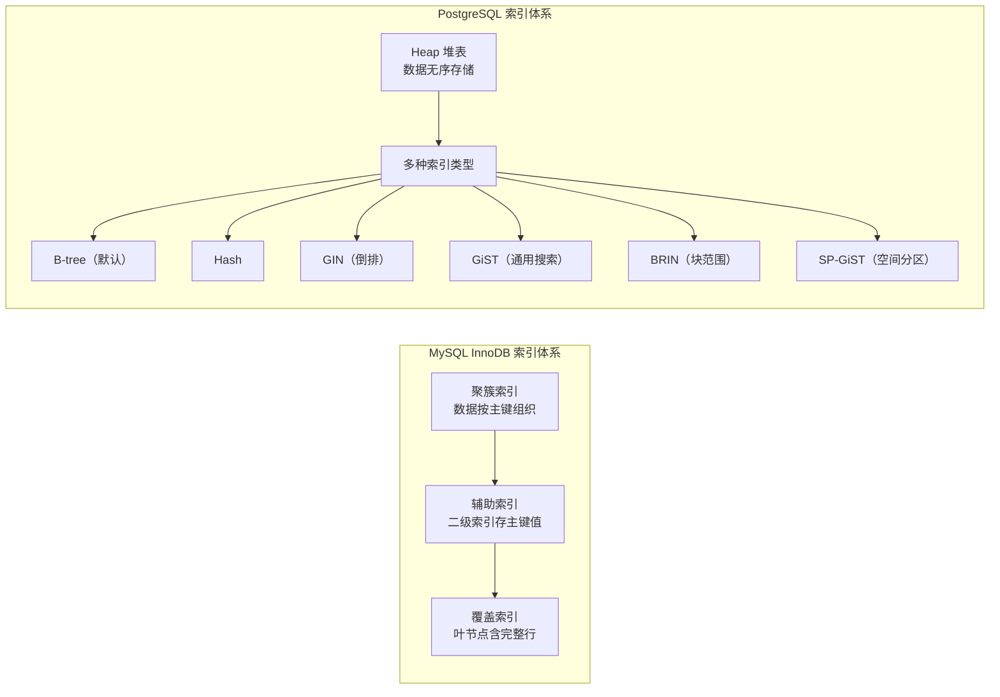
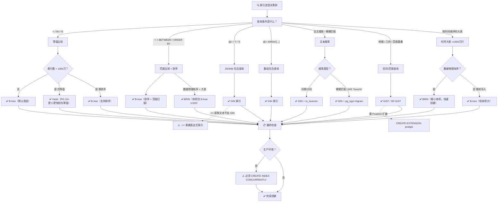
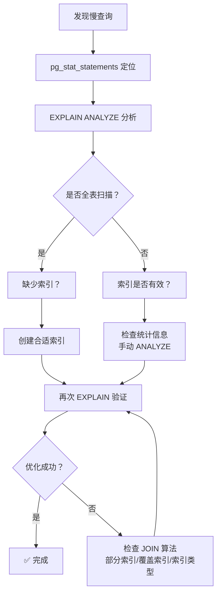

## 前置知识：索引体系的认知差异

MySQL 开发者习惯了 InnoDB 的聚簇索引 + B-tree 辅助索引，到 PostgreSQL 后发现索引体系完全不同：表是 heap（堆）、索引与表分离、还有 GIN/GiST/BRIN 等多种索引类型。理解这套索引哲学，是优化 PG 查询的前提。



> [!important] 核心差异：Heap vs 聚簇
> • **MySQL InnoDB**：数据存储在聚簇索引中（B+tree），二级索引叶节点存储主键值
> • **PostgreSQL**：数据存储在 heap（堆）中，所有索引都指向 heap 的行号（ctid）
> • 这意味着 PG 的索引访问多一次随机 I/O（heap lookup），需要用**覆盖索引**（`INCLUDE` 子句）来减少回表
> • **PG 索引会膨胀**：MVCC 产生死元组导致索引膨胀，需要 VACUUM 维护；MySQL InnoDB 的索引碎片由后台线程自动处理

---

## 一、索引体系全景对比

### 1.1 索引类型对照表

| 索引类型 | MySQL 支持 | PostgreSQL 支持 | 典型场景 |
|---------|-----------|-----------------|----------|
| B-tree | ✅ 主键/唯一/普通 | ✅ 主键/唯一/普通 | 等值、范围、排序 |
| Hash | ✅ 仅 Memory 引擎/自适应 Hash | ✅ 显式 Hash 索引 | 仅等值查询 |
| 全文索引 | ✅（MyISAM/InnoDB 5.6+） | ✅ GIN/GiST 更灵活 | 文本搜索 |
| 空间索引 | ✅ SPATIAL | ✅ GiST/SP-GiST | 地理坐标 |
| JSON 索引 | ✅ 函数索引 | ✅ GIN 索引 | JSONB 查询 |
| 数组索引 | ❌ | ✅ GIN | 数组包含查询 |
| BRIN | ❌ | ✅ | 时序/日志大表 |
| 部分索引 | ❌ | ✅ | 只索引满足条件的子集 |
| 表达式索引 | ✅ 8.0.13+ 函数索引（写法不同） | ✅ 任意表达式索引 | 索引函数/表达式结果 |
| INCLUDE 覆盖索引 | ✅ 覆盖索引 | ✅ INCLUDE 子句 | 减少回表 |
| 并发创建 | ✅ Online DDL（5.6+，INPLACE 不阻塞 DML） | ✅ CREATE INDEX CONCURRENTLY | 不停机建索引 |

### 1.2 聚簇索引 vs Heap 表

| 维度 | MySQL InnoDB | PostgreSQL |
|------|-------------|------------|
| 数据组织 | 聚簇索引（数据按主键有序存储） | Heap（数据无序存储） |
| 主键 | 聚簇索引（隐式或显式） | 可选（表可无主键） |
| 二级索引叶节点 | 存储主键值 | 存储 ctid（行号） |
| 插入顺序 | 有序插入（可能页分裂） | 无序追加（无页分裂） |
| 更新后数据移动 | 可能移动（页分裂） | 产生死元组（需 VACUUM） |
| 索引访问 | 聚簇扫描（无需回表） | 可能需要回表（heap lookup） |

> [!tip] PostgreSQL 的覆盖索引
> PG 没有聚簇索引的"覆盖扫描"，但可以用 `INCLUDE` 子句实现覆盖索引，避免回表。

```sql
-- MySQL 覆盖索引（自然利用二级索引叶节点）
-- SELECT user_id FROM orders WHERE user_id > 1000;  -- 无需回表

-- PostgreSQL 覆盖索引（用 INCLUDE 子句）
CREATE INDEX idx_orders_user_id_covering
ON orders (user_id) INCLUDE (amount, created_at);
-- 查询 amount 和 created_at 时不需要回表
```

### 1.3 索引创建语法对比

| 操作 | MySQL | PostgreSQL |
|------|-------|-----------|
| 创建索引 | `CREATE INDEX idx ON t (col)` | `CREATE INDEX idx ON t (col)` |
| 唯一索引 | `CREATE UNIQUE INDEX idx ON t (col)` | `CREATE UNIQUE INDEX idx ON t (col)` |
| 并发创建（不锁表） | Online DDL（`ALTER TABLE ... ADD INDEX`，INPLACE 不阻塞 DML） | `CREATE INDEX CONCURRENTLY idx ON t (col)` |
| 删除索引 | `DROP INDEX idx ON t` | `DROP INDEX idx` |
| 查看索引 | `SHOW INDEX FROM t` | `\d t` 或 `SELECT * FROM pg_indexes WHERE tablename = 't'` |
| 强制使用索引 | `FORCE INDEX (idx)` | `SET enable_seqscan = off`（仅调试用） |

> [!important] CONCURRENTLY 是 PG 生产环境的标配
> `CREATE INDEX` 会锁表（阻塞写入），`CREATE INDEX CONCURRENTLY` 分两次扫描，不阻塞写入。生产环境创建索引**必须**用 CONCURRENTLY。

---

## 二、索引类型选型

### 2.1 索引类型决策树



> [!tip] 决策树使用指南
> 1. 先确定查询条件类型（等值/范围/JSONB/数组/文本/空间/时序）
> 2. 再看数据特征（表大小、物理有序性、写入频率）
> 3. 最后确认生产环境 → 必须用 `CONCURRENTLY` 并发创建
> 4. B-tree 覆盖 90% 场景，不确定时先用 B-tree 再 EXPLAIN 验证

### 2.2 B-tree 索引（默认，覆盖 90% 场景）

```sql
-- ============================================
-- B-tree 索引：PG 默认索引类型，无需指定 USING BTREE
-- ============================================
-- 单列索引
CREATE INDEX idx_users_email ON users (email);

-- 复合索引（最左前缀原则与 MySQL 一致）
CREATE INDEX idx_orders_user_status
ON orders (user_id, status, created_at);

-- 降序索引
CREATE INDEX idx_orders_recent ON orders (created_at DESC);

-- 表达式索引（MySQL 8.0.13+ 也支持函数索引但写法不同；PG 支持任意表达式索引）
CREATE INDEX idx_users_email_lower ON users (LOWER(email));

-- 覆盖索引（INCLUDE 子句，PG 独有，避免回表）
CREATE INDEX idx_orders_user_amount
ON orders (user_id) INCLUDE (amount, created_at);

-- 部分索引（只索引满足条件的行，PG 独有）
CREATE INDEX idx_users_active ON users (email)
WHERE is_active = true;

-- 并发创建索引（不阻塞写入，生产必用）
CREATE INDEX CONCURRENTLY idx_users_name_cc ON users (name);
```

| 复合索引 | MySQL | PostgreSQL | 一致性 |
|---------|-------|-----------|--------|
| 最左前缀 | 支持 | 支持 | ✅ 一致 |
| 索引下推（ICP） | 支持 | 不支持 | ❌ 差异 |
| 覆盖索引 | 自动（聚簇索引） | 需 INCLUDE 子句 | ❌ 差异 |
| 降序索引 | 8.0+ 支持 | 完整支持 | ⚠️ 部分一致 |

### 2.3 索引失效场景

```sql
-- 1. 对索引列做函数运算（MySQL 和 PG 都失效）
-- ❌ 不要这样写
SELECT * FROM users WHERE DATE(created_at) = '2026-07-24';
-- ✅ 改成范围查询
SELECT * FROM users WHERE created_at >= '2026-07-24' AND created_at < '2026-07-25';

-- 2. 隐式类型转换导致失效
-- ❌ 在 PG 中会报错或走不上索引
SELECT * FROM orders WHERE order_no = 123;  -- order_no 是 text 类型
-- ✅ 显式转换
SELECT * FROM orders WHERE order_no = '123';

-- 3. 索引列参与运算（MySQL 和 PG 都失效）
-- ❌
SELECT * FROM users WHERE age + 10 = 30;
-- ✅
SELECT * FROM users WHERE age = 20;
```

### 2.4 GIN 索引（PG 杀手锏：JSONB/数组/全文搜索）

```sql
-- ============================================
-- GIN 倒排索引：PG 独有
-- ============================================

-- JSONB 查询（支持 @> / ? / ?| / ?& 操作符）
CREATE INDEX idx_products_attrs ON products USING GIN (attributes);
SELECT * FROM products WHERE attributes @> '{"brand": "Apple"}';  -- 走索引
SELECT * FROM products WHERE attributes ? 'brand';                -- 走索引

-- 数组查询
CREATE INDEX idx_courses_tags ON courses USING GIN (tags);
SELECT * FROM courses WHERE tags @> ARRAY['database'];            -- 走索引

-- 全文搜索（tsvector）
ALTER TABLE articles ADD COLUMN content_tsv TSVECTOR;
CREATE INDEX idx_articles_fts ON articles USING GIN (content_tsv);
SELECT * FROM articles WHERE content_tsv @@ to_tsquery('postgresql & index');
```

> [!warning] GIN 索引的代价
> • **创建慢**：GIN 需要扫描所有元素构建倒排索引，比 B-tree 慢 3-5 倍
> • **空间大**：倒排索引比 B-tree 占用更多磁盘
> • **更新慢**：每次写入都需要更新倒排索引
> • **生产必用** `CONCURRENTLY` 创建，否则阻塞写入

### 2.5 BRIN 索引（PG 独有：时间序列优化）

```sql
-- ============================================
-- BRIN 块范围索引：适合物理有序的大表
-- ============================================
-- 场景：日志表、事件表（按时间顺序插入，物理有序）

CREATE TABLE server_logs (
    id BIGINT GENERATED ALWAYS AS IDENTITY,
    log_time TIMESTAMPTZ NOT NULL,
    message TEXT,
    level VARCHAR(10)
);

-- 创建 BRIN 索引
CREATE INDEX idx_logs_brin ON server_logs USING BRIN (log_time);

-- 对比 B-tree 索引
CREATE INDEX idx_logs_btree ON server_logs (log_time);

-- 查询时间范围
EXPLAIN ANALYZE
SELECT * FROM server_logs WHERE log_time >= NOW() - INTERVAL '1 hour';
```

| 维度 | B-tree | BRIN |
|------|--------|------|
| 索引大小 | 大（全量存储） | 小（仅存块范围摘要） |
| 创建速度 | 慢 | 快 |
| 查询性能 | 快 | 稍慢（但差距小） |
| 适用场景 | 通用 | 物理有序的大表 |
| 更新支持 | 好 | 差（需 REINDEX） |

> [!tip] BRIN 使用前提
> 数据必须**物理有序**（按时间顺序插入）。如果数据被随机插入，BRIN 的块范围会很宽，效果不如 B-tree。

### 2.6 GiST 与 Hash 索引

```sql
-- Hash 索引（PG 10+ 才可靠，仅支持等值查询）
CREATE INDEX idx_sessions_token ON sessions USING HASH (token);

-- GiST 索引：空间查询（需 PostGIS 扩展）
-- CREATE EXTENSION postgis;
-- CREATE INDEX idx_locations_gist ON locations USING GIST (geom);
-- SELECT * FROM locations WHERE ST_DWithin(geom, ST_MakePoint(121.47, 31.23), 1000);

-- GiST 排除约束（时间范围不重叠）
CREATE EXTENSION IF NOT EXISTS btree_gist;
CREATE TABLE bookings (
    room_id INT,
    time_range TSTZRANGE,
    EXCLUDE USING GIST (room_id WITH =, time_range WITH &&)
);
```

---

## 三、EXPLAIN 与查询优化

### 3.1 EXPLAIN 对比

| 功能 | MySQL | PostgreSQL |
|------|-------|-----------|
| 基础执行计划 | `EXPLAIN SELECT ...` | `EXPLAIN SELECT ...` |
| 实际执行统计 | `EXPLAIN ANALYZE SELECT ...`（8.0.18+） | `EXPLAIN (ANALYZE) SELECT ...` |
| 详细模式 | `FORMAT=JSON` | `EXPLAIN (ANALYZE, BUFFERS) SELECT ...` |
| 格式化输出 | 表格 / JSON | 树形文本 / JSON / XML / YAML |
| 成本估算 | 无 cost 概念 | 显示 estimated rows + cost |
| IO 统计 | `FORMAT=JSON` 中可见 | `BUFFERS` 参数直接显示 |
| 执行次数 | 较少展示 | 展示 `loops=N` |

### 3.2 EXPLAIN ANALYZE 输出解读

```sql
EXPLAIN (ANALYZE, BUFFERS)
SELECT o.id, o.amount, u.name
FROM orders o
JOIN users u ON o.user_id = u.id
WHERE o.created_at >= '2026-01-01'
ORDER BY o.amount DESC
LIMIT 10;

-- 典型输出：
-- Limit  (cost=123.45..456.78 rows=10 width=80) (actual time=10.234..12.567 rows=10 loops=1)
--   ->  Sort  (cost=... rows=...) (actual time=...)
--         Sort Key: o.amount DESC
--         ->  Hash Join  (cost=... rows=...) (actual time=...)
--               Hash Cond: (o.user_id = u.id)
--               ->  Seq Scan on orders o  (cost=... rows=... width=...)
--                     Filter: (created_at >= '2026-01-01')
--                     Rows Removed by Filter: 999000
--                     Buffers: shared read=5000
--               ->  Hash  (cost=... rows=...)
--                     ->  Seq Scan on users u  (cost=... rows=...)
-- Planning Time: 0.5 ms
-- Execution Time: 1.2 ms
```

**关键指标解读**：

| 指标 | 含义 | 优化目标 |
|------|------|---------|
| `actual time` | 实际耗时 | 越小越好 |
| `rows` | 实际返回行数 | 与估算行数接近 |
| `rows removed by filter` | 被过滤掉的行数 | 越少越好（索引选择性高） |
| `Buffers: shared hit` | 命中缓存的块数 | 越大越好 |
| `Buffers: shared read` | 从磁盘读取的块数 | 越小越好 |
| `Planning Time` | 计划生成时间 | 越小越好 |
| `Execution Time` | 执行时间 | 越小越好 |

### 3.3 扫描类型解读

| 扫描类型 | 含义 | 何时出现 |
|---------|------|---------|
| **Seq Scan** | 全表扫描 | 无合适索引，或表很小 |
| **Index Scan** | 索引扫描 + 回表 | 有索引，但需读取非索引列 |
| **Index Only Scan** | 仅索引扫描（不回表） | 覆盖索引命中 |
| **Bitmap Heap Scan** | 位图索引扫描 | 多个索引条件组合 |

### 3.4 JOIN 算法对比

| 算法 | 原理 | 适用场景 |
|------|------|---------|
| **Nested Loop** | 嵌套循环 | 小表 join 大表（有索引） |
| **Hash Join** | 哈希连接 | 中等表 join，无索引 |
| **Merge Join** | 合并连接 | 两个大表，都有排序索引 |

### 3.5 强制/禁用索引

```sql
-- MySQL: 强制索引
-- SELECT * FROM users FORCE INDEX (idx_name) WHERE name = 'Alice';

-- PG: 禁用顺序扫描（仅调试用，生产禁用）
SET enable_seqscan = off;
EXPLAIN SELECT * FROM users WHERE name = 'Alice';  -- 可能走索引
SET enable_seqscan = on;  -- 恢复
```

---

## 四、高级索引特性

### 4.1 部分索引（Partial Index）

```sql
-- 只给未付款订单建索引（节省空间，加速特定查询）
CREATE INDEX idx_orders_unpaid
ON orders (user_id, created_at)
WHERE status = 'pending';

-- 只给活跃用户建索引
CREATE INDEX idx_users_active ON users (email)
WHERE is_active = true;
```

### 4.2 表达式索引

```sql
-- 大小写不敏感的 email 查询
CREATE INDEX idx_users_email_lower ON users (LOWER(email));
SELECT * FROM users WHERE LOWER(email) = 'alice@test.com';  -- 走索引

-- JSONB 路径索引
CREATE INDEX idx_products_brand ON products ((attributes->>'brand'));
SELECT * FROM products WHERE attributes->>'brand' = 'Apple';  -- 走索引
```

### 4.3 多列统计信息（扩展统计）

```sql
-- 场景：city 和 state 高度相关，但 PG 默认假设独立
CREATE STATISTICS stats_city_state (dependencies, ndistinct)
ON city, state FROM addresses;

-- 更新统计信息
ANALYZE addresses;
```

### 4.4 索引维护与膨胀检测

```sql
-- 查看索引大小
SELECT schemaname, indexrelname AS index_name,
       pg_size_pretty(pg_relation_size(indexrelid)) AS index_size
FROM pg_stat_user_indexes
ORDER BY pg_relation_size(indexrelid) DESC;

-- 查看索引使用情况（未被使用的索引可以删除）
SELECT schemaname, relname, indexrelname,
       idx_scan, idx_tup_read, idx_tup_fetch
FROM pg_stat_user_indexes
WHERE relname = 'orders';

-- 并发重建索引（不锁表，推荐生产）
REINDEX INDEX CONCURRENTLY idx_users_name;

-- 更新表统计信息
ANALYZE users;
```

---

## 五、慢查询定位与优化

### 5.1 pg_stat_statements（PG 独有，类似慢查询日志）

```sql
-- 启用扩展（需在 postgresql.conf 中添加 shared_preload_libraries = 'pg_stat_statements'）
CREATE EXTENSION IF NOT EXISTS pg_stat_statements;

-- 查看最耗时的查询 Top 10
SELECT query, calls,
       ROUND(total_exec_time::numeric, 2) AS total_ms,
       ROUND(mean_exec_time::numeric, 2) AS avg_ms,
       rows
FROM pg_stat_statements
ORDER BY total_exec_time DESC LIMIT 10;

-- 查看最耗 I/O 的查询
SELECT query, shared_blks_read, shared_blks_hit
FROM pg_stat_statements ORDER BY shared_blks_read DESC LIMIT 10;

-- 重置统计
SELECT pg_stat_statements_reset();
```

### 5.2 优化决策流程



### 5.3 索引优化案例

```sql
-- 慢查询
SELECT * FROM orders
WHERE status = 'paid' AND created_at >= '2026-01-01'
ORDER BY created_at DESC LIMIT 10;

-- 优化 1：复合索引（覆盖 status + created_at）
CREATE INDEX idx_orders_status_created ON orders(status, created_at DESC);

-- 优化 2：部分索引（只关心 paid 状态，更省空间更快）
CREATE INDEX idx_orders_paid_created ON orders(created_at DESC)
WHERE status = 'paid';

-- 验证
EXPLAIN (ANALYZE, BUFFERS)
SELECT * FROM orders
WHERE status = 'paid' AND created_at >= '2026-01-01'
ORDER BY created_at DESC LIMIT 10;
```

---

## 六、实践练习（附注释）

### 练习 1：EXPLAIN 分析与索引创建 🟢 基础

```sql
-- 目标：比较索引扫描和全表扫描的成本
CREATE TABLE orders_explain (
    id SERIAL PRIMARY KEY,
    user_id INT NOT NULL,
    amount NUMERIC(10,2),
    status VARCHAR(20),
    created_at TIMESTAMPTZ DEFAULT NOW()
);

-- 插入 10 万条测试数据
-- 注释：generate_series 是 PG 独有的序列生成函数
INSERT INTO orders_explain (user_id, amount, status, created_at)
SELECT n, RANDOM() * 1000,
       CASE WHEN n % 2 = 0 THEN 'paid' ELSE 'pending' END,
       NOW() - INTERVAL '1 day' * (n % 365)
FROM generate_series(1, 100000) AS n;

-- 1. 无索引时的全表扫描
EXPLAIN (ANALYZE, BUFFERS)
SELECT * FROM orders_explain WHERE status = 'paid';
-- 预期：Seq Scan，扫描大量行

-- 2. 创建索引
CREATE INDEX idx_orders_status ON orders_explain(status);

-- 3. 再次 EXPLAIN
EXPLAIN (ANALYZE, BUFFERS)
SELECT * FROM orders_explain WHERE status = 'paid';
-- 预期：Bitmap Heap Scan 或 Index Scan，扫描行数大幅减少
```

**验收标准**：能从 EXPLAIN 输出中识别 Seq Scan、Index Scan、Bitmap Heap Scan，并比较 cost 和 Buffers。

### 练习 2：复合索引与部分索引 🟡 进阶

```sql
-- 目标：创建复合索引和部分索引，比较性能
-- 场景：查询"过去 30 天内已支付的订单，按金额倒排取前 10"

EXPLAIN (ANALYZE, BUFFERS)
SELECT id, user_id, amount
FROM orders_explain
WHERE status = 'paid' AND created_at >= NOW() - INTERVAL '30 days'
ORDER BY amount DESC LIMIT 10;

-- 方案 1：复合索引（覆盖 status + created_at + amount）
CREATE INDEX idx_orders_status_created_amount
ON orders_explain(status, created_at, amount);

-- 方案 2：部分索引（只索引 paid 状态，更省空间更快）
CREATE INDEX idx_orders_paid_recent_amount
ON orders_explain(created_at, amount)
WHERE status = 'paid';

-- 比较三种方案的 EXPLAIN ANALYZE
EXPLAIN (ANALYZE, BUFFERS)
SELECT id, user_id, amount
FROM orders_explain
WHERE status = 'paid' AND created_at >= NOW() - INTERVAL '30 days'
ORDER BY amount DESC LIMIT 10;

-- 对比索引大小
SELECT pg_size_pretty(pg_relation_size('idx_orders_status_created_amount')) AS composite_size,
       pg_size_pretty(pg_relation_size('idx_orders_paid_recent_amount')) AS partial_size;
```

**可量化验收标准**：
- **完成标准**：① 创建复合索引和部分索引各 1 个 ② 用 EXPLAIN 对比三种方案（无索引/复合/部分）的 cost 和 Buffers ③ 部分索引体积 < 复合索引
- **预期输出**：`pg_size_pretty(pg_relation_size('idx_orders_paid_recent_amount'))` 值 < 复合索引；EXPLAIN 中部分索引的 `Rows Removed by Filter` 为 0
- **自测方法**：对比两个 EXPLAIN 的 `Execution Time`，部分索引应更快
- **常见错误**：部分索引条件写错导致过滤不生效；忘记 `WHERE status='paid'` 与索引条件一致

### 练习 3：GIN 索引 JSONB 查询 🟡 进阶

```sql
-- 目标：为 JSONB 字段创建 GIN 索引并验证查询计划
CREATE TABLE events_gin (
    id SERIAL PRIMARY KEY,
    payload JSONB NOT NULL
);

-- 插入数据
INSERT INTO events_gin (payload)
SELECT jsonb_build_object(
    'user_id', n,
    'event_type', CASE WHEN n%2=0 THEN 'click' ELSE 'view' END
)
FROM generate_series(1, 50000) AS n;

-- 无索引查询
EXPLAIN (ANALYZE)
SELECT * FROM events_gin WHERE payload @> '{"event_type":"click"}';
-- 预期：Seq Scan

-- 创建 GIN 索引
CREATE INDEX idx_events_payload ON events_gin USING GIN (payload);

-- 再次查询
EXPLAIN (ANALYZE)
SELECT * FROM events_gin WHERE payload @> '{"event_type":"click"}';
-- 预期：Bitmap Index Scan using GIN

-- 注意：->> 提取文本不走 GIN 索引
EXPLAIN (ANALYZE)
SELECT * FROM events_gin WHERE payload->>'event_type' = 'click';
-- 预期：Seq Scan（不走索引）
-- 要走索引需创建表达式索引
CREATE INDEX idx_events_type_expr ON events_gin ((payload->>'event_type'));
```

**可量化验收标准**：
- **完成标准**：① 创建 GIN 索引前后各 EXPLAIN，识别 Seq Scan → Bitmap Index Scan 变化 ② `->>` 查询不走 GIN 仍为 Seq Scan ③ 创建表达式索引后 `->>` 走 Index Scan
- **预期输出**：无索引时 `Seq Scan` 扫描 50000 行；有 GIN 索引后 `Bitmap Index Scan`，cost 下降 10x+
- **自测方法**：对比 `EXPLAIN SELECT * FROM events_gin WHERE payload @> '{"event_type":"click"}'` 建索引前后
- **常见错误**：`->>` 提取文本不走 GIN 索引需建表达式索引；GIN 索引创建慢且占空间大

### 练习 4：BRIN 索引大表优化 🔴 挑战

```sql
-- 目标：用 BRIN 索引优化大表时序查询
CREATE TABLE server_logs_brin (
    id BIGINT GENERATED ALWAYS AS IDENTITY,
    log_time TIMESTAMPTZ NOT NULL,
    message TEXT,
    level VARCHAR(10)
);

-- 插入 100 万条时序数据（按时间顺序）
INSERT INTO server_logs_brin (log_time, message, level)
SELECT NOW() - INTERVAL '1 day' * (n / 100000.0),
       'log message ' || n,
       CASE WHEN n % 10 = 0 THEN 'ERROR' ELSE 'INFO' END
FROM generate_series(1, 1000000) AS n;

-- 无索引时按时间范围查询
EXPLAIN (ANALYZE, BUFFERS)
SELECT * FROM server_logs_brin
WHERE log_time >= NOW() - INTERVAL '1 hour';

-- 创建 BRIN 索引
CREATE INDEX idx_logs_brin ON server_logs_brin USING BRIN (log_time);

-- 再次查询
EXPLAIN (ANALYZE, BUFFERS)
SELECT * FROM server_logs_brin
WHERE log_time >= NOW() - INTERVAL '1 hour';

-- 对比 B-tree 索引大小
CREATE INDEX idx_logs_btree ON server_logs_brin (log_time);
SELECT pg_size_pretty(pg_relation_size('idx_logs_brin')) AS brin_size,
       pg_size_pretty(pg_relation_size('idx_logs_btree')) AS btree_size;
```

**可量化验收标准**：
- **完成标准**：① 创建 BRIN 和 B-tree 索引各 1 个 ② 对比索引大小（BRIN 远小于 B-tree） ③ EXPLAIN 对比扫描范围
- **预期输出**：`pg_size_pretty(pg_relation_size('idx_logs_brin'))` 远小于 B-tree（约 1/100）；BRIN 走 Bitmap Heap Scan
- **自测方法**：`SELECT brin_size, btree_size FROM (SELECT pg_size_pretty(pg_relation_size('idx_logs_brin')) AS brin_size, pg_size_pretty(pg_relation_size('idx_logs_btree')) AS btree_size) t`
- **常见错误**：BRIN 用于随机数据时块范围过宽性能极差；BRIN 仅适合物理有序的时序大表

### 练习 5：覆盖索引消除回表 🔴 挑战

```sql
-- 目标：用覆盖索引消除回表
CREATE TABLE events_covering (
    id SERIAL PRIMARY KEY,
    user_id INT,
    event_type VARCHAR(50),
    amount NUMERIC(10,2),
    created_at TIMESTAMPTZ
);

INSERT INTO events_covering (user_id, event_type, amount, created_at)
SELECT (random()*1000)::int,
       CASE WHEN n%3=0 THEN 'purchase' ELSE 'view' END,
       (random()*1000)::numeric(10,2),
       NOW() - INTERVAL '1 second' * n
FROM generate_series(1, 100000) AS n;

-- 普通索引（需要回表获取 amount）
CREATE INDEX idx_events_user ON events_covering (user_id);
EXPLAIN (ANALYZE, BUFFERS)
SELECT user_id, amount FROM events_covering WHERE user_id = 100;
-- 观察：Index Scan（需要回表）

-- 覆盖索引（包含 amount，无需回表）
CREATE INDEX idx_events_user_covering
ON events_covering (user_id) INCLUDE (amount);
EXPLAIN (ANALYZE, BUFFERS)
SELECT user_id, amount FROM events_covering WHERE user_id = 100;
-- 观察：Index Only Scan（无需回表，更快）
```

**可量化验收标准**：
- **完成标准**：① 创建普通索引和覆盖索引（INCLUDE 子句）各 1 个 ② EXPLAIN 对比执行计划
- **预期输出**：普通索引显示 `Index Scan`（需回表，Heap Fetches > 0）；覆盖索引显示 `Index Only Scan`（无回表，Heap Fetches = 0）
- **自测方法**：`EXPLAIN (ANALYZE, BUFFERS) SELECT user_id, amount FROM events_covering WHERE user_id=100` 对比两次，覆盖索引 `shared hit` 更高
- **常见错误**：`INCLUDE` 列不能同时出现在索引键和 INCLUDE 中；覆盖索引仅对查询列子集有效

### 练习 6：慢查询全链路诊断 🔴 挑战

```sql
-- 目标：完整走一遍"发现慢查询 → 分析执行计划 → 创建索引 → 验证"流程

-- 1. 用 pg_stat_statements 找出慢 SQL
CREATE EXTENSION IF NOT EXISTS pg_stat_statements;

SELECT query, calls,
       ROUND(mean_exec_time::numeric, 2) AS avg_ms,
       rows
FROM pg_stat_statements
WHERE query ILIKE '%orders_explain%'
ORDER BY mean_exec_time DESC LIMIT 5;

-- 2. 对慢查询 EXPLAIN ANALYZE
EXPLAIN (ANALYZE, BUFFERS)
SELECT * FROM orders_explain
WHERE user_id BETWEEN 100 AND 200
ORDER BY created_at DESC LIMIT 100;

-- 3. 创建索引
CREATE INDEX idx_orders_user_created ON orders_explain(user_id, created_at DESC);

-- 4. 再次 EXPLAIN ANALYZE 验证
EXPLAIN (ANALYZE, BUFFERS)
SELECT * FROM orders_explain
WHERE user_id BETWEEN 100 AND 200
ORDER BY created_at DESC LIMIT 100;

-- 5. 更新统计信息
ANALYZE orders_explain;
```

**可量化验收标准**：
- **完成标准**：完整走完"pg_stat_statements 定位 → EXPLAIN ANALYZE 分析 → 创建索引 → 再次 EXPLAIN 验证 → ANALYZE 更新统计"全流程
- **预期输出**：首次 EXPLAIN 显示 `Seq Scan`；创建索引后显示 `Index Scan`；`Execution Time` 下降 50%+
- **自测方法**：`SELECT pg_stat_statements_reset()` 重置后重新执行，确认 `mean_exec_time` 显著降低
- **常见错误**：忘记 `ANALYZE` 导致统计信息过期优化器选错计划；`pg_stat_statements` 需 `shared_preload_libraries` 配置

---

## 七、常见易错点

> [!warning] **易错 1：以为 PostgreSQL 主键是聚簇索引**
> PostgreSQL 没有聚簇索引概念，主键索引只存 TID。频繁访问整行的主键查询可能需要回表。
> **解决方案**：用 `INCLUDE` 列创建覆盖索引，减少回表。

> [!warning] **易错 2：生产环境用 CREATE INDEX 不加 CONCURRENTLY**
> 普通 CREATE INDEX 会锁表（阻塞写入），大表上可能锁几分钟。
> **解决方案**：生产环境始终用 `CREATE INDEX CONCURRENTLY`。

> [!warning] **易错 3：对 JSONB 用 B-tree 索引或 ->> 查询**
> B-tree 无法优化 JSONB 的 `@>` / `?` 包含查询；`->>` 提取文本不走 GIN 索引。
> **解决方案**：用 GIN 索引 + `@>`、`?`、`?|`、`?&` 操作符。

> [!warning] **易错 4：忽略 VACUUM 导致索引膨胀**
> PG 的死元组不及时回收会让索引越来越大，查询变慢。
> **解决方案**：监控 autovacuum，必要时 `REINDEX INDEX CONCURRENTLY`。

> [!warning] **易错 5：大批量写入后不 ANALYZE**
> 统计信息过期导致优化器选择错误计划。
> **解决方案**：大批量写入后手动 `ANALYZE table_name`。

> [!warning] **易错 6：BRIN 索引用于无序或随机数据**
> BRIN 依赖数据物理有序，随机数据上 BRIN 性能极差。
> **解决方案**：仅对时序/日志等自然有序的大表使用 BRIN。

> [!warning] **易错 7：复合索引列顺序不对**
> PG 的 B-tree 复合索引遵循最左前缀原则（与 MySQL 一一致），列顺序影响索引效率。
> **解决方案**：将等值查询的列放前面，范围查询的列放后面。

---

## 🎯 本文学完自检

| 层次 | 检查项 |
|------|--------|
| 🟢 基础 | 能创建 B-tree/复合/部分/表达式索引，并用 EXPLAIN 验证 |
| 🟡 进阶 | 能根据查询类型选择 GIN/GiST/BRIN 索引，理解覆盖索引和回表 |
| 🔴 挑战 | 能独立诊断生产慢查询，完成"定位 → 分析 → 建索引 → 验证"完整流程 |

---

## ⚡ 30 秒速记卡片

| # | 正面（问题） | 背面（答案） |
|---|-------------|-------------|
| F1 | PG 默认索引类型？ | B-tree |
| F2 | JSONB 用什么索引？ | GIN |
| F3 | 数组包含查询用什么索引？ | GIN |
| F4 | 时序大表用什么索引？ | BRIN（体积为 B-tree 的 1/100） |
| F5 | 地理空间用什么索引？ | GiST |
| F6 | 如何避免回表？ | 覆盖索引 INCLUDE 子句 |
| F7 | 只索引热数据？ | 部分索引 WHERE 子句 |
| F8 | 不停机建索引？ | CREATE INDEX CONCURRENTLY |
| F9 | 查看执行计划？ | EXPLAIN (ANALYZE, BUFFERS) |
| F10 | 慢查询统计？ | pg_stat_statements 扩展 |

---

## ⚠️ 常见陷阱速查

> [!warning] 迁移时最容易踩的坑
> 1. **`->>` 提取文本不走 GIN 索引** → 需建表达式索引 `(specs->>'brand')` 或用 `@>` 包含查询
> 2. **BRIN 用于随机数据** → 块范围过宽性能极差。BRIN 仅用于物理有序的时序大表
> 3. **在线建索引忘加 CONCURRENTLY** → 锁表阻塞业务写入
> 4. **覆盖索引 INCLUDE 列同时出现在索引键中** → 建索引报错。INCLUDE 列不能同时是索引键
> 5. **建了索引但优化器不选** → `ANALYZE` 更新统计信息；检查数据分布和查询条件

---

## 相关笔记

- ⬅️ 前置：[[03-SQL查询语法差异与进阶]]
- ➡️ 后续：[[05-事务与并发控制]]
- 🔗 关联：[[02-数据类型与DDL对比]]（JSONB GIN 索引）
- 🔗 关联：[[07-双向对比-MySQL有PG无与PG有MySQL无]]

---
*最后更新：2026-07-24*