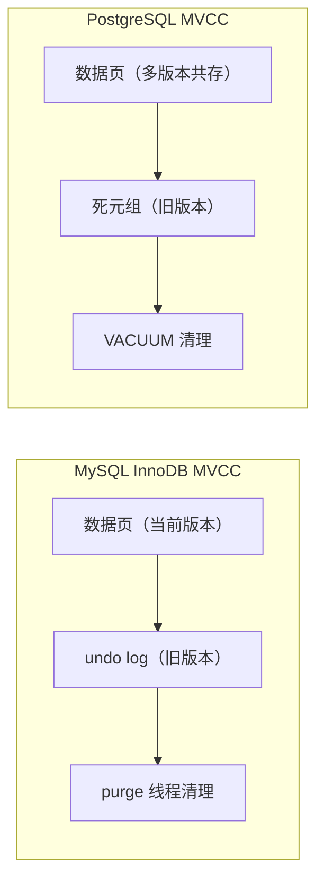
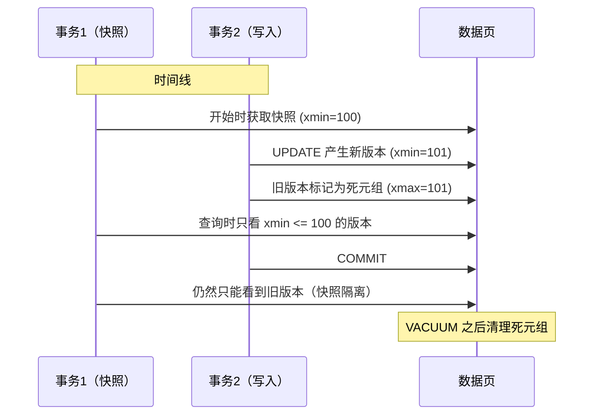
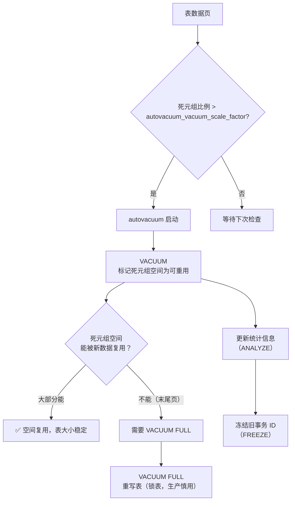
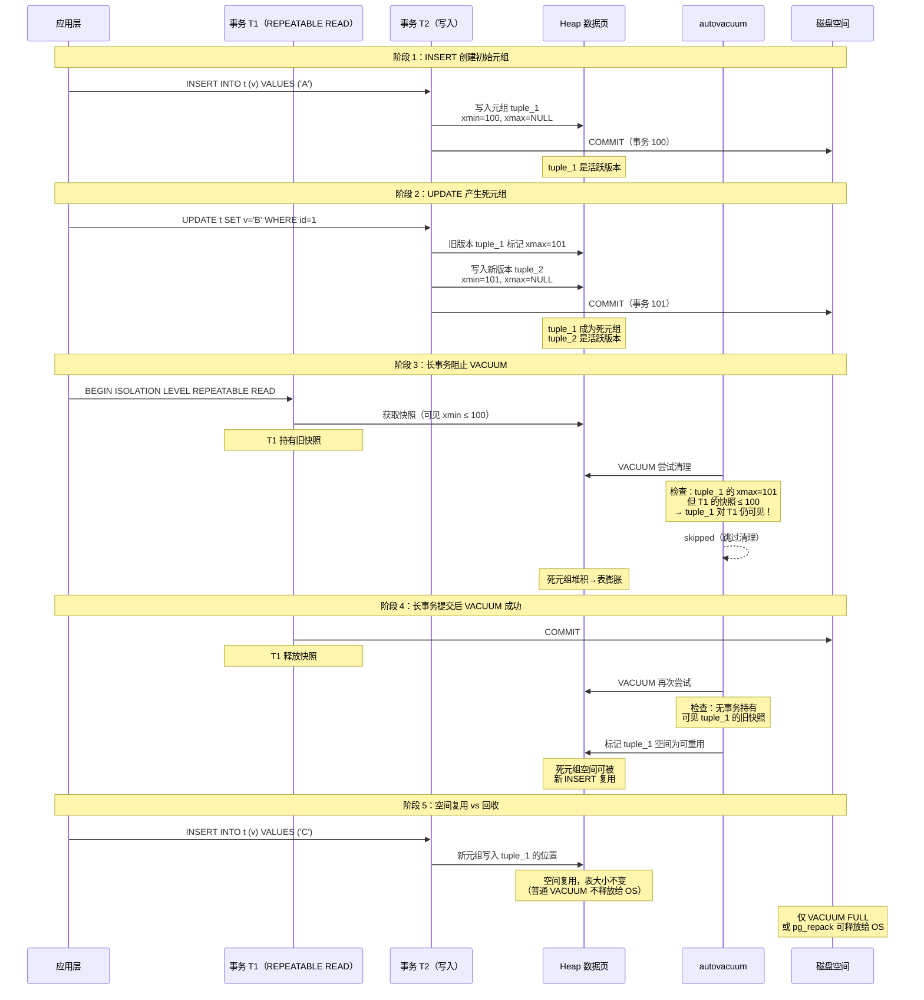

## 前置知识：MVCC 是 PG 的心脏

MySQL 的 InnoDB 用 undo log 实现 MVCC，PostgreSQL 用**多版本元组**直接存储在数据页中。这个差异导致了 PG 的 VACUUM 机制、长事务危害、表膨胀等一系列独特问题。理解 MVCC，才能理解 PG 的事务与并发控制。



> [!important] 核心差异
> • **MySQL**：当前版本在数据页，旧版本在 undo log，purge 线程自动清理
> • **PG**：所有版本共存于数据页，旧版本成为"死元组"，需要 VACUUM 手动/自动清理
> • **查询不会阻塞写入**（PG 的核心优势），写入不会阻塞查询（MVCC 保证快照）
> • **DDL 可以在事务中执行**（PG 独有），DDL 失败可以回滚

---

## 一、MVCC 实现对比

### 1.1 多版本并发控制（MVCC）原理



### 1.2 元组可见性

```sql
-- 查看隐藏列（显示 MVCC 元数据）
SELECT xmin, xmax, ctid, * FROM users;

-- xmin: 创建该版本的事务 ID
-- xmax: 删除该版本的事务 ID（NULL 表示当前版本）
-- ctid: 行的物理位置（page, offset）
```

| 概念 | MySQL InnoDB | PostgreSQL |
|------|-------------|-----------|
| 版本存储 | undo log（独立） | 数据页内（多版本共存） |
| 旧版本清理 | purge 线程（后台） | VACUUM（手动/自动） |
| 快照 | ReadView（事务开始时创建） | 快照（基于 xmin） |
| 回滚段 | undo 表空间 | pg_class 系统表 |
| 更新代价 | 写入 undo + 数据页 | 写入新版本到数据页 |

> [!tip] 更新时 PG 做什么
> `UPDATE` 在 PG 中相当于 `DELETE + INSERT`：旧版本标记为死元组（xmax 设为当前事务 ID），新版本追加到数据页（xmin 设为当前事务 ID）。这就是为什么 PG 没有"原地更新"的开销，但也意味着需要 VACUUM 清理。

---

## 二、事务隔离级别对比

### 2.1 隔离级别对照

| 隔离级别 | MySQL 实现 | PostgreSQL 实现 | 一致性 |
|---------|-----------|----------------|--------|
| **Read Uncommitted** | 允许脏读 | 内部等同于 Read Committed | ⚠️ PG 不支持脏读 |
| **Read Committed** | 快照或当前读（取决于语句） | 每个语句获取新快照 | ✅ 语义一致 |
| **Repeatable Read** | 普通 SELECT 走一致性快照读（后提交的 INSERT 不可见）；锁定读用 next-key 锁防幻读 | 快照隔离（无锁防幻读） | ⚠️ 机制不同：PG 无锁快照，MySQL 依赖锁 |
| **Serializable** | 间隙锁 + 行锁 | Serializable Snapshot Isolation（SSI） | ❌ 实现完全不同 |

> [!important] PG 与 MySQL 的 Repeatable Read：普通 SELECT 都防幻读，机制不同
> MySQL InnoDB RR 下普通 SELECT 走**一致性快照读**（基于事务首次读建立的 ReadView），别的事务后提交的 INSERT **不可见**，普通范围查询不会出现幻读。幻读只出现在**锁定读**（`FOR UPDATE` 等当前读）或"本事务先当前读再快照读"的场景，而 next-key 锁（含间隙锁）正是 MySQL 在锁定读下防幻读的机制。PostgreSQL 的 Repeatable Read 基于**无锁的快照隔离**，天然防幻读——可教的正确差异是：PG RR 是无锁快照隔离，MySQL RR 的防幻读依赖锁。PG 的 Serializable 使用 SSI（串行化快照隔离），不依赖锁，适合高并发。

### 2.2 隔离级别行为对比

```sql
-- 查看当前隔离级别
-- MySQL: SELECT @@transaction_isolation;
-- PG:
SHOW transaction_isolation;

-- 设置隔离级别
-- MySQL: SET SESSION TRANSACTION ISOLATION LEVEL READ COMMITTED;
-- PG:
SET TRANSACTION ISOLATION LEVEL READ COMMITTED;

-- 在事务中设置
BEGIN;
SET TRANSACTION ISOLATION LEVEL REPEATABLE READ;
-- 执行业务逻辑...
COMMIT;
```

### 2.3 幻读测试

```sql
-- ============================================
-- PG Repeatable Read 防幻读测试
-- ============================================
-- 会话 A：
BEGIN ISOLATION LEVEL REPEATABLE READ;
SELECT COUNT(*) FROM orders WHERE status = 'pending';  -- 结果：10

-- 等待会话 B 插入并提交...

-- 会话 B：
INSERT INTO orders (user_id, status) VALUES (1, 'pending');
COMMIT;

-- 会话 A（会话 B 提交后查询）：
SELECT COUNT(*) FROM orders WHERE status = 'pending';
-- PG 结果：10（快照隔离，看不到新插入的行）
-- MySQL 结果：同样是 10（InnoDB RR 普通 SELECT 走一致性快照读，后提交的 INSERT 不可见）
-- MySQL 出现幻读的场景是锁定读：若会话 A 用 SELECT ... FOR UPDATE 当前读，
-- 会看到新插入的行；next-key 锁（含间隙锁）正是锁定读下防幻读的机制
```

---

## 三、DDL 事务支持（PG 独有）

```sql
-- ============================================
-- PG 独有：DDL 可以在事务中执行并回滚
-- MySQL 中 DDL 是隐式提交的，无法回滚
-- ============================================

-- 在事务中执行 DDL
BEGIN;
    CREATE TABLE test_ddl (id SERIAL PRIMARY KEY, name VARCHAR(50));
    INSERT INTO test_ddl (name) VALUES ('Alice');
    -- 如果后续操作失败，可以回滚整个 DDL + 数据
    ALTER TABLE test_ddl ADD COLUMN email VARCHAR(100);
    INSERT INTO test_ddl (name, email) VALUES ('Bob', 'bob@test.com');
    -- 可以回滚 DDL！
ROLLBACK;

-- 验证：表不存在（DDL 被回滚了）
SELECT COUNT(*) FROM test_ddl;  -- 报错：relation "test_ddl" does not exist
```

> [!tip] DDL 事务在生产中的价值
> 在 MySQL 中，如果 ALTER TABLE 失败，表可能处于不一致状态。在 PG 中，整个 DDL 可以作为一个事务，成功则全部生效，失败则全部回滚。这是 PG 运维的极大优势。

---

## 四、锁机制对比

### 4.1 锁类型对比

| 锁类型 | MySQL InnoDB | PostgreSQL |
|--------|-------------|------------|
| 行锁 | Record Lock / Gap Lock / Next-Key Lock | 行级锁（基于元组 xmax） |
| 表锁 | `LOCK TABLES` | `LOCK TABLE` / AccessExclusiveLock |
| 页锁 | 无 | 无（PG 无页级锁） |
| 间隙锁 | 有（Next-Key Lock） | 无（MVCC 天然防幻读） |
| 意向锁 | 有（IS/IX） | 无（简化锁层次） |
| 咨询锁 | 有（`GET_LOCK()`/`RELEASE_LOCK()`，功能较弱） | **Advisory Lock**（支持会话级/事务级、多粒度） |
| 死锁检测 | 自动 | 自动（`deadlock_timeout`） |

### 4.2 行锁与排队

```sql
-- PostgreSQL 行锁（SELECT ... FOR UPDATE）
BEGIN;
SELECT * FROM users WHERE id = 1 FOR UPDATE;  -- 锁定行
-- 其他会话 UPDATE users SET name = 'New' WHERE id = 1; 会等待

-- 查看锁等待（官方推荐写法：pg_blocking_pids 可正确匹配行锁等待，
-- 因为 transactionid 型锁等待的 database/relation 均为 NULL，按 relation join 匹配不到）
SELECT pid,
       pg_blocking_pids(pid) AS blocked_by,
       wait_event_type, wait_event,
       state, query
FROM pg_stat_activity
WHERE cardinality(pg_blocking_pids(pid)) > 0;

-- 旧写法（pg_locks 自连接，仅适合表锁等 relation 非空的场景）：
SELECT blocked.pid AS blocked_pid,
       blocked.query AS blocked_query,
       blocking.pid AS blocking_pid,
       blocking.query AS blocking_query
FROM pg_stat_activity blocked
JOIN pg_locks waiting ON waiting.pid = blocked.pid AND NOT waiting.granted
JOIN pg_locks holding ON holding.locktype = waiting.locktype
    AND holding.database = waiting.database
    AND holding.relation = waiting.relation
    AND holding.pid != waiting.pid
    AND holding.granted
JOIN pg_stat_activity blocking ON blocking.pid = holding.pid;
```

### 4.3 SKIP LOCKED（PG 独有）

```sql
-- ============================================
-- SKIP LOCKED：队列消费模式
-- 跳过被锁定的行，处理未被锁定的行
-- MySQL 8.0+ 也支持，但 PG 更早支持
-- ============================================

-- 创建任务队列
CREATE TABLE task_queue (
    id SERIAL PRIMARY KEY,
    task_name VARCHAR(100),
    status VARCHAR(20) DEFAULT 'pending',
    created_at TIMESTAMPTZ DEFAULT NOW()
);

INSERT INTO task_queue (task_name) VALUES
('task1'), ('task2'), ('task3'), ('task4'), ('task5');

-- 消费者 1：锁定并处理任务
BEGIN;
SELECT * FROM task_queue
WHERE status = 'pending'
ORDER BY id
LIMIT 2
FOR UPDATE SKIP LOCKED;
-- 返回 task1, task2（锁定这两行）
-- 消费者 2 同时查询会跳过 task1, task2，返回 task3, task4

-- 处理完成后更新
UPDATE task_queue SET status = 'processing' WHERE id IN (1, 2);
COMMIT;

-- NOWAIT：不等待，立即报错
-- 如果行被锁定，立即返回错误而非等待
SELECT * FROM task_queue WHERE id = 1 FOR UPDATE NOWAIT;
```

### 4.4 Advisory Lock（应用层协调锁）

```sql
-- 应用层共享资源控制（如分布式定时任务唯一执行）
-- 注：MySQL 也有 GET_LOCK()/RELEASE_LOCK()，但功能弱于 PG advisory lock
-- （PG 支持会话级/事务级自动释放、双整数命名空间、共享/排他两种模式）
SELECT pg_try_advisory_lock(1);  -- 尝试获取锁（非阻塞）
SELECT pg_advisory_lock(1);      -- 获取锁（阻塞等待）
SELECT pg_advisory_unlock(1);    -- 释放锁

-- 命名空间锁（用两个整数标识）
SELECT pg_try_advisory_lock(100, 200);
SELECT pg_advisory_unlock(100, 200);

-- 事务结束后自动释放
BEGIN;
SELECT pg_advisory_xact_lock(999);  -- 事务结束时自动释放
-- 执行受保护的业务逻辑
COMMIT;
```

---

## 五、VACUUM 机制

### 5.1 VACUUM 全景



### 5.1.1 死元组生命周期详解



> [!important] 死元组生命周期的五个关键点
> 1. **INSERT**：创建元组，`xmin` 设为当前事务 ID，`xmax` 为 NULL
> 2. **UPDATE/DELETE**：旧版本 `xmax` 被标记，新版本追加写入
> 3. **长事务阻止清理**：任何持有旧快照的事务都会阻止 VACUUM 清理该快照可见的死元组
> 4. **VACUUM 标记可重用**：普通 VACUUM 标记空间为"可重用"但不释放给 OS
> 5. **空间复用**：新 INSERT 优先写入已标记可重用的空间，表大小趋于稳定

### 5.2 VACUUM 操作对比

```sql
-- 查看表和索引膨胀情况
SELECT relname, pg_size_pretty(pg_total_relation_size(relid)) AS total_size,
       n_dead_tup, last_vacuum, last_autovacuum
FROM pg_stat_user_tables
WHERE relname = 'orders';

-- 手动 VACUUM（不锁表，不回收磁盘空间给 OS）
VACUUM (VERBOSE, ANALYZE) orders;

-- VACUUM FULL（锁表，重写表，回收磁盘空间给 OS，生产慎用）
VACUUM FULL (VERBOSE) orders;

-- 手动 ANALYZE（更新统计信息，不清理死元组）
ANALYZE orders;

-- 监控 autovacuum 活动
SELECT relname, last_autovacuum, n_dead_tup
FROM pg_stat_user_tables WHERE n_dead_tup > 0;
```

| 操作 | 锁表？ | 回收空间 | 更新统计 | 使用场景 |
|------|--------|---------|---------|---------|
| `VACUUM` | 不锁 | 标记可重用 | 可选 | 日常维护 |
| `VACUUM FULL` | **锁表** | 回收给 OS | 可选 | 严重膨胀时（慎用） |
| `ANALYZE` | 不锁 | 不回收 | 是 | 更新统计信息 |
| `autovacuum` | 不锁 | 标记可重用 | 是 | 自动后台维护 |

### 5.3 autovacuum 配置

```sql
-- 查看 autovacuum 配置
SHOW autovacuum;  -- 是否开启（默认 on）
SHOW autovacuum_vacuum_scale_factor;  -- 死元组比例阈值（默认 0.2）
SHOW autovacuum_analyze_scale_factor;  -- 统计信息更新阈值（默认 0.1）

-- 大表优化：降低阈值，更频繁地 VACUUM
ALTER TABLE large_orders SET (
    autovacuum_vacuum_scale_factor = 0.01,
    autovacuum_vacuum_cost_delay = 10
);

-- 查看 autovacuum 工作进程
SELECT name, setting FROM pg_settings WHERE name LIKE 'autovacuum%';
```

### 5.4 长事务的危害

```sql
-- 查看长事务（超过 5 分钟）
SELECT pid, age(clock_timestamp(), query_start) AS duration,
       query, state
FROM pg_stat_activity
WHERE state != 'idle'
  AND query_start < clock_timestamp() - INTERVAL '5 minutes'
ORDER BY duration DESC;

-- 查看事务 ID 年龄（防止事务 ID 回卷）
SELECT datname, age(datfrozenxid) AS age
FROM pg_database ORDER BY age DESC;
-- 如果 age 接近 2^31（约 20 亿），需要紧急 VACUUM FREEZE

-- 终止长事务
SELECT pg_terminate_backend(pid);
```

> [!warning] 长事务的三重危害
> 1. **阻止 VACUUM 清理**：长事务持有旧快照，VACUUM 无法清理该快照可见的死元组
> 2. **表膨胀**：死元组堆积，表和索引变大，查询变慢
> 3. **事务 ID 回卷风险**：如果长时间不 FREEZE，事务 ID 可能耗尽，数据库进入只读状态

---

## 六、死锁检测与处理

### 6.1 构造死锁实验

```sql
-- 会话 A：
BEGIN;
UPDATE users SET name = 'A' WHERE id = 1;  -- 锁定 id=1
-- 等待 2 秒，然后更新 id=2
SELECT pg_sleep(2);
UPDATE users SET name = 'A' WHERE id = 2;  -- 等待会话 B 释放 id=2

-- 会话 B（同时执行）：
BEGIN;
UPDATE users SET name = 'B' WHERE id = 2;  -- 锁定 id=2
-- 等待 2 秒，然后更新 id=1
SELECT pg_sleep(2);
UPDATE users SET name = 'B' WHERE id = 1;  -- 等待会话 A 释放 id=1

-- 结果：PG 检测到死锁，自动回滚其中一个事务
-- ERROR: deadlock detected
-- DETAIL: Process X waits for ShareLock on transaction Y; blocked by process Z.
```

### 6.2 死锁日志

```sql
-- 查看死锁超时配置
SHOW deadlock_timeout;  -- 默认 1s

-- 配置死锁日志（postgresql.conf）
-- log_lock_waits = on
-- deadlock_timeout = 1s

-- 查看锁等待日志
SELECT * FROM pg_stat_activity WHERE wait_event_type = 'Lock';
```

---

## 七、实践练习（附注释）

### 练习 1：MVCC 不可见性验证 🟢 基础

```sql
-- 目标：验证 MVCC 快照隔离
-- 表结构
CREATE TABLE mvcc_test (
    id SERIAL PRIMARY KEY,
    value TEXT
);
INSERT INTO mvcc_test (value) VALUES ('initial');

-- 会话 A（事务内）：
BEGIN ISOLATION LEVEL REPEATABLE READ;
SELECT xmin, xmax, * FROM mvcc_test;  -- 记录 xmin

-- 切换到会话 B：更新数据
UPDATE mvcc_test SET value = 'updated' WHERE id = 1;
COMMIT;

-- 回到会话 A：查看
SELECT xmin, xmax, * FROM mvcc_test;
-- 如果隔离级别是 REPEATABLE READ，结果仍是 'initial'！
-- 注释：xmax 可能显示行被删除，但 REPEATABLE READ 快照看不到新版本
COMMIT;

-- 再次查询
SELECT xmin, xmax, * FROM mvcc_test;  -- 结果：'updated'
```

**验收标准**：能解释 PG 的 MVCC 快照隔离原理，理解 xmin/xmax 的作用。

### 练习 2：DDL 事务回滚 🟢 基础

```sql
-- 目标：验证 PG 可以回滚 DDL（MySQL 无法做到）
-- 注释：MySQL 的 DDL 是隐式提交的，PG 的 DDL 可以在事务中回滚

-- 先确认表不存在
SELECT COUNT(*) FROM test_ddl_tx;  -- 应报错

BEGIN;
    CREATE TABLE test_ddl_tx (id SERIAL PRIMARY KEY, name VARCHAR(50));
    INSERT INTO test_ddl_tx (name) VALUES ('Alice');
    ALTER TABLE test_ddl_tx ADD COLUMN email VARCHAR(100);
    INSERT INTO test_ddl_tx (name, email) VALUES ('Bob', 'bob@test.com');
    -- 回滚整个事务（包括 DDL）
ROLLBACK;

-- 验证：表不存在
SELECT COUNT(*) FROM test_ddl_tx;  -- 报错：relation does not exist
```

**验收标准**：验证 DDL 事务回滚，理解 PG 与 MySQL 的关键运维差异。

### 练习 3：SKIP LOCKED 队列消费 🟡 进阶

```sql
-- 目标：用 SKIP LOCKED 实现不阻塞的队列消费
CREATE TABLE task_queue (
    id SERIAL PRIMARY KEY,
    task_name VARCHAR(100),
    status VARCHAR(20) DEFAULT 'pending',
    worker_id VARCHAR(50),
    updated_at TIMESTAMPTZ DEFAULT NOW()
);

INSERT INTO task_queue (task_name) VALUES ('task1'), ('task2'), ('task3'), ('task4'), ('task5');

-- 消费者 1
BEGIN;
SELECT * FROM task_queue
WHERE status = 'pending'
ORDER BY id
LIMIT 2
FOR UPDATE SKIP LOCKED;
-- 注释：SKIP LOCKED 跳过被其他事务锁定的行，不会阻塞等待
UPDATE task_queue SET status = 'processing', worker_id = 'worker-1' WHERE id IN (1, 2);
COMMIT;

-- 消费者 2（同时执行，不会等消费者 1）
BEGIN;
SELECT * FROM task_queue
WHERE status = 'pending'
ORDER BY id
LIMIT 2
FOR UPDATE SKIP LOCKED;
-- 返回 task3, task4（task1, task2 被 worker-1 锁定）
UPDATE task_queue SET status = 'processing', worker_id = 'worker-2' WHERE id IN (3, 4);
COMMIT;
```

**可量化验收标准**：
- **完成标准**：① 两个并发会话同时 `FOR UPDATE SKIP LOCKED` 各取 2 条 pending 任务 ② 返回结果不重叠 ③ 无阻塞等待
- **预期输出**：消费者 1 返回 id=1,2；消费者 2 同时返回 id=3,4；`SELECT status, COUNT(*) FROM task_queue GROUP BY status` 显示 processing=4, pending=1
- **自测方法**：两个 psql 会话同时 BEGIN → SELECT ... FOR UPDATE SKIP LOCKED LIMIT 2 → 确认无交集 → COMMIT
- **常见错误**：忘记 `ORDER BY` 导致多消费者抢同一行；`SKIP LOCKED` 在 PG 9.6+ 才可用

### 练习 4：VACUUM 与膨胀检测 🟡 进阶

```sql
-- 目标：观察 VACUUM 清理死元组的效果
CREATE TABLE vacuum_test (
    id SERIAL PRIMARY KEY,
    value TEXT
);

-- 插入 10 万条
INSERT INTO vacuum_test (value)
SELECT 'value_' || n FROM generate_series(1, 100000) AS n;

-- 查看表大小和死元组
SELECT relname, n_live_tup, n_dead_tup,
       pg_size_pretty(pg_total_relation_size(relid)) AS total_size
FROM pg_stat_user_tables WHERE relname = 'vacuum_test';

-- 更新所有行（产生 10 万死元组）
UPDATE vacuum_test SET value = 'updated';

-- 再次查看
SELECT relname, n_live_tup, n_dead_tup,
       pg_size_pretty(pg_total_relation_size(relid)) AS total_size
FROM pg_stat_user_tables WHERE relname = 'vacuum_test';
-- 注释：n_dead_tup 应该接近 100000，表大小可能变大

-- 手动 VACUUM
VACUUM (VERBOSE, ANALYZE) vacuum_test;

-- 再次查看：死元组应该大幅减少
SELECT relname, n_live_tup, n_dead_tup,
       pg_size_pretty(pg_total_relation_size(relid)) AS total_size
FROM pg_stat_user_tables WHERE relname = 'vacuum_test';
```

**可量化验收标准**：
- **完成标准**：① UPDATE 前 `n_dead_tup=0` ② UPDATE 后 `n_dead_tup≈100000` ③ VACUUM 后 `n_dead_tup` 降至接近 0
- **预期输出**：`pg_stat_user_tables` 中 `n_dead_tup` 从 0 → ~100000 → ~0；`pg_total_relation_size` 可能不变（VACUUM 只标记可回收）
- **自测方法**：`SELECT n_dead_tup FROM pg_stat_user_tables WHERE relname='vacuum_test'` 在三个阶段分别记录对比
- **常见错误**：普通 VACUUM 不减少表大小；回收空间给 OS 需 `VACUUM FULL`（锁表）或 `pg_repack`（在线）

### 练习 5：长事务观察 🔴 挑战

```sql
-- 目标：观察长事务对 VACUUM 的影响
-- 创建测试表
CREATE TABLE long_tx_test (
    id SERIAL PRIMARY KEY,
    value TEXT
);

INSERT INTO long_tx_test (value) SELECT 'x' FROM generate_series(1, 10000);

-- 会话 A：开启一个长事务（不关闭）
BEGIN ISOLATION LEVEL REPEATABLE READ;
SELECT COUNT(*) FROM long_tx_test;  -- 暂时持有快照

-- 切换到会话 B：更新数据产生死元组
UPDATE long_tx_test SET value = 'y';

-- 检查死元组
SELECT n_dead_tup FROM pg_stat_user_tables WHERE relname = 'long_tx_test';
-- 注释：死元组存在，但 VACUUM 无法清理（因为会话 A 的快照还需要它们）

-- VACUUM 尝试
VACUUM (VERBOSE) long_tx_test;
-- 注释：VERBOSE mode 会显示 skipped，因为长事务阻止了清理

-- 回到会话 A 关闭事务
COMMIT;

-- 现在 VACUUM 可以清理了
VACUUM (VERBOSE) long_tx_test;
-- 注释：输出中不再显示 skipped

-- 查看长事务
SELECT pid, age(clock_timestamp(), query_start) AS duration,
       query, state
FROM pg_stat_activity
WHERE state != 'idle'
  AND query_start < clock_timestamp() - INTERVAL '1 minute';
```

**可量化验收标准**：
- **完成标准**：① 会话 A 开 REPEATABLE READ 事务不提交 ② 会话 B UPDATE 产生死元组 ③ VACUUM (VERBOSE) 输出含 `skipped` ④ 会话 A COMMIT 后再 VACUUM 成功清理
- **预期输出**：长事务期间 `VACUUM (VERBOSE)` 输出 `skipped`；COMMIT 后输出 `removed 10000 row versions`；`n_dead_tup` 从 >0 降为 0
- **自测方法**：`SELECT n_dead_tup FROM pg_stat_user_tables WHERE relname='long_tx_test'` 长事务期间保持 >0，COMMIT 后变 0
- **常见错误**：`idle in transaction` 状态事务同样阻止 VACUUM；生产环境应监控 `age(backend_xmin)`

### 练习 6：Advisory Lock 应用 🔴 挑战

```sql
-- 目标：用 Advisory Lock 实现分布式锁

-- 获取锁（非阻塞）
SELECT pg_try_advisory_lock(42);  -- 返回 true（获取成功）或 false（已被占用）

-- 检查是否获取成功
SELECT EXISTS(
    SELECT 1 FROM pg_locks WHERE locktype='advisory' AND objid=42
) AS is_locked;

-- 释放锁
SELECT pg_advisory_unlock(42);

-- 事务内锁（自动释放）
BEGIN;
SELECT pg_advisory_xact_lock(42);  -- 获取锁
-- 执行业务逻辑
UPDATE orders SET status = 'processing' WHERE id = 1;
COMMIT;  -- 锁自动释放

-- 验证：锁已释放
SELECT EXISTS(
    SELECT 1 FROM pg_locks WHERE locktype='advisory' AND objid=42
) AS is_locked;  -- 应返回 false
```

**可量化验收标准**：
- **完成标准**：① `pg_try_advisory_lock(42)` 返回 `t` ② 另一会话同 id 返回 `f` ③ `pg_advisory_unlock(42)` 释放后另一会话可获取 ④ 事务锁 `pg_advisory_xact_lock` 在 COMMIT 后自动释放
- **预期输出**：`SELECT * FROM pg_locks WHERE locktype='advisory' AND objid=42` 锁存在时返回 1 行；释放后返回 0 行
- **自测方法**：开两个 psql 会话，会话 1 获锁不释放，会话 2 `pg_try_advisory_lock(42)` 返回 `f`
- **常见错误**：`pg_advisory_lock`（阻塞版）和 `pg_try_advisory_lock`（非阻塞版）混用；会话锁忘记释放导致死锁

---

## 八、常见易错点

> [!warning] **易错 1：忽略长事务的危害**
> 长事务持有旧快照，阻止 VACUUM 清理死元组，导致表和索引膨胀。
> **解决方案**：监控 `pg_stat_activity` 中持续时间超过 5 分钟的事务。

> [!warning] **易错 2：以为 VACUUM 会回收磁盘空间**
> 普通 VACUUM 只标记空间可重用，不释放磁盘空间给 OS。只有 VACUUM FULL 才释放磁盘，但会锁表。
> **解决方案**：日常用 autovacuum，严重膨胀时用 `pg_repack`（在线扩展）而非 VACUUM FULL。

> [!warning] **易错 3：把 MySQL 的间隙锁逻辑带到 PG**
> PG 没有间隙锁，不依赖锁来防幻读，而是用 MVCC 快照隔离。这就意味着 PG 的并发写入性能更高。
> **解决方案**：理解 PG 的 MVCC 是实现并发控制的核心，而非锁。

> [!warning] **易错 4：大事务不回滚**
> PG 的 UPDATE 本质是 DELETE + INSERT，大事务回滚需要更多时间清理死元组。
> **解决方案**：拆分大事务为小事务，避免单事务内大量更新。

> [!warning] **易错 5：忘记 ANALYZE**
> 大批量写入后统计信息不更新，优化器可能选错执行计划。
> **解决方案**：批量写入后手动 `ANALYZE` 或依赖 autovacuum 的自动 analyze。

> [!warning] **易错 6：默认隔离级别是 Read Committed**
> PG 的默认隔离级别是 Read Committed，不是 Repeatable Read（MySQL 默认）。两个数据库的默认隔离级别不同。
> **解决方案**：根据业务选择隔离级别，不要依赖默认值。

> [!warning] **易错 7：在事务中执行重 DDL 导致锁等待**
> DDL 在事务中执行虽是 PG 的优势，但 ALTER TABLE 获取 AccessExclusiveLock 会阻塞所有读写。生产环境的大表 DDL 不要在事务中执行。
> **解决方案**：用 `pg_repack` 等在线工具处理大表 DDL。

---

## 🎯 本文学完自检

| 层次 | 检查项 |
|------|--------|
| 🟢 基础 | 能解释 PG 的 MVCC 实现差异，理解 VACUUM 的作用 |
| 🟡 进阶 | 能检测死锁、监控长事务、处理表膨胀，用 SKIP LOCKED 实现队列 |
| 🔴 挑战 | 能设计生产级并发控制方案（隔离级别选择 + 锁策略 + VACUUM 调优） |

---

## ⚡ 30 秒速记卡片

| # | 正面（问题） | 背面（答案） |
|---|-------------|-------------|
| F1 | PG 默认隔离级别？ | Read Committed（MySQL 默认 Repeatable Read） |
| F2 | PG 的 RR 防幻读吗？ | 防（无锁快照隔离）；MySQL RR 普通 SELECT 也防（快照读），锁定读靠 next-key 锁防 |
| F3 | PG 的 UPDATE 本质？ | DELETE + INSERT（旧版本标记 xmax，新版本追加） |
| F4 | 死元组怎么清理？ | VACUUM（不锁表）/ VACUUM FULL（锁表）/ pg_repack（在线） |
| F5 | DDL 能回滚吗？ | 能！PG 独有。MySQL DDL 隐式提交 |
| F6 | SKIP LOCKED 作用？ | 跳过被锁定行，实现高并发队列消费 |
| F7 | Advisory Lock 作用？ | 应用层分布式锁，不依赖行数据 |
| F8 | 长事务三重危害？ | 阻止 VACUUM / 表膨胀 / 事务 ID 回卷风险 |
| F9 | 终止长事务？ | `pg_terminate_backend(pid)` |
| F10 | 查看锁等待？ | `pg_locks` JOIN `pg_stat_activity` |

---

## 相关笔记

- ⬅️ 前置：[[04-索引与查询优化]]
- ➡️ 后续：[[06-存储过程与函数对比]]
- 🔗 关联：[[07-双向对比-MySQL有PG无与PG有MySQL无]]

---
*最后更新：2026-07-24*