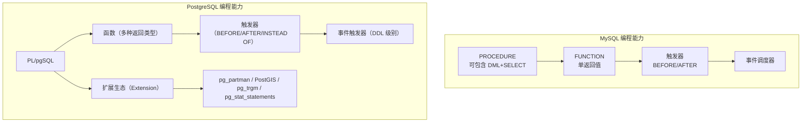

## 前置知识：PG 的函数远不止存储过程

MySQL 的存储过程主要用于业务逻辑封装。PostgreSQL 的函数体系更完整：可以做计算、可以作为索引条件、可以参与查询优化、可以返回表、可以多态重载、可以扩展数据库的核心能力。PG 的扩展生态（Extension）更是 MySQL 无法比拟的。



> [!important] 核心差异
> • **PG 区分 PROCEDURE 和 FUNCTION**：PROCEDURE 可以控制事务（COMMIT/ROLLBACK），FUNCTION 不能
> • **PG 的函数有多种返回类型**：标量、SETOF（多行）、TABLE（复合类型）、多态重载
> • **PG 的函数可以参与查询优化**：IMMUTABLE/STABLE/VOLATILE 分类影响优化器
> • **PG 有事件触发器**：可以在 DDL 级别做拦截和控制（MySQL 无此能力）
> • **PG 的扩展生态**：不修改核心代码，通过 CREATE EXTENSION 加载功能模块

---

## 一、PROCEDURE vs FUNCTION

### 1.1 概念边界对比

| 维度 | MySQL | PostgreSQL |
|------|-------|-----------|
| PROCEDURE | 可执行 DML+SELECT，不返回值 | PG 11+ 引入，**可控制事务** |
| FUNCTION | 必须有 RETURN 值 | 可返回单值、表、集合、多态 |
| 事务控制 | PROCEDURE 可用事务 | 只有 PROCEDURE 可 COMMIT/ROLLBACK |
| 调用方式 | `CALL proc()` / `SELECT func()` | PROCEDURE: `CALL proc()` / FUNCTION: `SELECT func()` |
| 在 SQL 中使用 | FUNCTION 可在 SELECT 中 | FUNCTION 可在 SELECT 中 |
| 返回结果集 | PROCEDURE 可 SELECT | FUNCTION 可 RETURNS TABLE |
| 过程语言 | 仅 MySQL 语法 | PL/pgSQL / PL/Python / PL/V8 等 |
| 异常处理 | `DECLARE HANDLER` | `EXCEPTION WHEN ... THEN` |

### 1.2 创建函数对比

```sql
-- ============================================
-- MySQL 存储函数
-- ============================================
-- DELIMITER $$
-- CREATE FUNCTION get_user_count(p_status VARCHAR(20))
-- RETURNS INT
-- DETERMINISTIC
-- BEGIN
--     DECLARE cnt INT;
--     SELECT COUNT(*) INTO cnt FROM users WHERE status = p_status;
--     RETURN cnt;
-- END$$
-- DELIMITER ;

-- ============================================
-- PostgreSQL 函数（PL/pgSQL）
-- ============================================
CREATE OR REPLACE FUNCTION get_user_count(p_status VARCHAR)
RETURNS INTEGER
LANGUAGE plpgsql
AS $$
DECLARE
    cnt INTEGER;
BEGIN
    SELECT COUNT(*) INTO cnt FROM users WHERE status = p_status;
    RETURN cnt;
END;
$$;

-- 调用
SELECT get_user_count('active');

-- 或者使用更简单的 SQL 函数（仅单条 SQL，PG 独有）
CREATE OR REPLACE FUNCTION get_user_count_sql(p_status VARCHAR)
RETURNS INTEGER
LANGUAGE sql
AS $$
    SELECT COUNT(*) FROM users WHERE status = $1;
$$;
```

### 1.3 创建存储过程对比

```sql
-- ============================================
-- MySQL 存储过程
-- ============================================
-- CREATE PROCEDURE transfer_funds(IN from_id INT, IN to_id INT, IN amount DECIMAL(10,2))
-- BEGIN
--     UPDATE accounts SET balance = balance - amount WHERE id = from_id;
--     UPDATE accounts SET balance = balance + amount WHERE id = to_id;
-- END;

-- ============================================
-- PostgreSQL 存储过程（PG 11+）
-- ============================================
CREATE OR REPLACE PROCEDURE transfer_funds(from_id INT, to_id INT, amount NUMERIC(10,2))
LANGUAGE plpgsql
AS $$
BEGIN
    UPDATE accounts SET balance = balance - amount WHERE id = from_id;
    UPDATE accounts SET balance = balance + amount WHERE id = to_id;
END;
$$;

-- 调用
CALL transfer_funds(1, 2, 100.00);

-- PG 独有：PROCEDURE 内控制事务
CREATE OR REPLACE PROCEDURE transfer_with_rollback(
    from_id INT, to_id INT, amount NUMERIC(10,2)
)
LANGUAGE plpgsql
AS $$
DECLARE
    v_balance NUMERIC;
BEGIN
    SELECT balance INTO v_balance FROM accounts WHERE id = from_id FOR UPDATE;

    IF v_balance < amount THEN
        ROLLBACK;  -- PG PROCEDURE 独有：FUNCTION 中不能用
        RAISE EXCEPTION 'Insufficient balance';
    END IF;

    UPDATE accounts SET balance = balance - amount WHERE id = from_id;
    UPDATE accounts SET balance = balance + amount WHERE id = to_id;
END;
$$;
```

> [!tip] MySQL FUNCTION 不能包含事务控制
> MySQL 的 FUNCTION 内不能执行 COMMIT/ROLLBACK。PG 的 FUNCTION 也不行，但 PG 的 PROCEDURE 可以。这是 PG 11+ 的重要改进。

### 1.4 函数分类（Volatility）

```sql
-- IMMUTABLE：相同参数永远返回相同结果（最安全，优化器可缓存）
CREATE OR REPLACE FUNCTION add_immutable(a INTEGER, b INTEGER)
RETURNS INTEGER AS $$
BEGIN RETURN a + b; END;
$$ LANGUAGE plpgsql IMMUTABLE;

-- STABLE：同一事务内相同参数返回相同结果
CREATE OR REPLACE FUNCTION today_stable()
RETURNS DATE AS $$
BEGIN RETURN CURRENT_DATE; END;
$$ LANGUAGE plpgsql STABLE;

-- VOLATILE：每次调用都可能不同（默认）
CREATE OR REPLACE FUNCTION random_between(low INTEGER, high INTEGER)
RETURNS INTEGER AS $$
BEGIN RETURN low + FLOOR(RANDOM() * (high - low + 1))::INTEGER; END;
$$ LANGUAGE plpgsql VOLATILE;
```

> [!warning] 不要把包含 NOW() 的函数标记为 IMMUTABLE
> 这会导致优化器错误缓存结果，在不同事务中返回过期值。包含 NOW()、RANDOM() 的函数应标记为 STABLE 或 VOLATILE。

---

## 二、函数返回类型

### 2.1 标量与多行返回

```sql
-- 标量返回
CREATE OR REPLACE FUNCTION get_order_total(p_user_id INTEGER)
RETURNS NUMERIC(10, 2) AS $$
DECLARE total NUMERIC(10, 2);
BEGIN
    SELECT COALESCE(SUM(amount), 0) INTO total
    FROM orders WHERE user_id = p_user_id;
    RETURN total;
END;
$$ LANGUAGE plpgsql;

-- SETOF 返回多行（返回现有表的行类型）
CREATE OR REPLACE FUNCTION get_user_orders(p_user_id INTEGER)
RETURNS SETOF orders AS $$
BEGIN
    RETURN QUERY SELECT * FROM orders WHERE user_id = p_user_id;
END;
$$ LANGUAGE plpgsql;

SELECT * FROM get_user_orders(1);
```

### 2.2 TABLE 返回（复合类型）

```sql
-- 返回 TABLE 类型（自定义列结构）
CREATE OR REPLACE FUNCTION get_order_summary(p_user_id INTEGER)
RETURNS TABLE (
    order_id INTEGER,
    amount NUMERIC(10, 2),
    status VARCHAR(20),
    order_date TIMESTAMPTZ
) AS $$
BEGIN
    RETURN QUERY
    SELECT o.id, o.amount, o.status, o.created_at
    FROM orders o WHERE o.user_id = p_user_id
    ORDER BY o.created_at DESC;
END;
$$ LANGUAGE plpgsql;

-- 像表一样使用，支持 WHERE 过滤
SELECT * FROM get_order_summary(1) WHERE amount > 100;
```

### 2.3 多态函数（PG 独有）

```sql
-- 同名函数不同参数类型（MySQL 不支持多态）
CREATE OR REPLACE FUNCTION process_data(input TEXT)
RETURNS TEXT AS $$
BEGIN RETURN 'text: ' || input; END;
$$ LANGUAGE plpgsql;

CREATE OR REPLACE FUNCTION process_data(input INT)
RETURNS TEXT AS $$
BEGIN RETURN 'number: ' || input::TEXT; END;
$$ LANGUAGE plpgsql;

SELECT process_data('hello');  -- 'text: hello'
SELECT process_data(42);       -- 'number: 42'
```

---

## 三、PL/pgSQL 控制结构

### 3.1 条件与循环

```sql
CREATE OR REPLACE FUNCTION calculate_user_score(p_user_id INT)
RETURNS NUMERIC AS $$
DECLARE
    v_score NUMERIC := 0;
    v_order_count INT;
    v_total_amount NUMERIC;
BEGIN
    SELECT COUNT(*), COALESCE(SUM(amount), 0)
    INTO v_order_count, v_total_amount
    FROM orders WHERE user_id = p_user_id;

    -- IF / ELSIF / ELSE
    IF v_order_count = 0 THEN
        RETURN 0;
    ELSIF v_order_count < 5 THEN
        v_score := v_order_count * 10;
    ELSE
        v_score := v_order_count * 10 + (v_total_amount / 100);
    END IF;

    -- FOR 循环（PG 独有：简洁的整数遍历）
    FOR i IN 1..5 LOOP
        v_score := v_score + i;
    END LOOP;

    -- 遍历查询结果（PG 独有：FOR IN SELECT）
    FOR rec IN SELECT id, name FROM users WHERE is_active = true LOOP
        RAISE NOTICE 'Active user: % (%)', rec.name, rec.id;
    END LOOP;

    RETURN v_score;
END;
$$ LANGUAGE plpgsql;
```

### 3.2 异常处理

```sql
-- PG 有结构化的 EXCEPTION 子句（类似 try-catch）
-- MySQL 用 DECLARE CONTINUE HANDLER
CREATE OR REPLACE FUNCTION safe_divide(a NUMERIC, b NUMERIC)
RETURNS NUMERIC
LANGUAGE plpgsql
AS $$
BEGIN
    RETURN a / b;
EXCEPTION
    WHEN division_by_zero THEN
        RAISE NOTICE 'Division by zero caught, returning NULL';
        RETURN NULL;
    WHEN OTHERS THEN
        RAISE NOTICE 'Unexpected error: %', SQLERRM;
        RETURN NULL;
END;
$$;

SELECT safe_divide(10, 0);  -- NULL
SELECT safe_divide(10, 2);  -- 5
```

### 3.3 动态 SQL

```sql
-- PG 独有：EXECUTE 执行动态 SQL，用 format() 防注入
CREATE OR REPLACE FUNCTION count_by_status(p_table TEXT, p_status TEXT)
RETURNS BIGINT
LANGUAGE plpgsql
AS $$
DECLARE
    cnt BIGINT;
BEGIN
    -- %I 转义标识符，$1 传参数（USING），防止 SQL 注入
    EXECUTE format('SELECT COUNT(*) FROM %I WHERE status = $1', p_table)
    INTO cnt
    USING p_status;
    RETURN cnt;
END;
$$;

SELECT count_by_status('orders', 'paid');
```

> [!warning] 动态 SQL 的 SQL 注入风险
> 直接拼接字符串执行 `EXECUTE 'SELECT ... WHERE col = ' || val` 有 SQL 注入风险。
> **解决方案**：用 `format(%I)` 引用标识符，`USING` 传参数。

---

## 四、触发器

### 4.1 触发器架构对比

| 维度 | MySQL | PostgreSQL |
|------|-------|-----------|
| 触发时机 | BEFORE / AFTER | BEFORE / AFTER / **INSTEAD OF** |
| 触发事件 | INSERT / UPDATE / DELETE | INSERT / UPDATE / DELETE / **TRUNCATE** |
| 行级 / 语句级 | 都支持 | 都支持 |
| 触发器定义 | 逻辑内嵌 | **触发器函数独立定义**，再绑定到表 |
| NEW / OLD | 可用 | 可用 |
| 条件触发 | 不支持 | 支持 `WHEN (条件)` |
| 事件类型变量 | 无（每种 DML 需分别建触发器） | `TG_OP`（字符串） |
| 表名变量 | 无 | `TG_TABLE_NAME` |
| 触发器复用 | 不能 | **函数可被多个表复用** |

### 4.2 自动更新时间戳（替代 MySQL 的 ON UPDATE）

```sql
-- MySQL: updated_at DATETIME DEFAULT CURRENT_TIMESTAMP ON UPDATE CURRENT_TIMESTAMP
-- PG: 必须用触发器实现

CREATE TABLE products_trigger (
    id SERIAL PRIMARY KEY,
    name VARCHAR(100),
    price NUMERIC(10, 2),
    created_at TIMESTAMPTZ DEFAULT NOW(),
    updated_at TIMESTAMPTZ DEFAULT NOW()
);

-- 步骤 1：创建通用触发器函数（可被多表复用）
CREATE OR REPLACE FUNCTION update_updated_at()
RETURNS TRIGGER
LANGUAGE plpgsql
AS $$
BEGIN
    NEW.updated_at = NOW();
    RETURN NEW;  -- BEFORE 触发器必须返回 NEW
END;
$$;

-- 步骤 2：绑定触发器到表
CREATE TRIGGER trigger_products_updated_at
    BEFORE UPDATE ON products_trigger
    FOR EACH ROW
    EXECUTE FUNCTION update_updated_at();

-- 复用到其他表
CREATE TRIGGER trigger_users_updated_at
    BEFORE UPDATE ON users
    FOR EACH ROW
    EXECUTE FUNCTION update_updated_at();  -- 复用同一函数
```

### 4.3 审计触发器

```sql
-- 审计表
CREATE TABLE audit_log (
    id BIGSERIAL PRIMARY KEY,
    table_name VARCHAR(50),
    operation VARCHAR(10),
    old_data JSONB,
    new_data JSONB,
    changed_by VARCHAR(50) DEFAULT current_user,
    changed_at TIMESTAMPTZ DEFAULT NOW()
);

-- 审计触发器函数
CREATE OR REPLACE FUNCTION audit_trigger_func()
RETURNS TRIGGER
LANGUAGE plpgsql
AS $$
BEGIN
    IF TG_OP = 'INSERT' THEN
        INSERT INTO audit_log (table_name, operation, new_data)
        VALUES (TG_TABLE_NAME, 'INSERT', to_jsonb(NEW));
        RETURN NEW;
    ELSIF TG_OP = 'UPDATE' THEN
        INSERT INTO audit_log (table_name, operation, old_data, new_data)
        VALUES (TG_TABLE_NAME, 'UPDATE', to_jsonb(OLD), to_jsonb(NEW));
        RETURN NEW;
    ELSIF TG_OP = 'DELETE' THEN
        INSERT INTO audit_log (table_name, operation, old_data)
        VALUES (TG_TABLE_NAME, 'DELETE', to_jsonb(OLD));
        RETURN OLD;
    END IF;
    RETURN NULL;
END;
$$;

CREATE TRIGGER trigger_audit_users
    AFTER INSERT OR UPDATE OR DELETE ON users
    FOR EACH ROW EXECUTE FUNCTION audit_trigger_func();
```

### 4.4 条件触发器与事件触发器

```sql
-- 条件触发器：只在特定条件下触发（PG 独有）
CREATE TRIGGER trigger_expensive_products
    BEFORE UPDATE ON products_trigger
    FOR EACH ROW
    WHEN (NEW.price > 1000)  -- 只对价格 > 1000 的记录触发
    EXECUTE FUNCTION update_updated_at();

-- 事件触发器：在 DDL 操作时触发（PG 独有）
CREATE OR REPLACE FUNCTION prevent_drop_table()
RETURNS EVENT_TRIGGER AS $$
BEGIN
    RAISE EXCEPTION 'DROP TABLE is not allowed!';
END;
$$ LANGUAGE plpgsql;

CREATE EVENT TRIGGER trigger_prevent_drop
    ON sql_drop
    WHEN TAG IN ('DROP TABLE')
    EXECUTE FUNCTION prevent_drop_table();

-- 测试（会失败）
-- DROP TABLE products_trigger;
-- ERROR: DROP TABLE is not allowed!
```

---

## 五、扩展生态（PG 独有核心能力）

### 5.1 常用扩展对照表

| 扩展 | 功能 | MySQL 等价物 |
|------|------|-------------|
| `pg_stat_statements` | SQL 统计与性能分析 | `performance_schema` / 慢查询日志 |
| `pg_partman` | 自动分区管理 | 需手动 ALTER TABLE |
| `PostGIS` | 地理空间数据 | MySQL Spatial（功能弱） |
| `pg_cron` | 定时任务 | Event Scheduler |
| `pg_repack` | 在线表重组（不锁表） | `OPTIMIZE TABLE`（锁表） |
| `uuid-ossp` / `pgcrypto` | UUID 生成 | `UUID()` 函数 |
| `pg_trgm` | 三字母组相似度（模糊搜索） | 无原生对标 |
| `citext` | 大小写不敏感文本 | 默认排序规则 |
| `postgres_fdw` | 跨库/跨实例查询 | Federated 引擎 |
| `hstore` | 键值对存储 | JSONB 可替代 |
| `Citus` | 分布式分片 | 无原生支持 |
| `TimescaleDB` | 时序数据库 | 无 |

### 5.2 扩展安装与使用

```sql
-- 查看已安装的扩展
SELECT * FROM pg_extension;
-- 或 \dx

-- 安装扩展
CREATE EXTENSION IF NOT EXISTS pg_stat_statements;
CREATE EXTENSION IF NOT EXISTS pg_trgm;
CREATE EXTENSION IF NOT EXISTS citext;

-- citext：大小写不敏感的文本类型
CREATE TABLE users_citext (
    id SERIAL PRIMARY KEY,
    email CITEXT UNIQUE  -- 自动不区分大小写
);
INSERT INTO users_citext (email) VALUES ('Alice@Test.com');
SELECT * FROM users_citext WHERE email = 'alice@test.com';  -- 能匹配

-- pg_trgm：模糊搜索
CREATE INDEX idx_products_name_trgm ON products USING GIN (name gin_trgm_ops);
SELECT name, similarity(name, 'iphone') AS sim
FROM products
WHERE name % 'iphone'  -- % 操作符表示相似度匹配
ORDER BY sim DESC;
```

### 5.3 pg_stat_statements 性能分析

```sql
-- 启用（需在 postgresql.conf 中 shared_preload_libraries 添加后重启）
CREATE EXTENSION IF NOT EXISTS pg_stat_statements;

-- Top 10 最耗时查询
SELECT query, calls,
       ROUND(total_exec_time::numeric, 2) AS total_ms,
       ROUND(mean_exec_time::numeric, 2) AS avg_ms,
       rows
FROM pg_stat_statements
ORDER BY total_exec_time DESC LIMIT 10;

-- 重置统计
SELECT pg_stat_statements_reset();
```

---

## 六、分区表（PG 原生支持）

```sql
-- ============================================
-- PostgreSQL 原生分区（PG 10+）
-- MySQL 8.0+ 也支持分区，但 PG 的分区更灵活
-- ============================================

-- 按范围分区（按月分区订单表）
CREATE TABLE orders_partitioned (
    id SERIAL,
    user_id INT NOT NULL,
    amount NUMERIC(10, 2),
    created_at TIMESTAMPTZ NOT NULL,
    PRIMARY KEY (id, created_at)  -- 主键必须包含分区键
) PARTITION BY RANGE (created_at);

-- 创建分区
CREATE TABLE orders_2026_01 PARTITION OF orders_partitioned
    FOR VALUES FROM ('2026-01-01') TO ('2026-02-01');
CREATE TABLE orders_2026_02 PARTITION OF orders_partitioned
    FOR VALUES FROM ('2026-02-01') TO ('2026-03-01');

-- 插入数据（自动路由到正确分区）
INSERT INTO orders_partitioned (user_id, amount, created_at)
VALUES (1, 100.00, '2026-01-15');

-- 查询时自动分区裁剪（只扫描相关分区）
EXPLAIN (ANALYZE)
SELECT * FROM orders_partitioned
WHERE created_at >= '2026-01-01' AND created_at < '2026-02-01';
-- 预期：只扫描 orders_2026_01

-- 按列表分区（按地区）
CREATE TABLE users_partitioned (
    id SERIAL,
    name VARCHAR(50),
    region VARCHAR(20)
) PARTITION BY LIST (region);

CREATE TABLE users_asia PARTITION OF users_partitioned
    FOR VALUES IN ('China', 'Japan', 'Korea');
```

> [!tip] pg_partman 自动管理分区
> 用 `pg_partman` 扩展可以自动创建新分区、删除旧分区，省去手动维护的麻烦。

---

## 七、实践练习（附注释）

### 练习 1：函数迁移 🟢 基础

```sql
-- 目标：将 MySQL 存储过程迁移为 PG 函数
-- 原 MySQL：
-- CREATE PROCEDURE get_user_orders(IN p_user_id INT)
-- BEGIN
--     SELECT * FROM orders WHERE user_id = p_user_id;
-- END;

-- PG 迁移版本（用 RETURNS TABLE 替代 PROCEDURE + SELECT）
CREATE OR REPLACE FUNCTION get_user_orders(p_user_id INTEGER)
RETURNS TABLE (
    order_id INTEGER,
    amount NUMERIC(10, 2),
    status VARCHAR(20),
    order_date TIMESTAMPTZ
) AS $$
BEGIN
    RETURN QUERY
    SELECT o.id, o.amount, o.status, o.created_at
    FROM orders o WHERE o.user_id = p_user_id
    ORDER BY o.created_at DESC;
END;
$$ LANGUAGE plpgsql;

-- 调用
SELECT * FROM get_user_orders(1);
```

**验收标准**：能将 MySQL PROCEDURE 迁移为 PG RETURNS TABLE 函数。

### 练习 2：触发器自动时间戳 🟢 基础

```sql
-- 目标：实现 MySQL 的 ON UPDATE CURRENT_TIMESTAMP
CREATE TABLE products_trg (
    id SERIAL PRIMARY KEY,
    name VARCHAR(100),
    price NUMERIC(10, 2),
    created_at TIMESTAMPTZ DEFAULT NOW(),
    updated_at TIMESTAMPTZ DEFAULT NOW()
);

-- 通用触发器函数（可复用）
CREATE OR REPLACE FUNCTION set_updated_at()
RETURNS TRIGGER
LANGUAGE plpgsql
AS $$
BEGIN
    NEW.updated_at = NOW();
    RETURN NEW;
END;
$$;

CREATE TRIGGER trigger_products_updated
    BEFORE UPDATE ON products_trg
    FOR EACH ROW
    EXECUTE FUNCTION set_updated_at();

-- 验证
INSERT INTO products_trg (name, price) VALUES ('iPhone', 7999);
SELECT pg_sleep(1);
UPDATE products_trg SET price = 6999 WHERE id = 1;
SELECT id, name, updated_at FROM products_trg;  -- updated_at 应已更新
```

**验收标准**：能用触发器实现自动更新时间戳，理解 PG 与 MySQL 的差异。

### 练习 3：审计触发器 🟡 进阶

```sql
-- 目标：创建通用审计触发器，记录所有行变更
CREATE TABLE audit_log (
    id BIGSERIAL PRIMARY KEY,
    table_name TEXT,
    operation TEXT,
    old_data JSONB,
    new_data JSONB,
    executed_by TEXT DEFAULT current_user,
    changed_at TIMESTAMPTZ DEFAULT NOW()
);

CREATE OR REPLACE FUNCTION audit_trigger()
RETURNS TRIGGER
LANGUAGE plpgsql
AS $$
BEGIN
    IF TG_OP = 'INSERT' THEN
        INSERT INTO audit_log (table_name, operation, new_data)
        VALUES (TG_TABLE_NAME, 'INSERT', to_jsonb(NEW));
        RETURN NEW;
    ELSIF TG_OP = 'UPDATE' THEN
        INSERT INTO audit_log (table_name, operation, old_data, new_data)
        VALUES (TG_TABLE_NAME, 'UPDATE', to_jsonb(OLD), to_jsonb(NEW));
        RETURN NEW;
    ELSIF TG_OP = 'DELETE' THEN
        INSERT INTO audit_log (table_name, operation, old_data)
        VALUES (TG_TABLE_NAME, 'DELETE', to_jsonb(OLD));
        RETURN OLD;
    END IF;
    RETURN NULL;
END;
$$;

CREATE TRIGGER trg_users_audit
    AFTER INSERT OR UPDATE OR DELETE ON users
    FOR EACH ROW EXECUTE FUNCTION audit_trigger();

-- 测试
INSERT INTO users (name, email) VALUES ('audit_test', 'audit@test.com');
UPDATE users SET name = 'audit_updated' WHERE name = 'audit_test';
SELECT * FROM audit_log WHERE table_name = 'users' ORDER BY id;
```

**可量化验收标准**：
- **完成标准**：① 触发器函数正确处理 `TG_OP` 的 INSERT/UPDATE/DELETE ② 对 users 表执行 I/U/D 各一次 ③ audit_log 中出现 3 条记录（op: I/U/D）
- **预期输出**：`SELECT count(*) FROM audit_log WHERE table_name='users'` 返回 3；UPDATE 记录同时含 `old_data` 和 `new_data`，INSERT 只有 `new_data`，DELETE 只有 `old_data`
- **自测方法**：`SELECT operation, old_data IS NOT NULL, new_data IS NOT NULL FROM audit_log WHERE table_name='users' ORDER BY id` 三行分别为 I/NULL/t、U/t/t、D/t/NULL
- **常见错误**：`TG_OP` 字符串为大写 `'INSERT'` 不是 `'insert'`；DELETE 分支应返回 `OLD` 而非 `NEW`

### 练习 4：异常处理与事务控制 🟡 进阶

```sql
-- 目标：用 EXCEPTION 块实现健壮的转账函数
CREATE OR REPLACE FUNCTION safe_transfer(
    p_from INT, p_to INT, p_amount NUMERIC
) RETURNS TEXT AS $$
DECLARE
    v_balance NUMERIC;
BEGIN
    SELECT balance INTO v_balance FROM accounts WHERE id = p_from FOR UPDATE;

    IF v_balance IS NULL THEN
        RETURN 'Source account not found';
    END IF;

    IF v_balance < p_amount THEN
        RETURN 'Insufficient balance';
    END IF;

    UPDATE accounts SET balance = balance - p_amount WHERE id = p_from;
    UPDATE accounts SET balance = balance + p_amount WHERE id = p_to;

    RETURN 'Transfer successful';

EXCEPTION
    WHEN foreign_key_violation THEN
        RETURN 'Account not found';
    WHEN others THEN
        RETURN 'Error: ' || SQLERRM;
END;
$$ LANGUAGE plpgsql;
```

**可量化验收标准**：
- **完成标准**：① 函数含 `EXCEPTION WHEN foreign_key_violation` 和 `WHEN others` ② 余额不足时返回提示不报错 ③ 正常转账后两账户余额正确变化
- **预期输出**：`SELECT safe_transfer(1, 2, 100)` 返回 `'Transfer successful'`；余额不足返回 `'Insufficient balance'`；账户不存在返回 `'Account not found'`
- **自测方法**：`SELECT balance FROM accounts WHERE id IN (1,2)` 前后对比，差值为 100
- **常见错误**：EXCEPTION 块会回滚整个子事务（包括函数内 BEGIN...END），不是只回滚报错语句；`SQLERRM` 只在 EXCEPTION 块内有效

### 练习 5：扩展安装与 pg_trgm 模糊搜索 🔴 挑战

```sql
-- 目标：安装 pg_trgm 扩展并实现高效的模糊搜索
CREATE EXTENSION IF NOT EXISTS pg_trgm;

-- 测试相似度函数
SELECT similarity('PostgreSQL', 'Postgres');  -- 返回相似度值

-- 创建 GIN 索引
CREATE INDEX idx_products_name_trgm ON products USING GIN (name gin_trgm_ops);

-- 相似度搜索（走索引）
SELECT name, similarity(name, 'iphone') AS sim
FROM products
WHERE name % 'iphone'
ORDER BY sim DESC;

-- 对比 EXPLAIN
EXPLAIN (ANALYZE)
SELECT * FROM products WHERE name ILIKE '%iphone%';  -- 走 GIN 索引
```

**可量化验收标准**：
- **完成标准**：① `CREATE EXTENSION pg_trgm` 成功 ② 创建 `USING GIN (name gin_trgm_ops)` 索引 ③ `ILIKE '%iphone%'` 走 GIN 索引 ④ `similarity()` 返回 0-1 浮点数
- **预期输出**：`SELECT similarity('PostgreSQL','Postgres')` 返回 >0.3；`EXPLAIN SELECT * FROM products WHERE name ILIKE '%iphone%'` 显示 `Bitmap Index Scan on idx_products_name_trgm`
- **自测方法**：建索引前后各 EXPLAIN 一次，对比 `Seq Scan` → `Bitmap Index Scan` 变化
- **常见错误**：忘记 `CREATE EXTENSION pg_trgm` 直接建索引报错；`gin_trgm_ops` 操作符类必须指定；`%` 是相似度操作符不是 LIKE

### 练习 6：分区表实战 🔴 挑战

```sql
-- 目标：创建按月分区的订单表并验证分区裁剪
CREATE TABLE orders_part (
    id SERIAL,
    user_id INT NOT NULL,
    amount NUMERIC(10, 2),
    status VARCHAR(20),
    created_at TIMESTAMPTZ NOT NULL,
    PRIMARY KEY (id, created_at)
) PARTITION BY RANGE (created_at);

CREATE TABLE orders_part_2026_01 PARTITION OF orders_part
    FOR VALUES FROM ('2026-01-01') TO ('2026-02-01');
CREATE TABLE orders_part_2026_02 PARTITION OF orders_part
    FOR VALUES FROM ('2026-02-01') TO ('2026-03-01');

-- 插入数据（自动路由）
INSERT INTO orders_part (user_id, amount, status, created_at)
VALUES (1, 100, 'paid', '2026-01-15'),
       (2, 200, 'pending', '2026-02-20');

-- 验证分区裁剪
EXPLAIN (ANALYZE)
SELECT * FROM orders_part WHERE created_at >= '2026-01-01' AND created_at < '2026-02-01';
-- 预期：只扫描 orders_part_2026_01
```

**可量化验收标准**：
- **完成标准**：① 创建按月 RANGE 分区表含 2+ 子分区 ② INSERT 数据自动路由 ③ EXPLAIN 显示分区裁剪（只扫 1 个子表）
- **预期输出**：`EXPLAIN SELECT * FROM orders_part WHERE created_at >= '2026-01-01' AND created_at < '2026-02-01'` 显示 `Seq Scan on orders_part_2026_01`（只扫 1 个分区）
- **自测方法**：`SELECT tableoid::regclass, count(*) FROM orders_part GROUP BY tableoid` 显示行分布在 2 个分区表中
- **常见错误**：分区键必须包含在主键中，否则报错 `unique constraint on partitioned table must include all partitioning columns`；跨分区查询不裁剪会扫描所有子表

---

## 八、常见易错点

> [!warning] **易错 1：混淆 FUNCTION 和 PROCEDURE**
> MySQL 的 PROCEDURE 可以返回结果集，PG 的 PROCEDURE 不能返回值。迁移时绝大多数场景用 FUNCTION。
> **解决方案**：需要返回值时用 `RETURNS TABLE` 或 `RETURNS SETOF` 的 FUNCTION。

> [!warning] **易错 2：触发器函数忘记 RETURN NEW**
> BEFORE 触发器不返回 NEW 会导致操作被取消。
> **解决方案**：BEFORE 触发器必须 `RETURN NEW`，AFTER 触发器返回 NULL。

> [!warning] **易错 3：动态 SQL 不处理 SQL 注入**
> 直接拼接字符串执行 `EXECUTE` 有 SQL 注入风险。
> **解决方案**：用 `format(%I)` 引用标识符，`USING` 传参数。

> [!warning] **易错 4：函数内使用事务控制**
> FUNCTION 中不能使用 COMMIT/ROLLBACK，只有 PROCEDURE 可以。
> **解决方案**：需要事务控制时使用 PROCEDURE。

> [!warning] **易错 5：函数 volatility 分类错误**
> 把包含 `NOW()` 的函数标记为 IMMUTABLE，导致优化器错误缓存结果。
> **解决方案**：包含 `NOW()`、`RANDOM()` 等函数时标记为 STABLE 或 VOLATILE。

> [!warning] **易错 6：SELECT INTO 没找到行时变量为 NULL**
> PG 的 `SELECT INTO` 没找到行时不报错，变量值为 NULL。MySQL 会触发 NOT FOUND handler。
> **解决方案**：用 `IF NOT FOUND THEN ...` 检查是否查到了行。

> [!warning] **易错 7：变量名与列名冲突**
> PL/pgSQL 中变量名与列名同名时，会优先使用变量名，导致 `column reference is ambiguous` 错误。
> **解决方案**：变量名加前缀 `v_` 或 `p_`，如 `v_count`、`p_user_id`。

---

## 🎯 本文学完自检

| 层次 | 检查项 |
|------|--------|
| 🟢 基础 | 能将 MySQL 存储过程/函数迁移到 PL/pgSQL，理解语法差异 |
| 🟡 进阶 | 能创建触发器、审计日志、动态 SQL，使用 RETURNS TABLE 返回结果集 |
| 🔴 挑战 | 能设计生产级函数架构（事务控制 + 审计触发器 + 扩展生态 + 分区表） |

---

## ⚡ 30 秒速记卡片

| # | 正面（问题） | 背面（答案） |
|---|-------------|-------------|
| F1 | PG 函数 vs 存储过程？ | 函数 RETURNS TABLE 可在 SELECT 中用；PROCEDURE 用 CALL 调用 |
| F2 | MySQL PROCEDURE → ？ | PL/pgSQL 函数（RETURNS TABLE / RETURNS SETOF） |
| F3 | PG 11+ 支持什么？ | PROCEDURE + CALL（支持事务控制 COMMIT/ROLLBACK） |
| F4 | 触发器函数必须返回？ | BEFORE: RETURN NEW/OLD/NULL；AFTER: 可 RETURN NULL |
| F5 | TG_OP 值是什么？ | 大写字符串：'INSERT' / 'UPDATE' / 'DELETE' |
| F6 | 多态函数是什么？ | 同名函数不同参数类型，PG 自动选择。MySQL 无此功能 |
| F7 | 动态 SQL 怎么写？ | EXECUTE format('SELECT * FROM %I', table_name)（%I 防注入） |
| F8 | EXCEPTION 块作用？ | 捕获异常并回滚子事务。SQLERRM 只在 EXCEPTION 块内有效 |
| F9 | 函数稳定性标记？ | IMMUTABLE / STABLE / VOLATILE（默认，影响优化器缓存） |
| F10 | 分区裁剪怎么验证？ | EXPLAIN ANALYZE 看是否只扫描相关分区 |

---

## ⚠️ 常见陷阱速查

> [!warning] 迁移时最容易踩的坑
> 1. **TG_OP 字符串大小写** → PG 用大写 'INSERT'/'UPDATE'/'DELETE'，`IF TG_OP = 'insert'` 永远不匹配
> 2. **DELETE 触发器忘记 RETURN OLD** → 删除操作被取消。DELETE 分支必须 RETURN OLD
> 3. **函数忘记 LANGUAGE plpgsql** → CREATE FUNCTION 没有默认语言，省略 LANGUAGE 直接报 `ERROR: no language specified`（只有 DO 语句默认 plpgsql）
> 4. **EXCEPTION 回滚整个子事务** → 不是只回滚报错语句，是整个 BEGIN...END 块
> 5. **动态 SQL 用字符串拼接** → 有 SQL 注入风险。用 format() + %I（标识符）或 %L（字面量）
> 6. **扩展未安装直接用** → pg_trgm/pgcrypto/uuid-ossp 需先 CREATE EXTENSION
> 7. **分区键不在主键中** → 报错 `must include all partitioning columns`

---

## 相关笔记

- ⬅️ 前置：[[05-事务与并发控制]]
- ➡️ 后续：[[07-双向对比-MySQL有PG无与PG有MySQL无]]
- 🔗 关联：[[02-数据类型与DDL对比]]（触发器实现 ON UPDATE TIMESTAMP）
- 🔗 关联：[[04-索引与查询优化]]（pg_stat_statements）

---
*最后更新：2026-07-24*