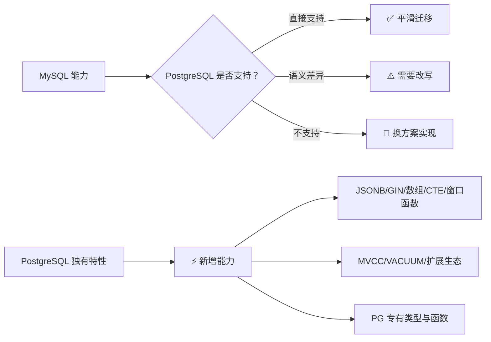
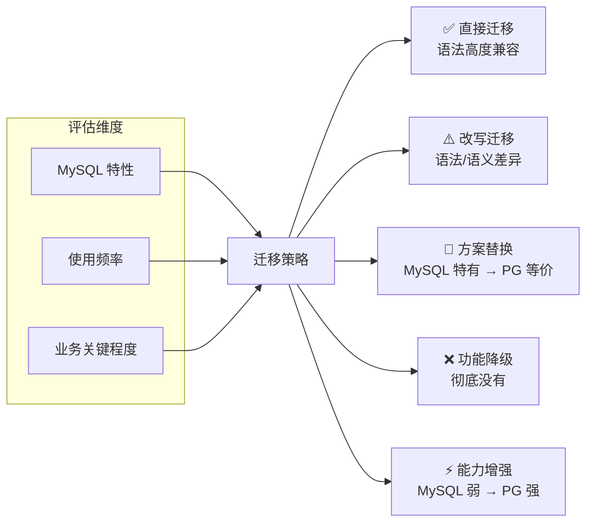
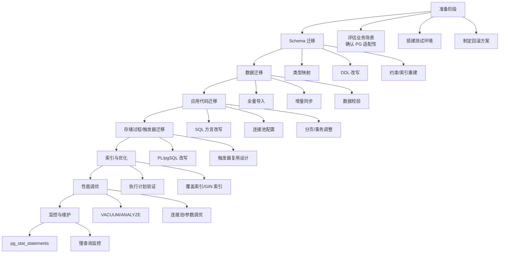

## 前置知识：为什么需要双向对比

迁移学习不能只学"PostgreSQL 有什么"，还要清楚"MySQL 有哪些东西带不过来"。双向对比能帮你建立完整的认知地图：哪些能力要重新学习、哪些能力可以直接迁移、哪些场景需要换一种实现思路。



---

## 一、MySQL 有，PostgreSQL 没有（迁移注意事项）

### 1.1 语法与类型差异

| MySQL 特性 | PostgreSQL 状态 | 替代方案 |
|-----------|---------------|---------|
| `AUTO_INCREMENT` | ❌ 没有 | 用 `SERIAL` 或 `GENERATED AS IDENTITY` |
| `INT(n)` 显示宽度 | ❌ 没有 | 直接写 `INT` 或 `INTEGER` |
| `INT UNSIGNED` | ❌ 没有 | 用 `INTEGER` + `CHECK (col >= 0)` |
| `ENUM` 内联定义 | ❌ 没有（需先 CREATE TYPE） | `CREATE TYPE ... AS ENUM` |
| `SET` 类型 | ❌ 没有 | 用 `TEXT[]` 数组或 JSONB |
| `DATETIME` 不带时区 | ⚠️ 有 TIMESTAMP，但推荐 TIMESTAMPTZ | 用 `TIMESTAMPTZ` |
| `ON UPDATE CURRENT_TIMESTAMP` | ❌ 没有 | 用触发器实现 |
| `LIMIT a,b` 逗号语法 | ❌ 不支持 | `LIMIT b OFFSET a` |
| `INSERT IGNORE` | ❌ 没有 | `INSERT ... ON CONFLICT DO NOTHING` |
| `ON DUPLICATE KEY UPDATE` | ❌ 没有 | `INSERT ... ON CONFLICT DO UPDATE` |
| 反引号 `` ` `` | ❌ 不使用 | 双引号 `"` 或不用 |
| `DUAL` 表 | ❌ 没有 | 直接 `SELECT 1;` 即可 |
| `FIND_IN_SET()` | ❌ 没有 | 用数组 `@>` 或 JSONB `?` |
| `GROUP_CONCAT()` | ✅ `STRING_AGG()` | 语义一致 |
| `IF()` 函数 | ❌ 没有 | `CASE WHEN` |
| `IFNULL()` | ✅ `COALESCE()` | 语义一致 |

### 1.2 架构与运维差异

| MySQL 特性 | PostgreSQL 状态 | 替代方案 |
|-----------|---------------|---------|
| 多线程模型 | ❌ PG 是多进程 | 用 PgBouncer 连接池 |
| 可插拔存储引擎（InnoDB/MyISAM） | ❌ 无多引擎 | 统一 heap，无引擎选择 |
| Query Cache | ❌ 没有 | 用应用层缓存（Redis） |
| `SHOW PROCESSLIST` | ❌ 没有 | `pg_stat_activity` 视图 |
| 慢查询日志 | ✅ 有（`log_min_duration_statement` 即内置慢查询日志） | 另可用 `pg_stat_statements` 做聚合统计 |
| `FLUSH PRIVILEGES` | ❌ 不需要 | 角色权限变更即时生效，用 `pg_reload_conf()` |
| `OPTIMIZE TABLE` | ❌ 没有 | `VACUUM` / `ANALYZE` / `pg_repack` |
| 事件调度器（Event Scheduler） | ✅ 可用 `pg_cron` 扩展 | 安装 `pg_cron` |
| `mysqldump` | ❌ 没有 | `pg_dump` / `pg_dumpall` |
| `EXPLAIN FORMAT=JSON` | ❌ 不同格式 | `EXPLAIN (FORMAT JSON)` |
| 自适应 Hash 索引 | ❌ 没有 | 显式 `USING HASH` 索引 |
| `FORCE INDEX` | ❌ 没有 | 用 `enable_seqscan = off` 调试（仅开发） |
| `INSERT DELAYED` | ❌ 没有 | 应用层队列 |

### 1.3 索引与优化差异

| MySQL 特性 | PostgreSQL 状态 | 替代方案 |
|-----------|---------------|---------|
| 聚簇索引（InnoDB） | ❌ 没有 | heap + INCLUDE 覆盖索引 |
| 索引下推（ICP） | ❌ 没有 | 优化器自动选择 |
| 全文索引（FULLTEXT） | ✅ 可用 GIN/GiST | 更灵活 |
| 覆盖索引（聚簇自然覆盖） | ✅ 需 `INCLUDE` 子句 | 显式声明 |

### 1.4 SQL 语义差异

| MySQL 行为 | PostgreSQL 行为 | 迁移注意 |
|-----------|-----------------|---------|
| 宽松 GROUP BY（非聚合列可 SELECT） | 严格 GROUP BY | 补全 GROUP BY 或用聚合函数 |
| 隐式类型转换 | 严格类型检查 | 显式转换 `::type` |
| `LIKE` 不区分大小写（取决于排序规则） | `LIKE` 区分大小写 | 用 `ILIKE` |
| 空字符串 = NULL（某些上下文） | 空字符串 ≠ NULL | 严格区分 NULL 和 '' |
| 双引号表示字符串 | 双引号表示标识符 | 字符串用单引号 |
| `||` 表示逻辑或 | `||` 表示字符串拼接 | 注意语义变化 |

---

## 二、PostgreSQL 有，MySQL 没有（新增能力）

### 2.1 数据类型

| PostgreSQL 特性 | MySQL 状态 | 典型应用 |
|---------------|----------|---------|
| `JSONB` 二进制 JSON | 有 `JSON` 文本类型但不可高效索引 | 复杂 JSON 索引、半结构化数据 |
| 原生数组 `INT[]` / `TEXT[]` | 无 | 标签、权限列表 |
| `TIMESTAMPTZ` 带时区时间 | TIMESTAMP 有时区但范围小（到 2038 年） | 跨时区应用 |
| `TSTZRANGE` / `INT4RANGE` 范围类型 | 无 | 时间段、版本区间 |
| 自定义复合类型 | 无 | 地址、坐标等结构化数据 |
| `CITEXT` 大小写不敏感文本 | 无 | 邮箱、用户名匹配 |
| `UUID` 独立类型 | 有 `UUID()` 函数但无独立类型 | 分布式 ID |
| `MONEY` | 无 | 货币（但不推荐，用 NUMERIC） |
| `ENUM` 需先创建类型 | 内联定义 | 类型复用更安全 |

### 2.2 索引能力

| PostgreSQL 特性 | MySQL 状态 | 典型应用 |
|---------------|----------|---------|
| GIN 索引 | 无原生对标 | JSONB/数组/全文搜索 |
| GiST 索引 | 弱（仅 SPATIAL） | 地理空间、相似度、范围查询 |
| BRIN 索引 | 无 | 时序/日志大表 |
| SP-GiST 索引 | 无 | 高维、前缀树搜索 |
| 部分索引（Partial Index） | 无 | 只索引热数据 |
| 表达式索引 | 有函数索引 | 更灵活，如 `LOWER(email)` |
| 覆盖索引（`INCLUDE`） | 有 | 减少回表 |
| 并发创建索引（`CONCURRENTLY`） | InnoDB 5.6+ Online DDL（INPLACE）建索引不阻塞 DML，但无 CONCURRENTLY 语法（仍是差异点） | 不停机建索引 |
| EXCLUDE 约束 | 无 | 时间范围不重叠 |

### 2.3 SQL 能力

| PostgreSQL 特性 | MySQL 状态 | 典型应用 |
|---------------|----------|---------|
| `RETURNING` 子句 | 无 | 插入/更新/删除后返回值 |
| CTE 递归（`WITH RECURSIVE`） | 8.0+ 部分支持 | 组织架构、树形结构 |
| 窗口函数完整帧选项 | 8.0+ 基本支持 | 排名、累计、偏移 |
| `FILTER` 子句 | 无 | 条件聚合 |
| `LATERAL JOIN` | 8.0.14+ 支持 LATERAL 派生表 | 关联子查询 |
| `DISTINCT ON` | 无 | 每组取第一行 |
| `GENERATE_SERIES` | 无 | 生成序列 |
| `GROUPING SETS/ROLLUP/CUBE` | 8.0+ 仅支持 `WITH ROLLUP`（及 `GROUPING()`），不支持 GROUPING SETS/CUBE | 多维聚合 |
| `SELECT ... FOR UPDATE SKIP LOCKED` | 8.0+ 支持 | 队列消费 |
| `VALUES` 语句作为表 | 基本支持 | 更标准 |

### 2.4 事务与并发

| PostgreSQL 特性 | MySQL 状态 | 典型应用 |
|---------------|----------|---------|
| DDL 事务支持 | 无（DDL 隐式提交） | 原子性 Schema 变更 |
| 咨询锁（Advisory Lock） | 无 | 分布式锁、应用协调 |
| Serializable Snapshot Isolation (SSI) | 无 | 无锁串行化 |
| Repeatable Read 防幻读 | 不防幻读 | 更强隔离保证 |
| `pg_stat_activity` 系统视图 | 有 `SHOW PROCESSLIST` | 会话与锁监控 |

### 2.5 扩展生态

| PostgreSQL 扩展 | MySQL 状态 | 典型应用 |
|----------------|----------|---------|
| `pg_stat_statements` | `performance_schema` / 慢日志 | SQL 统计分析 |
| `PostGIS` | MySQL Spatial（功能弱） | 地理空间数据库 |
| `pg_trgm` | 无 | 模糊搜索 |
| `pg_partman` | 手动分区 | 自动分区管理 |
| `pg_cron` | Event Scheduler | 定时任务 |
| `pg_repack` | `OPTIMIZE TABLE`（锁表） | 在线表重组 |
| `postgres_fdw` | Federated（复杂） | 跨库查询 |
| `TimescaleDB` | 无 | 时序数据库 |
| `Citus` | 无 | 分布式分片 |

---

## 三、迁移策略矩阵



### 3.1 迁移策略对照表

| 场景 | 策略 | 优先级 |
|------|------|--------|
| 基本表结构、主键、外键、索引 | ✅ 直接迁移 | P0 |
| `AUTO_INCREMENT` → `SERIAL`/`GENERATED AS IDENTITY` | ⚠️ 改写 | P0 |
| `DATETIME` → `TIMESTAMPTZ` | ⚠️ 改写 | P0 |
| `LIMIT a,b` → `LIMIT b OFFSET a` | ⚠️ 改写 | P0 |
| 隐式类型转换 → 显式转换 | ⚠️ 改写 | P0 |
| `ON DUPLICATE KEY UPDATE` → `ON CONFLICT DO UPDATE` | ⚠️ 改写 | P0 |
| `INSERT IGNORE` → `ON CONFLICT DO NOTHING` | ⚠️ 改写 | P0 |
| 宽松 GROUP BY → 严格 GROUP BY | ⚠️ 改写 | P0 |
| JSON → JSONB + GIN 索引 | ⚠️ 改写 + 增强 | P1 |
| 存储过程/函数 → PL/pgSQL | ⚠️ 改写 | P1 |
| 触发器 → PL/pgSQL 触发器 | ⚠️ 改写 | P1 |
| `ON UPDATE CURRENT_TIMESTAMP` → 触发器 | ⚠️ 改写 | P1 |
| 反引号 → 双引号或不加 | ⚠️ 改写 | P1 |
| 定时任务 → pg_cron | 🔀 方案替换 | P2 |
| 读写分离中间件 → PG 流复制 + 连接池 | 🔀 方案替换 | P2 |
| Query Cache → 应用层缓存（Redis） | ❌ 降级 | P2 |
| 跨库查询 → postgres_fdw | 🔀 方案替换 | P2 |
| 全文检索 → GIN/GiST + tsvector | ⚡ 增强 | P3 |
| 数组/范围类型替代关联表 | ⚡ 增强 | P3 |
| 分区表 → PG 原生分区 + pg_partman | ⚡ 增强 | P3 |
| 地理空间 → PostGIS | ⚡ 增强 | P3 |

### 3.2 迁移检查清单

- [ ] 表结构：类型映射、自增序列、主键/外键、约束
- [ ] 索引：B-tree 迁移、JSONB/数组是否需 GIN、是否需覆盖索引
- [ ] SQL 查询：LIMIT/OFFSET、GROUP BY、类型转换、子查询、JOIN
- [ ] 事务：隔离级别选择、长事务监控、死锁处理
- [ ] 函数与触发器：PL/pgSQL 改写、volatility 标记、异常处理
- [ ] 权限：角色继承、schema 权限、pg_hba.conf
- [ ] 运维：VACUUM 配置、备份策略（pg_dump/pg_basebackup）、监控
- [ ] 性能：pg_stat_statements、连接池（PgBouncer/Pgpool-II）

---

## 四、MySQL → PostgreSQL 快速迁移指南

### 4.1 迁移步骤



### 4.2 常见迁移陷阱

> [!warning] 陷阱 1：把 MySQL 的 database 当作 PG 的 database
> MySQL 的 database 更像 PG 的 schema。迁移后可能把多个 database 放到一个 PG instance 中，导致跨库查询失败。
> **解决方案**：合理规划 database/schema 层次，必要时用 `postgres_fdw`。

> [!warning] 陷阱 2：忽略 VACUUM
> 如果应用有大范围 UPDATE/DELETE，PG 的表会迅速膨胀。MySQL 由 purge 线程自动处理，开发者意识不到这个问题。
> **解决方案**：监控 autovacuum、表大小、死元组数量。

> [!warning] 陷阱 3：用错默认隔离级别
> PG 默认 Read Committed，MySQL 默认 Repeatable Read。迁移后需要重新评估隔离级别。
> **解决方案**：在连接字符串或会话中显式设置隔离级别。

> [!warning] 陷阱 4：认为所有 MySQL 语法都能直接跑
> PG 不支持 `LIMIT a,b`、`INSERT IGNORE`、`ON DUPLICATE KEY UPDATE` 等语法。
> **解决方案**：迁移前做语法扫描和替换。

> [!warning] 陷阱 5：忽略连接数限制
> PG 多进程模型连接开销大，MySQL 多线程模型可承载更多连接。
> **解决方案**：用 PgBouncer 等连接池，避免直接连接打满 max_connections。

---

## 五、实践练习（附注释）

### 练习 1：双向对比表输出 🟢 基础

```sql
-- 目标：列出你当前 MySQL 项目中 5 个最常用的特性，并为每个特性写出 PostgreSQL 的对应方案

-- 模板：
-- MySQL 特性：______
-- 使用频率：高/中/低
-- PostgreSQL 是否支持：是/否/部分
-- 替代方案：______
-- 迁移风险：______

-- 示例答案：
-- MySQL 特性：AUTO_INCREMENT
-- 使用频率：高
-- PostgreSQL 是否支持：否
-- 替代方案：GENERATED BY DEFAULT AS IDENTITY
-- 迁移风险：序列值与已有数据冲突，需初始化 currval
```

**验收标准**：能独立完成一份包含 5 个以上特性的双向对比表。

### 练习 2：迁移评估打分 🟡 进阶

```sql
-- 目标：对一个 MySQL 项目做迁移复杂度评估
-- 维度权重建议：
-- 表结构复杂度 20%
-- 存储过程/函数数量 25%
-- 触发器复杂度 15%
-- 查询复杂度（窗口函数/JSON/CTE）20%
-- 运维依赖（定时任务/读写分离/备份）20%

-- 请用表格打分：
-- 维度 | 当前 MySQL 情况 | 迁移难度 | 风险等级
-- 表结构 | 50 张表，无分区 | 中 | 低
-- 存储过程 | 100+ 个 | 高 | 高

-- 根据总分制定迁移计划：
-- 0-30 分：低风险，可直接迁移
-- 31-60 分：中风险，分阶段迁移
-- 61-100 分：高风险，先做 PoC 验证
```

**可量化验收标准**：
- **完成标准**：① 列出 5 个评估维度并分配权重（表结构/存储过程/触发器/查询复杂度/运维依赖） ② 对假设项目打分 0-100 ③ 根据分数给出迁移策略
- **预期输出**：表格含「维度/现状/难度/风险」四列，5 行数据；总分 0-30 低风险直接迁移，31-60 中风险分阶段，61-100 高风险先做 PoC
- **自测方法**：用同一模型评估 2 个不同 MySQL 项目，对比风险等级差异是否合理
- **常见错误**：维度权重之和不等于 100%；低估存储过程迁移难度（100+ 个过程可能需 2-4 周）；忽略运维工具替换（pt-online-schema-change → pg_repack）

### 练习 3：迁移方案设计 🔴 挑战

```sql
-- 目标：为一个典型电商系统设计 MySQL → PostgreSQL 迁移方案
-- 涉及的表：
-- users（用户）
-- products（商品，含 JSON 规格）
-- orders（订单）
-- order_items（订单明细）
-- inventory（库存）
-- logs（日志，大表）

-- 要求：
-- 1. 列出每个表的 PG 类型映射
-- 2. 指出哪些索引需要调整/新增
-- 3. 说明事务/并发控制策略
-- 4. 说明 JSONB 和分区表如何应用
-- 5. 写出迁移检查清单
```

**可量化验收标准**：
- **完成标准**：输出含 6 张表的 PG 类型映射 + 索引调整清单 + 事务/并发策略 + JSONB/分区表应用 + 迁移检查清单（10+ 项）
- **预期输出**：文档含 5 个小节：① 表结构映射（users→IDENTITY、products→JSONB+GIN、logs→分区+BRIN） ② 索引调整 ③ 事务策略（MVCC+SKIP LOCKED） ④ JSONB/分区应用 ⑤ 检查清单
- **自测方法**：对照 07 篇双向对比矩阵，确认方案无遗漏关键差异点
- **常见错误**：忽略 `ON DUPLICATE KEY UPDATE` → `ON CONFLICT` 改写；忘记 JSONB 需建 GIN 索引；忽略 PgBouncer 连接池配置

### 练习 4：陷阱修复 🔴 挑战

```sql
-- 目标：找出以下 MySQL 迁移代码中的 5 个错误，并给出 PG 版本
-- 原 MySQL 代码：
-- CREATE TABLE users (
--     id INT(11) AUTO_INCREMENT PRIMARY KEY,
--     username VARCHAR(50) NOT NULL,
--     email VARCHAR(100) NOT NULL UNIQUE,
--     is_active TINYINT(1) DEFAULT 1,
--     profile JSON,
--     created_at DATETIME DEFAULT CURRENT_TIMESTAMP,
--     updated_at DATETIME DEFAULT CURRENT_TIMESTAMP ON UPDATE CURRENT_TIMESTAMP
-- ) ENGINE=InnoDB DEFAULT CHARSET=utf8mb4;
-- CREATE INDEX idx_users_name ON users (username);
-- SELECT * FROM users WHERE is_active = 1 ORDER BY created_at DESC LIMIT 10, 20;

-- 答案：
-- 错误 1：INT(11) 没有显示宽度概念 → SERIAL
-- 错误 2：TINYINT(1) 应改为 BOOLEAN
-- 错误 3：DATETIME 应改为 TIMESTAMPTZ
-- 错误 4：ON UPDATE CURRENT_TIMESTAMP 需用触发器实现
-- 错误 5：LIMIT 10, 20 应改为 LIMIT 20 OFFSET 10
-- 错误 6：ENGINE=InnoDB CHARSET=utf8mb4 不需要

-- PostgreSQL 修复版本：
CREATE TABLE users_migrated (
    id SERIAL PRIMARY KEY,
    username VARCHAR(50) NOT NULL,
    email VARCHAR(100) NOT NULL UNIQUE,
    is_active BOOLEAN DEFAULT TRUE,
    profile JSONB DEFAULT '{}',
    created_at TIMESTAMPTZ DEFAULT NOW(),
    updated_at TIMESTAMPTZ DEFAULT NOW()
);

CREATE INDEX idx_users_name ON users_migrated (username);

-- 触发器实现 ON UPDATE
CREATE OR REPLACE FUNCTION update_updated_at_column()
RETURNS TRIGGER AS $$
BEGIN
    NEW.updated_at = NOW();
    RETURN NEW;
END;
$$ LANGUAGE plpgsql;

CREATE TRIGGER trigger_users_migrated_updated
    BEFORE UPDATE ON users_migrated
    FOR EACH ROW EXECUTE FUNCTION update_updated_at_column();

-- 查询改写
SELECT * FROM users_migrated
WHERE is_active = TRUE
ORDER BY created_at DESC
LIMIT 20 OFFSET 10;
```

**可量化验收标准**：
- **完成标准**：① 识别原 MySQL 代码中 6 个迁移错误 ② 给出完整可运行的 PG 版本 ③ 触发器函数正确 ④ 查询改写正确
- **预期输出**：6 个错误：INT(11)→SERIAL、TINYINT(1)→BOOLEAN、DATETIME→TIMESTAMPTZ、ON UPDATE→触发器、LIMIT 10,20→LIMIT 20 OFFSET 10、ENGINE/CHARSET→删除
- **自测方法**：在 PG 中执行修复后的脚本无报错；`SELECT * FROM users_migrated WHERE is_active=TRUE ORDER BY created_at DESC LIMIT 20 OFFSET 10` 返回正确结果
- **常见错误**：JSON→JSONB 未做数据迁移测试；触发器函数忘记 `LANGUAGE plpgsql`；LIMIT 参数顺序弄反

### 练习 5：迁移决策树构建 🟡 进阶

```sql
-- 目标：基于本篇双向对比矩阵，为你的 MySQL 项目构建一棵迁移决策树
-- 要求：
-- 1. 列出项目中使用的全部 MySQL 特性（含 SQL 语法、类型、函数、架构）
-- 2. 对每个特性标注迁移策略类别（✅直接/⚠️改写/🔀替换/❌降级/⚡增强）
-- 3. 标注每个特性的迁移优先级（P0 必须改/P1 应该改/P2 可以改/P3 增强）
-- 4. 输出一棵决策树（Mermaid flowchart 格式）

-- 模板：
-- 特性名称 | 策略类别 | 优先级 | 预估工时 | 风险等级 | 依赖项
-- AUTO_INCREMENT | ⚠️改写 | P0 | 2h | 低 | 无
-- ON DUPLICATE KEY UPDATE | ⚠️改写 | P0 | 4h | 中 | 需确认冲突列
-- JSON | ⚡增强(JSONB+GIN) | P1 | 8h | 中 | 需重建索引
-- 存储过程 100+ | ⚠️改写(PL/pgSQL) | P1 | 2-4 周 | 高 | 需逐个测试

-- 决策树示例（Mermaid）：
-- flowchart TD
--     A[MySQL 特性] --> B{PG 是否直接支持?}
--     B -->|是| C[✅ 直接迁移 P0]
--     B -->|否| D{有等价替代?}
--     D -->|是| E[⚠️ 改写迁移 P0/P1]
--     D -->|否| F{可换方案?}
--     F -->|是| G[🔀 方案替换 P2]
--     F -->|否| H[❌ 功能降级 P3]
--     E --> I{PG 独有特性可增强?}
--     I -->|是| J[⚡ 能力增强 P3]
```

**可量化验收标准**：
- **完成标准**：① 列出项目中至少 15 个 MySQL 特性 ② 每个标注策略类别和优先级 ③ 输出 Mermaid 决策树
- **预期输出**：表格含「特性/策略/优先级/工时/风险/依赖」六列，15+ 行；决策树覆盖 5 种策略路径
- **自测方法**：对照 3.1 迁移策略对照表，确认无遗漏关键差异
- **常见错误**：低估存储过程迁移工时；忽略 `ON UPDATE CURRENT_TIMESTAMP` 的触发器改写成本；遗漏运维工具替换

### 练习 6：SQL 改写优先级清单 🔴 挑战

```sql
-- 目标：为以下 10 条 MySQL SQL 语句标注改写优先级并给出 PG 等价写法
-- 优先级定义：P0=不改会报错 | P1=不改能跑但语义错误 | P2=不改能跑但性能差 | P3=增强建议

-- 1. SELECT * FROM users LIMIT 10, 20;
-- 优先级：___，PG 写法：___

-- 2. INSERT INTO users (name) VALUES ('Alice') ON DUPLICATE KEY UPDATE name='Alice2';
-- 优先级：___，PG 写法：___

-- 3. SELECT * FROM orders WHERE created_at = '2026-01-01';  -- created_at 是 DATETIME
-- 优先级：___，PG 写法：___

-- 4. SELECT region, salesperson, SUM(amount) FROM sales GROUP BY region;
-- 优先级：___，PG 写法：___

-- 5. UPDATE products SET stock = stock - 1 WHERE id = 1 AND stock > 0;
-- 优先级：___，PG 写法：___

-- 6. SELECT * FROM products WHERE name LIKE '%phone%';
-- 优先级：___，PG 写法：___

-- 7. CREATE TABLE logs (id BIGINT AUTO_INCREMENT, level VARCHAR(10), created DATETIME) ENGINE=InnoDB;
-- 优先级：___，PG 写法：___

-- 8. SELECT id, (SELECT COUNT(*) FROM orders WHERE user_id=u.id) AS cnt FROM users u LIMIT 5;
-- 优先级：___，PG 写法：___

-- 9. SELECT * FROM products WHERE JSON_EXTRACT(specs, '$.brand') = 'Apple';
-- 优先级：___，PG 写法：___

-- 10. SELECT FIND_IN_SET('admin', roles) FROM users WHERE id = 1;
-- 优先级：___，PG 写法：___

-- 参考答案：
-- 1. P0报错 → LIMIT 20 OFFSET 10
-- 2. P0报错 → INSERT ... ON CONFLICT(name) DO UPDATE SET name = 'Alice2'（需先对 name 建唯一约束；EXCLUDED.name 是 'Alice'，用它 SET 会与原 MySQL 语义相反）
-- 3. P1语义 → 需显式类型转换或用 TIMESTAMPTZ
-- 4. P0报错 → GROUP BY region, salesperson 或用 STRING_AGG
-- 5. P2性能 → 加 RETURNING 或用 UPDATE ... WHERE ... RETURNING
-- 6. P1语义 → LIKE 区分大小写，用 ILIKE
-- 7. P0报错 → GENERATED ALWAYS AS IDENTITY + TIMESTAMPTZ + 删 ENGINE
-- 8. P3增强 → 用 LATERAL JOIN 替代标量子查询
-- 9. P0报错 → specs->>'brand' = 'Apple' 或 specs @> '{"brand":"Apple"}'
-- 10. P0报错 → roles @> ARRAY['admin'] 或 ? 操作符
```

**可量化验收标准**：
- **完成标准**：① 10 条 SQL 全部标注优先级 ② 每条给出 PG 等价写法 ③ 能解释为什么标注该优先级
- **预期输出**：10 条 SQL 的优先级分布：P0×6、P1×2、P2×1、P3×1；PG 写法全部可执行
- **自测方法**：在 PG 中逐条执行改写后的 SQL，确认无报错且结果正确
- **常见错误**：忽略 `LIKE` 大小写差异（PG 区分，MySQL 不区分）；遗漏 `JSON_EXTRACT` → `->>` 的改写；混淆 P1 和 P0 的界限

---

## 六、常见易错点

> [!warning] **易错 1：认为 MySQL 的所有功能 PG 都有**
> 很多 MySQL 特性（如 `AUTO_INCREMENT`、`LIMIT a,b`、`ON UPDATE CURRENT_TIMESTAMP`）在 PG 中需要改写。
> **解决方案**：迁移前做完整的特性映射表。

> [!warning] **易错 2：低估 PG 独有特性的学习成本**
> JSONB、数组、窗口函数、CTE 递归、扩展生态等是 PG 的强大能力，但也需要时间学习。
> **解决方案**：先掌握基础迁移，再逐步引入高级特性。

> [!warning] **易错 3：忽视运维差异**
> PG 的 VACUUM、连接池、备份工具都与 MySQL 不同。
> **解决方案**：迁移前让 DBA 参与评估。

> [!warning] **易错 4：直接用 MySQL 的 Schema 设计迁移到 PG**
> 比如把 MySQL 的多个 database 直接映射为 PG 的多个 database，导致跨库查询失败。
> **解决方案**：合理规划 database/schema/role 层次。

---

## 🎯 本文学完自检

| 层次 | 检查项 |
|------|--------|
| 🟢 基础 | 能列出至少 10 个 MySQL→PG 的核心差异 |
| 🟡 进阶 | 能构建迁移策略矩阵，评估项目迁移复杂度 |
| 🔴 挑战 | 能设计一个完整系统的迁移方案，识别潜在风险并给出应对措施 |

---

## ⚡ 30 秒速记卡片

| # | 正面（问题） | 背面（答案） |
|---|-------------|-------------|
| F1 | MySQL 有 PG 无（16 项）？ | AUTO_INCREMENT / LIMIT a,b / INSERT IGNORE / ON DUPLICATE KEY / ON UPDATE / Query Cache / SHOW PROCESSLIST / OPTIMIZE TABLE / 存储引擎 / 自适应 Hash / FORCE INDEX / INSERT DELAYED / FIND_IN_SET / IF() / GROUP_CONCAT / DUAL 表 |
| F2 | PG 有 MySQL 无（20+ 项）？ | JSONB+GIN / 数组类型 / RETURNING / CTE 递归 / 窗口函数 / FILTER / LATERAL JOIN / DISTINCT ON / GENERATE_SERIES / DDL 事务 / Advisory Lock / SSI 隔离 / RLS 行安全 / 物化视图 / 部分索引 / EXCLUDE 约束 / CONCURRENTLY / BRIN·GiST·GIN 索引 / PostGIS / pg_repack / Citus |
| F3 | 迁移策略 5 种？ | ✅直接 / ⚠️改写 / 🔀替换 / ❌降级 / ⚡增强 |
| F4 | P0 必须改的项？ | 表结构 / AUTO_INCREMENT / DATETIME / LIMIT / 隐式转换 / ON DUPLICATE KEY / INSERT IGNORE / GROUP BY |
| F5 | P1 应该改的项？ | JSON→JSONB / 存储过程 / 触发器 / ON UPDATE / 反引号 |
| F6 | P2 可以改的项？ | 定时任务→pg_cron / 读写分离→流复制 / Query Cache→Redis / 跨库→FDW |
| F7 | P3 增强的项？ | 全文检索 / 数组替代关联表 / 分区表 / 地理空间 |

---

## 相关笔记

- ⬅️ 前置：[[06-存储过程与函数对比]]
- ➡️ 后续：[[08-业务场景实战合集]]
- 🔗 关联：[[01-学习/PostgresqlLearningByMySql/README]]
- 🔗 关联：[[00-PostgreSQL 总览索引（MySQL 迁移版）]]

---
*最后更新：2026-07-24*