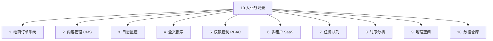

## 前置知识：场景实战是迁移的试金石

前面 7 篇笔记学了 PG 的类型、SQL、索引、事务、函数。本文通过 10 个真实生产场景，把这些知识串起来，让你能从"知道差异"升级到"能迁移系统"。



---

## 场景 1：电商订单系统

### MySQL 版本

```sql
CREATE TABLE products_mysql (
    id INT AUTO_INCREMENT PRIMARY KEY,
    name VARCHAR(100) NOT NULL,
    specs JSON,
    price DECIMAL(10,2) NOT NULL,
    stock INT UNSIGNED DEFAULT 0,
    status ENUM('draft','published','soldout') DEFAULT 'draft',
    created_at DATETIME DEFAULT CURRENT_TIMESTAMP,
    updated_at DATETIME DEFAULT CURRENT_TIMESTAMP ON UPDATE CURRENT_TIMESTAMP
) ENGINE=InnoDB;

-- 库存扣减
START TRANSACTION;
UPDATE products_mysql SET stock = stock - 1 WHERE id = 1 AND stock > 0;
INSERT INTO orders (user_id, amount) VALUES (1, 99.99);
COMMIT;
```

### PostgreSQL 迁移版本

```sql
-- ============================================
-- 商品表：JSONB 规格 + ENUM 状态 + 触发器更新时间
-- ============================================
CREATE TYPE product_status AS ENUM ('draft', 'published', 'soldout');

CREATE TABLE products (
    id SERIAL PRIMARY KEY,
    name VARCHAR(100) NOT NULL,
    -- PG 独有：JSONB 替代 JSON，支持 GIN 索引
    specs JSONB NOT NULL DEFAULT '{}',
    price NUMERIC(10,2) NOT NULL,
    stock INTEGER NOT NULL DEFAULT 0 CHECK (stock >= 0),  -- 替代 UNSIGNED
    status product_status DEFAULT 'draft',
    is_active BOOLEAN DEFAULT TRUE,
    created_at TIMESTAMPTZ DEFAULT NOW(),
    updated_at TIMESTAMPTZ DEFAULT NOW()
);

-- PG 独有：JSONB GIN 索引（加速规格包含查询）
CREATE INDEX idx_products_specs ON products USING GIN (specs);
-- PG 独有：部分索引（只索引在售商品，省空间）
CREATE INDEX idx_products_active ON products (name) WHERE is_active = true;

-- ============================================
-- 订单表 + 订单明细
-- ============================================
CREATE TYPE order_status AS ENUM ('pending', 'paid', 'shipped', 'completed', 'cancelled');

CREATE TABLE orders (
    id SERIAL PRIMARY KEY,
    user_id INTEGER NOT NULL,
    status order_status DEFAULT 'pending',
    total_amount NUMERIC(10,2) NOT NULL,
    created_at TIMESTAMPTZ DEFAULT NOW(),
    updated_at TIMESTAMPTZ DEFAULT NOW()
);

CREATE TABLE order_items (
    id SERIAL PRIMARY KEY,
    order_id INTEGER NOT NULL REFERENCES orders(id),
    product_id INTEGER NOT NULL REFERENCES products(id),
    quantity INTEGER NOT NULL CHECK (quantity > 0),
    unit_price NUMERIC(10,2) NOT NULL
);

-- ============================================
-- 触发器：自动更新时间戳（替代 ON UPDATE CURRENT_TIMESTAMP）
-- ============================================
CREATE OR REPLACE FUNCTION update_updated_at()
RETURNS TRIGGER AS $$
BEGIN
    NEW.updated_at = NOW();
    RETURN NEW;
END;
$$ LANGUAGE plpgsql;

CREATE TRIGGER trigger_products_updated
    BEFORE UPDATE ON products
    FOR EACH ROW EXECUTE FUNCTION update_updated_at();

CREATE TRIGGER trigger_orders_updated
    BEFORE UPDATE ON orders
    FOR EACH ROW EXECUTE FUNCTION update_updated_at();

-- ============================================
-- 插入订单并直接获取 ID（替代 LAST_INSERT_ID()）
-- ============================================
INSERT INTO orders (user_id, status, total_amount)
VALUES (1, 'pending', 99.99)
RETURNING id, status, created_at;

-- JSONB 规格查询（走 GIN 索引）
SELECT name, price FROM products
WHERE specs @> '{"brand": "Apple"}' AND is_active = true;

-- 条件聚合：统计高价订单数量
SELECT status,
    COUNT(*) AS total,
    COUNT(*) FILTER (WHERE total_amount > 1000) AS high_value,
    SUM(total_amount) AS revenue
FROM orders
WHERE created_at >= NOW() - INTERVAL '30 days'
GROUP BY status;
```

**迁移要点**：`AUTO_INCREMENT` → `SERIAL`、`JSON` → `JSONB`、`ENUM` 内联 → `CREATE TYPE`、`UNSIGNED` → `CHECK`、`ON UPDATE` → 触发器、`LAST_INSERT_ID()` → `RETURNING`、`CASE WHEN` 聚合 → `FILTER`。

---

## 场景 2：内容管理系统（CMS）

### PostgreSQL 迁移版本

```sql
-- 文章表：数组标签 + JSONB 元数据 + 全文搜索
CREATE TABLE articles (
    id SERIAL PRIMARY KEY,
    title VARCHAR(200) NOT NULL,
    slug VARCHAR(200) NOT NULL UNIQUE,
    content TEXT NOT NULL,
    tags TEXT[] DEFAULT '{}',          -- PG 独有：数组替代关联表
    metadata JSONB DEFAULT '{}',      -- 元数据（作者、SEO 等）
    is_published BOOLEAN DEFAULT FALSE,
    published_at TIMESTAMPTZ,
    created_at TIMESTAMPTZ DEFAULT NOW(),
    updated_at TIMESTAMPTZ DEFAULT NOW()
);

-- 分类表（支持层级，递归 CTE 查询）
CREATE TABLE categories (
    id SERIAL PRIMARY KEY,
    name VARCHAR(100) NOT NULL,
    parent_id INTEGER REFERENCES categories(id)
);

-- 标签 GIN 索引
CREATE INDEX idx_articles_tags ON articles USING GIN (tags);
-- JSONB GIN 索引
CREATE INDEX idx_articles_metadata ON articles USING GIN (metadata);
-- 部分索引（只索引已发布文章）
CREATE INDEX idx_articles_published ON articles (published_at DESC)
WHERE is_published = true;

-- 全文搜索向量（PG 独有）
ALTER TABLE articles ADD COLUMN search_vector TSVECTOR;
CREATE INDEX idx_articles_search ON articles USING GIN (search_vector);

-- 触发器自动维护搜索向量（标题加权 A，正文加权 B）
CREATE OR REPLACE FUNCTION update_search_vector()
RETURNS TRIGGER AS $$
BEGIN
    NEW.search_vector :=
        setweight(to_tsvector('english', COALESCE(NEW.title, '')), 'A') ||
        setweight(to_tsvector('english', COALESCE(NEW.content, '')), 'B');
    RETURN NEW;
END;
$$ LANGUAGE plpgsql;

CREATE TRIGGER trigger_articles_search
    BEFORE INSERT OR UPDATE ON articles
    FOR EACH ROW EXECUTE FUNCTION update_search_vector();

-- 全文搜索（带排序）
SELECT id, title, ts_rank(search_vector, query) AS rank
FROM articles, to_tsquery('english', 'postgresql & database') AS query
WHERE search_vector @@ query
ORDER BY rank DESC;

-- 标签包含查询（走 GIN 索引）
SELECT title FROM articles WHERE tags @> ARRAY['postgres'];

-- 分类层级查询（递归 CTE）
WITH RECURSIVE category_tree AS (
    SELECT id, name, parent_id, name::text AS path
    FROM categories WHERE parent_id IS NULL
    UNION ALL
    SELECT c.id, c.name, c.parent_id, ct.path || ' > ' || c.name
    FROM categories c JOIN category_tree ct ON c.parent_id = ct.id
)
SELECT * FROM category_tree ORDER BY path;
```

**迁移要点**：MySQL 三表标签 JOIN → PG 数组 + GIN、MySQL FULLTEXT → PG tsvector + GIN、MySQL 层级需存储过程 → PG 递归 CTE。

---

## 场景 3：日志监控系统

### PostgreSQL 迁移版本

```sql
-- 日志表：按月分区 + BRIN 索引
CREATE TABLE server_logs (
    id BIGSERIAL,  -- PG 17 前分区父表不支持 GENERATED AS IDENTITY，用 BIGSERIAL（与 v0/v5 口径一致）
    log_time TIMESTAMPTZ NOT NULL,
    level VARCHAR(10) NOT NULL,
    service VARCHAR(50) NOT NULL,
    message TEXT NOT NULL,
    context JSONB DEFAULT '{}'  -- 请求 ID、用户 ID 等
) PARTITION BY RANGE (log_time);

-- 创建分区
CREATE TABLE server_logs_2026_07 PARTITION OF server_logs
    FOR VALUES FROM ('2026-07-01') TO ('2026-08-01');
CREATE TABLE server_logs_2026_08 PARTITION OF server_logs
    FOR VALUES FROM ('2026-08-01') TO ('2026-09-01');

-- PG 独有：BRIN 索引（时序大表，体积小创建快）
CREATE INDEX idx_logs_time_brin ON server_logs USING BRIN (log_time);
-- JSONB 上下文索引
CREATE INDEX idx_logs_context ON server_logs USING GIN (context);

-- 日志级别统计（FILTER 子句）
SELECT level,
    COUNT(*) AS total,
    COUNT(*) FILTER (WHERE log_time >= NOW() - INTERVAL '1 hour') AS last_hour,
    COUNT(*) FILTER (WHERE log_time >= NOW() - INTERVAL '24 hours') AS last_day
FROM server_logs
WHERE log_time >= NOW() - INTERVAL '24 hours'
GROUP BY level;

-- 错误趋势（按小时聚合）
SELECT DATE_TRUNC('hour', log_time) AS hour,
    COUNT(*) AS error_count
FROM server_logs
WHERE level = 'ERROR' AND log_time >= NOW() - INTERVAL '24 hours'
GROUP BY DATE_TRUNC('hour', log_time)
ORDER BY hour;

-- 查询时自动分区裁剪（只扫描相关分区）
EXPLAIN (ANALYZE)
SELECT * FROM server_logs
WHERE log_time >= '2026-07-01' AND log_time < '2026-08-01';
-- 预期：只扫描 server_logs_2026_07
```

**迁移要点**：PG 原生分区 + 分区裁剪、BRIN 索引比 B-tree 小 100 倍、FILTER 替代 CASE WHEN 聚合。

---

## 场景 4：全文搜索

### MySQL 版本

```sql
-- MySQL FULLTEXT 索引
CREATE TABLE articles_fts_mysql (
    id INT AUTO_INCREMENT PRIMARY KEY,
    title VARCHAR(200),
    content TEXT,
    FULLTEXT INDEX ft_idx (title, content)
);
SELECT * FROM articles_fts_mysql
WHERE MATCH(title, content) AGAINST('database' IN NATURAL LANGUAGE MODE);
```

### PostgreSQL 迁移版本

```sql
-- PG 全文搜索更灵活：支持权重、排名、短语搜索
-- 建表和触发器见场景 2

-- 基本搜索
SELECT * FROM articles
WHERE search_vector @@ to_tsquery('english', 'postgresql & database');

-- 短语搜索（精确匹配词序）
SELECT * FROM articles
WHERE search_vector @@ phraseto_tsquery('english', 'open source database');

-- 高亮搜索结果
SELECT title,
    ts_headline('english', content, to_tsquery('english', 'postgresql & database'))
FROM articles
WHERE search_vector @@ to_tsquery('english', 'postgresql & database');

-- 排名搜索
SELECT title, ts_rank(search_vector, to_tsquery('english', 'postgresql')) AS rank
FROM articles
WHERE search_vector @@ to_tsquery('english', 'postgresql')
ORDER BY rank DESC;
```

**迁移要点**：MySQL FULLTEXT → PG `to_tsvector` + GIN 索引；PG 支持 `setweight` 权重、`ts_rank` 排名、`ts_headline` 高亮；中文全文搜索需安装 `zhparser` 扩展。

---

## 场景 5：权限控制（RBAC + RLS）

### PostgreSQL 迁移版本

```sql
-- 角色-权限-用户三层结构
CREATE TABLE app_roles (id SERIAL PRIMARY KEY, name VARCHAR(50) UNIQUE);
CREATE TABLE app_permissions (id SERIAL PRIMARY KEY, resource VARCHAR(50), action VARCHAR(20), UNIQUE(resource, action));
CREATE TABLE role_permissions (role_id INT REFERENCES app_roles(id), permission_id INT REFERENCES app_permissions(id), PRIMARY KEY(role_id, permission_id));
CREATE TABLE user_roles (user_id INT, role_id INT REFERENCES app_roles(id), PRIMARY KEY(user_id, role_id));

-- 权限检查函数
CREATE OR REPLACE FUNCTION has_permission(p_user_id INT, p_resource TEXT, p_action TEXT)
RETURNS BOOLEAN
LANGUAGE plpgsql STABLE AS $$
BEGIN
    RETURN EXISTS (
        SELECT 1 FROM user_roles ur
        JOIN role_permissions rp ON ur.role_id = rp.role_id
        JOIN app_permissions ap ON rp.permission_id = ap.id
        WHERE ur.user_id = p_user_id AND ap.resource = p_resource AND ap.action = p_action
    );
END;
$$;

-- PG 独有：行级安全（Row Level Security）
ALTER TABLE orders ENABLE ROW LEVEL SECURITY;

CREATE POLICY orders_user_policy ON orders
    FOR ALL
    USING (user_id = current_setting('app.current_user_id')::INTEGER);

-- 应用层设置用户 ID 后，查询自动过滤
SET app.current_user_id = '42';
SELECT * FROM orders;  -- 只返回 user_id = 42 的订单
```

**迁移要点**：MySQL 需应用层过滤 → PG 的 RLS 在数据库层自动隔离；权限函数标记 `STABLE` 让优化器可缓存。

---

## 场景 6：多租户 SaaS

### PostgreSQL 迁移版本

```sql
-- 方案 A：Schema 隔离（强隔离，大客户）
CREATE SCHEMA tenant_a;
CREATE SCHEMA tenant_b;

CREATE TABLE tenant_a.users (id SERIAL PRIMARY KEY, name VARCHAR(50));
CREATE TABLE tenant_b.users (id SERIAL PRIMARY KEY, name VARCHAR(50));

-- 通过 search_path 切换租户上下文
SET search_path = tenant_a, public;
SELECT * FROM users;  -- 访问 tenant_a.users

-- 为每个租户创建专属角色
CREATE ROLE tenant_a_user LOGIN PASSWORD 'pass_a' INHERIT;
GRANT USAGE ON SCHEMA tenant_a TO tenant_a_user;
GRANT SELECT, INSERT, UPDATE ON ALL TABLES IN SCHEMA tenant_a TO tenant_a_user;

-- 方案 B：行级隔离（轻量级，中小客户）
CREATE TABLE tenant_data (
    id SERIAL PRIMARY KEY,
    tenant_id INTEGER NOT NULL,
    data JSONB DEFAULT '{}'
);

ALTER TABLE tenant_data ENABLE ROW LEVEL SECURITY;
CREATE POLICY tenant_isolation ON tenant_data
    USING (tenant_id = current_setting('app.tenant_id')::INTEGER);

SET app.tenant_id = '1';
SELECT * FROM tenant_data;  -- 自动过滤为当前租户
```

**迁移要点**：MySQL 多 database → PG 多 schema（同 database 内）；RLS 是 PG 独有的数据库层行隔离。

---

## 场景 7：任务队列（SKIP LOCKED）

### PostgreSQL 迁移版本

```sql
CREATE TABLE task_queue (
    id SERIAL PRIMARY KEY,
    task_type VARCHAR(50) NOT NULL,
    payload JSONB NOT NULL DEFAULT '{}',
    status VARCHAR(20) DEFAULT 'pending',
    retry_count INTEGER DEFAULT 0,
    max_retries INTEGER DEFAULT 3,
    created_at TIMESTAMPTZ DEFAULT NOW(),
    processed_at TIMESTAMPTZ
);

-- 部分索引：只索引 pending 状态
CREATE INDEX idx_tasks_pending ON task_queue (created_at) WHERE status = 'pending';

-- 消费者函数（SKIP LOCKED 不阻塞）
CREATE OR REPLACE FUNCTION consume_tasks(p_worker_id TEXT, p_limit INT DEFAULT 10)
RETURNS TABLE (id INTEGER, task_type TEXT, payload JSONB) AS $$
BEGIN
    RETURN QUERY
    UPDATE task_queue
    SET status = 'processing'
    WHERE id IN (
        SELECT id FROM task_queue
        WHERE status = 'pending'
        ORDER BY created_at
        LIMIT p_limit
        FOR UPDATE SKIP LOCKED  -- 跳过被锁定的行，不阻塞
    )
    RETURNING task_queue.id, task_queue.task_type, task_queue.payload;
END;
$$ LANGUAGE plpgsql;

-- 消费任务
SELECT * FROM consume_tasks('worker-1', 5);

-- 任务完成
UPDATE task_queue SET status = 'completed', processed_at = NOW()
WHERE id = 1 AND status = 'processing';

-- 任务失败重试
UPDATE task_queue
SET status = CASE WHEN retry_count < max_retries THEN 'pending' ELSE 'failed' END,
    retry_count = retry_count + 1
WHERE id = 1 AND status = 'processing';

-- UPSERT 幂等入队
INSERT INTO task_queue (task_type, payload)
VALUES ('email_send', '{"to": "alice@test.com"}')
ON CONFLICT DO NOTHING;
```

**迁移要点**：`SKIP LOCKED` 实现高并发无阻塞队列消费；`RETURNING` 让消费逻辑一步完成。

---

## 场景 8：时序数据分析

### PostgreSQL 迁移版本

```sql
-- 设备数据表（按月分区）
CREATE TABLE device_metrics (
    id BIGSERIAL,  -- 同场景 3：PG 17 前分区父表不支持 GENERATED AS IDENTITY，用 BIGSERIAL
    device_id INTEGER NOT NULL,
    metric_time TIMESTAMPTZ NOT NULL,
    temperature NUMERIC(5,2),
    humidity NUMERIC(5,2)
) PARTITION BY RANGE (metric_time);

CREATE TABLE device_metrics_2026_01 PARTITION OF device_metrics
    FOR VALUES FROM ('2026-01-01') TO ('2026-02-01');

-- BRIN 索引（时序数据物理有序，BRIN 效果极佳）
CREATE INDEX idx_metrics_time_brin ON device_metrics USING BRIN (metric_time);
CREATE INDEX idx_metrics_device ON device_metrics (device_id, metric_time);

-- 小时级聚合
SELECT device_id,
    DATE_TRUNC('hour', metric_time) AS hour,
    AVG(temperature) AS avg_temp,
    MAX(temperature) AS max_temp,
    MIN(temperature) AS min_temp
FROM device_metrics
WHERE metric_time >= NOW() - INTERVAL '24 hours'
GROUP BY device_id, DATE_TRUNC('hour', metric_time)
ORDER BY device_id, hour;

-- 趋势分析（LAG 计算变化率）
WITH hourly_avg AS (
    SELECT device_id,
        DATE_TRUNC('hour', metric_time) AS hour,
        AVG(temperature) AS avg_temp
    FROM device_metrics
    WHERE metric_time >= NOW() - INTERVAL '7 days'
    GROUP BY device_id, DATE_TRUNC('hour', metric_time)
)
SELECT device_id, hour, avg_temp,
    avg_temp - LAG(avg_temp, 1) OVER (PARTITION BY device_id ORDER BY hour) AS temp_change
FROM hourly_avg;
```

---

## 场景 9：地理空间（PostGIS）

### PostgreSQL 迁移版本

```sql
-- 安装 PostGIS 扩展
CREATE EXTENSION IF NOT EXISTS postgis;

CREATE TABLE shops (
    id SERIAL PRIMARY KEY,
    name VARCHAR(100) NOT NULL,
    location GEOGRAPHY(POINT, 4326) NOT NULL,  -- WGS84 坐标系
    category VARCHAR(50),
    rating NUMERIC(2,1)
);

-- GiST 索引（空间查询必须）
CREATE INDEX idx_shops_location ON shops USING GIST (location);

INSERT INTO shops (name, location, category, rating) VALUES
('星巴克', ST_MakePoint(121.47, 31.23)::geography, 'coffee', 4.5),
('瑞幸', ST_MakePoint(121.47, 31.24)::geography, 'coffee', 4.2),
('麦当劳', ST_MakePoint(121.48, 31.22)::geography, 'fast_food', 4.0);

-- 查询 1 公里内的咖啡店
SELECT name, rating,
    ST_Distance(location, ST_MakePoint(121.47, 31.23)::geography) AS distance_m
FROM shops
WHERE ST_DWithin(location, ST_MakePoint(121.47, 31.23)::geography, 1000)
    AND category = 'coffee'
ORDER BY distance_m;
```

**迁移要点**：PostGIS 是 PG 最强扩展；MySQL Spatial 功能远弱于 PostGIS；`GEOGRAPHY` 计算真实地球距离。

---

## 场景 10：数据仓库（物化视图）

### PostgreSQL 迁移版本

```sql
-- 每日用户行为统计物化视图
CREATE MATERIALIZED VIEW mv_daily_user_stats AS
SELECT
    DATE(action_time) AS stat_date,
    user_id,
    COUNT(*) AS total_actions,
    COUNT(*) FILTER (WHERE action_type = 'login') AS login_count,
    COUNT(*) FILTER (WHERE action_type = 'purchase') AS purchase_count
FROM user_actions
GROUP BY DATE(action_time), user_id;

-- 唯一索引（支持并发刷新）
CREATE UNIQUE INDEX idx_mv_stats ON mv_daily_user_stats (stat_date, user_id);

-- 查询物化视图（毫秒级响应）
SELECT * FROM mv_daily_user_stats
WHERE stat_date >= CURRENT_DATE - INTERVAL '7 days'
ORDER BY stat_date DESC;

-- 并发刷新（不阻塞查询，PG 独有）
REFRESH MATERIALIZED VIEW CONCURRENTLY mv_daily_user_stats;

-- 用 pg_cron 定时刷新
CREATE EXTENSION IF NOT EXISTS pg_cron;
SELECT cron.schedule('refresh-mv', '0 2 * * *',
    'REFRESH MATERIALIZED VIEW CONCURRENTLY mv_daily_user_stats');
```

**迁移要点**：物化视图适合读多写少的报表；`CONCURRENTLY` 刷新需唯一索引；`pg_cron` 替代 MySQL Event Scheduler。

---

## 场景与毕业项目交叉引用

以下矩阵帮助你理解每个业务场景在毕业项目中的哪个版本被实践，便于交叉学习：

| 场景 | 核心知识点 | 对应毕业项目 | 对应笔记 |
|------|-----------|-------------|---------|
| 场景 1 电商订单 | JSONB+CHECK+触发器+RETURNING | [[v1-环境搭建与基础查询迁移]]（CRUD）+ [[v2-数据类型与DDL迁移]]（JSONB/CHECK）+ [[v4-事务与并发控制]]（库存扣减） | 01/02/05 |
| 场景 2 CMS | 数组+GIN+全文搜索+递归CTE | [[v2-数据类型与DDL迁移]]（数组/JSONB）+ [[v5-存储过程与触发器迁移]]（触发器） | 02/06 |
| 场景 3 日志监控 | 分区表+BRIN+FILTER | [[v3-查询与索引优化]]（BRIN）+ [[v5-存储过程与触发器迁移]]（分区表） | 04/06 |
| 场景 4 全文搜索 | tsvector+GIN+pg_trgm | [[v5-存储过程与触发器迁移]]（扩展生态） | 06 |
| 场景 5 RBAC+RLS | 行级安全+权限函数 | [[v4-事务与并发控制]]（Advisory Lock） | 05 |
| 场景 6 多租户 | Schema 隔离+RLS | [[v1-环境搭建与基础查询迁移]]（Schema） | 01 |
| 场景 7 任务队列 | SKIP LOCKED+部分索引 | [[v4-事务与并发控制]]（SKIP LOCKED 队列） | 05 |
| 场景 8 时序分析 | 窗口函数+LAG+分区+BRIN | [[v3-查询与索引优化]]（窗口函数）+ [[v5-存储过程与触发器迁移]]（分区表） | 03/06 |
| 场景 9 地理空间 | PostGIS+GiST | [[v5-存储过程与触发器迁移]]（扩展生态） | 06 |
| 场景 10 数据仓库 | 物化视图+pg_cron | [[v5-存储过程与触发器迁移]]（物化视图） | 06 |

> [!tip] 交叉学习建议
> 学完本篇 10 个场景后，建议直接跳到对应毕业项目版本动手实践——场景告诉你"为什么迁移"，毕业项目告诉你"怎么一步步迁移"。

---

## 实践练习（附注释）

### 练习 1：电商表迁移 🟢 基础

```sql
-- 目标：将 MySQL 商品表迁移到 PG
-- 要求：JSON→JSONB、AUTO_INCREMENT→SERIAL、ENUM→CREATE TYPE、创建 GIN 索引
CREATE TYPE p_status AS ENUM ('draft', 'published');
CREATE TABLE products_ex (
    id SERIAL PRIMARY KEY,
    name VARCHAR(100) NOT NULL,
    specs JSONB DEFAULT '{}',
    price NUMERIC(10,2) NOT NULL,
    status p_status DEFAULT 'draft'
);
CREATE INDEX idx_specs ON products_ex USING GIN (specs);
INSERT INTO products_ex (name, specs, price) VALUES
('iPhone', '{"brand":"Apple","color":"black"}', 7999);
SELECT name FROM products_ex WHERE specs @> '{"brand":"Apple"}';
```

### 练习 2：标签系统迁移 🟡 进阶

```sql
-- 目标：用数组替代 MySQL 三表关联
CREATE TABLE articles_ex (
    id SERIAL PRIMARY KEY,
    title VARCHAR(200),
    tags TEXT[] DEFAULT '{}'
);
CREATE INDEX idx_tags ON articles_ex USING GIN (tags);
INSERT INTO articles_ex (title, tags) VALUES
('PG 入门', ARRAY['database','sql']),
('Docker', ARRAY['docker','devops']);
SELECT title FROM articles_ex WHERE tags @> ARRAY['database'];
SELECT tag, COUNT(*) FROM articles_ex, unnest(tags) AS tag GROUP BY tag;
```

**可量化验收标准**：
- **完成标准**：① 数组 `@>` 查询返回正确行 ② `unnest` 展开聚合返回所有标签计数 ③ GIN 索引后 EXPLAIN 显示 Bitmap Index Scan
- **预期输出**：`WHERE tags @> ARRAY['database']` 返回 `PG 入门`；`unnest+GROUP BY` 返回 4 行标签计数
- **自测方法**：`EXPLAIN SELECT * FROM articles_ex WHERE tags @> ARRAY['database']` 显示 `Bitmap Index Scan on idx_tags`
- **常见错误**：`unnest(tags)` 必须 alias 否则列名不明确；`@>` 用于数组包含查询，`ANY()` 用于标量与数组比较

### 练习 3：消息队列消费 🟡 进阶

```sql
-- 目标：用 SKIP LOCKED 实现并发队列消费
-- 要求：创建 task_queue 表，两个会话并发消费，验证不重复
CREATE TABLE task_q (id SERIAL PRIMARY KEY, status VARCHAR(20) DEFAULT 'pending');
INSERT INTO task_q (status) VALUES ('pending'),('pending'),('pending'),('pending');
BEGIN;
SELECT * FROM task_q WHERE status='pending' ORDER BY id LIMIT 2 FOR UPDATE SKIP LOCKED;
UPDATE task_q SET status='processing' WHERE id IN (1,2);
COMMIT;
```

**可量化验收标准**：
- **完成标准**：① 两个并发会话各取 2 条记录且不重叠 ② 无阻塞无死锁 ③ 全部消费后 `status='pending'` 的行数为 0
- **预期输出**：会话 1 取到 id=1,2；会话 2 同时取到 id=3,4
- **自测方法**：两会话并发执行 SELECT，都立即返回无等待；最终 `SELECT count(*) FROM task_q WHERE status='pending'` 返回 0
- **常见错误**：忘记 `FOR UPDATE SKIP LOCKED` 导致会话 2 阻塞；未加 `WHERE status='pending'` 导致消费已处理任务

### 练习 4：游标分页 🔴 挑战

```sql
-- 目标：实现基于 created_at + id 的游标分页
-- 要求：创建复合索引，写出第一页和后续页 SQL，用 EXPLAIN 对比 OFFSET
CREATE INDEX idx_orders_cursor ON orders (created_at DESC, id DESC);
-- 第一页
SELECT id, created_at FROM orders ORDER BY created_at DESC, id DESC LIMIT 10;
-- 后续页（用上一页最后一条的值）
SELECT id, created_at FROM orders
WHERE (created_at, id) < ('2026-01-01', 12345)
ORDER BY created_at DESC, id DESC LIMIT 10;
```

**可量化验收标准**：
- **完成标准**：① 创建复合索引 `(created_at DESC, id DESC)` ② 第一页和后续页 SQL 正确 ③ EXPLAIN 对比 OFFSET 深分页性能差异
- **预期输出**：第一页返回 10 行；OFFSET 100000 页 `Execution Time > 100ms`；游标分页 `Execution Time < 10ms`
- **自测方法**：`EXPLAIN ANALYZE SELECT ... OFFSET 100000 LIMIT 10` 对比游标分页的 EXPLAIN
- **常见错误**：复合索引顺序与 ORDER BY 不一致导致不走索引；游标值类型不匹配（text vs timestamptz）导致比较错误

### 练习 5：审计触发器 🔴 挑战

```sql
-- 目标：为 products 表创建通用审计触发器
CREATE TABLE audit_log (
    id BIGSERIAL PRIMARY KEY, table_name TEXT, operation TEXT,
    old_data JSONB, new_data JSONB, changed_at TIMESTAMPTZ DEFAULT NOW()
);
CREATE OR REPLACE FUNCTION audit_fn() RETURNS TRIGGER AS $$
BEGIN
    IF TG_OP='INSERT' THEN INSERT INTO audit_log(table_name,operation,new_data) VALUES(TG_TABLE_NAME,'INSERT',to_jsonb(NEW)); RETURN NEW;
    ELSIF TG_OP='UPDATE' THEN INSERT INTO audit_log(table_name,operation,old_data,new_data) VALUES(TG_TABLE_NAME,'UPDATE',to_jsonb(OLD),to_jsonb(NEW)); RETURN NEW;
    ELSIF TG_OP='DELETE' THEN INSERT INTO audit_log(table_name,operation,old_data) VALUES(TG_TABLE_NAME,'DELETE',to_jsonb(OLD)); RETURN OLD;
    END IF; RETURN NULL;
END; $$ LANGUAGE plpgsql;
CREATE TRIGGER trg_audit AFTER INSERT OR UPDATE OR DELETE ON products
FOR EACH ROW EXECUTE FUNCTION audit_fn();
```

**可量化验收标准**：
- **完成标准**：① 创建 `audit_log` 表 ② 创建 `audit_fn()` 触发器函数处理 I/U/D ③ 在 products 表上挂载触发器 ④ 每次 DOL 后 audit_log 新增 1 行
- **预期输出**：`INSERT → UPDATE → DELETE` 后 `SELECT count(*) FROM audit_log` 返回 3；INSERT 无 old_data、DELETE 无 new_data
- **自测方法**：`SELECT operation, old_data->>'name' AS old_name, new_data->>'name' AS new_name FROM audit_log ORDER BY id` 确认 I/U/D 各 1 行
- **常见错误**：`TG_OP` 值为大写 `'INSERT'`/`'UPDATE'`/`'DELETE'`；DELETE 分支返回 `OLD` 而非 `NEW`；`to_jsonb(NEW)` 需在 plpgsql 中使用

### 练习 6：物化视图 🔴 挑战

```sql
-- 目标：创建物化视图并并发刷新
-- 要求：创建基础表、物化视图、唯一索引、CONCURRENTLY 刷新
CREATE TABLE user_actions_ex (id BIGSERIAL, user_id INT, action_type VARCHAR(50), action_time TIMESTAMPTZ DEFAULT NOW());
INSERT INTO user_actions_ex (user_id, action_type) VALUES (1,'login'),(2,'purchase'),(1,'purchase');
CREATE MATERIALIZED VIEW mv_stats AS SELECT user_id, COUNT(*) AS cnt FROM user_actions_ex GROUP BY user_id;
CREATE UNIQUE INDEX idx_mv ON mv_stats (user_id);
REFRESH MATERIALIZED VIEW CONCURRENTLY mv_stats;
SELECT * FROM mv_stats;
```

**可量化验收标准**：
- **完成标准**：① 创建物化视图 ② 创建唯一索引（CONCURRENTLY 刷新前提） ③ `REFRESH MATERIALIZED VIEW CONCURRENTLY` 成功 ④ 刷新时查询不阻塞
- **预期输出**：`SELECT * FROM mv_stats` 返回 2 行（user_id=1 cnt=2, user_id=2 cnt=1）；CONCURRENTLY 刷新无报错
- **自测方法**：插入新数据后刷新物化视图，确认 `cnt` 更新；在另一会话查询 mv_stats 时刷新不阻塞
- **常见错误**：忘记建唯一索引就用 CONCURRENTLY 会报错；CONCURRENTLY 刷新需先有数据才能并发刷新

---

## 常见易错点

> [!warning] **易错 1：JSON 用了 JSON 而非 JSONB**
> 始终用 JSONB 获得索引能力和查询性能。

> [!warning] **易错 2：大表分页用 OFFSET**
> 大 OFFSET 全表扫描，用游标分页替代。

> [!warning] **易错 3：全文搜索忽略中文**
> PG 默认英文分词，中文需安装 `zhparser` 扩展。

> [!warning] **易错 4：分区表主键不含分区键**
> PG 要求主键必须包含分区键，用复合主键 `(id, partition_key)`。

> [!warning] **易错 5：审计触发器忘记 RETURN**
> BEFORE 触发器不 RETURN NEW 会取消操作，确保每个分支都有返回。

> [!warning] **易错 6：物化视图 CONCURRENTLY 刷新缺唯一索引**
> `REFRESH ... CONCURRENTLY` 要求物化视图有唯一索引，否则报错。

---

## 🎯 本文学完自检

| 层次 | 检查项 |
|------|--------|
| 🟢 基础 | 能完成电商、CMS、日志 3 个场景的迁移 |
| 🟡 进阶 | 能完成全文搜索、RBAC、多租户、队列 4 个场景的迁移 |
| 🔴 挑战 | 能完成时序分析、地理空间、数据仓库 3 个高级场景 |

---

## ⚡ 30 秒速记卡片

| # | 正面（问题） | 背面（答案） |
|---|-------------|-------------|
| F1 | 电商场景核心？ | JSONB+GIN / CHECK 约束 / 触发器更新时间 / RETURNING / FILTER 聚合 |
| F2 | CMS 场景核心？ | TEXT[] 数组标签 / GIN 索引 / tsvector 全文搜索 / 递归 CTE 分类层级 |
| F3 | 日志监控核心？ | RANGE 分区 / BRIN 索引（时序大表）/ FILTER 聚合 / DATE_TRUNC 按小时 |
| F4 | 全文搜索核心？ | to_tsvector + GIN / ts_rank 排名 / ts_headline 高亮 / 中文需 zhparser |
| F5 | RBAC+RLS 核心？ | CREATE POLICY + USING (条件) / current_setting() 获取用户 ID |
| F6 | 多租户方案？ | Schema 隔离（强）/ RLS 行隔离（轻量）/ search_path 切换 |
| F7 | 任务队列核心？ | SKIP LOCKED 不阻塞 / 部分索引只索引 pending / RETURNING 一步完成 |
| F8 | 时序分析核心？ | 分区 + BRIN / DATE_TRUNC 聚合 / LAG 计算变化率 / 窗口函数 |
| F9 | 地理空间核心？ | PostGIS 扩展 / GEOGRAPHY 类型 / ST_Distance / GiST 索引 |
| F10 | 数据仓库核心？ | 物化视图 + 唯一索引 / CONCURRENTLY 刷新 / pg_cron 定时刷新 |

---

## 相关笔记

- ⬅️ 前置：[[07-双向对比-MySQL有PG无与PG有MySQL无]]
- ➡️ 后续：[[09-面试高频20问-MySQL背景版]]
- 🔗 关联：[[02-数据类型与DDL对比]]（JSONB、数组）
- 🔗 关联：[[04-索引与查询优化]]（GIN、BRIN）
- 🔗 关联：[[06-存储过程与函数对比]]（触发器、扩展）

---
*最后更新：2026-07-24*