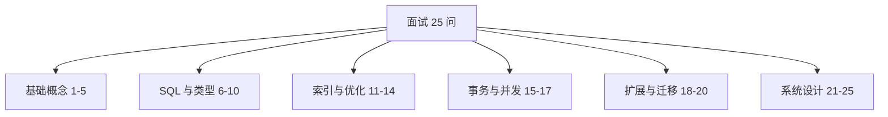
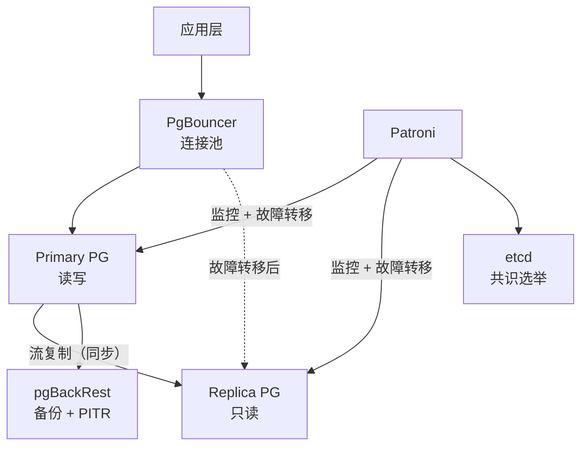
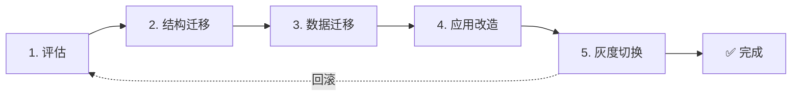

## 前置知识：面试的核心是"对比能力"

作为有 MySQL 背景的开发者，面试官最关心的不是你背了多少 PG 语法，而是你**能不能说清两者的差异和迁移策略**。每道题采用黄金三段式：先给结论，再展开原理，最后补充生产经验。



---

## Q1：PostgreSQL 和 MySQL 在架构上最大的区别是什么？

**先结论**：PG 是多进程模型，MySQL 是多线程模型；PG 无可插拔存储引擎，MySQL 有。

**再展开**：
- PG 每个连接 fork 一个后端进程，进程隔离更安全但连接开销更大
- MySQL 每个连接分配一个线程，开销小但一个线程崩溃可能影响实例
- PG 所有表统一用 heap 存储，MySQL 可选 InnoDB/MyISAM 等引擎
- PG 有 autovacuum 独立后台进程清理死元组，MySQL 由 InnoDB purge 线程处理

**生产经验**：PG 生产环境必须配 PgBouncer 连接池（进程模型连接开销大）；MySQL 高并发场景线程池更轻量。

---

## Q2：PostgreSQL 的 MVCC 和 MySQL InnoDB 的 MVCC 有什么区别？

**先结论**：PG 把所有版本存在数据页中（多版本共存），MySQL 把旧版本存在 undo log 中。

**再展开**：
- PG 的 UPDATE = DELETE + INSERT，旧版本标记为死元组，新版本追加到数据页
- MySQL InnoDB 的 UPDATE 在数据页原地修改，旧版本写入 undo log
- PG 需要定期 VACUUM 清理死元组，MySQL 的 purge 线程自动清理 undo log
- PG 的死元组不清理会导致表和索引膨胀（bloat）

**生产经验**：PG 的 autovacuum 必须开启并调优；监控 `pg_stat_user_tables.n_dead_tup`；严重膨胀时用 `pg_repack` 在线重组而非 `VACUUM FULL`（锁表）。

---

## Q3：PostgreSQL 的 JSONB 和 MySQL 的 JSON 有什么区别？

**先结论**：JSONB 是二进制解析存储，支持 GIN 索引，查询比 MySQL JSON 快 3-10 倍。

**再展开**：
- PG 的 `JSON` 是文本存储（类似 MySQL），`JSONB` 是二进制解析存储
- JSONB 支持 `@>`（包含）、`?`（键存在）、`?|`（任一键存在）等操作符
- JSONB 可创建 GIN 索引，加速任意路径的包含查询
- MySQL 的 JSON 只能用函数索引（特定路径），无法做 `@>` 类包含查询

**生产经验**：99% 场景用 JSONB 而非 JSON；`->>` 提取文本需建表达式索引才能走索引；JSONB 不保留原始格式和键顺序。

---

## Q4：PostgreSQL 的 SERIAL 和 MySQL 的 AUTO_INCREMENT 有什么区别？

**先结论**：PG 用独立的序列对象（SEQUENCE）实现自增，MySQL 用表级计数器。

**再展开**：
- `SERIAL` 本质是创建一个 SEQUENCE + 设置默认值为 `nextval('seq')`
- MySQL 的 AUTO_INCREMENT 是表级计数器，与表绑定
- PG 推荐 `GENERATED BY DEFAULT AS IDENTITY`（SQL 标准，删除表时自动清理序列）
- PG 的序列可以手动控制（设置初始值、步长、循环）

**生产经验**：手动插入 ID 后序列不会自动更新，需 `SELECT setval('seq', (SELECT max(id) FROM t))` 重置；`GENERATED AS IDENTITY` 比 SERIAL 更规范。

---

## Q5：PostgreSQL 的隔离级别和 MySQL 有什么区别？

**先结论**：两者的 Repeatable Read 普通 SELECT 都是快照读、看不到其他事务后提交的 INSERT；差异在机制——PG 的 RR 是无锁快照隔离，MySQL RR 的锁定读（当前读）靠 next-key 锁防幻读；PG 的 Serializable 用 SSI 无锁实现。

**再展开**：
- PG 不支持 Read Uncommitted（内部等同 Read Committed）
- PG 的 Repeatable Read 基于无锁的快照隔离，天然防幻读
- MySQL InnoDB 的 RR 普通 SELECT 走一致性快照读，同样看不到其他事务后提交的 INSERT；幻读出现在锁定读（当前读）场景，next-key 锁（记录锁+间隙锁）正是 MySQL 锁定读防幻读的机制
- PG 的 Serializable 用 Serializable Snapshot Isolation（SSI），不依赖锁，适合高并发
- PG 默认 Read Committed，MySQL 默认 Repeatable Read

**生产经验**：迁移时注意默认隔离级别不同；PG 的 Serializable 在高并发冲突时可能报错，需要应用层重试。

---

## Q6：PostgreSQL 的 LIMIT 语法和 MySQL 有什么区别？

**先结论**：PG 不支持 MySQL 的 `LIMIT offset, count` 逗号语法。

**再展开**：
- MySQL: `LIMIT 10, 20`（offset=10, count=20）
- PG: `LIMIT 20 OFFSET 10` 或 `FETCH FIRST 20 ROWS ONLY`
- PG 还支持 `DECLARE CURSOR` 做服务端游标分页
- 深分页推荐用游标分页（keyset pagination）替代大 OFFSET

**生产经验**：迁移时全局搜索 `LIMIT \d+,` 替换为 `LIMIT ... OFFSET ...`；深分页用 `(created_at, id) < (last_val)` 游标方案。

---

## Q7：PostgreSQL 的 RETURNING 子句有什么用？

**先结论**：RETURNING 让 INSERT/UPDATE/DELETE 后直接返回数据，替代 MySQL 的 `LAST_INSERT_ID()`。

**再展开**：
- `INSERT ... RETURNING id` 直接返回自增 ID，无需额外查询
- `UPDATE ... RETURNING *` 返回更新后的行
- `DELETE ... RETURNING *` 返回被删除的行（审计留档）
- 批量 INSERT 后 `RETURNING id` 返回所有 ID 列表

**生产经验**：ORM 框架用 RETURNING 可省去额外的 SELECT 查询；`RETURNING (xmax = 0)` 可区分插入和更新（UPSERT 场景）。

---

## Q8：PostgreSQL 的 UPSERT 和 MySQL 的 ON DUPLICATE KEY UPDATE 有什么区别？

**先结论**：PG 用 `ON CONFLICT` 显式指定冲突列，MySQL 隐式判断。

**再展开**：
- PG: `INSERT ... ON CONFLICT (col) DO UPDATE SET ... = EXCLUDED.col`
- MySQL: `INSERT ... ON DUPLICATE KEY UPDATE col = VALUES(col)`
- PG 的 `EXCLUDED` 指向尝试插入但冲突的行
- PG 支持 `ON CONFLICT DO NOTHING`（替代 `INSERT IGNORE`）
- PG 支持条件更新 `WHERE`、指定约束名 `ON CONSTRAINT`

**生产经验**：PG 必须显式指定冲突列或约束名；`(xmax = 0)` 判断是插入还是更新。

---

## Q9：PostgreSQL 的 GROUP BY 和 MySQL 有什么区别？

**先结论**：PG 要求 SELECT 中的非聚合列必须出现在 GROUP BY 中（严格模式），MySQL 有宽松模式。

**再展开**：
- MySQL 宽松模式允许 `SELECT region, salesperson, SUM(amount) ... GROUP BY region`（不报错但 salesperson 值不确定）
- PG 严格模式直接报错 `column must appear in GROUP BY`
- MySQL 8.0+ 默认开启 `ONLY_FULL_GROUP_BY`，行为与 PG 一致
- PG 支持 `GROUPING SETS` / `ROLLUP` / `CUBE` 多维聚合

**生产经验**：迁移前在 MySQL 开启 `ONLY_FULL_GROUP_BY` 提前发现问题；用 `STRING_AGG` 或窗口函数替代宽松 GROUP BY。

---

## Q10：PostgreSQL 有哪些 MySQL 没有的数据类型？

**先结论**：JSONB、数组、范围类型、复合类型、CITEXT 是 PG 独有的核心类型。

**再展开**：
- `JSONB`：二进制 JSON，支持 GIN 索引
- `TEXT[]` / `INT[]`：原生存储数组，替代关联表
- `TSTZRANGE` / `INT4RANGE`：范围类型，支持 `&&` 重叠操作
- 自定义复合类型：`CREATE TYPE address AS (street, city, zip)`
- `CITEXT`：大小写不敏感文本（扩展）
- `TIMESTAMPTZ`：带时区时间戳（范围到 294276 年，MySQL TIMESTAMP 只到 2038）

**生产经验**：数组适合标签/权限等"值类型"；范围类型 + EXCLUDE 约束可做时间不重叠校验；JSONB + GIN 是文档型查询的利器。

---

## Q11：PostgreSQL 有哪些 MySQL 没有的索引类型？

**先结论**：GIN、GiST、BRIN、SP-GiST 是 PG 独有索引类型。

**再展开**：
- **GIN**（倒排索引）：JSONB/数组/全文搜索的杀手锏
- **GiST**（通用搜索树）：空间查询、范围重叠、相似度
- **BRIN**（块范围索引）：时序大表，体积比 B-tree 小 100 倍
- **SP-GiST**：空间分区树，高维搜索
- PG 还有部分索引（`WHERE` 条件）、表达式索引、覆盖索引（`INCLUDE`）、并发创建（`CONCURRENTLY`）

**生产经验**：JSONB 必配 GIN 索引；时序表用 BRIN；生产建索引用 `CONCURRENTLY` 不锁表；部分索引省空间加速热数据查询。

---

## Q12：PostgreSQL 的 EXPLAIN 和 MySQL 有什么区别？

**先结论**：PG 的 EXPLAIN 输出更详细，有 cost 概念和 BUFFERS 统计。

**再展开**：
- PG: `EXPLAIN (ANALYZE, BUFFERS)` 显示实际执行时间 + 缓存命中/磁盘读取
- MySQL: `EXPLAIN ANALYZE`（8.0.18+）和 `EXPLAIN FORMAT=JSON`
- PG 显示 `cost`（估算成本）、`rows`（估算行数）、`actual time`（实际耗时）、`loops`（执行次数）
- PG 有 `Seq Scan` / `Index Scan` / `Index Only Scan` / `Bitmap Heap Scan` 四种扫描

**生产经验**：重点看 `Buffers: shared read`（磁盘读，越小越好）和 `Rows Removed by Filter`（过滤掉的行，越多说明索引选择性差）。

---

## Q13：PostgreSQL 的 VACUUM 是什么？MySQL 有对应物吗？

**先结论**：VACUUM 清理 MVCC 产生的死元组，MySQL 的 purge 线程自动完成，无需手动干预。

**再展开**：
- PG 的 UPDATE/DELETE 产生死元组，VACUUM 标记空间可重用
- `VACUUM`：不锁表，标记空间可重用，不释放磁盘给 OS
- `VACUUM FULL`：锁表，重写表，释放磁盘给 OS（生产慎用）
- `ANALYZE`：更新统计信息，让优化器选择正确计划
- `autovacuum`：后台自动 VACUUM + ANALYZE

**生产经验**：监控 `n_dead_tup`；大批量写入后手动 `ANALYZE`；严重膨胀用 `pg_repack` 而非 `VACUUM FULL`。

---

## Q14：PostgreSQL 的 CTE 递归查询怎么用？

**先结论**：用 `WITH RECURSIVE` 实现层级遍历，MySQL 8.0+ 也支持但 PG 更完整。

**再展开**：
- 基础查询（根节点）+ `UNION ALL` + 递归查询（连接子节点）
- PG 独有：`MATERIALIZED` / `NOT MATERIALIZED` 提示控制 CTE 物化
- PG 独有：CTE 中可执行 DML（INSERT/UPDATE/DELETE + RETURNING）

```sql
WITH RECURSIVE org_tree AS (
    SELECT id, name, manager_id, 0 AS depth FROM employees WHERE manager_id IS NULL
    UNION ALL
    SELECT e.id, e.name, e.manager_id, ot.depth + 1
    FROM employees e JOIN org_tree ot ON e.manager_id = ot.id
)
SELECT * FROM org_tree;
```

**生产经验**：递归 CTE 用于组织架构、评论嵌套、物料 BOM；注意加终止条件防止无限递归。

---

## Q15：PostgreSQL 的 DDL 事务支持是什么？

**先结论**：PG 的 DDL 可以在事务中执行并回滚，MySQL 的 DDL 是隐式提交的。

**再展开**：
- PG 的 `CREATE TABLE` / `ALTER TABLE` / `DROP TABLE` 都可以 `BEGIN ... ROLLBACK`
- MySQL 的 DDL 会隐式 COMMIT，无法回滚
- 这意味着 PG 的 Schema 变更可以原子化：成功全部生效，失败全部回滚

**生产经验**：PG 的 DDL 事务是运维优势；但大表 ALTER TABLE 获取 AccessExclusiveLock 会阻塞读写，生产用 `pg_repack` 在线处理。

---

## Q16：PostgreSQL 的行级安全（RLS）是什么？

**先结论**：RLS 在数据库层自动过滤行数据，PG 独有，MySQL 需应用层实现。

**再展开**：
- `ALTER TABLE t ENABLE ROW LEVEL SECURITY` 开启
- `CREATE POLICY ... USING (condition)` 定义过滤条件
- 查询时自动应用条件，无需在 SQL 中加 WHERE
- 可用 `current_setting()` 获取会话变量实现动态过滤

**生产经验**：多租户 SaaS 场景用 RLS 比应用层过滤更安全（不会遗漏）；注意 `BYPASSRLS` 角色属性可绕过 RLS。

---

## Q17：PostgreSQL 的 SKIP LOCKED 是什么？

**先结论**：`SELECT ... FOR UPDATE SKIP LOCKED` 跳过被锁定的行，实现无阻塞队列消费。

**再展开**：
- 普通 `FOR UPDATE` 遇到锁定的行会等待
- `SKIP LOCKED` 跳过锁定的行，直接处理未锁定的
- 多个消费者并发消费同一队列表，互不阻塞
- MySQL 8.0+ 也支持此语法

**生产经验**：任务队列消费场景的标配；配合部分索引 `WHERE status = 'pending'` 加速查询。

---

## Q18：PostgreSQL 的扩展生态有哪些？

**先结论**：PG 通过 `CREATE EXTENSION` 加载功能模块，生态远超 MySQL。

**再展开**：
- `pg_stat_statements`：SQL 性能统计（类似慢查询日志 + performance_schema）
- `PostGIS`：地理空间数据库（MySQL Spatial 远弱于此）
- `pg_partman`：自动分区管理
- `pg_cron`：定时任务（替代 MySQL Event Scheduler）
- `pg_repack`：在线表重组（不锁表，替代 VACUUM FULL）
- `pg_trgm`：三字母组模糊搜索
- `postgres_fdw`：跨库查询
- `TimescaleDB` / `Citus`：时序/分布式扩展

**生产经验**：`shared_preload_libraries` 配置的扩展需重启生效；`pg_stat_statements` 是性能调优必备工具。

---

## Q19：MySQL 迁移到 PostgreSQL 的核心步骤是什么？

**先结论**：类型映射 → SQL 改写 → 函数/触发器改写 → 索引重建 → 运维适配。

**再展开**：
1. **类型映射**：AUTO_INCREMENT→SERIAL、JSON→JSONB、DATETIME→TIMESTAMPTZ、ENUM 内联→CREATE TYPE
2. **SQL 改写**：LIMIT a,b→LIMIT b OFFSET a、ON DUPLICATE KEY→ON CONFLICT、宽松 GROUP BY→严格
3. **函数改写**：MySQL PROCEDURE→PL/pgSQL FUNCTION、ON UPDATE TIMESTAMP→触发器
4. **索引重建**：JSONB→GIN、数组→GIN、时序→BRIN、覆盖索引→INCLUDE
5. **运维适配**：VACUUM 配置、PgBouncer 连接池、pg_dump 备份

**生产经验**：迁移前用 `ONLY_FULL_GROUP_BY` 模式提前发现 GROUP BY 问题；跨库查询用 `postgres_fdw` 替代 MySQL 的跨 database 查询。

---

## Q20：什么场景应该选 PostgreSQL 而不是 MySQL？

**先结论**：需要复杂查询、JSONB、地理空间、扩展生态、严格类型检查的场景选 PG。

**再展开**：
- **选 PG**：JSONB 查询、全文搜索、地理空间（PostGIS）、递归 CTE、窗口函数、扩展生态、DDL 事务、RLS
- **选 MySQL**：已有成熟 MySQL 生态、团队更熟悉、需要更轻量的连接管理、读写分离中间件成熟
- **两者都行**：基础 CRUD、简单 Web 应用、中小规模数据

**生产经验**：PG 在数据分析、复杂查询、扩展性上更强；MySQL 在运维成熟度、生态工具、连接管理上更轻量。技术选型看团队和场景，没有绝对优劣。

---

## Q21：设计一个高并发订单系统（库存扣减 + 防超卖）

**先结论**：用 PG 的 `UPDATE ... WHERE stock >= qty RETURNING *` 原子扣减 + `SKIP LOCKED` 任务队列实现高并发无超卖，比 MySQL 方案更简洁可靠。

**再展开**：
- MySQL 方案：`SELECT ... FOR UPDATE` 锁行 → 检查库存 → 扣减 → COMMIT，高并发下锁等待严重
- PG 方案：`UPDATE products SET stock = stock - qty WHERE id = $1 AND stock >= qty RETURNING *`（原子扣减，无需先 SELECT）
- 防超卖：`WHERE stock >= qty` 条件保证不超卖，RETURNING 返回扣减后数据（0 行返回 = 库存不足）
- 高并发消费：任务队列表 + `SKIP LOCKED` 实现无阻塞消费
- 部分索引 `WHERE status = 'pending'` 加速队列查询

```sql
-- 原子扣减（无需先 SELECT 再 UPDATE）
UPDATE products
SET stock = stock - 5, updated_at = now()
WHERE id = 1 AND stock >= 5
RETURNING id, stock;  -- 返回扣减后的库存，0 行返回 = 库存不足

-- 任务队列消费（多消费者无阻塞）
UPDATE order_queue
SET status = 'processing', consumer_id = $1, claimed_at = now()
WHERE id = (
    SELECT id FROM order_queue
    WHERE status = 'pending'
    ORDER BY created_at
    FOR UPDATE SKIP LOCKED  -- 跳过被其他消费者锁定的行
    LIMIT 1
)
RETURNING id, order_data;

-- 部分索引加速队列查询
CREATE INDEX idx_queue_pending ON order_queue (created_at)
    WHERE status = 'pending';  -- 只索引 pending 行，体积小速度快
```

**生产经验**：原子扣减比"先查后改"快 10 倍；SKIP LOCKED 队列比 Redis 队列更可靠（事务保证）；冲突重试用 `ON CONFLICT DO NOTHING` + 应用层指数退避。

---

## Q22：设计一个多租户 SaaS 数据库架构

**先结论**：用 PG 的行级安全（RLS）+ `tenant_id` 列实现多租户隔离，比 MySQL 的应用层过滤更安全、更透明。

**再展开**：
- MySQL 方案：每条 SQL 加 `WHERE tenant_id = ?`，依赖应用层，遗漏即泄露
- PG 方案：RLS 在数据库层自动过滤，应用层无需加 WHERE
- 架构：所有租户表加 `tenant_id` 列 → 开启 RLS → 创建 Policy → 查询自动过滤

```sql
-- 多租户表设计
CREATE TABLE tenant_orders (
    id BIGINT GENERATED BY DEFAULT AS IDENTITY,
    tenant_id INT NOT NULL,
    user_id INT NOT NULL,
    amount NUMERIC(10,2),
    created_at TIMESTAMPTZ DEFAULT now(),
    PRIMARY KEY (tenant_id, id)  -- tenant_id 前缀，索引友好
);

-- 开启行级安全
ALTER TABLE tenant_orders ENABLE ROW LEVEL SECURITY;

-- 创建策略：只能看到当前会话的租户数据
CREATE POLICY tenant_isolation ON tenant_orders
    USING (tenant_id = current_setting('app.tenant_id')::INT);

-- 应用层设置当前租户（每个请求开始时）
SET app.tenant_id = '42';
-- 之后所有查询自动过滤 tenant_id = 42，无需手动加 WHERE
SELECT * FROM tenant_orders;  -- 只返回 tenant_id=42 的行
```

**生产经验**：RLS 不会遗漏过滤，比应用层方案安全 10 倍；`BYPASSRLS` 角色可绕过（运维用，应用不用）；超大规模租户用 Citus 按 `tenant_id` 分片。

---

## Q23：设计一个亿级用户行为分析平台

**先结论**：用 PG 的分区表 + BRIN 索引 + 物化视图 + GIN 索引 + pg_cron 定时聚合，实现亿级行为数据的高效分析。

**再展开**：
- MySQL 方案：分库分表 + 离线 ETL 到 Hadoop/Spark
- PG 方案：原生分区表（按月）+ BRIN 索引（时序高效）+ 物化视图（预聚合）

```sql
-- 1. 按月分区表
CREATE TABLE user_events (
    id BIGINT GENERATED BY DEFAULT AS IDENTITY,
    user_id BIGINT NOT NULL,
    event_type TEXT NOT NULL,
    event_data JSONB,
    created_at TIMESTAMPTZ NOT NULL DEFAULT now()
) PARTITION BY RANGE (created_at);

-- 创建分区（生产用 pg_partman 自动管理）
CREATE TABLE user_events_202601 PARTITION OF user_events
    FOR VALUES FROM ('2026-01-01') TO ('2026-02-01');

-- 2. BRIN 索引（时序大表体积比 B-tree 小 100 倍）
CREATE INDEX idx_events_created_brin ON user_events
    USING BRIN (created_at) WITH (pages_per_range = 32);

-- 3. GIN 索引（JSONB 查询）
CREATE INDEX idx_events_data_gin ON user_events USING GIN (event_data);

-- 4. 物化视图（预聚合，定时刷新）
CREATE MATERIALIZED VIEW daily_event_stats AS
SELECT
    date_trunc('day', created_at)::DATE AS event_date,
    event_type,
    COUNT(*) AS event_count,
    COUNT(DISTINCT user_id) AS unique_users
FROM user_events
GROUP BY 1, 2;

-- 唯一索引（支持增量刷新）
CREATE UNIQUE INDEX ON daily_event_stats (event_date, event_type);

-- 定时刷新（pg_cron，每 6 小时）
SELECT cron.schedule('refresh-stats', '0 */6 * * *',
    $$REFRESH MATERIALIZED VIEW CONCURRENTLY daily_event_stats$$);
```

**生产经验**：分区表 + BRIN 查询 1 亿行秒级返回；物化视图 `CONCURRENTLY` 刷新不阻塞查询；JSONB + GIN 支持"查谁在什么时间做了什么"的灵活分析；MySQL 无 BRIN 和原生物化视图。

---

## Q24：设计一个 PostgreSQL 高可用架构

**先结论**：用流复制（主从）+ Patroni（自动故障转移）+ PgBouncer（连接池）+ pgBackRest（备份）实现生产级高可用。

**再展开**：
- MySQL 方案：MHA / Orchestrator + 读写分离中间件
- PG 方案：流复制（物理复制）+ Patroni（HA 管理）+ etcd（共识选举）



| 组件 | 作用 | MySQL 对应 |
|------|------|------------|
| 流复制 | 物理主从复制 | binlog 复制 |
| Patroni | 自动故障转移 + VIP 管理 | MHA / Orchestrator |
| PgBouncer | 连接池（进程模型必需） | ProxySQL / MySQL Router |
| pgBackRest | 全量 + 增量备份 + PITR | xtrabackup |
| etcd | 共识选举（选主） | 无标准方案 |

**生产经验**：同步复制保证零数据丢失但降低写性能（`synchronous_commit = on`）；Patroni 切换 < 30 秒；PgBouncer transaction 模式自 1.21.0（2023-10）起支持协议级 prepared statements（更早版本才是限制项）；MySQL 连接是线程级开销小，PG 是进程级开销大所以连接池更关键。

---

## Q25：MySQL 到 PostgreSQL 的完整迁移方案设计

**先结论**：分五阶段迁移——评估 → 结构迁移 → 数据迁移 → 应用改造 → 灰度切换，每阶段有回滚方案。

**再展开**：



| 阶段 | 关键任务 | 工具 | 回滚方案 |
|------|---------|------|--------|
| 1. 评估 | 兼容性检查、SQL 改写量评估 | pgloader（试运行） | 无风险 |
| 2. 结构迁移 | 类型映射、DDL 改写、索引重建 | 手动 + 脚本 | DDL 事务回滚 |
| 3. 数据迁移 | 全量导入 + 增量同步 | `COPY` / pgloader / 逻辑复制 | 保留 MySQL 源库 |
| 4. 应用改造 | SQL 改写、ORM 适配、连接池 | PgBouncer + ORM 配置 | 应用层双写双读 |
| 5. 灰度切换 | 10% → 50% → 100% 流量 | 路由层灰度 | 秒级切回 MySQL |

**关键 SQL 改写清单**：
- `LIMIT a, b` → `LIMIT b OFFSET a`
- `ON DUPLICATE KEY UPDATE` → `ON CONFLICT DO UPDATE`
- `INSERT IGNORE` → `ON CONFLICT DO NOTHING`
- `GROUP_CONCAT` → `STRING_AGG`
- `IFNULL` → `COALESCE`
- `` `反引号` `` → `"双引号"`（PG 标识符）
- `NOW()` → `now()`（PG 不区分，但习惯用小写）
- `UNIX_TIMESTAMP()` → `EXTRACT(EPOCH FROM now())::BIGINT`（用 `::INT` 会 2038 溢出）

**生产经验**：先在 MySQL 开启 `ONLY_FULL_GROUP_BY` 提前发现 GROUP BY 问题；数据迁移用 `COPY` 比 `INSERT` 快 10 倍；灰度切换用双写 + 校验数据一致性；迁移后监控 `pg_stat_statements` 找慢查询；PG 的 DDL 事务让结构迁移可回滚（MySQL DDL 无法回滚）。

---

## 🎯 本文学完自检

| 层次 | 检查项 |
|------|--------|
| 🟢 基础 | 能回答 Q1-Q5 的基础概念题（架构、MVCC、JSONB、SERIAL、隔离级别） |
| 🟡 进阶 | 能回答 Q6-Q14 的 SQL/索引/优化题，带 MySQL 对比 |
| 🔴 挑战 | 能回答 Q15-Q25 的高级题（DDL 事务、RLS、SKIP LOCKED、扩展、迁移策略、选型、系统设计） |

---

## ⚡ 30 秒速记卡片

| # | 正面（问题） | 背面（答案） |
|---|-------------|-------------|
| F1 | Q1 架构最大区别？ | PG 多进程，MySQL 多线程；PG 无可插拔存储引擎 |
| F2 | Q2 MVCC 区别？ | PG 死元组在数据页（需 VACUUM），MySQL 在 undo log（purge 自动） |
| F3 | Q3 JSONB 区别？ | JSONB 二进制存储 + GIN 索引，查询快 3-10 倍 |
| F4 | Q5 隔离级别区别？ | PG 默认 RC，MySQL 默认 RR；两者 RR 快照读都防幻读，PG 是无锁快照隔离，MySQL 锁定读靠 next-key 锁防 |
| F5 | Q11 索引类型？ | GIN（JSONB/数组/全文）、GiST（地理）、BRIN（时序） |
| F6 | Q15 DDL 事务？ | PG DDL 可回滚，MySQL DDL 隐式提交 |
| F7 | Q16 RLS？ | 行级安全，数据库层自动过滤，MySQL 需应用层 WHERE |
| F8 | Q21 高并发订单？ | 原子 UPDATE ... WHERE stock >= qty RETURNING + SKIP LOCKED 队列消费 |
| F9 | Q22 多租户？ | Schema 隔离 + RLS + current_setting 动态切换 |
| F10 | Q25 迁移方案？ | 五阶段：评估→结构→数据→应用→灰度，每阶段有回滚方案 |

---

## ⚠️ 常见陷阱速查

> [!warning] 面试中常见的错误回答
> 1. **"PG 和 MySQL 差不多"** → 致命错误。必须说出 MVCC 差异（死元组 vs undo log）和数组/GIN 等独有特性
> 2. **"MySQL RR 不防幻读、能看到新插入的行"** → 错误。MySQL RR 普通 SELECT 一致性快照读看不到其他事务后提交的 INSERT；幻读出现在锁定读（当前读）场景，next-key 锁（记录锁+间隙锁）正是锁定读防幻读的机制。正确差异点：PG RR 是无锁快照隔离
> 3. **"PG 不需要 VACUUM"** → 错误。autovacuum 必须开启，否则死元组堆积导致表膨胀
> 4. **"PG 的 LIMIT 支持逗号语法"** → 错误。PG 只支持 `LIMIT n OFFSET m`
> 5. **"PG 的 DDL 不能回滚"** → 错误。这是 PG 的核心优势之一，MySQL 才不能回滚

---

## 相关笔记

- ⬅️ 前置：[[08-业务场景实战合集]]
- 🔗 关联：[[00-PostgreSQL 总览索引（MySQL 迁移版）]]（面试急救树）
- 🔗 关联：[[07-双向对比-MySQL有PG无与PG有MySQL无]]（双向差异矩阵）

---
*最后更新：2026-07-24*