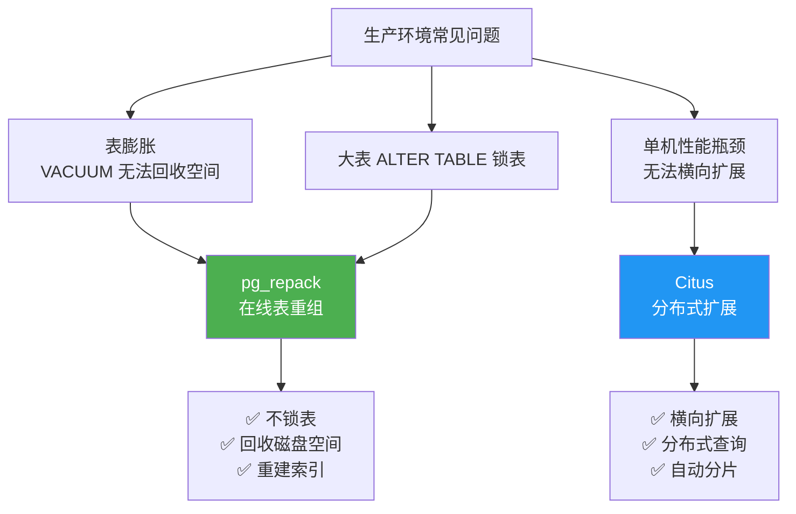
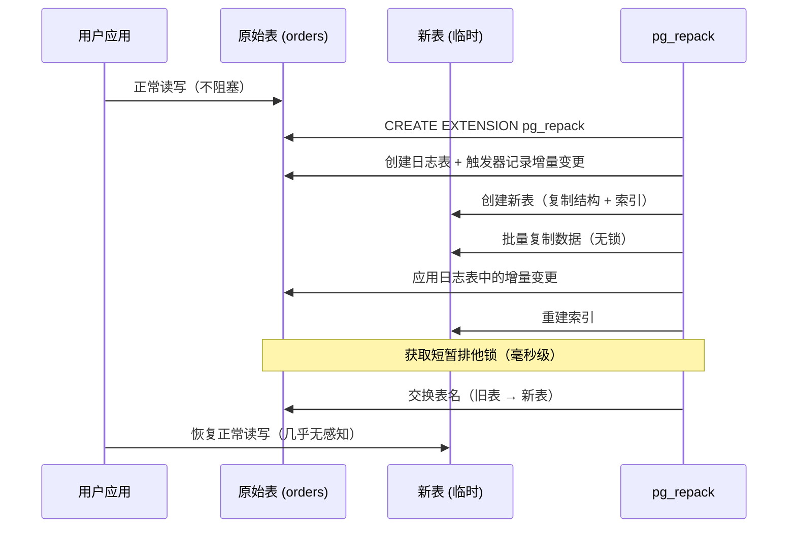
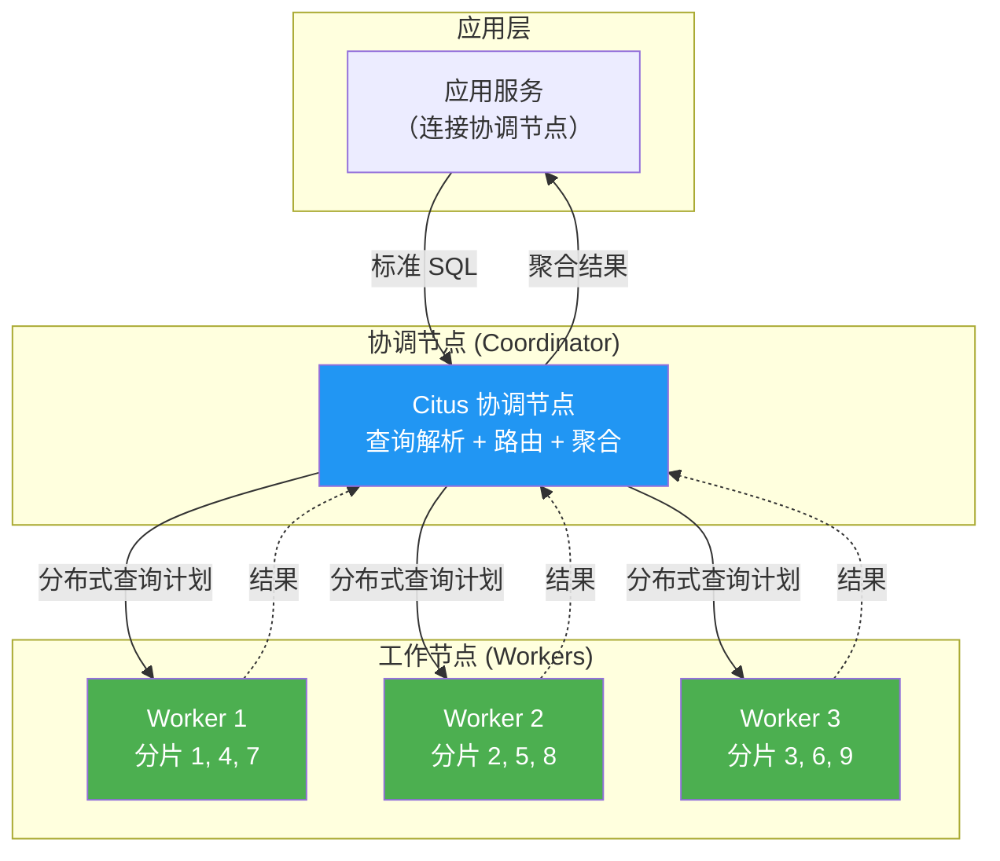
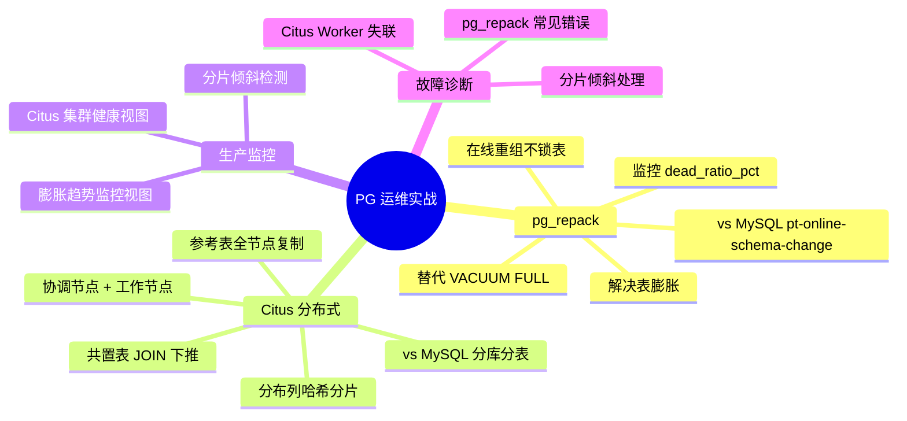

## 前置知识：MySQL 运维者的"安心感"缺失

如果你用过 MySQL，你可能习惯了：
- `pt-online-schema-change` 在线改表结构不锁表
- 分库分表中间件（ShardingSphere / MyCat）处理大数据量

迁移到 PG 后，你会遇到两个核心痛点：
1. **表膨胀**——PG 的 MVCC 产生死元组，表盘越来越大，`VACUUM FULL` 会锁表
2. **单机瓶颈**——PG 单机写能力有限，需要水平扩展

这两个痛点分别由 **pg_repack**（在线表重组）和 **Citus**（分布式扩展）解决。

| 场景 | MySQL 方案 | PostgreSQL 方案 |
|------|-----------|-----------------|
| 在线表重组 | `pt-online-schema-change` (Percona Toolkit) | `pg_repack` 扩展 |
| 分布式 / 分片 | 分库分表 / Group Replication / Vitess | `Citus` 扩展 |



---

## 第一部分：pg_repack — 在线表重组

### 1.1 什么是表膨胀（Bloat）

PostgreSQL 的 MVCC 机制下，`UPDATE` 和 `DELETE` 会在数据页中留下死元组（dead tuple）。虽然 `autovacuum` 会把这些空间标记为可重用，但**不会把空间还给操作系统**，因此表和索引文件可能持续增长，这种现象叫**膨胀（Bloat）**。

### 1.2 与 MySQL InnoDB 的对比

| 维度 | PostgreSQL | MySQL InnoDB |
|------|-----------|--------------|
| 旧版本存储 | 数据页内（死元组） | undo log |
| 清理机制 | autovacuum / VACUUM | purge 线程 |
| 空间回收 | `VACUUM FULL`（锁表）/ `pg_repack`（在线） | `OPTIMIZE TABLE` / `ALTER TABLE ... ALGORITHM=INPLACE` |
| 在线重组工具 | `pg_repack` | `pt-online-schema-change` |

> [!important] 核心问题
> `VACUUM FULL` 可以释放磁盘空间，但会获取 **AccessExclusiveLock**，阻塞所有读写。生产环境大表绝对不能用。

### 1.3 pg_repack vs VACUUM FULL

| 对比维度 | VACUUM FULL | pg_repack |
|---------|-------------|-----------|
| **锁表** | ❌ AccessExclusiveLock（阻塞所有读写） | ✅ 仅短暂排他锁（毫秒级） |
| **释放磁盘** | ✅ 完整释放 | ✅ 完整释放 |
| **阻塞读写** | 🔴 全程阻塞 | 🟢 99% 时间不阻塞 |
| **生产可用** | ❌ 仅维护窗口 | ✅ 随时可用 |
| **额外空间** | 需要双倍空间 | 需要双倍空间 |
| **索引处理** | 重建所有索引 | 重建所有索引 |

### 1.4 pg_repack 工作原理



**关键点**：
- 全程只在最后阶段获取**毫秒级排他锁**，99% 时间不阻塞读写
- 需要额外磁盘空间（约等于原表大小）
- 表必须有主键或唯一索引（用于增量同步）
- 可以指定 `-j N` 并行加速

### 1.5 安装与配置

```bash
# 1. 安装 pg_repack（Ubuntu/Debian）
sudo apt-get install postgresql-14-pg-repack

# 2. 安装 pg_repack（CentOS/RHEL）
sudo yum install pg_repack_14

# 3. 在数据库中启用扩展
psql -d mydb -c "CREATE EXTENSION IF NOT EXISTS pg_repack;"

# 4. 验证安装
pg_repack --version
# 预期输出：pg_repack 1.5.0
```

**前置要求**：
- PostgreSQL 10+
- 表必须有主键或唯一约束（NOT NULL 列）
- 需要 `superuser` 或 `pg_repack` 角色权限

### 1.6 常用命令行选项

```bash
# 重组指定表
pg_repack -d mydb -t public.orders

# 重组整个数据库（慎用，WAL 压力很大）
pg_repack -d mydb

# 仅重组索引（不重组表数据）
pg_repack -d mydb -t public.orders --only-indexes

# 并行重组（指定并行度）
pg_repack -d mydb -t public.orders -j 4

# 并发重组多张表
pg_repack -d mydb -t users -t orders -t products -j 4

# 控制锁等待超时（单位秒，0=无限等待）
pg_repack -d mydb -t public.orders --wait-timeout=60
```

### 1.7 生产注意事项

| 注意点 | 说明 |
|--------|------|
| WAL 压力 | `pg_repack` 会生成大量 WAL，主从复制延迟可能增加 |
| 磁盘空间 | 需要额外 1-2 倍表大小的临时空间 |
| 触发器开销 | 重组期间原表上的触发器会带来额外开销 |
| 长事务 | 不要在长事务期间运行 `pg_repack`（会阻塞交换表名） |
| 主键要求 | 表必须有主键或唯一索引（NOT NULL 列） |
| TOAST 表 | pg_repack 重组表时会连 TOAST 表一起重组，无需单独处理（TOAST 表也不能单独用 `-t` 指定） |

### 1.8 pg_repack 实战练习（5 个任务）

#### 🟢 任务 1：识别膨胀表

```sql
-- 查询膨胀最严重的 10 张表
SELECT
    schemaname,
    tablename,
    pg_size_pretty(pg_total_relation_size(schemaname||'.'||tablename)) AS total_size,
    n_dead_tup AS dead_tuples,
    n_live_tup AS live_tuples,
    ROUND(n_dead_tup::numeric / NULLIF(n_live_tup + n_dead_tup, 0) * 100, 2) AS dead_ratio_pct,
    last_autovacuum
FROM pg_stat_user_tables
WHERE n_dead_tup > 1000  -- 只关注死元组 > 1000 的表
ORDER BY dead_ratio_pct DESC
LIMIT 10;
-- 预期输出：列出膨胀最严重的表，dead_ratio_pct > 20% 需要重组
```

**验收标准**：
- [ ] 查询成功返回膨胀最严重的 10 张表
- [ ] `dead_ratio_pct` 计算正确
- [ ] 能解释 `n_live_tup` 和 `n_dead_tup` 的含义

#### 🟢 任务 2：模拟表膨胀 + 检测

```sql
-- 1. 创建测试表并插入数据
CREATE TABLE products_test (
    id SERIAL PRIMARY KEY,
    name TEXT NOT NULL,
    price NUMERIC(10,2),
    updated_at TIMESTAMPTZ DEFAULT now()
);

-- 插入 1000 行
INSERT INTO products_test (name, price)
SELECT 'Product ' || g, (random() * 1000)::numeric(10,2)
FROM generate_series(1, 1000) g;

-- 2. 模拟大量 UPDATE 产生死元组
DO $$
DECLARE i INT;
BEGIN
    FOR i IN 1..10 LOOP
        UPDATE products_test SET price = price * 1.01, updated_at = now();
        -- 每次 UPDATE 产生 1000 个死元组
    END LOOP;
END $$;

-- 3. 检查死元组数量
SELECT
    tablename,
    n_live_tup AS live_tuples,
    n_dead_tup AS dead_tuples,
    ROUND(100.0 * n_dead_tup / NULLIF(n_live_tup + n_dead_tup, 0), 2) AS dead_ratio_pct
FROM pg_stat_user_tables
WHERE tablename = 'products_test';
-- 预期输出：dead_tuples = 10000，dead_ratio_pct > 90%
```

**验收标准**：
- [ ] 成功创建测试表并插入数据
- [ ] UPDATE 后死元组数量明显增加
- [ ] `dead_ratio_pct` 计算正确

#### 🟡 任务 3：使用 pg_repack 在线重组

```bash
# 1. 查看重组前表大小
psql -d mydb -c "SELECT pg_size_pretty(pg_total_relation_size('products_test'));"
# 预期输出：约 1-2 MB（含大量死元组膨胀）

# 2. 执行在线重组（命令行）
pg_repack -d mydb -t public.products_test -j 4
# 预期输出：
#   INFO: repacking table "public.products_test"
#   LOG: (query) CREATE TABLE repack.repack_table_16384 ...
#   LOG: (query) CREATE TRIGGER repack_trigger ...
#   LOG: (query) INSERT INTO repack.repack_table_16384 SELECT * FROM public.products_test
#   INFO: finished repacking table "public.products_test"

# 3. 验证重组后大小
psql -d mydb -c "SELECT pg_size_pretty(pg_total_relation_size('products_test'));"
# 预期输出：明显缩小（死元组被清理）
```

**验收标准**：
- [ ] 重组过程中能正常查询 `products_test` 表
- [ ] 重组后表大小明显减小
- [ ] 能说出 pg_repack 的三个注意事项（WAL 压力、磁盘空间、触发器开销）

#### 🟡 任务 4：仅重组索引

```bash
# 只重建索引（不重组表数据）——适用于索引膨胀但表不膨胀
pg_repack -d mydb -t public.products_test --only-indexes

# 验证索引重建后大小
psql -d mydb -c "SELECT indexname, pg_size_pretty(pg_relation_size(schemaname||'.'||indexname)) FROM pg_indexes WHERE tablename = 'products_test';"
```

**验收标准**：
- [ ] 成功仅重建索引
- [ ] 能解释什么时候需要只重建索引（索引膨胀但表不膨胀）
- [ ] 索引重建后大小有变化

#### 🔴 任务 5：批量检测 + 自动重组脚本

```sql
-- 编写函数：检测所有膨胀率 > 30% 的表，输出 pg_repack 命令
CREATE OR REPLACE FUNCTION generate_pg_repack_commands(
    threshold_pct NUMERIC DEFAULT 30
) RETURNS TABLE(cmd TEXT) AS $$
BEGIN
    RETURN QUERY
    SELECT 'pg_repack -d ' || current_database()
           || ' -t ' || schemaname || '.' || tablename
           || ' -j 4 --wait-timeout=60' AS cmd
    FROM pg_stat_user_tables
    WHERE n_live_tup > 0
      AND (100.0 * n_dead_tup / (n_live_tup + n_dead_tup)) > threshold_pct
    ORDER BY n_dead_tup DESC;
END;
$$ LANGUAGE plpgsql;

-- 执行：生成所有需要重组的表的命令
SELECT * FROM generate_pg_repack_commands(30);
-- 预期输出：列出所有需要重组的表的 pg_repack 命令

-- 定时执行（使用 pg_cron 扩展）
-- 注意：这样配置的定时任务只是"定期生成命令清单"（结果可从 cron.job_run_details 查看）；
-- pg_repack 是外部二进制，无法在数据库内启动，实际执行需在外部运行命令
-- （如 shell 脚本 + 系统 crontab / CI 流水线调用 pg_repack）
SELECT cron.schedule('auto-repack', '0 3 * * *',
    $$SELECT * FROM generate_pg_repack_commands(30)$$);
```

**验收标准**：
- [ ] 函数正确输出需要重组的表列表
- [ ] 能解释为什么设置 `--wait-timeout=60`（避免长时间等待锁）
- [ ] 能配置定时任务自动生成重组清单（注意：pg_cron 只产出命令清单，实际 `pg_repack` 需在外部执行）

---

## 第二部分：Citus — 分布式 PostgreSQL

### 2.1 为什么需要 Citus

当单台 PostgreSQL 服务器的 CPU / 内存 / 磁盘成为瓶颈时：
- **垂直扩展**：升级到更强的机器，成本高，有上限
- **读写分离**：主从复制，但写压力仍在主库
- **Citus 分布式扩展**：把数据水平分片（sharding）到多个节点，对应用透明

### 2.2 与 MySQL 的对比

| 场景 | MySQL 方案 | PostgreSQL + Citus 方案 |
|------|-----------|------------------------|
| 分库分表 | 应用层拆分 / ShardingSphere / Vitess | `Citus` 扩展，SQL 透明 |
| 读写分离 | 主从复制 + 读写分离中间件 | Coordinator + Worker 天然读写分离 |
| 分布式事务 | 分库分表后难以保证 | 支持跨分片 2PC 事务 |
| 水平扩展 | 复杂，需要应用改造 | `citus_add_node` 添加节点 |
| 查询路由 | 中间件层解析 | Citus 协调节点自动路由 |

> [!warning] MySQL 迁移者注意
> Citus 的协调节点和 Worker 都是**完整的 PG 实例**，每个节点都可以独立查询。这意味着你不需要像 MySQL 分库分表那样在应用层维护路由逻辑——Citus 自动处理。

### 2.3 Citus 架构



**核心概念**：
- **协调节点（Coordinator）**：接收查询，生成分布式执行计划，路由到 Worker，聚合结果
- **工作节点（Worker）**：存储分片数据，执行本地查询
- **分片（Shard）**：表的数据按分布列哈希分片，每个分片是一个普通 PG 表
- **参考表（Reference Table）**：小表（如国家/城市），在所有节点复制，避免跨节点 JOIN
- **共置表（Co-located）**：两张表按同一列分片，JOIN 时自动下推到 Worker 本地执行

### 2.4 安装与配置

```bash
# 1. 安装 Citus（Ubuntu/Debian）——每个节点都需要
sudo apt-get install postgresql-14-citus

# 2. 在 postgresql.conf 中加载扩展
echo "shared_preload_libraries = 'citus'" | sudo tee -a /etc/postgresql/14/main/postgresql.conf

# 3. 重启 PostgreSQL
sudo systemctl restart postgresql
```

```sql
-- 4. 在协调节点创建扩展
CREATE EXTENSION IF NOT EXISTS citus;

-- 5. 添加工作节点（在协调节点执行）
SELECT citus_add_node('192.168.1.101', 5432);
SELECT citus_add_node('192.168.1.102', 5432);

-- 6. 验证集群状态
SELECT * FROM citus_get_active_worker_nodes();
-- 预期输出：
--  node_name  | node_port
-- ------------+-----------
--  192.168.1.101 | 5432
--  192.168.1.102 | 5432
```

### 2.5 分布式表创建

```sql
-- 场景：电商订单表，按 user_id 分片
CREATE TABLE orders (
    order_id BIGSERIAL,
    user_id INT NOT NULL,
    product_name TEXT,
    amount NUMERIC(10,2),
    created_at TIMESTAMPTZ DEFAULT now(),
    PRIMARY KEY (order_id, user_id)  -- 分布键必须包含在主键中
);

-- 将表转为分布式表（按 user_id 哈希分片，默认 32 个分片）
SELECT create_distributed_table('orders', 'user_id');

-- 插入数据（自动路由到正确 Worker）
INSERT INTO orders (user_id, product_name, amount)
VALUES
    (1, 'iPhone', 6999.00),
    (2, 'MacBook', 12999.00),
    (3, 'iPad', 4999.00);

-- 单分片查询：按分片键过滤，效率最高
SELECT * FROM orders WHERE user_id = 1;

-- 跨分片聚合：Citus 自动并行查询 + 聚合
SELECT user_id, SUM(amount) AS total_amount
FROM orders
GROUP BY user_id
ORDER BY total_amount DESC;
```

### 2.6 参考表（Reference Table）

```sql
-- 创建参考表——小表在所有节点复制，避免跨节点 JOIN
CREATE TABLE cities (
    city_id INT PRIMARY KEY,
    city_name TEXT NOT NULL,
    province TEXT
);

-- 转为参考表（自动复制到所有 Worker）
SELECT create_reference_table('cities');

-- 插入数据（自动复制到所有 Worker）
INSERT INTO cities VALUES
    (1, '北京', '北京'),
    (2, '上海', '上海'),
    (3, '深圳', '广东');

-- 分布式表 JOIN 参考表——无需跨节点数据传输
SELECT o.order_id, o.product_name, c.city_name
FROM orders o
JOIN cities c ON o.user_id % 3 + 1 = c.city_id
LIMIT 10;
-- 预期：JOIN 在每个 Worker 本地执行，无网络开销
```

### 2.7 共置表（Co-location）

```sql
-- 创建与 orders 共置的 order_items 表（同一分片键 user_id）
CREATE TABLE order_items (
    order_id BIGINT,
    user_id INT NOT NULL,
    product_id INT,
    quantity INT,
    PRIMARY KEY (order_id, user_id)
);

SELECT create_distributed_table('order_items', 'user_id');

-- 当两张表按同一列分片时，Citus 会自动下推 JOIN 到 Worker 本地
SELECT o.user_id, o.order_id, oi.product_id, oi.quantity
FROM orders o
JOIN order_items oi ON o.order_id = oi.order_id AND o.user_id = oi.user_id
WHERE o.user_id = 5;
-- 预期：JOIN 在单个 Worker 上执行，性能与单机相同
```

### 2.8 分片策略选择

| 分片策略 | 适用场景 | 示例 |
|----------|---------|------|
| 哈希分片（Hash） | 按用户/租户均匀分布 | `create_distributed_table('orders', 'user_id')` |
| 追加分片（Append） | 时序数据，只增不改 | `create_distributed_table('logs', 'created_at', 'append')` |

**分片键选择原则**：
1. **高基数**：值多，分布均匀（如 user_id 好于 gender）
2. **常用查询条件**：按分片键查询走单分片，性能最高
3. **JOIN 共置**：关联表用同一分片键，JOIN 下推到 Worker
4. **写入均匀**：避免热点（如自增 ID 在追加场景会导致倾斜）

### 2.9 Citus 实战练习（5 个任务）

#### 🟢 任务 1：创建分布式表并验证分片分布

```sql
-- 1. 创建分布式表
CREATE TABLE shop_orders (
    order_id BIGSERIAL,
    user_id INT NOT NULL,
    product_name TEXT NOT NULL,
    amount NUMERIC(10,2) NOT NULL,
    status TEXT DEFAULT 'pending',
    created_at TIMESTAMPTZ DEFAULT now(),
    PRIMARY KEY (order_id, user_id)
);

SELECT create_distributed_table('shop_orders', 'user_id');

-- 2. 批量插入 1000 条订单（自动分布到多个 Worker）
INSERT INTO shop_orders (user_id, product_name, amount)
SELECT
    (random() * 1000)::INT,
    'Product ' || g,
    (random() * 1000)::NUMERIC(10,2)
FROM generate_series(1, 1000) g;

-- 3. 验证数据分布
SELECT count(*) FROM shop_orders;
-- 预期输出：1000 行（分布在多个 Worker 上）

-- 4. 查看分片分布
SELECT shardid, nodename, nodeport, shard_size
FROM citus_shards
WHERE table_name = 'shop_orders'::regclass
ORDER BY shardid;
-- 预期输出：32 个分片分布在 2 个 Worker 上
```

**验收标准**：
- [ ] 成功创建分布式表
- [ ] 1000 条数据均匀分布到多个 Worker
- [ ] 能解释为什么选择 `user_id` 作为分片键（高基数 + 常用查询条件）

#### 🟡 任务 2：参考表 + 分布式查询

```sql
-- 1. 创建参考表
CREATE TABLE products_ref (
    product_id INT PRIMARY KEY,
    product_name TEXT NOT NULL,
    price NUMERIC(10,2)
);

SELECT create_reference_table('products_ref');

INSERT INTO products_ref VALUES
    (1, 'iPhone', 6999.00),
    (2, 'MacBook', 12999.00),
    (3, 'iPad', 4999.00);

-- 2. 分布式表 JOIN 参考表（本地执行，无网络开销）
SELECT so.order_id, so.user_id, pr.product_name, so.amount
FROM shop_orders so
JOIN products_ref pr ON so.user_id % 3 + 1 = pr.product_id
LIMIT 10;
-- 预期：JOIN 在每个 Worker 本地执行

-- 3. 聚合查询（Coordinator 汇总各 Worker 结果）
SELECT user_id, COUNT(*) AS order_count, SUM(amount) AS total
FROM shop_orders
GROUP BY user_id
ORDER BY total DESC
LIMIT 10;
```

**验收标准**：
- [ ] 成功创建参考表
- [ ] JOIN 查询正确返回结果
- [ ] 能解释参考表的作用（避免跨节点 JOIN）

#### 🟡 任务 3：共置表 JOIN

```sql
-- 1. 创建与 shop_orders 共置的 order_items 表
CREATE TABLE order_items (
    order_id BIGINT,
    user_id INT NOT NULL,
    product_id INT,
    quantity INT,
    PRIMARY KEY (order_id, user_id)
);

SELECT create_distributed_table('order_items', 'user_id');

-- 2. 插入测试数据
INSERT INTO order_items (order_id, user_id, product_id, quantity)
SELECT g, (g % 1000) + 1, (g % 3) + 1, (random() * 5)::INT + 1
FROM generate_series(1, 1000) g;

-- 3. 共置表 JOIN（自动下推到 Worker 本地）
SELECT so.user_id, so.order_id, oi.product_id, oi.quantity
FROM shop_orders so
JOIN order_items oi ON so.order_id = oi.order_id AND so.user_id = oi.user_id
WHERE so.user_id = 5;
-- 预期：JOIN 在单个 Worker 上执行，性能与单机相同
```

**验收标准**：
- [ ] 成功创建共置表
- [ ] JOIN 查询正确返回结果
- [ ] 能解释"共置"的含义和好处（同一分片键 → JOIN 下推 → 无跨节点开销）

#### 🔴 任务 4：分片管理（扩缩容）

```sql
-- 1. 查看当前分片分布
SELECT nodename, nodeport, count(*) AS shard_count,
       pg_size_pretty(sum(shard_size)) AS total_size
FROM citus_shards
GROUP BY nodename, nodeport
ORDER BY total_size DESC;

-- 2. 添加新 Worker 节点
SELECT citus_add_node('192.168.1.103', 5432);

-- 3. 重新平衡分片（不锁表，逐步迁移）
SELECT rebalance_table_shards('shop_orders');

-- 4. 验证分片重新分布
SELECT nodename, nodeport, count(*) AS shard_count,
       pg_size_pretty(sum(shard_size)) AS total_size
FROM citus_shards
GROUP BY nodename, nodeport
ORDER BY total_size DESC;
-- 预期输出：3 个 Worker 分片均匀分布
```

**验收标准**：
- [ ] 成功添加新 Worker 节点
- [ ] 重新平衡后分片均匀分布
- [ ] 能解释 rebalance 的过程（不锁表、逐步迁移）

#### 🔴 任务 5：设计多租户 SaaS 数据模型

```sql
-- 场景：SaaS 平台，每个租户 (tenant_id) 数据隔离
-- 使用 Citus 的 tenant_id 分片实现物理隔离

-- 1. 创建租户表（参考表，小表全量复制）
CREATE TABLE tenants (
    tenant_id INT PRIMARY KEY,
    tenant_name TEXT NOT NULL
);
SELECT create_reference_table('tenants');

-- 2. 创建租户订单表（按 tenant_id 分片）
CREATE TABLE tenant_orders (
    tenant_id INT NOT NULL,
    order_id BIGSERIAL,
    order_data JSONB,
    created_at TIMESTAMPTZ DEFAULT now(),
    PRIMARY KEY (tenant_id, order_id)
);
SELECT create_distributed_table('tenant_orders', 'tenant_id');

-- 3. 插入多租户数据
INSERT INTO tenants VALUES (1, 'Tenant A'), (2, 'Tenant B');
INSERT INTO tenant_orders (tenant_id, order_data)
VALUES
    (1, '{"item": "Laptop", "price": 9999}'),
    (1, '{"item": "Mouse", "price": 299}'),
    (2, '{"item": "Monitor", "price": 2999}');

-- 4. 查询——Citus 自动路由到 tenant_id=1 的 Worker
SELECT * FROM tenant_orders WHERE tenant_id = 1;
-- 预期：只查询一个 Worker，性能与单机相同（无跨节点开销）
```

**验收标准**：
- [ ] 成功创建多租户数据模型
- [ ] 单租户查询只访问一个 Worker
- [ ] 能解释为什么按 tenant_id 分片（同一租户数据在同一 Worker，查询不跨节点）
- [ ] 能对比 MySQL 分库分表方案（Citus 对应用透明，无需改 SQL）

---

## 第三部分：监控仪表板

### 3.1 pg_repack 监控视图

```sql
-- 首次使用前创建 monitor 模式（§3.1/3.2 的监控视图都放在该模式下）
CREATE SCHEMA IF NOT EXISTS monitor;

-- 表膨胀监控视图（建议每日执行）
CREATE OR REPLACE VIEW monitor.table_bloat_monitor AS
SELECT
    schemaname || '.' || tablename AS table_name,
    pg_size_pretty(pg_total_relation_size(schemaname||'.'||tablename)) AS total_size,
    n_dead_tup AS dead_tuples,
    n_live_tup AS live_tuples,
    ROUND(n_dead_tup::numeric / NULLIF(n_live_tup + n_dead_tup, 0) * 100, 2) AS dead_ratio_pct,
    CASE
        WHEN n_dead_tup::numeric / NULLIF(n_live_tup + n_dead_tup, 0) > 0.2 THEN '🔴 需要重组'
        WHEN n_dead_tup::numeric / NULLIF(n_live_tup + n_dead_tup, 0) > 0.1 THEN '🟡 建议重组'
        ELSE '🟢 正常'
    END AS status,
    last_autovacuum
FROM pg_stat_user_tables
WHERE n_live_tup > 0
ORDER BY dead_ratio_pct DESC;

-- 查询需要重组的表
SELECT * FROM monitor.table_bloat_monitor WHERE status != '🟢 正常';
```

### 3.2 Citus 集群监控视图

```sql
-- 集群健康状态
CREATE OR REPLACE VIEW monitor.citus_cluster_health AS
SELECT
    nodename AS worker_node,
    nodeport AS port,
    pg_size_pretty(sum(shard_size)) AS total_shard_size,
    count(*) AS shard_count,
    CASE
        WHEN count(*) = 0 THEN '🔴 无分片'
        ELSE '🟢 正常'
    END AS status
FROM citus_shards
GROUP BY nodename, nodeport;

SELECT * FROM monitor.citus_cluster_health;

-- 分片倾斜检测（某个 Worker 数据量过大）
SELECT nodename, nodeport,
       pg_size_pretty(sum(shard_size)) AS total_size,
       count(*) AS shard_count
FROM citus_shards
GROUP BY nodename, nodeport
-- 注意：按原始字节数排序，不能按 total_size 排——pg_size_pretty 返回 text，
-- 按字典序排会出现 9750 kB 排在 10 GB 之前这类错误
ORDER BY sum(shard_size) DESC;
-- 预期输出：各 Worker 数据量相近，如差距 > 20% 说明分片倾斜
```

---

## 第四部分：故障诊断

### 4.1 pg_repack 常见错误

| 错误信息 | 原因 | 解决方案 |
|---------|------|---------|
| `ERROR: relation "repack" does not exist` | 未安装扩展 | `CREATE EXTENSION pg_repack;` |
| `ERROR: table "xxx" does not have a primary key` | 表没有主键 | 添加主键或唯一索引（NOT NULL 列） |
| `ERROR: must be superuser to use pg_repack` | 权限不足 | 使用 superuser 或授予 `pg_repack` 角色 |
| `ERROR: could not open relation with OID xxx` | 表已被删除 | 重新运行 pg_repack |

### 4.2 Citus 常见错误

| 错误信息 | 原因 | 解决方案 |
|---------|------|---------|
| `ERROR: distribution column must be part of the primary key` | 分片键不在主键中 | 将分片键加入主键 |
| `ERROR: cannot create unique constraint...` | 唯一约束不包含分片键 | 唯一约束必须包含分片键 |
| `ERROR: could not connect to worker node` | Worker 节点不可达 | 检查网络连接和 Worker 状态 |
| 查询性能下降 | 分片倾斜 | `SELECT rebalance_table_shards('表名')` 重新平衡 |

### 4.3 Worker 节点失联处理

```sql
-- 检查 Worker 节点状态
SELECT * FROM citus_get_active_worker_nodes();

-- 临时移除失联的 Worker
SELECT citus_remove_node('192.168.1.102', 5432);

-- 恢复后重新添加
SELECT citus_add_node('192.168.1.102', 5432);

-- 重新平衡分片
SELECT rebalance_table_shards('shop_orders');
```

---

## 第五部分：生产迁移 Checklist

| 步骤 | MySQL 习惯 | PostgreSQL 做法 |
|------|------------|-----------------|
| 大表 DDL | `pt-online-schema-change` | `pg_repack` / `REINDEX CONCURRENTLY` |
| 膨胀监控 | 无（InnoDB 不膨胀） | 监控 `pg_stat_user_tables.n_dead_tup` |
| 水平扩展 | 分库分表 / Vitess | `Citus` 分布式表 |
| 分布式主键 | 全局 ID 生成器 | 分片键必须包含在主键中 |
| 扩容 | 重新分片 | `citus_add_node` + `rebalance_table_shards` |
| 分布式 JOIN | 反规范化 | 共置表（同一分片键） |

---

## 常见陷阱

> [!warning] 迁移陷阱
> 1. **TOAST 表会随主表一起重组**：pg_repack 重组主表时连 TOAST 表一并处理，空间同样会被回收；TOAST 表不是普通表，不能单独用 `-t` 指定重组
> 2. **Citus 外键支持范围要记清**：支持 分布式表 → 参考表、共置的分布式表之间（外键须包含分布列）、参考表之间的外键；不支持非共置分布式表之间及跨节点外键（仅这类场景才需在应用层保证一致性）
> 3. **Citus 分片键一旦确定很难改**：选择分片键前务必和业务对齐
> 4. **pg_repack 会占用大量 WAL**：生产环境低峰期执行，并监控复制延迟
> 5. **Citus 的 Coordinator 是单点**：生产需对 Coordinator 做高可用
> 6. **pg_repack 需要额外磁盘空间**：约等于原表大小，提前检查可用空间

---

## 本章知识总结



---

## 🎯 本文学完自检

| 层次 | 检查项 |
|------|--------|
| 🟢 基础 | 能说出 pg_repack 和 VACUUM FULL 的区别；能说出 Citus 的协调节点和 Worker 的职责 |
| 🟡 进阶 | 能写出检测表膨胀的 SQL 查询；能创建分布式表并验证数据分布；能创建共置表 JOIN |
| 🔴 挑战 | 能设计多租户 SaaS 数据模型并评估性能；能编写批量检测膨胀表的自动化脚本；能处理 Worker 失联和分片倾斜故障 |

---

## ⚡ 30 秒速记卡片

| # | 正面（问题） | 背面（答案） |
|---|-------------|-------------|
| F1 | pg_repack 作用？ | 在线重组表，不锁表，替代 VACUUM FULL |
| F2 | pg_repack vs VACUUM FULL？ | pg_repack 在线可生产使用；VACUUM FULL 锁表仅维护用 |
| F3 | pg_repack 原理？ | 影子表+触发器+数据拷贝+原子切换+删除旧表 |
| F4 | 何时用 pg_repack？ | 死元组比例 > 20% 且普通 VACUUM 无法回收空间 |
| F5 | pg_repack 监控？ | `pg_stat_user_tables.n_dead_tup / n_live_tup > 0.2` |
| F6 | Citus 是什么？ | PG 分布式扩展，协调节点+Worker 节点，分片键哈希分布 |
| F7 | 分布式表 vs 参考表？ | 分布式表按分片键分布；参考表全节点复制 |
| F8 | 共置表好处？ | 同一分片键 JOIN 自动下推到 Worker 本地，无跨节点开销 |
| F9 | 分片键选择原则？ | 高基数 / 常用查询条件 / JOIN 共置 / 写入均匀 |
| F10 | 分片倾斜怎么办？ | `SELECT rebalance_table_shards('表名')` 重新平衡 |

---

## 相关笔记

- ⬅️ 前置：[[06-存储过程与函数对比]]、[[05-事务与并发控制]]（MVCC 和 VACUUM 原理）
- ⬅️ 前置：[[04-索引与查询优化]]（索引重建原理）
- 🔗 关联：[[09-面试高频20问-MySQL背景版]]（Q13 VACUUM、Q18 扩展生态）
- 🔗 关联：[[00-PostgreSQL 总览索引（MySQL 迁移版）]]
- 🔗 审查：[[reviews/01-结构审查报告]]、[[reviews/02-技术校验报告]]、[[reviews/03-体验优化报告]]

---
*最后更新：2026-07-24*