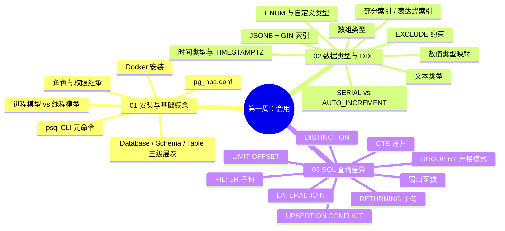

## 第一周知识图谱



---

## 自测清单

### 安装与基础概念

- [ ] 能说出 PostgreSQL 与 MySQL 在架构上的 3 个核心差异（多进程 vs 多线程、无可插拔引擎、autovacuum）
- [ ] 能用 Docker 启动 PostgreSQL 并连接（`docker run -e POSTGRES_PASSWORD`）
- [ ] 能列出 5 个常用 psql 元命令（`\l`、`\dt`、`\d`、`\du`、`\di`）
- [ ] 能创建角色、配置继承关系、授予 schema 级权限
- [ ] 能用 `pg_stat_activity` 查看连接并终止查询

### 数据类型

- [ ] 能完成 5 个核心类型映射：AUTO_INCREMENT→SERIAL、JSON→JSONB、ENUM 内联→CREATE TYPE、UNSIGNED→CHECK、DATETIME→TIMESTAMPTZ
- [ ] 能说出 JSONB 与 JSON 的区别（二进制存储、GIN 索引、查询性能）
- [ ] 能用 JSONB 操作符：`->>`、`@>`、`?`
- [ ] 能用数组操作：`ANY()`、`@>`、`unnest()`
- [ ] 能说出 TIMESTAMPTZ 与 TIMESTAMP 的区别（时区处理）

### SQL 语法

- [ ] 能改写 5 个核心语法差异：`LIMIT a,b`→`LIMIT b OFFSET a`、`ON DUPLICATE KEY`→`ON CONFLICT`、`INSERT IGNORE`→`ON CONFLICT DO NOTHING`、`LAST_INSERT_ID()`→`RETURNING`、宽松 GROUP BY→严格 GROUP BY
- [ ] 能用 RETURNING 子句获取插入/更新/删除后的数据
- [ ] 能写出递归 CTE 查询层级结构
- [ ] 能用窗口函数：`ROW_NUMBER()`、`RANK()`、`LAG()`、`LEAD()`
- [ ] 能用 UPSERT 实现幂等写入

---

## 综合练习：电商系统基础迁移

```sql
-- 目标：将 MySQL 电商表结构迁移到 PostgreSQL
-- 涉及知识点：01 安装 + 02 类型 + 03 SQL

-- 原 MySQL 表：
-- CREATE TABLE products (
--     id INT(11) AUTO_INCREMENT PRIMARY KEY,
--     name VARCHAR(100) NOT NULL,
--     price DECIMAL(10,2) NOT NULL,
--     is_active TINYINT(1) DEFAULT 1,
--     specs JSON,
--     tags VARCHAR(255),
--     status ENUM('draft','published') DEFAULT 'draft',
--     created_at DATETIME DEFAULT CURRENT_TIMESTAMP,
--     updated_at DATETIME DEFAULT CURRENT_TIMESTAMP ON UPDATE CURRENT_TIMESTAMP
-- );

-- 请写出 PostgreSQL 迁移版本，要求：
-- 1. 类型映射正确
-- 2. 用 JSONB 替代 JSON
-- 3. 用数组替代 tags 逗号字符串
-- 4. ENUM 先创建类型
-- 5. 创建触发器实现 ON UPDATE
-- 6. 创建合适的索引
```

---

## 自测选择题（5 题）

**1. PostgreSQL 的默认端口是？**
- A. 3306
- B. 5432 ✅
- C. 6379
- D. 8080

**2. 以下哪个 MySQL 语法在 PostgreSQL 中不支持？**
- A. `LIMIT 10 OFFSET 5`
- B. `LIMIT 5, 10` ✅（逗号语法不支持）
- C. `FETCH FIRST 5 ROWS ONLY`
- D. `ORDER BY col DESC LIMIT 1`

**3. PostgreSQL 中 `->` 和 `->>` 的区别是？**
- A. 没有区别
- B. `->` 返回 JSONB，`->>` 返回 TEXT ✅
- C. `->` 返回 TEXT，`->>` 返回 JSONB
- D. 两者都返回 INTEGER

**4. PostgreSQL 的数组下标从几开始？**
- A. 0
- B. 1 ✅
- C. -1
- D. 可配置

**5. 以下哪个不是 PostgreSQL 独有的索引类型？**
- A. GIN
- B. GiST
- C. BRIN
- D. 聚簇索引 ✅（PG 没有 MySQL 的聚簇索引）

---

## 编码练习

```sql
-- 题目：写出以下 MySQL 查询的 PostgreSQL 等价版本
-- 原 MySQL：
-- INSERT INTO users (name, email) VALUES ('Alice', 'alice@test.com')
-- ON DUPLICATE KEY UPDATE name = VALUES(name);
-- SELECT * FROM users WHERE created_at >= '2026-01-01' LIMIT 0, 10;
```

---

## 分级反馈表

| 你的得分 | 建议 |
|----------|------|
| 选择题全对 + 编码练习正确 | ✅ 可以直接进入第二周 |
| 选择题错 1-2 题 | 回顾 [[01-安装与基础概念对比]] 和 [[03-SQL查询语法差异与进阶]] 相关章节 |
| 选择题错 3+ 题 | 建议重新学习 01-03 全部笔记 |
| 综合练习无法完成 | 从 [[02-数据类型与DDL对比]] 重新开始，重点练类型映射 |

---

## 参考答案

### 综合练习参考答案

```sql
-- 1. 先创建 ENUM 类型
CREATE TYPE product_status AS ENUM ('draft', 'published');

-- 2. 建表（类型映射 + JSONB + 数组 + TIMESTAMPTZ）
CREATE TABLE products (
    id SERIAL PRIMARY KEY,
    name VARCHAR(100) NOT NULL,
    price NUMERIC(10,2) NOT NULL,
    is_active BOOLEAN DEFAULT TRUE,
    specs JSONB DEFAULT '{}',
    tags TEXT[] DEFAULT '{}',
    status product_status DEFAULT 'draft',
    created_at TIMESTAMPTZ DEFAULT NOW(),
    updated_at TIMESTAMPTZ DEFAULT NOW()
);

-- 3. 触发器实现 ON UPDATE
CREATE OR REPLACE FUNCTION update_updated_at()
RETURNS TRIGGER AS $$
BEGIN NEW.updated_at = NOW(); RETURN NEW; END;
$$ LANGUAGE plpgsql;

CREATE TRIGGER trg_products_updated
    BEFORE UPDATE ON products
    FOR EACH ROW EXECUTE FUNCTION update_updated_at();

-- 4. 索引
CREATE INDEX idx_products_specs ON products USING GIN (specs);
CREATE INDEX idx_products_tags ON products USING GIN (tags);
CREATE INDEX idx_products_active ON products (name) WHERE is_active = true;
```

### 编码练习参考答案

```sql
-- UPSERT
INSERT INTO users (name, email)
VALUES ('Alice', 'alice@test.com')
ON CONFLICT (email) DO UPDATE SET name = EXCLUDED.name;

-- 分页
SELECT * FROM users WHERE created_at >= '2026-01-01'
ORDER BY created_at LIMIT 10 OFFSET 0;
```

---

## 相关笔记

- ⬅️ 本阶段：[[01-安装与基础概念对比]] | [[02-数据类型与DDL对比]] | [[03-SQL查询语法差异与进阶]]
- ➡️ 下一阶段：[[01-学习/PostgresqlLearningByMySql/99-第二周复习检查点|99-第二周复习检查点]]

---
*最后更新：2026-07-24*