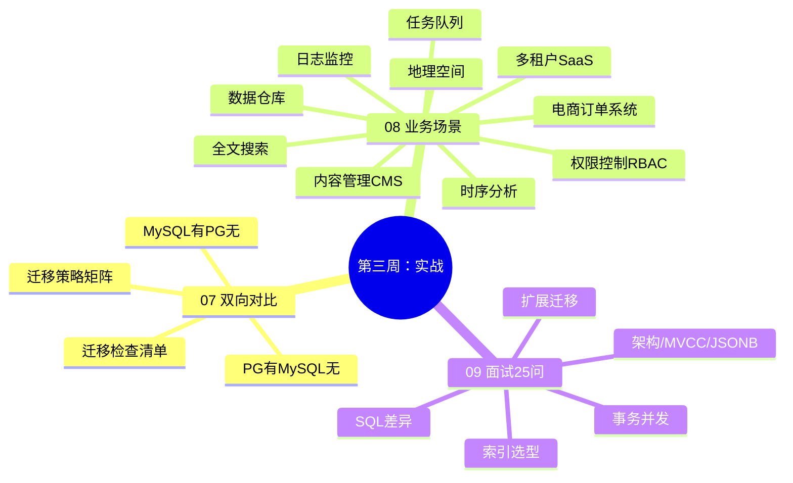

## 第三周知识图谱



---

## 自测清单

### 双向对比

- [ ] 能列出 10 个"MySQL 有，PG 没有"的特性及替代方案
- [ ] 能列出 10 个"PG 有，MySQL 没有"的特性
- [ ] 能构建迁移策略矩阵（直接迁移 / 改写迁移 / 方案替换 / 功能降级 / 能力增强）
- [ ] 能评估项目的迁移复杂度（表结构、SQL、函数、索引、运维）

### 实战场景

- [ ] 能完成 5 个核心场景的迁移：电商订单、内容管理CMS、日志监控、任务队列、数据仓库
- [ ] 能说出每个场景的迁移要点（类型映射、索引选择、SQL 改写）
- [ ] 能设计完整系统的迁移方案

### 面试准备

- [ ] 能回答 10 个高频面试题（带 MySQL 对比）
- [ ] 能用黄金三段式回答（先结论 → 再展开 → 再补充生产经验）
- [ ] 能说出迁移的核心步骤（类型映射 → SQL 改写 → 函数改写 → 索引重建 → 运维适配）

---

## 综合练习：完整系统迁移方案

```
目标：为一个电商系统设计 MySQL → PostgreSQL 迁移方案
涉及的表：users、products（含 JSON 规格）、orders、order_items、logs

要求：
1. 列出每个表的 PG 类型映射
2. 指出哪些索引需要调整/新增
3. 说明事务/并发控制策略
4. 说明 JSONB 和分区表如何应用
5. 写出迁移检查清单
6. 列出 5 个最容易踩的坑
```

---

## 自测选择题（5 题）

**1. 以下哪个 MySQL 特性在 PostgreSQL 中需要用触发器实现？**
- A. 主键自增
- B. 外键约束
- C. `ON UPDATE CURRENT_TIMESTAMP` ✅
- D. 唯一索引

**2. PostgreSQL 的 Advisory Lock 主要用于？**
- A. 替代行锁
- B. 应用层分布式协调 ✅
- C. 表级锁
- D. 死锁检测

**3. MySQL 的 `INSERT IGNORE` 在 PostgreSQL 中的等价写法是？**
- A. `INSERT ... RETURNING`
- B. `INSERT ... ON CONFLICT DO NOTHING` ✅
- C. `INSERT ... ON CONFLICT DO UPDATE`
- D. `INSERT ... SKIP LOCKED`

**4. 以下哪个场景最适合用 PostgreSQL 的 BRIN 索引？**
- A. JSONB 查询
- B. 数组包含查询
- C. 时序/日志大表的时间范围查询 ✅
- D. 全文搜索

**5. PostgreSQL 的物化视图与普通视图的区别是？**
- A. 没有区别
- B. 物化视图缓存查询结果，需手动刷新 ✅
- C. 普通视图更快
- D. 物化视图不能建索引

---

## 编码练习

```sql
-- 题目：写出以下 MySQL 查询的 PostgreSQL 迁移版本
-- 原 MySQL：
-- SELECT * FROM products
-- WHERE JSON_EXTRACT(specs, '$.brand') = 'Apple'
-- AND is_active = 1
-- ORDER BY created_at DESC
-- LIMIT 10, 20;
```

---

## 分级反馈表

| 你的得分 | 建议 |
|----------|------|
| 全部正确 + 完成迁移方案 | ✅ 可以开始毕业项目 v1→v5 |
| 错 1-2 题 | 回顾 [[07-双向对比-MySQL有PG无与PG有MySQL无]] |
| 错 3+ 题 | 重新学习 07-09，重点理解双向差异 |
| 迁移方案无法完成 | 从 [[08-业务场景实战合集]] 逐场景练习 |

---

## 参考答案

### 综合练习参考答案

```
1. 类型映射
   users: INT→SERIAL, TINYINT(1)→BOOLEAN, DATETIME→TIMESTAMPTZ
   products: JSON→JSONB, VARCHAR(255) tags→TEXT[], ENUM→CREATE TYPE
   orders: 同上 + status ENUM
   order_items: 同上
   logs: 按月分区, BRIN 索引

2. 索引调整
   products: JSONB GIN 索引、tags GIN 索引、部分索引 WHERE is_active=true
   orders: 复合索引 (user_id, created_at)、部分索引 WHERE status='pending'
   logs: BRIN 索引 (log_time)、GIN 索引 (context)

3. 事务策略
   库存扣减用 SELECT FOR UPDATE + EXCEPTION
   订单创建用事务 + RETURNING
   默认 Read Committed，关键业务用 Repeatable Read

4. JSONB 和分区应用
   products.specs 用 JSONB + GIN 索引
   logs 按月分区 + BRIN 索引

5. 迁移检查清单
   [ ] 类型映射完成
   [ ] SQL 语法改写（LIMIT/UPSERT/GROUP BY）
   [ ] 索引重建（GIN/BRIN/部分索引）
   [ ] 触发器实现 ON UPDATE
   [ ] VACUUM 配置
   [ ] PgBouncer 连接池
   [ ] pg_dump 备份策略
   [ ] pg_stat_statements 监控

6. 5 个最常见的坑
   1. 把 LIMIT a,b 带到 PG（会报错）
   2. 用 JSON 而非 JSONB（查询慢 10 倍）
   3. 忘记 VACUUM（表膨胀）
   4. 把 database 当 schema 用（跨库查询失败）
   5. 默认隔离级别不同（PG=RC, MySQL=RR）
```

### 编码练习参考答案

```sql
SELECT * FROM products
WHERE specs->>'brand' = 'Apple'
  AND is_active = TRUE
ORDER BY created_at DESC
LIMIT 20 OFFSET 10;
```

---

## 相关笔记

- ⬅️ 本阶段：[[07-双向对比-MySQL有PG无与PG有MySQL无]] | [[08-业务场景实战合集]] | [[09-面试高频20问-MySQL背景版]]
- ➡️ 下一步：[[v1-环境搭建与基础查询迁移]]

---
*最后更新：2026-07-24*