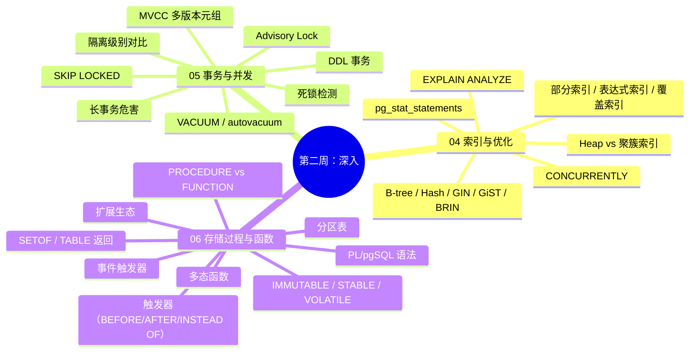

## 第二周知识图谱



---

## 自测清单

### 索引与查询优化

- [ ] 能说出 PostgreSQL 5 种索引类型及其适用场景：B-tree、Hash、GIN、GiST、BRIN
- [ ] 能解读 EXPLAIN ANALYZE 输出的关键指标：cost、rows、actual time、Buffers、Rows Removed by Filter
- [ ] 能说出 4 种扫描类型：Seq Scan、Index Scan、Index Only Scan、Bitmap Heap Scan
- [ ] 能创建部分索引（`CREATE INDEX ... WHERE condition`）
- [ ] 能创建覆盖索引（`CREATE INDEX ... INCLUDE (col)`）
- [ ] 能说出生产建索引的注意事项（`CONCURRENTLY` 不锁表）

### 事务与并发控制

- [ ] 能解释 PostgreSQL 的 MVCC 原理（多版本共存于数据页）
- [ ] 能说出 PG 的 Repeatable Read 是无锁快照隔离、天然防幻读（MySQL RR 快照读同样防幻读，锁定读靠 next-key 锁防）
- [ ] 能用 `pg_stat_activity` 查询和 `pg_terminate_backend` 终止长事务
- [ ] 能解释 VACUUM 的作用（清理死元组）
- [ ] 能说出 `VACUUM` 与 `VACUUM FULL` 的区别（不锁表 vs 锁表重写）
- [ ] 能用 SKIP LOCKED 实现队列消费
- [ ] 能用 Advisory Lock 实现分布式锁

### 存储过程与函数

- [ ] 能说出 PROCEDURE 与 FUNCTION 的核心差异（PROCEDURE 可控制事务）
- [ ] 能创建 PL/pgSQL 函数（`CREATE FUNCTION ... LANGUAGE plpgsql`）
- [ ] 能创建触发器（`CREATE TRIGGER ... FOR EACH ROW EXECUTE FUNCTION`）
- [ ] 能创建审计触发器（记录 INSERT/UPDATE/DELETE 前后数据）
- [ ] 能说出 3 个常用扩展：pg_stat_statements、PostGIS、pg_partman
- [ ] 能创建范围分区表并验证分区裁剪

---

## 综合练习：索引优化 + 事务控制

```sql
-- 目标：为订单系统设计索引和事务控制策略
-- 场景：高并发库存扣减 + 订单创建

-- 要求：
-- 1. 为 orders 表创建合适的索引（包括部分索引）
-- 2. 写一个安全的库存扣减函数（事务 + 异常处理）
-- 3. 写一个 SKIP LOCKED 队列消费函数
```

---

## 自测选择题（5 题）

**1. PostgreSQL 的索引膨胀主要由什么导致？**
- A. 索引创建过多
- B. MVCC 死元组未清理 ✅
- C. 索引列数据类型变化
- D. 表统计信息过期

**2. 以下哪个操作在 PostgreSQL 的 FUNCTION 中不允许？**
- A. 执行 SELECT
- B. 执行 UPDATE
- C. 执行 COMMIT / ROLLBACK ✅
- D. 返回 SETOF

**3. PostgreSQL 的 `VACUUM` 和 `VACUUM FULL` 的区别是？**
- A. 没有区别
- B. VACUUM 不锁表但只标记空间可重用，VACUUM FULL 锁表但回收磁盘给 OS ✅
- C. VACUUM 锁表，VACUUM FULL 不锁表
- D. VACUUM 只清理索引，VACUUM FULL 清理表和索引

**4. PostgreSQL 的 `CREATE INDEX CONCURRENTLY` 的作用是？**
- A. 加速索引创建
- B. 创建索引时不阻塞写入 ✅
- C. 自动创建覆盖索引
- D. 并行创建多个索引

**5. PostgreSQL 的 Repeatable Read 隔离级别与 MySQL 相比？**
- A. 更弱（不防幻读）
- B. 两者 RR 快照读都防幻读；差异在机制——PG 是无锁快照隔离，MySQL 锁定读（当前读）靠 next-key 锁防幻读 ✅
- C. 完全一致
- D. PG 不支持 Repeatable Read

---

## 编码练习

```sql
-- 题目：写一个 PL/pgSQL 函数，实现安全的库存扣减
-- 要求：
-- 1. 使用 SELECT FOR UPDATE 锁定行
-- 2. 检查库存是否充足
-- 3. 使用 EXCEPTION 处理异常
-- 4. 返回操作结果
```

---

## 分级反馈表

| 你的得分 | 建议 |
|----------|------|
| 全部正确 | ✅ 可以直接进入第三周 |
| 错 1-2 题 | 回顾 [[04-索引与查询优化]] 和 [[05-事务与并发控制]] |
| 错 3+ 题 | 重新学习 04-06，重点理解 MVCC 和索引选型 |
| 综合练习无法完成 | 从 [[05-事务与并发控制]] 重新开始 |

---

## 参考答案

### 综合练习参考答案

```sql
-- 1. 索引设计
CREATE INDEX idx_orders_user_created ON orders (user_id, created_at DESC);
CREATE INDEX idx_orders_status_pending ON orders (created_at) WHERE status = 'pending';

-- 2. 安全库存扣减函数
CREATE OR REPLACE FUNCTION deduct_stock(p_product_id INT, p_qty INT)
RETURNS TEXT AS $$
DECLARE
    v_stock INT;
BEGIN
    SELECT stock INTO v_stock FROM products WHERE id = p_product_id FOR UPDATE;
    IF v_stock IS NULL THEN RETURN 'Product not found'; END IF;
    IF v_stock < p_qty THEN RETURN 'Insufficient stock'; END IF;
    UPDATE products SET stock = stock - p_qty WHERE id = p_product_id;
    RETURN 'Success';
EXCEPTION
    WHEN OTHERS THEN RETURN 'Error: ' || SQLERRM;
END;
$$ LANGUAGE plpgsql;

-- 3. 队列消费函数
CREATE OR REPLACE FUNCTION consume_tasks(p_worker TEXT, p_limit INT DEFAULT 10)
RETURNS TABLE (id INT, task_type TEXT) AS $$
BEGIN
    RETURN QUERY
    UPDATE task_queue SET status = 'processing'
    WHERE id IN (
        SELECT id FROM task_queue WHERE status = 'pending'
        ORDER BY created_at LIMIT p_limit FOR UPDATE SKIP LOCKED
    ) RETURNING task_queue.id, task_queue.task_type;
END;
$$ LANGUAGE plpgsql;
```

---

## 相关笔记

- ⬅️ 本阶段：[[04-索引与查询优化]] | [[05-事务与并发控制]] | [[06-存储过程与函数对比]]
- ➡️ 下一阶段：[[01-学习/PostgresqlLearningByMySql/99-第三周复习检查点|99-第三周复习检查点]]

---
*最后更新：2026-07-24*