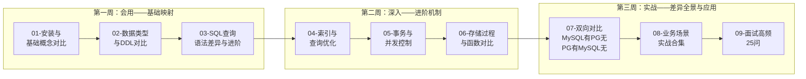

# PostgreSQL 学习路径（MySQL 迁移版）

> 🐘 你已掌握 MySQL，这份路径帮你以 MySQL 为认知锚点，快速迁移到 PostgreSQL。
> 不是从零讲一遍，而是告诉你：**哪些一样、哪些不同、哪些是 PostgreSQL 独有的武器。**

---

## 适合谁

- ✅ 已熟练使用 MySQL（能写 CRUD、懂索引、理解事务、写过存储过程）
- ✅ 想系统学习 PostgreSQL，不想从零开始
- ✅ 希望理解两者的核心差异，而不是背语法

## 你需要准备什么

| 准备项 | 说明 |
|--------|------|
| 环境 | PostgreSQL 16+（推荐用 Docker 安装） |
| 工具 | psql（必装）+ DBeaver / pgAdmin / DataGrip（任选其一） |
| 时间 | 约 27 小时（3 周，每周 9 小时） |
| 前置知识 | MySQL 基础（SELECT、JOIN、索引、事务、存储过程） |

---

## 学习路线（三周递进）

### 三周递进目标

| 阶段 | 目标 | 检验标准 |
|------|------|---------|
| **第一周** | 能在 PG 上完成日常 CRUD 操作 | 独立完成数据类型迁移和常用查询 |
| **第二周** | 理解 PG 的索引、事务、存储过程机制 | 能解释两者差异并写出对应代码 |
| **第三周** | 能应对生产场景和面试 | 完成毕业项目 + 模拟面试全对 |

---

## 课程清单

| 编号 | 笔记 | 核心内容 | 建议学时 |
|------|------|---------|---------|
| 00 | [[00-PostgreSQL 总览索引（MySQL 迁移版）]] | 课程清单、学习路线、环境准备、核心概念对照表 | 0.5h |
| 01 | [[01-安装与基础概念对比]] | Docker 安装、psql vs mysql CLI、进程架构、角色权限 | 2h |
| 02 | [[02-数据类型与DDL对比]] | 类型映射、建表、约束、序列、JSONB、数组 | 3h |
| 03 | [[03-SQL查询语法差异与进阶]] | SQL 方言、RETURNING、CTE、窗口函数、GROUP BY 严格模式 | 3.5h |
| 04 | [[04-索引与查询优化]] | B-tree/Hash/GIN/GiST/BRIN、EXPLAIN ANALYZE、优化技巧 | 4h |
| 05 | [[05-事务与并发控制]] | MVCC、隔离级别、行锁/表锁、死锁、VACUUM | 4h |
| 06 | [[06-存储过程与函数对比]] | PL/pgSQL、触发器、自定义函数、扩展生态 | 3h |
| 07 | [[07-双向对比-MySQL有PG无与PG有MySQL无]] | 双向特性差异全景、迁移策略矩阵 | 3h |
| 08 | [[08-业务场景实战合集]] | 10 大生产场景完整迁移代码 | 4h |
| 09 | [[09-面试高频20问-MySQL背景版]] | 黄金三段式 + MySQL 对比 + 加分点 | 3h |

---

## 角色导航

| 你的 MySQL 背景 | 推荐路线 | 预计学时 |
|---------------|---------|---------|
| 🟢 MySQL 日常 CRUD 开发者 | 全部 9 篇，01-02 重点学 | 27h |
| 🟡 MySQL DBA / 运维 | 01 速览 → 04/05 重点 → 07 深入 → 08/09 补充 | 20-24h |
| 🔴 MySQL 高级开发者（存储过程+优化） | 01-03 速览 → 04-07 重点 → 08/09 | 22h |

---

## 毕业项目（v1→v5）

通过 5 个版本递进，将一个 MySQL 项目逐步迁移到 PostgreSQL：

| 版本 | 改造维度 | MySQL 锚点 | 验收标准 | 难度 |
|------|---------|------------|---------|------|
| [[v1-环境搭建与基础查询迁移]] | 环境搭建 + 基础 CRUD | mysql 命令行 → psql + 基础 SQL | 全表 CRUD 在 PG 跑通 | ⭐⭐ |
| [[v2-数据类型与DDL迁移]] | 类型迁移 + 建表 + 约束 | INT/AUTO_INCREMENT → SERIAL/GENERATED | DDL 完整迁移 + 约束对齐 | ⭐⭐⭐ |
| [[v3-查询与索引优化]] | 查询改写 + 索引策略 | BTREE → B-tree/GIN/BRIN + EXPLAIN | EXPLAIN 达到预期扫描路径 | ⭐⭐⭐ |
| [[v4-事务与并发控制]] | 事务模型 + 并发写入 | 隔离级别 + 行锁 → MVCC + 死锁处理 | 并发场景零死锁 + 正确隔离 | ⭐⭐⭐⭐ |
| [[v5-存储过程与触发器迁移]] | 存储过程 + 触发器 | PROCEDURE → PL/pgSQL 函数 | PL/pgSQL 等价实现 + 触发器对齐 | ⭐⭐⭐⭐ |

---

*最后更新：2026-07-24*